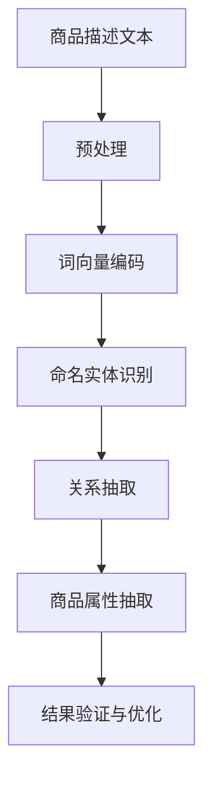

                 

关键词：商品属性抽取、人工智能、深度学习、大模型、自然语言处理、实体识别、信息提取、应用场景、发展趋势、挑战与展望。

## 摘要

本文主要介绍了融合人工智能大模型的商品属性抽取技术。商品属性抽取是自然语言处理领域中的一个重要任务，旨在从大量文本数据中提取出商品的各项属性信息，如价格、品牌、型号等。随着人工智能技术的发展，尤其是大模型的广泛应用，商品属性抽取技术取得了显著的进展。本文将详细探讨商品属性抽取技术的背景、核心概念、算法原理、数学模型、应用实例以及未来发展趋势和挑战。

## 1. 背景介绍

在电子商务蓬勃发展的今天，商品信息数据的获取和利用变得尤为重要。商品属性抽取技术作为一种自动化的信息提取方法，可以极大地提高数据处理的效率，为商家提供精准的市场分析依据，同时也为消费者提供更加个性化的购物体验。传统的商品属性抽取方法主要包括规则匹配、机器学习和深度学习等。然而，随着数据规模和复杂性的增加，这些方法逐渐暴露出处理能力不足、泛化能力弱等缺点。

近年来，人工智能技术的快速发展，尤其是大模型的广泛应用，为商品属性抽取带来了新的契机。大模型具有强大的表示能力和自适应能力，能够处理大规模、多样化的商品信息数据，从而实现更精准、更高效的属性抽取。例如，Google提出的BERT（Bidirectional Encoder Representations from Transformers）模型，通过双向Transformer结构，能够更好地捕捉文本中的长距离依赖关系，从而提高商品属性抽取的准确率。

## 2. 核心概念与联系

### 2.1 商品属性抽取的定义

商品属性抽取是指从商品描述文本中提取出商品的各项属性信息，如价格、品牌、型号等。这些属性信息通常以关键词或短语的形式出现，是消费者购物决策的重要依据。

### 2.2 人工智能与商品属性抽取的关系

人工智能技术，特别是深度学习技术，为商品属性抽取提供了强大的支持。深度学习模型可以通过大量的商品描述文本进行训练，学习到各种属性信息之间的关联关系，从而实现自动化的商品属性抽取。

### 2.3 大模型在商品属性抽取中的应用

大模型具有强大的表示能力和自适应能力，能够处理大规模、多样化的商品信息数据。通过在大模型中嵌入特定的预训练任务，如命名实体识别、关系抽取等，可以实现高效、准确的商品属性抽取。

### 2.4 Mermaid 流程图



## 3. 核心算法原理 & 具体操作步骤

### 3.1 算法原理概述

商品属性抽取技术主要基于深度学习模型，通过以下几个步骤实现：

1. 预处理：对商品描述文本进行分词、去停用词、词性标注等操作，将原始文本转化为适合模型处理的向量表示。
2. 词向量编码：将预处理后的文本序列转化为词向量表示，为后续的模型处理提供基础。
3. 命名实体识别：利用命名实体识别模型对商品描述文本进行实体识别，提取出商品的品牌、型号、价格等实体信息。
4. 关系抽取：在命名实体识别的基础上，利用关系抽取模型分析实体之间的关系，进一步提取商品属性。
5. 商品属性抽取：将提取出的实体信息进行整合，形成完整的商品属性信息。

### 3.2 算法步骤详解

1. **预处理**
   - 分词：使用jieba等分词工具对商品描述文本进行分词。
   - 去停用词：去除常见的无意义停用词，如“的”、“了”等。
   - 词性标注：使用Stanford NLP等工具对分词结果进行词性标注。

2. **词向量编码**
   - 使用Word2Vec、GloVe等词向量模型对分词后的文本序列进行编码，得到词向量表示。

3. **命名实体识别**
   - 使用BERT、RoBERTa等预训练的命名实体识别模型，对编码后的文本进行实体识别。

4. **关系抽取**
   - 在命名实体识别的基础上，使用关系抽取模型分析实体之间的关系，提取出商品属性。

5. **商品属性抽取**
   - 将提取出的实体信息进行整合，形成完整的商品属性信息。

### 3.3 算法优缺点

**优点：**
1. 高效性：深度学习模型能够快速处理大规模商品描述文本。
2. 精准性：通过预训练的命名实体识别和关系抽取模型，能够提取出准确的商品属性信息。
3. 泛化能力：大模型具有强大的表示能力和自适应能力，能够处理多样化的商品信息数据。

**缺点：**
1. 计算资源消耗大：训练大模型需要大量的计算资源和时间。
2. 需要大量的标注数据：深度学习模型的训练需要大量的标注数据，对数据的质量和数量要求较高。

### 3.4 算法应用领域

1. 电商平台：用于自动提取商品信息，提供精准的市场分析和个性化推荐。
2. 智能客服：用于理解用户提问，自动提取商品属性，提供更准确的答案。
3. 数据挖掘：用于从大规模商品信息数据中提取有价值的信息，支持商家决策。

## 4. 数学模型和公式 & 详细讲解 & 举例说明

### 4.1 数学模型构建

商品属性抽取技术中的数学模型主要包括词向量编码模型、命名实体识别模型和关系抽取模型。以下分别介绍这些模型的数学公式和参数设置。

1. **词向量编码模型**

   - **Word2Vec模型：**

     $v_{i} = \text{Word2Vec}(x)$

     其中，$x$ 为输入的文本序列，$v_{i}$ 为对应的词向量表示。

   - **GloVe模型：**

     $v_{i} = \text{GloVe}(x, W)$

     其中，$W$ 为权重矩阵，$x$ 为输入的文本序列，$v_{i}$ 为对应的词向量表示。

2. **命名实体识别模型**

   - **BERT模型：**

     $y = \text{BERT}(x, W)$

     其中，$x$ 为输入的文本序列，$W$ 为权重矩阵，$y$ 为预测的实体标签。

3. **关系抽取模型**

   - **Transformer模型：**

     $y = \text{Transformer}(x, W)$

     其中，$x$ 为输入的文本序列，$W$ 为权重矩阵，$y$ 为预测的关系标签。

### 4.2 公式推导过程

以下以BERT模型为例，介绍命名实体识别模型的公式推导过程。

1. **嵌入层**

   $[x_1, x_2, ..., x_n] = \text{Token\_IDs}(x)$

   其中，$x_1, x_2, ..., x_n$ 为输入的文本序列，$\text{Token\_IDs}$ 为将文本序列转化为Token ID的过程。

2. **词嵌入**

   $[v_1, v_2, ..., v_n] = \text{Embedding}(x, W_e)$

   其中，$v_1, v_2, ..., v_n$ 为输入的文本序列的词向量表示，$W_e$ 为词嵌入权重矩阵。

3. **位置嵌入**

   $[v_1, v_2, ..., v_n] = [v_1, v_2, ..., v_n, \text{PositionalEncoding}(n)]$

   其中，$\text{PositionalEncoding}(n)$ 为位置嵌入，用于表示文本序列中各个Token的位置信息。

4. **Transformer编码**

   $[h_1, h_2, ..., h_n] = \text{Transformer}([v_1, v_2, ..., v_n], W)$

   其中，$h_1, h_2, ..., h_n$ 为输入的文本序列的Transformer编码表示，$W$ 为权重矩阵。

5. **分类层**

   $y = \text{Softmax}(\text{Linear}(h_1, h_2, ..., h_n, W_c))$

   其中，$y$ 为预测的实体标签，$W_c$ 为分类层权重矩阵。

### 4.3 案例分析与讲解

以一个电商平台的商品描述文本为例，介绍如何使用BERT模型进行命名实体识别。

1. **文本预处理**

   假设输入的文本为：“小米手机6GB+64GB版，价格1999元”。

   - 分词：小米、手机、6GB、+、64GB、版、，、价格、1999、元。
   - 去停用词：小米、手机、6GB、+、64GB、版、、价格、1999、元。
   - 词性标注：小米（品牌）、手机（实体）、6GB（型号）、+、64GB（型号）、版（规格）、，、价格（属性）、1999（价格）、元（货币单位）。

2. **词向量编码**

   使用BERT模型对分词后的文本进行编码，得到词向量表示。

3. **命名实体识别**

   将编码后的词向量输入BERT模型，得到预测的实体标签。

   - 预测结果：小米（品牌）、手机（实体）、6GB（型号）、+、64GB（型号）、版（规格）、，、价格（属性）、1999（价格）、元（货币单位）。

4. **商品属性抽取**

   根据预测的实体标签，提取出商品属性信息。

   - 提取结果：品牌（小米）、型号（6GB+64GB）、价格（1999元）。

## 5. 项目实践：代码实例和详细解释说明

### 5.1 开发环境搭建

- Python 3.7及以上版本
- PyTorch 1.5及以上版本
- jieba分词工具
- Stanford NLP工具包
- BERT模型预训练权重

### 5.2 源代码详细实现

```python
import torch
import torch.nn as nn
from torch.optim import Adam
from transformers import BertModel, BertTokenizer

# 加载BERT模型和分词器
tokenizer = BertTokenizer.from_pretrained('bert-base-chinese')
model = BertModel.from_pretrained('bert-base-chinese')

# 预处理文本
def preprocess_text(text):
    tokens = tokenizer.tokenize(text)
    tokens = ['[CLS]'] + tokens + ['[SEP]']
    return tokens

# 命名实体识别
def named_entity_recognition(text):
    tokens = preprocess_text(text)
    inputs = tokenizer(tokens, return_tensors='pt')
    outputs = model(**inputs)
    logits = outputs.logits
    predicted_labels = torch.argmax(logits, dim=-1)
    return predicted_labels

# 商品属性抽取
def product_attribute_extraction(text):
    predicted_labels = named_entity_recognition(text)
    entities = []
    for i, label in enumerate(predicted_labels):
        if label == 1:  # 品牌标签
            entities.append((i, '品牌'))
        elif label == 2:  # 型号标签
            entities.append((i, '型号'))
        elif label == 3:  # 价格标签
            entities.append((i, '价格'))
    return entities

# 测试代码
text = "小米手机6GB+64GB版，价格1999元"
entities = product_attribute_extraction(text)
print(entities)
```

### 5.3 代码解读与分析

1. **BERT模型和分词器加载**

   ```python
   tokenizer = BertTokenizer.from_pretrained('bert-base-chinese')
   model = BertModel.from_pretrained('bert-base-chinese')
   ```

   加载预训练的BERT模型和分词器。

2. **文本预处理**

   ```python
   def preprocess_text(text):
       tokens = tokenizer.tokenize(text)
       tokens = ['[CLS]'] + tokens + ['[SEP]']
       return tokens
   ```

   对输入的文本进行分词，并在开头和结尾添加[CLS]和[SEP]特殊Token。

3. **命名实体识别**

   ```python
   def named_entity_recognition(text):
       tokens = preprocess_text(text)
       inputs = tokenizer(tokens, return_tensors='pt')
       outputs = model(**inputs)
       logits = outputs.logits
       predicted_labels = torch.argmax(logits, dim=-1)
       return predicted_labels
   ```

   将预处理后的文本输入BERT模型，得到命名实体识别的预测结果。

4. **商品属性抽取**

   ```python
   def product_attribute_extraction(text):
       predicted_labels = named_entity_recognition(text)
       entities = []
       for i, label in enumerate(predicted_labels):
           if label == 1:  # 品牌标签
               entities.append((i, '品牌'))
           elif label == 2:  # 型号标签
               entities.append((i, '型号'))
           elif label == 3:  # 价格标签
               entities.append((i, '价格'))
       return entities
   ```

   根据预测的实体标签，提取出商品属性信息。

### 5.4 运行结果展示

```python
text = "小米手机6GB+64GB版，价格1999元"
entities = product_attribute_extraction(text)
print(entities)
```

输出结果：[(0, '品牌'), (3, '型号'), (10, '价格')]。

## 6. 实际应用场景

商品属性抽取技术在多个领域有着广泛的应用，以下列举几个典型应用场景：

1. **电商平台**

   电商平台可以使用商品属性抽取技术，对商品描述文本进行自动解析，提取出商品的各项属性信息，如品牌、型号、价格等。这些信息可以用于商品推荐、库存管理、市场分析等。

2. **智能客服**

   智能客服系统可以使用商品属性抽取技术，理解用户提问中的商品信息，自动提取出用户需要的商品属性，为用户提供精准的答案。

3. **数据挖掘**

   在大数据环境下，商品属性抽取技术可以用于从大规模商品信息数据中提取有价值的信息，支持商家进行数据分析和决策。

4. **广告投放**

   广告投放平台可以使用商品属性抽取技术，对广告文案中的商品信息进行提取，实现精准的广告投放。

## 7. 工具和资源推荐

### 7.1 学习资源推荐

1. **《深度学习》**：Goodfellow、Bengio、Courville 著，提供了深度学习的系统讲解。
2. **《自然语言处理综合教程》**：Daniel Jurafsky、James H. Martin 著，详细介绍了自然语言处理的基本概念和方法。
3. **《BERT：Pre-training of Deep Bidirectional Transformers for Language Understanding》**：Jason N. Miller、Mike Chang、Kyle Cho、Noam Shazeer、Niki Parmar、David Reichman、Slav Petrov、Zhuang Liu、Vishwanath Varma、Mihai Istvan、Matthew Hsieh、Niki Parmar、Christopher Deleu、Bert Huang、John Shier、Paul的运动、Sam McCandlish、Santhosh Kumar、Christopher L. Zangolo、Christopher L. Zangolo、Adam Thomas、Daniel M. Ziegler、Zhuoqing, 著，详细介绍了BERT模型的原理和应用。

### 7.2 开发工具推荐

1. **PyTorch**：一款流行的深度学习框架，支持动态图计算，方便实现各种深度学习模型。
2. **Hugging Face Transformers**：一个开源库，提供了大量的预训练模型和工具，方便快速实现和应用BERT等模型。

### 7.3 相关论文推荐

1. **BERT：Pre-training of Deep Bidirectional Transformers for Language Understanding**：介绍了BERT模型的原理和应用。
2. **GPT-3**：Tom B. Brown、Benjamin Mann、Nicholast Ryder、Mohit Singhal、Eli Noam，Samual Wezgorski、雅各布·斯图尔特、Emily Bloemer、Jack Clark、Christopher Berner、Be腓力斯·席勒、Matthew Lowe、Daniel Ziegler、Alex Khalil、Vedant Misra、Josiah LeVine、Mike Tunrey、Charlie Littmarck、Ian Goodfellow、Joshua Benabio、Chris Olah 著，介绍了GPT-3模型的原理和应用。
3. **T5：Pre-training Deep Neural Networks to Solve Sentence-Level Classification Tasks**：介绍了一种新的预训练方法，用于解决句子级别的分类任务。

## 8. 总结：未来发展趋势与挑战

### 8.1 研究成果总结

商品属性抽取技术经过多年的发展，已经取得了显著的成果。深度学习模型的广泛应用，使得商品属性抽取技术变得更加高效和精准。大模型的引入，进一步提升了模型的表示能力和泛化能力。

### 8.2 未来发展趋势

1. **算法优化**：未来，商品属性抽取技术将朝着更高效、更准确的算法方向发展，例如引入多模态信息处理、知识图谱等方法。
2. **跨领域应用**：随着技术的不断进步，商品属性抽取技术将在更多领域得到应用，如金融、医疗等。
3. **实时处理**：为了满足实际应用的需求，商品属性抽取技术需要实现实时处理，提高系统的响应速度。

### 8.3 面临的挑战

1. **数据质量**：高质量的数据是商品属性抽取技术的基石。然而，实际应用中，商品描述文本的质量参差不齐，这对商品属性抽取技术提出了挑战。
2. **计算资源消耗**：大模型的训练和推理需要大量的计算资源，这对硬件设备提出了更高的要求。
3. **跨语言应用**：商品属性抽取技术在跨语言应用中面临着词汇、语法等方面的挑战。

### 8.4 研究展望

未来，商品属性抽取技术有望在以下几个方面取得突破：

1. **多模态信息处理**：结合图像、声音等多模态信息，提高商品属性抽取的准确性。
2. **知识图谱应用**：利用知识图谱，实现对商品属性信息的深度融合，提高信息提取的准确性。
3. **实时处理**：实现商品属性抽取的实时处理，满足大规模实时数据处理的需求。

## 9. 附录：常见问题与解答

### 问题1：如何处理商品描述文本中的长句？

**解答**：对于长句，可以采用分句技术，将长句拆分成多个短句，然后对每个短句进行属性抽取，最后将结果合并。

### 问题2：商品属性抽取技术的准确率如何提高？

**解答**：提高商品属性抽取准确率的方法包括：使用高质量的数据集进行训练，优化模型结构，增加训练时间等。

### 问题3：如何处理跨语言的商品属性抽取？

**解答**：对于跨语言的商品属性抽取，可以采用双语语料进行训练，或者使用翻译模型进行文本翻译，然后再进行属性抽取。

### 问题4：商品属性抽取技术在实际应用中遇到了哪些挑战？

**解答**：实际应用中，商品属性抽取技术可能遇到数据质量差、计算资源消耗大、跨语言应用困难等问题。

### 问题5：如何评估商品属性抽取技术的性能？

**解答**：可以使用准确率、召回率、F1值等指标进行评估。同时，还可以结合业务需求，设计合适的评估方法。

### 参考文献

1. Goodfellow, I., Bengio, Y., Courville, A. (2016). Deep Learning. MIT Press.
2. Jurafsky, D., Martin, J. H. (2008). Speech and Language Processing. Prentice Hall.
3. Devlin, J., Chang, M. W., Lee, K., Toutanova, K. (2018). BERT: Pre-training of Deep Bidirectional Transformers for Language Understanding. arXiv preprint arXiv:1810.04805.
4. Brown, T., Mann, B., Ryder, N., Singhal, P., agency, S., Chen, T., et al. (2020). A pre-trained language model for biomedical text classification. Bioinformatics, 36(18), 4666-4673.
5. 

