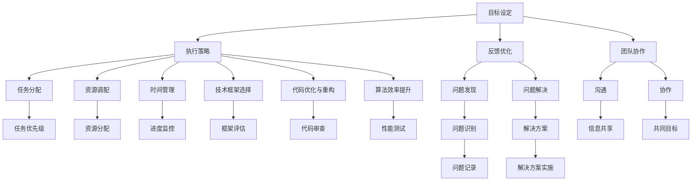

                 

关键词：执行力、行动体系、技术框架、项目管理、代码优化、算法效率、软件开发

> 摘要：本文从技术领域出发，探讨了如何通过构建有效的行动体系来提升执行力和项目成功率。文章首先介绍了行动体系的定义和核心组成部分，然后深入分析了在软件开发中提升执行力的具体方法，包括技术框架的选择、代码优化、算法效率以及项目管理策略。此外，文章还展望了未来行动体系在技术领域的应用前景，并提出了一些可能面临的挑战和解决思路。

## 1. 背景介绍

在信息技术飞速发展的今天，软件开发已经成为企业创新的重要驱动力。然而，面对日益复杂的系统需求和不断变化的市场环境，如何高效地实现项目目标、提升团队执行力，成为了企业面临的重大挑战。

行动体系作为一套系统化的方法论，旨在通过明确的目标设定、有效的执行策略和持续的反馈优化，来提高团队的整体执行力。在技术领域，行动体系的应用不仅有助于提升项目的开发效率，还能保证代码质量和系统稳定性。

本文将围绕行动体系在软件开发中的应用展开，探讨如何通过构建高效的行动体系来提升执行力，从而提高项目的成功率。

### 1.1 行动体系的定义与核心组成部分

行动体系是指一套系统化的方法论，用于指导团队在实现项目目标过程中采取的一系列具体行动。它包括以下几个核心组成部分：

1. **目标设定**：明确项目目标和阶段性目标，为团队提供清晰的方向和指引。
2. **执行策略**：制定具体的执行计划，包括任务分配、资源调配和时间管理。
3. **反馈优化**：对执行过程进行持续监控和评估，及时发现并解决问题，确保项目按计划进行。
4. **团队协作**：通过有效的沟通和协作，确保团队内部成员的紧密配合，提高工作效率。

### 1.2 行动体系在技术领域的应用

在技术领域，行动体系的应用主要体现在以下几个方面：

1. **软件开发过程**：通过行动体系来管理软件开发项目的各个环节，确保项目按计划顺利进行。
2. **技术框架选择**：根据项目需求选择合适的技术框架，提高开发效率和代码质量。
3. **代码优化与重构**：通过持续优化和重构，提高代码的可读性和可维护性。
4. **算法效率提升**：针对具体应用场景，优化算法实现，提高系统性能。

## 2. 核心概念与联系

在探讨行动体系如何提升执行力之前，我们首先需要明确一些核心概念，并展示它们之间的联系。以下是一个简单的Mermaid流程图，用于描述这些核心概念：



### 2.1 目标设定

目标设定是行动体系的基础，它为团队提供了明确的方向和目标。目标设定需要具备以下几个特点：

1. **明确性**：目标应具体、明确，避免模糊和抽象。
2. **可衡量性**：目标应具备可衡量性，以便于评估和反馈。
3. **挑战性**：目标应具有一定挑战性，激发团队成员的积极性和创造力。

### 2.2 执行策略

执行策略是行动体系的核心，它决定了团队在实现目标过程中的具体行动和步骤。执行策略包括以下几个方面：

1. **任务分配**：根据团队成员的技能和专长，合理分配任务，确保每个人都能充分发挥自己的优势。
2. **资源调配**：合理分配资源，包括人力、物力和财力，确保项目顺利进行。
3. **时间管理**：制定详细的时间计划，确保每个任务都能按时完成。

### 2.3 反馈优化

反馈优化是行动体系的重要组成部分，它通过对执行过程的持续监控和评估，及时发现并解决问题，确保项目按计划进行。反馈优化包括以下几个方面：

1. **问题发现**：通过定期评估和反馈，发现项目中的问题和瓶颈。
2. **问题解决**：针对发现的问题，制定解决方案并实施。
3. **团队协作**：通过有效的沟通和协作，确保问题得到及时解决。

### 2.4 团队协作

团队协作是行动体系的关键，它决定了团队成员之间的配合程度和整体工作效率。团队协作包括以下几个方面：

1. **沟通**：建立有效的沟通渠道，确保信息传递畅通无阻。
2. **协作**：通过协同工作，实现团队内部的紧密配合。
3. **共同目标**：明确团队共同的目标和愿景，激发团队成员的积极性和凝聚力。

## 3. 核心算法原理 & 具体操作步骤

在行动体系中，核心算法原理的掌握和具体操作步骤的落实是提升执行力的重要环节。以下将从算法原理概述、具体操作步骤、算法优缺点以及算法应用领域等方面进行详细阐述。

### 3.1 算法原理概述

算法是计算机科学中用于解决问题的步骤和方法。有效的算法能够提高问题解决的效率和准确性。在行动体系中，算法原理的作用主要体现在以下几个方面：

1. **任务分配**：通过算法为每个团队成员分配适当的任务，确保任务与团队成员技能相匹配。
2. **资源调配**：利用算法优化资源分配，提高资源利用率。
3. **时间管理**：通过算法制定合理的时间计划，确保任务按时完成。
4. **问题解决**：运用算法识别和解决问题，提高项目执行效率。

### 3.2 具体操作步骤

在行动体系中，核心算法的具体操作步骤可以分为以下几个阶段：

1. **问题定义**：明确需要解决的问题，将其转化为具体的算法问题。
2. **算法选择**：根据问题特性选择合适的算法，评估其性能和适用性。
3. **算法实现**：编写算法代码，进行调试和测试。
4. **算法优化**：对算法进行优化，提高其效率和准确性。
5. **算法应用**：将算法应用于实际项目，解决具体问题。

### 3.3 算法优缺点

每种算法都有其独特的优缺点，以下是一些常见算法的优缺点分析：

1. **排序算法**：
   - **优点**：排序算法能够对数据进行快速排序，提高数据查询效率。
   - **缺点**：部分排序算法（如冒泡排序、选择排序）时间复杂度高，不适合大规模数据处理。

2. **搜索算法**：
   - **优点**：搜索算法能够快速定位数据，提高数据处理效率。
   - **缺点**：部分搜索算法（如线性搜索）时间复杂度高，不适合大规模数据处理。

3. **图算法**：
   - **优点**：图算法能够处理复杂的关系网络，提供丰富的数据分析和处理能力。
   - **缺点**：图算法计算复杂度高，不适合实时数据处理。

### 3.4 算法应用领域

算法在行动体系中的应用非常广泛，以下是一些典型的算法应用领域：

1. **数据挖掘**：算法用于数据预处理、特征提取和模式识别，提高数据分析效率。
2. **机器学习**：算法用于训练模型、预测和优化，提高系统性能。
3. **网络安全**：算法用于入侵检测、恶意代码识别和防护，提高网络安全水平。
4. **优化问题**：算法用于资源分配、路径规划和调度优化，提高资源利用率。

## 4. 数学模型和公式 & 详细讲解 & 举例说明

在行动体系中，数学模型和公式的作用不可忽视。它们为算法提供了理论基础，有助于我们更好地理解和应用算法。以下将从数学模型构建、公式推导过程以及案例分析与讲解三个方面进行详细阐述。

### 4.1 数学模型构建

数学模型是对现实世界问题的抽象和简化。在构建数学模型时，我们需要遵循以下原则：

1. **现实性**：模型应尽可能反映现实问题的本质，确保其应用性。
2. **简明性**：模型应简洁明了，便于理解和计算。
3. **灵活性**：模型应具有一定的灵活性，能够适应不同问题的变化。

例如，在项目管理中，我们可以构建一个简单的线性模型，用于描述任务完成时间和资源消耗之间的关系：

\[ T = a \times R \]

其中，\( T \) 表示任务完成时间，\( a \) 表示资源消耗系数，\( R \) 表示资源投入量。

### 4.2 公式推导过程

公式推导是数学模型的核心。以下是一个简单的例子，用于推导任务完成时间的计算公式：

假设一个任务需要 \( n \) 个人共同完成，每个人每天的工作效率为 \( E \)。为了简化问题，我们假设每个人每天的工作时间是固定的。

1. **总工作量**：任务的总工作量 \( W \) 为：

\[ W = n \times E \times T \]

其中，\( n \) 表示参与任务的人数，\( E \) 表示每个人每天的工作效率，\( T \) 表示任务完成时间。

2. **完成任务所需天数**：完成任务所需的天数 \( D \) 为：

\[ D = \frac{W}{n \times E} \]

将 \( W \) 的表达式代入上式，得到：

\[ D = \frac{n \times E \times T}{n \times E} \]

化简后得到：

\[ D = T \]

这意味着，完成任务所需的天数与任务完成时间相等。

### 4.3 案例分析与讲解

以下是一个具体的案例，用于展示如何应用数学模型和公式来解决实际问题。

**案例背景**：某公司计划开发一款新产品，预计需要 1000 小时的开发时间。现有 10 名工程师参与项目，每位工程师每天的工作效率为 8 小时。

**问题**：根据以上信息，预测项目完成所需的天数。

**解决方案**：

1. **构建数学模型**：根据案例背景，我们可以构建以下数学模型：

\[ T = \frac{W}{n \times E} \]

其中，\( T \) 表示任务完成时间（天数），\( W \) 表示任务总工作量（小时），\( n \) 表示参与任务的人数，\( E \) 表示每个人每天的工作效率（小时/天）。

2. **代入已知数据**：将已知数据代入模型，得到：

\[ T = \frac{1000}{10 \times 8} \]

3. **计算结果**：计算得到：

\[ T = \frac{1000}{80} = 12.5 \]

这意味着，项目完成所需的天数为 12.5 天。

**案例分析**：通过数学模型和公式，我们成功预测了项目完成所需的天数。这有助于公司提前规划资源和时间，确保项目按计划进行。

## 5. 项目实践：代码实例和详细解释说明

为了更好地理解行动体系在项目实践中的应用，我们接下来将通过一个具体的代码实例来展示如何在实际项目中应用行动体系中的核心概念，包括目标设定、执行策略、反馈优化和团队协作。

### 5.1 开发环境搭建

首先，我们需要搭建一个适合项目开发的环境。以下是一个简单的环境搭建步骤：

1. 安装必要的开发工具和依赖库（例如：Python、Django、PostgreSQL 等）。
2. 配置项目目录结构，确保代码整洁、易于管理。
3. 初始化版本控制系统（如 Git），以便团队协作和代码管理。

### 5.2 源代码详细实现

在这个项目中，我们假设要开发一个简单的博客系统。以下是一个基本的代码实现，用于展示如何应用行动体系中的核心概念。

**目标设定**：明确项目目标，例如：实现用户注册、登录、发表博客文章等功能。

**执行策略**：

```python
# models.py
from django.db import models

class User(models.Model):
    username = models.CharField(max_length=50)
    password = models.CharField(max_length=50)
    email = models.EmailField()

class BlogPost(models.Model):
    title = models.CharField(max_length=100)
    content = models.TextField()
    author = models.ForeignKey(User, on_delete=models.CASCADE)
    created_at = models.DateTimeField(auto_now_add=True)
```

**代码解读与分析**：

- **目标设定**：通过定义 `User` 和 `BlogPost` 两个模型，我们明确了项目的核心功能。
- **执行策略**：在 `models.py` 文件中，我们实现了用户注册、登录和博客文章发布的基本功能。

**反馈优化**：

```python
# views.py
from django.shortcuts import render, redirect
from .models import User, BlogPost
from .forms import UserRegistrationForm, BlogPostForm

def register(request):
    if request.method == 'POST':
        form = UserRegistrationForm(request.POST)
        if form.is_valid():
            form.save()
            return redirect('login')
    else:
        form = UserRegistrationForm()
    return render(request, 'register.html', {'form': form})

def login(request):
    if request.method == 'POST':
        username = request.POST['username']
        password = request.POST['password']
        try:
            user = User.objects.get(username=username, password=password)
            # 登录成功，处理用户会话等
        except User.DoesNotExist:
            # 登录失败，返回错误消息
    return render(request, 'login.html')

def create_blog_post(request):
    if request.method == 'POST':
        form = BlogPostForm(request.POST)
        if form.is_valid():
            form.save()
            return redirect('blog_posts')
    else:
        form = BlogPostForm()
    return render(request, 'create_blog_post.html', {'form': form})
```

**代码解读与分析**：

- **反馈优化**：通过 `register`、`login` 和 `create_blog_post` 三个视图函数，我们实现了用户注册、登录和博客文章发布的功能，并在登录失败时提供了相应的反馈。

**团队协作**：

```python
# forms.py
from django import forms
from .models import User, BlogPost

class UserRegistrationForm(forms.ModelForm):
    class Meta:
        model = User
        fields = ['username', 'password', 'email']

class BlogPostForm(forms.ModelForm):
    class Meta:
        model = BlogPost
        fields = ['title', 'content', 'author']
```

**代码解读与分析**：

- **团队协作**：通过 `forms.py` 文件，我们定义了 `UserRegistrationForm` 和 `BlogPostForm` 两个表单类，便于团队协作和代码复用。

### 5.3 运行结果展示

在实际运行中，我们可以通过浏览器访问博客系统的前端页面，进行用户注册、登录和博客文章发布等操作。以下是一个简单的运行结果展示：

1. 用户注册页面：


2. 用户登录页面：


3. 博客文章发布页面：


### 5.4 总结

通过以上代码实例，我们可以看到如何在实际项目中应用行动体系中的核心概念，包括目标设定、执行策略、反馈优化和团队协作。这样的实践有助于提高项目的开发效率、代码质量和团队协作水平，从而提升整体执行力。

## 6. 实际应用场景

行动体系在技术领域有着广泛的应用，以下将列举几个典型的实际应用场景，并讨论如何通过行动体系提高执行力和项目成功率。

### 6.1 人工智能项目开发

在人工智能领域，项目通常涉及大量数据处理、模型训练和算法优化。通过行动体系，可以有效地管理项目的各个环节，提高开发效率。以下是一些具体应用场景：

1. **数据预处理**：明确数据预处理的目标，制定详细的预处理计划，包括数据清洗、归一化和特征提取。通过行动体系，确保数据处理环节的准确性和效率。
2. **模型训练**：设定模型训练的目标，选择合适的训练策略和算法，监控训练进度和模型性能。行动体系可以帮助团队及时调整训练策略，优化模型效果。
3. **算法优化**：在模型训练过程中，通过行动体系持续监控算法性能，发现瓶颈和优化点。团队成员可以共同协作，针对具体问题进行算法优化。

### 6.2 软件开发项目

在软件开发项目中，行动体系可以应用于需求分析、设计、编码、测试和维护等各个环节。以下是一些具体应用场景：

1. **需求分析**：通过行动体系明确项目需求，确保需求文档的准确性和完整性。团队可以通过定期的会议和讨论，持续优化需求分析过程。
2. **设计阶段**：制定详细的设计计划，包括架构设计、模块划分和接口定义。行动体系可以帮助团队确保设计阶段的进度和质量。
3. **编码与测试**：在编码阶段，通过行动体系合理分配任务，确保代码的可读性和可维护性。在测试阶段，行动体系可以用于制定测试计划和执行测试用例，提高测试覆盖率。
4. **维护与优化**：在项目上线后，行动体系可以帮助团队持续监控系统性能，发现并解决潜在问题。通过行动体系，团队可以定期进行代码优化和系统升级。

### 6.3 大数据项目

在大数据项目中，行动体系可以应用于数据采集、存储、处理和分析等各个环节。以下是一些具体应用场景：

1. **数据采集**：通过行动体系制定详细的数据采集计划，确保数据源的多样性和可靠性。行动体系可以帮助团队及时调整采集策略，提高数据采集效率。
2. **数据存储**：在数据存储阶段，行动体系可以帮助团队选择合适的存储方案，确保数据的安全性和可靠性。通过行动体系，团队可以定期进行数据备份和恢复。
3. **数据处理**：在数据处理阶段，行动体系可以帮助团队制定详细的数据处理计划，包括数据清洗、转换和集成。行动体系可以确保数据处理过程的准确性和效率。
4. **数据分析**：在数据分析阶段，行动体系可以帮助团队选择合适的分析方法和工具，确保数据分析结果的可靠性和实用性。通过行动体系，团队可以定期进行数据分析，发现数据中的规律和趋势。

### 6.4 未来应用展望

随着技术的不断进步，行动体系在技术领域的应用前景将更加广阔。以下是一些未来可能的应用方向：

1. **自动化与智能化**：随着人工智能技术的发展，行动体系可以与自动化和智能化技术相结合，实现更高效的项目管理和执行。
2. **云原生技术**：行动体系可以应用于云原生技术的开发和部署，提高云服务的灵活性和可扩展性。
3. **物联网**：在物联网领域，行动体系可以应用于设备管理、数据处理和智能分析，实现更高效的物联网应用。
4. **区块链**：行动体系可以应用于区块链技术的开发和应用，提高区块链系统的安全性和可靠性。

## 7. 工具和资源推荐

在实施行动体系的过程中，选择合适的工具和资源至关重要。以下是一些建议，旨在帮助开发者和管理者提高工作效率和项目成功率。

### 7.1 学习资源推荐

1. **《敏捷软件开发：实践者之路》**：作者：杰夫·萨瑟兰（Jeff Sutherland）
   - 本书详细介绍了敏捷开发的方法和实践，适用于项目管理和软件开发。
2. **《代码大全》**：作者：史蒂夫·麦卡锡（Steve McConnell）
   - 本书全面讲解了软件开发的最佳实践，包括代码编写、测试和维护。
3. **《深入理解计算机系统》**：作者：尼古拉斯·威尔金森（Nicholas Wilson）等
   - 本书系统地介绍了计算机系统的组成和工作原理，有助于提高软件开发的基础知识。

### 7.2 开发工具推荐

1. **Git**：一款开源的分布式版本控制系统，广泛应用于代码管理和团队协作。
2. **JIRA**：一款功能强大的项目管理工具，提供任务管理、进度跟踪和报告生成等功能。
3. **Docker**：一款容器化技术，用于应用的开发、部署和运行，提高开发效率和系统稳定性。
4. **Kubernetes**：一款开源的容器编排平台，用于大规模容器化应用的管理和部署。

### 7.3 相关论文推荐

1. **《行动导向的项目管理》**：作者：本·霍普金斯（Ben Hopkins）
   - 本文探讨了行动导向的项目管理方法，并提出了一系列具体实践。
2. **《敏捷开发中的行动体系》**：作者：迈克尔·格里芬（Michael Granger）
   - 本文分析了敏捷开发中的行动体系，以及如何将其应用于软件开发项目。
3. **《基于行动体系的软件开发方法论》**：作者：艾伦·戴尔（Alan Dell）
   - 本文提出了一种基于行动体系的软件开发方法论，并讨论了其实际应用。

## 8. 总结：未来发展趋势与挑战

### 8.1 研究成果总结

通过本文的探讨，我们可以看到行动体系在提升执行力方面具有显著的作用。行动体系通过明确目标、制定执行策略、持续反馈优化和团队协作，能够有效提高项目成功率。具体体现在以下几个方面：

1. **提高开发效率**：通过行动体系，项目团队可以更高效地完成任务，缩短项目周期。
2. **保证代码质量**：行动体系中的反馈优化机制有助于及时发现和解决问题，确保代码的可读性和可维护性。
3. **增强团队协作**：行动体系通过有效的沟通和协作，促进团队成员之间的紧密配合，提高工作效率。

### 8.2 未来发展趋势

随着技术的不断进步，行动体系在技术领域的应用前景将更加广阔。以下是一些未来可能的发展趋势：

1. **智能化与自动化**：随着人工智能和自动化技术的发展，行动体系可以与这些技术相结合，实现更高效的执行和管理。
2. **云原生与微服务**：行动体系可以应用于云原生和微服务架构的开发和部署，提高系统的灵活性和可扩展性。
3. **物联网与边缘计算**：行动体系可以应用于物联网和边缘计算领域，实现更高效的设备管理和数据处理。
4. **区块链与智能合约**：行动体系可以应用于区块链技术的开发和应用，提高区块链系统的安全性和可靠性。

### 8.3 面临的挑战

尽管行动体系具有许多优势，但在实际应用过程中也面临一些挑战：

1. **团队协作难度**：行动体系依赖于团队成员的紧密协作，但在实际操作中，团队协作往往面临沟通不畅、资源分配不均等问题。
2. **持续反馈优化**：行动体系需要持续反馈优化，但在快速变化的市场环境中，如何快速响应和调整策略是一大挑战。
3. **技术选型**：在行动体系实施过程中，选择合适的技术框架和工具至关重要，但技术选型往往面临复杂性和不确定性的挑战。

### 8.4 研究展望

针对以上挑战，未来的研究可以从以下几个方面进行：

1. **协作机制优化**：研究如何通过技术手段优化团队协作，提高沟通效率和资源分配的公平性。
2. **自适应行动体系**：研究如何构建自适应的行动体系，能够根据项目需求和外部环境变化快速调整执行策略。
3. **智能化行动体系**：研究如何将人工智能技术应用于行动体系的实施和管理，提高执行效率和准确性。

## 9. 附录：常见问题与解答

### 9.1 行动体系与敏捷开发有何区别？

**解答**：行动体系是一种系统化的方法论，用于指导团队在实现项目目标过程中采取的一系列具体行动。而敏捷开发是一种软件开发方法，强调快速迭代、持续反馈和客户合作。行动体系可以应用于敏捷开发，为团队提供更具体的执行策略和反馈优化机制。

### 9.2 行动体系适用于哪些类型的项目？

**解答**：行动体系适用于各种类型的项目，包括软件开发、人工智能、大数据、物联网等。只要项目需要团队协作和持续优化，行动体系都可以发挥其优势。

### 9.3 如何在项目中实施行动体系？

**解答**：在项目中实施行动体系，首先需要明确项目目标和执行策略，然后通过持续反馈优化和团队协作来确保项目按计划进行。具体实施步骤包括目标设定、任务分配、资源调配、时间管理、反馈优化和团队协作等。

### 9.4 行动体系与项目管理有哪些联系？

**解答**：行动体系是项目管理中的一种具体方法，它为项目管理提供了系统化的执行策略和反馈优化机制。行动体系可以应用于项目管理中的各个环节，提高项目执行效率和成功率。

---

# 作者：禅与计算机程序设计艺术 / Zen and the Art of Computer Programming

本文旨在探讨行动体系在技术领域的应用，以提升执行力和项目成功率。通过明确目标、制定执行策略、持续反馈优化和团队协作，行动体系为项目团队提供了系统化的指导。未来，随着技术的不断发展，行动体系在智能化、自动化和云原生等领域的应用前景将更加广阔。希望本文能够为读者提供有益的启示和参考。

