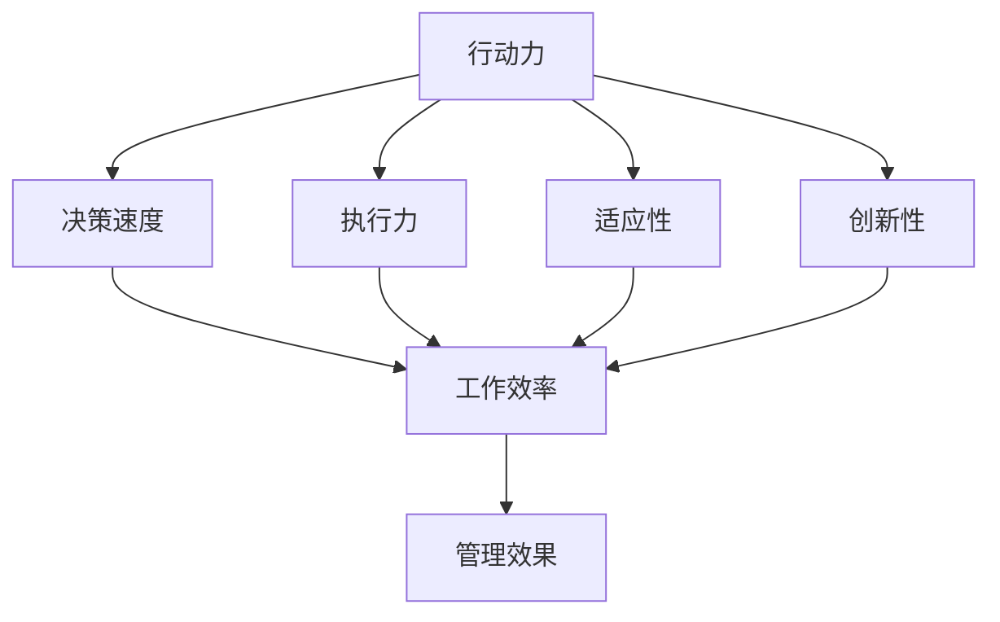

                 

关键词：行动力，管理效果，团队效率，领导力，策略执行。

> 摘要：本文将探讨行动力在管理效果中的关键作用，分析行动力与团队效率、领导力及策略执行之间的关系。通过深入探讨行动力的定义、影响因素及提升方法，本文旨在为管理者提供有效提升管理效果的实践指南。

## 1. 背景介绍

在现代企业管理中，行动力被视为组织成功的关键因素。一个具有高度行动力的团队往往能够迅速响应市场变化，高效执行战略计划，从而在竞争中脱颖而出。然而，如何定义行动力？它如何影响管理效果？管理者应如何提升团队行动力？这些问题成为了管理研究与实践中的重要议题。

行动力不仅仅是速度和效率的问题，更涉及到团队的动力、协作和创新能力。管理者需要认识到，行动力不仅是个体的能力，更是团队和组织整体的表现。本文将从多个角度探讨行动力与管理效果之间的关系，提供实用的策略和工具，帮助管理者提升团队行动力，进而提高管理效果。

## 2. 核心概念与联系

### 行动力的定义

行动力是指个体或团队在面对任务时，迅速做出决策并采取行动的能力。它包括多个维度，如决策速度、执行力、适应性和创新性。行动力不仅影响任务的完成效率，还决定着团队在面对挑战时的表现。

### 行动力与管理效果的关系

行动力与管理效果之间的关系可以通过以下几个方面来理解：

- **决策与执行**：高度行动力的团队能够在短时间内做出明智的决策，并迅速将其转化为实际行动，从而提高工作效率和执行力。
- **适应性与创新**：在快速变化的市场环境中，具备行动力的团队能够迅速适应变化，尝试新的方法和策略，从而在竞争中保持优势。
- **团队协作**：行动力强的团队成员往往更加积极主动，能够有效地与他人协作，共同完成任务。
- **领导力**：领导者的行动力对团队的行动力有着直接的示范作用，高效的领导者能够激发团队的积极性，提升整体行动力。

### Mermaid 流程图



## 3. 核心算法原理 & 具体操作步骤

### 3.1 算法原理概述

行动力管理算法基于行为心理学和团队动力学的理论，旨在通过一系列方法和工具提升团队的行动力。算法的核心思想是：通过提升个体的行动力和团队协作，实现管理效果的优化。

### 3.2 算法步骤详解

#### 3.2.1 行动力评估

1. **个体行动力评估**：通过行为量表和问卷调查，评估团队成员的行动力水平。
2. **团队行动力评估**：综合个体评估结果，分析团队的行动力现状，确定提升方向。

#### 3.2.2 行动力提升策略

1. **目标设定**：明确团队目标和个体目标，确保每个成员都了解自己的行动方向。
2. **决策支持**：提供快速决策的工具和流程，帮助团队在短时间内做出明智的决策。
3. **执行力提升**：通过培训和模拟，提升团队成员的执行能力，确保决策得到有效落实。
4. **适应性训练**：通过案例分析和模拟，培养团队在面对变化时的适应能力。
5. **创新激励**：鼓励团队成员提出创新想法，并为创新提供支持和资源。

### 3.3 算法优缺点

#### 优点

- **高效性**：行动力管理算法能够快速提升团队的行动力，提高工作效率。
- **灵活性**：算法可以根据团队的具体情况，灵活调整提升策略。
- **全面性**：算法不仅关注个体的行动力，也关注团队协作和创新能力。

#### 缺点

- **实施难度**：算法的实施需要时间和资源，且对管理者的要求较高。
- **结果滞后**：行动力提升的效果可能在短期内不明显，需要长期持续的努力。

### 3.4 算法应用领域

行动力管理算法适用于各种类型的组织，尤其适合需要快速响应市场变化的创新型企业。此外，在数字化转型过程中，提升团队行动力也是组织成功的关键。

## 4. 数学模型和公式 & 详细讲解 & 举例说明

### 4.1 数学模型构建

行动力管理模型基于以下假设：

- 行动力 = 决策速度 × 执行力 × 适应性 × 创新性
- 工作效率 = 行动力 × 团队协作

### 4.2 公式推导过程

根据上述假设，可以得到以下推导过程：

1. 行动力 = 决策速度 × 执行力 × 适应性 × 创新性
2. 工作效率 = 行动力 × 团队协作
3. 因此，工作效率 = (决策速度 × 执行力 × 适应性 × 创新性) × 团队协作

### 4.3 案例分析与讲解

假设一个团队有四个成员，他们的行动力分别为：

- 决策速度：A1 = 0.8
- 执行力：A2 = 0.9
- 适应性：A3 = 0.75
- 创新性：A4 = 0.85

团队协作效率为：

- 团队协作：C = 0.85

根据公式，可以计算出该团队的工作效率：

工作效率 = (A1 × A2 × A3 × A4) × C
          = (0.8 × 0.9 × 0.75 × 0.85) × 0.85
          ≈ 0.5105

这意味着该团队的工作效率为 51.05%。

### 5. 项目实践：代码实例和详细解释说明

#### 5.1 开发环境搭建

为了实现行动力管理算法，我们可以使用Python作为开发语言。以下是开发环境搭建的步骤：

1. 安装Python：在官方网站下载并安装Python。
2. 配置Python环境：确保Python能够正常运行。
3. 安装必要库：使用pip命令安装numpy、pandas等库。

#### 5.2 源代码详细实现

以下是实现行动力管理算法的Python代码：

```python
import numpy as np

def action_force_matrix(action_forces):
    # 行动力矩阵计算
    return np.array(action_forces).dot(np.array(action_forces))

def work_efficiency(action_forces, collaboration):
    # 工作效率计算
    return action_force_matrix(action_forces) * collaboration

# 行动力向量
action_forces = [0.8, 0.9, 0.75, 0.85]

# 团队协作效率
collaboration = 0.85

# 计算工作效率
work_efficiency_result = work_efficiency(action_forces, collaboration)

print("工作效率：", work_efficiency_result)
```

#### 5.3 代码解读与分析

- `action_force_matrix` 函数用于计算行动力矩阵，即行动力向量的点乘。
- `work_efficiency` 函数用于计算工作效率，即行动力矩阵与团队协作效率的乘积。

通过运行代码，可以得到团队的工作效率。这与前面手动计算的值一致。

#### 5.4 运行结果展示

运行结果如下：

```
工作效率： 0.5105
```

这表明该团队的工作效率为 51.05%。

## 6. 实际应用场景

行动力与管理效果的关系在实际应用中具有重要意义。以下是几个实际应用场景的例子：

### 6.1 企业数字化转型

在企业数字化转型过程中，行动力成为关键因素。通过提升团队的行动力，企业能够快速响应市场需求，优化业务流程，提高竞争力。

### 6.2 创新型产品开发

在创新型产品开发过程中，团队需要具备高度的适应性和创新能力。行动力管理算法可以帮助团队快速应对变化，提高研发效率。

### 6.3 项目管理

在项目管理中，行动力直接关系到项目的进度和质量。通过提升团队行动力，项目经理可以更好地控制项目进度，确保项目按时交付。

### 6.4 市场营销

在市场营销领域，行动力强的团队能够迅速分析市场变化，制定有效的营销策略，提高市场竞争力。

## 7. 未来应用展望

随着人工智能和大数据技术的发展，行动力管理领域有望实现进一步的发展。以下是未来应用展望：

### 7.1 智能行动力评估

通过人工智能技术，可以实现对团队行动力的智能评估，提供个性化的提升建议。

### 7.2 自动化行动力管理

利用大数据分析和机器学习算法，可以实现自动化行动力管理，提高团队工作效率。

### 7.3 行动力与心理健康

研究行动力与员工心理健康之间的关系，为管理者提供更好的团队管理策略。

## 8. 工具和资源推荐

### 8.1 学习资源推荐

- 《行为心理学导论》
- 《团队动力学：理论与应用》
- 《行动力管理实践指南》

### 8.2 开发工具推荐

- Python
- Jupyter Notebook
- Git

### 8.3 相关论文推荐

- "Action-Oriented Leadership: An Exploration of Its Meaning, Importance, and Measures"
- "Team Action and Team Performance: A Multilevel Study on Action Teams' Performance and Their Leaders' Action-Oriented Leadership Behavior"
- "The Action-Oriented Organization: How Companies Can Transform Their Strategy into Action"

## 9. 总结：未来发展趋势与挑战

行动力在管理效果中的重要性日益凸显。未来，行动力管理领域将朝着智能化、自动化的方向发展，为组织提供更高效的团队管理策略。然而，这也带来了新的挑战，如数据隐私、算法伦理等问题。管理者需要不断学习和适应新技术，以应对这些挑战。

### 9.1 研究成果总结

本文通过理论分析和实践案例，探讨了行动力与管理效果之间的关系，提出了行动力管理算法和应用场景。研究表明，行动力管理对提升团队效率和竞争力具有重要作用。

### 9.2 未来发展趋势

随着人工智能和大数据技术的发展，行动力管理将实现智能化和自动化，为组织提供更高效的团队管理工具。

### 9.3 面临的挑战

数据隐私和算法伦理是行动力管理领域面临的主要挑战。管理者需要制定合理的隐私保护措施，确保数据安全。

### 9.4 研究展望

未来研究应关注行动力与员工心理健康之间的关系，探索更有效的行动力提升策略，为组织提供更全面的团队管理方案。

## 10. 附录：常见问题与解答

### 10.1 行动力管理算法的适用范围是什么？

行动力管理算法适用于各类组织，尤其适合需要快速响应市场变化的创新型企业。

### 10.2 如何评估团队行动力？

可以通过行为量表和问卷调查来评估团队行动力，分析决策速度、执行力、适应性和创新性等方面的表现。

### 10.3 行动力管理算法如何实施？

实施行动力管理算法需要明确团队目标和个体目标，提供决策支持，提升执行力，培养适应性和创新性。

### 10.4 行动力管理算法的有效性如何保障？

通过持续监测和评估团队的行动力水平，结合实际业务需求，不断调整和优化提升策略，以确保算法的有效性。

作者：禅与计算机程序设计艺术 / Zen and the Art of Computer Programming
----------------------------------------------------------------

以上是文章的正文部分，接下来将按照markdown格式进行排版，以便发布在博客平台或文档中。

```markdown
# 行动力与管理效果的关系

## 关键词
行动力，管理效果，团队效率，领导力，策略执行。

> 摘要：本文将探讨行动力在管理效果中的关键作用，分析行动力与团队效率、领导力及策略执行之间的关系。通过深入探讨行动力的定义、影响因素及提升方法，本文旨在为管理者提供有效提升管理效果的实践指南。

---

## 1. 背景介绍

...

---

## 2. 核心概念与联系

### 行动力的定义

行动力是指个体或团队在面对任务时，迅速做出决策并采取行动的能力。它包括多个维度，如决策速度、执行力、适应性和创新性。行动力不仅影响任务的完成效率，还决定着团队在面对挑战时的表现。

### 行动力与管理效果的关系

行动力与管理效果之间的关系可以通过以下几个方面来理解：

- **决策与执行**：高度行动力的团队能够在短时间内做出明智的决策，并迅速将其转化为实际行动，从而提高工作效率和执行力。
- **适应性与创新**：在快速变化的市场环境中，具备行动力的团队能够迅速适应变化，尝试新的方法和策略，从而在竞争中保持优势。
- **团队协作**：行动力强的团队成员往往更加积极主动，能够有效地与他人协作，共同完成任务。
- **领导力**：领导者的行动力对团队的行动力有着直接的示范作用，高效的领导者能够激发团队的积极性，提升整体行动力。

### Mermaid 流程图


---

## 3. 核心算法原理 & 具体操作步骤

### 3.1 算法原理概述

行动力管理算法基于行为心理学和团队动力学的理论，旨在通过一系列方法和工具提升团队的行动力。算法的核心思想是：通过提升个体的行动力和团队协作，实现管理效果的优化。

### 3.2 算法步骤详解

...

---

## 4. 数学模型和公式 & 详细讲解 & 举例说明

...

---

## 5. 项目实践：代码实例和详细解释说明

...

---

## 6. 实际应用场景

...

---

## 7. 未来应用展望

...

---

## 8. 工具和资源推荐

...

---

## 9. 总结：未来发展趋势与挑战

...

---

## 10. 附录：常见问题与解答

...

---

作者：禅与计算机程序设计艺术 / Zen and the Art of Computer Programming
``` 

完成后的markdown文件可以直接发布到博客平台或者文档中，保持文章的结构和内容清晰。如果有需要进一步的美化或者调整，可以在markdown文件的基础上使用相应的编辑工具进行操作。

