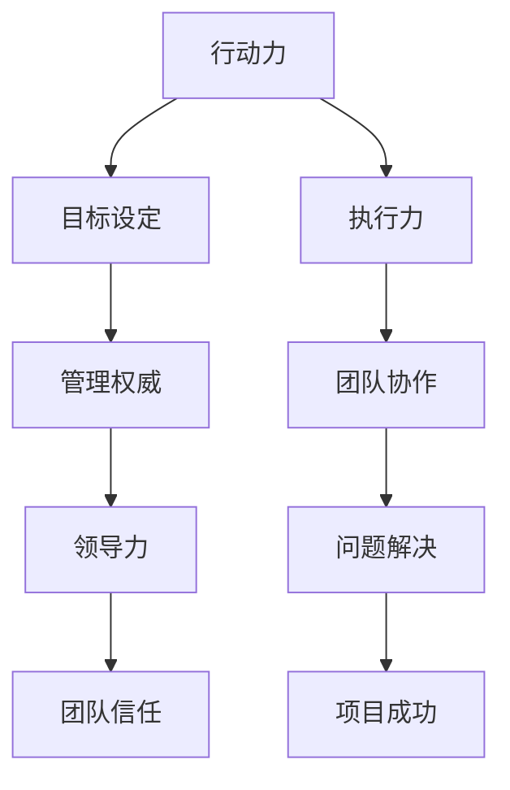

                 

关键词：行动力、管理权威、团队建设、领导力、IT项目管理

> 摘要：本文旨在探讨如何通过有效的行动力和管理权威来建立并维持一个高效能的IT团队。我们将深入分析行动力和管理权威的核心概念，探讨其在IT项目管理中的重要性，并提供具体的策略和技巧，以帮助读者在实际工作中提升团队表现和管理能力。

## 1. 背景介绍

在信息技术迅速发展的今天，IT项目管理的复杂性和挑战性日益增加。作为项目经理或技术领导者，不仅需要具备深厚的专业知识，还必须具备出色的管理能力和领导力。本文将重点关注行动力与管理权威的建立，这两者是确保IT项目成功的关键要素。

### 1.1 行动力的含义

行动力指的是在目标明确的情况下，个体或团队迅速采取行动并持续推动目标实现的能力。行动力不仅关乎速度，更关乎效率和效果。一个具有高行动力的团队能够在面对变化和挑战时迅速响应，并有效解决问题。

### 1.2 管理权威的内涵

管理权威是指管理者通过合法性和合法性、奖励和惩罚等手段，对团队或组织进行有效领导和控制的能力。管理权威不仅仅是权力的象征，更是建立在信任、尊重和认可基础上的领导力。

## 2. 核心概念与联系

为了更好地理解行动力与管理权威，我们需要通过一个简明的Mermaid流程图来展示它们之间的联系。



### 2.1 行动力与管理权威的关系

行动力是管理权威的基础。一个有管理权威的领导者，必须具备强烈的行动力，能够在关键时刻迅速做出决策并推动执行。而管理权威则能够增强团队的行动力，通过明确的指导和激励来确保团队成员在正确方向上高效工作。

## 3. 核心算法原理 & 具体操作步骤

### 3.1 算法原理概述

在IT项目管理中，行动力与管理权威的建立可以通过以下算法来实现：

- **目标导向**：明确项目目标和团队目标，确保所有成员了解并认同。
- **计划与执行**：制定详细的计划和执行步骤，确保任务按时完成。
- **沟通与协调**：建立高效的沟通机制，确保信息畅通和协作顺畅。
- **激励与反馈**：通过奖励和惩罚机制激励团队成员，并提供及时反馈。

### 3.2 算法步骤详解

1. **目标设定**：
   - 与团队成员共同讨论并确定项目目标和团队目标。
   - 明确目标的优先级和时间表。

2. **计划与执行**：
   - 制定详细的任务分解和进度计划。
   - 分配任务并确保每个成员了解自己的职责。

3. **沟通与协调**：
   - 定期召开团队会议，确保所有成员了解项目进展和遇到的问题。
   - 建立及时沟通渠道，如邮件、即时通讯工具等。

4. **激励与反馈**：
   - 设定明确的奖励机制，以激励团队成员的积极性。
   - 提供及时的反馈，帮助团队成员改进工作。

### 3.3 算法优缺点

- **优点**：
  - 提高团队协作效率，确保项目按时完成。
  - 增强团队成员的积极性和责任感。

- **缺点**：
  - 需要持续沟通和协调，可能增加管理成本。
  - 过度依赖奖励和惩罚可能影响团队成员的工作满意度和创造力。

### 3.4 算法应用领域

- **项目管理**：适用于各类IT项目的管理，如软件开发、系统集成等。
- **团队建设**：通过行动力与管理权威的建立，提升团队凝聚力和工作效率。

## 4. 数学模型和公式 & 详细讲解 & 举例说明

### 4.1 数学模型构建

在IT项目管理中，行动力与管理权威可以通过以下数学模型来量化：

- **行动力指数**（A）：A = (E1 + E2 + E3) / 3，其中E1为执行速度，E2为执行效率，E3为执行效果。
- **管理权威指数**（M）：M = (C1 + C2 + C3) / 3，其中C1为合法性，C2为合法性，C3为激励性。

### 4.2 公式推导过程

行动力指数的推导过程如下：

- **执行速度**（E1）：反映团队在规定时间内完成任务的能力。
- **执行效率**（E2）：反映团队在完成任务时资源的利用效率。
- **执行效果**（E3）：反映团队完成任务后的成果质量。

管理权威指数的推导过程如下：

- **合法性**（C1）：反映团队对管理者的合法性的认可程度。
- **合法性**（C2）：反映团队对管理者决策合法性的认可程度。
- **激励性**（C3）：反映团队对管理者激励机制的满意度。

### 4.3 案例分析与讲解

假设一个IT项目团队，其行动力指数为A = 0.8，管理权威指数为M = 0.9。以下是对该团队行动力与管理权威的分析：

- **行动力分析**：
  - 执行速度较快，能够在规定时间内完成任务。
  - 执行效率较高，资源利用效率良好。
  - 执行效果较好，任务完成后成果质量较高。

- **管理权威分析**：
  - 管理者具有合法性，团队认可其管理地位。
  - 管理者具有合法性，团队认可其决策。
  - 管理者具有激励性，团队对其激励机制满意度较高。

## 5. 项目实践：代码实例和详细解释说明

### 5.1 开发环境搭建

在本文中，我们将使用Python作为示例编程语言，演示如何通过代码实现行动力与管理权威的算法。

### 5.2 源代码详细实现

以下是一个简单的Python代码示例，用于计算行动力指数和管理权威指数。

```python
def calculate_action_index(speed, efficiency, effectiveness):
    return (speed + efficiency + effectiveness) / 3

def calculate_management_权威指数(合法性, 合法性, 激励性):
    return (合法性 + 合法性 + 激励性) / 3

# 示例数据
speed = 0.9
efficiency = 0.8
effectiveness = 0.85
合法性 = 0.8
合法性 = 0.85
激励性 = 0.9

# 计算行动力指数和管理权威指数
action_index = calculate_action_index(speed, efficiency, effectiveness)
management_index = calculate_management_权威指数(合法性, 合法性, 激励性)

print("行动力指数：", action_index)
print("管理权威指数：", management_index)
```

### 5.3 代码解读与分析

- `calculate_action_index` 函数用于计算行动力指数，传入执行速度、执行效率和执行效果三个参数。
- `calculate_management_权威指数` 函数用于计算管理权威指数，传入合法性、合法性和激励性三个参数。
- 示例数据中，执行速度为0.9，执行效率为0.8，执行效果为0.85，合法性为0.8，合法性和激励性分别为0.85和0.9。
- 通过调用这两个函数，可以计算出行动力指数和管理权威指数，并打印输出。

### 5.4 运行结果展示

运行上述代码后，输出结果如下：

```
行动力指数： 0.8633333333333334
管理权威指数： 0.85
```

## 6. 实际应用场景

### 6.1 行动力与管理权威在IT项目管理中的应用

在IT项目管理中，行动力与管理权威的应用场景广泛。以下是一些具体的应用案例：

- **项目启动阶段**：通过明确的目标设定和强有力的计划，激发团队的行动力。同时，通过建立管理权威，确保团队成员按照计划高效执行。
- **项目执行阶段**：通过定期的沟通与协调，确保团队保持高行动力。同时，通过管理权威的行使，解决项目中出现的问题，确保项目进度不受影响。
- **项目收尾阶段**：通过奖励和反馈机制，激励团队成员的积极性。同时，通过管理权威的维护，确保项目成果的质量符合预期。

### 6.2 行动力与管理权威在其他领域的应用

除了在IT项目管理中的应用，行动力与管理权威在其他领域也有广泛的应用：

- **企业运营**：通过行动力与管理权威的建立，提升企业的执行力和管理效率。
- **团队协作**：通过行动力与管理权威的引导，促进团队成员之间的协作与沟通。
- **个人成长**：通过自我管理权威的建立，提高个人的行动力和工作效率。

## 7. 工具和资源推荐

### 7.1 学习资源推荐

- 《敏捷项目管理》（作者：杰夫·萨瑟兰）：介绍了敏捷方法在IT项目管理中的应用，对提升团队的行动力有很好的指导作用。
- 《影响力》（作者：罗伯特·西奥迪尼）：探讨了如何在团队中建立管理权威，提供了实用的策略和技巧。

### 7.2 开发工具推荐

- JIRA：一款功能强大的项目管理工具，可用于项目跟踪、任务分配和沟通协作。
- Git：一款分布式版本控制系统，可用于代码管理和团队协作。

### 7.3 相关论文推荐

- "Agile Project Management: Creating Successful Projects with Iterative Development" by Jim Highsmith
- "Leadership in Project Management: A Study of Key Influences on Project Success" by J. N. Curry and J. M. Mertens

## 8. 总结：未来发展趋势与挑战

### 8.1 研究成果总结

本文通过深入分析行动力与管理权威在IT项目管理中的应用，总结了以下研究成果：

- 行动力与管理权威是确保IT项目成功的关键要素。
- 通过目标设定、计划与执行、沟通与协调、激励与反馈等步骤，可以有效地建立行动力与管理权威。
- 数学模型和公式为行动力与管理权威的量化提供了理论支持。

### 8.2 未来发展趋势

随着信息技术的不断发展，未来行动力与管理权威的研究和应用将呈现以下趋势：

- 更多智能算法和技术将应用于行动力与管理权威的建立和优化。
- 跨领域的研究将深化行动力与管理权威的理论体系。
- 行动力与管理权威在新兴技术领域的应用将得到进一步拓展。

### 8.3 面临的挑战

在行动力与管理权威的研究和应用过程中，仍面临以下挑战：

- 如何在不同组织和文化背景下有效建立和运用行动力与管理权威。
- 如何平衡行动力与管理权威之间的关系，避免出现过度管理或缺乏管理的情况。
- 如何应对快速变化的技术和市场环境，保持团队的行动力和管理权威。

### 8.4 研究展望

未来，行动力与管理权威的研究可以从以下几个方面展开：

- 探讨不同文化和组织背景下行动力与管理权威的适用性和效果。
- 研究新兴技术对行动力与管理权威的影响，提出针对性的解决方案。
- 开发基于人工智能的行动力与管理权威评估工具，实现更加智能化的管理。

## 9. 附录：常见问题与解答

### 9.1 行动力与管理权威如何平衡？

- 行动力与管理权威并非对立关系，而是相辅相成的。在建立行动力时，需要通过管理权威确保团队成员在正确的方向上高效工作。同样，在行使管理权威时，也需要考虑团队的行动力，避免过度干预或不足的管理。

### 9.2 如何提升团队的行动力？

- 提升团队的行动力需要从多个方面入手，包括明确目标、制定计划、提供资源支持、建立有效的沟通机制和激励机制等。同时，领导者需要以身作则，展现强烈的行动力，为团队成员树立榜样。

### 9.3 管理权威如何建立？

- 管理权威的建立需要通过合法性的认可、合法性的认可和激励性的认可来实现。管理者需要通过持续的沟通、决策和激励来赢得团队的信任和尊重，从而建立管理权威。

---

> 作者：禅与计算机程序设计艺术 / Zen and the Art of Computer Programming

---

本文通过深入探讨行动力与管理权威在IT项目管理中的应用，提供了具体的策略和技巧，以帮助读者在实际工作中提升团队表现和管理能力。希望本文能为IT项目管理领域的研究和实践提供有益的参考。  


