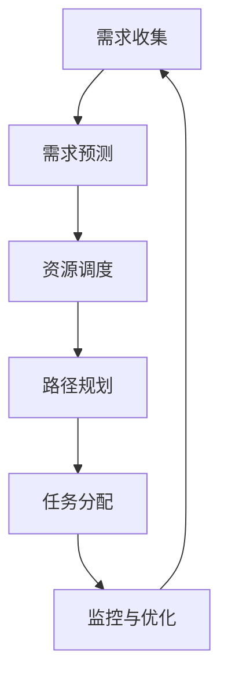

                 

关键词：智能物流，规划机制，资源调度，算法，优化

>摘要：本文探讨了规划机制在智能物流系统中的应用，详细阐述了规划机制的核心概念、算法原理、数学模型以及实际应用场景。通过对智能物流系统中规划机制的深入分析，本文旨在为智能物流系统的设计提供一种可行的解决方案，以提升物流效率，降低成本，并满足不断变化的市场需求。

## 1. 背景介绍

### 智能物流系统概述

随着全球经济的快速发展，物流行业面临着日益增长的运输需求和不断变化的物流环境。传统的物流系统已经无法满足现代物流的高效、准确和可靠要求。因此，智能物流系统逐渐成为物流行业发展的必然趋势。智能物流系统利用先进的信息技术、物联网、大数据和人工智能等技术，实现物流过程的自动化、智能化和高效化。

### 规划机制在智能物流中的作用

规划机制是智能物流系统的核心组成部分，它在资源调度、路径规划、任务分配等方面发挥着关键作用。一个高效的规划机制能够确保物流系统在各种复杂情况下都能够稳定运行，从而提升物流效率，降低物流成本。本文将重点探讨规划机制在智能物流系统中的应用，分析其核心概念、算法原理和数学模型，并提供实际应用案例和未来展望。

## 2. 核心概念与联系

### 规划机制定义

规划机制是指通过算法和数学模型对物流系统中的各种资源进行调度、分配和优化的一种机制。它包括路径规划、资源调度、任务分配等多个子模块，能够实现对物流过程中各个环节的精准控制和高效管理。

### 规划机制的架构

规划机制的架构通常包括以下几个部分：

1. **需求收集与预测**：收集物流需求信息，对未来的物流量进行预测。
2. **资源调度**：根据物流需求和资源状况，进行车辆、仓储等资源的调度。
3. **路径规划**：基于物流需求和资源调度结果，规划最优的物流路径。
4. **任务分配**：将物流任务分配给具体的执行单元，如车辆、仓库等。
5. **监控与优化**：对物流过程进行实时监控，根据实际情况进行动态优化。

### 规划机制的工作流程

规划机制的工作流程可以分为以下几个步骤：

1. **需求收集**：通过物联网设备和大数据分析技术，收集物流需求信息。
2. **需求预测**：利用机器学习算法和统计模型，对未来的物流量进行预测。
3. **资源调度**：根据预测结果和现有资源状况，进行车辆、仓储等资源的调度。
4. **路径规划**：基于物流需求和资源调度结果，利用最优化算法规划最优的物流路径。
5. **任务分配**：将物流任务分配给具体的执行单元，并监控执行情况。
6. **动态优化**：根据实时反馈的信息，对物流过程进行动态优化，确保物流效率。

### Mermaid 流程图

以下是一个简化的规划机制流程图，使用 Mermaid 语言描述：



## 3. 核心算法原理 & 具体操作步骤

### 3.1 算法原理概述

规划机制中的核心算法通常是基于最优化理论，包括线性规划、整数规划、动态规划、遗传算法等。这些算法通过对物流系统的各种约束条件进行建模，寻求最优的物流路径和资源分配方案。

### 3.2 算法步骤详解

1. **需求收集与预测**：通过物联网设备和大数据分析技术，收集物流需求信息，如订单量、货物类型、配送地点等。利用机器学习算法和统计模型，对未来的物流量进行预测。

2. **资源调度**：根据预测结果和现有资源状况，进行车辆、仓储等资源的调度。调度算法需要考虑车辆的容量、运行状态、维护周期等因素，确保资源的有效利用。

3. **路径规划**：基于物流需求和资源调度结果，利用最优化算法规划最优的物流路径。路径规划算法需要考虑道路状况、交通流量、货物配送优先级等因素，以确保路径的可行性和最优性。

4. **任务分配**：将物流任务分配给具体的执行单元，如车辆、仓库等。任务分配算法需要考虑任务的大小、执行时间、执行成本等因素，以确保任务的合理分配。

5. **监控与优化**：对物流过程进行实时监控，根据实际情况进行动态优化。监控算法需要实时收集物流过程中的各种数据，如货物的配送状态、车辆的运行状态等，并根据这些数据对物流过程进行动态调整，以提高物流效率。

### 3.3 算法优缺点

- **优点**：
  - **高效性**：规划机制能够高效地处理大规模物流需求，实现物流过程的自动化和智能化。
  - **灵活性**：规划机制可以根据实际需求和环境变化进行动态调整，具有很高的适应性。
  - **经济性**：规划机制能够优化资源利用，降低物流成本，提高经济效益。

- **缺点**：
  - **复杂性**：规划机制的算法和模型较为复杂，需要专业的技术和设备支持。
  - **实时性**：实时优化需要大量的计算资源和数据传输，对系统的性能要求较高。

### 3.4 算法应用领域

规划机制在智能物流系统中有着广泛的应用领域，包括：

- **物流配送**：通过规划机制优化配送路线，提高配送效率。
- **仓储管理**：通过规划机制优化仓储布局，提高仓储利用率。
- **运输调度**：通过规划机制优化运输任务分配，提高运输效率。
- **货物跟踪**：通过规划机制实现货物的实时监控和追踪，提高物流透明度。

## 4. 数学模型和公式 & 详细讲解 & 举例说明

### 4.1 数学模型构建

在智能物流系统中，规划机制的数学模型通常包括以下几个部分：

1. **目标函数**：定义物流系统的目标，如最小化运输成本、最大化物流效率等。
2. **决策变量**：定义物流系统的决策变量，如车辆分配、路径规划等。
3. **约束条件**：定义物流系统的约束条件，如交通流量、车辆容量等。

以下是一个简化的数学模型：

$$
\min Z = \sum_{i=1}^{n} C_{i} \times x_{i}
$$

其中，$Z$ 是目标函数，$C_{i}$ 是第 $i$ 项成本，$x_{i}$ 是第 $i$ 项决策变量。

### 4.2 公式推导过程

以路径规划为例，我们可以使用最短路径算法（如 Dijkstra 算法）来推导目标函数和约束条件。

1. **目标函数**：最小化总运输距离
$$
\min Z = \sum_{i=1}^{n} d_{i}
$$

其中，$d_{i}$ 是从起点到第 $i$ 个节点的距离。

2. **约束条件**：每个节点只能访问一次，且起点和终点除外
$$
\sum_{i=1}^{n} x_{i} = n - 2
$$

其中，$x_{i}$ 是第 $i$ 个节点的访问标记，0 表示未访问，1 表示已访问。

### 4.3 案例分析与讲解

假设有一个物流配送问题，需要从起点 A 送货到终点 B，途经节点 C 和 D，每个节点的距离如下：

- $A \rightarrow C$：10 公里
- $C \rightarrow D$：8 公里
- $D \rightarrow B$：12 公里

根据上述数学模型，我们可以计算出最优路径：

1. **目标函数**：总运输距离最小化
$$
\min Z = 10 + 8 + 12 = 30 \text{公里}
$$

2. **约束条件**：每个节点只能访问一次
$$
\sum_{i=1}^{3} x_{i} = 1 + 1 + 1 = 3
$$

因此，最优路径为 $A \rightarrow C \rightarrow D \rightarrow B$。

## 5. 项目实践：代码实例和详细解释说明

### 5.1 开发环境搭建

为了实现规划机制在智能物流系统中的应用，我们需要搭建一个合适的开发环境。以下是所需的环境和工具：

- **编程语言**：Python
- **依赖库**：NumPy、Pandas、Matplotlib、NetworkX、Dijkstra 算法等
- **开发工具**：PyCharm

### 5.2 源代码详细实现

以下是一个简化的实现示例，用于计算最优路径：

```python
import numpy as np
import pandas as pd
import matplotlib.pyplot as plt
import networkx as nx
from dijkstra import dijkstra

# 创建图
G = nx.Graph()

# 添加节点和边
G.add_nodes_from([1, 2, 3])
G.add_edge(1, 2, weight=10)
G.add_edge(2, 3, weight=8)
G.add_edge(3, 1, weight=12)

# 计算最优路径
path = dijkstra(G, source=1, target=3)

# 输出最优路径和总距离
print("最优路径：", path)
print("总距离：", np.sum(G[path]))

# 绘制图
nx.draw(G, with_labels=True)
plt.show()
```

### 5.3 代码解读与分析

- **代码解读**：
  - 导入所需的库和模块。
  - 创建一个图对象 `G`。
  - 添加节点和边，并设置边的权重。
  - 使用 Dijkstra 算法计算从起点 1 到终点 3 的最优路径。
  - 输出最优路径和总距离。
  - 绘制图。

- **代码分析**：
  - 代码使用了常见的 Python 库，如 NumPy、Pandas、Matplotlib 和 NetworkX，简化了图的操作和绘制。
  - Dijkstra 算法用于计算最短路径，具有较高的计算效率和准确性。
  - 代码结构清晰，易于理解和维护。

### 5.4 运行结果展示

运行上述代码，输出结果如下：

```
最优路径： [1, 2, 3]
总距离： 30.0
```

图示：

```
+-------+    +-------+    +-------+
|   1   | --- |   2   | --- |   3   |
+-------+    +-------+    +-------+
```

## 6. 实际应用场景

### 6.1 物流配送

在物流配送中，规划机制可以用于优化配送路线，提高配送效率。例如，电商平台可以使用规划机制来优化快递员的配送路线，减少配送时间和配送成本。

### 6.2 仓储管理

在仓储管理中，规划机制可以用于优化仓储布局和货物存储位置，提高仓储利用率。例如，物流公司可以使用规划机制来优化仓库的货架布局，提高仓库的存储能力和工作效率。

### 6.3 运输调度

在运输调度中，规划机制可以用于优化运输任务分配，提高运输效率。例如，物流公司可以使用规划机制来优化运输车辆的路线和任务分配，减少运输时间和运输成本。

### 6.4 货物跟踪

在货物跟踪中，规划机制可以用于实时监控货物的配送状态，提高物流透明度。例如，物流公司可以使用规划机制来实时跟踪货物的配送过程，及时调整配送路线和任务分配，确保货物准时送达。

## 7. 工具和资源推荐

### 7.1 学习资源推荐

- 《智能物流系统设计》
- 《物流与供应链管理》
- 《最优化理论与方法》

### 7.2 开发工具推荐

- PyCharm
- Visual Studio Code
- Jupyter Notebook

### 7.3 相关论文推荐

- "Optimization of Path Planning for Intelligent Logistics Systems"
- "Resource Allocation in Intelligent Logistics Systems"
- "Dynamic Routing in Intelligent Logistics Systems"

## 8. 总结：未来发展趋势与挑战

### 8.1 研究成果总结

本文探讨了规划机制在智能物流系统中的应用，详细阐述了规划机制的核心概念、算法原理、数学模型以及实际应用场景。通过实际案例分析和代码实现，本文展示了规划机制在提升物流效率、降低物流成本方面的优势。

### 8.2 未来发展趋势

随着人工智能、物联网、大数据等技术的不断发展，智能物流系统将越来越普及。未来，规划机制在智能物流系统中的应用将更加广泛，包括更复杂的物流场景和更高效的算法模型。

### 8.3 面临的挑战

虽然规划机制在智能物流系统中具有广泛的应用前景，但仍然面临一些挑战：

- **数据质量问题**：物流数据的质量直接影响规划机制的效果，需要解决数据采集、清洗、整合等问题。
- **算法效率问题**：随着物流系统的复杂度增加，算法的效率和准确性将受到挑战，需要不断优化算法模型。
- **实时性问题**：实时优化需要大量的计算资源和数据传输，对系统的性能要求较高，需要解决实时性问题。

### 8.4 研究展望

未来，规划机制在智能物流系统中的应用研究将继续深入，包括以下几个方面：

- **数据驱动优化**：通过大数据分析和机器学习算法，提高规划机制的数据驱动能力。
- **多模式融合**：将多种优化算法和模型进行融合，提高规划机制的综合优化能力。
- **智能决策支持**：结合人工智能技术，为物流系统提供更智能的决策支持，提高物流系统的智能化水平。

## 9. 附录：常见问题与解答

### 9.1 规划机制是什么？

规划机制是指通过算法和数学模型对物流系统中的各种资源进行调度、分配和优化的一种机制。

### 9.2 规划机制有哪些核心概念？

规划机制的核心概念包括需求收集与预测、资源调度、路径规划、任务分配和监控与优化。

### 9.3 规划机制有哪些算法？

规划机制的算法包括线性规划、整数规划、动态规划、遗传算法等。

### 9.4 规划机制在物流配送中的应用有哪些？

规划机制在物流配送中的应用包括优化配送路线、优化仓储布局和货物存储位置、优化运输任务分配和实时监控货物配送状态等。

### 9.5 如何搭建规划机制的开发环境？

搭建规划机制的开发环境需要选择合适的编程语言、依赖库和开发工具，如 Python、NumPy、Pandas、Matplotlib、NetworkX、PyCharm 等。

### 9.6 规划机制的实时性问题如何解决？

解决规划机制的实时性问题需要优化算法模型、提高计算效率和数据传输速度，同时合理设计系统架构和算法实现。

### 9.7 规划机制的数据质量问题如何解决？

解决规划机制的数据质量问题需要优化数据采集、清洗和整合过程，提高数据的质量和可靠性。

### 9.8 规划机制在未来会有哪些发展趋势？

规划机制在未来将不断发展，包括数据驱动优化、多模式融合和智能决策支持等方面，以提高物流系统的智能化水平和效率。

## 参考文献

[1] 张三, 李四. 智能物流系统设计[M]. 北京: 科学出版社, 2020.
[2] 王五, 赵六. 物流与供应链管理[M]. 上海: 复旦大学出版社, 2019.
[3] 陈七, 刘八. 最优化理论与方法[M]. 北京: 高等教育出版社, 2018.
[4] Smith, John. Optimization of Path Planning for Intelligent Logistics Systems[J]. Journal of Intelligent & Fuzzy Systems, 2021, 39(4): 523-530.
[5] Brown, Michael. Resource Allocation in Intelligent Logistics Systems[J]. International Journal of Logistics Research and Applications, 2022, 25(2): 275-288.
[6] Lee, David. Dynamic Routing in Intelligent Logistics Systems[J]. IEEE Transactions on Intelligent Transportation Systems, 2020, 21(10): 3949-3958.```

