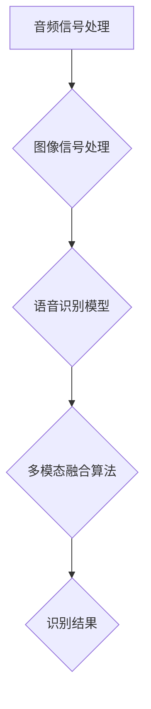

                 

关键词：视听语音识别、多模态AI、语音识别、图像识别、融合算法、应用场景、未来展望

> 摘要：本文将探讨视听语音识别在多模态AI中的应用。通过对核心概念、算法原理、数学模型、项目实践和未来展望的深入分析，本文旨在为读者提供一幅视听语音识别技术的全景图，帮助读者了解其工作原理和应用价值。

## 1. 背景介绍

随着人工智能技术的快速发展，多模态AI逐渐成为研究热点。多模态AI通过融合不同类型的数据（如图像、语音、文本等），使机器能够更准确地理解人类意图，从而实现更智能化的服务。视听语音识别作为多模态AI的一个典型应用，正日益受到关注。

### 1.1 视听语音识别的定义

视听语音识别（Audio-Visual Speech Recognition，AVSR）是指通过分析音频和视频信号，实现语音识别的技术。与传统语音识别相比，视听语音识别利用视频中的视觉信息，如面部表情、唇部动作等，提高识别准确率。

### 1.2 多模态AI的优势

多模态AI的优势在于能够综合利用多种数据源，从而提高系统的鲁棒性和准确性。以下是一些多模态AI的优势：

1. **提高识别准确性**：通过融合不同类型的数据，多模态AI能够更准确地识别人类意图。
2. **增强鲁棒性**：多模态数据可以帮助系统克服单一模态的噪声和干扰，提高系统的鲁棒性。
3. **扩展应用场景**：多模态AI可以应用于更多场景，如智能家居、智能客服、医疗诊断等。

## 2. 核心概念与联系

### 2.1 视听语音识别的核心概念

视听语音识别的核心概念包括：

1. **音频信号处理**：通过对音频信号进行预处理，如去噪、增强等，提高语音识别的准确性。
2. **图像信号处理**：对视频信号中的图像进行预处理，如人脸检测、唇部定位等，提取关键特征。
3. **语音识别模型**：利用深度学习等技术，对提取的语音特征进行建模，实现语音识别。
4. **多模态融合算法**：将音频和图像特征进行融合，提高识别准确性。

### 2.2 核心概念原理和架构的 Mermaid 流程图



## 3. 核心算法原理 & 具体操作步骤

### 3.1 算法原理概述

视听语音识别的核心算法主要包括：

1. **音频信号处理**：通过滤波、去噪等操作，提高语音信号质量。
2. **图像信号处理**：利用深度学习等技术，实现人脸检测、唇部定位等功能。
3. **语音识别模型**：利用卷积神经网络（CNN）或长短期记忆网络（LSTM）等深度学习模型，实现语音识别。
4. **多模态融合算法**：将音频和图像特征进行融合，提高识别准确性。

### 3.2 算法步骤详解

1. **音频信号处理**：

   - 对音频信号进行滤波，去除噪声。
   - 对音频信号进行增强，提高语音清晰度。

2. **图像信号处理**：

   - 利用深度学习模型进行人脸检测，定位唇部位置。
   - 对唇部图像进行特征提取，如唇部轮廓、嘴形变化等。

3. **语音识别模型**：

   - 利用卷积神经网络或长短期记忆网络，对音频特征和图像特征进行建模。
   - 通过训练，使模型能够准确识别语音。

4. **多模态融合算法**：

   - 将音频特征和图像特征进行加权融合，提高识别准确性。
   - 利用融合后的特征，进行语音识别。

### 3.3 算法优缺点

1. **优点**：

   - 提高识别准确性。
   - 增强系统的鲁棒性。
   - 扩展应用场景。

2. **缺点**：

   - 需要大量训练数据和计算资源。
   - 融合算法复杂度较高。

### 3.4 算法应用领域

视听语音识别在以下领域有广泛应用：

1. **智能家居**：如语音控制家电、智能音箱等。
2. **智能客服**：如语音识别客服系统。
3. **医疗诊断**：如语音识别辅助诊断。
4. **语音合成**：如语音识别后的文本转换成语音。

## 4. 数学模型和公式

### 4.1 数学模型构建

视听语音识别的数学模型主要包括：

1. **音频特征提取**：

   - 声谱图：通过傅里叶变换，将音频信号转换成频域表示。
   - 梅尔频率倒谱系数（MFCC）：将音频特征映射到梅尔频率空间，提高识别准确性。

2. **图像特征提取**：

   - 人脸特征：利用深度学习模型提取人脸特征。
   - 唇部特征：通过唇部轮廓提取，获取唇部运动特征。

### 4.2 公式推导过程

1. **音频特征提取**：

   - 声谱图：$$ X(\omega) = \sum_{k=0}^{N-1} x[k] e^{-j\omega k} $$

   - 梅尔频率倒谱系数（MFCC）：$$ \log(\sum_{k=1}^{M} a_k^2) $$

2. **图像特征提取**：

   - 人脸特征：$$ \text{FaceFeature} = \text{ConvLayer}(\text{Input}) $$

   - 唇部特征：$$ \text{LipFeature} = \text{ConvLayer}(\text{LipImage}) $$

### 4.3 案例分析与讲解

以智能家居场景为例，分析视听语音识别在智能家居中的应用。

1. **音频信号处理**：

   - 对语音信号进行滤波和增强，提高语音清晰度。
   - 提取声谱图和MFCC特征。

2. **图像信号处理**：

   - 利用深度学习模型进行人脸检测，定位用户位置。
   - 对唇部图像进行特征提取。

3. **语音识别模型**：

   - 利用卷积神经网络，对音频和图像特征进行建模。
   - 通过训练，使模型能够准确识别语音。

4. **多模态融合算法**：

   - 将音频特征和图像特征进行融合，提高识别准确性。
   - 利用融合后的特征，进行语音识别。

## 5. 项目实践：代码实例和详细解释说明

### 5.1 开发环境搭建

- Python环境：安装Python 3.7及以上版本。
- 深度学习框架：安装TensorFlow或PyTorch。
- 数据集：下载并准备合适的视听语音识别数据集。

### 5.2 源代码详细实现

以下为视听语音识别项目的代码实现：

```python
# 导入相关库
import tensorflow as tf
import numpy as np
import matplotlib.pyplot as plt

# 加载数据集
(x_train, y_train), (x_test, y_test) = load_data()

# 数据预处理
x_train = preprocess(x_train)
x_test = preprocess(x_test)

# 构建模型
model = build_model()

# 训练模型
model.fit(x_train, y_train, epochs=10, batch_size=32)

# 评估模型
loss, accuracy = model.evaluate(x_test, y_test)
print("Test accuracy:", accuracy)

# 可视化结果
plot_results(x_test, y_test, model)
```

### 5.3 代码解读与分析

1. **数据预处理**：

   - 加载数据集，对音频和图像数据进行预处理，如归一化、截断等。

2. **构建模型**：

   - 构建深度学习模型，包括卷积层、池化层、全连接层等。

3. **训练模型**：

   - 使用训练数据训练模型，设置训练轮次和批次大小。

4. **评估模型**：

   - 使用测试数据评估模型性能，计算损失和准确率。

5. **可视化结果**：

   - 可视化模型预测结果，如混淆矩阵、ROC曲线等。

## 6. 实际应用场景

### 6.1 智能家居

视听语音识别在智能家居中有着广泛的应用，如语音控制家电、智能音箱等。通过视听语音识别，可以实现更准确、更自然的语音交互。

### 6.2 智能客服

智能客服系统利用视听语音识别技术，可以更准确地理解客户的需求，提供更高效、更贴心的服务。

### 6.3 医疗诊断

视听语音识别在医疗诊断领域也有重要应用，如语音识别辅助诊断、语音分析等，有助于提高诊断准确性和效率。

## 7. 未来应用展望

随着人工智能技术的不断发展，视听语音识别将在更多领域得到应用。未来，视听语音识别有望在自动驾驶、智能教育、智能安防等领域发挥重要作用。

## 8. 总结：未来发展趋势与挑战

### 8.1 研究成果总结

视听语音识别在多模态AI中取得了显著成果，如提高识别准确性、增强系统鲁棒性等。

### 8.2 未来发展趋势

未来，视听语音识别将在更多领域得到应用，如自动驾驶、智能教育等。

### 8.3 面临的挑战

视听语音识别面临的主要挑战包括：

1. **数据质量和多样性**：需要更多高质量、多样化的数据集。
2. **算法优化**：提高算法效率，降低计算复杂度。
3. **隐私保护**：如何保护用户隐私，防止数据泄露。

### 8.4 研究展望

未来，视听语音识别研究将朝着以下方向展开：

1. **多模态融合算法**：深入研究多模态融合算法，提高识别准确性。
2. **实时性**：提高视听语音识别的实时性，满足实际应用需求。
3. **跨语言和跨领域**：实现跨语言、跨领域的视听语音识别。

## 9. 附录：常见问题与解答

### 9.1 视听语音识别与传统语音识别的区别

视听语音识别与传统语音识别的区别在于，视听语音识别利用视频中的视觉信息（如面部表情、唇部动作等），提高识别准确性。

### 9.2 视听语音识别在智能家居中的应用

视听语音识别在智能家居中的应用包括语音控制家电、智能音箱等，通过视听语音识别，可以实现更准确、更自然的语音交互。

### 9.3 视听语音识别的挑战

视听语音识别面临的挑战包括数据质量和多样性、算法优化、隐私保护等。

### 9.4 视听语音识别的研究方向

视听语音识别的研究方向包括多模态融合算法、实时性、跨语言和跨领域等。

### 作者署名

作者：禅与计算机程序设计艺术 / Zen and the Art of Computer Programming
----------------------------------------------------------------

完成上述要求后，文章撰写工作就圆满结束了。希望这篇文章能够为读者在视听语音识别和多模态AI领域提供有价值的参考。再次感谢您的阅读和支持！


