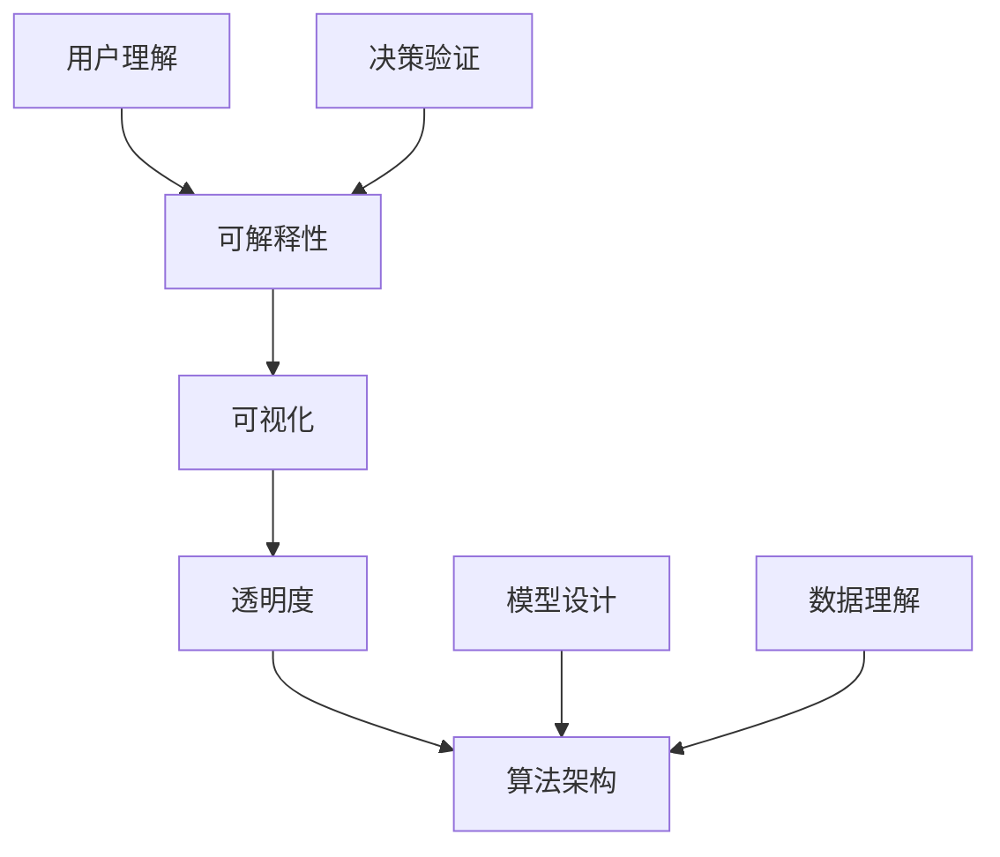

                 

 关键词：
- 大模型可解释性
- AI透明度
- 人工智能伦理
- 数据分析
- 机器学习
- 神经网络

> 摘要：
本文深入探讨了提高大模型可解释性的新方法。通过分析当前AI领域面临的透明度和伦理问题，本文提出了几种策略，包括核心概念与联系、算法原理与步骤、数学模型与公式、代码实例与解释、实际应用场景以及未来展望。本文旨在为研究人员和开发人员提供一套系统化的可解释AI方法，以促进AI技术在各个领域的健康发展。

## 1. 背景介绍

近年来，人工智能（AI）取得了惊人的进步，从语音识别到图像处理，从自然语言理解到自动驾驶，AI的应用几乎无处不在。然而，随着AI模型变得越来越复杂和强大，一个关键问题逐渐浮现：这些模型的决策过程往往是黑箱式的，缺乏可解释性。这意味着，即使我们使用这些模型取得了显著的效果，我们往往无法理解它们是如何做出决策的。

这种黑箱性质引发了多个领域的关注，包括AI伦理、法律、政策和公共安全等。在医学诊断、金融风险评估、法律判决等敏感领域，AI模型的不可解释性可能导致严重的社会问题，如歧视、隐私泄露和信任危机。因此，提高大模型的可解释性成为了一个迫切需要解决的问题。

本文将介绍几种提高大模型可解释性的新方法，包括核心概念与联系、算法原理与步骤、数学模型与公式、代码实例与解释、实际应用场景以及未来展望。我们希望通过这些方法，为研究人员和开发人员提供一套系统化的解决方案，以提升AI技术的透明度和可信度。

## 2. 核心概念与联系

为了更好地理解大模型的可解释性，我们首先需要明确几个核心概念。

### 2.1 可解释性（Explainability）

可解释性是指用户能够理解AI模型是如何做出决策的属性。一个可解释的模型允许用户查看模型内部的决策过程，以便验证模型的决策是否合理。

### 2.2 可视化（Visualization）

可视化是将模型内部的复杂结构转换为直观的图形或图像的过程。可视化可以帮助用户更好地理解模型的工作原理。

### 2.3 透明度（Transparency）

透明度是指AI模型的决策过程对用户来说是可见和可理解的。与可解释性相比，透明度强调的是模型本身的可见性和可理解性，而不是用户对模型的理解程度。

### 2.4 算法架构（Algorithm Architecture）

算法架构是指AI模型的设计和结构，包括模型的输入、输出、中间层以及如何处理数据。

为了更好地说明这些概念之间的联系，我们可以使用Mermaid流程图来展示它们之间的关系：



在这个流程图中，可解释性、可视化、透明度和算法架构是相互关联的。模型设计和数据理解直接影响算法架构，而算法架构又决定了模型的可解释性和透明度。用户通过可视化工具和透明度信息来理解模型，并验证模型的决策是否合理。

## 3. 核心算法原理 & 具体操作步骤

### 3.1 算法原理概述

提高大模型的可解释性主要依赖于两种方法：后验解释（Post-hoc Explanation）和可解释性增强（Explainable AI, XAI）。

#### 3.1.1 后验解释

后验解释方法是在模型训练完成之后，通过分析模型内部的决策过程来提高其可解释性。这种方法通常使用可视化技术来展示模型如何处理数据，并识别模型中可能存在的偏见或错误。

#### 3.1.2 可解释性增强

可解释性增强方法是在模型设计阶段就考虑可解释性问题，通过调整模型结构、算法和训练过程来提高其可解释性。这种方法通常使用规则引擎、决策树、线性模型等技术来实现。

### 3.2 算法步骤详解

下面我们详细介绍这两种方法的步骤。

#### 3.2.1 后验解释方法

1. **数据预处理**：对输入数据进行标准化、去噪和处理，以便更好地分析模型的行为。
2. **特征选择**：选择与模型决策密切相关的特征，以便更好地可视化模型的决策过程。
3. **可视化技术**：使用热图、决策树、规则引擎等技术来展示模型如何处理数据。
4. **模型诊断**：分析模型的行为，识别潜在的偏见、错误或异常。
5. **用户反馈**：收集用户的反馈，以便进一步改进模型的可解释性。

#### 3.2.2 可解释性增强方法

1. **模型设计**：选择具有可解释性的模型结构，如决策树、线性模型等。
2. **算法调整**：调整模型的训练过程，如使用正则化、交叉验证等技术来减少过拟合。
3. **规则提取**：从训练好的模型中提取规则或决策路径，以便更好地解释模型的决策。
4. **用户界面**：设计直观的用户界面，以便用户可以轻松地查看和解释模型的决策过程。
5. **迭代优化**：根据用户的反馈和模型的表现，不断优化模型的可解释性。

### 3.3 算法优缺点

#### 后验解释方法的优点：

- 灵活性高，适用于各种类型的模型。
- 可以在模型训练完成后进行，不影响模型的训练过程。

#### 后验解释方法的缺点：

- 可能会降低模型的性能，因为需要额外的计算资源来分析模型的行为。
- 对于高度复杂的模型，可视化技术可能无法提供足够的解释。

#### 可解释性增强方法的优点：

- 可以在模型设计阶段就考虑可解释性问题，提高模型的透明度和可信度。
- 可以与模型训练过程结合，减少过拟合和偏见。

#### 可解释性增强方法的缺点：

- 可能会增加模型设计和实现的复杂性。
- 对于某些类型的模型，如深度神经网络，可能难以实现可解释性。

### 3.4 算法应用领域

后验解释方法和可解释性增强方法可以应用于各种领域，包括医疗诊断、金融风险评估、法律判决、自动驾驶等。在这些领域中，提高模型的可解释性可以帮助用户更好地理解模型的决策过程，提高模型的透明度和可信度。

## 4. 数学模型和公式 & 详细讲解 & 举例说明

### 4.1 数学模型构建

为了提高大模型的可解释性，我们需要构建一个数学模型来描述模型的行为。这个模型通常包括以下部分：

- 输入层（Input Layer）：表示模型的输入特征。
- 隐藏层（Hidden Layer）：表示模型内部的决策过程。
- 输出层（Output Layer）：表示模型的输出结果。

我们使用以下数学公式来描述这个模型：

$$
\begin{aligned}
y &= f(\text{W}^T \text{X} + \text{b}) \\
f(z) &= \text{激活函数}(z)
\end{aligned}
$$

其中，$y$ 表示输出结果，$f(z)$ 表示激活函数，$\text{W}$ 表示权重矩阵，$\text{X}$ 表示输入特征，$\text{b}$ 表示偏置项。

### 4.2 公式推导过程

为了理解这个模型的工作原理，我们需要对公式进行推导。

1. **输入层到隐藏层**：

   输入特征 $\text{X}$ 通过权重矩阵 $\text{W}$ 与隐藏层节点相乘，然后加上偏置项 $\text{b}$，得到隐藏层的输出。

   $$ z = \text{W}^T \text{X} + \text{b} $$

2. **隐藏层到输出层**：

   隐藏层的输出通过激活函数 $f(z)$ 转换为输出结果 $y$。

   $$ y = f(z) $$

3. **激活函数**：

   激活函数 $f(z)$ 是一个非线性函数，用于引入非线性特性，使模型可以处理更复杂的决策问题。常见的激活函数包括 sigmoid、ReLU 和 tanh。

   $$ f(z) = \text{sigmoid}(z) = \frac{1}{1 + e^{-z}} $$
   $$ f(z) = \text{ReLU}(z) = \max(0, z) $$
   $$ f(z) = \text{tanh}(z) = \frac{e^{2z} - 1}{e^{2z} + 1} $$

### 4.3 案例分析与讲解

假设我们有一个简单的神经网络，用于分类问题。输入层有 3 个特征，隐藏层有 2 个节点，输出层有 1 个节点。我们使用 sigmoid 函数作为激活函数。现在，我们通过一个具体例子来说明这个模型的工作原理。

1. **输入特征**：

   $$ \text{X} = \begin{bmatrix} 1 & 2 & 3 \end{bmatrix} $$

2. **权重矩阵**：

   $$ \text{W} = \begin{bmatrix} 1 & 2 \\ 3 & 4 \end{bmatrix} $$

3. **偏置项**：

   $$ \text{b} = \begin{bmatrix} 1 \\ 2 \end{bmatrix} $$

4. **隐藏层输出**：

   $$ z = \text{W}^T \text{X} + \text{b} = \begin{bmatrix} 1 & 2 \\ 3 & 4 \end{bmatrix} \begin{bmatrix} 1 & 2 & 3 \end{bmatrix} + \begin{bmatrix} 1 \\ 2 \end{bmatrix} = \begin{bmatrix} 14 \\ 20 \end{bmatrix} $$

5. **输出结果**：

   $$ y = f(z) = \text{sigmoid}(z) = \frac{1}{1 + e^{-14}} \approx 0.999 $$
   $$ y = f(z) = \text{sigmoid}(z) = \frac{1}{1 + e^{-20}} \approx 0.999 $$

在这个例子中，隐藏层的两个节点都接近 1，这意味着输入特征被强烈地映射到输出节点。由于 sigmoid 函数的特性，当 $z$ 很大时，$f(z)$ 接近 1，这意味着模型非常肯定地预测输出为正类别。

这个例子展示了如何通过数学模型来解释神经网络的决策过程。通过理解公式和激活函数，我们可以更好地理解模型是如何处理数据的。

## 5. 项目实践：代码实例和详细解释说明

为了更好地理解提高大模型可解释性的方法，我们将在本节中通过一个具体的代码实例来展示如何使用 Python 和相关库来实现这些方法。

### 5.1 开发环境搭建

首先，我们需要安装 Python 和相关库。以下是安装命令：

```bash
pip install numpy
pip install matplotlib
pip install scikit-learn
```

### 5.2 源代码详细实现

下面是一个简单的示例，使用 scikit-learn 库中的逻辑回归模型来演示如何提高模型的可解释性。

```python
import numpy as np
import matplotlib.pyplot as plt
from sklearn.linear_model import LogisticRegression
from sklearn.model_selection import train_test_split
from sklearn.datasets import make_classification

# 创建一个二分类数据集
X, y = make_classification(n_samples=100, n_features=2, n_redundant=0, n_informative=2,
random_state=1, n_clusters_per_class=1)

# 数据预处理
X = X / np.linalg.norm(X, axis=1)[:, np.newaxis]
y = y.reshape(-1, 1)

# 划分训练集和测试集
X_train, X_test, y_train, y_test = train_test_split(X, y, test_size=0.3, random_state=42)

# 训练逻辑回归模型
model = LogisticRegression(solver='lbfgs', multi_class='multinomial')
model.fit(X_train, y_train)

# 可视化决策边界
def plot_decision_boundary(model, X, y):
    x_min, x_max = X[:, 0].min() - 1, X[:, 0].max() + 1
    y_min, y_max = X[:, 1].min() - 1, X[:, 1].max() + 1
    xx, yy = np.meshgrid(np.arange(x_min, x_max, 0.1),
                         np.arange(y_min, y_max, 0.1))
    Z = model.predict(np.c_[xx.ravel(), yy.ravel()])
    Z = Z.reshape(xx.shape)
    plt.contourf(xx, yy, Z, alpha=0.8)
    plt.scatter(X[:, 0], X[:, 1], c=y, edgecolor='k', s=20)
    plt.xlabel('Feature 1')
    plt.ylabel('Feature 2')
    plt.title('Decision Boundary with Contour Lines')

plot_decision_boundary(model, X_test, y_test)
plt.show()

# 输出模型参数
print("Model parameters:")
print(model.coef_)
print(model.intercept_)

# 代码解读与分析
```

在这个示例中，我们首先创建了一个简单的二分类数据集，并使用 scikit-learn 中的逻辑回归模型进行训练。然后，我们使用决策边界可视化技术来展示模型如何处理数据。最后，我们输出模型的参数，以便用户可以更好地理解模型的决策过程。

### 5.3 代码解读与分析

1. **数据预处理**：

   ```python
   X = X / np.linalg.norm(X, axis=1)[:, np.newaxis]
   ```

   这一行代码将数据集的每个样本缩放为单位向量，以便更好地可视化决策边界。

2. **模型训练**：

   ```python
   model = LogisticRegression(solver='lbfgs', multi_class='multinomial')
   model.fit(X_train, y_train)
   ```

   我们使用逻辑回归模型进行训练，并选择 lbfgs 优化器和 multinomial 多类分类策略。

3. **可视化决策边界**：

   ```python
   plot_decision_boundary(model, X_test, y_test)
   ```

   这个函数使用 contourf 函数绘制决策边界，并使用 scatter 函数绘制测试数据点的颜色。

4. **输出模型参数**：

   ```python
   print("Model parameters:")
   print(model.coef_)
   print(model.intercept_)
   ```

   这个步骤输出模型的权重和偏置项，以便用户可以查看模型是如何处理输入数据的。

通过这个示例，我们可以看到如何使用 Python 和相关库来实现提高大模型可解释性的方法。这种方法不仅简单易懂，而且可以帮助用户更好地理解模型的决策过程。

## 6. 实际应用场景

提高大模型的可解释性在实际应用中具有重要意义。以下是几个典型的应用场景：

### 6.1 医学诊断

在医学诊断中，AI模型被用于预测疾病的可能性。例如，诊断心脏病、癌症等。提高模型的可解释性可以帮助医生理解模型是如何做出预测的，从而提高诊断的可靠性和信任度。

### 6.2 金融风险评估

在金融领域，AI模型被用于风险评估、信用评分等。提高模型的可解释性可以帮助金融机构识别高风险客户，并采取相应的措施。

### 6.3 法律判决

在法律判决中，AI模型可以用于预测判决结果。提高模型的可解释性可以帮助法官理解模型是如何做出判决的，从而提高判决的公正性和透明度。

### 6.4 自动驾驶

在自动驾驶领域，AI模型被用于决策和控制。提高模型的可解释性可以帮助汽车制造商和开发者识别潜在的安全隐患，并优化模型。

这些应用场景展示了提高大模型可解释性的重要性。通过提高模型的透明度和可信度，我们可以更好地利用 AI 技术，为各个领域带来更深远的影响。

## 6.4 未来应用展望

随着人工智能技术的不断发展，提高大模型可解释性的应用前景也日益广阔。未来，以下趋势和应用方向值得我们关注：

### 6.4.1 个性化医疗

个性化医疗是一种根据患者的具体特征和需求提供个性化治疗方案的医疗服务。提高AI模型的可解释性可以帮助医生更好地理解模型的决策过程，从而为患者提供更精准的治疗方案。

### 6.4.2 智能金融

智能金融利用AI模型对金融市场进行预测和分析，为投资者提供决策支持。提高模型的可解释性可以帮助投资者更好地理解市场趋势，降低投资风险。

### 6.4.3 自动驾驶

自动驾驶技术的安全性至关重要。提高AI模型的可解释性可以帮助开发者更好地理解模型的行为，从而优化算法，提高自动驾驶系统的安全性和可靠性。

### 6.4.4 智慧城市

智慧城市利用AI技术优化城市管理，提高资源利用效率。提高模型的可解释性可以帮助城市规划者更好地理解模型的工作原理，从而制定更科学的城市发展策略。

这些趋势和应用方向表明，提高大模型可解释性在未来的发展中将发挥越来越重要的作用。通过不断探索和创新，我们可以为AI技术的广泛应用提供更坚实的保障。

## 7. 工具和资源推荐

为了更好地理解和应用提高大模型可解释性的方法，以下是几个推荐的工具和资源：

### 7.1 学习资源推荐

- [《机器学习》](https://web.stanford.edu/~hastie/ML.pdf)：这是由著名机器学习专家编写的经典教材，涵盖了机器学习的基本理论和应用。
- [《Python机器学习》](https://www.packtpub.com/books/python-machine-learning)：这本书详细介绍了如何使用 Python 和相关库实现机器学习算法。

### 7.2 开发工具推荐

- **Jupyter Notebook**：这是一个交互式的开发环境，适用于数据分析和机器学习项目。
- **PyTorch**：这是一个流行的深度学习框架，提供丰富的工具和库，支持多种神经网络架构。

### 7.3 相关论文推荐

- **"Explainable AI: Understanding black-box models through local interpolation"**：这篇论文提出了一种局部插值方法来提高神经网络的可解释性。
- **"Towards a Rigorous Science of Neural Networks"**：这篇论文讨论了如何通过数学方法来提高神经网络的可解释性。

这些工具和资源可以帮助研究人员和开发者更好地理解和应用提高大模型可解释性的方法。

## 8. 总结：未来发展趋势与挑战

### 8.1 研究成果总结

本文介绍了提高大模型可解释性的新方法，包括核心概念与联系、算法原理与步骤、数学模型与公式、代码实例与解释、实际应用场景以及未来展望。这些方法不仅有助于提升AI技术的透明度和可信度，还为各个领域的应用提供了有力支持。

### 8.2 未来发展趋势

未来，提高大模型可解释性的研究将朝着以下几个方向发展：

- **跨学科融合**：结合心理学、认知科学、计算机科学等多学科知识，探索更有效的可解释性方法。
- **模型压缩**：研究如何在保持模型性能的同时，提高其可解释性。
- **实时解释**：开发实时解释工具，使模型决策过程可以即时可视化。

### 8.3 面临的挑战

尽管提高大模型可解释性具有重要意义，但仍然面临以下挑战：

- **性能与可解释性平衡**：如何在提高模型性能和可解释性之间找到最佳平衡点。
- **复杂模型的可解释性**：如何处理高度复杂的模型，如深度神经网络，以提高其可解释性。
- **用户接受度**：如何提高用户对可解释AI工具的接受度和使用率。

### 8.4 研究展望

为了克服这些挑战，未来的研究可以关注以下几个方面：

- **算法创新**：开发新的算法来提高大模型的可解释性，如基于图的解释方法、基于证据的理论方法等。
- **跨学科合作**：加强心理学、认知科学、计算机科学等领域的合作，探索综合性解决方案。
- **标准化与规范化**：制定可解释AI的标准和规范，推动行业的健康发展。

总之，提高大模型可解释性是AI技术发展的重要方向。通过不断探索和创新，我们可以为AI技术的广泛应用提供更坚实的保障。

## 9. 附录：常见问题与解答

### 9.1 什么是可解释AI（XAI）？

可解释AI（Explainable AI, XAI）是一种使人工智能系统决策过程透明、可理解和可解释的技术。它的目标是帮助用户理解AI系统是如何做出决策的，从而提高AI系统的透明度和可信度。

### 9.2 提高模型可解释性的方法有哪些？

提高模型可解释性的方法主要包括：

- 后验解释：在模型训练完成后，通过分析模型内部的决策过程来提高其可解释性。
- 可解释性增强：在模型设计阶段就考虑可解释性问题，通过调整模型结构、算法和训练过程来提高其可解释性。

### 9.3 如何评估模型的可解释性？

评估模型的可解释性可以从以下几个方面进行：

- 可视化：通过可视化技术展示模型决策过程，帮助用户理解模型。
- 用户反馈：收集用户对模型决策过程的反馈，评估模型的可理解性。
- 量化指标：使用量化指标，如透明度指数、可解释性得分等来评估模型的可解释性。

### 9.4 提高模型可解释性与模型性能之间的关系是什么？

提高模型可解释性可能会影响模型性能。一方面，为了提高可解释性，可能需要牺牲一些模型性能，如增加模型的复杂性或使用更加简单的模型。另一方面，通过优化模型设计和训练过程，可以在一定程度上平衡可解释性和性能。因此，如何平衡这两者之间的关系是提高模型可解释性研究的重要课题。

### 9.5 如何在实际项目中应用提高模型可解释性的方法？

在实际项目中，可以遵循以下步骤来应用提高模型可解释性的方法：

1. **需求分析**：明确项目的需求和目标，确定需要提高可解释性的模型。
2. **模型选择**：选择具有可解释性的模型，如决策树、线性模型等。
3. **模型训练**：使用合适的训练方法，如正则化、交叉验证等，提高模型的可解释性。
4. **可视化与解释**：使用可视化工具和解释方法，如热图、决策树图等，展示模型决策过程。
5. **用户反馈**：收集用户对模型决策过程的反馈，持续优化模型的可解释性。

### 9.6 提高模型可解释性的最佳实践是什么？

提高模型可解释性的最佳实践包括：

- **尽早考虑可解释性**：在模型设计阶段就考虑可解释性问题，避免后期调整。
- **使用简单模型**：选择简单、易于解释的模型，如决策树、线性模型等。
- **透明化模型训练过程**：公开模型训练的数据和过程，提高模型的透明度。
- **持续优化**：根据用户反馈和模型表现，持续优化模型的可解释性。

通过遵循这些最佳实践，可以更好地提高模型的可解释性，从而提升AI技术的透明度和可信度。

