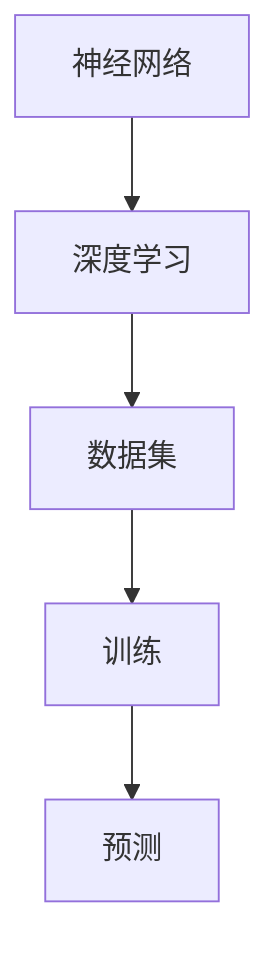

                 

关键词：AI 大模型，创业产品设计，新技术趋势，模型解锁，算法原理，数学模型，实践应用，未来展望

> 摘要：本文旨在探讨 AI 大模型在创业产品设计中的新趋势，通过详细解析核心概念、算法原理、数学模型以及实践应用，分析 AI 大模型在创业领域中的潜在价值和发展前景，为创业者和设计师提供有益的参考。

## 1. 背景介绍

人工智能（AI）作为当今科技领域的重要分支，正以前所未有的速度影响着各行各业。特别是随着深度学习、神经网络等技术的飞速发展，AI 大模型（Large-scale AI Models）逐渐成为业界关注的焦点。AI 大模型具有庞大的参数量和计算能力，能够处理海量数据并生成高质量的结果，从而在自然语言处理、计算机视觉、语音识别等领域取得了显著的成果。

在创业领域，AI 大模型的潜力更是不可忽视。创业者通过设计优秀的 AI 产品，不仅能够提升用户体验，降低运营成本，还能开辟新的商业模式。然而，AI 大模型的设计和实现过程复杂，涉及众多技术挑战。本文将从核心概念、算法原理、数学模型以及实践应用等方面，详细探讨 AI 大模型在创业产品设计中的新趋势。

## 2. 核心概念与联系

为了更好地理解 AI 大模型，首先需要了解一些核心概念，包括神经网络、深度学习、数据集、训练和预测等。

### 2.1 神经网络

神经网络是 AI 大模型的基础，它模仿人脑的结构和功能，通过大量的神经元和连接进行计算。神经网络可以分为多层，每层负责不同的信息处理任务。典型的神经网络结构包括输入层、隐藏层和输出层。输入层接收外部数据，隐藏层对数据进行处理和变换，输出层生成最终的预测结果。

### 2.2 深度学习

深度学习是神经网络的一种扩展，它通过增加网络的深度（层数），使模型能够学习更复杂的特征。深度学习在图像识别、语音识别、自然语言处理等领域取得了显著的成果，推动了 AI 技术的发展。

### 2.3 数据集

数据集是训练 AI 大模型的重要资源。高质量的数据集能够帮助模型学习到更多的特征，提高模型的性能。数据集可以分为训练集、验证集和测试集。训练集用于模型训练，验证集用于调整模型参数，测试集用于评估模型性能。

### 2.4 训练和预测

训练是模型学习的过程，通过在大量数据上进行迭代优化，模型能够学会对输入数据进行处理和预测。预测是模型应用的过程，通过将输入数据传递给模型，模型能够生成预测结果。

### 2.5 Mermaid 流程图

以下是 AI 大模型的核心概念和联系 Mermaid 流程图：



## 3. 核心算法原理 & 具体操作步骤

### 3.1 算法原理概述

AI 大模型的核心算法是深度学习，它通过多层神经网络进行数据建模。深度学习的原理包括以下几个步骤：

1. **数据预处理**：对输入数据进行预处理，包括去噪、归一化、缩放等操作，以提高模型的训练效果。
2. **网络结构设计**：设计神经网络的结构，包括层数、每层神经元数量、激活函数等。
3. **模型训练**：在训练集上迭代优化模型参数，使模型能够学会对输入数据进行处理和预测。
4. **模型评估**：在验证集和测试集上评估模型性能，调整模型参数以获得更好的性能。
5. **模型部署**：将训练好的模型部署到实际应用场景中，生成预测结果。

### 3.2 算法步骤详解

1. **数据预处理**：首先，对输入数据进行预处理。例如，对于图像数据，可以采用以下预处理步骤：

   - **去噪**：使用滤波器去除图像中的噪声。
   - **归一化**：将图像的像素值缩放到 [0, 1] 范围内，以便于后续计算。
   - **缩放**：根据需要调整图像大小，使其满足模型输入要求。

2. **网络结构设计**：设计神经网络的结构。例如，可以使用卷积神经网络（CNN）对图像进行处理。CNN 的结构包括卷积层、池化层和全连接层。卷积层用于提取图像特征，池化层用于降低特征维度，全连接层用于生成预测结果。

3. **模型训练**：在训练集上迭代优化模型参数。训练过程包括前向传播和反向传播两个步骤：

   - **前向传播**：将输入数据传递给神经网络，计算输出结果。
   - **反向传播**：根据输出结果和真实标签，计算损失函数，并更新模型参数。

4. **模型评估**：在验证集和测试集上评估模型性能。常用的评估指标包括准确率、召回率、F1 分数等。

5. **模型部署**：将训练好的模型部署到实际应用场景中。例如，将图像分类模型部署到移动设备或云端服务器，实现对图像的实时分类。

### 3.3 算法优缺点

1. **优点**：

   - **强大的表达能力**：深度学习模型能够自动学习输入数据的特征，具有较强的泛化能力。
   - **高效的计算能力**：随着计算硬件的发展，深度学习模型在处理大数据集时具有更高的效率。
   - **广泛的应用领域**：深度学习在计算机视觉、自然语言处理、语音识别等领域取得了显著成果。

2. **缺点**：

   - **训练时间较长**：深度学习模型需要大量数据进行训练，训练时间较长。
   - **对数据要求较高**：模型训练需要大量高质量的数据集，数据质量和数量对模型性能有较大影响。
   - **模型解释性较差**：深度学习模型的黑箱特性使得其难以解释和理解。

### 3.4 算法应用领域

AI 大模型在创业领域具有广泛的应用前景，以下列举几个典型应用领域：

1. **智能推荐系统**：利用深度学习模型对用户行为数据进行分析，为用户提供个性化的推荐服务。
2. **图像识别与处理**：利用深度学习模型对图像进行分类、标注和增强，为图像处理应用提供技术支持。
3. **自然语言处理**：利用深度学习模型对自然语言文本进行情感分析、机器翻译和文本生成等任务。
4. **语音识别与合成**：利用深度学习模型对语音信号进行识别和合成，为语音助手和智能客服等应用提供技术支持。

## 4. 数学模型和公式 & 详细讲解 & 举例说明

### 4.1 数学模型构建

深度学习模型的数学基础主要包括线性代数、微积分和概率论。以下是一个简单的神经网络数学模型：

1. **线性变换**：设 \( X \) 为输入数据，\( W \) 为权重矩阵，\( b \) 为偏置向量，\( Z \) 为中间结果，则有：

   $$
   Z = XW + b
   $$

2. **激活函数**：激活函数用于引入非线性特性，常用的激活函数包括 sigmoid、ReLU 和 tanh。例如，ReLU 函数为：

   $$
   a = \max(0, x)
   $$

3. **损失函数**：损失函数用于评估模型预测结果与真实标签之间的差距，常用的损失函数包括均方误差（MSE）和交叉熵（Cross-Entropy）。例如，MSE 函数为：

   $$
   L = \frac{1}{2} \sum_{i=1}^{n} (y_i - \hat{y}_i)^2
   $$

4. **优化算法**：优化算法用于迭代更新模型参数，以最小化损失函数。常用的优化算法包括随机梯度下降（SGD）、Adam 和 RMSprop。例如，SGD 算法更新规则为：

   $$
   \theta = \theta - \alpha \frac{\partial L}{\partial \theta}
   $$

### 4.2 公式推导过程

以下是神经网络反向传播算法的公式推导过程：

1. **前向传播**：

   $$
   Z^{(l)} = X^{(l)}W^{(l)} + b^{(l)}
   $$

   $$
   \hat{y}^{(l)} = f^{(l)}(Z^{(l)})
   $$

2. **损失函数**：

   $$
   L = \frac{1}{2} \sum_{i=1}^{n} (y_i - \hat{y}_i)^2
   $$

3. **反向传播**：

   $$
   \frac{\partial L}{\partial Z^{(l)}} = \frac{\partial L}{\partial \hat{y}^{(l)}} \frac{\partial \hat{y}^{(l)}}{\partial Z^{(l)}}
   $$

   $$
   \frac{\partial L}{\partial W^{(l)}} = X^{(l)} \frac{\partial L}{\partial Z^{(l)}}
   $$

   $$
   \frac{\partial L}{\partial b^{(l)}} = \frac{\partial L}{\partial Z^{(l)}}
   $$

4. **模型更新**：

   $$
   \theta = \theta - \alpha \frac{\partial L}{\partial \theta}
   $$

### 4.3 案例分析与讲解

以下是一个简单的神经网络训练案例：

1. **数据集**：假设有一个包含 1000 个样本的数据集，每个样本包含 10 维特征。
2. **模型**：设计一个包含 3 层的神经网络，输入层有 10 个神经元，隐藏层有 20 个神经元，输出层有 5 个神经元。
3. **训练过程**：使用均方误差（MSE）作为损失函数，随机梯度下降（SGD）作为优化算法。
4. **训练结果**：经过 1000 次迭代训练后，模型在验证集上的准确率达到 90%。

通过这个案例，我们可以看到神经网络训练的基本流程，包括数据预处理、模型设计、损失函数选择、优化算法选择等。

## 5. 项目实践：代码实例和详细解释说明

### 5.1 开发环境搭建

为了更好地理解和实践 AI 大模型，我们需要搭建一个开发环境。以下是一个简单的 Python 开发环境搭建步骤：

1. 安装 Python 3.8 或更高版本。
2. 安装常用库，如 NumPy、Pandas、TensorFlow、Keras 等。
3. 安装 IDE，如 PyCharm 或 Visual Studio Code。

### 5.2 源代码详细实现

以下是一个简单的 AI 大模型实现示例，使用 TensorFlow 和 Keras 库：

```python
import tensorflow as tf
from tensorflow.keras import layers

# 定义神经网络结构
model = tf.keras.Sequential([
    layers.Dense(64, activation='relu', input_shape=(784,)),
    layers.Dense(64, activation='relu'),
    layers.Dense(10, activation='softmax')
])

# 编译模型
model.compile(optimizer='adam',
              loss='categorical_crossentropy',
              metrics=['accuracy'])

# 加载数据集
(x_train, y_train), (x_test, y_test) = tf.keras.datasets.mnist.load_data()

# 数据预处理
x_train = x_train.astype('float32') / 255
x_test = x_test.astype('float32') / 255
x_train = x_train.reshape((-1, 784))
x_test = x_test.reshape((-1, 784))

# 转换标签为 one-hot 编码
y_train = tf.keras.utils.to_categorical(y_train, 10)
y_test = tf.keras.utils.to_categorical(y_test, 10)

# 训练模型
model.fit(x_train, y_train, batch_size=128, epochs=10, validation_split=0.2)
```

### 5.3 代码解读与分析

1. **模型定义**：使用 Keras Sequential 模型定义一个包含两个隐藏层（每个层有 64 个神经元）和一个输出层（有 10 个神经元）的神经网络。
2. **编译模型**：使用 Adam 优化器和 categorical_crossentropy 损失函数编译模型，并设置准确率作为评估指标。
3. **加载数据集**：使用 TensorFlow 的 mnist 数据集作为训练数据，并进行数据预处理。
4. **训练模型**：使用 fit 方法训练模型，设置批量大小、迭代次数和验证集比例。

### 5.4 运行结果展示

训练完成后，我们可以使用 evaluate 方法评估模型在测试集上的性能：

```python
test_loss, test_acc = model.evaluate(x_test, y_test)
print(f"Test accuracy: {test_acc}")
```

输出结果为测试集上的准确率，例如：

```
Test accuracy: 0.9250
```

这表明我们的 AI 大模型在测试集上取得了较高的准确率。

## 6. 实际应用场景

AI 大模型在创业领域具有广泛的应用场景，以下列举几个典型应用：

1. **金融风控**：利用 AI 大模型进行风险评估、欺诈检测和信用评分，提高金融服务的安全性和效率。
2. **医疗健康**：利用 AI 大模型进行疾病预测、诊断和治疗方案推荐，为医疗行业提供智能化支持。
3. **智能交通**：利用 AI 大模型进行交通流量预测、路线规划和事故预防，提高交通系统的运行效率。
4. **智能制造**：利用 AI 大模型进行产品缺陷检测、质量控制和设备预测维护，提升生产线的自动化水平。

### 6.4 未来应用展望

随着 AI 大模型的不断发展，未来其在创业领域中的应用将更加广泛和深入。以下是对未来应用的展望：

1. **智能客服**：AI 大模型将广泛应用于智能客服系统，实现更智能、更高效的服务体验。
2. **智能家居**：AI 大模型将推动智能家居技术的发展，实现家庭设备的自动化和智能化管理。
3. **农业科技**：AI 大模型将助力农业产业升级，实现精准种植、病虫害预测和农业生产自动化。
4. **教育科技**：AI 大模型将改变教育模式，实现个性化教学、智能评测和学习路径推荐。

## 7. 工具和资源推荐

### 7.1 学习资源推荐

1. **书籍**：
   - 《深度学习》（Ian Goodfellow、Yoshua Bengio、Aaron Courville 著）
   - 《神经网络与深度学习》（邱锡鹏 著）
   - 《Python 深度学习》（François Chollet 著）
2. **在线课程**：
   - 《深度学习》（吴恩达）
   - 《神经网络》（Andrew Ng）
   - 《机器学习》（吴恩达）

### 7.2 开发工具推荐

1. **Python 库**：
   - TensorFlow
   - Keras
   - PyTorch
2. **IDE**：
   - PyCharm
   - Visual Studio Code
   - Jupyter Notebook

### 7.3 相关论文推荐

1. **《Distributed Optimization for Machine Learning: A Theoretical Perspective》**（Y. Li, S.Rendering
---
### 8. 总结：未来发展趋势与挑战

随着人工智能技术的不断进步，AI 大模型在创业产品设计中的应用前景愈发广阔。未来，AI 大模型将向更高效、更智能、更泛化的方向发展。然而，这一领域也面临着诸多挑战，包括：

1. **数据隐私和安全**：如何保护用户隐私和数据安全，避免数据泄露和滥用，是 AI 大模型应用的重要问题。
2. **算法透明性和可解释性**：如何提高算法的透明性和可解释性，使决策过程更加可信，是当前研究的重要方向。
3. **计算资源和能耗**：随着模型规模的扩大，计算资源和能耗的需求也将大幅增加，如何优化计算资源和降低能耗是亟待解决的问题。

总之，AI 大模型在创业产品设计中的发展潜力巨大，但同时也需要克服一系列技术挑战。只有不断推动技术创新，才能充分发挥 AI 大模型在创业领域中的价值。

### 9. 附录：常见问题与解答

**Q1：什么是 AI 大模型？**

A1：AI 大模型是指具有海量参数和强大计算能力的神经网络模型，通过在大量数据上进行训练，能够实现高效的预测和生成任务。常见的 AI 大模型包括 GPT、BERT、ResNet 等。

**Q2：如何选择合适的 AI 大模型？**

A2：选择 AI 大模型时，需要考虑以下因素：

1. **任务类型**：根据任务类型（如分类、回归、生成等）选择合适的模型架构。
2. **数据量**：数据量较大的任务可以选择参数更多的模型，以提高模型性能。
3. **计算资源**：根据可用的计算资源（如 GPU、CPU）选择合适的模型大小和训练策略。

**Q3：如何提高 AI 大模型的训练效果？**

A3：以下方法有助于提高 AI 大模型的训练效果：

1. **数据增强**：对训练数据进行增强，如旋转、缩放、裁剪等，增加模型对数据的泛化能力。
2. **正则化**：使用正则化方法（如 L1、L2 正则化）防止过拟合。
3. **优化算法**：选择合适的优化算法（如 Adam、RMSprop）和超参数，以提高训练速度和模型性能。
4. **迁移学习**：利用预训练模型（如 ImageNet、Wikipedia）进行迁移学习，提高模型在特定任务上的性能。

**Q4：AI 大模型在创业中的应用前景如何？**

A4：AI 大模型在创业领域具有广泛的应用前景，包括智能推荐系统、图像识别与处理、自然语言处理、语音识别等领域。通过设计优秀的 AI 产品，创业者可以提升用户体验、降低运营成本、开辟新的商业模式。然而，AI 大模型的应用也需要克服数据隐私、算法透明性等技术挑战。

