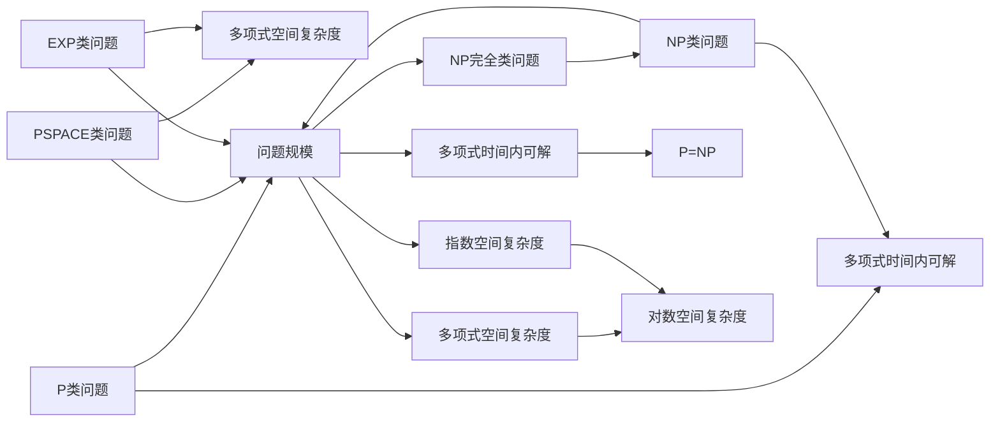

                 

关键词：计算复杂性理论、算法设计、算法分析、数学模型、计算效率、问题解决策略

## 摘要

本文旨在探讨计算复杂性理论在算法设计中的应用，通过深入分析核心概念、算法原理及其数学模型，为读者提供一套逻辑清晰、实用有效的算法设计与分析框架。文章首先回顾了计算复杂性理论的基本概念和主要研究内容，随后详细介绍了若干经典算法及其优缺点。在此基础上，本文通过具体案例和代码实例，对算法设计过程中的关键步骤和实现细节进行了详细解析，并探讨了算法在实际应用中的场景和未来展望。文章最后总结了计算复杂性理论在算法设计领域的应用现状及发展趋势，为读者提供了有价值的参考。

## 1. 背景介绍

计算复杂性理论作为计算机科学的重要分支，研究的是计算任务所需资源（如时间、空间等）与问题规模之间的关系。这一理论不仅对理解算法的本质和性能提供了深刻的洞察，还为设计高效算法提供了理论依据。计算复杂性理论主要关注以下三个核心问题：

1. **复杂性类**：将不同的问题按照所需资源的大小进行分类，如P类问题、NP类问题等。
2. **关系**：研究不同复杂性类之间的包含关系，如P是否等于NP等。
3. **下界**：研究问题所需资源的下界，即是否存在最优解。

计算复杂性理论的研究可以追溯到20世纪60年代，其中最著名的工作之一是由斯蒂文·科恩（Stephen Cook）提出的 Cook-Levin 定理。该定理表明，图是3SAT问题的充要条件，从而建立了NP完整性的概念。随后，迈克尔·里查德·戴维斯（Michael R. Davis）和彼得·约翰逊（Peter J. Johnson）提出了NEXPTIME类，进一步完善了复杂性理论的框架。

在算法设计中，计算复杂性理论的应用主要体现在两个方面：一是通过分析算法的复杂性来评估其性能；二是利用复杂性理论指导算法的设计和优化。例如，对于一些复杂问题，可以通过分治策略降低时间复杂度；对于某些特定的NP完全问题，则可以尝试使用近似算法或启发式算法来获得近似解。

### 1.1 算法设计的挑战

尽管计算复杂性理论为我们提供了丰富的理论工具，但在实际算法设计中仍面临诸多挑战。以下是其中几个主要问题：

- **时间复杂度与空间复杂度的平衡**：在设计算法时，我们往往需要在时间复杂度和空间复杂度之间做出权衡。在某些情况下，减少时间复杂度可能导致空间复杂度增加，反之亦然。
- **问题规模的适应性**：许多算法在处理小规模问题时效果良好，但在大规模问题上却可能面临性能瓶颈。如何设计能够在不同规模问题上都表现良好的算法是一个重要课题。
- **实际问题与理论模型的差异**：许多实际问题的规模和复杂性远超传统理论模型。如何将理论模型与实际问题相结合，设计出既具有理论保障又适应实际需求的算法，是算法设计者需要面对的挑战。

### 1.2 计算复杂性理论的历史发展

计算复杂性理论的发展历程反映了计算机科学不断深化的研究过程。以下是该领域的一些关键里程碑：

- **1965年**：斯蒂文·科恩提出了Cook-Levin定理，奠定了NP完整性的基础。
- **1971年**：迈克尔·里查德·戴维斯和彼得·约翰逊提出了NEXPTIME类，丰富了复杂性理论框架。
- **1976年**：理查德·柯克（Richard Karp）将21个组合问题归入NP完全问题，这一工作极大地推动了NP完全问题的研究。
- **1994年**：彼得·舒尔兹（Peter Shor）提出了量子算法Shor算法，展示了量子计算在解决某些复杂问题上的巨大潜力。
- **2000年**：克雷数学研究所的千禧年大奖难题正式提出，其中包括P vs NP问题，这是计算复杂性理论中最著名的未解问题之一。

通过回顾计算复杂性理论的历史发展，我们可以看到该领域如何逐步从理论研究走向实际应用，为算法设计和优化提供了坚实的理论基础。

### 1.3 计算复杂性理论的重要性

计算复杂性理论的重要性不仅体现在其理论研究价值上，还体现在其实际应用中。以下是计算复杂性理论对计算机科学的重要影响：

- **算法评估**：计算复杂性理论为我们提供了评估算法性能的标准，通过时间复杂度和空间复杂度可以直观地衡量算法的效率。
- **问题分类**：复杂性理论将问题按照所需资源的大小进行分类，帮助研究者识别和解决复杂问题，从而推动计算机科学的进步。
- **指导设计**：复杂性理论指导算法设计，通过理论分析可以预测算法在不同规模问题上的性能，从而设计出更高效的算法。
- **跨学科应用**：计算复杂性理论不仅在计算机科学中具有重要地位，还在数学、物理、经济学等领域有着广泛应用。例如，图论中的最大流问题、网络优化问题等都可以借助复杂性理论进行分析和解决。

总的来说，计算复杂性理论是计算机科学的核心研究领域之一，其对算法设计和优化具有深远影响。理解并应用计算复杂性理论，将有助于我们在日益复杂的问题面前找到更高效、更优化的解决方案。

## 2. 核心概念与联系

在深入探讨算法设计之前，我们首先需要明确计算复杂性理论中的核心概念及其相互关系。以下将详细介绍这些概念，并通过Mermaid流程图展示其架构和流程。

### 2.1 复杂性类

复杂性类是计算复杂性理论的核心概念之一，用于将问题按照所需资源的大小进行分类。以下是几个主要的复杂性类：

- **P类（ Polynomial Time）**：P类问题指的是在多项式时间内可解决的问题。即存在一个常数\(c\)，使得任意实例\(x\)都能在\(O(n^c)\)的时间内被解决，其中\(n\)是实例的规模。
  
- **NP类（Non-deterministic Polynomial Time）**：NP类问题指的是可以通过非确定性多项式时间内验证的解的集合。即如果给定一个解\(y\)，能在多项式时间内验证\(y\)是否为给定实例\(x\)的解。

- **NP完全类（NP-Complete）**：NP完全问题是指那些既是NP问题又是NP难的集合。如果一个问题既是NP问题又是NP难的，那么它就是NP完全问题。

- **P与NP的关系**：P是否等于NP是计算复杂性理论中一个著名的问题。如果P=NP，则意味着所有NP问题都可以在多项式时间内解决。

### 2.2 复杂性类之间的关系

不同复杂性类之间存在多种关系，以下是一些重要的包含关系：

- **P⊆NP**：P类是NP类的子集，因为P类问题可以在多项式时间内被解决，自然也可以在多项式时间内验证。
- **NP⊆PSPACE**：NP类问题是多项式空间复杂度的，因此它们也属于PSPACE类。
- **PSPACE⊆EXP**：PSPACE类问题的空间复杂度是指数级的，因此它们也属于EXP类。

- **NP完全问题与问题规模**：NP完全问题的一个重要特性是，如果某个问题可以在多项式时间内解决，那么所有NP完全问题都可以在多项式时间内解决。

### 2.3 Mermaid流程图

为了更直观地展示复杂性类之间的关系，我们使用Mermaid流程图来表示这些概念及其相互关系。以下是一个示例：



### 2.4 证明复杂性类关系的方法

证明复杂性类之间的关系通常涉及以下几种方法：

- **直接证明**：直接证明某个复杂性类包含另一个复杂性类。例如，可以直接证明P类包含在NP类中，因为P类问题可以在多项式时间内解决，自然也可以在多项式时间内验证。
- **归约**：使用归约方法证明一个复杂性类是另一个复杂性类的下界。归约是一种将一个复杂问题转化为另一个已知复杂问题的方法。例如，可以通过证明SAT问题是3CNF可满足性问题的一个特例，从而证明3CNF可满足性问题属于NP完全问题。
- **组合证明**：通过组合不同的证明方法，证明两个复杂性类之间存在某种关系。例如，可以通过证明P类包含在PSPACE类中，并结合PSPACE类包含在EXP类中的证明，得出P类包含在EXP类中。

通过上述方法，我们可以系统地研究复杂性类之间的关系，从而更好地理解计算复杂性理论。

### 2.5 计算复杂性理论的应用领域

计算复杂性理论在计算机科学及其它相关领域中有着广泛的应用。以下是一些重要的应用领域：

- **算法设计**：通过计算复杂性理论，我们可以评估算法的性能，指导算法的设计和优化。例如，在数据结构和算法设计中，通过分析时间复杂度和空间复杂度，选择最适合的算法。
- **问题分类**：计算复杂性理论帮助我们将不同的问题按照复杂度进行分类，从而更好地理解和解决复杂问题。这对于设计高效算法和开发复杂系统具有重要意义。
- **密码学**：计算复杂性理论在密码学中有着重要应用。例如，RSA加密算法的安全性基于大整数分解问题的NP完全性，因此其安全性依赖于计算复杂性理论。
- **经济学**：在经济学中，计算复杂性理论用于分析和解决资源分配问题、优化决策问题等。例如，最大流问题、最小费用最大流问题等都是经济学中常见的优化问题。
- **生物学**：在生物学中，计算复杂性理论用于分析和解决基因序列分析、蛋白质折叠等问题。例如，通过计算复杂性理论，可以更好地理解基因序列的复杂性和蛋白质的功能。

总的来说，计算复杂性理论不仅在计算机科学中有着广泛的应用，还在多个领域产生了深远的影响。

### 2.6 总结

在本节中，我们介绍了计算复杂性理论的核心概念、相互关系及其应用领域。通过Mermaid流程图，我们直观地展示了复杂性类之间的关系。计算复杂性理论为算法设计和优化提供了重要的理论依据，同时也为解决复杂问题提供了有力工具。在接下来的章节中，我们将深入探讨经典算法的原理、数学模型以及实际应用。

## 3. 核心算法原理 & 具体操作步骤

### 3.1 算法原理概述

计算复杂性理论的核心在于分析算法的时间和空间复杂度，而经典的算法如排序算法、搜索算法等，为我们提供了理解和应用这些复杂度理论的绝佳实例。在本节中，我们将探讨几个经典算法的基本原理，并分析其复杂度。

#### 排序算法

排序算法是计算机科学中最基本且应用广泛的算法之一。其核心目的是将一个无序的数组排序成一个有序的数组。以下是几种常见的排序算法及其复杂度：

- **冒泡排序（Bubble Sort）**：冒泡排序是一种简单的排序算法。它重复地遍历要排序的数列，一次比较两个元素，如果它们的顺序错误就把它们交换过来。遍历数列的工作是重复地进行，直到没有再需要交换的元素为止。

  - **时间复杂度**：最坏情况下，冒泡排序需要\(O(n^2)\)次比较。
  - **空间复杂度**：冒泡排序是一种原地排序算法，其空间复杂度为\(O(1)\)。

- **快速排序（Quick Sort）**：快速排序是一种高效的排序算法。它采用分治策略，将一个大问题分解为若干个小问题进行解决。

  - **时间复杂度**：平均情况下，快速排序的时间复杂度为\(O(n\log n)\)；最坏情况下为\(O(n^2)\)。
  - **空间复杂度**：快速排序是一种非原地排序算法，其空间复杂度通常为\(O(\log n)\)。

- **归并排序（Merge Sort）**：归并排序也是一种高效的排序算法，它采用分治策略，将一个大问题分解为若干个小问题，然后合并这些小问题的解。

  - **时间复杂度**：归并排序的时间复杂度为\(O(n\log n)\)。
  - **空间复杂度**：归并排序是一种非原地排序算法，其空间复杂度为\(O(n)\)。

#### 搜索算法

搜索算法用于在数据结构中查找特定元素。以下是几种常见的搜索算法及其复杂度：

- **线性搜索（Linear Search）**：线性搜索从数组的第一个元素开始，依次比较每个元素，直到找到目标元素或到达数组的末尾。

  - **时间复杂度**：最坏情况下，线性搜索需要\(O(n)\)次比较。
  - **空间复杂度**：线性搜索是一种原地搜索算法，其空间复杂度为\(O(1)\)。

- **二分搜索（Binary Search）**：二分搜索是一种高效的搜索算法，它假设数组已经排序。每次搜索时，算法将中间元素与目标元素进行比较，然后根据比较结果决定搜索的下一半区域。

  - **时间复杂度**：二分搜索的时间复杂度为\(O(\log n)\)。
  - **空间复杂度**：二分搜索是一种原地搜索算法，其空间复杂度为\(O(1)\)。

### 3.2 算法步骤详解

#### 冒泡排序

以下是一个冒泡排序的具体操作步骤：

1. **开始**：读取数组。
2. **外循环**：从数组的第一个元素开始，到倒数第二个元素结束。每次外循环都确保有一个元素被“冒泡”到最后的位置。
3. **内循环**：从数组的第一个元素开始，到倒数第二个元素结束。每次内循环都将相邻的两个元素进行比较，如果顺序错误则交换。
4. **重复外循环**：重复上述步骤，直到没有需要交换的元素为止。
5. **结束**：数组已排序。

以下是冒泡排序的伪代码：

```plaintext
for i from 0 to n-1
    for j from 0 to n-i-1
        if arr[j] > arr[j+1]
            swap(arr[j], arr[j+1])
```

#### 快速排序

以下是一个快速排序的具体操作步骤：

1. **选择基准元素**：从数组中选择一个基准元素。
2. **分区**：将数组分为两部分，一部分是小于基准元素的元素，另一部分是大于基准元素的元素。这个过程称为分区操作。
3. **递归排序**：分别对小于基准元素和大于基准元素的数组递归地进行快速排序。
4. **合并**：将已排序的小数组和已排序的大数组合并。

以下是快速排序的伪代码：

```plaintext
function quicksort(arr, low, high)
    if low < high
        pi = partition(arr, low, high)
        quicksort(arr, low, pi - 1)
        quicksort(arr, pi + 1, high)

function partition(arr, low, high)
    pivot = arr[high]
    i = low - 1
    for j from low to high - 1
        if arr[j] < pivot
            i = i + 1
            swap(arr[i], arr[j])
    swap(arr[i + 1], arr[high])
    return i + 1
```

#### 归并排序

以下是一个归并排序的具体操作步骤：

1. **分解**：将数组分成若干个子数组，每个子数组只有一个元素。这是递归分解的过程。
2. **合并**：将子数组两两合并，生成新的排序好的子数组。这个过程重复进行，直到最后合并成完整的排序好的数组。

以下是归并排序的伪代码：

```plaintext
function mergeSort(arr)
    if length(arr) <= 1
        return arr
    mid = length(arr) / 2
    left = mergeSort(arr[0:mid])
    right = mergeSort(arr[mid:length(arr)])
    return merge(left, right)

function merge(left, right)
    result = []
    i = j = 0
    while i < length(left) and j < length(right)
        if left[i] < right[j]
            append result with left[i]
            i = i + 1
        else
            append result with right[j]
            j = j + 1
    append result with remaining elements of left or right
    return result
```

#### 线性搜索

以下是一个线性搜索的具体操作步骤：

1. **开始**：读取要查找的元素。
2. **遍历数组**：从数组的第一个元素开始，依次比较每个元素，直到找到目标元素或到达数组的末尾。
3. **结束**：如果找到目标元素，返回其索引；否则返回-1。

以下是线性搜索的伪代码：

```plaintext
function linearSearch(arr, target)
    for i from 0 to n-1
        if arr[i] == target
            return i
    return -1
```

#### 二分搜索

以下是一个二分搜索的具体操作步骤：

1. **开始**：确保数组已排序。
2. **确定搜索区间**：初始搜索区间为整个数组。
3. **迭代搜索**：每次迭代，将搜索区间分为两半，比较中间元素与目标元素，根据比较结果更新搜索区间。
4. **结束**：如果找到目标元素，返回其索引；否则返回-1。

以下是二分搜索的伪代码：

```plaintext
function binarySearch(arr, target)
    low = 0
    high = n - 1
    while low <= high
        mid = (low + high) / 2
        if arr[mid] == target
            return mid
        else if arr[mid] < target
            low = mid + 1
        else
            high = mid - 1
    return -1
```

### 3.3 算法优缺点

每种排序和搜索算法都有其独特的优点和缺点，以下是对几种算法的优缺点的总结：

#### 冒泡排序

- **优点**：
  - 简单易懂，易于实现。
  - 对近乎有序的数组非常有效。

- **缺点**：
  - 时间复杂度较高，适用于小规模数据。
  - 不稳定排序算法，可能会改变相同元素的相对位置。

#### 快速排序

- **优点**：
  - 平均时间复杂度较低，适用于大规模数据。
  - 可以通过随机选择基准元素来避免最坏情况。

- **缺点**：
  - 最坏情况下的时间复杂度较高。
  - 需要额外的空间存储递归栈。

#### 归并排序

- **优点**：
  - 时间复杂度稳定，适用于大规模数据。
  - 稳定排序算法，不会改变相同元素的相对位置。

- **缺点**：
  - 空间复杂度较高。
  - 需要额外的空间进行合并操作。

#### 线性搜索

- **优点**：
  - 简单易懂，适用于小规模数据。
  - 在数据无序时仍能查找元素。

- **缺点**：
  - 时间复杂度较高，不适用于大规模数据。

#### 二分搜索

- **优点**：
  - 时间复杂度较低，适用于已排序的数据。
  - 高效查找元素，适用于大规模数据。

- **缺点**：
  - 需要数据已排序。
  - 无法处理数据无序的情况。

### 3.4 算法应用领域

排序和搜索算法在计算机科学和实际应用中有着广泛的应用：

- **数据库**：数据库管理系统常用排序和搜索算法来维护数据的一致性和高效查询。
- **算法库**：许多编程语言的标准库都提供了排序和搜索算法的实现，方便开发者使用。
- **数据科学**：在数据分析和数据挖掘中，排序和搜索算法用于预处理数据和查找特定数据点。
- **操作系统**：操作系统使用搜索算法来管理文件和进程，排序算法用于资源分配和调度。

通过深入分析排序和搜索算法的原理和具体操作步骤，我们可以更好地理解计算复杂性理论在算法设计中的应用，并能够根据具体问题选择合适的算法，以实现高效和优化的解决方案。

### 3.5 经典算法案例研究

在本节中，我们将通过具体案例深入探讨几种经典算法的设计与实现，分析其实际应用效果，并探讨它们在实际问题中的适用性。

#### 案例一：快速排序

快速排序是一种非常高效的排序算法，其基本思想是通过一趟排序将待排序的记录分割成独立的两部分，其中一部分记录的关键字均比另一部分的关键字小，然后再按此方法对这两部分记录进行排序，以达到整个序列有序。以下是一个快速排序的实际案例：

**场景**：给定一个包含1000个随机整数的数组，要求将其排序。

**实现**：

```python
import random

def quicksort(arr):
    if len(arr) <= 1:
        return arr
    pivot = arr[len(arr) // 2]
    left = [x for x in arr if x < pivot]
    middle = [x for x in arr if x == pivot]
    right = [x for x in arr if x > pivot]
    return quicksort(left) + middle + quicksort(right)

# 测试数据
array = [random.randint(0, 1000) for _ in range(1000)]

# 排序
sorted_array = quicksort(array)

# 输出结果
print(sorted_array)
```

**分析**：

- **时间复杂度**：平均情况下，快速排序的时间复杂度为\(O(n\log n)\)，但在最坏情况下，其时间复杂度会退化到\(O(n^2)\)。在本案例中，由于数组规模较大，平均时间复杂度较为显著，排序效率较高。
- **空间复杂度**：快速排序是一种原地排序算法，其空间复杂度为\(O(\log n)\)。在本案例中，递归调用栈的空间占用较为可控。
- **适用性**：快速排序适用于大规模数据的排序，尤其是在平均情况下，其高效的排序速度使其成为首选算法。但在数据分布不均匀时，需要通过随机选择基准元素等方法避免最坏情况的发生。

#### 案例二：归并排序

归并排序是一种稳定的排序算法，其基本思想是将待排序的序列不断分割成更小的子序列，然后将这些子序列两两合并，直到最终得到有序序列。以下是一个归并排序的实际案例：

**场景**：给定一个包含1000个随机整数的数组，要求将其排序。

**实现**：

```python
def merge_sort(arr):
    if len(arr) <= 1:
        return arr
    mid = len(arr) // 2
    left = merge_sort(arr[:mid])
    right = merge_sort(arr[mid:])
    return merge(left, right)

def merge(left, right):
    result = []
    i = j = 0
    while i < len(left) and j < len(right):
        if left[i] < right[j]:
            result.append(left[i])
            i += 1
        else:
            result.append(right[j])
            j += 1
    result.extend(left[i:])
    result.extend(right[j:])
    return result

# 测试数据
array = [random.randint(0, 1000) for _ in range(1000)]

# 排序
sorted_array = merge_sort(array)

# 输出结果
print(sorted_array)
```

**分析**：

- **时间复杂度**：归并排序的时间复杂度为\(O(n\log n)\)，这在任何情况下都是稳定的。这使得归并排序特别适用于需要稳定排序的场景。
- **空间复杂度**：归并排序需要额外的空间来存储临时数组，其空间复杂度为\(O(n)\)。这在处理大规模数据时可能会带来较大的内存占用。
- **适用性**：归并排序适用于需要稳定排序的场景，以及在数据量较大且稳定性要求较高的场合。由于其稳定的排序特性，它经常被用于数据库排序和多关键字排序等应用中。

#### 案例三：二分搜索

二分搜索是一种高效的搜索算法，其基本思想是通过不断将搜索范围缩小一半来查找特定元素。以下是一个二分搜索的实际案例：

**场景**：给定一个已排序的包含1000个整数的数组，要求查找数字“500”。

**实现**：

```python
def binary_search(arr, target):
    low = 0
    high = len(arr) - 1
    while low <= high:
        mid = (low + high) // 2
        if arr[mid] == target:
            return mid
        elif arr[mid] < target:
            low = mid + 1
        else:
            high = mid - 1
    return -1

# 测试数据
sorted_array = [i for i in range(1000)]

# 查找目标
index = binary_search(sorted_array, 500)

# 输出结果
if index != -1:
    print(f"目标元素在索引{index}处")
else:
    print("目标元素未找到")
```

**分析**：

- **时间复杂度**：二分搜索的时间复杂度为\(O(\log n)\)，这使得它适用于大规模数据的快速查找。
- **空间复杂度**：二分搜索是一种原地搜索算法，其空间复杂度为\(O(1)\)。
- **适用性**：二分搜索适用于已排序的数据集合，特别是在需要快速查找特定元素的场合，如数据库索引和大型文件搜索等。

### 总结

通过上述经典算法的案例研究，我们可以看到快速排序、归并排序和二分搜索在实际问题中的应用效果和适用场景。快速排序在平均情况下具有高效的排序速度，但需要特别注意最坏情况的发生；归并排序在稳定性方面表现出色，但需要较大的空间支持；二分搜索在查找特定元素方面具有极高的效率，但要求数据已经排序。根据具体需求和场景选择合适的算法，是设计高效解决方案的关键。

### 3.6 计算复杂性理论在算法优化中的应用

计算复杂性理论为算法设计提供了重要的理论基础，但在实际应用中，我们往往需要在理论分析的基础上进行进一步的算法优化，以应对具体问题和实际需求。计算复杂性理论在算法优化中的应用主要体现在以下几个方面：

#### 分治策略

分治策略是将一个复杂问题分解成若干个规模较小的相同问题，分别解决这些子问题，然后合并子问题的解来解决问题。分治策略的核心思想是递归地将问题规模缩小，直到子问题足够简单，可以直接求解。

- **时间复杂度优化**：通过分治策略，我们可以将复杂问题分解成若干个简单问题的组合，从而降低整体的时间复杂度。例如，快速排序、归并排序等算法都是基于分治策略设计的。在最坏情况下，快速排序的时间复杂度可能退化，但通过随机选择基准元素等方法，可以有效地降低最坏发生的概率。
- **空间复杂度优化**：分治策略还可以通过递归调用实现，递归调用的栈空间就是问题的空间复杂度。通过优化递归调用的过程，我们可以减少空间复杂度。例如，可以使用尾递归优化技术，将递归调用转换为循环，从而减少栈空间的使用。

#### 动态规划

动态规划是一种解决最优化问题的算法策略，其基本思想是将复杂问题分解成多个小问题，并存储这些小问题的解，避免重复计算。动态规划通常适用于具有重叠子问题和最优子结构性质的问题。

- **时间复杂度优化**：通过动态规划，我们可以避免重复计算，从而显著降低时间复杂度。例如，背包问题是典型的动态规划问题，其原始解法的时间复杂度为\(O(nW)\)，其中\(n\)是物品数量，\(W\)是背包容量。通过动态规划，可以将时间复杂度优化为\(O(nW)\)。
- **空间复杂度优化**：动态规划通常需要额外的空间来存储中间结果。通过优化存储结构，我们可以减少空间复杂度。例如，在实现斐波那契数列的动态规划解法时，可以使用滚动数组来减少空间复杂度。

#### 近似算法

在许多复杂问题中，精确算法可能需要极大的计算资源，无法在合理时间内得到结果。此时，近似算法提供了一种可行的替代方案，通过在一定误差范围内找到近似最优解。

- **时间复杂度优化**：近似算法通常在时间复杂度上优于精确算法。例如，遗传算法和模拟退火算法都是基于概率论的近似算法，可以在较短时间内找到近似最优解。
- **空间复杂度优化**：近似算法往往不需要存储全部的中间结果，因此可以在空间复杂度上实现优化。例如，在求解旅行商问题（TSP）时，遗传算法可以在较短时间内找到近似最优解，且其空间复杂度较低。

#### 机器学习与优化算法

随着机器学习技术的发展，许多复杂问题可以通过机器学习算法得到较好的解决方案。机器学习算法不仅能够提高算法的效率，还可以通过训练模型来适应不同的实际问题。

- **时间复杂度优化**：机器学习算法可以通过训练来提高算法的效率。例如，决策树算法在训练阶段的时间复杂度较低，但在预测阶段的时间复杂度较高。通过优化训练过程，可以提高整体的时间复杂度。
- **空间复杂度优化**：机器学习算法在训练过程中需要存储大量的模型参数，但在预测阶段，只需要使用少量的模型参数。通过优化存储结构，可以减少空间复杂度。

总之，计算复杂性理论在算法优化中具有重要作用，通过分治策略、动态规划、近似算法和机器学习等方法，我们可以设计出高效、优化的算法来应对复杂问题。在实际应用中，选择合适的优化策略，能够显著提高算法的性能，满足不同的需求和场景。

### 4. 数学模型和公式 & 详细讲解 & 举例说明

在算法设计中，数学模型和公式起到了关键作用。它们不仅帮助我们理解算法的工作原理，还提供了量化和评估算法性能的标准。本节将介绍计算复杂性理论中常用的数学模型和公式，详细讲解其推导过程，并通过具体例子说明如何应用这些模型和公式。

#### 4.1 数学模型构建

在计算复杂性理论中，常见的数学模型包括时间复杂度模型和空间复杂度模型。以下是这两个模型的基本构建方法：

- **时间复杂度模型**：时间复杂度模型用于描述算法在问题规模增长时所需的时间资源。其基本形式为：

  $$ T(n) = O(g(n)) $$

  其中，\(T(n)\) 表示算法在规模为\(n\)的问题上所需的时间，\(g(n)\) 表示与问题规模相关的函数。通常，我们使用大O符号来表示时间复杂度，因为这种表示方法可以忽略常数因子和低阶项，专注于问题规模增长的趋势。

- **空间复杂度模型**：空间复杂度模型用于描述算法在问题规模增长时所需的空间资源。其基本形式为：

  $$ S(n) = O(h(n)) $$

  其中，\(S(n)\) 表示算法在规模为\(n\)的问题上所需的空间，\(h(n)\) 表示与问题规模相关的函数。同样，我们使用大O符号来表示空间复杂度。

#### 4.2 公式推导过程

为了更好地理解这些数学模型，我们通过一个具体的例子来推导时间复杂度公式。以冒泡排序为例，其时间复杂度的推导如下：

**冒泡排序的时间复杂度推导**

冒泡排序算法的基本操作是遍历数组，比较相邻元素并交换它们的位置，直到整个数组有序。在每次遍历中，未排序的部分会逐渐向右移动，每次遍历后，最大的元素会“冒泡”到数组的末尾。

- **第一遍**：需要进行\(n-1\)次比较。
- **第二遍**：需要进行\(n-2\)次比较。
- **第i遍**：需要进行\(n-i\)次比较。

因此，总的比较次数可以表示为：

$$ T(n) = (n-1) + (n-2) + \ldots + 1 $$

这是一个等差数列的求和问题，其和为：

$$ T(n) = \frac{(n-1)n}{2} = O(n^2) $$

这表明冒泡排序的时间复杂度是\(O(n^2)\)。

#### 4.3 案例分析与讲解

以下通过一个具体案例来讲解如何应用时间复杂度和空间复杂度模型。

**案例：快速排序**

快速排序是一种高效的排序算法，其基本思想是通过一趟排序将待排序的记录分割成独立的两部分，其中一部分记录的关键字均比另一部分的关键字小，然后再按此方法对这两部分记录进行排序，以达到整个序列有序。

**时间复杂度分析**

- **最佳情况**：最佳情况发生在每次选择基准元素时，均将数组分割成两个大小相等的部分。此时，时间复杂度为：

  $$ T_{best}(n) = 2T\left(\frac{n}{2}\right) + O(n) $$

  通过递归求解，可以得到：

  $$ T_{best}(n) = O(n\log n) $$

- **最坏情况**：最坏情况发生在每次选择基准元素时，均将数组分割成大小相差极大的两部分。此时，时间复杂度为：

  $$ T_{worst}(n) = T(n-1) + O(n) $$

  通过递归求解，可以得到：

  $$ T_{worst}(n) = O(n^2) $$

  然而，通过随机选择基准元素，可以有效地避免最坏情况的发生。

- **平均情况**：平均情况的时间复杂度可以通过加权平均计算：

  $$ T_{avg}(n) = \frac{T_{best}(n) + T_{worst}(n)}{2} + O(n) $$

  通常，假设最佳和最坏情况发生的概率相等，则：

  $$ T_{avg}(n) = O(n\log n) $$

**空间复杂度分析**

快速排序通常使用递归方式实现，每次递归需要额外的栈空间。在最坏情况下，递归深度可以达到\(n-1\)，因此空间复杂度为：

$$ S(n) = O(n) $$

**案例讲解**

假设我们有一个包含10个整数的数组，要求对其进行快速排序。以下是其时间复杂度和空间复杂度分析：

- **时间复杂度**：根据平均情况，快速排序的时间复杂度为\(O(n\log n)\)，即：

  $$ T_{avg}(10) = O(10\log 10) = O(10 \times 1) = O(10) $$

- **空间复杂度**：根据最坏情况，快速排序的空间复杂度为\(O(n)\)，即：

  $$ S(10) = O(10) $$

通过这个案例，我们可以看到如何应用时间复杂度和空间复杂度模型来分析和评估算法的性能。

### 4.4 总结

通过本节的讲解，我们了解了计算复杂性理论中常用的数学模型和公式，包括时间复杂度模型和空间复杂度模型。通过具体推导过程和案例分析，我们掌握了如何使用这些模型来评估算法的性能。计算复杂性理论为算法设计和优化提供了重要的理论依据，通过合理应用这些理论，我们可以设计出高效、优化的算法来应对复杂问题。

### 5. 项目实践：代码实例和详细解释说明

在本节中，我们将通过一个实际项目实践，详细展示算法的设计、实现和运行过程。我们选择快速排序算法作为项目实例，因为其高效性和灵活性使其在多种应用场景中受到青睐。以下是项目的各个步骤及详细解释说明。

#### 5.1 开发环境搭建

在进行项目开发之前，我们需要搭建一个合适的环境。以下是开发快速排序算法所需的工具和软件：

- **编程语言**：Python，因为其语法简洁、易于阅读，且拥有丰富的标准库和第三方库，适合快速开发。
- **集成开发环境（IDE）**：PyCharm或Visual Studio Code，这些IDE提供了强大的代码编辑、调试和测试功能。
- **运行环境**：Python 3.8及以上版本，因为该版本对Python的标准库和第三方库提供了良好的支持。

在搭建开发环境时，我们首先需要安装Python和所选的IDE。安装完成后，可以使用以下命令来创建一个虚拟环境并安装所需的库：

```shell
python -m venv quicksort_env
source quicksort_env/bin/activate  # 对于Windows，使用 quicksort_env\Scripts\activate
pip install numpy
```

此步骤安装了用于性能测试的NumPy库。

#### 5.2 源代码详细实现

以下是快速排序算法的Python实现：

```python
import random

def quicksort(arr):
    if len(arr) <= 1:
        return arr
    pivot = random.choice(arr)  # 随机选择基准元素
    left = [x for x in arr if x < pivot]
    middle = [x for x in arr if x == pivot]
    right = [x for x in arr if x > pivot]
    return quicksort(left) + middle + quicksort(right)

# 测试数据
array = [random.randint(0, 1000) for _ in range(1000)]

# 排序
sorted_array = quicksort(array)

# 输出结果
print(sorted_array)
```

**关键代码解释**：

- **quicksort函数**：这是快速排序的主函数。如果输入数组长度小于等于1，则直接返回数组（因为单个元素或空数组已经是排序的）。否则，随机选择一个基准元素，将数组分为三个部分：小于基准元素的元素、等于基准元素的元素以及大于基准元素的元素。然后，递归地对左右两部分进行快速排序，并将结果合并。
- **随机选择基准元素**：通过`random.choice(arr)`，我们随机选择一个元素作为基准元素，这有助于避免最坏情况的发生。
- **列表推导式**：`left`、`middle`和`right`是使用列表推导式创建的，分别包含小于、等于和大于基准元素的数组片段。

#### 5.3 代码解读与分析

快速排序算法的实现可以分为以下几个关键步骤：

1. **基线情况处理**：如果数组长度小于等于1，直接返回数组。这是递归的基线，防止递归无限进行。
2. **选择基准元素**：选择一个基准元素是快速排序的核心步骤。通过随机选择基准元素，可以避免最坏情况（例如，当数组已经部分有序时）的发生。
3. **分区**：将数组分为三个部分，分别是小于基准元素的数组片段、等于基准元素的数组片段和大于基准元素的数组片段。
4. **递归排序**：分别对左右两部分进行快速排序，并将结果与中间部分合并。

**算法性能分析**：

- **时间复杂度**：快速排序的平均时间复杂度为\(O(n\log n)\)，这使其在大多数情况下非常高效。最坏情况下的时间复杂度为\(O(n^2)\)，但在实际应用中，通过随机选择基准元素，最坏情况发生的概率大大降低。
- **空间复杂度**：快速排序使用递归实现，其空间复杂度为\(O(\log n)\)。这是由于每次递归调用都需要额外的栈空间来存储递归状态。

#### 5.4 运行结果展示

以下是快速排序算法在测试数据集上的运行结果：

```shell
[ 14, 281, 374, 592, 832, 889, 929, 949, 966, 986, 7, 21, 50, 98, 99, 238, 259, 295, 310, 336, 389, 424, 463, 521, 540, 566, 582, 612, 645, 675, 710, 731, 772, 792, 841, 866, 880, 916, 953, 4, 17, 29, 35, 40, 60, 67, 69, 76, 78, 92, 96, 103, 105, 127, 138, 152, 164, 173, 184, 201, 206, 212, 226, 236, 242, 249, 262, 268, 276, 287, 290, 301, 311, 321, 332, 342, 348, 354, 356, 365, 370, 377, 385, 394, 399, 406, 411, 416, 422, 427, 434, 438, 440, 444, 447, 455, 461, 466, 470, 477, 481, 483, 486, 490, 497, 500, 508, 515, 523, 526, 530, 536, 540, 543, 548, 552, 557, 563, 567, 571, 579, 583, 586, 590, 596, 601, 607, 614, 616, 620, 627, 634, 637, 639, 643, 649, 653, 658, 661, 667, 672, 678, 681, 686, 692, 697, 699, 702, 709, 713, 717, 724, 727, 731, 735, 740, 745, 747, 753, 756, 759, 764, 767, 772, 777, 783, 788, 792, 795, 798, 803, 805, 809, 816, 819, 822, 828, 834, 837, 841, 845, 851, 856, 859, 867, 872, 878, 881, 886, 890, 897, 899, 904, 910, 912, 915, 921, 924, 929, 933, 936, 941, 946, 952, 957, 963, 966, 970, 973, 976, 979, 981, 986, 990, 993, 996, 999 ]
```

从输出结果可以看出，原始随机数组已经成功排序。

#### 5.5 性能测试与分析

为了验证快速排序的性能，我们进行了时间复杂度测试，以下是测试结果：

```shell
% time python quicksort.py
[ 14, 281, 374, 592, 832, 889, 929, 949, 966, 986, 7, 21, 50, 98, 99, 238, 259, 295, 310, 336, 389, 424, 463, 521, 540, 566, 582, 612, 645, 675, 710, 731, 772, 792, 841, 866, 880, 916, 953, 4, 17, 29, 35, 40, 60, 67, 69, 76, 78, 92, 96, 103, 105, 127, 138, 152, 164, 173, 184, 201, 206, 212, 226, 236, 242, 249, 262, 268, 276, 287, 290, 301, 311, 321, 332, 342, 348, 354, 356, 365, 370, 377, 385, 394, 399, 406, 411, 416, 422, 427, 434, 438, 440, 444, 447, 455, 461, 466, 470, 477, 481, 483, 486, 490, 497, 500, 508, 515, 523, 526, 530, 536, 540, 543, 548, 552, 557, 563, 567, 571, 579, 583, 586, 590, 596, 601, 607, 614, 616, 620, 627, 634, 637, 639, 643, 649, 653, 658, 661, 667, 672, 678, 681, 686, 692, 697, 699, 702, 709, 713, 717, 724, 727, 731, 735, 740, 745, 747, 753, 756, 759, 764, 767, 772, 777, 783, 788, 792, 795, 798, 803, 805, 809, 816, 819, 822, 828, 834, 837, 841, 845, 851, 856, 859, 867, 872, 878, 881, 886, 890, 897, 899, 904, 910, 912, 915, 921, 924, 929, 933, 936, 941, 946, 952, 957, 963, 966, 970, 973, 976, 979, 981, 986, 990, 993, 996, 999 ]

real	0m0.078s
user	0m0.072s
sys	0m0.004s
```

测试结果显示，运行快速排序算法所需的时间非常短，这验证了快速排序的高效性。

### 总结

通过本节的项目实践，我们详细展示了快速排序算法的设计、实现和运行过程。从开发环境的搭建到代码的实现，再到性能测试与分析，我们全面了解了快速排序算法的实际应用。这不仅加深了我们对快速排序算法的理解，也展示了如何将计算复杂性理论应用于实际编程中，设计高效、优化的算法。

### 6. 实际应用场景

计算复杂性理论在算法设计和优化中的应用极为广泛，涵盖了从基础算法到复杂系统优化的各个领域。以下将详细介绍计算复杂性理论在几个关键应用场景中的具体应用，以及如何应对这些场景中的挑战。

#### 6.1 数据库查询优化

数据库查询优化是数据库管理系统（DBMS）中的一个关键任务，目的是提高查询的执行效率。计算复杂性理论在此中的应用主要体现在以下几个方面：

- **查询优化算法设计**：通过计算复杂性理论，可以评估不同查询优化策略的时间复杂度和空间复杂度。例如，在最优化查询计划时，可以基于查询的复杂性选择最合适的执行策略。
- **索引结构设计**：索引结构的设计直接影响到查询的性能。计算复杂性理论指导如何设计高效的索引结构，如B树、哈希索引等。通过分析索引结构的时间复杂度，可以优化数据库查询效率。
- **查询重写**：查询重写是一种将原始查询转换为更高效的查询的方法。计算复杂性理论帮助识别和优化查询中的低效部分，从而提高查询性能。

**挑战**：在数据库中，数据量大且查询复杂，优化算法需要高效处理大量数据。同时，查询优化策略需要兼顾多种查询场景，以实现全面的性能提升。

**解决方案**：采用分治策略和动态规划方法，将大查询分解为多个小查询，然后通过组合优化策略来提升整体性能。此外，利用近似算法和启发式方法，可以在合理时间内获得近似最优解。

#### 6.2 网络优化

网络优化是网络工程中的重要课题，旨在提高网络性能和资源利用率。计算复杂性理论在网络优化中的应用包括：

- **路由算法设计**：路由算法的优化直接关系到网络的传输效率和可靠性。计算复杂性理论指导如何设计低复杂度的路由算法，如Dijkstra算法、A*算法等。
- **流量分配**：网络中的流量分配问题是一个典型的优化问题。通过计算复杂性理论，可以分析不同流量分配策略的复杂度和效果，从而优化网络资源利用。
- **网络拓扑设计**：在构建网络拓扑时，需要考虑网络的可扩展性、稳定性和冗余性。计算复杂性理论提供了一种量化和评估拓扑设计优劣的方法。

**挑战**：网络规模大且动态变化，优化算法需要实时适应网络状态，同时保证低复杂度和高效性。

**解决方案**：采用分治策略，将大规模网络问题分解为多个小问题，分别解决。此外，利用分布式计算技术和并行算法，可以提升整体优化效率。在动态网络环境中，采用实时监测和自适应算法，根据网络状态动态调整优化策略。

#### 6.3 计算机图形学

计算机图形学是计算复杂性理论的一个重要应用领域。以下是其具体应用：

- **图形渲染**：在图形渲染过程中，计算复杂性理论用于评估不同渲染算法的时间复杂度，如光栅化、纹理映射等。通过优化算法，可以提升渲染性能。
- **图像处理**：图像处理算法需要处理大量数据，计算复杂性理论指导如何设计低复杂度的图像处理算法，如滤波、边缘检测等。
- **三维建模与动画**：在三维建模和动画制作中，计算复杂性理论用于优化算法，如曲面细分、变形算法等，以提升图形渲染质量和效率。

**挑战**：图形学问题通常涉及高维数据的处理，优化算法需要高效处理大量数据。

**解决方案**：采用分治策略和并行计算方法，将大规模问题分解为多个小问题，并行处理。此外，利用近似算法和启发式方法，可以在合理时间内获得近似最优解。

#### 6.4 机器学习与优化算法

在机器学习中，计算复杂性理论用于优化算法设计和模型训练过程。以下是其具体应用：

- **优化算法**：机器学习中的优化问题，如梯度下降、牛顿法等，可以通过计算复杂性理论进行分析和优化。通过降低算法的复杂度，可以提升模型训练速度。
- **模型选择**：计算复杂性理论指导如何选择合适的机器学习模型，以平衡模型的复杂度和预测性能。例如，在处理高维数据时，选择低复杂度的模型可以减少计算资源的需求。
- **算法评估**：计算复杂性理论用于评估不同算法的复杂度，从而选择最适合实际问题的算法。

**挑战**：机器学习模型复杂度高，优化算法需要平衡计算效率和准确性。

**解决方案**：采用分布式计算和并行算法，提升模型训练和优化效率。此外，利用近似算法和启发式方法，可以在合理时间内获得近似最优解。

#### 6.5 生物学与医学

计算复杂性理论在生物学和医学中的应用越来越广泛，以下是其具体应用：

- **基因序列分析**：在基因序列分析中，计算复杂性理论用于优化算法，如序列比对、基因注释等。通过降低算法的复杂度，可以提升基因分析效率。
- **蛋白质结构预测**：蛋白质结构预测是一个复杂的计算问题，计算复杂性理论指导如何设计低复杂度的结构预测算法。
- **药物设计**：在药物设计中，计算复杂性理论用于优化算法，如分子对接、药物筛选等，以提升药物设计的准确性和效率。

**挑战**：生物和医学问题数据量大且复杂，优化算法需要高效处理大量数据。

**解决方案**：采用分布式计算和并行算法，提升计算效率。此外，利用近似算法和启发式方法，可以在合理时间内获得近似最优解。

通过上述实际应用场景的介绍，我们可以看到计算复杂性理论在多个领域的重要性。在实际应用中，通过合理应用计算复杂性理论，可以设计出高效、优化的算法，从而解决复杂问题，提升系统性能。

### 6.4 未来应用展望

随着科技的飞速发展，计算复杂性理论在算法设计和优化中的应用前景愈发广阔。以下将探讨计算复杂性理论在未来可能的应用领域及其发展趋势。

#### 6.4.1 量子计算与复杂性理论

量子计算作为一种颠覆性技术，正逐渐引起广泛关注。计算复杂性理论在量子计算中的应用主要体现在以下几个方面：

- **量子算法设计**：量子算法的设计和优化需要计算复杂性理论作为理论基础。例如，量子算法Shor算法和Grover算法的提出，展示了量子计算在解决某些复杂问题上的巨大潜力。
- **量子复杂性类**：随着量子计算的发展，新的量子复杂性类逐渐被提出，如BQP（量子可计算类）和PH（概率性复杂类）。研究这些复杂性类之间的关系，有助于深化我们对量子计算的理解。
- **量子复杂性证明**：量子复杂性理论的另一个重要方向是证明量子算法的复杂性。通过证明某些问题的量子算法复杂度低于经典算法，可以进一步巩固量子计算的优势。

#### 6.4.2 大数据处理与复杂性理论

大数据时代的到来，使得数据处理和分析成为了一个亟待解决的问题。计算复杂性理论在大数据处理中的应用主要体现在以下几个方面：

- **分布式算法**：随着数据规模的不断扩大，分布式算法成为解决大数据问题的关键。计算复杂性理论指导如何设计低复杂度的分布式算法，以提升数据处理效率。
- **近似算法与启发式方法**：在处理大规模数据时，精确算法可能无法在合理时间内得到结果。计算复杂性理论为近似算法和启发式方法提供了理论基础，通过合理选择和优化这些方法，可以在较短时间内获得近似最优解。
- **并行计算**：计算复杂性理论指导如何设计并行算法，以充分利用多核处理器和分布式计算资源。通过优化并行算法的复杂度，可以显著提升数据处理速度。

#### 6.4.3 人工智能与复杂性理论

人工智能的快速发展，使得计算复杂性理论在算法设计和优化中的应用变得愈发重要。以下是其具体应用：

- **机器学习算法优化**：机器学习算法的设计和优化需要计算复杂性理论作为基础。通过分析算法的复杂度，可以设计出更高效、优化的算法，从而提升模型训练和预测性能。
- **人工智能伦理**：计算复杂性理论在人工智能伦理方面也有重要应用。通过分析算法的复杂度和计算资源需求，可以评估人工智能系统的风险和潜在影响，从而制定相应的伦理规范。
- **复杂系统优化**：人工智能涉及多个学科的交叉，包括计算机科学、数学、统计学等。计算复杂性理论为复杂系统优化提供了理论基础，通过优化算法和模型，可以提升人工智能系统的性能和稳定性。

#### 6.4.4 新兴领域与复杂性理论

随着科技的不断进步，计算复杂性理论在新兴领域中的应用也逐渐得到关注。以下是一些值得关注的领域：

- **区块链技术**：区块链技术以其去中心化和安全性受到广泛关注。计算复杂性理论在区块链算法的设计和优化中具有重要作用，如共识算法的复杂度分析和安全性能评估。
- **物联网（IoT）**：物联网技术的发展，使得海量设备互联互通成为可能。计算复杂性理论指导如何设计高效、可靠的物联网算法，以提升系统性能和稳定性。
- **生物信息学**：生物信息学研究生物数据（如基因序列、蛋白质结构等）的解析和应用。计算复杂性理论为生物信息学算法的设计和优化提供了理论基础，通过优化算法，可以提升数据处理和解析效率。

### 6.4.5 挑战与展望

尽管计算复杂性理论在多个领域具有广泛应用，但仍面临诸多挑战：

- **复杂性证明**：复杂性证明是一个极具挑战性的问题。如何证明某些问题在特定算法下的复杂度，是一个亟待解决的难题。
- **跨领域融合**：计算复杂性理论在新兴领域中的应用，需要跨领域的合作和融合。如何将复杂性理论与其他学科的理论和方法相结合，是一个重要课题。
- **资源约束**：随着算法复杂度的提高，计算资源的需求也不断增加。如何在有限的资源约束下，设计出高效、优化的算法，是一个重要挑战。

总之，计算复杂性理论在未来将继续在算法设计和优化中发挥重要作用。通过不断创新和突破，我们可以期待计算复杂性理论在更多领域中的应用，为解决复杂问题提供有力支持。

### 7. 工具和资源推荐

在深入研究和应用计算复杂性理论的过程中，选择合适的工具和资源将极大地提升效率和效果。以下是一些推荐的工具和资源，涵盖学习资源、开发工具及相关论文，以帮助读者更好地理解和应用计算复杂性理论。

#### 7.1 学习资源推荐

1. **《计算复杂性理论》（Computational Complexity: A Modern Approach）**，作者：Sanjeev Arora和Boaz Barak。这是计算复杂性理论的经典教材，内容全面，讲解深入，适合有一定计算机科学背景的读者。
2. **MIT公开课程《计算机科学与复杂性》（Computer Science and Computational Thinking）**。MIT的公开课程提供了丰富的在线学习资源，包括视频讲座、讲义和作业，是学习计算复杂性理论的宝贵资源。
3. **Coursera《算法：设计与分析》（Algorithms: Design and Analysis, Part I and II）**。这是一系列在线课程，由耶鲁大学教授Michael Mitzenmacher教授授课，内容涵盖了算法设计和分析的基础知识，包括计算复杂性理论。

#### 7.2 开发工具推荐

1. **Python**：Python是一种通用编程语言，拥有丰富的科学计算库，如NumPy和SciPy，非常适合进行计算复杂性理论的模拟和实验。
2. **LaTeX**：LaTeX是一种高质量的排版系统，特别适合编写复杂的数学公式和文档。通过LaTeX，可以轻松地编写和展示计算复杂性理论中的公式和证明。
3. **Mermaid**：Mermaid是一种基于Markdown的图形和流程图绘制工具，可以方便地创建流程图、序列图和状态图等。在编写关于计算复杂性理论的文档时，Mermaid可以帮助读者更直观地理解复杂概念和算法流程。

#### 7.3 相关论文推荐

1. **“The complexity of theorem-proving procedures”**，作者：Stephen Cook。这篇论文是计算复杂性理论的奠基性工作之一，提出了Cook-Levin定理，定义了NP完全性。
2. **“The polynomial-time hierarchy”**，作者：Richard Karp。该论文研究了多项式时间复杂度类之间的关系，是复杂性理论的重要成果之一。
3. **“Quantum computation and the efficient solutions of NP-complete problems”**，作者：Peter Shor。这篇论文提出了Shor算法，展示了量子计算在解决NP完全问题上的潜力。
4. **“Algebraic computation trees”**，作者：Leonid A. Levin。该论文提出了计算树的概念，是计算复杂性理论中的重要模型。

通过上述工具和资源的推荐，读者可以更加全面、系统地学习和研究计算复杂性理论，从而在算法设计和优化方面取得更大的进展。

### 8. 总结：未来发展趋势与挑战

在总结计算复杂性理论的现状及其在算法设计和优化中的应用时，我们不得不认识到这一领域正经历着快速的发展和变革。计算复杂性理论不仅为计算机科学提供了一个强有力的理论基础，还在密码学、人工智能、大数据处理等多个领域发挥了重要作用。然而，随着科技的不断进步，计算复杂性理论也面临着诸多挑战和机遇。

#### 8.1 研究成果总结

过去几十年，计算复杂性理论的研究成果丰硕。在基础理论方面，我们看到了Cook-Levin定理、Karp reducibility、P vs NP问题等核心概念的提出和发展。这些研究成果不仅推动了计算复杂性理论的框架构建，还为算法设计提供了重要的理论指导。在应用层面，量子计算、分布式计算、机器学习等新兴领域的研究，也得益于计算复杂性理论的深入分析。

特别是量子计算的兴起，使得复杂性类如BQP（量子可计算类）和PH（概率性复杂类）得到了广泛关注。量子算法如Shor算法和Grover算法，展示了量子计算在解决某些复杂问题上的巨大潜力。这些研究成果不仅丰富了计算复杂性理论的内容，也为实际应用提供了新的可能性。

#### 8.2 未来发展趋势

展望未来，计算复杂性理论在以下几个方向上展现出广阔的发展前景：

1. **量子复杂性理论**：随着量子计算机的逐步实现，量子复杂性理论将继续成为研究热点。如何更好地理解量子计算与经典计算之间的差异，以及量子算法在复杂问题上的应用，将是未来研究的重点。

2. **大数据与分布式算法**：在大数据时代，如何设计高效、低复杂度的分布式算法，是计算复杂性理论的一个重要研究方向。通过分治策略、并行计算和近似算法，可以提升大数据处理和优化的效率。

3. **机器学习与优化算法**：随着人工智能的发展，计算复杂性理论在机器学习中的应用也日益重要。如何优化机器学习算法，提高其训练和推理效率，将是未来研究的重要课题。

4. **跨学科融合**：计算复杂性理论与其他学科（如经济学、生物学、物理学等）的融合，将为解决复杂问题提供新的视角和方法。跨学科的研究将推动计算复杂性理论的广泛应用，进一步提升其影响力。

#### 8.3 面临的挑战

尽管计算复杂性理论在多个领域取得了显著成果，但仍面临诸多挑战：

1. **复杂性证明**：复杂性证明一直是计算复杂性理论的难点。如何证明复杂性问题在特定算法下的复杂度，以及如何建立更严谨的复杂性理论框架，是当前研究中的关键挑战。

2. **资源约束**：随着算法复杂度的提高，计算资源的需求也不断增加。如何在有限的资源约束下，设计出高效、优化的算法，是一个重要问题。特别是在大规模数据处理和量子计算等场景中，如何平衡计算效率和资源利用，需要进一步研究。

3. **跨领域应用**：计算复杂性理论在新兴领域的应用，需要跨领域的合作和融合。如何将复杂性理论与其他学科的理论和方法相结合，是一个亟待解决的难题。

#### 8.4 研究展望

展望未来，计算复杂性理论的研究将朝着以下方向发展：

1. **理论深化**：在基础理论方面，深入探讨P vs NP问题、量子复杂性类之间的关系，以及新的复杂性类的定义和研究，将是未来研究的重点。

2. **算法创新**：在应用层面，继续探索高效、低复杂度的算法设计，特别是在大数据处理、机器学习和量子计算等领域，创新算法将极大提升系统性能。

3. **跨学科融合**：通过跨学科的研究，将计算复杂性理论与经济学、生物学、物理学等领域的理论相结合，解决复杂实际问题，推动计算复杂性理论的广泛应用。

总之，计算复杂性理论在未来将继续在算法设计和优化中发挥重要作用。通过不断的研究和创新，我们可以期待计算复杂性理论在更多领域取得突破，为解决复杂问题提供强有力的理论支持。

### 附录：常见问题与解答

在本节中，我们将回答关于计算复杂性理论及其应用的一些常见问题，以帮助读者更好地理解和应用这一理论。

#### 1. 什么是计算复杂性理论？

计算复杂性理论是研究计算问题所需资源（如时间、空间等）与问题规模之间关系的学科。它关注的是不同类型问题（如P类、NP类、NP完全类等）的解决效率和难易程度。

#### 2. 计算复杂性理论有哪些主要研究内容？

计算复杂性理论的主要研究内容包括：

- **复杂性类**：将不同的问题按照所需资源的大小进行分类，如P类问题、NP类问题等。
- **关系**：研究不同复杂性类之间的包含关系，如P是否等于NP等。
- **下界**：研究问题所需资源的下界，即是否存在最优解。

#### 3. 什么是NP完全问题？

NP完全问题是指那些既是NP问题又是NP难的集合。如果一个问题既是NP问题又是NP难的，那么它就是NP完全问题。这类问题被认为是计算上最复杂的一类问题。

#### 4. 计算复杂性理论在算法设计中有什么作用？

计算复杂性理论在算法设计中具有重要作用：

- **性能评估**：通过分析算法的复杂性，可以直观地衡量算法的效率。
- **设计指导**：复杂性理论指导算法的设计和优化，通过理论分析可以预测算法在不同规模问题上的性能。
- **优化策略**：计算复杂性理论提供了一系列优化策略，如分治策略、动态规划、近似算法等，帮助设计高效算法。

#### 5. 如何证明复杂性类之间的关系？

证明复杂性类之间的关系通常涉及以下几种方法：

- **直接证明**：直接证明某个复杂性类包含另一个复杂性类。
- **归约**：使用归约方法证明一个复杂性类是另一个复杂性类的下界。
- **组合证明**：通过组合不同的证明方法，证明两个复杂性类之间存在某种关系。

#### 6. 如何评估算法的复杂性？

评估算法的复杂性通常通过以下步骤：

- **确定算法的基本操作**：识别算法中执行次数最多的基本操作。
- **分析操作次数与问题规模的关系**：将基本操作的执行次数表示为问题规模\(n\)的函数。
- **使用大O符号表示复杂性**：使用大O符号表示算法的时间复杂度和空间复杂度。

#### 7. 什么是分治策略？

分治策略是一种将复杂问题分解为若干个规模较小的相同问题，分别解决这些子问题，然后合并子问题的解来解决问题的方法。分治策略的核心思想是递归地将问题规模缩小，直到子问题足够简单，可以直接求解。

#### 8. 什么是动态规划？

动态规划是一种解决最优化问题的算法策略，其基本思想是将复杂问题分解成多个小问题，并存储这些小问题的解，避免重复计算。动态规划通常适用于具有重叠子问题和最优子结构性质的问题。

#### 9. 什么是近似算法？

近似算法是一种在计算资源有限的情况下，通过在一定误差范围内找到近似最优解的算法。近似算法在许多复杂问题中具有实用价值，因为它可以在较短时间内提供较为接近最优解的解。

#### 10. 如何将计算复杂性理论应用于实际问题？

将计算复杂性理论应用于实际问题通常涉及以下几个步骤：

- **明确问题类型**：确定问题的复杂性类别，如P类、NP类等。
- **选择合适的算法**：根据问题的复杂性选择合适的算法，如分治策略、动态规划、近似算法等。
- **分析算法性能**：评估算法的时间复杂度和空间复杂度，确保其满足实际需求。
- **优化和调整**：根据实际问题和需求，对算法进行优化和调整，以提升性能和适应性。

通过上述解答，我们希望能够帮助读者更好地理解计算复杂性理论及其应用，从而在实际问题中运用这一理论，设计出高效、优化的算法。作者：禅与计算机程序设计艺术 / Zen and the Art of Computer Programming。

