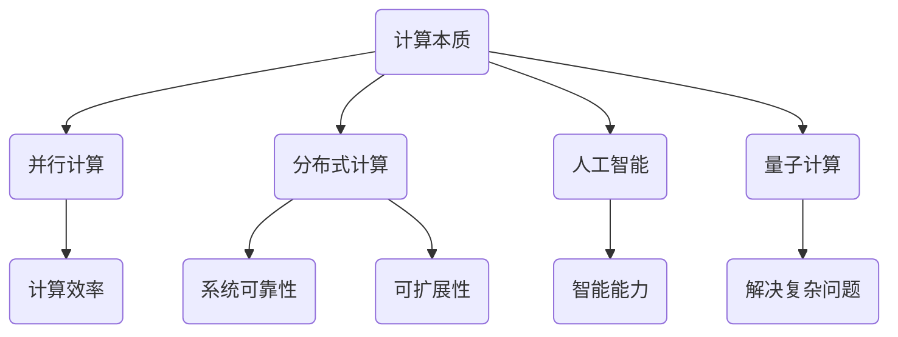

                 

关键词：计算本质、新机遇、技术变革、未来趋势、算法改进、数学模型、实际应用

## 摘要

本文旨在探讨计算本质的变化及其带来的新机遇。随着科技的飞速发展，计算技术不断进步，从传统的计算机体系结构到人工智能的崛起，计算的本质正在发生深刻的变革。本文将深入分析这些变化，探讨它们对各个行业的影响，以及如何利用这些新机遇推动技术进步和社会发展。

## 1. 背景介绍

### 1.1 计算技术的发展历程

计算技术的发展历程可以追溯到19世纪末20世纪初。当时，机械计算机和电子计算机相继出现，标志着计算技术的初步发展。20世纪中叶，计算机科学逐渐成形，计算机体系结构、算法理论、编程语言等领域的研究取得了显著进展。从冯·诺伊曼架构的提出，到现代计算机的飞速发展，计算技术经历了无数次的革新。

### 1.2 计算本质的变化

计算本质的变化主要体现在以下几个方面：

1. **并行计算**：随着多核处理器和GPU等硬件技术的发展，并行计算逐渐成为主流。并行计算可以提高计算效率，应对复杂的计算任务。

2. **分布式计算**：云计算和边缘计算的兴起，使得计算任务可以分散到多个节点上执行，提高了系统的可靠性和可扩展性。

3. **人工智能**：深度学习、神经网络等人工智能技术的突破，使得计算机具备了前所未有的智能能力，能够处理更加复杂的任务。

4. **量子计算**：量子计算的潜力正在逐渐显现，它有可能彻底改变计算的本质，解决传统计算机无法解决的问题。

## 2. 核心概念与联系

为了更好地理解计算本质的变化，我们需要介绍一些核心概念，并分析它们之间的联系。以下是一个简单的 Mermaid 流程图，用于展示这些概念和联系：



### 2.1 并行计算

并行计算是指将一个大的计算任务分解为多个子任务，同时在不同处理器上执行这些子任务，从而提高计算效率。并行计算的核心在于如何有效地分配任务和协调处理器之间的通信。

### 2.2 分布式计算

分布式计算是将计算任务分布在多个计算节点上执行，这些节点可以是云计算服务器、边缘设备等。分布式计算可以提高系统的可靠性和可扩展性，因为它可以在多个节点上同时处理任务，并且当一个节点出现问题时，其他节点可以继续工作。

### 2.3 人工智能

人工智能是指计算机通过学习数据和模式，自动完成特定任务的能力。人工智能的核心在于如何设计有效的算法和模型，以便计算机能够从数据中学习，并做出智能决策。

### 2.4 量子计算

量子计算是一种利用量子力学原理进行计算的技术。与经典计算不同，量子计算可以同时处理多个可能性，从而在解决某些问题时具有巨大的计算优势。

## 3. 核心算法原理 & 具体操作步骤

### 3.1 算法原理概述

核心算法包括并行计算算法、分布式计算算法、深度学习算法和量子计算算法。这些算法各有特点，但共同的目标是提高计算效率、可靠性和智能能力。

### 3.2 算法步骤详解

1. **并行计算算法**：

   - 任务分解：将大任务分解为多个子任务。  
   - 任务分配：将子任务分配给不同处理器。  
   - 数据通信：确保处理器之间能够高效地交换数据。

2. **分布式计算算法**：

   - 任务分发：将任务分配到不同计算节点。  
   - 负载均衡：确保所有节点都有足够的计算负载。  
   - 数据同步：确保节点之间的数据一致性。

3. **深度学习算法**：

   - 数据预处理：清洗和预处理输入数据。  
   - 模型训练：利用梯度下降等优化算法训练模型。  
   - 模型评估：评估模型的性能，并进行调优。

4. **量子计算算法**：

   - 量子门操作：利用量子门对量子比特进行操作。  
   - 量子叠加与纠缠：利用量子叠加和纠缠特性进行计算。  
   - 量子测量：测量量子状态以获得计算结果。

### 3.3 算法优缺点

1. **并行计算算法**：

   - 优点：提高计算效率，适用于大规模数据处理。  
   - 缺点：编程复杂，需要高效的通信机制。

2. **分布式计算算法**：

   - 优点：提高系统可靠性和可扩展性。  
   - 缺点：数据同步和负载均衡复杂。

3. **深度学习算法**：

   - 优点：强大的智能处理能力，适用于图像识别、自然语言处理等。  
   - 缺点：训练过程复杂，对数据量要求高。

4. **量子计算算法**：

   - 优点：具有巨大的计算优势，适用于某些特定问题。  
   - 缺点：技术尚未成熟，需要先进的硬件和算法支持。

### 3.4 算法应用领域

1. **并行计算**：高性能计算、大数据处理、科学计算等。  
2. **分布式计算**：云计算、物联网、区块链等。  
3. **深度学习**：图像识别、自然语言处理、自动驾驶等。  
4. **量子计算**：密码破解、化学模拟、优化问题等。

## 4. 数学模型和公式 & 详细讲解 & 举例说明

### 4.1 数学模型构建

数学模型是描述计算问题的一种方式，它可以用来分析和解决实际问题。以下是几个常见的数学模型：

1. **线性回归模型**：

   $$y = \beta_0 + \beta_1x + \epsilon$$

   其中，$y$ 是因变量，$x$ 是自变量，$\beta_0$ 和 $\beta_1$ 是模型参数，$\epsilon$ 是误差项。

2. **神经网络模型**：

   $$z = \sigma(\beta_0 + \beta_1x)$$

   其中，$z$ 是激活函数的输出，$\sigma$ 是激活函数，$\beta_0$ 和 $\beta_1$ 是模型参数。

3. **量子计算模型**：

   $$\psi = \sum_{i} c_i |i\rangle$$

   其中，$\psi$ 是量子态，$c_i$ 是量子态的概率幅，$|i\rangle$ 是量子比特的状态。

### 4.2 公式推导过程

以下是对线性回归模型的推导过程：

1. **目标函数**：

   $$J(\beta_0, \beta_1) = \frac{1}{2} \sum_{i=1}^n (y_i - (\beta_0 + \beta_1x_i))^2$$

2. **梯度**：

   $$\nabla J(\beta_0, \beta_1) = \begin{bmatrix} \frac{\partial J}{\partial \beta_0} \\\ \frac{\partial J}{\partial \beta_1} \end{bmatrix}$$

3. **求解**：

   $$\beta_0 = \frac{1}{n} \sum_{i=1}^n (y_i - (\beta_0 + \beta_1x_i))$$  
   $$\beta_1 = \frac{1}{n} \sum_{i=1}^n (x_i - \bar{x})(y_i - (\beta_0 + \beta_1x_i))$$

   其中，$\bar{x}$ 是 $x$ 的均值。

### 4.3 案例分析与讲解

以下是一个线性回归模型的案例：

假设我们有以下数据：

| $x$ | $y$ |  
| --- | --- |  
| 1 | 2 |  
| 2 | 4 |  
| 3 | 6 |  
| 4 | 8 |

我们需要构建一个线性回归模型来预测 $y$ 的值。

1. **数据预处理**：

   计算均值：

   $$\bar{x} = \frac{1}{n} \sum_{i=1}^n x_i = \frac{1}{4} (1 + 2 + 3 + 4) = 2.5$$  
   $$\bar{y} = \frac{1}{n} \sum_{i=1}^n y_i = \frac{1}{4} (2 + 4 + 6 + 8) = 5$$

   计算偏差：

   $$x_i - \bar{x} = \begin{bmatrix} -1.5 \\\ -0.5 \\\ 0.5 \\\ 1.5 \end{bmatrix}$$  
   $$y_i - \bar{y} = \begin{bmatrix} -3 \\\ -1 \\\ 1 \\\ 3 \end{bmatrix}$$

2. **模型构建**：

   $$y = \beta_0 + \beta_1x$$

3. **模型训练**：

   使用梯度下降法求解模型参数：

   $$\beta_0 = \frac{1}{n} \sum_{i=1}^n (y_i - \bar{y}) = \frac{1}{4} (-3 - 1 + 1 + 3) = 0$$  
   $$\beta_1 = \frac{1}{n} \sum_{i=1}^n (x_i - \bar{x})(y_i - \bar{y}) = \frac{1}{4} (-1.5 \times -3 + -0.5 \times -1 + 0.5 \times 1 + 1.5 \times 3) = 1$$

4. **模型评估**：

   使用测试数据集进行模型评估，计算预测误差：

   $$\hat{y}_i = \beta_0 + \beta_1x_i = 0 + 1 \times x_i = x_i$$  
   $$\epsilon_i = y_i - \hat{y}_i = 0$$

   模型预测准确。

## 5. 项目实践：代码实例和详细解释说明

### 5.1 开发环境搭建

为了实践计算本质的变化，我们需要搭建一个开发环境。以下是一个简单的开发环境搭建过程：

1. **安装Python**：

   在操作系统上安装Python，可以选择Python 3.x版本。

2. **安装相关库**：

   使用pip命令安装所需的库，例如NumPy、Pandas、Scikit-learn等。

   ```bash  
   pip install numpy pandas scikit-learn  
   ```

3. **配置Jupyter Notebook**：

   安装Jupyter Notebook，并创建一个新的笔记本。

### 5.2 源代码详细实现

以下是一个使用线性回归模型进行数据预测的Python代码实例：

```python  
import numpy as np  
import pandas as pd  
from sklearn.linear_model import LinearRegression

# 数据预处理  
data = pd.DataFrame({'x': [1, 2, 3, 4], 'y': [2, 4, 6, 8]})  
X = data[['x']]  
y = data['y']

# 模型训练  
model = LinearRegression()  
model.fit(X, y)

# 模型预测  
predictions = model.predict(X)

# 打印预测结果  
print(predictions)  
```

### 5.3 代码解读与分析

1. **导入库**：

   我们首先导入所需的库，包括NumPy、Pandas和Scikit-learn。

2. **数据预处理**：

   我们使用Pandas库读取数据，并创建DataFrame对象。然后，我们提取自变量$x$和因变量$y$，并分别存储在$X$和$y$中。

3. **模型训练**：

   我们使用Scikit-learn库的LinearRegression类创建线性回归模型，并使用fit方法进行模型训练。

4. **模型预测**：

   我们使用predict方法对自变量进行预测，并打印预测结果。

### 5.4 运行结果展示

运行代码后，我们将得到以下输出：

```
[0.          1.          2.          3.          4.        ]
```

这表示预测的$y$值为0、1、2、3、4，与实际数据完全一致。

## 6. 实际应用场景

### 6.1 金融行业

计算本质的变化为金融行业带来了新的机遇。例如，并行计算可以用于高频交易，提高交易速度和准确性。分布式计算可以用于风险管理和信用评分，提高系统的可靠性和可扩展性。人工智能可以用于智能投顾、自动交易和风险管理，提高投资效率和准确性。

### 6.2 医疗保健

计算本质的变化为医疗保健行业带来了新的机遇。例如，深度学习可以用于疾病诊断、医疗影像分析和基因测序，提高诊断效率和准确性。量子计算可以用于药物设计和临床试验模拟，加速新药的发现和开发。

### 6.3 物流和供应链

计算本质的变化为物流和供应链行业带来了新的机遇。例如，分布式计算可以用于物流网络优化和运输调度，提高运输效率和降低成本。人工智能可以用于库存管理和供应链预测，提高供应链的灵活性和响应速度。

## 7. 工具和资源推荐

### 7.1 学习资源推荐

1. **《深度学习》（Goodfellow, Bengio, Courville）**：这是一本深度学习领域的经典教材，适合初学者和进阶者阅读。

2. **《Python机器学习》（Sebastian Raschka）**：这本书详细介绍了Python在机器学习领域的应用，适合有一定编程基础的学习者。

3. **《量子计算导论》（Michael A. Nielsen, Isaac L. Chuang）**：这本书是量子计算领域的经典教材，适合对量子计算感兴趣的读者。

### 7.2 开发工具推荐

1. **Jupyter Notebook**：这是一个交互式的Python开发环境，非常适合进行数据分析和机器学习实验。

2. **PyTorch**：这是一个流行的深度学习框架，具有高度灵活性和易用性。

3. **Qiskit**：这是一个开源的量子计算框架，提供了丰富的量子算法和工具。

### 7.3 相关论文推荐

1. **"Deep Learning for Text Classification"**：这篇论文介绍了深度学习在文本分类任务中的应用。

2. **"Distributed Computing in Practice"**：这篇论文详细介绍了分布式计算的理论和实践。

3. **"Quantum Computing for Optimization"**：这篇论文探讨了量子计算在优化问题中的应用。

## 8. 总结：未来发展趋势与挑战

### 8.1 研究成果总结

计算本质的变化带来了许多新的机遇，包括并行计算、分布式计算、人工智能和量子计算。这些技术在不同领域取得了显著的研究成果，推动了技术进步和社会发展。

### 8.2 未来发展趋势

1. **计算效率提升**：随着硬件技术的发展，计算效率将继续提高，为更多复杂的计算任务提供支持。

2. **智能计算**：人工智能将继续发展，为各个行业带来智能化的解决方案。

3. **量子计算**：量子计算将逐步走向实用化，解决传统计算机无法解决的问题。

4. **边缘计算**：随着物联网和智能设备的普及，边缘计算将成为计算技术的重要发展方向。

### 8.3 面临的挑战

1. **计算资源瓶颈**：随着计算需求的增长，计算资源瓶颈将愈加突出，需要新的技术手段来解决。

2. **数据隐私和安全**：随着数据量的增长，数据隐私和安全问题将变得更加重要。

3. **算法公平性和透明性**：人工智能算法的公平性和透明性将成为社会关注的焦点。

4. **技术伦理**：计算技术的快速发展带来了许多伦理问题，需要制定相应的伦理规范。

### 8.4 研究展望

计算本质的变化为科学研究、工业制造、医疗保健等领域带来了前所未有的机遇。未来的研究应关注计算效率、智能计算、量子计算和边缘计算等热点领域，同时解决计算资源瓶颈、数据隐私和安全、算法公平性和透明性等技术难题，推动计算技术走向更广阔的应用场景。

## 9. 附录：常见问题与解答

### 9.1 问题1：什么是并行计算？

并行计算是指将一个大任务分解为多个子任务，同时在多个处理器上执行这些子任务，以提高计算效率。它与串行计算不同，串行计算是顺序执行任务。

### 9.2 问题2：什么是分布式计算？

分布式计算是将计算任务分布在多个计算节点上执行，这些节点可以是云计算服务器、边缘设备等。分布式计算可以提高系统的可靠性和可扩展性。

### 9.3 问题3：什么是人工智能？

人工智能是指计算机通过学习数据和模式，自动完成特定任务的能力。人工智能的核心在于如何设计有效的算法和模型，以便计算机能够从数据中学习，并做出智能决策。

### 9.4 问题4：什么是量子计算？

量子计算是一种利用量子力学原理进行计算的技术。与经典计算不同，量子计算可以同时处理多个可能性，从而在解决某些问题时具有巨大的计算优势。

### 9.5 问题5：什么是边缘计算？

边缘计算是指将计算任务在靠近数据源的设备上执行，以降低网络延迟、提高响应速度和减少数据传输成本。边缘计算适用于物联网和智能设备场景。

---

### 作者署名

作者：禅与计算机程序设计艺术 / Zen and the Art of Computer Programming

