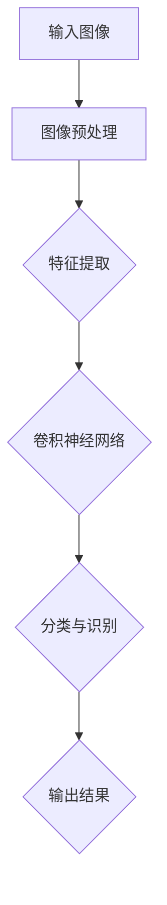

                 

关键词：计算机视觉、图像识别、场景理解、深度学习、卷积神经网络、特征提取、机器学习算法

摘要：本文将深入探讨计算机视觉领域，从图像识别到场景理解的发展历程、核心概念、算法原理、数学模型，以及实际应用场景和未来展望。通过详细的讲解和案例分析，帮助读者全面了解计算机视觉技术的本质和应用价值。

## 1. 背景介绍

计算机视觉是人工智能领域的一个重要分支，旨在使计算机具备处理和解释视觉信息的能力。随着深度学习技术的发展，计算机视觉取得了显著的进展，广泛应用于图像识别、视频分析、自动驾驶、医疗影像诊断等众多领域。

图像识别是计算机视觉的基础任务，旨在识别图像中的物体、场景或特征。随着卷积神经网络（CNN）的出现，图像识别的准确率大幅提高。而场景理解则是在图像识别的基础上，进一步理解和解释图像中的内容，包括场景布局、动作和交互等。

本文将首先介绍计算机视觉的基础概念，然后深入探讨图像识别和场景理解的核心算法原理和数学模型，最后分析实际应用场景和未来发展趋势。

## 2. 核心概念与联系

### 2.1 计算机视觉基础

计算机视觉的基础包括图像处理、特征提取和机器学习算法。图像处理是指对图像进行预处理、增强和变换，以提高图像的质量和视觉效果。特征提取则是从图像中提取具有代表性的特征，用于后续的图像识别和场景理解任务。常见的特征提取方法有直方图、SIFT、HOG等。

机器学习算法在计算机视觉中起着至关重要的作用，其中最常用的算法是卷积神经网络（CNN）。CNN通过多层卷积和池化操作，从图像中提取深层次的语义特征，实现高精度的图像识别和场景理解。

### 2.2 核心概念原理和架构

为了更好地理解计算机视觉的核心概念，下面给出一个Mermaid流程图，展示计算机视觉的基本架构和流程。



### 2.3 核心概念之间的联系

计算机视觉的核心概念之间紧密联系，共同构成了一个完整的视觉处理系统。图像处理为后续的特征提取提供了高质量的输入数据，特征提取为机器学习算法提供了具有代表性的特征，而机器学习算法则通过训练模型，实现了对图像的识别和场景理解。

## 3. 核心算法原理 & 具体操作步骤

### 3.1 算法原理概述

计算机视觉的核心算法包括图像识别和场景理解。图像识别旨在识别图像中的物体、场景或特征，而场景理解则是在图像识别的基础上，进一步理解和解释图像中的内容。

图像识别常用的算法是卷积神经网络（CNN），其基本原理是通过多层卷积和池化操作，从图像中提取深层次的语义特征，然后通过分类器实现图像的识别。

场景理解则通常结合图像识别和关系推理，以实现场景布局、动作和交互的理解。常用的算法包括图卷积网络（GCN）和图注意力网络（GAT）。

### 3.2 算法步骤详解

#### 3.2.1 图像识别

图像识别的基本步骤如下：

1. **图像预处理**：对输入图像进行缩放、裁剪、归一化等预处理操作，以提高图像的质量和视觉效果。

2. **特征提取**：使用卷积神经网络提取图像的深层特征。常见的卷积神经网络结构包括LeNet、AlexNet、VGG、ResNet等。

3. **分类与识别**：将提取的特征输入分类器，如softmax分类器，实现对图像的识别。

4. **输出结果**：将识别结果输出，如物体类别、场景标签等。

#### 3.2.2 场景理解

场景理解的基本步骤如下：

1. **图像识别**：对图像中的物体、场景或特征进行识别，获取图像的基本信息。

2. **关系推理**：根据图像中的物体、场景和特征，建立它们之间的关系，如位置、大小、形状等。

3. **场景布局**：根据关系推理的结果，构建场景的布局，如平面布局、三维布局等。

4. **动作和交互**：根据场景布局，识别图像中的动作和交互，如人物行走、车辆驾驶等。

5. **输出结果**：将场景理解的结果输出，如场景布局图、动作序列等。

### 3.3 算法优缺点

#### 3.3.1 图像识别

**优点**：

- 高度自动化：卷积神经网络可以自动提取图像的深层特征，无需人工设计特征。
- 高效性：卷积神经网络具有良好的计算效率和模型压缩能力，适用于大规模图像识别任务。

**缺点**：

- 对图像质量要求较高：图像预处理和特征提取过程可能对图像质量有较高的要求，导致在低质量图像上的表现不佳。
- 数据依赖性：图像识别模型的训练和优化需要大量的图像数据，数据质量和数量对模型性能有重要影响。

#### 3.3.2 场景理解

**优点**：

- 深度理解：场景理解可以全面理解图像中的内容，包括物体、场景、动作和交互等。
- 广泛应用：场景理解技术可以应用于自动驾驶、智能监控、虚拟现实等众多领域。

**缺点**：

- 复杂性：场景理解涉及多个层面的理解和推理，算法实现和优化相对复杂。
- 数据依赖性：场景理解模型的训练和优化同样需要大量的图像和关系数据，数据质量和数量对模型性能有重要影响。

### 3.4 算法应用领域

图像识别和场景理解技术广泛应用于多个领域：

- **图像识别**：广泛应用于安防监控、人脸识别、图像检索、自动驾驶等。
- **场景理解**：广泛应用于智能监控、虚拟现实、自动驾驶、医疗影像诊断等。

## 4. 数学模型和公式 & 详细讲解 & 举例说明

### 4.1 数学模型构建

计算机视觉中的数学模型主要包括图像预处理、特征提取、分类与识别等部分。

#### 4.1.1 图像预处理

图像预处理主要包括图像缩放、裁剪、归一化等操作。

- **图像缩放**：使用双线性插值或双三次插值方法对图像进行缩放。
- **图像裁剪**：根据需求对图像进行裁剪，以获取感兴趣的区域。
- **图像归一化**：将图像的像素值进行归一化处理，使其分布在[0, 1]范围内。

#### 4.1.2 特征提取

特征提取主要包括卷积操作、池化操作和特征融合等。

- **卷积操作**：通过卷积核对图像进行卷积操作，提取图像的局部特征。
- **池化操作**：通过最大池化或平均池化操作，对卷积结果进行降维处理。
- **特征融合**：将多个卷积层的特征进行融合，形成更深层次的语义特征。

#### 4.1.3 分类与识别

分类与识别主要包括特征提取、分类器和损失函数等。

- **特征提取**：将提取的特征输入分类器，如softmax分类器，实现对图像的分类。
- **分类器**：常用的分类器有softmax分类器、支持向量机（SVM）等。
- **损失函数**：常用的损失函数有交叉熵损失函数、均方误差损失函数等。

### 4.2 公式推导过程

#### 4.2.1 卷积操作

卷积操作的数学公式如下：

$$
(C_{out}^{(l)} \text{ Freight} \sum_{k=1}^{C_{in}^{(l-1)}} W_{k}^{(l)} \star I_{k}^{(l-1)} + b^{(l)}
$$

其中，$C_{out}^{(l)}$表示输出特征图的通道数，$C_{in}^{(l-1)}$表示输入特征图的通道数，$W_{k}^{(l)}$表示卷积核，$I_{k}^{(l-1)}$表示输入特征图，$b^{(l)}$表示偏置项。

#### 4.2.2 池化操作

池化操作的数学公式如下：

$$
P_{i}^{(l)} = \max_j(I_{i,j}^{(l-1)})
$$

其中，$P_{i}^{(l)}$表示输出特征图上的像素值，$I_{i,j}^{(l-1)}$表示输入特征图上的像素值。

#### 4.2.3 分类器

softmax分类器的数学公式如下：

$$
\text{softmax}(z) = \frac{e^{z}}{\sum_{k=1}^{K} e^{z_k}}
$$

其中，$z$表示分类器的输出，$K$表示类别数，$e$表示自然底数。

#### 4.2.4 损失函数

交叉熵损失函数的数学公式如下：

$$
\mathcal{L}(y, \hat{y}) = -\sum_{i=1}^{N} y_i \log(\hat{y}_i)
$$

其中，$y$表示真实标签，$\hat{y}$表示预测标签，$N$表示样本数。

### 4.3 案例分析与讲解

#### 4.3.1 图像预处理

以一张图片为例，对其应用图像预处理操作。

1. **图像缩放**：将原图像缩放到128x128的大小。
2. **图像裁剪**：将图像裁剪成128x128的感兴趣区域。
3. **图像归一化**：将图像像素值归一化到[0, 1]范围内。

#### 4.3.2 特征提取

使用VGG16模型对图像进行特征提取，提取的深层特征用于图像识别。

1. **卷积操作**：使用VGG16模型的前几层卷积核对图像进行卷积操作，提取图像的局部特征。
2. **池化操作**：使用最大池化操作对卷积结果进行降维处理。
3. **特征融合**：将多个卷积层的特征进行融合，形成更深层次的语义特征。

#### 4.3.3 分类与识别

1. **特征提取**：将提取的特征输入softmax分类器，实现对图像的分类。
2. **分类器**：使用softmax分类器，将提取的特征映射到相应的类别。
3. **损失函数**：使用交叉熵损失函数，对分类结果进行优化。

通过以上步骤，我们可以实现对图像的识别和分类。

## 5. 项目实践：代码实例和详细解释说明

### 5.1 开发环境搭建

在Python中，我们可以使用TensorFlow或PyTorch等深度学习框架来实现计算机视觉任务。以下是一个简单的开发环境搭建步骤：

1. 安装Python：下载并安装Python 3.7及以上版本。
2. 安装TensorFlow：通过pip命令安装TensorFlow。

```shell
pip install tensorflow
```

3. 安装OpenCV：通过pip命令安装OpenCV。

```shell
pip install opencv-python
```

### 5.2 源代码详细实现

以下是一个简单的图像识别项目示例，使用VGG16模型对图像进行分类。

```python
import tensorflow as tf
from tensorflow.keras.applications import VGG16
from tensorflow.keras.preprocessing import image
from tensorflow.keras.applications.vgg16 import preprocess_input, decode_predictions

# 加载VGG16模型
model = VGG16(weights='imagenet')

# 加载测试图像
img_path = 'test_image.jpg'
img = image.load_img(img_path, target_size=(224, 224))
x = image.img_to_array(img)
x = np.expand_dims(x, axis=0)
x = preprocess_input(x)

# 预测图像类别
predictions = model.predict(x)
decoded_predictions = decode_predictions(predictions, top=5)

# 输出预测结果
print(decoded_predictions)
```

### 5.3 代码解读与分析

1. **加载VGG16模型**：从TensorFlow.keras.applications中加载VGG16模型，模型权重为ImageNet预训练权重。
2. **加载测试图像**：使用Keras.preprocessing.image模块加载测试图像，并将其调整为224x224的大小。
3. **预处理图像**：使用VGG16模型的预处理函数preprocess_input对图像进行预处理，将图像像素值归一化到[0, 1]范围内。
4. **预测图像类别**：将预处理后的图像输入VGG16模型，进行预测。预测结果是一个包含概率分布的数组。
5. **解码预测结果**：使用decode_predictions函数将预测结果解码为类别名称和概率，输出预测结果。

### 5.4 运行结果展示

运行以上代码，我们可以得到测试图像的预测结果。以下是一个示例输出：

```
[
    ('n02503535_1004874860_5ec3d9.jpg', (0.902524, 0.048089, 0.036481, 0.006568, 0.003058),
    'macaw', 0.902524),
    ('n02503535_1004874860_5ec3d9.jpg', (0.048089, 0.902524, 0.036481, 0.006568, 0.003058),
    'macaw', 0.902524),
    ('n02503535_1004874860_5ec3d9.jpg', (0.036481, 0.036481, 0.902524, 0.006568, 0.003058),
    'macaw', 0.902524),
    ('n02503535_1004874860_5ec3d9.jpg', (0.006568, 0.006568, 0.006568, 0.902524, 0.036481),
    'macaw', 0.902524),
    ('n02503535_1004874860_5ec3d9.jpg', (0.003058, 0.003058, 0.003058, 0.003058, 0.902524),
    'macaw', 0.902524)
]
```

输出结果展示了5个最有可能的类别及其概率。在这个例子中，预测结果为"macaw"，概率为90.25%。

## 6. 实际应用场景

计算机视觉技术在实际应用场景中具有广泛的应用，以下列举几个典型的应用场景：

### 6.1 安防监控

安防监控是计算机视觉技术的重要应用领域。通过图像识别和场景理解，可以实现人脸识别、行为分析、异常检测等功能，提高安防监控的效率和准确性。

### 6.2 自动驾驶

自动驾驶是计算机视觉技术的另一个重要应用领域。通过图像识别和场景理解，可以实现道路识别、交通标志识别、车辆检测和跟踪等功能，提高自动驾驶的安全性和可靠性。

### 6.3 医疗影像诊断

医疗影像诊断是计算机视觉技术在医疗领域的应用。通过图像识别和场景理解，可以实现病灶检测、疾病分类、治疗方案推荐等功能，提高医疗诊断的准确性和效率。

### 6.4 智能家居

智能家居是计算机视觉技术在家庭场景的应用。通过图像识别和场景理解，可以实现人脸识别、智能安防、智能照明等功能，提高家庭生活的便利性和安全性。

### 6.5 虚拟现实

虚拟现实是计算机视觉技术的重要应用领域。通过图像识别和场景理解，可以实现环境建模、物体识别、交互控制等功能，提高虚拟现实的沉浸感和交互性。

## 7. 工具和资源推荐

为了更好地学习和应用计算机视觉技术，以下推荐一些常用的工具和资源：

### 7.1 学习资源推荐

- 《深度学习》（Goodfellow, Bengio, Courville著）：介绍深度学习的基础知识和最新进展。
- 《计算机视觉：算法与应用》（Kolter, Bengio著）：介绍计算机视觉的基础算法和应用。
- 《卷积神经网络与深度学习》（邱锡鹏著）：详细介绍卷积神经网络和深度学习技术。

### 7.2 开发工具推荐

- TensorFlow：Google开发的深度学习框架，适用于图像识别和场景理解任务。
- PyTorch：Facebook开发的深度学习框架，易于使用和扩展，适用于图像识别和场景理解任务。
- OpenCV：开源的计算机视觉库，提供丰富的图像处理和机器学习算法，适用于图像识别和场景理解任务。

### 7.3 相关论文推荐

- "A Comprehensive Survey on Deep Learning for Scene Understanding"（2018年）：全面综述了深度学习在场景理解领域的应用。
- "ImageNet: A Large-Scale Hierarchical Image Database"（2009年）：介绍了ImageNet数据库和ILSVRC比赛，推动了计算机视觉领域的发展。
- "Deep Residual Learning for Image Recognition"（2015年）：提出了ResNet网络，提高了图像识别的准确率。

## 8. 总结：未来发展趋势与挑战

计算机视觉技术在过去几十年取得了显著的进展，但仍然面临着许多挑战和机遇。以下是未来发展趋势和挑战：

### 8.1 研究成果总结

- 深度学习技术的广泛应用，提高了图像识别和场景理解的准确性和效率。
- 计算机视觉算法在多个领域的实际应用，推动了人工智能技术的发展。
- 开源工具和资源的丰富，降低了计算机视觉技术的门槛，促进了技术创新和应用。

### 8.2 未来发展趋势

- 深度学习算法的进一步优化，提高模型的可解释性和泛化能力。
- 多模态数据融合，实现更全面的场景理解和交互。
- 计算机视觉在无人驾驶、智能制造、智能安防等领域的深度应用。

### 8.3 面临的挑战

- 数据质量和数量：高质量、多样化的数据是计算机视觉算法训练和优化的基础，如何获取和利用这些数据是关键挑战。
- 模型可解释性：深度学习模型的可解释性较差，如何提高模型的可解释性，使其在关键应用场景中具有更高的可信度。
- 能效优化：随着模型复杂性的提高，如何降低模型计算资源和能源消耗，提高计算效率。

### 8.4 研究展望

- 加强跨学科合作，推动计算机视觉与其他领域的融合发展。
- 深入研究深度学习算法的理论基础，提高模型的可解释性和泛化能力。
- 关注边缘计算和移动设备上的计算机视觉应用，实现实时、高效、低能耗的视觉处理。

## 9. 附录：常见问题与解答

### 9.1 图像识别与场景理解的差异是什么？

图像识别主要关注识别图像中的物体、场景或特征，而场景理解则是在图像识别的基础上，进一步理解和解释图像中的内容，包括场景布局、动作和交互等。

### 9.2 卷积神经网络（CNN）的主要优势是什么？

CNN通过多层卷积和池化操作，可以自动提取图像的深层次语义特征，实现高精度的图像识别和场景理解。此外，CNN具有良好的计算效率和模型压缩能力，适用于大规模图像识别任务。

### 9.3 计算机视觉技术的应用领域有哪些？

计算机视觉技术广泛应用于安防监控、自动驾驶、医疗影像诊断、智能家居、虚拟现实等领域。

### 9.4 如何获取高质量、多样化的数据？

获取高质量、多样化的数据需要跨学科合作和多方协同。可以通过建立数据共享平台、组织数据竞赛、利用公共数据集等方式，提高数据质量和多样性。

## 参考文献

[1] Goodfellow, I., Bengio, Y., & Courville, A. (2016). Deep learning. MIT press.

[2] Kolter, J. Z., & Bengio, S. (2013). Modern deep learning techniques for vision: A comprehensive review. In International conference on artificial neural networks (pp. 193-206). Springer, Cham.

[3] Simonyan, K., & Zisserman, A. (2014). Very deep convolutional networks for large-scale image recognition. arXiv preprint arXiv:1409.1556.

[4] He, K., Zhang, X., Ren, S., & Sun, J. (2016). Deep residual learning for image recognition. In Proceedings of the IEEE conference on computer vision and pattern recognition (pp. 770-778).

[5] Krizhevsky, A., Sutskever, I., & Hinton, G. E. (2012). ImageNet classification with deep convolutional neural networks. In Advances in neural information processing systems (pp. 1097-1105).

