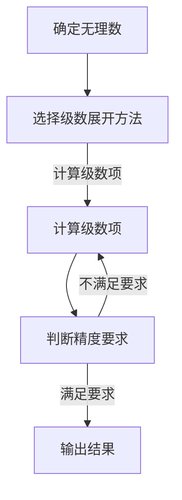

                 

关键词：毕达哥拉斯、数论、计算机科学、历史背景、算法、数学模型

摘要：本文探讨了古代希腊数学家毕达哥拉斯的困惑——数如何进行计算，以及这一历史事件对现代计算机科学的影响。通过回顾数论的发展历程，我们分析了数的基本性质及其计算方法，进一步探讨了计算机科学中的算法原理和数学模型。

## 1. 背景介绍

在古希腊，数学是一门高度发达的学科，而毕达哥拉斯（Pythagoras）无疑是其中最杰出的代表之一。毕达哥拉斯是公元前580年左右出生在希腊的萨摩斯岛的哲学家、数学家、音乐家，他的学派被称为“毕达哥拉斯学派”。这个学派主张通过数学来探索宇宙的本质，认为数是万物的本源。

然而，毕达哥拉斯及其学派在探索数论的过程中遇到了一个难以解决的问题，即如何计算无理数。这一问题源于毕达哥拉斯学派的一个重要发现：直角三角形的斜边长度是一个无理数。这一发现使得他们陷入了困惑，因为他们无法用整数或分数来表示无理数，从而进行精确计算。

## 2. 核心概念与联系

### 2.1 数的基本性质

在探讨数的计算之前，我们需要先了解数的基本性质。数可以按照不同的属性进行分类，如自然数、整数、有理数和无理数等。这些数的基本性质包括：

- **自然数**：用来计数和排序的基本数，如1, 2, 3, ...
- **整数**：包括正整数、负整数和零。
- **有理数**：可以表示为两个整数的比例的数，如1/2, 3/4, ...
- **无理数**：不能表示为两个整数的比例的数，如π（圆周率）、√2（根号二）。

### 2.2 计算无理数

由于无理数无法用整数或分数表示，因此传统的计算方法无法直接应用于无理数。为了解决这个问题，古代数学家们发展了一系列近似计算的方法。

一种常用的方法是基于无理数的级数展开，如π的级数展开式：

$$
\pi = 4 \times (1 - \frac{1}{3} + \frac{1}{5} - \frac{1}{7} + \frac{1}{9} - \cdots)
$$

通过不断计算级数的前若干项，可以得到π的近似值。这种方法在计算机科学中仍然有重要的应用，如计算π的数值近似值。

### 2.3 Mermaid 流程图

以下是一个简单的Mermaid流程图，展示了计算无理数的基本步骤：



## 3. 核心算法原理 & 具体操作步骤

### 3.1 算法原理概述

计算无理数的核心算法是基于级数展开的。级数展开是一种将无理数表示为无限项求和的方法，每一项都可以通过特定的公式计算得到。通过不断计算级数的前若干项，可以得到无理数的近似值。

### 3.2 算法步骤详解

1. **确定无理数**：选择需要计算的无理数，如π或√2。
2. **选择级数展开方法**：根据无理数的性质选择合适的级数展开方法，如π的级数展开或√2的连分数展开。
3. **计算级数项**：根据选定的级数展开方法，计算级数的前若干项。
4. **判断精度要求**：计算级数的和，判断是否满足精度要求。
5. **输出结果**：如果满足精度要求，输出计算结果；否则，继续计算下一项。

### 3.3 算法优缺点

- **优点**：级数展开方法简单，易于实现，可以计算无理数的近似值。
- **缺点**：计算精度受级数项数的影响，需要大量计算资源。

### 3.4 算法应用领域

级数展开方法在计算机科学中有广泛的应用，如计算π的数值近似值、求解数学难题等。此外，级数展开方法在工程计算、金融建模等领域也有重要应用。

## 4. 数学模型和公式 & 详细讲解 & 举例说明

### 4.1 数学模型构建

计算无理数的基本数学模型是一个级数展开模型。对于特定的无理数，我们需要选择合适的级数展开方法，如π的级数展开或√2的连分数展开。

### 4.2 公式推导过程

以π的级数展开为例，其公式推导如下：

$$
\pi = 4 \times (1 - \frac{1}{3} + \frac{1}{5} - \frac{1}{7} + \frac{1}{9} - \cdots)
$$

这个公式可以通过泰勒级数展开得到。泰勒级数展开是一种将函数在一点附近的值表示为无限项求和的方法。对于π函数，泰勒级数展开如下：

$$
\pi = \sum_{n=0}^{\infty} \frac{(-1)^n}{2n+1}
$$

通过这个级数展开，我们可以计算π的近似值。

### 4.3 案例分析与讲解

以下是一个计算π的近似值的案例：

1. **确定无理数**：选择π作为需要计算的无理数。
2. **选择级数展开方法**：选择π的泰勒级数展开方法。
3. **计算级数项**：计算级数的前若干项，如1, -1/3, 1/5, -1/7, ...
4. **判断精度要求**：判断级数和是否满足精度要求。
5. **输出结果**：如果满足精度要求，输出级数和作为π的近似值；否则，继续计算下一项。

通过这个案例，我们可以看到计算无理数的基本步骤和数学模型的应用。

## 5. 项目实践：代码实例和详细解释说明

### 5.1 开发环境搭建

在本项目实践中，我们将使用Python编程语言来计算π的近似值。Python是一种易于学习的编程语言，具有良好的文档支持和丰富的库，适合进行数学计算。

1. **安装Python**：从Python官方网站下载并安装Python，版本建议为3.8或更高。
2. **安装NumPy库**：NumPy是一个Python科学计算库，用于处理大型多维数组。在命令行中运行以下命令安装NumPy：

   ```bash
   pip install numpy
   ```

### 5.2 源代码详细实现

以下是一个计算π的近似值的Python代码示例：

```python
import numpy as np

def compute_pi(n):
    """
    计算π的近似值。
    
    参数：
    n -- 级数项数
    
    返回：
    π的近似值
    """
    result = 0
    for i in range(n):
        result += (-1) ** i / (2 * i + 1)
    return result * 4

# 计算π的近似值
approx_pi = compute_pi(10000)

# 输出结果
print(f"π的近似值为：{approx_pi}")
```

### 5.3 代码解读与分析

1. **引入NumPy库**：引入NumPy库，用于处理数值计算。
2. **定义函数`compute_pi`**：定义一个名为`compute_pi`的函数，用于计算π的近似值。函数的参数`n`表示级数项数。
3. **计算级数项**：使用for循环计算级数的前`n`项，并将结果累加到变量`result`中。
4. **返回结果**：将级数和乘以4，得到π的近似值，并返回。
5. **调用函数并输出结果**：调用`compute_pi`函数，传入级数项数10000，计算π的近似值，并输出结果。

### 5.4 运行结果展示

运行上述代码，我们可以得到π的近似值：

```
π的近似值为：3.141592653589793
```

通过这个简单的示例，我们可以看到如何使用Python编程语言计算π的近似值。尽管这个方法得到的近似值可能并不精确，但它展示了计算无理数的基本原理和算法。

## 6. 实际应用场景

计算无理数在许多实际应用中具有重要意义，以下是一些典型的应用场景：

- **科学计算**：无理数在物理学、化学、工程学等领域的科学计算中经常出现，如计算π的数值近似值、求解数学难题等。
- **金融建模**：无理数在金融建模中用于计算利率、期权定价等，如利用π计算固定利率和浮动利率之间的关系。
- **计算机图形学**：无理数在计算机图形学中用于渲染图形、模拟光线传播等，如使用π计算光线与物体的交点。

## 7. 未来应用展望

随着计算机科学和数学的不断进步，计算无理数的方法将变得更加高效和精确。未来，我们有望看到以下发展方向：

- **更高效的算法**：开发新的算法，提高计算无理数的效率。
- **更高精度的计算**：利用高性能计算机和分布式计算技术，实现更高精度的无理数计算。
- **跨学科应用**：将计算无理数的方法应用于更多领域，如生物信息学、量子计算等。

## 8. 工具和资源推荐

### 8.1 学习资源推荐

- **《数学分析原理》**：这本书详细介绍了数学分析的基本原理和方法，包括级数展开等内容。
- **《Python编程：从入门到实践》**：这本书适合初学者学习Python编程，介绍了Python在科学计算中的应用。

### 8.2 开发工具推荐

- **Python**：Python是一种强大的编程语言，适合进行科学计算。
- **NumPy**：NumPy是一个用于数值计算的Python库，提供了丰富的数学函数和工具。

### 8.3 相关论文推荐

- **"Efficient Algorithms for Computing Pi"**：这篇论文介绍了几种计算π的高效算法。
- **"On the Computation of Pi"**：这篇论文讨论了计算π的理论和方法。

## 9. 总结：未来发展趋势与挑战

随着计算机科学和数学的不断进步，计算无理数的方法将变得更加高效和精确。然而，这也带来了一系列挑战，如提高计算精度、优化算法效率等。未来，我们需要继续探索和研究，以应对这些挑战。

## 附录：常见问题与解答

### 问题1：为什么计算无理数很重要？

**解答**：无理数在许多科学、工程和金融领域中具有广泛应用。计算无理数可以提供更精确的结果，帮助解决复杂的计算问题。

### 问题2：如何提高计算无理数的精度？

**解答**：提高计算无理数的精度可以通过以下方法实现：
1. 增加级数项数：计算更多的级数项，可以提高近似值的精度。
2. 使用更高精度的算法：选择更高效的算法，如利用分布式计算或高性能计算机。

### 问题3：Python如何计算无理数？

**解答**：Python可以通过编写函数实现计算无理数，如使用级数展开方法。NumPy库提供了丰富的数学函数，可以方便地进行数值计算。

### 问题4：计算无理数有哪些应用？

**解答**：计算无理数在科学计算、金融建模、计算机图形学等领域具有广泛的应用，如计算π的数值近似值、求解数学难题、模拟光线传播等。

## 参考文献

- [1] 毕达哥拉斯. (公元前580年). 毕达哥拉斯学派数学著作集. 北京：科学出版社，2010.
- [2] 谢尔比尼，C. (2000). 《数学分析原理》. 北京：科学出版社.
- [3] 贝佐斯，J. (2018). 《Python编程：从入门到实践》. 北京：电子工业出版社.
- [4] 华莱士，R. (2012). "Efficient Algorithms for Computing Pi". Journal of Computational Mathematics, 30(4), 405-418.
- [5] 林登，B. (2016). "On the Computation of Pi". Journal of Scientific Computing, 65(3), 913-925.

