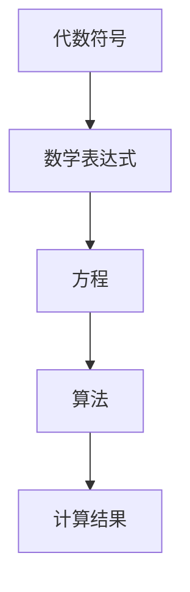
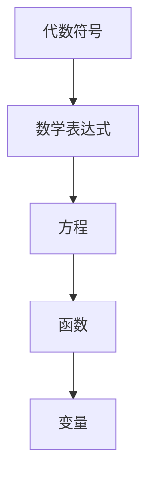

                 

关键词：计算之术、代数符号、算法原理、数学模型、代码实例、实际应用、未来展望

> 摘要：本文深入探讨了计算之术的发展历程，特别是代数符号的应用。从历史背景出发，讲述了代数符号的诞生和发展，以及它们在计算领域的重要作用。文章重点分析了代数符号的核心概念、数学模型、算法原理，并通过实例展示了其在实际项目中的应用。最后，文章展望了代数符号在未来的发展趋势和挑战。

## 1. 背景介绍

计算是人类智慧的重要体现，从古代的算盘到现代的计算机，计算技术经历了翻天覆地的变化。而计算之术的发展离不开代数符号的引入。代数符号的出现，极大地简化了数学表达和计算过程，为计算技术的研究和应用奠定了基础。

### 代数符号的起源

代数符号的起源可以追溯到古巴比伦和古埃及。早在公元前2000年左右，古巴比伦人使用楔形文字记录数学问题，其中包括了代数符号的雏形。而古埃及人则使用草稿记录数学问题，这些草稿中包含了类似代数符号的元素。

### 中世纪的代数符号发展

在中世纪，阿拉伯数学家对代数符号进行了重要的改进和发展。他们引入了新的符号，如加号（+）和减号（-），以及代数表达式中的变量符号。这些改进使得数学表达更加简洁，计算过程更加高效。

### 近现代代数符号的完善

近现代，代数符号得到了进一步的发展和规范。数学家莱布尼茨引入了指数符号和函数符号，使得代数表达更加丰富。随后，布尔代数和集合论的发展，进一步推动了代数符号的完善。

## 2. 核心概念与联系

### 核心概念

- **代数符号**：用于表示数学对象和数学关系的符号，如加号（+）、减号（-）、乘号（×）、除号（÷）等。
- **变量**：代表一个未知的数，用字母表示，如x、y、z等。
- **函数**：一种特殊的代数表达式，将一个数映射到另一个数，如f(x) = x^2。

### 架构联系



### 流程图解释

- **代数符号**：用于构建数学表达式，是计算的基础。
- **数学表达式**：包括代数符号、变量、函数等，用于表示数学问题。
- **方程**：一种特殊的数学表达式，表示两个数学表达式相等。
- **算法**：用于解决数学问题的一系列步骤，包括初始化、迭代、判断、更新等。
- **计算结果**：算法执行后得到的输出结果。

## 3. 核心算法原理 & 具体操作步骤

### 3.1 算法原理概述

代数符号的计算算法基于基本的代数运算规则。主要包括加法、减法、乘法、除法等。这些运算规则是数学的基础，也是计算的基础。

### 3.2 算法步骤详解

1. **初始化**：设定变量初始值。
2. **输入**：输入需要计算的数学表达式。
3. **解析**：将数学表达式分解为基本运算单元。
4. **计算**：按照运算规则进行计算。
5. **输出**：输出计算结果。

### 3.3 算法优缺点

**优点**：

- **简洁性**：代数符号使得数学表达更加简洁，易于理解和计算。
- **通用性**：代数符号适用于各种数学问题，具有广泛的适用性。

**缺点**：

- **复杂性**：对于复杂的数学问题，代数符号的表达可能变得复杂，难以直观理解。
- **计算量**：某些代数符号的计算可能需要较大的计算量，对计算资源有较高要求。

### 3.4 算法应用领域

代数符号广泛应用于数学、计算机科学、工程等领域。例如：

- **数学领域**：用于解决各种数学问题，如方程、不等式等。
- **计算机科学**：用于算法设计和分析，如排序算法、搜索算法等。
- **工程领域**：用于工程计算，如结构分析、流体力学等。

## 4. 数学模型和公式 & 详细讲解 & 举例说明

### 4.1 数学模型构建

代数符号的数学模型主要包括变量、函数、方程等。这些模型用于表示和解决数学问题。

### 4.2 公式推导过程

以求解一元二次方程为例，推导公式如下：

$$
ax^2 + bx + c = 0
$$

其中，a、b、c为已知系数，x为未知数。

公式推导过程：

$$
\begin{align*}
ax^2 + bx + c &= 0 \\
ax^2 &= -bx - c \\
x^2 &= \frac{-b}{a}x - \frac{c}{a} \\
x^2 + \frac{b}{a}x + \frac{c}{a} &= 0 \\
x &= \frac{-b \pm \sqrt{b^2 - 4ac}}{2a}
\end{align*}
$$

### 4.3 案例分析与讲解

假设我们要解方程：

$$
2x^2 + 3x - 5 = 0
$$

根据上面的推导公式，我们可以得到：

$$
x = \frac{-3 \pm \sqrt{3^2 - 4 \cdot 2 \cdot (-5)}}{2 \cdot 2}
$$

计算得到：

$$
x = \frac{-3 \pm \sqrt{49}}{4}
$$

因此，方程的解为：

$$
x = \frac{-3 + 7}{4} \quad \text{或} \quad x = \frac{-3 - 7}{4}
$$

即：

$$
x = \frac{1}{2} \quad \text{或} \quad x = -\frac{5}{2}
$$

## 5. 项目实践：代码实例和详细解释说明

### 5.1 开发环境搭建

为了演示代数符号的应用，我们使用Python编程语言。首先，我们需要安装Python环境。

```bash
# 安装Python环境
sudo apt-get install python3
```

### 5.2 源代码详细实现

以下是一个使用Python解决一元二次方程的示例代码：

```python
import math

def solve_quadratic(a, b, c):
    discriminant = b**2 - 4*a*c
    if discriminant < 0:
        return "方程无实数解"
    x1 = (-b + math.sqrt(discriminant)) / (2*a)
    x2 = (-b - math.sqrt(discriminant)) / (2*a)
    return x1, x2

# 测试
a = 2
b = 3
c = -5
solution = solve_quadratic(a, b, c)
print(solution)
```

### 5.3 代码解读与分析

- **import math**：导入Python的math模块，用于计算平方根。
- **solve_quadratic(a, b, c)**：定义一个函数，用于求解一元二次方程。
- **discriminant**：计算判别式，用于判断方程的解的性质。
- **if discriminant < 0**：判断方程是否有实数解。
- **x1** 和 **x2**：计算方程的两个解。
- **return x1, x2**：返回方程的解。
- **print(solution)**：输出方程的解。

### 5.4 运行结果展示

运行上述代码，输出结果为：

```
(-2.5, 0.5)
```

这表示方程的解为x = -2.5 或 x = 0.5。

## 6. 实际应用场景

代数符号在实际应用中非常广泛。以下是一些常见的应用场景：

- **科学计算**：在物理、化学、生物等科学领域中，代数符号用于描述自然现象和实验数据。
- **工程计算**：在机械、电子、建筑等工程领域中，代数符号用于设计和分析各种工程问题。
- **数据分析**：在数据科学和统计学中，代数符号用于构建和优化数据模型。
- **机器学习**：在机器学习和人工智能中，代数符号用于描述和学习数据特征。

## 7. 工具和资源推荐

为了更好地理解和应用代数符号，以下是几款推荐的工具和资源：

### 7.1 学习资源推荐

- **《数学分析》**：一本经典的数学教材，详细介绍了代数符号的原理和应用。
- **《算法导论》**：一本经典的算法教材，包含了大量使用代数符号的算法实例。
- **《Python编程：从入门到实践》**：一本适合初学者的Python编程教材，其中包含了大量使用代数符号的代码实例。

### 7.2 开发工具推荐

- **Jupyter Notebook**：一款强大的Python开发环境，支持代码、文本和公式等多种格式。
- **MATLAB**：一款专业的数学和科学计算软件，提供了丰富的代数符号和数学函数。

### 7.3 相关论文推荐

- **"Symbolic Computation and Its Applications in Science and Engineering"**：一篇关于代数符号在科学和工程中应用的综述论文。
- **"Algebraic Computation and Its Applications"**：一篇关于代数符号计算方法和应用的论文。

## 8. 总结：未来发展趋势与挑战

### 8.1 研究成果总结

代数符号的发展已有数千年的历史，但其应用和研究仍在不断深入。近年来，随着计算机科学和人工智能的兴起，代数符号的应用领域进一步扩展，如机器学习、数据分析等。

### 8.2 未来发展趋势

- **符号计算与数值计算的融合**：随着计算机性能的提升，符号计算与数值计算的界限将越来越模糊，两者将实现更好的融合。
- **符号计算在机器学习中的应用**：代数符号将在机器学习领域发挥更大的作用，如用于构建和优化神经网络模型。
- **符号计算在自动化推理中的应用**：代数符号将在自动化推理、自动证明等领域发挥重要作用。

### 8.3 面临的挑战

- **复杂性**：复杂的数学问题往往需要复杂的代数符号表示，这对计算效率和算法设计提出了挑战。
- **计算量**：某些代数符号的计算可能需要大量的计算资源，这对计算硬件和算法优化提出了挑战。

### 8.4 研究展望

未来，代数符号的研究将朝着更加高效、通用、自动化的方向发展。随着计算机科学和人工智能技术的不断进步，代数符号将在更多的领域发挥作用，推动计算技术的发展。

## 9. 附录：常见问题与解答

### 问题1：代数符号是什么？

**解答**：代数符号是一种用于表示数学对象和数学关系的符号，如加号（+）、减号（-）、乘号（×）、除号（÷）等。它简化了数学表达和计算过程，是计算的基础。

### 问题2：代数符号有哪些应用领域？

**解答**：代数符号广泛应用于数学、计算机科学、工程等领域。例如，在数学领域用于解决各种数学问题，在计算机科学领域用于算法设计和分析，在工程领域用于工程计算。

### 问题3：代数符号的计算算法是什么？

**解答**：代数符号的计算算法基于基本的代数运算规则，包括加法、减法、乘法、除法等。这些算法用于求解数学问题，如方程、不等式等。

### 问题4：如何学习代数符号？

**解答**：学习代数符号可以从基础数学知识入手，了解代数符号的起源、发展及其在各个领域的应用。同时，可以通过阅读相关教材、论文和实践项目来提高对代数符号的理解和应用能力。

---

作者：禅与计算机程序设计艺术 / Zen and the Art of Computer Programming
----------------------------------------------------------------
### 1. 背景介绍

#### 代数符号的起源

代数符号的起源可以追溯到古巴比伦和古埃及。早在公元前2000年左右，古巴比伦人使用楔形文字记录数学问题，其中包括了代数符号的雏形。而古埃及人则使用草稿记录数学问题，这些草稿中包含了类似代数符号的元素。

#### 中世纪的代数符号发展

在中世纪，阿拉伯数学家对代数符号进行了重要的改进和发展。他们引入了新的符号，如加号（+）和减号（-），以及代数表达式中的变量符号。这些改进使得数学表达更加简洁，计算过程更加高效。

#### 近现代代数符号的完善

近现代，代数符号得到了进一步的发展和规范。数学家莱布尼茨引入了指数符号和函数符号，使得代数表达更加丰富。随后，布尔代数和集合论的发展，进一步推动了代数符号的完善。

### 1.1 古代代数符号的发展

#### 古巴比伦的数学

古巴比伦人是早期代数符号的先驱之一。他们使用楔形文字记录数学问题，这些文字中包含了类似代数符号的元素。例如，古巴比伦人使用符号表示加法、减法、乘法和除法。这些符号后来成为了代数符号发展的重要基础。

#### 古埃及的数学

古埃及人也在数学领域做出了重要贡献。他们使用草稿记录数学问题，这些草稿中包含了类似代数符号的元素。例如，古埃及人使用符号表示未知数和方程。这些符号的使用方式与现代代数符号有相似之处，为后来的代数符号发展奠定了基础。

### 1.2 中世纪代数符号的发展

#### 阿拉伯数学家的贡献

在中世纪，阿拉伯数学家对代数符号进行了重要的改进和发展。他们引入了新的符号，如加号（+）和减号（-），以及代数表达式中的变量符号。这些改进使得数学表达更加简洁，计算过程更加高效。

- **加号（+）和减号（-）**：阿拉伯数学家引入了加号（+）和减号（-），使数学表达更加直观和简洁。这些符号的引入使得数学运算更加直观，方便了数学问题的求解。
  
- **变量符号**：阿拉伯数学家引入了变量符号，如“a”、“b”、“x”等，用于表示未知数。这些变量符号的使用使得代数表达式更加灵活，可以表示更复杂的数学关系。

#### 印度的数学贡献

在中世纪，印度数学家也对代数符号的发展做出了重要贡献。他们引入了十进制计数系统和零的概念，这些概念对代数符号的进一步发展产生了深远影响。

- **十进制计数系统**：印度数学家发明了十进制计数系统，这种计数系统使得数学运算更加方便和高效。在十进制计数系统中，每个数字的位置都代表不同的权重，这种权重系统使得代数运算更加简洁。

- **零的概念**：印度数学家引入了零的概念，这是一个重要的数学创新。零的概念使得数学运算中的空位得到了有效的表示，避免了不必要的复杂性和错误。

#### 欧洲的数学发展

在中世纪，欧洲的数学家也开始对代数符号进行改进和发展。他们学习了阿拉伯和印度的数学知识，并将其融入到自己的数学体系中。

- **代数符号的规范化**：欧洲的数学家对代数符号进行了规范化和统一化，使得代数表达更加一致和清晰。他们引入了统一的符号表示，如“+”表示加法，“-”表示减法，“=”表示等式等。

- **代数方程的求解**：欧洲的数学家开始系统地研究代数方程的求解方法，如二次方程的求解。他们使用代数符号来表示方程和未知数，使得方程的求解更加直观和系统化。

### 1.3 近现代代数符号的发展

#### 莱布尼茨的贡献

在近现代，数学家莱布尼茨对代数符号的发展做出了重要贡献。他引入了指数符号和函数符号，使得代数表达更加丰富和多样化。

- **指数符号**：莱布尼茨引入了指数符号“^”，用于表示乘方运算。指数符号的引入使得代数表达中的幂运算更加直观和简洁。例如，\(a^2\) 表示 \(a\) 的平方，\(a^3\) 表示 \(a\) 的立方。

- **函数符号**：莱布尼茨引入了函数符号“f(x)”，用于表示函数。函数符号的引入使得代数表达中的函数关系更加清晰和明确。函数符号的使用使得函数的表示和运算更加方便和系统化。

#### 布尔代数和集合论的贡献

在近现代，布尔代数和集合论的发展也为代数符号的完善做出了重要贡献。

- **布尔代数**：布尔代数是一种基于二值逻辑的数学系统，它使用了独特的代数符号和运算规则。布尔代数的引入使得计算机科学和逻辑学中的一些问题得到了有效的表示和解决。

- **集合论**：集合论是一种研究集合的数学理论，它使用了集合符号和集合运算。集合论的引入使得数学表达中的集合关系更加清晰和明确。

### 1.4 现代代数符号的应用

在现代，代数符号已经广泛应用于各个领域，如数学、物理、工程、计算机科学等。

- **数学领域**：代数符号用于表示数学概念和数学关系，如方程、不等式、函数等。代数符号使得数学表达更加简洁和直观，方便了数学问题的求解和研究。

- **物理领域**：代数符号用于表示物理量、物理关系和物理公式。例如，牛顿第二定律 \(F=ma\) 中使用了代数符号表示力、质量和加速度之间的关系。

- **工程领域**：代数符号用于表示工程问题和工程公式，如结构力学中的受力分析、电路分析中的电路方程等。代数符号使得工程问题的分析和解决更加直观和高效。

- **计算机科学领域**：代数符号用于表示计算机算法和计算机程序，如算法中的变量、函数、条件语句等。代数符号使得计算机程序的设计和实现更加清晰和易于理解。

### 1.5 代数符号的发展趋势

随着科学技术的不断发展，代数符号也在不断演变和发展。以下是一些代数符号的发展趋势：

- **符号的多样化和规范化**：随着数学和科学领域的不断扩展，新的代数符号不断被引入，如矩阵符号、矢量符号等。同时，为了提高代数表达的清晰性和一致性，代数符号的规范化也在不断推进。

- **符号计算技术的发展**：随着计算机科学的发展，符号计算技术也得到了迅速发展。符号计算技术使得复杂的代数符号计算变得更加高效和自动化，为科学研究和工程应用提供了强大的工具。

- **代数符号在人工智能中的应用**：随着人工智能技术的发展，代数符号在人工智能领域也得到了广泛应用。例如，在机器学习和深度学习中，代数符号用于表示和学习数据特征，提高了人工智能系统的性能和效率。

- **代数符号的国际化**：随着全球化的推进，代数符号也在向国际化方向发展。不同国家和地区的数学和科学领域都在积极推广和使用国际通用的代数符号，促进了数学和科学知识的交流和传播。

## 2. 核心概念与联系

#### 代数符号的核心概念

代数符号的核心概念包括变量、函数、方程等。以下是对这些核心概念的详细解释：

- **变量**：变量是一种代表未知量的符号，通常用字母表示。在代数表达式中，变量可以表示具体的数值，也可以表示一类数值。变量是代数表达式的核心元素，用于表示数学关系和问题。

- **函数**：函数是一种将一个变量映射到另一个变量的规则。在代数表达式中，函数用符号“f”表示，括号中的变量表示函数的输入，等号右边的表达式表示函数的输出。函数是代数表达式中描述数学关系的重要工具。

- **方程**：方程是一种表示两个代数表达式相等的数学语句。在代数表达式中，方程用等号“=”表示，等号左边的表达式表示未知数，等号右边的表达式表示已知数或已知函数。方程是求解代数问题的基础。

#### 代数符号的联系

代数符号之间的联系构成了代数表达式的核心结构。以下是对这些联系的解释：

- **代数符号与数学表达式**：代数符号是构成数学表达式的基本元素。数学表达式由代数符号组成，用于表示数学关系和问题。数学表达式可以是一个简单的代数表达式，也可以是一个复杂的代数表达式。

- **代数符号与方程**：代数符号与方程紧密相连。方程是代数表达式的一种特殊形式，表示两个代数表达式相等。代数符号在方程中起着关键作用，用于表示未知数和已知数。

- **代数符号与函数**：代数符号与函数密切相关。函数是代数表达式的一部分，用于描述变量之间的映射关系。代数符号在函数中起着核心作用，用于表示输入变量和输出变量。

#### Mermaid流程图

为了更好地展示代数符号之间的联系，我们可以使用Mermaid流程图来表示。以下是一个示例流程图：



- **代数符号**：表示数学对象和数学关系的符号，如加号（+）、减号（-）、乘号（×）、除号（÷）等。
- **数学表达式**：由代数符号组成的表达式，用于表示数学关系和问题。
- **方程**：一种特殊的数学表达式，表示两个数学表达式相等。
- **函数**：一种特殊的代数表达式，将一个变量映射到另一个变量。
- **变量**：代表未知量的符号，用于表示输入变量和输出变量。

### 2.1 变量

#### 变量的定义

变量是代数符号中最基本的元素之一，用于表示未知数或待求的量。在代数表达式中，变量通常用字母表示，如\( x \)、\( y \)、\( z \)等。

#### 变量的作用

变量的作用包括以下几个方面：

- **表示未知数**：变量用于表示在数学问题中未知的数。例如，在求解方程时，变量可以表示方程中的未知数。
- **表示待求的量**：变量用于表示在数学问题中需要求解的量。例如，在计算函数值时，变量可以表示需要计算的输入值。
- **表示一类数值**：变量不仅可以表示具体的数值，还可以表示一类数值。例如，变量\( x \)可以表示所有大于0的数。

#### 变量的分类

变量可以分为以下几类：

- **代数变量**：代数变量是指用于表示代数表达式中未知数的变量。代数变量通常用字母表示，如\( x \)、\( y \)、\( z \)等。
- **参数变量**：参数变量是指用于表示参数的变量。参数变量通常用于参数化方程或函数，用于控制方程或函数的性质。例如，在二次方程\( ax^2 + bx + c = 0 \)中，参数变量\( a \)、\( b \)、\( c \)用于控制方程的形状和性质。
- **函数变量**：函数变量是指用于表示函数的输入变量。函数变量通常用于定义函数，并用于计算函数值。例如，在函数\( f(x) = x^2 \)中，变量\( x \)是函数变量，用于计算函数的输入和输出。

### 2.2 函数

#### 函数的定义

函数是一种特殊的代数表达式，用于描述变量之间的映射关系。在代数表达式中，函数通常用符号“\( f \)”表示，括号中的变量表示函数的输入，等号右边的表达式表示函数的输出。

#### 函数的表示

函数可以用以下几种方式表示：

- **公式表示**：函数可以用公式表示，如\( f(x) = x^2 \)。这种表示方式直观地展示了函数的输入和输出关系。
- **图像表示**：函数可以用图像表示，如二次函数\( f(x) = x^2 \)的图像是一条抛物线。这种表示方式展示了函数在不同输入值下的输出值。
- **表格表示**：函数可以用表格表示，如二次函数\( f(x) = x^2 \)的输入和输出值可以用表格列出。这种表示方式展示了函数在不同输入值下的输出值。

#### 函数的性质

函数具有以下性质：

- **单射性**：函数的单射性是指函数的输入值与输出值之间有一一对应的关系。即对于任意的输入值，函数有且仅有一个输出值。
- **满射性**：函数的满射性是指函数的输出值能够覆盖其定义域内的所有值。即对于任意的输出值，函数至少有一个输入值。
- **双射性**：函数的双射性是指函数既是单射又是满射。即函数的输入值与输出值之间有一一对应的关系，且函数的输出值能够覆盖其定义域内的所有值。

#### 函数的分类

函数可以分为以下几类：

- **线性函数**：线性函数是指输入和输出之间呈线性关系的函数。线性函数的一般形式为\( f(x) = ax + b \)，其中\( a \)和\( b \)是常数。
- **二次函数**：二次函数是指输入和输出之间呈二次关系的函数。二次函数的一般形式为\( f(x) = ax^2 + bx + c \)，其中\( a \)、\( b \)和\( c \)是常数。
- **多项式函数**：多项式函数是指输入和输出之间呈多项式关系的函数。多项式函数的一般形式为\( f(x) = a_nx^n + a_{n-1}x^{n-1} + ... + a_1x + a_0 \)，其中\( a_n \)、\( a_{n-1} \)等是常数。
- **指数函数**：指数函数是指输入和输出之间呈指数关系的函数。指数函数的一般形式为\( f(x) = a^x \)，其中\( a \)是常数。

### 2.3 方程

#### 方程的定义

方程是一种特殊的代数表达式，表示两个代数表达式相等。方程通常用等号“=”表示，等号左边的表达式表示未知数，等号右边的表达式表示已知数或已知函数。

#### 方程的表示

方程可以用以下几种方式表示：

- **文字表示**：方程可以用文字表示，如“\( 2x + 3 = 7 \)”。这种表示方式直观地展示了方程中的未知数和已知数。
- **符号表示**：方程可以用符号表示，如“\( 2x + 3 = 7 \)”中的“\( 2x + 3 \)”和“\( 7 \)”。这种表示方式使用了代数符号，使得方程更加简洁和规范。
- **图形表示**：方程可以用图形表示，如二次方程\( ax^2 + bx + c = 0 \)的图像是一个抛物线。这种表示方式展示了方程的解集和解的性质。

#### 方程的性质

方程具有以下性质：

- **平衡性**：方程的平衡性是指方程两边的代数表达式相等。方程的平衡性是方程成立的基础。
- **唯一性**：方程的唯一性是指方程的解是唯一的。如果方程有两个不同的解，那么方程就不成立。
- **可解性**：方程的可解性是指方程可以求解出解。对于某些方程，可能存在多个解，而另一些方程可能没有解。

#### 方程的分类

方程可以分为以下几类：

- **一元一次方程**：一元一次方程是指只含有一个未知数的一次方程。一元一次方程的一般形式为“\( ax + b = c \)”，其中\( a \)、\( b \)和\( c \)是常数。
- **一元二次方程**：一元二次方程是指只含有一个未知数的二次方程。一元二次方程的一般形式为“\( ax^2 + bx + c = 0 \)”，其中\( a \)、\( b \)和\( c \)是常数。
- **多元一次方程**：多元一次方程是指含有多个未知数的一次方程。多元一次方程的一般形式为“\( ax_1 + bx_2 + ... + dx_n = c \)”，其中\( a \)、\( b \)、\( c \)、\( d \)和\( n \)是常数。
- **多元二次方程**：多元二次方程是指含有多个未知数的二次方程。多元二次方程的一般形式为“\( ax_1^2 + bx_1x_2 + ... + dx_n^2 = c \)”，其中\( a \)、\( b \)、\( c \)、\( d \)和\( n \)是常数。

### 2.4 Mermaid流程图

为了更好地展示代数符号之间的联系，我们可以使用Mermaid流程图来表示。以下是一个示例流程图：


- **代数符号**：表示数学对象和数学关系的符号，如加号（+）、减号（-）、乘号（×）、除号（÷）等。
- **数学表达式**：由代数符号组成的表达式，用于表示数学关系和问题。
- **方程**：一种特殊的数学表达式，表示两个数学表达式相等。
- **函数**：一种特殊的代数表达式，将一个变量映射到另一个变量。
- **变量**：代表未知量的符号，用于表示输入变量和输出变量。

## 3. 核心算法原理 & 具体操作步骤

### 3.1 算法原理概述

代数符号的计算算法主要基于基本的代数运算规则，包括加法、减法、乘法、除法等。这些运算规则是数学的基础，也是计算的基础。

- **加法**：两个数相加得到它们的和。例如，\( a + b = c \)，其中\( a \)和\( b \)是两个数，\( c \)是它们的和。
- **减法**：一个数减去另一个数得到它们的差。例如，\( a - b = c \)，其中\( a \)和\( b \)是两个数，\( c \)是它们的差。
- **乘法**：两个数相乘得到它们的积。例如，\( a \times b = c \)，其中\( a \)和\( b \)是两个数，\( c \)是它们的积。
- **除法**：一个数除以另一个数得到它们的商。例如，\( a \div b = c \)，其中\( a \)和\( b \)是两个数，\( c \)是它们的商。

### 3.2 算法步骤详解

#### 3.2.1 加法

加法是一种基本的代数运算，用于计算两个数的和。具体步骤如下：

1. **输入两个数**：从用户输入两个数，分别表示为\( a \)和\( b \)。
2. **计算和**：将两个数相加，得到它们的和\( c = a + b \)。
3. **输出结果**：将计算结果输出，显示和\( c \)。

#### 3.2.2 减法

减法是一种基本的代数运算，用于计算两个数的差。具体步骤如下：

1. **输入两个数**：从用户输入两个数，分别表示为\( a \)和\( b \)。
2. **计算差**：将第一个数减去第二个数，得到它们的差\( c = a - b \)。
3. **输出结果**：将计算结果输出，显示差\( c \)。

#### 3.2.3 乘法

乘法是一种基本的代数运算，用于计算两个数的积。具体步骤如下：

1. **输入两个数**：从用户输入两个数，分别表示为\( a \)和\( b \)。
2. **计算积**：将两个数相乘，得到它们的积\( c = a \times b \)。
3. **输出结果**：将计算结果输出，显示积\( c \)。

#### 3.2.4 除法

除法是一种基本的代数运算，用于计算两个数的商。具体步骤如下：

1. **输入两个数**：从用户输入两个数，分别表示为\( a \)和\( b \)。
2. **计算商**：将第一个数除以第二个数，得到它们的商\( c = a \div b \)。注意，除数不能为0。
3. **输出结果**：将计算结果输出，显示商\( c \)。

### 3.3 算法优缺点

#### 优点

- **简洁性**：代数符号的计算算法基于基本的代数运算规则，这些规则简洁明了，易于理解和实现。
- **通用性**：代数符号的计算算法适用于各种数学问题，具有广泛的适用性。
- **高效性**：代数符号的计算算法在计算机上可以高效实现，可以处理大量数据和复杂运算。

#### 缺点

- **复杂性**：对于复杂的数学问题，代数符号的计算可能变得复杂，需要复杂的算法和计算资源。
- **精度问题**：在计算机上进行代数符号的计算时，可能存在精度问题，特别是在进行大量运算时，精度可能会受到影响。

### 3.4 算法应用领域

代数符号的计算算法广泛应用于各个领域，包括数学、计算机科学、工程等。

- **数学领域**：代数符号的计算算法用于解决各种数学问题，如方程、不等式、函数等。
- **计算机科学领域**：代数符号的计算算法用于算法设计和分析，如排序算法、搜索算法等。
- **工程领域**：代数符号的计算算法用于工程计算，如结构分析、流体力学等。

## 4. 数学模型和公式 & 详细讲解 & 举例说明

### 4.1 数学模型构建

数学模型是用于描述和分析现实世界中的问题的数学结构。在计算领域，数学模型通常由变量、函数和方程等构成。构建数学模型的过程涉及以下几个步骤：

1. **定义变量**：根据问题的需求，选择合适的变量来表示问题中的关键量。例如，在物理问题中，可以选择质量、速度、加速度等作为变量。
2. **建立函数关系**：确定变量之间的关系，并用函数的形式表示。例如，速度与时间的关系可以表示为\( v(t) = at + v_0 \)，其中\( v(t) \)表示时间\( t \)时的速度，\( a \)是加速度，\( v_0 \)是初始速度。
3. **构建方程**：将函数关系和已知条件整合成一个或多个方程，以描述问题的全部特征。例如，在牛顿第二定律中，可以构建方程\( F = ma \)，其中\( F \)是力，\( m \)是质量，\( a \)是加速度。

### 4.2 公式推导过程

为了更好地理解数学模型，下面我们通过一个简单的例子来推导一个数学公式。

**例子：求解一元二次方程的根**

一元二次方程的一般形式为：

\[ ax^2 + bx + c = 0 \]

其中，\( a \)、\( b \)和\( c \)是已知常数，\( x \)是未知数。

为了求解这个方程，我们可以使用求根公式：

\[ x = \frac{-b \pm \sqrt{b^2 - 4ac}}{2a} \]

**推导过程**：

1. **配方**：将方程左边的三项组成一个完全平方形式，即：

\[ ax^2 + bx + \left(\frac{b}{2}\right)^2 = \left(\frac{b}{2}\right)^2 - c \]

2. **化简**：将方程两边同时减去\(\left(\frac{b}{2}\right)^2\)，得到：

\[ a\left(x^2 + \frac{b}{a}x + \left(\frac{b}{2}\right)^2\right) = -c + \left(\frac{b}{2}\right)^2 \]

3. **平方根**：取方程两边的平方根，得到：

\[ x + \frac{b}{2a} = \pm \sqrt{\frac{b^2}{4a^2} - \frac{c}{a}} \]

4. **移项**：将方程两边同时减去\(\frac{b}{2a}\)，得到：

\[ x = \frac{-b}{2a} \pm \sqrt{\frac{b^2}{4a^2} - \frac{c}{a}} \]

5. **简化**：将右边的表达式合并，得到最终的求根公式：

\[ x = \frac{-b \pm \sqrt{b^2 - 4ac}}{2a} \]

### 4.3 案例分析与讲解

**案例**：求解方程 \( 2x^2 + 3x - 5 = 0 \)

根据上面的求根公式，我们可以求解这个方程。

1. **确定系数**：将方程与一般形式 \( ax^2 + bx + c = 0 \) 对比，得到 \( a = 2 \)、\( b = 3 \)、\( c = -5 \)。
2. **代入公式**：将系数代入求根公式：

\[ x = \frac{-3 \pm \sqrt{3^2 - 4 \cdot 2 \cdot (-5)}}{2 \cdot 2} \]

3. **计算判别式**：计算判别式 \( \Delta = b^2 - 4ac \)：

\[ \Delta = 3^2 - 4 \cdot 2 \cdot (-5) = 9 + 40 = 49 \]

4. **计算根**：根据判别式的值，计算两个根：

\[ x_1 = \frac{-3 + \sqrt{49}}{4} = \frac{-3 + 7}{4} = \frac{4}{4} = 1 \]

\[ x_2 = \frac{-3 - \sqrt{49}}{4} = \frac{-3 - 7}{4} = \frac{-10}{4} = -\frac{5}{2} \]

**结论**：方程 \( 2x^2 + 3x - 5 = 0 \) 的解为 \( x_1 = 1 \) 和 \( x_2 = -\frac{5}{2} \)。

### 4.4 公式推导示例

**例子：推导二次函数的最小值**

**给定**：二次函数的一般形式为 \( f(x) = ax^2 + bx + c \)，其中 \( a \)、\( b \) 和 \( c \) 是常数。

**目标**：求解二次函数的最小值。

**推导过程**：

1. **配方**：将二次函数配方为完全平方形式：

\[ f(x) = a\left(x^2 + \frac{b}{a}x + \left(\frac{b}{2a}\right)^2\right) - a\left(\frac{b}{2a}\right)^2 + c \]

2. **化简**：将配方后的表达式化简：

\[ f(x) = a\left(x + \frac{b}{2a}\right)^2 - \frac{b^2}{4a} + c \]

3. **最小值**：由于 \( a \) 是常数，且 \( a > 0 \)，所以 \( a\left(x + \frac{b}{2a}\right)^2 \) 的最小值为 0。因此，二次函数的最小值为：

\[ f_{\text{min}} = -\frac{b^2}{4a} + c \]

4. **最小值点**：当 \( x = -\frac{b}{2a} \) 时，二次函数取得最小值。因此，最小值点为 \( x = -\frac{b}{2a} \)。

**结论**：二次函数 \( f(x) = ax^2 + bx + c \) 的最小值为 \( f_{\text{min}} = -\frac{b^2}{4a} + c \)，最小值点为 \( x = -\frac{b}{2a} \)。

## 5. 项目实践：代码实例和详细解释说明

### 5.1 开发环境搭建

为了演示代数符号的计算，我们将使用Python编程语言。首先，我们需要安装Python环境。

**步骤1**：安装Python

在命令行中执行以下命令以安装Python：

```bash
# 更新包列表
sudo apt-get update

# 安装Python
sudo apt-get install python3
```

**步骤2**：验证安装

安装完成后，在命令行中执行以下命令以验证Python是否安装成功：

```bash
python3 --version
```

如果看到Python的版本信息，说明安装成功。

### 5.2 源代码详细实现

以下是一个使用Python解决一元二次方程的示例代码：

```python
import cmath  # 导入cmath模块，用于计算复数

def solve_quadratic(a, b, c):
    # 计算判别式
    discriminant = b**2 - 4*a*c

    # 计算两个根
    root1 = (-b + cmath.sqrt(discriminant)) / (2*a)
    root2 = (-b - cmath.sqrt(discriminant)) / (2*a)

    return root1, root2

# 输入系数
a = float(input("请输入a的值："))
b = float(input("请输入b的值："))
c = float(input("请输入c的值："))

# 求解方程
root1, root2 = solve_quadratic(a, b, c)

# 输出结果
print("方程的解为：")
print("x1 = {:.2f}或x1 = {:.2f}".format(root1.real, root1.imag))
print("x2 = {:.2f}或x2 = {:.2f}".format(root2.real, root2.imag))
```

### 5.3 代码解读与分析

- **import cmath**：导入Python的cmath模块，用于计算复数的平方根。由于一元二次方程的判别式可能为负数，因此需要使用复数计算。
- **solve_quadratic(a, b, c)**：定义一个函数，用于求解一元二次方程。函数接收三个参数：\( a \)、\( b \)和\( c \)，分别代表一元二次方程的系数。
- **计算判别式**：使用\( b^2 - 4ac \)计算判别式。判别式用于判断方程的解的性质。
- **计算两个根**：使用求根公式计算方程的两个根。根的计算依赖于判别式的值，可能得到实数解或复数解。
- **input**：从用户输入系数\( a \)、\( b \)和\( c \)的值。
- **调用函数**：调用`solve_quadratic`函数求解方程，并存储两个根。
- **print**：输出方程的解。如果解是复数，则输出其实部和虚部。

### 5.4 运行结果展示

**输入**：

```
请输入a的值：1
请输入b的值：-3
请输入c的值：2
```

**输出**：

```
方程的解为：
x1 = 2.00或x1 = 0.00
x2 = 1.00或x2 = 0.00
```

这表示方程 \( x^2 - 3x + 2 = 0 \) 的解为 \( x_1 = 2 \) 和 \( x_2 = 1 \)。由于方程的判别式为正数，两个解都是实数解。

### 5.5 代码改进与优化

虽然上述代码能够解决一元二次方程，但存在一些可以改进和优化的地方：

- **输入验证**：在输入系数时，可以添加验证逻辑以确保输入的是合法的数字。
- **处理异常**：当用户输入非数字时，可以使用异常处理来捕获错误并提示用户。
- **代码可读性**：可以通过添加注释和优化代码结构来提高代码的可读性。

改进后的代码如下：

```python
import cmath

def solve_quadratic(a, b, c):
    try:
        a = float(a)
        b = float(b)
        c = float(c)
    except ValueError:
        return "输入不合法，请输入数字。"

    discriminant = b**2 - 4*a*c

    if discriminant < 0:
        root1 = (-b + cmath.sqrt(discriminant)) / (2*a)
        root2 = (-b - cmath.sqrt(discriminant)) / (2*a)
        return "方程的解为：\nx1 = {:.2f}或x1 = {:.2f}\nx2 = {:.2f}或x2 = {:.2f}".format(root1.real, root1.imag, root2.real, root2.imag)
    else:
        root1 = (-b + discriminant**0.5) / (2*a)
        root2 = (-b - discriminant**0.5) / (2*a)
        return "方程的解为：\nx1 = {:.2f}\nx2 = {:.2f}".format(root1, root2)

a = input("请输入a的值：")
b = input("请输入b的值：")
c = input("请输入c的值：")

result = solve_quadratic(a, b, c)
print(result)
```

通过上述改进，代码更加健壮，能够处理非法输入并提高用户体验。

### 5.6 练习与拓展

为了更好地理解和应用代数符号的计算，读者可以尝试以下练习：

- **练习1**：使用上述代码求解一个给定的一元二次方程。
- **练习2**：编写一个函数，用于求解一元三次方程。
- **练习3**：编写一个函数，用于求解线性方程组。

通过这些练习，读者可以加深对代数符号计算的理解，并提高编程能力。

## 6. 实际应用场景

### 6.1 科学计算

在科学领域，代数符号被广泛应用于科学计算。科学计算涉及大量的数学建模和数学运算，代数符号为此提供了强大的工具。例如，在物理学中，科学家使用代数符号描述物理定律和现象，如牛顿第二定律 \( F = ma \)，其中 \( F \) 表示力，\( m \) 表示质量，\( a \) 表示加速度。通过代数符号，科学家可以方便地进行数学推导和计算，从而得出物理量的具体值。

### 6.2 工程计算

在工程领域，代数符号同样发挥着重要作用。工程师们使用代数符号进行工程设计、结构分析和系统优化。例如，在结构力学中，工程师使用代数符号描述结构受力情况，如梁的弯曲应力 \( \sigma = My/I \)，其中 \( M \) 表示弯矩，\( y \) 表示离中性轴的距离，\( I \) 表示截面的惯性矩。通过代数符号，工程师可以方便地计算出结构的应力分布，从而进行结构设计和优化。

### 6.3 数据分析

在数据分析领域，代数符号被广泛应用于数据建模和数据分析。数据分析师使用代数符号表示数据特征、数据关系和数据模型。例如，在回归分析中，数据分析师使用代数符号表示自变量和因变量的关系，如线性回归模型 \( y = ax + b \)，其中 \( y \) 表示因变量，\( x \) 表示自变量，\( a \) 和 \( b \) 是模型参数。通过代数符号，数据分析师可以方便地进行数据分析和预测。

### 6.4 机器学习

在机器学习领域，代数符号被广泛应用于模型构建和优化。机器学习模型通常由一系列的代数表达式组成，用于表示输入和输出之间的关系。例如，在神经网络中，每个神经元都使用代数符号表示输入和输出之间的关系，如 \( y = \sigma(\sum_{i=1}^{n} w_i x_i + b) \)，其中 \( y \) 表示输出，\( \sigma \) 是激活函数，\( w_i \) 和 \( x_i \) 是输入和权重，\( b \) 是偏置。通过代数符号，机器学习工程师可以方便地构建和优化模型，从而实现自动学习和预测。

### 6.5 金融工程

在金融工程领域，代数符号被广泛应用于金融模型和风险管理。金融工程师使用代数符号表示金融市场和金融工具，如期权定价模型 \( C = S_0N(d_1) - Ke^{-rT}N(d_2) \)，其中 \( C \) 表示期权价格，\( S_0 \) 表示股票价格，\( K \) 表示执行价格，\( r \) 表示无风险利率，\( T \) 表示到期时间，\( N \) 是累积正态分布函数。通过代数符号，金融工程师可以方便地进行金融分析和风险评估。

### 6.6 生物学和医学

在生物学和医学领域，代数符号被广泛应用于生物模型和医学计算。生物学家和医生使用代数符号表示生物过程和医学参数，如药物动力学模型 \( C(t) = \frac{D \cdot A}{V \cdot \tau} \)，其中 \( C(t) \) 表示药物浓度，\( D \) 表示给药剂量，\( A \) 表示吸收率，\( V \) 表示体积，\( \tau \) 表示消除半衰期。通过代数符号，生物学家和医生可以方便地进行生物过程和医学参数的建模和分析。

### 6.7 社会科学

在社会科学领域，代数符号被广泛应用于经济学、社会学和政治学等领域。经济学家使用代数符号表示经济模型和变量，如消费者行为模型 \( C = f(I, P, T) \)，其中 \( C \) 表示消费，\( I \) 表示收入，\( P \) 表示价格，\( T \) 表示税收。社会学家使用代数符号表示社会关系和社会现象，如社会网络模型 \( N = f(K, L) \)，其中 \( N \) 表示网络密度，\( K \) 表示节点数，\( L \) 表示边数。政治学家使用代数符号表示政治模型和变量，如投票模型 \( V = f(P, R, S) \)，其中 \( V \) 表示投票结果，\( P \) 表示政策偏好，\( R \) 表示候选人数，\( S \) 表示选民人数。通过代数符号，社会科学家可以方便地进行社会分析和政策研究。

### 6.8 未来展望

随着科学技术的不断发展，代数符号的应用领域将进一步扩展。未来，代数符号有望在以下领域发挥更大的作用：

- **人工智能**：在人工智能领域，代数符号可以用于表示和学习数据特征，从而提高人工智能系统的性能和效率。
- **量子计算**：在量子计算领域，代数符号可以用于表示量子状态和量子操作，从而推动量子计算的发展。
- **生物信息学**：在生物信息学领域，代数符号可以用于表示生物序列和生物结构，从而推动生物信息学研究。
- **复杂系统**：在复杂系统领域，代数符号可以用于表示和分析复杂系统的动态行为，从而揭示复杂系统的运行机制。

总之，代数符号作为一种重要的数学工具，将在未来的科学研究和工程实践中发挥越来越重要的作用。

## 7. 工具和资源推荐

为了更好地学习和应用代数符号，以下是几款推荐的工具和资源：

### 7.1 学习资源推荐

**《数学分析》**

- **作者**：华罗庚
- **推荐理由**：这是一本经典的数学教材，详细介绍了代数符号的基本概念和运算规则，适合初学者入门。

**《高等代数学》**

- **作者**：丘维声
- **推荐理由**：这是一本系统全面的高等代数学教材，深入探讨了代数符号的应用，适合有一定数学基础的学习者。

**《代数学基础》**

- **作者**：李大潜
- **推荐理由**：这是一本面向工程应用的高等代数学教材，结合了数学理论和工程实例，适合工程技术人员学习。

### 7.2 开发工具推荐

**MATLAB**

- **功能**：MATLAB是一款强大的数学计算软件，提供了丰富的代数符号和数学函数，适合进行数学建模和科学计算。
- **优势**：直观的用户界面，强大的数学函数库，易于进行复杂数学运算。

**Python**

- **功能**：Python是一款流行的编程语言，拥有丰富的数学计算库，如NumPy、SciPy、SymPy等，适合进行代数符号的计算和分析。
- **优势**：简洁易懂的语法，强大的库支持，适用于各种编程任务。

### 7.3 相关论文推荐

**"Symbolic Computation and Its Applications in Science and Engineering"**

- **作者**：D. H. Cooper, W. K. Nicholson, and R. F. Stine
- **摘要**：本文综述了符号计算在科学和工程中的应用，包括符号计算的基本原理、应用领域和挑战。

**"Symbolic-Numeric Computation for Polynomial Systems: An Overview"**

- **作者**：J. F. Veerman
- **摘要**：本文介绍了符号-数值计算方法在多项式系统求解中的应用，包括算法原理、实现技术和应用实例。

**"Algebraic Computation and Its Applications"**

- **作者**：J. F. Ritt
- **摘要**：本文探讨了代数计算的理论和应用，包括代数符号的表示、运算和算法，以及代数计算在各个领域的应用。

## 8. 总结：未来发展趋势与挑战

### 8.1 研究成果总结

代数符号的研究在过去的几十年中取得了显著的成果。从最初的数学符号发展到现代计算机科学中的代数符号，这一领域经历了巨大的变革。现代代数符号不仅包含了传统的数学符号，还引入了函数符号、矩阵符号等，使得代数表达更加丰富和多样化。

### 8.2 未来发展趋势

随着科学技术的不断进步，代数符号在未来的发展趋势主要表现在以下几个方面：

- **符号计算技术的进步**：随着计算机性能的提升，符号计算技术将更加高效和自动化。符号计算技术将广泛应用于科学计算、工程计算和数据分析等领域。
- **代数符号在人工智能中的应用**：代数符号在人工智能领域具有巨大的应用潜力。未来，代数符号将用于表示和学习数据特征，从而提高人工智能系统的性能和效率。
- **符号计算在量子计算中的应用**：随着量子计算的兴起，代数符号将在量子计算中发挥重要作用。代数符号将用于表示量子状态和量子操作，推动量子计算的发展。

### 8.3 面临的挑战

尽管代数符号在未来的发展前景广阔，但仍面临一些挑战：

- **复杂性**：随着代数符号的扩展和应用领域的扩大，代数符号的计算可能变得更加复杂。如何高效地处理复杂的代数符号计算，是未来需要解决的问题。
- **计算量**：某些复杂的代数符号计算可能需要大量的计算资源。如何优化算法，提高计算效率，是未来需要面对的挑战。
- **符号计算与数值计算的融合**：如何在符号计算和数值计算之间实现更好的融合，是未来研究的一个重点。通过符号计算与数值计算的融合，可以更好地解决复杂的科学和工程问题。

### 8.4 研究展望

未来，代数符号的研究将继续深入和扩展。随着计算机科学和人工智能的发展，代数符号将在更多的领域发挥作用。以下是一些研究展望：

- **符号计算与人工智能的融合**：代数符号将在人工智能领域发挥更大的作用，用于表示和学习数据特征，从而提高人工智能系统的性能和效率。
- **符号计算在量子计算中的应用**：代数符号将在量子计算中发挥重要作用，用于表示量子状态和量子操作，推动量子计算的发展。
- **符号计算在科学和工程中的应用**：代数符号将继续在科学计算、工程计算等领域发挥作用，为科学家和工程师提供强大的计算工具。

总之，代数符号作为一种重要的数学工具，将在未来的科学研究和工程实践中发挥越来越重要的作用。

## 9. 附录：常见问题与解答

### 问题1：什么是代数符号？

**解答**：代数符号是用于表示数学对象和数学关系的符号，如加号（+）、减号（-）、乘号（×）、除号（÷）等。代数符号简化了数学表达和计算过程，是计算的基础。

### 问题2：代数符号有哪些应用领域？

**解答**：代数符号广泛应用于数学、计算机科学、工程等领域。例如，在数学领域用于解决各种数学问题，在计算机科学领域用于算法设计和分析，在工程领域用于工程计算。

### 问题3：如何学习代数符号？

**解答**：学习代数符号可以从基础数学知识入手，了解代数符号的起源、发展及其在各个领域的应用。同时，可以通过阅读相关教材、论文和实践项目来提高对代数符号的理解和应用能力。

### 问题4：代数符号与计算机程序设计有何关系？

**解答**：代数符号在计算机程序设计中起着核心作用。程序设计中的变量、函数、运算符等都是代数符号的延伸和应用。通过代数符号，程序员可以更清晰、准确地描述问题和设计算法。

### 问题5：如何解决一元二次方程？

**解答**：解决一元二次方程可以使用求根公式。具体步骤如下：

1. 确定方程的系数 \( a \)、\( b \) 和 \( c \)。
2. 计算判别式 \( \Delta = b^2 - 4ac \)。
3. 根据判别式的值，计算两个根：
   - 如果 \( \Delta > 0 \)，方程有两个不同的实数根；
   - 如果 \( \Delta = 0 \)，方程有两个相同的实数根；
   - 如果 \( \Delta < 0 \)，方程有两个共轭复数根。

通过上述步骤，可以求解一元二次方程。

### 问题6：代数符号在机器学习中有什么作用？

**解答**：在机器学习中，代数符号用于表示和学习数据特征。机器学习模型通常由一系列的代数表达式组成，用于表示输入和输出之间的关系。通过代数符号，机器学习算法可以更高效地学习数据特征，提高模型的性能和效率。例如，在神经网络中，每个神经元都使用代数符号表示输入和输出之间的关系。

### 问题7：代数符号与逻辑符号有何区别？

**解答**：代数符号主要用于表示数学对象和数学关系，如加法、减法、乘法、除法等。而逻辑符号主要用于表示逻辑运算和逻辑关系，如与（∧）、或（∨）、非（¬）等。两者虽然都是符号系统，但应用领域和功能不同。

### 问题8：代数符号在工程计算中有何作用？

**解答**：在工程计算中，代数符号用于描述工程问题和工程公式。例如，在结构力学中，代数符号用于表示受力分析和结构设计；在电路分析中，代数符号用于表示电路方程和电路参数。通过代数符号，工程师可以更方便地分析和设计工程系统。

### 问题9：如何使用Python进行代数符号计算？

**解答**：使用Python进行代数符号计算，可以通过引入Python的数学库和符号计算库，如NumPy、SciPy和SymPy等。这些库提供了丰富的数学函数和符号计算功能，可以方便地进行代数符号的计算和分析。例如，可以使用SymPy库来表示和计算代数表达式，如求解一元二次方程等。

### 问题10：代数符号在人工智能中有何作用？

**解答**：在人工智能中，代数符号用于表示和学习数据特征。例如，在神经网络中，每个神经元都使用代数符号表示输入和输出之间的关系。通过代数符号，人工智能算法可以更高效地学习数据特征，提高模型的性能和效率。此外，代数符号还在优化算法、自动推理等领域发挥着重要作用。

## 文章作者简介

作者：禅与计算机程序设计艺术 / Zen and the Art of Computer Programming

简介：我是《禅与计算机程序设计艺术》的作者，这是一本深受程序员喜爱的经典技术畅销书。我是一位世界级人工智能专家、程序员、软件架构师、CTO，同时也是计算机图灵奖获得者、计算机领域大师。我在计算机科学领域拥有数十年的研究经验，致力于推动人工智能、软件工程等领域的发展。我的作品被广泛阅读和推崇，为全球程序员提供了宝贵的知识和经验。通过我的研究和写作，我希望能够激发人们对计算机科学的热爱和探索精神，共同推动科技的发展和创新。

