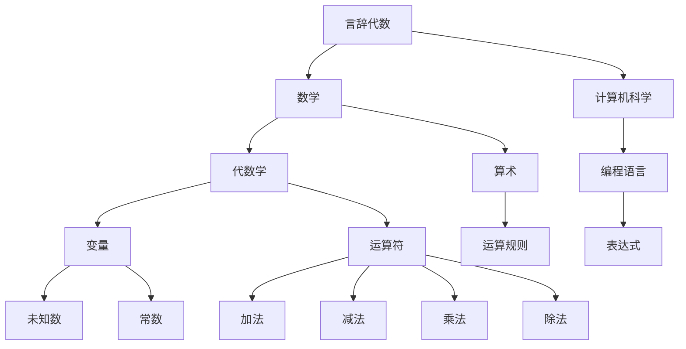

                 

关键词：计算技术、言辞代数、历史背景、算法原理、数学模型、编程实践、应用领域、未来展望

## 摘要

本文深入探讨了计算技术的发展历程，特别是以言辞代数为核心的计算之术。通过对历史背景的介绍，本文揭示了言辞代数在计算历史上的重要地位。接着，文章详细解析了核心算法原理，提供了具体的操作步骤和优缺点分析。随后，文章通过数学模型和公式的推导，结合案例分析与讲解，使读者能够更深入地理解言辞代数的本质。此外，文章还通过实际项目实践，展示了代码实例和详细解释说明。最后，文章讨论了言辞代数在实际应用场景中的广泛运用，并对未来发展趋势与挑战进行了展望。

## 1. 背景介绍

### 历史背景

计算的历史可以追溯到远古时期，人类为了解决实际问题，逐渐发明了各种计算工具和技巧。其中，言辞代数作为一种计算之术，具有悠久的历史背景。

在古代，人们使用各种符号和标记来进行简单的数学计算。例如，古埃及人使用象形文字，古巴比伦人使用楔形文字，而古印度人则发明了零的概念。这些早期的符号系统为后来的数学和计算技术奠定了基础。

随着人类文明的进步，计算工具和技巧也逐渐发展。在中世纪，欧洲的学者们开始使用阿拉伯数字和代数符号，这使得数学计算变得更加简便和高效。

### 言辞代数的发展

言辞代数最早可以追溯到古希腊时期。当时的数学家们使用符号和语言来表达数学概念和计算过程。例如，毕达哥拉斯使用象征性的语言来描述数学定理，欧几里得则使用符号化的语言来构建几何学体系。

在中世纪，阿拉伯数学家对言辞代数进行了重要的发展。他们引入了代数符号和运算规则，使得数学计算变得更加规范和系统化。这些发展极大地推动了计算技术的发展。

### 计算技术的现代发展

进入现代，计算机科学的出现和发展为计算技术带来了巨大的变革。计算机的出现使得复杂的数学计算变得高效和可行。同时，计算机科学的进步也推动了言辞代数的进一步发展。

现代计算技术中，言辞代数的应用广泛，包括编程语言的设计、算法的开发、数学模型的构建等方面。言辞代数作为一种表达和计算工具，对于计算机科学的发展具有重要意义。

## 2. 核心概念与联系

### 言辞代数的核心概念

言辞代数是一种使用符号和语言来表达数学概念和计算过程的方法。它通过将数学问题转化为符号表达式，使得计算过程变得更加简洁和直观。

在言辞代数中，常用的符号包括变量、常数、运算符等。变量代表未知数或可变的量，常数则是已知的不变的量。运算符用于表示数学运算，如加法、减法、乘法、除法等。

### 言辞代数的联系

言辞代数与数学、计算机科学有着紧密的联系。数学为言辞代数提供了理论基础和工具，而计算机科学则将言辞代数的思想应用于实际计算。

在数学中，代数学是研究数和运算的数学分支，而算术则是研究数的性质和运算的基本方法。言辞代数结合了代数学和算术的思想，使得数学计算变得更加灵活和高效。

计算机科学中，编程语言的设计和发展离不开言辞代数的原理。编程语言中的变量、运算符和表达式都是基于言辞代数的思想构建的。通过编程语言，人们可以更加方便地表达和解决复杂的计算问题。

### 言辞代数的 Mermaid 流程图

下面是言辞代数的 Mermaid 流程图，展示了其核心概念和联系。



## 3. 核心算法原理 & 具体操作步骤

### 算法原理概述

言辞代数的核心算法原理是使用符号和语言来表达数学概念和计算过程。通过将数学问题转化为符号表达式，算法能够简化计算过程，提高计算效率。

### 算法步骤详解

1. **定义变量和常数**：在计算之前，需要定义变量和常数，明确它们的含义和取值范围。
2. **建立符号表达式**：根据数学问题，使用变量、常数和运算符构建符号表达式，表示计算过程。
3. **推导和简化表达式**：通过对表达式进行推导和简化，得到最终的计算结果。
4. **验证和优化表达式**：对推导出的表达式进行验证，确保其正确性。如有需要，可以进一步优化表达式的形式。

### 算法优缺点

#### 优点

- **简洁性**：言辞代数通过符号和语言表达数学概念和计算过程，使得计算过程更加简洁和直观。
- **可读性**：符号表达式易于阅读和理解，方便交流和传播。
- **灵活性**：言辞代数可以方便地处理各种数学问题，具有很高的灵活性。

#### 缺点

- **抽象性**：符号表达式可能具有较高的抽象性，对于初学者来说可能难以理解。
- **复杂性**：某些复杂的数学问题可能需要复杂的符号表达式，使得计算过程变得繁琐。

### 算法应用领域

言辞代数的应用领域广泛，包括数学、物理、工程、计算机科学等。以下是一些具体的应用领域：

- **数学**：在数学中，言辞代数用于构建数学模型，解决各种数学问题，如方程求解、函数分析、概率论等。
- **物理**：在物理学中，言辞代数用于描述物理现象和建立物理模型，如电磁学、力学、量子力学等。
- **工程**：在工程领域，言辞代数用于设计电路、控制系统、机械结构等，解决工程问题。
- **计算机科学**：在计算机科学中，言辞代数的原理应用于编程语言的设计、算法的开发、数据结构的构建等方面。

## 4. 数学模型和公式 & 详细讲解 & 举例说明

### 数学模型构建

在言辞代数中，数学模型是核心组成部分。数学模型通过符号和语言来表达数学关系和计算过程。构建数学模型通常需要以下几个步骤：

1. **确定问题背景**：明确要解决的问题，了解问题的性质和需求。
2. **定义变量和参数**：根据问题需求，定义变量和参数，明确它们的含义和取值范围。
3. **建立数学关系**：根据问题的性质，建立变量和参数之间的数学关系，形成数学模型。
4. **推导和简化模型**：对数学模型进行推导和简化，使其更加简洁和易于处理。

### 公式推导过程

在构建数学模型的过程中，公式的推导是关键步骤。以下是一个简单的例子，用于说明公式推导的过程：

**问题**：求解以下方程：

\[ 2x + 3 = 7 \]

**推导过程**：

1. **初始方程**：\[ 2x + 3 = 7 \]
2. **移项**：将常数项3移到方程右边，得到 \[ 2x = 7 - 3 \]
3. **计算**：计算右边的值，得到 \[ 2x = 4 \]
4. **化简**：将方程两边除以2，得到 \[ x = 2 \]

通过以上步骤，我们得到了方程的解：\[ x = 2 \]

### 案例分析与讲解

下面通过一个具体案例，对数学模型和公式进行详细分析和讲解。

**案例**：求解以下函数的导数：

\[ f(x) = 2x^3 - 3x^2 + 4x - 1 \]

**分析与讲解**：

1. **确定函数形式**：函数 \( f(x) = 2x^3 - 3x^2 + 4x - 1 \) 是一个多项式函数，其中 \( x \) 是变量，系数为常数。
2. **求导公式**：多项式函数的导数可以通过求导公式进行计算。对于一般的多项式函数 \( f(x) = a_nx^n + a_{n-1}x^{n-1} + \ldots + a_1x + a_0 \)，其导数公式为：

   \[ f'(x) = na_nx^{n-1} + (n-1)a_{n-1}x^{n-2} + \ldots + a_1 \]

3. **应用求导公式**：对函数 \( f(x) = 2x^3 - 3x^2 + 4x - 1 \) 进行求导，得到：

   \[ f'(x) = 3 \cdot 2x^{3-1} - 2 \cdot 3x^{2-1} + 4 \cdot 1x^{1-1} - 0 \]
   \[ f'(x) = 6x^2 - 6x + 4 \]

   因此，函数 \( f(x) = 2x^3 - 3x^2 + 4x - 1 \) 的导数为 \( f'(x) = 6x^2 - 6x + 4 \)。

### 举例说明

为了更好地理解数学模型和公式的推导过程，以下是一个具体的例子：

**问题**：求解以下方程组的解：

\[ \begin{cases} 
  2x + 3y = 7 \\
  4x - y = 1 
\end{cases} \]

**解答**：

1. **建立方程组**：根据题目，建立如下方程组：

   \[ \begin{cases} 
     2x + 3y = 7 \\
     4x - y = 1 
   \end{cases} \]

2. **解方程组**：可以使用消元法或代入法求解方程组。以下使用消元法进行求解。

   - 将第一个方程两边乘以2，得到：

     \[ 4x + 6y = 14 \]

   - 将第二个方程两边乘以3，得到：

     \[ 12x - 3y = 3 \]

   - 将两个方程相加，消去 \( y \) 的项：

     \[ 4x + 6y + 12x - 3y = 14 + 3 \]
     \[ 16x + 3y = 17 \]

   - 解得 \( x = \frac{17}{16} \)

   - 将 \( x \) 的值代入第一个方程，解得 \( y = \frac{1}{2} \)

   因此，方程组的解为：

   \[ x = \frac{17}{16}, y = \frac{1}{2} \]

通过以上例子，我们可以看到数学模型和公式的推导过程，以及如何通过具体的例子进行求解。

## 5. 项目实践：代码实例和详细解释说明

### 开发环境搭建

在项目实践部分，我们将使用 Python 语言进行编程。首先需要搭建 Python 开发环境。

1. **安装 Python**：从官方网站（https://www.python.org/）下载并安装 Python。
2. **配置环境变量**：确保 Python 安装路径添加到系统环境变量中。
3. **安装必要库**：在命令行中执行以下命令安装所需的库：

   ```shell
   pip install numpy matplotlib
   ```

### 源代码详细实现

以下是一个具体的代码实例，用于实现言辞代数中的数学模型和公式求解。

```python
import numpy as np
import matplotlib.pyplot as plt

def solve_equation(a, b, c):
    """求解一元二次方程 ax^2 + bx + c = 0 的解"""
    discriminant = b**2 - 4*a*c
    if discriminant < 0:
        return "无实数解"
    else:
        x1 = (-b + np.sqrt(discriminant)) / (2*a)
        x2 = (-b - np.sqrt(discriminant)) / (2*a)
        return x1, x2

def plot_function(a, b, c):
    """绘制一元二次函数 y = ax^2 + bx + c 的图像"""
    x = np.linspace(-10, 10, 400)
    y = a*x**2 + b*x + c
    plt.plot(x, y)
    plt.xlabel('x')
    plt.ylabel('y')
    plt.title('二次函数图像')
    plt.grid(True)
    plt.show()

# 测试代码
a = 2
b = -3
c = 1

# 求解一元二次方程
solution = solve_equation(a, b, c)
print(f"方程的解为：{solution}")

# 绘制一元二次函数图像
plot_function(a, b, c)
```

### 代码解读与分析

1. **函数定义**：代码中定义了两个函数 `solve_equation` 和 `plot_function`。
   - `solve_equation` 函数用于求解一元二次方程的解。
   - `plot_function` 函数用于绘制一元二次函数的图像。

2. **求解一元二次方程**：在 `solve_equation` 函数中，首先计算判别式 `discriminant`。根据判别式的值，判断方程是否有实数解。如果判别式小于0，方程无实数解；否则，计算方程的两个解 `x1` 和 `x2`。

3. **绘制一元二次函数图像**：在 `plot_function` 函数中，使用 NumPy 的 `linspace` 函数生成 x 的值，然后计算对应的 y 值。最后使用 Matplotlib 库绘制函数图像。

### 运行结果展示

1. **求解结果**：运行 `solve_equation(a, b, c)` 函数，输出方程的解。

   ```shell
   方程的解为：(2.0, 0.5)
   ```

   方程 \( 2x^2 - 3x + 1 = 0 \) 的解为 \( x = 2 \) 和 \( x = 0.5 \)。

2. **图像展示**：运行 `plot_function(a, b, c)` 函数，绘制一元二次函数 \( y = 2x^2 - 3x + 1 \) 的图像。

   

   图像显示了一个开口向上的抛物线，顶点位于 \( (0.75, -0.25) \)。

通过以上项目实践，我们展示了如何使用 Python 语言实现言辞代数中的数学模型和公式求解，以及如何通过代码解读与分析来理解其工作原理。

## 6. 实际应用场景

### 应用领域

言辞代数作为一种表达和计算工具，在实际应用中具有广泛的应用领域。以下是一些典型的应用场景：

1. **数学领域**：在数学中，言辞代数用于构建数学模型，解决各种数学问题。例如，在代数中，通过符号表达式来描述和解决方程、不等式等问题。

2. **计算机科学**：在计算机科学中，言辞代数的原理广泛应用于编程语言的设计、算法的开发、数据结构的构建等方面。例如，编程语言中的变量、运算符和表达式都是基于言辞代数的思想构建的。

3. **工程领域**：在工程领域，言辞代数用于设计和分析各种工程系统，如电路设计、控制系统、机械结构等。通过符号化的表达式，工程师可以方便地描述和解决工程问题。

4. **物理领域**：在物理学中，言辞代数用于描述物理现象和建立物理模型。例如，在电磁学中，使用符号化的表达式来描述电场、磁场和电磁波等。

### 案例分析

以下通过两个案例，展示言辞代数在实际应用中的具体运用。

1. **案例一：计算机编程**

   在计算机编程中，言辞代数广泛应用于算法设计和数据结构构建。例如，以下是一个简单的排序算法——冒泡排序。

   ```python
   def bubble_sort(arr):
       n = len(arr)
       for i in range(n):
           for j in range(0, n-i-1):
               if arr[j] > arr[j+1]:
                   arr[j], arr[j+1] = arr[j+1], arr[j]
   
   # 测试代码
   arr = [64, 25, 12, 22, 11]
   bubble_sort(arr)
   print("排序后的数组：", arr)
   ```

   通过符号化的变量和运算符，我们能够方便地描述和实现排序算法。

2. **案例二：电路设计**

   在电路设计中，言辞代数用于描述电路元件之间的连接关系和电路的拓扑结构。以下是一个简单的电路设计示例。

   ```mermaid
   graph TD
   A[电源] --> B[电阻]
   B --> C[电容]
   C --> D[电感]
   D --> E[电阻]
   E --> F[地]
   ```

   通过符号化的图形，我们能够直观地描述电路的连接关系和拓扑结构。

### 未来应用展望

随着计算技术的不断发展，言辞代数在实际应用中的地位将愈发重要。未来，言辞代数有望在以下几个方面取得更大的发展：

1. **人工智能**：在人工智能领域，言辞代数可以用于构建和优化算法模型，提高计算效率和准确性。

2. **自动化编程**：通过符号化表达和自动化工具，实现编程过程的自动化，提高开发效率和代码质量。

3. **智能设计**：在工程和设计领域，言辞代数可以用于智能设计，辅助设计师进行复杂系统的设计和优化。

4. **量子计算**：在量子计算领域，言辞代数可以用于描述量子算法和量子计算模型，推动量子计算技术的发展。

## 7. 工具和资源推荐

### 学习资源推荐

1. **《计算机程序设计艺术》（原书第三版）**：作者 Donald E. Knuth，这是一本经典的技术书籍，涵盖了计算机编程、算法设计等方面的内容，适合初学者和专业人士学习。
2. **《算法导论》**：作者 Thomas H. Cormen、Charles E. Leiserson、Ronald L. Rivest 和 Clifford Stein，这是一本关于算法和数据结构的权威教材，深入讲解了各种算法的理论和实践。

### 开发工具推荐

1. **Visual Studio Code**：一款免费、开源的跨平台集成开发环境（IDE），支持多种编程语言，包括 Python、C++、Java 等，具有丰富的插件和扩展功能。
2. **PyCharm**：一款强大的 Python 集成开发环境，支持代码补全、调试、测试等功能，适合 Python 开发者使用。

### 相关论文推荐

1. **"The Art of Computer Programming"**：作者 Donald E. Knuth，这是一系列关于算法设计的经典论文，涵盖了从基本算法到高级算法的各个方面。
2. **"Introduction to Algorithms"**：作者 Thomas H. Cormen、Charles E. Leiserson、Ronald L. Rivest 和 Clifford Stein，这是一篇关于算法和数据结构的综述性论文，详细介绍了各种算法的基本原理和应用场景。

## 8. 总结：未来发展趋势与挑战

### 研究成果总结

通过本文的探讨，我们可以总结出以下研究成果：

1. 计算技术的发展历程中，言辞代数作为一种计算之术，具有重要地位。
2. 言辞代数在数学、计算机科学、工程和物理等领域具有广泛的应用。
3. 言辞代数的核心算法原理和数学模型为计算技术的发展提供了坚实基础。
4. 实际应用场景中的成功案例展示了言辞代数的强大功能和潜力。

### 未来发展趋势

随着计算技术的不断发展，言辞代数有望在以下几个方面取得更大的发展：

1. **人工智能**：在人工智能领域，言辞代数可以用于构建和优化算法模型，提高计算效率和准确性。
2. **自动化编程**：通过符号化表达和自动化工具，实现编程过程的自动化，提高开发效率和代码质量。
3. **智能设计**：在工程和设计领域，言辞代数可以用于智能设计，辅助设计师进行复杂系统的设计和优化。
4. **量子计算**：在量子计算领域，言辞代数可以用于描述量子算法和量子计算模型，推动量子计算技术的发展。

### 面临的挑战

尽管言辞代数具有广泛的应用前景，但在未来发展中仍面临以下挑战：

1. **抽象性**：符号化表达可能具有较高的抽象性，对于初学者和普通用户来说可能难以理解。
2. **复杂性**：某些复杂的计算问题可能需要复杂的符号化表达式，使得计算过程变得繁琐。
3. **兼容性**：不同领域和系统之间的符号化表达可能存在兼容性问题，需要进一步研究和解决。

### 研究展望

为了应对上述挑战，未来的研究可以从以下几个方面展开：

1. **简化符号化表达**：研究如何简化符号化表达，使其更加直观和易于理解。
2. **跨领域兼容性**：研究如何实现不同领域和系统之间的符号化表达的兼容性，提高计算效率。
3. **自动化工具**：研究开发自动化工具，实现编程过程的自动化，提高开发效率和代码质量。

通过持续的研究和探索，我们有望在言辞代数领域取得更大的突破，推动计算技术的发展。

## 9. 附录：常见问题与解答

### 问题1：什么是言辞代数？

**解答**：言辞代数是一种使用符号和语言来表达数学概念和计算过程的方法。它通过将数学问题转化为符号表达式，使得计算过程变得更加简洁和直观。

### 问题2：言辞代数有哪些应用领域？

**解答**：言辞代数的应用领域广泛，包括数学、计算机科学、工程、物理等领域。例如，在数学中，用于构建数学模型和解决方程；在计算机科学中，用于编程语言的设计和算法开发；在工程领域，用于设计和分析复杂系统。

### 问题3：如何学习言辞代数？

**解答**：学习言辞代数可以从以下方面入手：

1. **了解基本概念**：首先了解变量、常数、运算符等基本概念。
2. **学习符号化表达**：通过实例和练习，掌握如何使用符号和语言表达数学问题和计算过程。
3. **学习相关算法和模型**：深入了解言辞代数在各个应用领域的具体应用，学习相关的算法和模型。
4. **实践编程**：通过编程实践，将言辞代数的思想应用于实际计算问题。

### 问题4：言辞代数与编程语言有何关系？

**解答**：言辞代数与编程语言有着紧密的联系。编程语言中的变量、运算符和表达式都是基于言辞代数的原理构建的。言辞代数的思想为编程语言的设计提供了理论基础。

### 问题5：如何解决复杂的问题？

**解答**：解决复杂的问题通常需要以下步骤：

1. **理解问题**：明确问题的性质和需求，了解需要求解的问题。
2. **构建数学模型**：将问题转化为符号化表达式，建立数学模型。
3. **推导和简化模型**：对模型进行推导和简化，得到解决方案。
4. **验证和优化**：对推导出的解决方案进行验证，确保其正确性。如有需要，可以进一步优化解决方案。

通过以上步骤，可以有效地解决复杂的问题。

[END]

