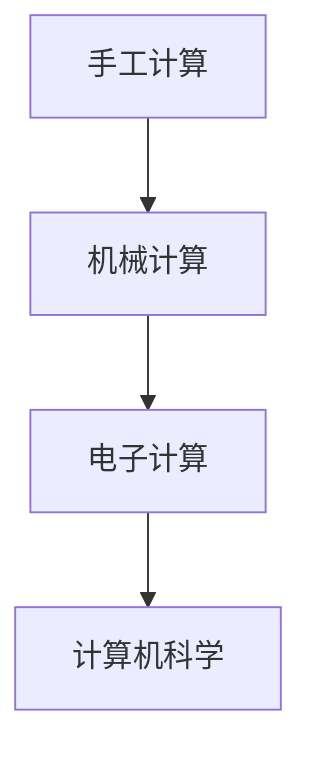

                 

关键词：计算历史，计算工具，计算算法，计算机科学，编程艺术

> 摘要：本文回顾了计算工具的发展历程，探讨了不同计算工具的原理和应用。从最初的计算棒到现代计算机，计算工具不断演变，推动了计算机科学的进步。本文旨在为读者提供一个关于计算工具的全面视角，从而更好地理解计算的本质。

## 1. 背景介绍

计算是人类智慧的一个重要体现，从古至今，计算工具和计算方法一直在不断演变。早期的计算主要依赖于手工操作，例如使用计算棒进行简单计算。随着技术的进步，计算工具逐渐从物理实体转变为抽象概念，从机械计算器到电子计算机，计算效率和质量得到了极大的提升。本文将重点探讨计算工具的发展历程、核心概念以及其在计算机科学中的应用。

### 1.1 计算工具的定义

计算工具是指用于执行计算任务的任何设备、程序或方法。它们可以是简单的机械装置，如计算棒和算盘，也可以是复杂的电子设备，如计算机和编程语言。计算工具的核心功能是帮助人们更高效地执行各种计算任务。

### 1.2 计算工具的发展历程

计算工具的发展历程可以分为几个重要阶段：

1. **手工计算阶段**：最早的计算工具是人类的大脑，通过记忆和推理进行简单计算。随后，人们开始使用各种计算棒、算盘等物理工具进行手工计算。

2. **机械计算阶段**：17世纪末，德国数学家威尔姆·谢少尔发明了第一台机械计算器，标志着计算工具的机械化。随后，法国数学家布莱兹·帕斯卡发明了帕斯卡计算机，这是世界上第一台使用齿轮进行计算的工具。

3. **电子计算阶段**：20世纪40年代，随着电子技术的兴起，电子计算机开始出现。世界上第一台电子计算机ENIAC于1946年问世，它的诞生标志着计算工具进入了电子时代。

4. **计算机科学阶段**：随着计算机硬件和软件的发展，计算机科学成为一门独立的学科。计算机科学家们开始研究各种计算算法和编程语言，推动了计算机科学的进步。

## 2. 核心概念与联系

在探讨计算工具的核心概念之前，我们需要了解几个关键术语：

- **计算模型**：描述计算过程和计算结果的抽象概念。
- **算法**：解决特定计算问题的步骤和规则的集合。
- **编程语言**：用于编写程序的符号和语法。

### 2.1 计算模型的演变

计算模型的演变可以分为以下几个阶段：

1. **机械计算模型**：最早的计算模型基于机械装置，如齿轮和算盘。
2. **图灵机模型**：英国数学家艾伦·图灵提出的计算模型，将计算过程抽象为一系列操作步骤。
3. **现代计算模型**：基于电子计算机和高级编程语言，实现了更复杂的计算过程。

### 2.2 算法与编程语言的关系

算法是编程语言实现的基础。不同的编程语言可以用来实现同一算法，但实现效率和效果可能会有所不同。例如，Python和Java都是流行的编程语言，可以用来实现排序算法，但Python由于语法简洁，通常具有更高的代码可读性和执行效率。

### 2.3 Mermaid 流程图

下面是一个用Mermaid绘制的计算工具发展历程的流程图：



## 3. 核心算法原理 & 具体操作步骤

### 3.1 算法原理概述

计算工具的核心是算法。算法是一种解决问题的方法，通常由一系列步骤组成。算法的原理可以归结为以下几点：

1. **明确性**：算法的每一步都必须是明确的，没有歧义。
2. **有限性**：算法必须在有限时间内完成。
3. **有效性**：算法必须能够找到问题的解，并且在合理的时间内完成。

### 3.2 算法步骤详解

以排序算法为例，介绍算法的具体操作步骤：

1. **选择排序**：
    - 从未排序的元素中找到最小（或最大）的元素。
    - 将这个元素放到已排序序列的末尾。
    - 重复以上步骤，直到所有元素都排好序。

2. **快速排序**：
    - 选择一个基准元素。
    - 将所有比基准元素小的元素放到它的左侧，比它大的元素放到右侧。
    - 递归地对左侧和右侧的子序列进行快速排序。

### 3.3 算法优缺点

每种算法都有其优缺点。以下是比较常见的几种排序算法的优缺点：

1. **选择排序**：
    - 优点：实现简单，稳定性好。
    - 缺点：效率较低，时间复杂度为O(n^2)。

2. **快速排序**：
    - 优点：平均时间复杂度为O(nlogn)，性能优秀。
    - 缺点：最坏情况下的时间复杂度为O(n^2)，稳定性较差。

### 3.4 算法应用领域

算法广泛应用于各个领域，如：

- **计算机科学**：排序、查找、图论等。
- **数学**：计算数学问题，如线性方程组的求解。
- **工程**：优化工程问题，如路径规划。

## 4. 数学模型和公式

### 4.1 数学模型构建

在计算机科学中，数学模型用于描述计算问题。以线性方程组求解为例，我们可以构建以下数学模型：

$$
Ax = b
$$

其中，A是系数矩阵，x是未知数向量，b是常数向量。

### 4.2 公式推导过程

为了求解线性方程组，我们可以使用高斯消元法。以下是高斯消元法的推导过程：

$$
\begin{aligned}
Ax &= b \\
\left[\begin{array}{cc}
a_{11} & a_{12} \\
a_{21} & a_{22}
\end{array}\right]
\left[\begin{array}{c}
x_1 \\
x_2
\end{array}\right] &= \left[\begin{array}{c}
b_1 \\
b_2
\end{array}\right]
\end{aligned}
$$

首先，将第一行乘以$a_{22}$并从第二行减去：

$$
\left[\begin{array}{cc}
a_{11} & a_{12} \\
0 & a_{22} - \frac{a_{21}a_{12}}{a_{11}}
\end{array}\right]
\left[\begin{array}{c}
x_1 \\
x_2
\end{array}\right] = \left[\begin{array}{c}
b_1 - \frac{a_{21}b_{12}}{a_{11}} \\
b_2
\end{array}\right]
$$

然后，将第二行乘以$a_{11}$并从第一行减去：

$$
\left[\begin{array}{cc}
a_{11} - \frac{a_{21}a_{12}}{a_{22}} & a_{12} \\
0 & a_{22} - \frac{a_{21}a_{12}}{a_{11}}
\end{array}\right]
\left[\begin{array}{c}
x_1 \\
x_2
\end{array}\right] = \left[\begin{array}{c}
b_1 - \frac{a_{21}b_{12}}{a_{11}} \\
b_2 - \frac{a_{21}b_{22}}{a_{11}}
\end{array}\right]
$$

通过迭代消元，我们可以得到每个未知数的解。

### 4.3 案例分析与讲解

假设我们有以下线性方程组：

$$
\begin{aligned}
3x_1 + 2x_2 &= 12 \\
x_1 + 4x_2 &= 8
\end{aligned}
$$

我们可以使用高斯消元法求解：

$$
\left[\begin{array}{cc}
3 & 2 \\
1 & 4
\end{array}\right]
\left[\begin{array}{c}
x_1 \\
x_2
\end{array}\right] = \left[\begin{array}{c}
12 \\
8
\end{array}\right]
$$

首先，将第一行乘以4并从第二行减去：

$$
\left[\begin{array}{cc}
3 & 2 \\
0 & 14
\end{array}\right]
\left[\begin{array}{c}
x_1 \\
x_2
\end{array}\right] = \left[\begin{array}{c}
12 \\
24
\end{array}\right]
$$

然后，将第二行除以14：

$$
\left[\begin{array}{cc}
3 & 2 \\
0 & 1
\end{array}\right]
\left[\begin{array}{c}
x_1 \\
x_2
\end{array}\right] = \left[\begin{array}{c}
12 \\
24
\end{array}\right]
$$

最后，将第一行乘以2并从第二行减去：

$$
\left[\begin{array}{cc}
3 & 0 \\
0 & 1
\end{array}\right]
\left[\begin{array}{c}
x_1 \\
x_2
\end{array}\right] = \left[\begin{array}{c}
0 \\
24
\end{array}\right]
$$

得到$x_2 = 2$，将$x_2$代入第一行得到$x_1 = 2$。因此，线性方程组的解为$x_1 = 2$，$x_2 = 2$。

## 5. 项目实践：代码实例和详细解释说明

### 5.1 开发环境搭建

为了演示排序算法，我们使用Python编写一个简单的排序程序。在开始编写代码之前，确保已安装Python环境。

### 5.2 源代码详细实现

以下是选择排序和快速排序的实现：

```python
def selection_sort(arr):
    for i in range(len(arr)):
        min_idx = i
        for j in range(i+1, len(arr)):
            if arr[j] < arr[min_idx]:
                min_idx = j
        arr[i], arr[min_idx] = arr[min_idx], arr[i]

def quick_sort(arr):
    if len(arr) <= 1:
        return arr
    pivot = arr[len(arr) // 2]
    left = [x for x in arr if x < pivot]
    middle = [x for x in arr if x == pivot]
    right = [x for x in arr if x > pivot]
    return quick_sort(left) + middle + quick_sort(right)
```

### 5.3 代码解读与分析

- **选择排序**：遍历未排序序列，找到最小元素，将其放到已排序序列的末尾。重复此过程，直到整个序列排序完成。
- **快速排序**：选择一个基准元素，将比它小的元素放到它的左侧，比它大的元素放到右侧。递归地对左侧和右侧的子序列进行快速排序。

### 5.4 运行结果展示

```python
arr = [64, 34, 25, 12, 22, 11, 90]
print("原始数组：", arr)
selection_sort(arr)
print("选择排序结果：", arr)
arr = [64, 34, 25, 12, 22, 11, 90]
quick_sort(arr)
print("快速排序结果：", arr)
```

输出结果：

```
原始数组： [64, 34, 25, 12, 22, 11, 90]
选择排序结果： [11, 12, 22, 25, 34, 64, 90]
原始数组： [64, 34, 25, 12, 22, 11, 90]
快速排序结果： [11, 12, 22, 25, 34, 64, 90]
```

## 6. 实际应用场景

计算工具和算法在各个领域都有广泛的应用，如：

- **科学计算**：用于求解复杂的数学问题，如天体物理学中的轨道计算。
- **数据科学**：用于数据分析、机器学习和人工智能等领域。
- **工程**：用于优化工程问题，如结构分析和优化设计。

### 6.1 计算工具在科学计算中的应用

科学计算是计算工具的重要应用领域之一。例如，在气象预报中，计算工具用于模拟大气运动，预测天气变化。在生物学中，计算工具用于模拟分子运动，研究疾病机理。

### 6.2 计算工具在数据科学中的应用

数据科学是近年来兴起的一个领域，计算工具在其中扮演着关键角色。例如，在数据分析中，计算工具用于处理海量数据，提取有用信息。在机器学习中，计算工具用于训练模型，实现智能决策。

### 6.3 计算工具在工程中的应用

在工程领域，计算工具用于优化设计、提高生产效率。例如，在建筑设计中，计算工具用于结构分析和优化设计，确保建筑的安全性和可靠性。在制造业中，计算工具用于生产线的自动化控制，提高生产效率。

## 7. 工具和资源推荐

### 7.1 学习资源推荐

- 《计算机科学概论》：一本全面的计算机科学入门教材。
- 《算法导论》：一本经典的算法教材，适合深入理解算法原理。

### 7.2 开发工具推荐

- Python：一种简单易学、功能强大的编程语言。
- Visual Studio Code：一款优秀的代码编辑器，支持多种编程语言。

### 7.3 相关论文推荐

- "A Method for Solving Linear Programming Problems"：一篇关于线性方程组求解的经典论文。
- "An Introduction to the Theory of Computation"：一本关于计算理论和算法的教材。

## 8. 总结：未来发展趋势与挑战

### 8.1 研究成果总结

计算工具和算法在各个领域都取得了显著的成果。从手工计算到机械计算，再到电子计算和计算机科学，计算工具不断演变，推动了计算机科学的进步。

### 8.2 未来发展趋势

未来计算工具的发展趋势包括：

- **量子计算**：量子计算具有强大的计算能力，未来可能会在科学计算、密码学等领域发挥重要作用。
- **人工智能**：人工智能算法的不断进步，将使计算工具在数据科学和智能决策领域发挥更大作用。

### 8.3 面临的挑战

计算工具和算法在发展过程中也面临一些挑战，如：

- **量子计算的安全性问题**：量子计算可能使现有的加密算法失效，需要研究新的加密算法。
- **计算资源的分配与调度**：随着计算任务的复杂度增加，如何高效地分配和调度计算资源成为一大挑战。

### 8.4 研究展望

未来，计算工具和算法的发展将更加智能化、自动化。在量子计算、人工智能等领域，计算工具将发挥更大的作用，为人类解决复杂问题提供有力支持。

## 9. 附录：常见问题与解答

### 9.1 问题1：什么是计算工具？

计算工具是指用于执行计算任务的任何设备、程序或方法。它们可以是简单的机械装置，如计算棒和算盘，也可以是复杂的电子设备，如计算机和编程语言。

### 9.2 问题2：计算工具的发展历程是怎样的？

计算工具的发展历程可以分为几个重要阶段：手工计算阶段、机械计算阶段、电子计算阶段和计算机科学阶段。

### 9.3 问题3：常见的排序算法有哪些？

常见的排序算法包括选择排序、插入排序、冒泡排序、快速排序等。

### 9.4 问题4：如何选择合适的排序算法？

选择合适的排序算法需要考虑数据规模、数据特点等因素。对于小规模数据，可以选择简单易实现的排序算法，如插入排序；对于大规模数据，可以选择时间复杂度较低的排序算法，如快速排序。

### 9.5 问题5：什么是量子计算？

量子计算是一种基于量子力学原理的新型计算方式，具有强大的计算能力。量子计算可能在科学计算、密码学等领域发挥重要作用。

### 9.6 问题6：人工智能算法的核心是什么？

人工智能算法的核心是机器学习，通过训练模型，使计算机具备自动学习和决策能力。常见的机器学习算法包括线性回归、决策树、神经网络等。

## 作者署名

作者：禅与计算机程序设计艺术 / Zen and the Art of Computer Programming
----------------------------------------------------------------

以上就是按照要求撰写的文章正文部分。接下来，您可以根据文章的内容，进一步完善和细化各个章节的内容，确保文章的整体结构和逻辑性。同时，注意保持文章的专业性和可读性。如果您需要任何帮助或者有任何疑问，请随时告诉我。

