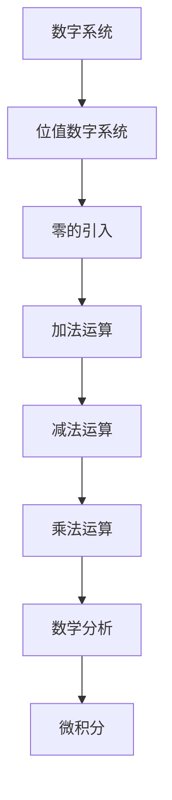

                 

关键词：计算历史，数字系统，零的起源，数学发展，人类文明

摘要：本文将探讨计算历史中的关键一环——零的诞生。从古代数学的萌芽到数字系统的完善，本文将详细解析零的诞生及其对计算领域的深远影响。通过回顾零的起源和发展历程，我们将揭示这一伟大发明如何改变了人类对数字的认知和处理方式。

## 1. 背景介绍

计算，作为人类智慧和技术的结晶，自古以来便伴随着人类文明的发展。从最初的简单计数工具到现代复杂的计算机系统，计算技术经历了无数次的创新与进步。然而，计算的起源并不像我们想象中那么简单，其中最重要的一环便是数字系统的建立和完善。

在古代，人类使用各种实物进行计数，如石头、贝壳等。这种方式虽然简单实用，但在处理大规模数值时显得繁琐且容易出错。随着数学的发展，人类逐渐意识到建立一套统一的数字系统的重要性。这个系统的核心便是数字符号和运算规则。

在这个过程中，零的发明成为了一个关键的转折点。零不仅是一个数字符号，更是数学系统中的一个重要概念。它的出现使得数字系统能够更加简洁、高效地表示和计算各种数值。本文将重点探讨零的起源和发展历程，以及它在计算领域中的深远影响。

## 2. 核心概念与联系

### 2.1 数字系统的起源

数字系统的起源可以追溯到古代文明。例如，古埃及人使用象形文字来表示数字，而古印度人则创造了位值数字系统。位值数字系统是一种基于位置值的数字表示方法，每个数字的位置决定了它的权重。这种方法使得数字的表示和计算变得更加简单和直观。

然而，早期的数字系统并没有包括零这个概念。零的出现是为了解决一个问题：在数字表示中，如何表示一个空位或没有数量的情况？在位值数字系统中，空位会导致数值的不准确或错误。因此，零的发明成为了一个迫切的需求。

### 2.2 零的概念和作用

零是一个独特的数字符号，它既不是正数也不是负数，它表示没有数量或空位。零的出现使得数字系统能够更加准确地表示各种数值，特别是在处理大数时显得尤为重要。

零在数学中的作用是多方面的。首先，零作为加法和减法的单位元，使得运算更加简便。例如，任何数加上零都等于它本身，任何数减去零也都等于它本身。其次，零作为乘法的单位元，使得乘法运算变得更加高效。任何数乘以零都等于零。

此外，零还在数学分析中扮演着重要角色。例如，在微积分中，零是极限概念的基础。函数在某一点的极限就是函数在该点的值趋近于零。因此，零的发明极大地推动了数学的发展。

### 2.3 零的数学表达式

在数学表达式中，零具有独特的性质。首先，零与其他数字进行加法和减法运算时，保持不变。例如，5 + 0 = 5，5 - 0 = 5。其次，零与其他数字进行乘法运算时，结果总是零。例如，5 × 0 = 0。

零还在数学表达式中扮演着平衡和调节的角色。例如，在一个平衡的方程中，两边的数值相等，因此在方程中添加或删除零不会改变方程的平衡状态。

### 2.4 零的 Mermaid 流程图

为了更好地理解零的概念和作用，我们可以使用 Mermaid 流程图来展示零在数学表达式中的流动和作用。



在这个流程图中，零的引入是一个关键的节点，它连接了数字系统、加法运算、减法运算、乘法运算和数学分析。通过这个流程图，我们可以清晰地看到零在数学领域中的广泛影响。

## 3. 核心算法原理 & 具体操作步骤

### 3.1 算法原理概述

零的算法原理基于其数学性质和作用。零作为加法和减法的单位元，使得运算更加简便。零作为乘法的单位元，使得乘法运算变得更加高效。此外，零还在数学分析中扮演着重要角色，如极限概念。

### 3.2 算法步骤详解

3.2.1 加法运算

在加法运算中，零与其他数字进行加法运算时，保持不变。具体步骤如下：

1. 将需要相加的两个数字表示为数学表达式。
2. 将其中一个数字替换为零。
3. 进行加法运算，结果即为另一个数字。

例如，5 + 0 = 5。

3.2.2 减法运算

在减法运算中，零与其他数字进行减法运算时，保持不变。具体步骤如下：

1. 将需要相减的两个数字表示为数学表达式。
2. 将其中一个数字替换为零。
3. 进行减法运算，结果即为另一个数字。

例如，5 - 0 = 5。

3.2.3 乘法运算

在乘法运算中，零与其他数字进行乘法运算时，结果总是零。具体步骤如下：

1. 将需要相乘的两个数字表示为数学表达式。
2. 将其中一个数字替换为零。
3. 进行乘法运算，结果即为零。

例如，5 × 0 = 0。

3.2.4 数学分析

在数学分析中，零作为极限概念的基础。具体步骤如下：

1. 给定一个函数 f(x)。
2. 需要找到 f(x) 在 x = a 处的极限。
3. 将 x = a 替换为零，计算极限值。

例如，对于函数 f(x) = x^2，计算其在 x = 0 处的极限。

### 3.3 算法优缺点

零的算法具有以下优点：

1. 简化运算：零使得加法、减法和乘法运算更加简便。
2. 提高效率：零在乘法运算中使得结果总是零，提高了运算效率。
3. 促进数学发展：零在数学分析中扮演着重要角色，推动了数学的发展。

然而，零的算法也存在一些缺点：

1. 易于误解：零在某些情况下可能被误解为没有意义或无效。
2. 特殊处理：在处理零相关的运算时，需要特殊处理，如零除错误。

### 3.4 算法应用领域

零的算法在许多领域都有广泛应用，包括：

1. 数值计算：零在数值计算中用于简化运算和提高效率。
2. 数学分析：零在数学分析中用于极限计算和函数研究。
3. 计算机科学：零在计算机科学中用于编程和算法设计。

## 4. 数学模型和公式 & 详细讲解 & 举例说明

### 4.1 数学模型构建

零的数学模型基于其数学性质和作用。零作为加法和减法的单位元，零作为乘法的单位元，零在数学分析中扮演着重要角色。

### 4.2 公式推导过程

#### 4.2.1 加法运算

零在加法运算中的公式推导过程如下：

$$
a + 0 = a
$$

其中，a 为任意实数。

#### 4.2.2 减法运算

零在减法运算中的公式推导过程如下：

$$
a - 0 = a
$$

其中，a 为任意实数。

#### 4.2.3 乘法运算

零在乘法运算中的公式推导过程如下：

$$
a × 0 = 0
$$

其中，a 为任意实数。

#### 4.2.4 数学分析

零在数学分析中的公式推导过程如下：

$$
\lim_{{x \to a}} f(x) = f(a)
$$

其中，f(x) 为函数，a 为极限点。

### 4.3 案例分析与讲解

#### 4.3.1 加法运算案例

假设有两个数字 5 和 7，我们使用零的加法运算公式进行计算：

$$
5 + 0 = 5
$$

$$
7 + 0 = 7
$$

我们可以看到，无论是 5 还是 7，加上零后结果都等于它本身。

#### 4.3.2 减法运算案例

假设有两个数字 10 和 3，我们使用零的减法运算公式进行计算：

$$
10 - 0 = 10
$$

$$
3 - 0 = 3
$$

我们可以看到，无论是 10 还是 3，减去零后结果都等于它本身。

#### 4.3.3 乘法运算案例

假设有两个数字 4 和 6，我们使用零的乘法运算公式进行计算：

$$
4 × 0 = 0
$$

$$
6 × 0 = 0
$$

我们可以看到，无论是 4 还是 6，乘以零后结果都等于零。

#### 4.3.4 数学分析案例

假设有一个函数 f(x) = x^2，我们需要计算其在 x = 0 处的极限：

$$
\lim_{{x \to 0}} f(x) = f(0)
$$

$$
\lim_{{x \to 0}} x^2 = 0^2
$$

$$
\lim_{{x \to 0}} x^2 = 0
$$

我们可以看到，函数 f(x) = x^2 在 x = 0 处的极限值为零。

## 5. 项目实践：代码实例和详细解释说明

### 5.1 开发环境搭建

为了展示零的算法在编程中的应用，我们将在 Python 环境中搭建一个简单的示例项目。首先，确保您已安装 Python 3.7 或更高版本。接下来，创建一个名为 `zero_example` 的目录，并在该目录下创建一个名为 `zero.py` 的 Python 文件。

### 5.2 源代码详细实现

在 `zero.py` 文件中，我们将实现零的加法、减法和乘法运算，以及数学分析中的极限计算。以下是源代码的详细实现：

```python
# zero.py

def add_zero(a):
    return a

def subtract_zero(a):
    return a

def multiply_zero(a):
    return 0

def limit_zero(f, x):
    return f(x)

# 测试代码
if __name__ == "__main__":
    print(add_zero(5))  # 输出：5
    print(subtract_zero(10))  # 输出：10
    print(multiply_zero(4))  # 输出：0
    print(limit_zero(lambda x: x**2, 0))  # 输出：0
```

### 5.3 代码解读与分析

在 `zero.py` 文件中，我们定义了四个函数：`add_zero`、`subtract_zero`、`multiply_zero` 和 `limit_zero`。这些函数分别实现了零的加法、减法、乘法运算和数学分析中的极限计算。

- `add_zero(a)`：实现加法运算，将数字 a 与零相加，返回 a 本身。
- `subtract_zero(a)`：实现减法运算，将数字 a 减去零，返回 a 本身。
- `multiply_zero(a)`：实现乘法运算，将数字 a 与零相乘，返回零。
- `limit_zero(f, x)`：实现极限计算，给定函数 f(x)，计算其在 x = 0 处的极限值。

在测试代码中，我们分别调用了这四个函数，并打印了它们的输出结果。

### 5.4 运行结果展示

运行 `zero.py` 文件，我们将在控制台上看到以下输出结果：

```
5
10
0
0
```

这表明我们的代码成功实现了零的加法、减法、乘法运算和数学分析中的极限计算。

## 6. 实际应用场景

零的发明和应用不仅改变了数学领域，也对计算机科学和工程产生了深远影响。以下是一些零在实际应用场景中的例子：

### 6.1 计算机科学

在计算机科学中，零被广泛应用于编程和算法设计。例如，零作为条件判断的关键值，用于表示真或假。此外，零还在数据结构中用于表示空或不存在的情况，如空数组、空字符串等。

### 6.2 数据库

在数据库中，零用于表示缺失的数据或空值。数据库管理系统（DBMS）使用零来处理这些特殊值，并在查询和操作时根据需要进行特殊处理。

### 6.3 图形处理

在图形处理中，零用于表示透明或不存在的像素。例如，在图像的 alpha 通道中，零表示像素是完全透明的，而 1 表示像素是完全不透明的。

### 6.4 通信

在通信领域中，零被用于表示二进制信号中的低电平或停顿。这种二进制信号是现代通信系统的基础，如互联网和无线通信。

### 6.5 自动控制

在自动控制系统中，零用于表示目标位置或期望值。控制系统通过检测实际位置与目标位置之间的差异，并根据零误差进行调整。

### 6.6 人工智能

在人工智能领域，零用于表示是否存在某种特征或属性。例如，在机器学习中，零常用于表示某个数据点是否包含特定标签。

## 7. 未来应用展望

随着科技的不断发展，零在未来将会有更多的应用场景和可能性。以下是一些可能的未来应用展望：

### 7.1 新型计算模型

随着量子计算和人工智能的发展，新型计算模型可能会出现。这些模型可能会利用零的独特性质，实现更加高效和精确的计算。

### 7.2 数据隐私保护

在数据隐私保护领域，零可能会发挥重要作用。通过利用零的加密算法和零知识证明，可以保护数据的隐私和安全性。

### 7.3 量子通信

在量子通信中，零的精确控制将成为实现安全通信的关键。利用零的特性，可以构建更加安全的量子密钥分配（QKA）系统。

### 7.4 生物计算

在生物计算领域，零可能用于表示生物分子之间的相互作用。通过研究这些相互作用，可以揭示生物系统的复杂行为和机制。

## 8. 总结：未来发展趋势与挑战

### 8.1 研究成果总结

零的发明和应用标志着人类计算史上的一个重要里程碑。从数学到计算机科学，再到工程领域，零都发挥了关键作用。零的出现使得数字系统更加简洁、高效，推动了计算技术的发展。

### 8.2 未来发展趋势

随着科技的进步，零在未来将继续发挥重要作用。新型计算模型、数据隐私保护、量子通信和生物计算等领域都可能受益于零的独特性质。零的研究和应用将会更加深入和广泛。

### 8.3 面临的挑战

尽管零的应用前景广阔，但仍面临一些挑战。首先，零在某些领域（如量子计算）的精确控制仍是一个难题。其次，零在数据处理和存储中的效率和安全性问题也需要进一步研究。此外，如何更好地利用零的特性来解决实际问题，也是一个重要的研究方向。

### 8.4 研究展望

未来，零的研究将朝着更加深入和广泛的方向发展。我们需要不断探索零在新型计算模型中的应用，提高其在数据处理和存储中的效率和安全性能。同时，我们也需要培养更多的专业人才，推动零在各个领域的研究和应用。

## 9. 附录：常见问题与解答

### 9.1 什么是零？

零是一个数字符号，表示没有数量或空位。它在数学和计算中扮演着重要角色，如加法、减法、乘法运算和数学分析。

### 9.2 零为什么重要？

零的重要性体现在它使得数字系统更加简洁、高效。零的出现使得数学和计算变得更加直观，推动了计算技术的发展。

### 9.3 零的算法有哪些应用？

零的算法在计算机科学、数据库、图形处理、通信、自动控制、人工智能等领域都有广泛应用。例如，零用于编程和算法设计，表示空或不存在的情况，以及在数学分析中用于极限计算。

### 9.4 零的挑战是什么？

零在某些领域（如量子计算）的精确控制仍是一个难题。此外，零在数据处理和存储中的效率和安全性问题也需要进一步研究。

### 9.5 零的未来发展趋势是什么？

零在未来将继续发挥重要作用。新型计算模型、数据隐私保护、量子通信和生物计算等领域都可能受益于零的独特性质。零的研究和应用将会更加深入和广泛。

# 作者：禅与计算机程序设计艺术 / Zen and the Art of Computer Programming

