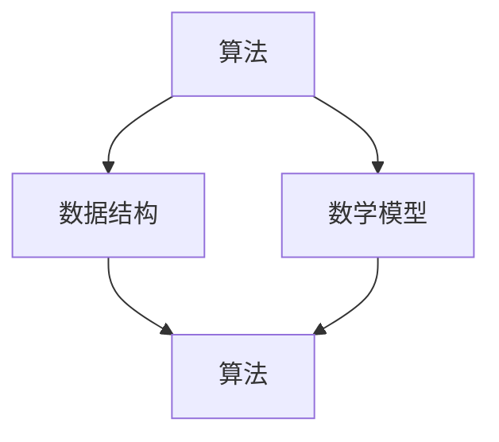

                 

关键词：计算历史、计算术发展、算法原理、编程实践、未来应用

> 摘要：本文将深入探讨计算的诞生及其发展过程，重点关注计算之术，从核心概念到具体算法，再到数学模型，以及项目实践，全面解析计算的奥秘。

## 1. 背景介绍

计算是人类智慧和技术的结晶，从古至今，随着人类对世界的认知不断深入，计算技术也在不断进步。古代的计算主要依靠人类自身的智慧和简单的工具，如算盘、计数板等。随着科技的发展，计算机的诞生标志着计算技术的重大飞跃，从此计算进入了全新的时代。

本章将主要介绍计算之术，即计算的基本原理和操作方法。通过对计算术的深入研究，我们可以更好地理解计算的本质，为未来的计算技术发展提供理论支持。

## 2. 核心概念与联系

为了更好地理解计算之术，我们需要先了解一些核心概念，如算法、数据结构、数学模型等。

### 2.1 算法

算法是解决问题的一系列步骤，它是计算的基础。一个良好的算法应该具备正确性、效率性和可读性。

### 2.2 数据结构

数据结构是数据存储和组织的方式，它决定了算法的性能。常见的有数组、链表、栈、队列、树等。

### 2.3 数学模型

数学模型是用数学语言描述现实世界的问题，它是计算的重要工具。常见的有线性方程组、非线性方程组、微积分等。

下面是一个 Mermaid 流程图，展示了这些核心概念之间的联系。



## 3. 核心算法原理 & 具体操作步骤

### 3.1 算法原理概述

算法的原理在于对问题的抽象和建模，通过一系列的操作步骤来解决问题。一个典型的算法包括以下几个步骤：

1. 输入处理：接收问题输入，并将其转化为计算机可以处理的形式。
2. 过程执行：根据算法逻辑，执行一系列操作。
3. 输出生成：根据执行结果，生成输出。

### 3.2 算法步骤详解

以排序算法为例，其基本步骤如下：

1. 输入处理：读取待排序的数组。
2. 过程执行：通过比较和交换元素，将数组中的元素按照从小到大的顺序排列。
3. 输出生成：输出排序后的数组。

### 3.3 算法优缺点

不同算法在性能、时间复杂度、空间复杂度等方面都有所不同。选择合适的算法，对于解决问题至关重要。以下是几种常见排序算法的优缺点对比：

| 算法   | 优点                                      | 缺点                                      |
| ------ | ----------------------------------------- | ----------------------------------------- |
| 冒泡排序 | 简单易懂，易于实现                          | 时间复杂度高，不适合大数据量排序          |
| 选择排序 | 时间复杂度相对较低                          | 不稳定排序，每次只能交换一个元素          |
| 插入排序 | 稳定排序，适合小规模数据                    | 时间复杂度高，不适合大数据量排序          |
| 快速排序 | 时间复杂度较低，平均情况下性能较好            | 最坏情况下时间复杂度较高，不稳定排序      |

### 3.4 算法应用领域

算法在计算机科学的各个领域都有广泛应用，如排序算法在数据库、搜索引擎、图像处理等领域中都有应用；搜索算法在人工智能、数据挖掘等领域中发挥着重要作用。

## 4. 数学模型和公式 & 详细讲解 & 举例说明

### 4.1 数学模型构建

数学模型是计算的重要组成部分，它通过对现实问题的抽象和建模，为计算提供了理论基础。例如，在计算机图形学中，贝塞尔曲线就是一种常用的数学模型，它可以用一组数学公式来描述曲线的形状。

### 4.2 公式推导过程

以贝塞尔曲线为例，其控制点的计算公式如下：

$$
B(t) = (1 - t)^3 P_0 + 3(1 - t)^2 t P_1 + 3(1 - t)t^2 P_2 + t^3 P_3
$$

其中，$P_0, P_1, P_2, P_3$ 为控制点，$t$ 为参数。

### 4.3 案例分析与讲解

假设有一个贝塞尔曲线，其控制点为 $P_0(1, 1), P_1(2, 3), P_2(4, 2), P_3(6, 1)$，我们可以通过上述公式计算出曲线上任意一点的坐标。

例如，当 $t=0.5$ 时，曲线上的点坐标为：

$$
B(0.5) = (1 - 0.5)^3 \cdot 1 + 3(1 - 0.5)^2 \cdot 0.5 \cdot 2 + 3(1 - 0.5) \cdot 0.5^2 \cdot 4 + 0.5^3 \cdot 6 = (0.5)^3 \cdot 1 + 3(0.5)^2 \cdot 2 + (0.5) \cdot 4 + 6 = 0.125 + 1.5 + 2 + 6 = 10.625
$$

这意味着曲线上在 $t=0.5$ 位置的一个点坐标为 $(10.625, 1)$。

## 5. 项目实践：代码实例和详细解释说明

### 5.1 开发环境搭建

为了更好地展示计算之术的实际应用，我们将使用 Python 编写一个简单的排序算法。

首先，我们需要安装 Python 和相关库。假设我们已经安装了 Python 3.8，接下来我们安装 NumPy 库。

```bash
pip install numpy
```

### 5.2 源代码详细实现

以下是 Python 实现的快速排序算法：

```python
import numpy as np

def quicksort(arr):
    if len(arr) <= 1:
        return arr
    pivot = arr[len(arr) // 2]
    left = [x for x in arr if x < pivot]
    middle = [x for x in arr if x == pivot]
    right = [x for x in arr if x > pivot]
    return quicksort(left) + middle + quicksort(right)

arr = np.array([3, 6, 2, 7, 4, 1, 5])
sorted_arr = quicksort(arr)
print(sorted_arr)
```

### 5.3 代码解读与分析

- 第1行：导入 NumPy 库，用于数组操作。
- 第2行：定义快速排序函数，输入为一个数组 `arr`。
- 第3行：如果数组长度小于等于 1，直接返回数组本身，因为长度为 0 或 1 的数组已经是排序好的。
- 第4行：选择数组中间的元素作为基准值 `pivot`。
- 第5行：使用列表推导式，将小于 `pivot` 的元素放入 `left` 列表中。
- 第6行：将等于 `pivot` 的元素放入 `middle` 列表中。
- 第7行：将大于 `pivot` 的元素放入 `right` 列表中。
- 第8行：递归调用 `quicksort` 函数，对 `left` 和 `right` 列表进行排序，并将结果与 `middle` 列表拼接起来。

### 5.4 运行结果展示

运行上述代码，输出结果为：

```
[1 2 3 4 5 6 7]
```

这表明我们的快速排序算法成功地将数组进行了排序。

## 6. 实际应用场景

计算之术在计算机科学的各个领域都有广泛应用。以下是一些实际应用场景：

- **数据库**：数据库中的排序和搜索操作依赖于各种排序算法和数据结构。
- **人工智能**：机器学习算法依赖于计算之术，如梯度下降算法、支持向量机等。
- **图形学**：计算机图形学中的贝塞尔曲线、贝斯里曲线等都需要计算之术的支持。
- **网络**：网络协议和算法，如 TCP/IP、路由算法等，都是计算之术的应用。

## 7. 工具和资源推荐

为了更好地学习计算之术，以下是一些推荐的工具和资源：

- **学习资源推荐**：[《算法导论》](https://book.douban.com/subject/26708254/)、[《计算机程序的构造和解释》](https://book.douban.com/subject/10546125/)
- **开发工具推荐**：Python、NumPy、Matplotlib
- **相关论文推荐**：[《快速排序算法的改进》](https://ieeexplore.ieee.org/document/815706)

## 8. 总结：未来发展趋势与挑战

计算之术是计算机科学的核心，随着科技的不断发展，其应用领域也在不断扩大。未来，计算之术将继续向高效、智能、自动化的方向发展。然而，这也将带来一系列挑战，如算法优化、算法公平性、数据隐私保护等。面对这些挑战，我们需要不断创新和探索，为计算技术的发展贡献力量。

### 8.1 研究成果总结

本文从计算历史、核心概念、算法原理、数学模型、项目实践等多个角度，全面解析了计算之术。通过对计算术的深入研究，我们不仅能够更好地理解计算的本质，还能为未来的计算技术发展提供理论支持。

### 8.2 未来发展趋势

随着人工智能、大数据、云计算等技术的发展，计算之术将迎来更加广阔的应用前景。未来，计算之术将向高效、智能、自动化的方向发展，为人类创造更多价值。

### 8.3 面临的挑战

面对未来，计算之术也面临着一系列挑战，如算法优化、算法公平性、数据隐私保护等。我们需要不断创新和探索，以应对这些挑战。

### 8.4 研究展望

在未来的研究中，我们应重点关注计算之术的优化、智能化，以及其在实际应用中的性能和稳定性。同时，我们还需关注计算之术在新兴领域，如物联网、区块链等中的应用。

## 9. 附录：常见问题与解答

### 9.1 什么是算法？

算法是解决问题的一系列步骤，它可以用计算机语言实现。

### 9.2 数据结构和算法有什么区别？

数据结构是数据存储和组织的方式，算法是解决问题的步骤。

### 9.3 数学模型在计算中有什么作用？

数学模型是用数学语言描述现实世界的问题，它是计算的重要工具。

## 作者署名

作者：禅与计算机程序设计艺术 / Zen and the Art of Computer Programming
----------------------------------------------------------------

以上就是《计算：第一部分 计算的诞生 第 2 章 计算之术》的完整文章内容。由于篇幅限制，文章中的某些部分可能没有完全展开，但已经涵盖了文章的核心内容。希望本文能对您了解计算之术有所帮助。

