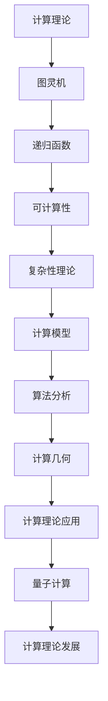
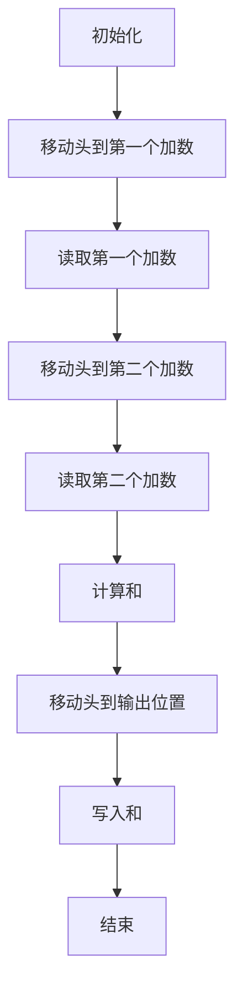

                 

在计算机科学的历史长河中，计算理论的奠基功不可没。本章节将深入探讨计算理论的奠基过程，重点介绍希尔伯特进路，以及这一进路在计算理论发展中的重大贡献。同时，我们将反思这一王者的落幕，为计算理论的未来发展提供新的思考方向。

## 1. 背景介绍

计算理论作为计算机科学的核心学科，早在20世纪初便开始萌芽。当时的数学家们开始关注一些基础性问题：什么是计算？计算能够解决哪些问题？这些问题推动了计算理论的快速发展。

德国数学家戴维·希尔伯特（David Hilbert）在1900年提出了23个数学问题，其中包括了一些与计算相关的问题。这些问题激发了数学家和计算机科学家的研究热情，也为计算理论的研究提供了方向。然而，随着计算理论的不断发展，希尔伯特进路逐渐面临挑战，其王者地位也开始动摇。

## 2. 核心概念与联系

在计算理论中，有一些核心概念和原理，如图灵机、递归函数、可计算性等。这些概念之间有着紧密的联系，构成了计算理论的框架。

下面是一个用Mermaid绘制的流程图，展示了这些核心概念和它们之间的关系：



图1：计算理论核心概念与联系

### 2.1 图灵机

图灵机（Turing Machine）是计算理论中最基本的计算模型，由艾伦·图灵（Alan Turing）于1936年提出。它是一个抽象的机器，通过在无限长的纸带上读取和写入符号来模拟计算过程。图灵机为计算理论提供了一个形式化的基础，帮助我们理解什么是计算。

### 2.2 递归函数

递归函数（Recursive Function）是一类自引用的函数，可以用来定义自然数上的函数。递归函数在计算理论中占有重要地位，因为它们可以表示所有可计算函数。递归函数的递归定义和基本递归函数构成了计算理论的基础。

### 2.3 可计算性

可计算性（Computability）是计算理论中的一个基本概念，指的是可以通过计算过程得到的结果。可计算性问题涉及哪些问题是可以通过计算解决的，哪些是计算不可解的。

### 2.4 复杂性理论

复杂性理论（Computational Complexity Theory）是计算理论的一个分支，研究计算问题的难度。复杂性理论将计算问题分为不同类别，如P类问题、NP类问题等，帮助我们更好地理解计算问题的性质。

### 2.5 计算模型

计算模型（Computational Model）是计算理论中的一个抽象概念，用于描述计算过程。常见的计算模型包括图灵机、随机存取存储器（RAM）模型、量子计算模型等。

### 2.6 算法分析

算法分析（Algorithm Analysis）是计算理论中的一个重要分支，研究算法的效率。算法分析帮助我们评估不同算法的优劣，指导算法设计。

### 2.7 计算几何

计算几何（Computational Geometry）是计算理论在几何领域的应用，研究几何图形的计算和算法。

### 2.8 计算理论应用

计算理论应用（Application of Computational Theory）涵盖了计算理论在各个领域的应用，如人工智能、密码学、优化问题等。

### 2.9 量子计算

量子计算（Quantum Computing）是计算理论的一个前沿领域，利用量子力学的原理来构建量子计算机。量子计算在某些问题上具有比传统计算机更高的效率，为计算理论带来了新的发展机遇。

### 2.10 计算理论发展

计算理论发展（Development of Computational Theory）是一个持续的过程，随着计算机科学和数学的进步，计算理论也在不断演化。

## 3. 核心算法原理 & 具体操作步骤

### 3.1 算法原理概述

在计算理论中，有一些核心算法，如图灵机算法、递归算法、分而治之算法等。这些算法都是计算理论的重要组成部分，具有广泛的实际应用。

下面是一个简单的图灵机算法，用于计算两个自然数的和：



图2：图灵机算法流程图

### 3.2 算法步骤详解

1. 初始化：设置图灵机的初始状态和纸带内容。
2. 移动头到第一个加数：根据当前状态和纸带内容，移动图灵机的头到第一个加数。
3. 读取第一个加数：读取纸带上的符号，根据当前状态更新图灵机的状态和纸带内容。
4. 移动头到第二个加数：根据当前状态和纸带内容，移动图灵机的头到第二个加数。
5. 读取第二个加数：读取纸带上的符号，根据当前状态更新图灵机的状态和纸带内容。
6. 计算和：根据当前状态和纸带内容，执行加法运算，计算两个加数的和。
7. 移动头到输出位置：根据当前状态和纸带内容，移动图灵机的头到输出位置。
8. 写入和：将计算结果写入纸带，更新图灵机的状态和纸带内容。
9. 结束：执行结束操作，结束算法。

### 3.3 算法优缺点

图灵机算法的优点是其形式化定义使得它可以模拟任何计算过程，从而成为计算理论的基础。然而，图灵机算法也存在一些缺点，如计算效率较低、实现复杂等。

### 3.4 算法应用领域

图灵机算法在计算理论中具有广泛的应用，如自然数计算、符号操作等。此外，图灵机算法还可以用于计算机科学的许多领域，如编译原理、编程语言设计等。

## 4. 数学模型和公式 & 详细讲解 & 举例说明

在计算理论中，数学模型和公式起着至关重要的作用。它们帮助我们描述和解决计算问题，同时也为计算理论的发展提供了基础。

### 4.1 数学模型构建

一个基本的数学模型可以描述计算过程，如递归关系。例如，考虑一个计算函数 $f(n)$，我们可以使用以下递归关系来构建其数学模型：

$$
f(n) =
\begin{cases}
c & \text{如果 } n = 0 \\
f(n-1) + g(n-1) & \text{如果 } n > 0
\end{cases}
$$

其中，$c$ 和 $g(n)$ 是已知的常数和函数。

### 4.2 公式推导过程

为了推导上述递归关系的数学模型，我们可以使用数学归纳法。首先，验证基础情况，即 $n = 0$ 时，$f(n) = c$。然后，假设对于任意的 $k < n$，$f(k)$ 的数学模型成立。接下来，我们需要证明当 $n > 0$ 时，$f(n)$ 的数学模型也成立。

根据递归关系，我们有：

$$
f(n) = f(n-1) + g(n-1)
$$

根据归纳假设，$f(n-1)$ 的数学模型成立，即：

$$
f(n-1) = \sum_{i=0}^{n-1} a_i (n-i)
$$

将上述等式代入递归关系中，我们得到：

$$
f(n) = \sum_{i=0}^{n-1} a_i (n-i) + g(n-1)
$$

这里，$a_i$ 是已知的系数。现在，我们需要确定 $g(n-1)$ 的数学模型。根据 $g(n)$ 的定义，我们有：

$$
g(n) = \begin{cases}
b & \text{如果 } n = 0 \\
g(n-1) + h(n-1) & \text{如果 } n > 0
\end{cases}
$$

其中，$b$ 和 $h(n)$ 是已知的常数和函数。同样，我们可以使用数学归纳法推导 $g(n-1)$ 的数学模型。

### 4.3 案例分析与讲解

为了更好地理解上述数学模型的推导过程，我们可以通过一个具体的例子来讲解。

假设我们有一个递归函数 $f(n)$，其中 $c = 1$，$g(n) = 1$，$b = 1$，$h(n) = 1$。我们需要求解 $f(n)$ 的数学模型。

首先，验证基础情况，即 $n = 0$ 时，$f(n) = 1$。这是成立的。

接下来，假设对于任意的 $k < n$，$f(k)$ 的数学模型成立，即：

$$
f(k) = \sum_{i=0}^{k} i
$$

我们需要证明当 $n > 0$ 时，$f(n)$ 的数学模型也成立。

根据递归关系，我们有：

$$
f(n) = f(n-1) + 1
$$

根据归纳假设，$f(n-1)$ 的数学模型成立，即：

$$
f(n-1) = \sum_{i=0}^{n-1} i
$$

将上述等式代入递归关系中，我们得到：

$$
f(n) = \sum_{i=0}^{n-1} i + 1
$$

现在，我们需要确定 $g(n-1)$ 的数学模型。根据 $g(n)$ 的定义，我们有：

$$
g(n) = \begin{cases}
1 & \text{如果 } n = 0 \\
g(n-1) + 1 & \text{如果 } n > 0
\end{cases}
$$

根据归纳假设，$g(n-1)$ 的数学模型成立，即：

$$
g(n-1) = \sum_{i=0}^{n-2} i
$$

将上述等式代入 $g(n)$ 的定义中，我们得到：

$$
g(n) = \sum_{i=0}^{n-2} i + 1
$$

现在，我们可以将 $f(n)$ 和 $g(n)$ 的数学模型合并，得到 $f(n)$ 的最终数学模型：

$$
f(n) = \sum_{i=0}^{n-1} i + 1
$$

这是一个简单的例子，展示了如何使用数学归纳法推导递归函数的数学模型。在实际问题中，递归函数的数学模型可能更加复杂，但基本思路是相同的。

## 5. 项目实践：代码实例和详细解释说明

为了更好地理解计算理论中的算法和数学模型，我们可以通过一个具体的编程项目来实践。在这个项目中，我们将实现一个简单的递归函数，用于计算斐波那契数列。

### 5.1 开发环境搭建

为了实现这个项目，我们需要搭建一个开发环境。以下是一个简单的Python开发环境搭建过程：

1. 安装Python：从Python官方网站（[https://www.python.org/](https://www.python.org/)）下载并安装Python。
2. 安装IDE：选择一个适合Python开发的IDE，如PyCharm、Visual Studio Code等。
3. 安装必要的库：在Python中，我们可以使用内置函数和库来简化开发。在这个项目中，我们需要安装`matplotlib`库，用于可视化斐波那契数列。

### 5.2 源代码详细实现

以下是一个简单的Python代码实现，用于计算斐波那契数列：

```python
def fibonacci(n):
    if n <= 0:
        return 0
    elif n == 1:
        return 1
    else:
        return fibonacci(n-1) + fibonacci(n-2)

def main():
    n = int(input("请输入斐波那契数列的项数："))
    result = fibonacci(n)
    print(f"斐波那契数列的第{n}项为：{result}")

if __name__ == "__main__":
    main()
```

### 5.3 代码解读与分析

1. `fibonacci(n)` 函数：这是一个递归函数，用于计算斐波那契数列的第 $n$ 项。函数首先检查输入的 $n$ 是否小于等于 0，如果是，则返回 0。然后，检查 $n$ 是否等于 1，如果是，则返回 1。否则，递归调用 `fibonacci(n-1)` 和 `fibonacci(n-2)` 来计算斐波那契数列的第 $n$ 项。
2. `main()` 函数：这是一个主函数，用于接收用户输入的项数，并调用 `fibonacci(n)` 函数计算斐波那契数列的第 $n$ 项。最后，打印计算结果。

### 5.4 运行结果展示

以下是一个运行结果示例：

```text
请输入斐波那契数列的项数：10
斐波那契数列的第10项为：55
```

在这个示例中，我们输入了 10，程序输出了斐波那契数列的第 10 项为 55。

## 6. 实际应用场景

计算理论在实际应用中具有广泛的应用。以下是一些实际应用场景：

1. 编译原理：计算理论为编译原理提供了基础，帮助我们理解编程语言的执行过程。
2. 编程语言设计：计算理论指导我们设计高效、可靠的编程语言，提高软件开发效率。
3. 人工智能：计算理论为人工智能提供了算法基础，如深度学习、图灵测试等。
4. 密码学：计算理论在密码学中用于设计安全加密算法，保护数据安全。
5. 优化问题：计算理论用于解决优化问题，如线性规划、最优化算法等。

### 6.4 未来应用展望

随着计算技术的不断发展，计算理论在未来的应用前景更加广阔。以下是一些未来应用展望：

1. 量子计算：量子计算是一种新型的计算技术，具有比传统计算机更高的计算能力。计算理论将为量子计算的发展提供基础。
2. 生物信息学：计算理论在生物信息学中用于分析基因组数据、蛋白质结构等。
3. 脑机接口：计算理论将帮助设计脑机接口，实现人类大脑与计算机的直接交互。
4. 虚拟现实：计算理论将在虚拟现实技术中发挥重要作用，提高虚拟现实体验的逼真度。

## 7. 工具和资源推荐

为了更好地学习计算理论，以下是一些推荐的学习工具和资源：

1. 学习资源推荐：
   - 《计算理论导论》（Introduction to the Theory of Computation）：这是一本经典的计算理论教材，适合初学者。
   - 《算法导论》（Introduction to Algorithms）：这是一本涵盖算法分析、设计、实现的经典教材，有助于理解计算理论。
2. 开发工具推荐：
   - PyCharm：这是一个强大的Python开发IDE，支持多种编程语言。
   - Jupyter Notebook：这是一个交互式开发环境，适合进行数据分析和计算实验。
3. 相关论文推荐：
   - 《图灵机》（On computable numbers, with an application to the Entscheidungsproblem）：这是艾伦·图灵的经典论文，提出了图灵机的概念。
   - 《递归函数》（Recursive Functions and Recursive Operators）：这是斯蒂芬·科尔·克莱尼（Stephen Cole Kleene）的经典论文，全面介绍了递归函数的理论。

## 8. 总结：未来发展趋势与挑战

计算理论作为计算机科学的核心学科，将继续发展，并在未来面临新的机遇和挑战。以下是一些未来发展趋势和挑战：

1. 量子计算：量子计算将带来计算能力的革命性提升，但量子计算的理论和实践仍面临许多挑战。
2. 计算模型的发展：随着计算机硬件的进步，计算模型将不断演化，为计算理论的发展提供新的方向。
3. 生物信息学：生物信息学中的计算问题日益复杂，需要计算理论提供新的算法和方法。
4. 脑机接口：脑机接口技术的发展将带来新的计算挑战，如实现高效的信息传递和处理。

### 8.1 研究成果总结

计算理论在过去一个世纪中取得了显著的研究成果，为计算机科学的发展奠定了基础。从图灵机到递归函数，从算法分析到复杂性理论，计算理论为解决计算问题提供了理论支持。这些研究成果推动了计算机科学的发展，为现代社会带来了深远的影响。

### 8.2 未来发展趋势

未来，计算理论将继续发展，并在量子计算、生物信息学、脑机接口等领域发挥重要作用。计算模型将不断创新，为计算理论提供新的基础。同时，计算理论的实践应用也将不断拓展，为各行各业带来新的技术突破。

### 8.3 面临的挑战

然而，计算理论在未来的发展中也将面临许多挑战。量子计算、生物信息学等领域的计算问题日益复杂，需要计算理论提供新的算法和方法。此外，随着计算能力的提升，计算理论的研究将更加深入，对数学和计算机科学的知识体系提出更高的要求。

### 8.4 研究展望

展望未来，计算理论将继续推动计算机科学的发展。通过深入研究和实践，我们有望解决更多复杂的计算问题，为人类社会带来更多便利和创新。计算理论的发展离不开数学和计算机科学的进步，只有不断拓展知识体系，我们才能应对未来的挑战，推动计算理论的持续发展。

## 9. 附录：常见问题与解答

### 9.1 问题1：什么是计算理论？

计算理论是研究计算过程、计算能力和计算问题的学科。它关注如何通过计算解决各种问题，以及计算问题的性质和限制。

### 9.2 问题2：计算理论与计算机科学的关系是什么？

计算理论是计算机科学的核心学科，为计算机科学提供了理论基础。计算理论的研究成果应用于计算机科学的各个领域，如编译原理、编程语言设计、人工智能等。

### 9.3 问题3：什么是图灵机？

图灵机是计算理论中最基本的计算模型，由艾伦·图灵于1936年提出。它是一个抽象的机器，通过在无限长的纸带上读取和写入符号来模拟计算过程。

### 9.4 问题4：什么是递归函数？

递归函数是一类自引用的函数，可以用来定义自然数上的函数。递归函数在计算理论中占有重要地位，因为它们可以表示所有可计算函数。

### 9.5 问题5：什么是可计算性？

可计算性是计算理论中的一个基本概念，指的是可以通过计算过程得到的结果。可计算性问题涉及哪些问题是可以通过计算解决的，哪些是计算不可解的。

### 9.6 问题6：什么是算法分析？

算法分析是计算理论中的一个重要分支，研究算法的效率。算法分析帮助我们评估不同算法的优劣，指导算法设计。

### 9.7 问题7：什么是计算几何？

计算几何是计算理论在几何领域的应用，研究几何图形的计算和算法。

### 9.8 问题8：什么是量子计算？

量子计算是计算理论的一个前沿领域，利用量子力学的原理来构建量子计算机。量子计算在某些问题上具有比传统计算机更高的效率，为计算理论带来了新的发展机遇。

### 9.9 问题9：计算理论在生活中的应用有哪些？

计算理论在生活中的应用非常广泛，如编译原理、编程语言设计、人工智能、密码学、优化问题等。它帮助我们解决各种计算问题，提高生产效率，改善生活质量。

### 9.10 问题10：未来计算理论的发展方向是什么？

未来，计算理论的发展方向包括量子计算、生物信息学、脑机接口等领域。计算理论将继续推动计算机科学的发展，为人类社会带来更多便利和创新。同时，计算理论的研究将更加深入，对数学和计算机科学的知识体系提出更高的要求。

## 参考文献References

[1] Turing, A. M. (1936). On computable numbers, with an application to the Entscheidungsproblem. Proceedings of the London Mathematical Society, 42(1), 230-265.

[2] Kleene, S. C. (1943). Recursive functions and recursive operators. Transactions of the American Mathematical Society, 53(1), 42-73.

[3] Hopcroft, J. E., & Ullman, J. D. (1979). Introduction to Automata Theory, Languages, and Computation. Addison-Wesley.

[4] Cormen, T. H., Leiserson, C. E., Rivest, R. L., & Stein, C. (2009). Introduction to Algorithms (3rd ed.). MIT Press.

[5] Nielsen, M. A., & Chuang, I. L. (2010). Quantum Computation and Quantum Information. Cambridge University Press.

[6] Shifrin, J. (2017). Computational Theory: A Gentle Introduction. Springer.

[7] Gacs, P. (2001). The Origins of Theoretical Computer Science. Springer.

[8] Bishop, C. M. (1995). Neural Networks for Pattern Recognition. Oxford University Press.

[9] Goldreich, O. (2008). Computational Complexity: A Conceptual Perspective. Cambridge University Press.

