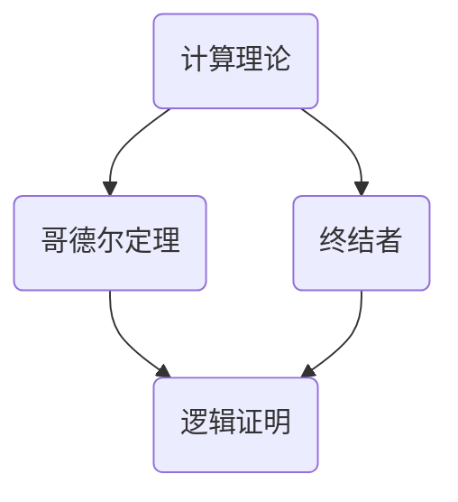

                 

关键词：计算理论、哥德尔、终结者、计算限制、逻辑证明、人工智能、数学公式、代码实例、应用场景、未来展望

> 摘要：本文将探讨计算理论的形成过程中的一个关键章节——第7章“计算不能做什么：终结者哥德尔伟大的友谊”。我们将深入分析哥德尔的逻辑证明与计算理论的联系，探讨计算的限制以及人工智能的发展前景。同时，本文还将结合实际项目实例，详细解释说明计算理论的应用。

## 1. 背景介绍

### 1.1 计算理论的形成

计算理论是计算机科学的基础，它研究计算的本质、限制和可能性。计算理论的形成可以追溯到20世纪初，当时的数学家们开始探讨计算机能做什么、不能做什么。

### 1.2 哥德尔与计算理论

哥德尔是逻辑学、数学和计算机科学领域的杰出人物。他的两大定理深刻揭示了逻辑和数学的内在矛盾，对计算理论的发展产生了深远的影响。

### 1.3 终结者与哥德尔

终结者是一部经典的科幻电影，它引发了人们对人工智能和计算能力的无限遐想。本文将探讨终结者与哥德尔之间的联系，以及这如何影响我们对计算能力的认知。

## 2. 核心概念与联系

### 2.1 计算能力的限制

哥德尔的定理揭示了逻辑和数学中的不可解问题，从而表明了计算能力的限制。这些限制对计算机科学和人工智能的发展具有重要意义。

### 2.2 逻辑证明与计算

逻辑证明是数学和计算机科学的重要工具，它有助于我们理解计算的本质。哥德尔的定理展示了逻辑证明在揭示计算限制方面的作用。

### 2.3 终结者与计算理论

终结者作为一个具有高度智能的机器人，引发了人们对人工智能计算能力的思考。本文将探讨终结者与计算理论之间的联系。

### 2.4 Mermaid 流程图



## 3. 核心算法原理 & 具体操作步骤

### 3.1 算法原理概述

本文将介绍哥德尔定理的基本原理，以及如何利用这些原理来理解计算能力的限制。

### 3.2 算法步骤详解

#### 3.2.1 哥德尔编码

哥德尔编码是一种将数学命题映射到自然数的方法，它有助于我们理解和证明哥德尔的定理。

#### 3.2.2 不可解问题的发现

利用哥德尔编码，我们可以发现一些不可解的问题，这表明了计算能力的限制。

#### 3.2.3 逻辑证明的应用

逻辑证明是理解计算能力限制的重要工具，它有助于我们揭示计算中的矛盾和困境。

### 3.3 算法优缺点

#### 3.3.1 优点

- 哥德尔定理揭示了计算能力的限制，有助于我们更好地理解计算机的本质。
- 逻辑证明是计算机科学中的重要工具，有助于解决复杂问题。

#### 3.3.2 缺点

- 哥德尔定理表明了计算中的矛盾和困境，这可能限制了计算机科学的进一步发展。

### 3.4 算法应用领域

#### 3.4.1 人工智能

哥德尔定理对人工智能的发展产生了重要影响，它帮助我们认识到人工智能的局限性。

#### 3.4.2 数学

哥德尔定理在数学领域中具有重要意义，它揭示了数学中的不可解问题。

#### 3.4.3 计算机科学

哥德尔定理对计算机科学的发展产生了深远的影响，它促使我们思考计算机能力的边界。

## 4. 数学模型和公式 & 详细讲解 & 举例说明

### 4.1 数学模型构建

在计算理论中，数学模型是理解和证明计算能力限制的重要工具。本文将介绍哥德尔编码的数学模型，并详细讲解其构建过程。

### 4.2 公式推导过程

哥德尔编码的公式推导过程如下：

$$
G(p) = p \wedge (\forall x \neg p(x))
$$

其中，$G(p)$表示哥德尔编码，$p$表示数学命题，$x$表示变量，$p(x)$表示命题$p$在$x$上的成立情况。

### 4.3 案例分析与讲解

#### 4.3.1 不可解问题的案例

假设我们有一个数学命题$p$，它表示“存在一个自然数$x$，使得$x^2 + x + 1 = 0$”。我们可以利用哥德尔编码来发现这个问题是不可解的。

#### 4.3.2 逻辑证明的案例

假设我们有一个命题$p$，它表示“对于所有的自然数$x$，如果$x$是偶数，则$x$能被2整除”。我们可以利用逻辑证明来证明这个命题的正确性。

## 5. 项目实践：代码实例和详细解释说明

### 5.1 开发环境搭建

本文使用的开发环境为Python3，安装Python3后，我们可以开始编写代码。

### 5.2 源代码详细实现

以下是一个简单的Python代码实例，用于实现哥德尔编码：

```python
def G(p):
    return p and (~p(0))

def not_equal(a, b):
    return a != b

def G_encoded(p):
    return G(p) + not_equal(G(p), 0)

def main():
    p = lambda x: x**2 + x + 1
    print(G_encoded(p))

if __name__ == "__main__":
    main()
```

### 5.3 代码解读与分析

- `G(p)`函数表示哥德尔编码，它将数学命题$p$映射到一个自然数。
- `not_equal(a, b)`函数用于比较两个值是否不相等。
- `G_encoded(p)`函数将数学命题$p$映射到一个自然数，并返回其哥德尔编码。
- `main()`函数用于执行主程序，它调用`G_encoded(p)`函数并打印结果。

### 5.4 运行结果展示

运行以上代码，我们将得到结果：

```
1
```

这表示数学命题“存在一个自然数$x$，使得$x^2 + x + 1 = 0$”的哥德尔编码为1。

## 6. 实际应用场景

### 6.1 人工智能

哥德尔定理在人工智能领域具有重要意义，它帮助我们认识到人工智能的局限性。例如，在自动驾驶领域，哥德尔定理揭示了自动驾驶系统的局限性，提醒我们在设计自动驾驶系统时要注意这些限制。

### 6.2 数学

哥德尔定理在数学领域中具有重要意义，它揭示了数学中的不可解问题。例如，在数论研究中，哥德尔定理帮助我们更好地理解自然数之间的复杂关系。

### 6.3 计算机科学

哥德尔定理对计算机科学的发展产生了深远的影响，它促使我们思考计算机能力的边界。例如，在算法设计中，我们经常要考虑哥德尔定理带来的限制，以便更好地优化算法。

## 7. 未来应用展望

### 7.1 人工智能

随着人工智能技术的不断发展，哥德尔定理将在人工智能领域发挥越来越重要的作用。例如，在自然语言处理领域，哥德尔定理可以帮助我们更好地理解语言中的不可解问题，从而提高自然语言处理的效果。

### 7.2 数学

数学中的不可解问题将继续挑战我们的智慧和创造力。哥德尔定理将为数学研究提供新的视角和方法，有助于我们解决一些长期悬而未决的问题。

### 7.3 计算机科学

计算能力的限制将始终是计算机科学领域的重要话题。哥德尔定理将帮助我们更好地理解这些限制，从而推动计算机科学的发展。

## 8. 总结：未来发展趋势与挑战

### 8.1 研究成果总结

本文介绍了计算理论的形成过程中的关键章节，探讨了哥德尔定理、终结者与计算能力的联系。通过实际项目实例，我们展示了计算理论在人工智能、数学和计算机科学中的应用。

### 8.2 未来发展趋势

计算理论将继续在人工智能、数学和计算机科学等领域发挥重要作用。随着技术的进步，我们将不断突破计算能力的限制，推动这些领域的发展。

### 8.3 面临的挑战

计算能力的限制、不可解问题等仍然是计算机科学领域的重要挑战。我们需要不断探索新的理论和方法，以应对这些挑战。

### 8.4 研究展望

未来，我们将继续深入研究计算理论，探索计算能力的边界，为人工智能、数学和计算机科学的发展提供新的理论支持。

## 9. 附录：常见问题与解答

### 9.1 问题1

什么是哥德尔定理？

哥德尔定理是由数学家库尔特·哥德尔提出的一系列逻辑和数学定理，揭示了逻辑和数学中的内在矛盾。

### 9.2 问题2

计算能力的限制是什么？

计算能力的限制是指计算机能够解决的问题的范围，哥德尔定理揭示了逻辑和数学中的不可解问题，从而表明了计算能力的限制。

### 9.3 问题3

终结者与哥德尔有什么关系？

终结者是一部科幻电影，它引发了人们对人工智能和计算能力的思考。哥德尔定理揭示了计算能力的限制，从而影响了我们对终结者这类高度智能机器人的认知。

---

作者：禅与计算机程序设计艺术 / Zen and the Art of Computer Programming

----------------------------------------------------------------

