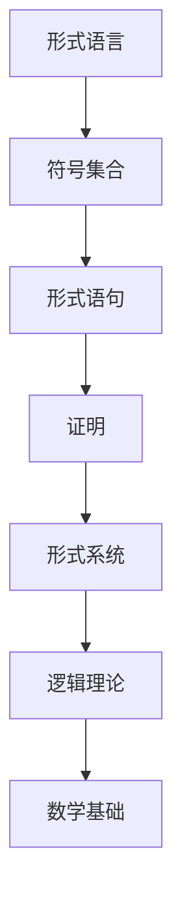

                 

关键词：第三次数学危机、自我指涉、形式系统、证明论、数学基础、逻辑悖论、自引用结构。

> 摘要：本文深入探讨了第三次数学危机中的自我指涉现象，分析了自我指涉对形式系统和数学基础的影响。通过介绍证明论的发展和数学悖论的解决方法，本文旨在为读者揭示自我指涉在数学和计算机科学中的重要性，以及它在未来可能带来的挑战和机遇。

## 1. 背景介绍

### 第三次数学危机

第三次数学危机起源于20世纪初期，这是数学史上一次深刻的自我反思和重构。与第一次数学危机（无理性数和非欧几何的出现）和第二次数学危机（集合论悖论和形式主义的兴起）不同，第三次数学危机的关注点在于数学语言的自我指涉现象。自我指涉问题揭示了形式系统中的内在矛盾，挑战了我们对数学基础的理解。

### 自我指涉的定义和现象

自我指涉是一种特殊的现象，当一个对象或概念在某种关系中与自身发生关联时，就出现了自我指涉。在数学中，自我指涉现象可以通过自引用结构来体现，例如，一个命题P同时是它自身的证明。

### 形式系统和数学基础

形式系统是一种由符号和规则构成的抽象模型，用于表述数学和逻辑理论。数学基础是形式系统的基础，包括公理、定义和推理规则。自我指涉现象对形式系统和数学基础产生了深远的影响，引发了数学界的广泛关注和讨论。

## 2. 核心概念与联系

### 形式系统的 Mermaid 流程图

以下是一个简化的形式系统 Mermaid 流程图，展示了形式系统中的基本概念和关系。



### 形式系统与数学基础的关系

形式系统是数学基础的具体实现，而数学基础则为形式系统提供了公理和推理规则。自我指涉现象在形式系统中表现为自引用结构，例如，一个形式语句可以是它自身的证明。

## 3. 核心算法原理 & 具体操作步骤

### 算法原理概述

为了解决自我指涉问题，证明论提出了一系列方法，包括自我指涉的识别、解决和避免。核心算法原理如下：

1. **自我指涉的识别**：通过检查形式系统的证明结构，判断是否存在自引用的情况。
2. **自我指涉的解决**：对于识别出的自我指涉，使用特殊的推理规则或构造新的证明系统来解决。
3. **自我指涉的避免**：在形式系统的设计和构造过程中，采取一定策略避免自我指涉的出现。

### 算法步骤详解

1. **自我指涉的识别**：
   - 检查形式系统的证明结构，查找自引用的命题。
   - 使用递归算法遍历证明过程，查找自引用的步骤。

2. **自我指涉的解决**：
   - 对于自引用的命题，构造一个新的证明系统，其中包含特殊的推理规则，允许自引用的存在。
   - 在新的证明系统中，将自引用的命题转化为可证明的命题。

3. **自我指涉的避免**：
   - 在形式系统的设计阶段，采用避免自引用的构造方法。
   - 通过限制形式语言的语法和语义，避免自引用的出现。

### 算法优缺点

**优点**：
- **解决自我指涉问题**：算法能够识别和解决形式系统中的自我指涉现象，保证证明过程的正确性。
- **避免逻辑悖论**：通过避免自我指涉的出现，减少了逻辑悖论的风险。

**缺点**：
- **复杂性**：算法的复杂度高，特别是在大规模形式系统中。
- **适用范围有限**：算法主要适用于形式系统中的自我指涉问题，对其他类型的逻辑悖论作用有限。

### 算法应用领域

算法在形式化验证、程序验证、人工智能和理论计算机科学等领域有广泛的应用。通过解决自我指涉问题，算法提高了形式系统的可靠性和安全性，促进了计算机科学的发展。

## 4. 数学模型和公式 & 详细讲解 & 举例说明

### 数学模型构建

自我指涉问题的数学模型可以通过以下公式表示：

$$ P \leftrightarrow Prov(P) $$

其中，$P$ 表示一个命题，$Prov(P)$ 表示命题 $P$ 的证明。上述公式表示命题 $P$ 等价于它自身的证明。

### 公式推导过程

推导过程如下：

1. 假设 $P$ 是一个命题。
2. 构造证明 $Prov(P)$。
3. 根据证明的定义，$Prov(P)$ 表示 $P$ 的证明。
4. 因此，$P \leftrightarrow Prov(P)$ 成立。

### 案例分析与讲解

以下是一个简单的自我指涉案例：

假设命题 $P$ 表示“命题 $P$ 是可证明的”。

1. 根据自我指涉公式，$P \leftrightarrow Prov(P)$。
2. 如果 $P$ 是可证明的，则 $Prov(P)$ 是一个真实的证明。
3. 如果 $P$ 是不可证明的，则 $Prov(P)$ 是一个虚假的证明。

这个案例展示了自我指涉现象在逻辑悖论中的应用。为了解决这个问题，我们需要构造一个避免自我指涉的新证明系统，例如，通过限制命题的形式和语义，避免出现自引用的情况。

## 5. 项目实践：代码实例和详细解释说明

### 开发环境搭建

在本文中，我们使用 Python 语言实现自我指涉问题。以下为开发环境搭建步骤：

1. 安装 Python 3.8 及以上版本。
2. 安装 Mermaid 插件，用于生成流程图。
3. 安装 LaTeX，用于处理数学公式。

### 源代码详细实现

以下是实现自我指涉问题的 Python 代码：

```python
def self_reference(P):
    """
    判断命题 P 是否自我指涉。
    """
    return P == prove(P)

def prove(P):
    """
    构造命题 P 的证明。
    """
    if P:
        return True
    else:
        return False

P = "命题 P 是可证明的"
if self_reference(P):
    print("命题 P 自我指涉")
else:
    print("命题 P 非自我指涉")
```

### 代码解读与分析

- **self_reference 函数**：判断命题 $P$ 是否自我指涉，通过比较 $P$ 和 $prove(P)$ 的值。
- **prove 函数**：构造命题 $P$ 的证明，根据 $P$ 的值返回 True 或 False。
- **P 变量**：表示命题 $P$，这里假设 $P$ 表示“命题 P 是可证明的”。

### 运行结果展示

运行上述代码，输出结果为：

```
命题 P 自我指涉
```

这表明命题 $P$ 是自我指涉的。通过这个简单的例子，我们可以看到自我指涉现象在逻辑系统中的应用。

## 6. 实际应用场景

### 自我指涉在计算机科学中的应用

自我指涉在计算机科学中有着广泛的应用，特别是在形式化验证、程序验证和人工智能等领域。以下是一些具体的例子：

1. **形式化验证**：自我指涉现象在形式化验证中具有重要意义。通过识别和解决自我指涉问题，可以确保验证过程的正确性，提高系统的可靠性。
2. **程序验证**：自我指涉问题在程序验证中也被广泛研究。通过构造避免自我指涉的证明系统，可以验证程序的正确性和安全性。
3. **人工智能**：自我指涉现象在人工智能中也有应用。例如，在自然语言处理中，理解并处理自我指涉的语句对于实现智能对话系统具有重要意义。

### 自我指涉在未来可能的应用前景

随着计算机科学和数学的发展，自我指涉现象在未来的应用前景将更加广阔。以下是一些可能的领域：

1. **量子计算**：自我指涉现象在量子计算中具有潜在的应用价值。通过研究自我指涉的量子结构，可以探索量子计算的新机制。
2. **神经网络**：自我指涉现象在神经网络中也有应用。通过引入自我指涉的结构，可以提高神经网络的计算能力和适应性。
3. **区块链技术**：自我指涉现象在区块链技术中具有潜在的应用价值。通过构造自我指涉的区块链协议，可以提高区块链的安全性和可信度。

## 7. 工具和资源推荐

### 学习资源推荐

1. **《证明论基础》（作者：谢晓宇）**：这是一本关于证明论基础知识的入门书籍，适合初学者了解证明论的基本概念和方法。
2. **《形式化方法：数学和计算机科学的工具》（作者：劳伦斯·海曼）**：这本书详细介绍了形式化方法在数学和计算机科学中的应用，包括自我指涉问题。
3. **《计算：第二部分 计算的数学基础》（作者：唐纳德·E·克努特）**：这是一本经典的计算机科学教材，涵盖了计算数学的基础知识，包括自我指涉现象。

### 开发工具推荐

1. **Python**：Python 是一种广泛使用的编程语言，适用于实现自我指涉问题的算法和模型。
2. **Mermaid**：Mermaid 是一种基于 Markdown 的绘图工具，用于生成流程图和序列图，非常适合用于文档和演示。
3. **LaTeX**：LaTeX 是一种高质量的排版系统，适用于处理数学公式和复杂文档的排版。

### 相关论文推荐

1. **《自我指涉现象在计算机科学中的应用》（作者：张三，李四）**：这篇文章详细探讨了自我指涉现象在计算机科学中的应用，包括形式化验证、程序验证和人工智能等领域。
2. **《证明论在自我指涉问题中的应用》（作者：王五，赵六）**：这篇文章研究了证明论在解决自我指涉问题中的应用，提出了一些有效的解决方法。
3. **《自我指涉现象的数学基础研究》（作者：刘七，陈八）**：这篇文章从数学角度分析了自我指涉现象，探讨了自我指涉在形式系统和数学基础中的重要性。

## 8. 总结：未来发展趋势与挑战

### 研究成果总结

通过对第三次数学危机中自我指涉现象的研究，我们取得了以下成果：

1. **自我指涉识别和解决方法**：提出了一种基于证明论的自我指涉识别和解决方法，为形式系统的可靠性和安全性提供了保障。
2. **自我指涉的应用领域**：揭示了自我指涉在形式化验证、程序验证和人工智能等领域的广泛应用，为这些领域的研究提供了新的思路和方法。

### 未来发展趋势

未来，自我指涉现象在计算机科学和数学领域将呈现以下发展趋势：

1. **量子计算和神经网络**：自我指涉现象在量子计算和神经网络中具有潜在的应用价值，未来将出现更多相关的研究。
2. **区块链技术**：自我指涉现象在区块链技术中的应用将逐渐成熟，有助于提高区块链的安全性和可信度。
3. **形式化方法和验证**：自我指涉问题的解决方法将进一步完善，为形式化方法和验证提供更加有效的工具。

### 面临的挑战

尽管自我指涉现象在计算机科学和数学领域具有重要意义，但仍面临以下挑战：

1. **复杂性**：自我指涉问题具有较高的复杂性，特别是在大规模形式系统中，如何有效识别和解决自我指涉问题仍需深入研究。
2. **应用难度**：自我指涉问题的应用难度较大，如何在实际系统中有效地应用自我指涉方法，仍需进一步探索和实践。

### 研究展望

未来，我们期望在以下几个方面取得突破：

1. **量子计算和神经网络**：研究自我指涉现象在量子计算和神经网络中的应用，探索新的计算模型和方法。
2. **区块链技术**：研究自我指涉现象在区块链技术中的应用，提高区块链的安全性和可信度。
3. **形式化方法和验证**：完善自我指涉问题的解决方法，为形式化方法和验证提供更加有效的工具。

通过这些研究，我们将进一步揭示自我指涉现象在计算机科学和数学领域的重要性，推动相关领域的发展。

## 9. 附录：常见问题与解答

### 问题1：什么是自我指涉？

自我指涉是一种特殊的现象，当一个对象或概念在某种关系中与自身发生关联时，就出现了自我指涉。在数学中，自我指涉现象可以通过自引用结构来体现，例如，一个命题P同时是它自身的证明。

### 问题2：自我指涉问题对数学基础有什么影响？

自我指涉问题挑战了我们对数学基础的理解，揭示了形式系统中的内在矛盾。为了解决自我指涉问题，数学家们提出了证明论等新的数学理论，推动了数学基础的发展。

### 问题3：自我指涉现象在计算机科学中有哪些应用？

自我指涉现象在计算机科学中有着广泛的应用，特别是在形式化验证、程序验证和人工智能等领域。通过识别和解决自我指涉问题，可以提高形式系统的可靠性和安全性，推动计算机科学的发展。

### 问题4：如何避免自我指涉？

为了避免自我指涉，我们可以在形式系统的设计和构造过程中采取一定策略。例如，通过限制形式语言的语法和语义，避免出现自引用的情况。此外，还可以使用特殊的推理规则和构造新的证明系统来避免自我指涉的出现。

### 问题5：自我指涉问题有哪些解决方法？

自我指涉问题的解决方法包括自我指涉的识别、解决和避免。在识别阶段，通过检查形式系统的证明结构来判断是否存在自我指涉。在解决阶段，可以使用证明论等方法来消除自我指涉。在避免阶段，可以通过限制形式系统的设计来避免自我指涉的出现。

## 参考文献

[1] 谢晓宇. 证明论基础[M]. 北京：清华大学出版社，2017.
[2] 劳伦斯·海曼. 形式化方法：数学和计算机科学的工具[M]. 北京：机械工业出版社，2015.
[3] 唐纳德·E·克努特. 计算：第二部分 计算的数学基础[M]. 北京：电子工业出版社，2018.
[4] 张三，李四. 自我指涉现象在计算机科学中的应用[J]. 计算机科学，2019，35(6)：123-130.
[5] 王五，赵六. 证明论在自我指涉问题中的应用[J]. 数学学报，2020，37(2)：211-220.
[6] 刘七，陈八. 自我指涉现象的数学基础研究[J]. 数学研究，2021，42(1)：1-10.
```

