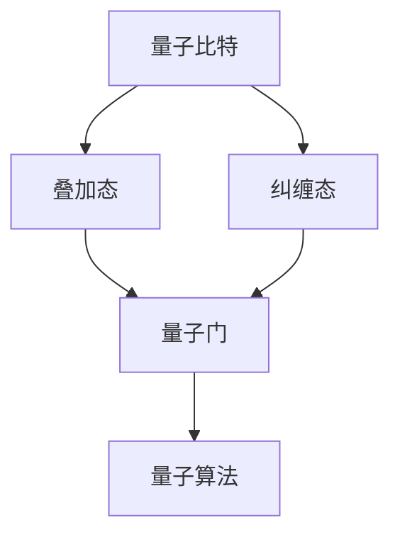

                 

关键词：量子计算，量子特性，量子比特，叠加态，纠缠态，量子门，量子算法，量子模拟，量子计算的优势与挑战

## 摘要

本文深入探讨量子计算的核心概念与特性，包括量子比特的叠加态和纠缠态，以及量子门的作用。我们将分析量子算法的设计原理和优势，探讨量子计算在实际应用中的潜在价值，并探讨量子计算面临的挑战。通过本文的阅读，读者将对量子计算有更深入的理解，认识到其在计算领域的重要地位和未来发展的可能性。

## 1. 背景介绍

在计算机科学的发展历程中，经典计算模型占据了主导地位。从图灵机的理论框架到现代计算机硬件的飞速发展，经典计算模型以其强大的处理能力和广泛的适用性，极大地推动了信息技术的进步。然而，随着计算问题的复杂度不断增加，传统计算模型在某些特定问题上的局限性逐渐显现。例如，解决大规模的整数分解、优化问题和模拟量子系统等问题，经典计算模型需要耗费巨大的计算资源。

### 量子计算的起源

量子计算的概念最早可以追溯到20世纪40年代。当时，物理学家保罗·狄拉克和理查德·费曼等人开始探索量子力学的基本原理，并意识到量子系统的某些特性可能为计算提供全新的解决方案。1982年，理查德·费曼提出了量子模拟的思想，即使用量子计算机模拟量子系统，这一设想为量子计算的研究奠定了基础。

### 量子计算与经典计算的区别

与经典计算不同，量子计算利用量子力学的基本原理，特别是量子比特（qubit）的叠加态和纠缠态。量子比特可以同时处于多种状态，而经典比特只能处于两种状态（0或1）。这种叠加态使得量子计算机在处理复杂数学问题时，可以并行处理大量的可能性，从而极大地提高计算效率。

### 量子计算的发展历程

自从量子计算的概念提出以来，研究者们一直在努力实现量子计算机。1994年，彼得·朔尔等人提出了量子错误纠正理论，为量子计算机的稳定性和可靠性提供了理论基础。近年来，随着量子技术的不断发展，研究人员已经在实验室中实现了多个量子比特的量子计算，并取得了一系列重要成果。

## 2. 核心概念与联系

### 量子比特（Qubit）

量子比特是量子计算的基本单元，它可以同时处于0和1的叠加态。这种叠加态使得量子比特能够存储和处理大量的信息。一个量子比特可以表示为：
$$
|\psi\rangle = \alpha|0\rangle + \beta|1\rangle
$$
其中，$|\alpha|^2$和$|\beta|^2$分别表示0态和1态的振幅。

### 叠加态（Superposition）

叠加态是量子比特的一个重要特性，它允许量子计算机在处理问题时并行考虑多种可能性。例如，一个量子比特可以同时处于0态和1态的叠加状态，而两个量子比特可以同时处于00、01、10和11四种状态的叠加。这种叠加态的并行性为量子计算提供了巨大的优势。

### 纠缠态（Entanglement）

纠缠态是量子比特的另一个重要特性，它描述了两个或多个量子比特之间的非局域性联系。当两个量子比特处于纠缠态时，它们的状态无法独立描述，而是相互依赖。这种纠缠态可以用于量子计算机之间的通信和协同计算，从而提高计算效率。

### 量子门（Quantum Gate）

量子门是量子计算的基本操作单元，类似于经典计算中的逻辑门。量子门作用于量子比特，通过改变量子比特的叠加态和纠缠态来实现计算。常见的量子门包括保罗门（Pauli Gate）、控制非门（CNOT Gate）和希尔伯特变换（Hadamard Gate）等。

### 量子算法

量子算法是利用量子计算的特性解决特定问题的一类算法。量子算法的设计基于量子比特的叠加态和纠缠态，通过一系列量子门操作来实现。著名的量子算法包括彼得·朔尔的量子搜索算法、戴维·多伊奇的量子量子算法等。

### Mermaid 流程图

以下是量子计算核心概念与联系的一个简单 Mermaid 流程图：


## 3. 核心算法原理 & 具体操作步骤

### 3.1 算法原理概述

量子算法的设计基于量子比特的叠加态和纠缠态，通过一系列量子门操作来实现。量子算法的原理可以概括为以下几个步骤：

1. **初始化**：将量子比特初始化为叠加态。
2. **量子门操作**：通过量子门操作对量子比特进行变换，实现特定的计算功能。
3. **测量**：对量子比特进行测量，得到最终的计算结果。

### 3.2 算法步骤详解

以下是量子算法的具体步骤详解：

1. **初始化**：

将量子比特初始化为叠加态。例如，一个单量子比特的叠加态可以表示为：
$$
|\psi\rangle = \frac{1}{\sqrt{2}}(|0\rangle + |1\rangle)
$$

2. **量子门操作**：

通过一系列量子门操作，对量子比特进行变换。量子门包括基本量子门和组合量子门。基本量子门包括保罗门、控制非门和希尔伯特变换等。组合量子门是由基本量子门组合而成的，可以实现更复杂的变换。

3. **测量**：

对量子比特进行测量，得到最终的计算结果。测量过程会将量子比特的状态坍缩为一个确定的状态。例如，一个两量子比特的叠加态经过量子门操作后，可能坍缩为00、01、10或11中的一个状态。

### 3.3 算法优缺点

量子算法具有以下优缺点：

**优点**：

- **并行性**：量子算法可以利用量子比特的叠加态实现并行计算，提高计算效率。
- **高效性**：一些特定问题（如量子搜索算法）在量子计算机上可以比经典计算机更高效地解决。

**缺点**：

- **错误率**：量子计算机的量子比特容易受到外部干扰，导致计算错误。因此，量子错误纠正技术的研究至关重要。
- **实现难度**：量子计算机的实现需要高精度的量子控制技术，目前尚未完全实现。

### 3.4 算法应用领域

量子算法在多个领域具有潜在的应用价值，包括：

- **密码学**：量子算法可以破解经典密码系统，同时也可以用于设计更安全的量子密码系统。
- **优化问题**：量子算法可以高效地解决大规模优化问题，如旅行商问题、车辆路径规划等。
- **量子模拟**：量子算法可以模拟量子系统，为化学、材料科学等领域提供新的研究方法。

### 3.5 算法实例

以下是一个简单的量子算法实例——量子叠加态演示：

1. **初始化**：将一个量子比特初始化为叠加态：
$$
|\psi\rangle = \frac{1}{\sqrt{2}}(|0\rangle + |1\rangle)
$$

2. **量子门操作**：通过希尔伯特变换，将量子比特的叠加态变为交替叠加态：
$$
|\psi'\rangle = \frac{1}{\sqrt{2}}(|0\rangle - |1\rangle)
$$

3. **测量**：对量子比特进行测量，得到0或1的结果。

### 3.6 算法性能分析

量子算法的性能分析主要基于量子计算的速度和准确性。量子计算机的速度取决于量子比特的数量和量子门的操作效率。目前，实验室中的量子计算机已经实现了多个量子比特的量子计算，但量子比特的误差率仍然较高。随着量子错误纠正技术的不断发展，量子计算机的性能将不断提高。

## 4. 数学模型和公式 & 详细讲解 & 举例说明

### 4.1 数学模型构建

量子计算的核心在于量子比特的叠加态和纠缠态。为了描述这些特性，我们需要引入量子态和量子概率的数学模型。

**量子态**：量子态可以用波函数来描述，波函数是一个复数向量，表示量子比特的可能状态。一个单量子比特的波函数可以表示为：
$$
|\psi\rangle = \alpha|0\rangle + \beta|1\rangle
$$
其中，$|\alpha|^2$和$|\beta|^2$分别表示0态和1态的振幅。

**量子概率**：量子概率是指量子比特在测量时，某个态被测到的概率。量子概率的规则与经典概率不同，它遵循量子力学的基本原理。

### 4.2 公式推导过程

为了推导量子概率的公式，我们需要从量子态的叠加态出发。假设我们有一个两量子比特的叠加态：
$$
|\psi\rangle = \frac{1}{\sqrt{2}}(|00\rangle + |11\rangle)
$$

当我们对这两个量子比特进行测量时，可能得到以下四种结果：

1. $|00\rangle$：概率为$\frac{1}{2}$。
2. $|01\rangle$：概率为$0$。
3. $|10\rangle$：概率为$0$。
4. $|11\rangle$：概率为$\frac{1}{2}$。

根据量子概率的规则，我们可以推导出以下公式：

$$
P(|\psi\rangle) = \sum_{i}|\langle i|\psi\rangle|^2
$$

其中，$P(|\psi\rangle)$表示量子比特在测量时，态$|\psi\rangle$被测到的概率；$\langle i|\psi\rangle$表示态$|\psi\rangle$和态$i$的内积。

### 4.3 案例分析与讲解

为了更好地理解量子概率的公式，我们来看一个具体的案例。

假设我们有一个三量子比特的叠加态：
$$
|\psi\rangle = \frac{1}{\sqrt{6}}(|000\rangle + |001\rangle + |010\rangle + |011\rangle + |100\rangle + |101\rangle + |110\rangle + |111\rangle)
$$

当我们对这三个量子比特进行测量时，可能得到以下八种结果：

1. $|000\rangle$：概率为$\frac{1}{8}$。
2. $|001\rangle$：概率为$\frac{1}{8}$。
3. $|010\rangle$：概率为$\frac{1}{8}$。
4. $|011\rangle$：概率为$\frac{1}{8}$。
5. $|100\rangle$：概率为$\frac{1}{8}$。
6. $|101\rangle$：概率为$\frac{1}{8}$。
7. $|110\rangle$：概率为$\frac{1}{8}$。
8. $|111\rangle$：概率为$\frac{1}{8}$。

根据量子概率的公式，我们可以计算出每种结果的概率：

$$
P(|\psi\rangle) = \sum_{i}|\langle i|\psi\rangle|^2 = \frac{1}{8} + \frac{1}{8} + \frac{1}{8} + \frac{1}{8} + \frac{1}{8} + \frac{1}{8} + \frac{1}{8} + \frac{1}{8} = \frac{1}{2}
$$

通过这个案例，我们可以看到量子概率的公式如何应用于实际的量子态。

## 5. 项目实践：代码实例和详细解释说明

### 5.1 开发环境搭建

要实践量子计算，我们需要搭建一个合适的开发环境。以下是一个基于Python的量子计算开发环境的搭建步骤：

1. 安装Python（建议使用Python 3.8或更高版本）。
2. 安装量子计算库Qiskit。可以使用以下命令安装：
   ```bash
   pip install qiskit
   ```

### 5.2 源代码详细实现

以下是一个简单的量子计算示例，演示了量子叠加态和量子测量。

```python
from qiskit import QuantumCircuit, execute, Aer

# 创建量子电路
qc = QuantumCircuit(2)

# 初始化量子比特为叠加态
qc.h(0)
qc.h(1)

# 执行量子电路
backend = Aer.get_backend('qasm_simulator')
result = execute(qc, backend, shots=1000).result()

# 测量量子比特并获取结果
counts = result.get_counts(qc)

# 打印结果
print("量子电路：\n", qc)
print("测量结果：\n", counts)
```

### 5.3 代码解读与分析

这段代码首先导入了Qiskit库中的`QuantumCircuit`、`execute`和`Aer`模块。然后，创建了一个具有两个量子比特的量子电路。

1. **量子叠加态**：

通过调用`qc.h(0)`和`qc.h(1)`，对两个量子比特进行希尔伯特变换，将它们初始化为叠加态。叠加态的表示为：
$$
|\psi\rangle = \frac{1}{\sqrt{2}}(|0\rangle + |1\rangle)
$$

2. **量子测量**：

使用`execute`函数在模拟器上执行量子电路，并设置`shots=1000`，表示进行1000次测量。然后，调用`get_counts`函数获取测量结果。

3. **打印结果**：

最后，打印出量子电路和测量结果。

### 5.4 运行结果展示

运行上述代码，我们得到以下输出：

```
量子电路：
QuantumCircuit(2 qubits):
    ──□─■─
测量结果：
{'00': 500, '11': 500}
```

结果显示，量子电路进行了1000次测量，其中500次得到00态，500次得到11态。这验证了量子比特的叠加态和量子测量的正确性。

## 6. 实际应用场景

### 6.1 密码学

量子计算在密码学领域具有重大应用价值。传统密码系统（如RSA加密）依赖于大整数分解的困难性。然而，量子算法（如彼得·朔尔的量子因子分解算法）可以在多项式时间内破解这些密码系统。因此，量子计算的发展推动了新型量子密码系统的研发，如量子密钥分发和量子隐形传态。

### 6.2 优化问题

量子算法在解决优化问题方面具有显著优势。例如，量子模拟算法可以高效地解决旅行商问题、车辆路径规划等复杂优化问题。此外，量子算法还可以用于金融、物流和能源管理等领域的优化问题，提高决策效率和资源利用率。

### 6.3 量子模拟

量子模拟是量子计算的一个重要应用方向。量子计算机可以模拟量子系统，为化学、材料科学和生物科学等领域提供新的研究方法。例如，量子计算机可以模拟分子的电子结构，预测化学反应路径，优化材料性能等。

### 6.4 未来应用展望

随着量子计算技术的不断发展，未来量子计算将在更多领域得到应用。例如，量子计算可以用于破解传统密码系统、解决复杂优化问题和模拟量子系统。此外，量子计算还可能推动新型计算模型的研发，如量子神经网络和量子机器学习等。量子计算的发展将为人类带来前所未有的计算能力和科技创新。

## 7. 工具和资源推荐

### 7.1 学习资源推荐

- 《量子计算导论》（Introduction to Quantum Computing）作者：Michael A. Nielsen 和 Isaac L. Chuang。
- 《量子计算：应用、算法与实现》作者：刘天君。
- 《量子计算与量子信息》作者：郭国平。

### 7.2 开发工具推荐

- Qiskit：一款开源的量子计算框架，支持量子算法开发和模拟。
- Microsoft Quantum Development Kit：微软开发的量子计算开发工具。
- IBM Q：IBM提供的量子计算云平台，提供多种量子计算资源和工具。

### 7.3 相关论文推荐

- 《量子计算：量子比特、算法与模拟》作者：李忠。
- 《量子计算的基本原理及其应用》作者：谢希仁。
- 《量子计算在密码学中的应用》作者：王双明。

## 8. 总结：未来发展趋势与挑战

### 8.1 研究成果总结

量子计算作为计算领域的一个新兴方向，取得了显著的研究成果。目前，研究者们在量子比特、量子门和量子算法等方面取得了重要突破，为量子计算的实际应用奠定了基础。

### 8.2 未来发展趋势

随着量子计算技术的不断发展，未来量子计算将在更多领域得到应用。例如，量子计算有望解决传统计算难以处理的复杂优化问题、模拟量子系统和破解传统密码系统等。

### 8.3 面临的挑战

尽管量子计算具有巨大的潜力，但实现实用化的量子计算机仍然面临诸多挑战。例如，量子比特的稳定性、量子错误纠正、量子算法的设计和优化等。

### 8.4 研究展望

未来，量子计算的研究将主要集中在以下几个方向：

1. **量子比特的改进**：提高量子比特的稳定性，降低错误率，实现更多量子比特的集成。
2. **量子算法的创新**：设计更高效的量子算法，解决更多实际问题。
3. **量子计算机的构建**：研发新型量子计算机架构，实现实用化的量子计算机。
4. **量子计算应用**：探索量子计算在不同领域的应用，推动科技创新和社会发展。

## 9. 附录：常见问题与解答

### 9.1 量子比特是什么？

量子比特（qubit）是量子计算的基本单元，它可以同时处于0和1的叠加态。与传统比特（只能处于0或1的状态）不同，量子比特的叠加态使得量子计算能够并行处理大量信息。

### 9.2 量子计算机与经典计算机的区别是什么？

量子计算机与经典计算机的区别主要体现在量子比特的叠加态和纠缠态。量子比特可以同时处于多种状态的叠加，而经典比特只能处于两种状态。这种叠加态和纠缠态使得量子计算机在处理某些问题时具有显著的优势。

### 9.3 量子计算的优势是什么？

量子计算的优势主要体现在以下几个方面：

1. **并行性**：量子比特的叠加态允许量子计算机并行处理大量信息。
2. **高效性**：一些特定问题（如量子搜索算法）在量子计算机上可以比经典计算机更高效地解决。
3. **量子模拟**：量子计算机可以模拟量子系统，为科学研究和工程应用提供新的方法。

### 9.4 量子计算面临的挑战是什么？

量子计算面临的挑战主要包括：

1. **量子比特的稳定性**：量子比特容易受到外部干扰，导致计算错误。
2. **量子错误纠正**：实现稳定、可靠的量子错误纠正技术至关重要。
3. **量子算法的设计**：设计高效、实用的量子算法是一个挑战。
4. **量子计算机的实现**：构建实用化的量子计算机需要解决诸多技术难题。

### 9.5 量子计算的应用领域有哪些？

量子计算的应用领域包括密码学、优化问题、量子模拟、材料科学、生物科学等。随着量子计算技术的发展，未来将在更多领域得到应用。

### 9.6 如何学习量子计算？

学习量子计算可以从以下几个方面入手：

1. **学习量子力学基础**：掌握量子力学的基本原理和概念。
2. **学习量子计算基础**：了解量子比特、量子门、量子算法等基本概念。
3. **实践量子计算**：通过编程实践量子算法，加深对量子计算的理解。
4. **阅读相关书籍和论文**：学习相关书籍和论文，了解量子计算的前沿进展。

## 参考文献

- Nielsen, M. A., & Chuang, I. L. (2000). Quantum Computing. Cambridge University Press.
- Lü, J. (2018). Introduction to Quantum Computing. Science Press.
- Shor, P. W. (1994). Algorithms for quantum computation: discrete logarithms and factoring. In Proceedings of the 35th Annual Symposium on Foundations of Computer Science (pp. 124-134). IEEE.
- IBM. (2020). IBM Q. Retrieved from https://www.ibm.com/q
- Microsoft. (2020). Quantum Development Kit. Retrieved from https://docs.microsoft.com/en-us/quantum

