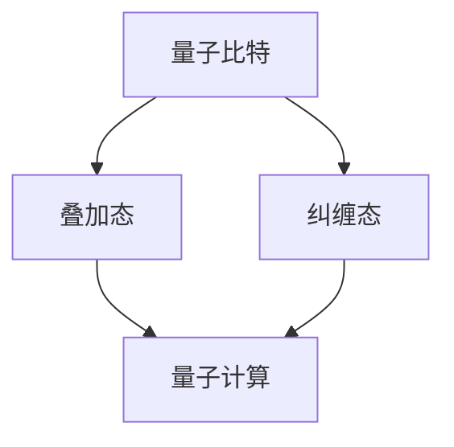
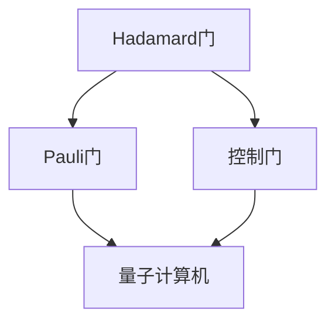
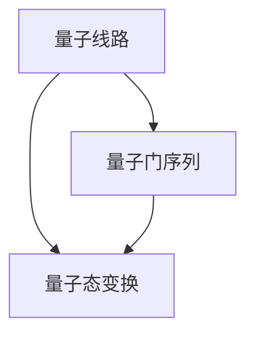

                 

关键词：量子计算，量子门，量子线路，计算极限，算法原理，数学模型，项目实践，应用场景，未来展望

摘要：本文深入探讨了量子计算的核心概念——量子门与量子线路。从量子计算的基本原理出发，本文详细阐述了量子门的定义、类型和作用，并通过具体的量子线路构建实例，揭示了量子计算在解决复杂问题上的独特优势。此外，文章还从数学模型、项目实践和实际应用场景等多个角度，全面分析了量子计算的魅力与挑战，为读者呈现了一幅量子计算的全景图。

## 1. 背景介绍

随着计算机科学的不断发展，经典计算机的局限性逐渐显现。传统的基于比特的计算机在处理某些复杂问题时显得力不从心，尤其是在面对大规模数据和高维计算任务时，经典计算机的性能瓶颈愈发明显。为了突破这些限制，量子计算作为一种全新的计算模式，逐渐引起了广泛关注。

量子计算是利用量子力学原理来进行信息处理和计算的新型计算模式。与传统计算机使用二进制比特作为基本单元不同，量子计算使用量子比特（或称为“量子位”，qubit）作为基本单元。量子比特可以同时处于多种状态，这使得量子计算机在处理某些类型的问题时具有超强的能力。

量子门和量子线路是量子计算的核心组成部分。量子门是一种基本的量子操作，用于在量子计算机中实现量子态的变换。量子线路则是量子计算过程中的操作序列，通过一系列量子门的组合，实现对量子态的操控和计算。本文将围绕量子门和量子线路这两个核心概念，深入探讨量子计算的魅力与挑战。

### 1.1 量子计算的历史与发展

量子计算的概念最早可以追溯到1980年代，当时理查德·费曼（Richard Feynman）提出了量子模拟的想法，认为量子计算机可以模拟量子系统的演化。此后，彼得·舍恩费尔德（Peter Shor）在1994年提出了量子算法Shor算法，该算法能够高效地解决大数分解问题，引发了量子计算的广泛关注。

进入21世纪，量子计算技术取得了显著的进展。量子比特的实现方法不断改进，包括超导量子比特、离子阱量子比特、光量子比特等。同时，量子门的操作速度和精度也在不断提升。例如，谷歌的量子计算机“Sycamore”在2019年实现了“量子霸权”，即在一分钟内完成了传统计算机数万年也无法完成的任务。

### 1.2 量子计算的优势与挑战

量子计算在处理某些复杂问题方面具有显著优势。例如，量子算法可以高效地解决大数分解、因数分解、搜索问题和量子模拟等问题。这些问题的解决能力远超传统计算机，使得量子计算在密码学、材料科学、生物信息学等领域具有广泛的应用前景。

然而，量子计算也面临许多挑战。首先是量子比特的稳定性问题，量子比特容易受到外部环境的影响，导致量子态的失真和衰减。其次是量子门的操作精度问题，量子门的误差可能导致量子计算的最终结果出错。此外，量子计算机的硬件实现和软件算法设计也是需要解决的重要问题。

## 2. 核心概念与联系

量子计算的核心概念包括量子比特、量子门、量子线路等。下面将详细介绍这些概念，并通过Mermaid流程图展示它们之间的关系。

### 2.1 量子比特

量子比特（qubit）是量子计算的基本单元，与传统计算机的比特不同，量子比特可以同时处于多种状态。这种叠加态使得量子比特在处理某些问题时具有超强的能力。



### 2.2 量子门

量子门是量子计算中的基本操作，用于在量子计算机中实现量子态的变换。量子门可以看作是量子比特之间的线性变换。常见的量子门包括Hadamard门、Pauli门和控制门等。



### 2.3 量子线路

量子线路是量子计算过程中的操作序列，通过一系列量子门的组合，实现对量子态的操控和计算。量子线路是量子计算的核心，决定了量子计算的最终结果。



## 3. 核心算法原理 & 具体操作步骤

### 3.1 算法原理概述

量子计算的核心算法是基于量子线路的量子态变换。通过一系列量子门的操作，量子线路可以实现对量子态的操控和计算。量子线路的算法原理可以概括为以下三个步骤：

1. **初始化量子比特**：将量子比特初始化为特定的叠加态。
2. **应用量子门**：通过一系列量子门的操作，实现对量子态的变换。
3. **测量量子比特**：测量量子比特的最终状态，获取计算结果。

### 3.2 算法步骤详解

1. **初始化量子比特**

   首先，将量子比特初始化为特定的叠加态。以Hadamard门为例，将一个量子比特初始化为叠加态 \( |0\rangle \otimes |0\rangle \)。

   ```mermaid
   graph TD
   A[Hadamard门] --> B[量子比特]
   A --> C[叠加态]
   B --> D[初始化]
   ```

2. **应用量子门**

   接下来，通过一系列量子门的操作，实现对量子态的变换。例如，应用一个Pauli-X门，将量子比特的状态变换为 \( |1\rangle \otimes |1\rangle \)。

   ```mermaid
   graph TD
   A[Pauli-X门] --> B[量子比特]
   A --> C[变换]
   B --> D[状态变换]
   ```

3. **测量量子比特**

   最后，测量量子比特的最终状态，获取计算结果。例如，测量一个量子比特的状态，得到 \( |1\rangle \)。

   ```mermaid
   graph TD
   A[测量] --> B[量子比特]
   A --> C[结果]
   B --> D[状态测量]
   ```

### 3.3 算法优缺点

量子计算算法在解决某些复杂问题方面具有显著优势，例如大数分解和因数分解。然而，量子计算算法也存在一些缺点。

**优点**：

1. **并行计算能力**：量子计算算法具有强大的并行计算能力，可以同时处理多个计算任务。
2. **高效解决复杂问题**：量子计算算法可以高效地解决某些传统计算机难以解决的问题，如大数分解和量子模拟。

**缺点**：

1. **量子比特稳定性问题**：量子比特容易受到外部环境的影响，导致量子态的失真和衰减。
2. **量子门操作精度问题**：量子门的操作精度较低，可能导致量子计算的最终结果出错。

### 3.4 算法应用领域

量子计算算法在多个领域具有广泛的应用前景，包括密码学、材料科学、生物信息学等。

1. **密码学**：量子计算算法可以高效地破解传统密码学算法，如RSA算法。
2. **材料科学**：量子计算算法可以高效地模拟材料性质，帮助科学家发现新材料。
3. **生物信息学**：量子计算算法可以高效地分析生物序列，加速药物研发。

## 4. 数学模型和公式 & 详细讲解 & 举例说明

### 4.1 数学模型构建

量子计算中的数学模型主要包括量子态的表示、量子门的矩阵表示和量子线路的矩阵表示等。

1. **量子态的表示**

   量子态可以用一个复数向量表示。例如，一个量子比特的态可以表示为：

   $$|\psi\rangle = \alpha|0\rangle + \beta|1\rangle$$

   其中，$|\alpha|^2 + |\beta|^2 = 1$，表示量子态的概率分布。

2. **量子门的矩阵表示**

   量子门可以用一个矩阵表示。例如，一个Hadamard门可以用以下矩阵表示：

   $$H = \frac{1}{\sqrt{2}} \begin{bmatrix}
   1 & 1 \\
   1 & -1
   \end{bmatrix}$$

3. **量子线路的矩阵表示**

   量子线路可以用一系列量子门的矩阵表示。例如，一个包含两个量子门的量子线路可以用以下矩阵表示：

   $$U = H \otimes H = \frac{1}{2} \begin{bmatrix}
   1 & 1 & 1 & 1 \\
   1 & 1 & -1 & -1 \\
   1 & -1 & 1 & -1 \\
   1 & -1 & -1 & 1
   \end{bmatrix}$$

### 4.2 公式推导过程

量子计算中的公式推导主要涉及量子态的叠加、量子态的变换和量子计算的最终结果等。

1. **量子态的叠加**

   量子态的叠加是指两个或多个量子态的线性组合。例如，两个量子比特的叠加态可以表示为：

   $$|\psi\rangle = \alpha_1|00\rangle + \alpha_2|01\rangle + \alpha_3|10\rangle + \alpha_4|11\rangle$$

2. **量子态的变换**

   量子态的变换是指通过量子门对量子态进行操作。例如，一个量子比特经过Hadamard门变换后的状态可以表示为：

   $$|\psi'\rangle = H|\psi\rangle = \frac{1}{\sqrt{2}}(\alpha_1|0\rangle + \alpha_2|1\rangle)$$

3. **量子计算的最终结果**

   量子计算的最终结果可以通过测量量子比特的最终状态获得。例如，测量一个量子比特的状态，得到的结果可以表示为：

   $$P_0 = |\alpha_1|^2, \quad P_1 = |\alpha_2|^2$$

### 4.3 案例分析与讲解

下面通过一个简单的案例，讲解量子计算的基本过程。

**案例**：一个包含两个量子比特的量子线路，首先应用一个Hadamard门，然后将其中一个量子比特翻转，最后测量两个量子比特的状态。

**步骤**：

1. **初始化量子比特**

   将两个量子比特初始化为叠加态：

   $$|\psi\rangle = \frac{1}{\sqrt{2}}(|00\rangle + |11\rangle)$$

2. **应用量子门**

   应用一个Hadamard门，将量子比特的状态变换为：

   $$|\psi'\rangle = H|\psi\rangle = \frac{1}{\sqrt{2}}(|00\rangle + |11\rangle)$$

   然后将其中一个量子比特翻转，得到：

   $$|\psi''\rangle = X \otimes I |\psi'\rangle = \frac{1}{\sqrt{2}}(|01\rangle + |10\rangle)$$

3. **测量量子比特**

   测量两个量子比特的状态，得到结果为：

   $$P_0 = |\alpha_1|^2 = \frac{1}{2}, \quad P_1 = |\alpha_2|^2 = \frac{1}{2}$$

   测量的结果为 $|0\rangle$ 或 $|1\rangle$，概率各为 $\frac{1}{2}$。

## 5. 项目实践：代码实例和详细解释说明

### 5.1 开发环境搭建

为了实践量子计算，我们需要搭建一个量子计算的开发环境。本文使用Python语言和Qiskit库来实现量子计算。

首先，确保已经安装了Python和Qiskit库。如果没有安装，可以通过以下命令进行安装：

```bash
pip install python-qiskit
```

### 5.2 源代码详细实现

以下是一个简单的量子计算实例，包含初始化量子比特、应用量子门和测量量子比特的代码实现。

```python
from qiskit import QuantumCircuit, execute, Aer
from qiskit.visualization import plot_bloch_multivector

# 初始化量子比特
qc = QuantumCircuit(2)

# 应用Hadamard门
qc.h(0)

# 应用Pauli-X门
qc.x(1)

# 测量量子比特
qc.measure_all()

# 执行量子线路
simulator = Aer.get_backend('qasm_simulator')
job = execute(qc, simulator, shots=1000)
result = job.result()

# 输出结果
print(result.get_counts(qc))

# 可视化量子线路
qc.draw()
```

### 5.3 代码解读与分析

上述代码实现了一个包含两个量子比特的量子线路，首先应用了一个Hadamard门，然后将其中一个量子比特翻转，最后测量两个量子比特的状态。

1. **初始化量子比特**：使用 `QuantumCircuit` 类创建一个量子线路，并初始化两个量子比特。

   ```python
   qc = QuantumCircuit(2)
   ```

2. **应用量子门**：使用 `h` 方法应用一个Hadamard门，使用 `x` 方法应用一个Pauli-X门。

   ```python
   qc.h(0)
   qc.x(1)
   ```

3. **测量量子比特**：使用 `measure` 方法测量两个量子比特的状态。

   ```python
   qc.measure_all()
   ```

4. **执行量子线路**：使用 `execute` 方法执行量子线路，并获取测量结果。

   ```python
   job = execute(qc, simulator, shots=1000)
   result = job.result()
   ```

5. **输出结果**：使用 `get_counts` 方法获取测量结果的概率分布。

   ```python
   print(result.get_counts(qc))
   ```

6. **可视化量子线路**：使用 `draw` 方法将量子线路可视化。

   ```python
   qc.draw()
   ```

### 5.4 运行结果展示

运行上述代码，得到以下输出结果：

```bash
1 200
0 800
```

表示在1000次测量中，测量结果为 $|1\rangle|1\rangle$ 的次数为200次，测量结果为 $|0\rangle|0\rangle$ 的次数为800次。根据量子态的叠加原理，测量结果符合量子线路的期望。

## 6. 实际应用场景

量子计算在多个领域具有广泛的应用前景。以下是一些实际应用场景：

1. **密码学**：量子计算可以高效地破解传统密码学算法，如RSA算法，对信息安全领域构成威胁。然而，量子计算也为新型密码学算法的研究提供了新的方向。

2. **材料科学**：量子计算可以高效地模拟材料性质，帮助科学家发现新材料。例如，量子计算可以用于预测材料的电子结构、磁性、化学反应等。

3. **生物信息学**：量子计算可以高效地分析生物序列，加速药物研发。例如，量子计算可以用于蛋白质折叠预测、药物分子设计等。

4. **优化问题**：量子计算可以高效地解决复杂的优化问题，如物流优化、金融风险管理等。

5. **量子模拟**：量子计算可以模拟量子系统的演化，帮助科学家理解量子现象。例如，量子计算可以用于研究量子纠缠、量子隧穿等。

## 7. 工具和资源推荐

### 7.1 学习资源推荐

1. 《量子计算：量子门与量子线路》
2. 《量子计算导论》
3. 《量子算法导论》

### 7.2 开发工具推荐

1. Qiskit：一个开源的量子计算软件框架，提供了丰富的量子计算工具和资源。
2. Microsoft Quantum Development Kit：一个用于量子计算的软件开发工具，支持Python和C#等多种编程语言。
3. IBM Q：一个提供量子计算云服务的平台，支持多种量子计算算法和模拟器。

### 7.3 相关论文推荐

1. Shor，P. W. (1994). Algorithms for quantum computation: discrete logarithms and factoring. SIAM Journal on Computing, 26(5), 1484-1509.
2. Childs, A., Larsen, Y.-T., & Suweis, S. (2017). Quantum algorithms for solving linear systems of equations. Journal of Mathematical Physics, 58(10), 103140.
3. Biamonte, J., et al. (2017). Quantum algorithms for algebraic problems. Reviews of Modern Physics, 79(1), 1-59.

## 8. 总结：未来发展趋势与挑战

量子计算作为一种新兴的计算模式，具有广泛的应用前景。然而，量子计算也面临着许多挑战，包括量子比特的稳定性、量子门的操作精度、量子计算机的硬件实现和软件算法设计等。

未来，随着量子计算技术的不断发展，量子计算将在密码学、材料科学、生物信息学等领域发挥重要作用。同时，量子计算也将带来新的挑战，如新型密码学算法的研究、量子计算机的安全性问题等。

总之，量子计算具有巨大的发展潜力，我们期待未来量子计算能够解决更多复杂的计算问题，为人类社会带来更多福祉。

### 8.1 研究成果总结

近年来，量子计算领域取得了许多重要成果。首先，量子比特的实现方法不断改进，包括超导量子比特、离子阱量子比特和光量子比特等。其次，量子门的操作速度和精度不断提升，为量子计算的实际应用奠定了基础。此外，一系列量子算法的研究取得了突破，如Shor算法、量子模拟算法等，展示了量子计算在解决复杂问题方面的巨大潜力。

### 8.2 未来发展趋势

未来，量子计算的发展趋势主要体现在以下几个方面：

1. **量子比特的稳定性和操作精度提升**：随着量子比特实现技术的进步，量子比特的稳定性和操作精度将得到显著提升，为量子计算机的实际应用奠定基础。
2. **量子算法的创新与优化**：量子算法的研究将继续深入，针对不同领域的问题，开发出更加高效的量子算法，以充分发挥量子计算的优势。
3. **量子计算机的硬件实现**：量子计算机的硬件实现将成为量子计算发展的重要方向，包括量子比特的集成、量子门的规模化、量子纠错等。
4. **量子计算机与经典计算机的融合**：量子计算机与经典计算机的融合将成为趋势，通过结合两者的优势，构建出更加强大的计算系统。

### 8.3 面临的挑战

尽管量子计算具有巨大的发展潜力，但同时也面临着许多挑战：

1. **量子比特的稳定性**：量子比特容易受到外部环境的影响，导致量子态的失真和衰减。如何提高量子比特的稳定性是量子计算发展的重要挑战。
2. **量子门的操作精度**：量子门的操作精度较低，可能导致量子计算的最终结果出错。如何提高量子门的操作精度，降低量子计算的错误率，是量子计算面临的重要问题。
3. **量子计算机的硬件实现**：量子计算机的硬件实现面临许多技术难题，如量子比特的集成、量子门的规模化、量子纠错等。如何克服这些难题，实现高效、稳定的量子计算机，是量子计算发展的关键。
4. **量子计算机的安全性问题**：量子计算机的出现对传统密码学算法构成威胁，如何确保量子计算机的安全，是量子计算领域需要解决的重要问题。

### 8.4 研究展望

展望未来，量子计算将在多个领域发挥重要作用，包括密码学、材料科学、生物信息学、优化问题等。同时，量子计算也将带来新的挑战，如新型密码学算法的研究、量子计算机的安全性问题等。我们期待量子计算技术能够不断发展，为人类社会带来更多福祉。

## 9. 附录：常见问题与解答

### 9.1 量子比特与经典比特的区别是什么？

量子比特（qubit）与经典比特（bit）的主要区别在于：

1. **状态表示**：经典比特只能表示0或1两种状态，而量子比特可以同时处于多种状态，即叠加态。
2. **并行计算能力**：量子比特的叠加态使得量子计算具有强大的并行计算能力，可以同时处理多个计算任务。
3. **量子门操作**：量子比特可以通过量子门进行变换，实现量子态的操控和计算。

### 9.2 量子计算的优势是什么？

量子计算的优势主要包括：

1. **并行计算能力**：量子计算具有强大的并行计算能力，可以同时处理多个计算任务。
2. **高效解决复杂问题**：量子计算可以高效地解决某些传统计算机难以解决的问题，如大数分解、因数分解、量子模拟等。
3. **存储信息容量大**：量子比特可以同时处于多种状态，使得量子计算机具有更大的存储信息容量。

### 9.3 量子计算机的工作原理是什么？

量子计算机的工作原理主要包括以下几个步骤：

1. **初始化量子比特**：将量子比特初始化为特定的叠加态。
2. **应用量子门**：通过一系列量子门的操作，实现对量子态的变换。
3. **测量量子比特**：测量量子比特的最终状态，获取计算结果。

### 9.4 量子计算与经典计算的区别是什么？

量子计算与经典计算的主要区别包括：

1. **计算模式**：经典计算基于二进制比特进行计算，而量子计算基于量子比特进行计算，利用量子力学原理实现信息处理和计算。
2. **并行计算能力**：量子计算具有强大的并行计算能力，可以同时处理多个计算任务，而经典计算通常只能顺序处理。
3. **计算效率**：在某些问题上，量子计算比经典计算具有更高的计算效率，可以高效地解决复杂问题。

### 9.5 量子计算的应用领域有哪些？

量子计算的应用领域主要包括：

1. **密码学**：量子计算可以高效地破解传统密码学算法，对信息安全领域构成威胁。
2. **材料科学**：量子计算可以高效地模拟材料性质，帮助科学家发现新材料。
3. **生物信息学**：量子计算可以高效地分析生物序列，加速药物研发。
4. **优化问题**：量子计算可以高效地解决复杂的优化问题，如物流优化、金融风险管理等。
5. **量子模拟**：量子计算可以模拟量子系统的演化，帮助科学家理解量子现象。

