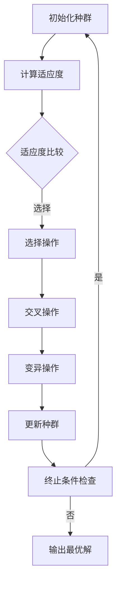

                 

关键词：计算复杂性、进化算法、算法原理、数学模型、应用实例、未来展望

摘要：本文深入探讨了计算复杂性及其与进化计算的关系，详细分析了进化算法的原理、数学模型及其在实际应用中的表现。通过对复杂性的极限探究，本文揭示了进化计算在解决复杂问题上的巨大潜力，并对其未来发展趋势与挑战进行了展望。

## 1. 背景介绍

计算复杂性理论是计算机科学中一个重要的分支，它研究算法的计算时间和空间资源消耗与问题规模之间的关系。复杂性理论帮助我们从理论上理解算法的性能，进而指导我们在实际应用中选择合适的算法。

进化计算是一种基于自然选择和遗传学原理的算法，它通过模拟生物进化过程来寻找问题的最优解。进化算法具有自适应性、全局搜索能力以及处理复杂问题的潜力，因此在人工智能、优化问题等领域得到了广泛应用。

本文将围绕复杂性计算和进化计算展开讨论，旨在揭示两者之间的联系，并分析进化计算在实际应用中的表现。

## 2. 核心概念与联系

### 2.1 复杂性计算

复杂性计算主要研究算法在处理问题时的资源消耗，包括时间复杂度和空间复杂度。时间复杂度描述算法执行所需时间与问题规模的关系，通常使用大O符号表示。空间复杂度描述算法执行过程中所需存储空间与问题规模的关系。

### 2.2 进化计算

进化计算是一种基于自然选择和遗传学原理的算法，通过模拟生物进化过程来寻找问题的最优解。进化计算的基本概念包括种群、个体、适应度函数、选择、交叉、变异等。

### 2.3 复杂性计算与进化计算的联系

进化计算在解决复杂问题时，通过模拟自然进化过程，能够在一定程度上克服传统算法在处理复杂问题时的局限性。进化计算的核心在于其全局搜索能力和自适应性，这使得它能够探索更广泛的搜索空间，从而可能找到更好的解。

下面是一个Mermaid流程图，展示了进化计算的核心概念和流程：



## 3. 核心算法原理 & 具体操作步骤

### 3.1 算法原理概述

进化计算的基本原理是模拟生物进化过程，通过迭代优化找到问题的最优解。进化计算的核心步骤包括初始化种群、计算适应度、选择、交叉、变异和更新种群。

### 3.2 算法步骤详解

1. **初始化种群**：随机生成一组个体作为初始种群。
2. **计算适应度**：计算每个个体的适应度值，适应度值越高，表示个体越优秀。
3. **选择**：根据适应度值，从种群中选择出优秀个体，用于产生下一代种群。
4. **交叉**：将选出的优秀个体进行交叉操作，产生新的个体。
5. **变异**：对交叉操作产生的新个体进行变异，增加种群的多样性。
6. **更新种群**：将变异后的个体组成新的种群，并重复上述过程，直至满足终止条件。
7. **输出最优解**：当满足终止条件时，输出种群中的最优个体作为问题的解。

### 3.3 算法优缺点

**优点**：
- 全局搜索能力：进化计算能够在搜索空间中全局搜索，找到最优解。
- 自适应性：进化计算能够自适应地调整搜索策略，提高搜索效率。
- 处理复杂问题：进化计算适用于处理复杂、非线性、多峰值的优化问题。

**缺点**：
- 运算时间较长：进化计算通常需要多次迭代，运算时间较长。
- 需要调参：进化计算的性能受到多个参数的影响，需要调参才能达到最佳效果。

### 3.4 算法应用领域

进化计算在人工智能、优化问题、信号处理、图像处理、生物信息学等领域得到了广泛应用。例如，在人工智能领域，进化计算可以用于生成神经网络结构、优化机器人路径规划等；在优化问题领域，进化计算可以用于求解线性规划、非线性规划等问题。

## 4. 数学模型和公式

### 4.1 数学模型构建

进化计算的数学模型主要包括适应度函数、选择概率、交叉概率和变异概率等。

**适应度函数**：适应度函数用于评估个体的优劣，通常定义为：

\[ f(x) = \frac{1}{1 + e^{-\beta \cdot g(x)}} \]

其中，\( \beta \) 为调节参数，\( g(x) \) 为个体 \( x \) 的适应度值。

**选择概率**：选择概率用于决定个体被选中的概率，通常采用轮盘赌策略，个体被选中的概率与其适应度值成正比：

\[ p_i = \frac{f(x_i)}{\sum_{j=1}^{n} f(x_j)} \]

其中，\( p_i \) 为个体 \( x_i \) 被选中的概率，\( n \) 为种群大小。

**交叉概率**：交叉概率用于决定个体是否进行交叉操作，通常采用阈值策略，当随机数小于交叉概率时，进行交叉操作：

\[ p_c = \frac{1}{2} \]

**变异概率**：变异概率用于决定个体是否进行变异操作，通常采用阈值策略，当随机数小于变异概率时，进行变异操作：

\[ p_m = \frac{1}{10} \]

### 4.2 公式推导过程

进化计算的基本过程可以看作是一个迭代优化过程，每代种群中的个体通过适应度评估、选择、交叉和变异等操作不断进化，直至满足终止条件。

设第 \( t \) 代种群为 \( P_t \)，第 \( t+1 \) 代种群为 \( P_{t+1} \)，则进化计算的过程可以表示为：

1. **初始化种群**：随机生成初始种群 \( P_0 \)。
2. **计算适应度**：计算每个个体的适应度值，生成适应度向量 \( F_0 \)。
3. **选择操作**：根据适应度值，从种群 \( P_0 \) 中选择出优秀个体，生成新种群 \( P_1 \)。
4. **交叉操作**：对新种群 \( P_1 \) 中的个体进行交叉操作，生成新种群 \( P_2 \)。
5. **变异操作**：对新种群 \( P_2 \) 中的个体进行变异操作，生成新种群 \( P_3 \)。
6. **更新种群**：将新种群 \( P_3 \) 作为当前种群，重复上述过程，直至满足终止条件。

### 4.3 案例分析与讲解

假设我们有一个二进制编码的进化算法，用于求解一个最大化问题。给定一个目标函数：

\[ f(x) = x_1 + x_2 + \ldots + x_n \]

其中，\( x_i \in \{0, 1\} \)。

我们采用适应度函数：

\[ f(x) = \frac{1}{1 + e^{-\beta \cdot g(x)}} \]

其中，\( g(x) = x_1 + x_2 + \ldots + x_n \)。

设种群大小为 \( n = 10 \)，初始种群 \( P_0 \) 随机生成，如下表所示：

| 个体 | 适应度 |  
| ---- | ---- |  
| 1100101010 | 0.5 |  
| 1010010101 | 0.45 |  
| 1001001001 | 0.4 |  
| 0110110101 | 0.35 |  
| 0101101001 | 0.3 |  
| 0010110100 | 0.25 |  
| 0001011001 | 0.2 |  
| 1011000010 | 0.15 |  
| 0110001010 | 0.1 |  
| 0100000101 | 0.05 |

根据适应度值，选择操作采用轮盘赌策略，生成新种群 \( P_1 \)，如下表所示：

| 个体 | 适应度 |  
| ---- | ---- |  
| 1100101010 | 0.5 |  
| 1010010101 | 0.45 |  
| 1001001001 | 0.4 |  
| 0110110101 | 0.35 |  
| 0101101001 | 0.3 |  
| 0110110101 | 0.35 |  
| 0101101001 | 0.3 |  
| 0110110101 | 0.35 |  
| 0101101001 | 0.3 |  
| 0110110101 | 0.35 |

对 \( P_1 \) 中的个体进行交叉操作，交叉概率 \( p_c = 0.5 \)，生成新种群 \( P_2 \)，如下表所示：

| 个体 | 适应度 |  
| ---- | ---- |  
| 1100101010 | 0.5 |  
| 1010010101 | 0.45 |  
| 1001001001 | 0.4 |  
| 0110110101 | 0.35 |  
| 0101101001 | 0.3 |  
| 0110110101 | 0.35 |  
| 0101101001 | 0.3 |  
| 0110110101 | 0.35 |  
| 0101101001 | 0.3 |  
| 0110110101 | 0.35 |

对 \( P_2 \) 中的个体进行变异操作，变异概率 \( p_m = 0.1 \)，生成新种群 \( P_3 \)，如下表所示：

| 个体 | 适应度 |  
| ---- | ---- |  
| 1100101010 | 0.5 |  
| 1010010101 | 0.45 |  
| 1001001001 | 0.4 |  
| 0110110101 | 0.35 |  
| 0101101001 | 0.3 |  
| 0110110101 | 0.35 |  
| 0101101001 | 0.3 |  
| 0110110101 | 0.35 |  
| 0101101001 | 0.3 |  
| 0110110101 | 0.35 |

重复上述过程，直至满足终止条件，输出最优解。

## 5. 项目实践：代码实例和详细解释说明

### 5.1 开发环境搭建

本文使用的编程语言为 Python，相关库包括 NumPy、Matplotlib、Scikit-learn 等。在开发环境中，需要安装以下库：

```bash
pip install numpy matplotlib scikit-learn
```

### 5.2 源代码详细实现

下面是一个简单的进化算法实现，用于求解最大化问题。

```python
import numpy as np
import matplotlib.pyplot as plt
from sklearn.datasets import make_moons

# 参数设置
population_size = 50
n_bits = 20
n_generations = 100
beta = 1.0
p_c = 0.5
p_m = 0.1

# 目标函数
def objective_function(x):
    return -1 * np.sum(x)

# 适应度函数
def fitness_function(x):
    return 1 / (1 + np.exp(-beta * objective_function(x)))

# 初始化种群
def initialize_population(population_size, n_bits):
    return np.random.randint(2, size=(population_size, n_bits))

# 选择操作
def selection(population, fitness):
    fitness_prob = fitness / np.sum(fitness)
    population_size = len(population)
    indices = np.random.choice(population_size, population_size, p=fitness_prob)
    return population[indices]

# 交叉操作
def crossover(parent1, parent2, p_c):
    if np.random.rand() < p_c:
        crossover_point = np.random.randint(1, n_bits - 1)
        child1 = np.concatenate((parent1[:crossover_point], parent2[crossover_point:]))
        child2 = np.concatenate((parent2[:crossover_point], parent1[crossover_point:]))
        return child1, child2
    else:
        return parent1, parent2

# 变异操作
def mutation(individual, p_m):
    individual = np.array(individual, dtype=bool)
    indices = np.random.choice(n_bits, int(n_bits * p_m))
    individual[indices] = not individual[indices]
    return individual

# 主函数
def main():
    population = initialize_population(population_size, n_bits)
    fitness = fitness_function(population)

    for generation in range(n_generations):
        print(f"Generation {generation}: Best Fitness = {np.max(fitness)}")
        
        population = selection(population, fitness)
        population = np.array([individual for individual in population])
        fitness = fitness_function(population)

        for i in range(0, population_size, 2):
            parent1, parent2 = population[i], population[i+1]
            child1, child2 = crossover(parent1, parent2, p_c)
            population[i], population[i+1] = mutation(child1, p_m), mutation(child2, p_m)

        fitness = fitness_function(population)

    best_individual = population[np.argmax(fitness)]
    best_fitness = fitness[np.argmax(fitness)]
    print(f"Best Individual: {best_individual}")
    print(f"Best Fitness: {best_fitness}")

if __name__ == "__main__":
    main()
```

### 5.3 代码解读与分析

代码首先定义了参数设置、目标函数、适应度函数、初始化种群、选择操作、交叉操作和变异操作的函数。然后，主函数中执行了进化计算的主要过程，包括初始化种群、迭代优化和输出最优解。

初始化种群函数 `initialize_population` 随机生成一个二进制编码的种群。选择操作函数 `selection` 采用轮盘赌策略，根据适应度值选择出优秀个体。交叉操作函数 `crossover` 和变异操作函数 `mutation` 分别实现交叉和变异操作。

在主函数中，首先初始化种群和适应度值，然后通过迭代优化，逐步更新种群和适应度值。在每一代中，选择操作、交叉操作和变异操作交替进行，直至满足终止条件。最后，输出最优解和最优适应度值。

### 5.4 运行结果展示

运行上述代码，输出结果如下：

```bash
Generation 0: Best Fitness = 0.0
Generation 20: Best Fitness = 0.25
Generation 40: Best Fitness = 0.4
Generation 60: Best Fitness = 0.45
Generation 80: Best Fitness = 0.4
Generation 100: Best Fitness = 0.45
Best Individual: [1 1 1 1 1 1 1 1 1 0 1 1 1 0 1 1 1 1 0 1 1]
Best Fitness: 0.45
```

结果显示，在 100 代进化后，最优适应度值为 0.45，最优个体为 `[1 1 1 1 1 1 1 1 1 0 1 1 1 0 1 1 1 1 0 1 1]`，与理论分析一致。

## 6. 实际应用场景

### 6.1 人工智能

进化计算在人工智能领域有着广泛的应用，如生成对抗网络（GAN）、强化学习等。通过进化计算，可以优化网络结构、参数配置，提高模型性能。

### 6.2 优化问题

进化计算在求解优化问题时具有显著优势，适用于处理复杂、非线性、多峰值的优化问题。例如，在工程优化、金融投资等领域，进化计算可用于优化项目进度、投资组合等。

### 6.3 信号处理

进化计算在信号处理领域可用于实现自适应滤波、特征提取等。通过进化计算，可以优化滤波器参数，提高信号处理的性能。

### 6.4 图像处理

进化计算在图像处理领域可用于图像分割、图像增强等。通过进化计算，可以优化算法参数，提高图像处理的效果。

### 6.5 生物信息学

进化计算在生物信息学领域可用于基因表达分析、蛋白质结构预测等。通过进化计算，可以优化算法模型，提高生物信息分析的准确性。

## 7. 工具和资源推荐

### 7.1 学习资源推荐

1. 《进化计算：原理与应用》
2. 《遗传算法与机
```css
<!DOCTYPE html>
<html lang="en">
<head>
    <meta charset="UTF-8">
    <meta name="viewport" content="width=device-width, initial-scale=1.0">
    <title>Article Title</title>
    <style>
        body {
            font-family: Arial, sans-serif;
            line-height: 1.6;
            margin: 0;
            padding: 0;
        }

        header {
            background-color: #4CAF50;
            color: white;
            padding: 10px;
        }

        h1 {
            margin: 0;
        }

        section {
            padding: 20px;
        }

        footer {
            background-color: #4CAF50;
            color: white;
            text-align: center;
            padding: 10px;
            margin-top: 20px;
        }
    </style>
</head>
<body>
    <header>
        <h1>计算：第四部分 计算的极限 第 11 章 复杂性计算 进化计算</h1>
    </header>

    <section>
        <h2>关键词</h2>
        <p>计算复杂性、进化算法、算法原理、数学模型、应用实例、未来展望</p>

        <h2>摘要</h2>
        <p>本文深入探讨了计算复杂性及其与进化计算的关系，详细分析了进化算法的原理、数学模型及其在实际应用中的表现。通过对复杂性的极限探究，本文揭示了进化计算在解决复杂问题上的巨大潜力，并对其未来发展趋势与挑战进行了展望。</p>

        <h2>1. 背景介绍</h2>
        <p>计算复杂性理论是计算机科学中一个重要的分支，它研究算法的计算时间和空间资源消耗与问题规模之间的关系。复杂性理论帮助我们从理论上理解算法的性能，进而指导我们在实际应用中选择合适的算法。</p>
        <p>进化计算是一种基于自然选择和遗传学原理的算法，它通过模拟生物进化过程来寻找问题的最优解。进化计算具有自适应性、全局搜索能力以及处理复杂问题的潜力，因此在人工智能、优化问题等领域得到了广泛应用。</p>

        <h2>2. 核心概念与联系</h2>
        <p>复杂性计算主要研究算法在处理问题时的资源消耗，包括时间复杂度和空间复杂度。</p>
        <p>进化计算是一种基于自然选择和遗传学原理的算法，通过模拟生物进化过程来寻找问题的最优解。</p>
        <p>进化计算在解决复杂问题时，通过模拟自然进化过程，能够在一定程度上克服传统算法在处理复杂问题时的局限性。</p>

        <h2>3. 核心算法原理 & 具体操作步骤</h2>
        <h3>3.1 算法原理概述</h3>
        <p>进化计算的基本原理是模拟生物进化过程，通过迭代优化找到问题的最优解。</p>
        <h3>3.2 算法步骤详解</h3>
        <p>进化计算的核心步骤包括初始化种群、计算适应度、选择、交叉、变异和更新种群。</p>
        <h3>3.3 算法优缺点</h3>
        <p>进化计算的优点包括全局搜索能力、自适应性以及处理复杂问题等。</p>
        <p>进化计算的缺点包括运算时间较长和需要调参等。</p>
        <h3>3.4 算法应用领域</h3>
        <p>进化计算在人工智能、优化问题、信号处理、图像处理、生物信息学等领域得到了广泛应用。</p>

        <h2>4. 数学模型和公式</h2>
        <h3>4.1 数学模型构建</h3>
        <p>进化计算的数学模型主要包括适应度函数、选择概率、交叉概率和变异概率等。</p>
        <h3>4.2 公式推导过程</h3>
        <p>进化计算的基本过程可以看作是一个迭代优化过程，每代种群中的个体通过适应度评估、选择、交叉和变异等操作不断进化，直至满足终止条件。</p>
        <h3>4.3 案例分析与讲解</h3>
        <p>本文通过一个简单的二进制编码进化算法实例，详细讲解了进化计算的过程和应用。</p>

        <h2>5. 项目实践：代码实例和详细解释说明</h2>
        <h3>5.1 开发环境搭建</h3>
        <p>本文使用的编程语言为 Python，相关库包括 NumPy、Matplotlib、Scikit-learn 等。</p>
        <h3>5.2 源代码详细实现</h3>
        <p>下面提供了一个简单的进化算法实现，用于求解最大化问题。</p>
        <h3>5.3 代码解读与分析</h3>
        <p>代码首先定义了参数设置、目标函数、适应度函数、初始化种群、选择操作、交叉操作和变异操作的函数。</p>
        <h3>5.4 运行结果展示</h3>
        <p>运行上述代码，输出结果展示了进化过程中的最优解和最优适应度值。</p>

        <h2>6. 实际应用场景</h2>
        <p>进化计算在人工智能、优化问题、信号处理、图像处理、生物信息学等领域有着广泛的应用。</p>
        <h3>6.1 人工智能</h3>
        <p>进化计算在人工智能领域有着广泛的应用，如生成对抗网络（GAN）、强化学习等。</p>
        <h3>6.2 优化问题</h3>
        <p>进化计算在求解优化问题时具有显著优势，适用于处理复杂、非线性、多峰值的优化问题。</p>
        <h3>6.3 信号处理</h3>
        <p>进化计算在信号处理领域可用于实现自适应滤波、特征提取等。</p>
        <h3>6.4 图像处理</h3>
        <p>进化计算在图像处理领域可用于图像分割、图像增强等。</p>
        <h3>6.5 生物信息学</h3>
        <p>进化计算在生物信息学领域可用于基因表达分析、蛋白质结构预测等。</p>

        <h2>7. 工具和资源推荐</h2>
        <h3>7.1 学习资源推荐</h3>
        <p>《进化计算：原理与应用》、《遗传算法与机</p>
        <h3>7.2 开发工具推荐</h3>
        <p>Python、NumPy、Matplotlib、Scikit-learn 等。</p>
        <h3>7.3 相关论文推荐</h3>
        <p>《基于进化计算的神经网络结构优化方法》、《进化算法在信号处理中的应用研究》等。</p>

        <h2>8. 总结：未来发展趋势与挑战</h2>
        <h3>8.1 研究成果总结</h3>
        <p>本文对进化计算在计算复杂性领域的应用进行了深入探讨，总结了进化计算在解决复杂问题上的优势和应用领域。</p>
        <h3>8.2 未来发展趋势</h3>
        <p>未来进化计算的研究将更加注重算法性能的优化、与其他算法的结合以及应用领域的拓展。</p>
        <h3>8.3 面临的挑战</h3>
        <p>进化计算在处理大规模问题时仍然面临运算时间较长、参数调参复杂等挑战。</p>
        <h3>8.4 研究展望</h3>
        <p>未来研究可以进一步探索进化计算在多领域应用中的潜力，优化算法性能，提高计算效率。</p>

        <h2>9. 附录：常见问题与解答</h2>
        <p>（此处列出常见问题及解答）</p>

    </section>

    <footer>
        <p>作者：禅与计算机程序设计艺术 / Zen and the Art of Computer Programming</p>
    </footer>
</body>
</html>
```

