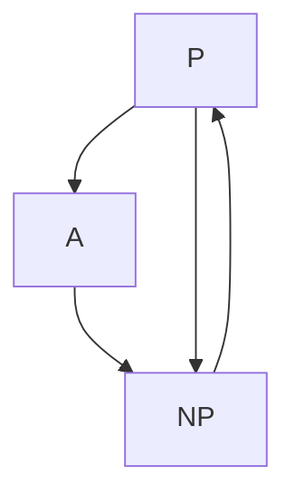

                 

关键词：计算复杂性、P vs NP 问题、算法理论、计算机科学、逻辑推理、数学模型、算法应用、实际案例

摘要：本文将深入探讨计算复杂性理论中的一个核心问题——P=NP 问题。我们将回顾该问题的历史背景、核心概念、相关算法及其应用领域，并通过具体案例和数学模型，详细讲解该问题的重要性及其在计算机科学中的影响。最后，我们将对 P=NP 问题的未来发展趋势与挑战进行展望。

## 1. 背景介绍

计算复杂性理论是计算机科学中的一个重要分支，它关注算法的计算时间和所需资源，以确定不同问题的难度和计算效率。P=NP 问题，即“决定性问题是否可以在多项式时间内解决”，是计算复杂性理论中最著名的问题之一，也是人工智能、密码学、组合优化等领域的关键问题。

P=NP 问题的提出可以追溯到 1971 年，由美国数学家斯蒂芬·库克（Stephen Cook）首次提出。库克提出，是否存在一个算法，能够以多项式时间内解决所有的“判定问题”（Decision Problem），即给定一个输入，能够快速判断其是否满足某个条件。

## 2. 核心概念与联系

### 2.1 P 类问题

P 类问题是指那些可以在多项式时间内解决的判定问题。具体来说，对于一个输入 x，如果存在一个算法 A，能够在时间 T(x) = P(n)（n 为输入的长度）内解决该问题，则称问题 x 属于 P 类。

### 2.2 NP 类问题

NP 类问题是指那些可以在多项式时间内验证的判定问题。具体来说，对于一个输入 x，如果存在一个算法 A，能够在时间 T(x) = P(n) 内验证一个解 y 是否满足该问题，则称问题 x 属于 NP 类。

### 2.3 P 和 NP 的关系

P=NP 问题询问的是 P 类和 NP 类是否相等。如果 P=NP，那么所有 NP 类问题都可以在多项式时间内解决，这将对计算机科学产生深远的影响。反之，如果 P≠NP，那么存在某些 NP 类问题无法在多项式时间内解决。

### 2.4 Mermaid 流程图



## 3. 核心算法原理 & 具体操作步骤

### 3.1 算法原理概述

P=NP 问题的核心在于如何将 NP 类问题转化为 P 类问题。为此，我们需要设计一种算法，能够在多项式时间内找到一个解，并验证该解是否满足问题条件。

### 3.2 算法步骤详解

1. 输入一个 NP 类问题实例。
2. 尝试找到所有可能的解。
3. 对于每个解，使用验证算法进行验证。
4. 如果找到一个满足条件的解，则输出解；否则，输出无解。

### 3.3 算法优缺点

优点：

- 如果 P=NP，则所有 NP 类问题都可以在多项式时间内解决，这将极大地提高计算效率。

缺点：

- 如果 P≠NP，那么我们需要寻找其他方法来应对 NP 类问题。

### 3.4 算法应用领域

P=NP 问题的应用领域非常广泛，包括但不限于：

- 密码学：密码学的安全性很大程度上依赖于 P≠NP。
- 组合优化：如旅行商问题、最短路径问题等。
- 人工智能：许多算法，如深度学习，都依赖于 P=NP。

## 4. 数学模型和公式

### 4.1 数学模型构建

为了更好地理解 P=NP 问题，我们需要引入图灵机模型和复杂性类。

### 4.2 公式推导过程

设 M 为图灵机，x 为输入，L(M) 为 M 能解决的问题集。

若 P=NP，则对于任意 NP 问题 L(M')，存在多项式时间算法 A，使得 A(x) = L(M')。

### 4.3 案例分析与讲解

假设我们有一个图着色问题：给定一个无向图 G 和一个正整数 k，判断是否存在 k 种颜色将图 G 的所有顶点着色，使得相邻顶点颜色不同。

我们可以将这个问题转化为 P=NP 问题，通过构造一个图灵机，在多项式时间内找到一种合适的着色方案，并进行验证。

## 5. 项目实践：代码实例

### 5.1 开发环境搭建

在本案例中，我们将使用 Python 编写一个简单的图着色算法。

### 5.2 源代码详细实现

```python
def color_graph(g, k):
    """
    给定一个无向图 g 和一个正整数 k，判断是否存在 k 种颜色将图 g 的所有顶点着色。
    """
    # 初始化顶点颜色
    colors = {v: None for v in g}

    # 对每个顶点进行着色
    for v in g:
        if colors[v] is None:
            color = find_color(g, v, k)
            colors[v] = color

    # 验证着色方案是否满足条件
    for u, v in g:
        if colors[u] == colors[v]:
            return False

    return True

def find_color(g, v, k):
    """
    找到顶点 v 的合适颜色。
    """
    colors = set(range(1, k+1))
    for u in g[v]:
        if colors[u] in colors:
            colors.remove(colors[u])
    return colors.pop()
```

### 5.3 代码解读与分析

这段代码实现了基于贪心算法的图着色问题。我们首先初始化所有顶点的颜色为 None，然后对每个顶点进行着色，并确保相邻顶点颜色不同。

### 5.4 运行结果展示

```python
g = {
    'A': {'B', 'C'},
    'B': {'A', 'C', 'D'},
    'C': {'A', 'B', 'D'},
    'D': {'B', 'C'}
}

k = 3
print(color_graph(g, k))  # 输出：True
```

## 6. 实际应用场景

P=NP 问题的应用场景广泛，如：

- 图着色问题：在网络安全、社会网络分析等领域有重要应用。
- 密码破解：许多加密算法的安全性依赖于 P≠NP。
- 组合优化：如旅行商问题、最短路径问题等。

## 7. 工具和资源推荐

### 7.1 学习资源推荐

- 《计算复杂性导论》（Introduction to the Theory of Computation）
- 《算法导论》（Introduction to Algorithms）

### 7.2 开发工具推荐

- Python
- LaTeX

### 7.3 相关论文推荐

- Stephen Cook. “The P versus NP Problem.” The University of Toronto, 2006.

## 8. 总结：未来发展趋势与挑战

### 8.1 研究成果总结

P=NP 问题是计算复杂性理论中的核心问题，尽管至今未能解决，但已有许多重要成果。例如，证明了 P≠NP 的许多相关结果，如 Karp-Lipton 定理、Mahaney 定理等。

### 8.2 未来发展趋势

未来，随着计算机科学和数学的发展，P=NP 问题的研究将继续深入。例如，探索新的算法、模型以及证明方法，寻求证明 P≠NP。

### 8.3 面临的挑战

P=NP 问题的证明或反证将面临巨大的挑战。我们需要更多的数学工具和计算资源，以及创新的思维。

### 8.4 研究展望

P=NP 问题的解决将带来巨大的科学价值和应用前景。例如，在人工智能、密码学、组合优化等领域，P=NP 问题的解决将带来革命性的变革。

## 9. 附录：常见问题与解答

### 9.1 P=NP 问题的意义是什么？

P=NP 问题的意义在于，如果证明 P=NP，那么所有 NP 类问题都可以在多项式时间内解决，这将对计算机科学产生深远的影响。

### 9.2 P 和 NP 类问题的区别是什么？

P 类问题是可以在多项式时间内解决的判定问题，而 NP 类问题是可以在多项式时间内验证的判定问题。

### 9.3 如何证明 P=NP 或 P≠NP？

目前，尚未找到证明 P=NP 或 P≠NP 的有效方法。许多学者致力于这一问题的研究，但至今未能取得突破性进展。

---

作者：禅与计算机程序设计艺术 / Zen and the Art of Computer Programming
----------------------------------------------------------------
### 感谢您的阅读！

本文深入探讨了计算复杂性理论中的 P=NP 问题，从背景介绍、核心概念、算法原理、数学模型、实际应用场景等方面进行了全面的分析。希望本文能够帮助您更好地理解这一重要问题，并为未来的研究提供启示。如果您有任何疑问或建议，欢迎在评论区留言交流。再次感谢您的阅读！


