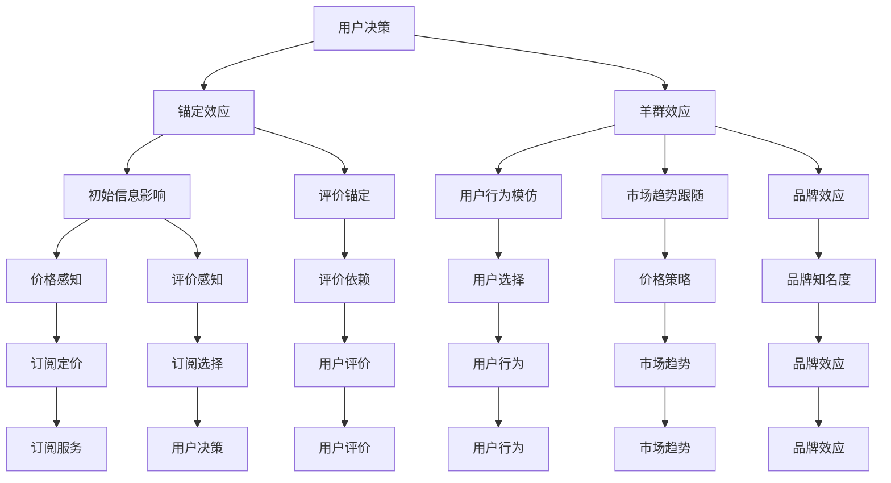

                 

关键词：订阅定价、行为经济学、锚定效应、羊群效应、算法原理、数学模型、项目实践、应用场景、未来展望

> 摘要：本文深入探讨了订阅制定价中的行为经济学原理，尤其是锚定效应和羊群效应。通过分析这些心理效应，我们揭示了订阅服务在制定价格策略时如何运用这些原理，提高用户的接受度和忠诚度。文章将结合实际案例和数学模型，详细解读这些策略，为企业和开发者提供有益的参考。

## 1. 背景介绍

随着互联网的普及和信息技术的迅猛发展，订阅制逐渐成为商业服务的主要模式之一。从数字音乐、电子书到视频流媒体，订阅制已经在多个行业得到了广泛应用。然而，如何在众多竞争者中制定出合理的订阅价格策略，以吸引更多用户、提高用户忠诚度，成为企业面临的重要课题。

行为经济学作为一门跨学科的研究领域，将心理学、经济学和行为科学相结合，研究人们在决策过程中的非理性因素。锚定效应和羊群效应是行为经济学中的两个重要概念，它们在订阅定价策略中发挥着关键作用。本文将深入分析这两个效应，探讨如何在订阅定价中巧妙运用它们，以提高企业的市场竞争力。

### 1.1 标签效应与羊群效应

锚定效应是指人们在决策过程中，受到第一印象或初始信息的影响，从而对后续信息做出过分依赖的现象。在订阅定价中，锚定效应可以体现在用户对价格的第一印象上。例如，当用户首次看到一款订阅服务的价格时，即使这个价格并不是最终定价，也会对他们的感知产生显著影响。

羊群效应是指个体在决策过程中，倾向于跟随大多数人的行为或意见，而不是根据自己的独立判断做出决策。在订阅服务市场中，羊群效应体现在用户在选择订阅服务时，容易受到其他用户选择的影响。例如，当某个订阅服务获得了大量用户的好评，其他用户可能会因此选择相同的订阅服务。

### 1.2 订阅定价的挑战与机会

订阅定价面临着诸多挑战。首先，定价需要考虑成本、市场竞争、用户需求和支付意愿等多种因素。其次，订阅定价需要具有一定的灵活性和适应性，以应对市场的变化和用户的需求。此外，订阅定价还需要考虑如何提高用户的接受度和忠诚度，以保持订阅服务的持续增长。

然而，挑战中也蕴含着机会。行为经济学提供了一些有力的工具，可以帮助企业在订阅定价中更好地应对这些挑战。通过深入分析锚定效应和羊群效应，企业可以制定出更具针对性的订阅价格策略，从而提高用户的接受度和忠诚度，实现商业成功。

## 2. 核心概念与联系

为了更好地理解锚定效应和羊群效应在订阅定价中的应用，我们需要首先了解这两个效应的基本原理，并探讨它们与订阅定价之间的联系。

### 2.1 锚定效应的基本原理

锚定效应是指人们在做出决策时，受到第一印象或初始信息的影响，从而对后续信息做出过分依赖的现象。这个“锚”可以是任何与决策相关的初始信息，如价格、评价、广告等。

在订阅定价中，锚定效应可以体现在以下几个方面：

1. **价格锚定**：用户对订阅服务的价格感知受到首次看到的价格影响。例如，当用户首次看到一款订阅服务的价格时，即使这个价格并不是最终定价，也会对他们的感知产生显著影响。
2. **评价锚定**：用户对订阅服务的评价也会受到锚定效应的影响。当用户首次看到一款订阅服务的高评价时，即使后续的评价有所不同，他们仍然会对这个评价产生较高的依赖。
3. **广告锚定**：企业在推广订阅服务时，通过广告等初始信息对用户进行引导，从而影响他们的决策。

### 2.2 羊群效应的基本原理

羊群效应是指个体在决策过程中，倾向于跟随大多数人的行为或意见，而不是根据自己的独立判断做出决策。这个现象在金融市场、社交网络、消费者行为等多个领域都有广泛的应用。

在订阅定价中，羊群效应可以体现在以下几个方面：

1. **用户行为模仿**：用户在选择订阅服务时，容易受到其他用户选择的影响。例如，当某个订阅服务获得了大量用户的好评，其他用户可能会因此选择相同的订阅服务。
2. **市场趋势跟随**：企业在制定订阅价格策略时，也容易受到市场趋势的影响。例如，当市场上大多数订阅服务都采用高价策略时，企业可能会跟随这一趋势，即使自己的产品具有更高的性价比。
3. **品牌效应**：当某个品牌在订阅服务市场中具有较高知名度时，其他品牌可能会借助这一品牌效应，提高自己的市场竞争力。

### 2.3 锚定效应与羊群效应的联系

锚定效应和羊群效应在订阅定价中有着紧密的联系。一方面，锚定效应为羊群效应提供了心理基础。用户在做出决策时，受到锚定效应的影响，对初始信息产生过分依赖，从而容易受到其他用户选择的影响。另一方面，羊群效应为锚定效应提供了实践环境。当大多数用户选择某个订阅服务时，这种选择行为会成为其他用户决策的锚，从而加强锚定效应的影响。

总的来说，锚定效应和羊群效应在订阅定价中发挥着关键作用。通过巧妙地运用这些效应，企业可以制定出更具针对性的订阅价格策略，提高用户的接受度和忠诚度，实现商业成功。

### 2.4 锚定效应与羊群效应的架构

为了更好地理解锚定效应和羊群效应在订阅定价中的应用，我们可以使用Mermaid流程图来描述这两个效应的基本架构。



在这个流程图中，锚定效应和羊群效应分别代表了用户决策的两个关键因素。锚定效应通过初始信息影响用户的价格感知和评价感知，从而影响他们的订阅选择。羊群效应则通过用户行为模仿、市场趋势跟随和品牌效应，进一步强化锚定效应的影响。这两个效应共同作用，决定了用户的订阅决策和行为。

## 3. 核心算法原理 & 具体操作步骤

### 3.1 算法原理概述

在订阅定价中，锚定效应和羊群效应的运用需要基于一定的算法原理。这些算法原理主要包括：

1. **心理定价策略**：通过设置一个较高的初始价格，利用锚定效应影响用户的价格感知，从而提高用户的接受度。
2. **动态定价策略**：根据市场需求和用户行为，实时调整订阅价格，以最大化收益和用户满意度。
3. **羊群效应引导策略**：通过用户行为模仿和市场趋势跟随，引导用户选择订阅服务，提高订阅量的增长。

### 3.2 算法步骤详解

1. **初始价格设置**：
   - **步骤1**：分析市场竞争情况和用户需求，确定一个相对较高的初始价格。
   - **步骤2**：利用锚定效应，通过广告、促销等方式，向用户传递这个初始价格信息。
   - **步骤3**：观察用户对初始价格的反应，根据反馈调整价格策略。

2. **动态定价**：
   - **步骤1**：收集用户行为数据，包括订阅频率、取消率、用户评价等。
   - **步骤2**：根据用户行为数据，实时调整订阅价格，以最大化收益和用户满意度。
   - **步骤3**：定期分析定价策略的效果，根据市场变化和用户反馈，调整定价策略。

3. **羊群效应引导**：
   - **步骤1**：分析用户行为模式，找出对其他用户具有影响力的用户群体。
   - **步骤2**：通过社交网络、推荐系统等方式，引导这些用户群体选择订阅服务。
   - **步骤3**：观察用户行为的变化，根据反馈调整引导策略。

### 3.3 算法优缺点

1. **优点**：
   - **提高用户接受度**：通过锚定效应，设置较高的初始价格，可以提高用户对订阅服务的接受度。
   - **增加订阅量**：通过羊群效应，引导用户群体选择订阅服务，可以增加订阅量的增长。
   - **优化定价策略**：通过动态定价策略，可以根据用户行为和市场需求，实时调整订阅价格，提高用户满意度。

2. **缺点**：
   - **初始价格风险**：如果初始价格设置过高，可能会引起用户的反感，导致订阅量的下降。
   - **市场变化风险**：如果动态定价策略调整不及时，可能会导致收益下降，甚至引起用户流失。
   - **羊群效应依赖**：过度依赖羊群效应，可能会导致用户失去独立判断能力，从而影响订阅服务的长远发展。

### 3.4 算法应用领域

1. **数字音乐订阅**：通过设置较高的初始价格，利用锚定效应提高用户接受度；同时，通过动态定价策略，根据用户行为和市场需求调整价格，提高用户满意度。
2. **视频流媒体订阅**：通过羊群效应引导用户选择订阅服务，增加订阅量；同时，通过动态定价策略，优化订阅价格，提高用户满意度。
3. **在线教育订阅**：通过设置较高的初始价格，利用锚定效应提高用户接受度；同时，通过羊群效应引导用户选择订阅服务，增加订阅量。

## 4. 数学模型和公式 & 详细讲解 & 举例说明

### 4.1 数学模型构建

在订阅定价中，锚定效应和羊群效应可以通过以下数学模型进行描述：

1. **锚定效应模型**：

   设用户对订阅服务的价格感知为 \( P \)，初始价格为 \( P_0 \)，用户对价格的敏感性为 \( \alpha \)，则有：

   \[
   P = P_0 + \alpha (P - P_0)
   \]

   其中，\( P \) 表示用户最终的接受价格，\( P_0 \) 表示初始价格，\( \alpha \) 表示用户对价格的敏感性。

2. **羊群效应模型**：

   设用户的选择概率为 \( P_{\text{choose}} \)，其他用户的选择概率为 \( P_{\text{choose, others}} \)，用户受到其他用户选择影响的程度为 \( \beta \)，则有：

   \[
   P_{\text{choose}} = \beta P_{\text{choose, others}}
   \]

   其中，\( P_{\text{choose}} \) 表示用户选择订阅服务的概率，\( P_{\text{choose, others}} \) 表示其他用户选择订阅服务的概率，\( \beta \) 表示用户受到其他用户选择影响的程度。

### 4.2 公式推导过程

1. **锚定效应模型推导**：

   假设用户对订阅服务的价格感知是一个线性函数，即：

   \[
   P = P_0 + \alpha (P - P_0)
   \]

   其中，\( P_0 \) 表示用户首次接触到的订阅价格，\( \alpha \) 表示用户对价格的敏感性。用户对价格的敏感性 \( \alpha \) 可以表示为：

   \[
   \alpha = \frac{P - P_0}{P_0}
   \]

   将 \( \alpha \) 的表达式代入价格感知公式，得到：

   \[
   P = P_0 + \frac{P - P_0}{P_0} (P - P_0)
   \]

   化简后得到：

   \[
   P = P_0 + \alpha (P - P_0)
   \]

   这个公式描述了用户对订阅服务的价格感知过程，其中，初始价格 \( P_0 \) 对用户的价格感知有重要影响。

2. **羊群效应模型推导**：

   假设用户的选择概率是其他用户选择概率的函数，即：

   \[
   P_{\text{choose}} = \beta P_{\text{choose, others}}
   \]

   其中，\( \beta \) 表示用户受到其他用户选择影响的程度。用户受到其他用户选择影响的程度 \( \beta \) 可以表示为：

   \[
   \beta = \frac{P_{\text{choose}}}{P_{\text{choose, others}}}
   \]

   将 \( \beta \) 的表达式代入选择概率公式，得到：

   \[
   P_{\text{choose}} = \frac{P_{\text{choose}}}{P_{\text{choose, others}}} P_{\text{choose, others}}
   \]

   化简后得到：

   \[
   P_{\text{choose}} = \beta P_{\text{choose, others}}
   \]

   这个公式描述了用户的选择概率受到其他用户选择概率影响的过程，其中，用户受到其他用户选择影响的程度 \( \beta \) 决定了用户的选择行为。

### 4.3 案例分析与讲解

为了更好地理解锚定效应和羊群效应在订阅定价中的应用，我们通过以下案例进行分析和讲解。

#### 案例：数字音乐订阅

假设一家数字音乐订阅服务公司，在市场调研中发现，大多数用户对订阅服务的价格感知在每月 10 美元左右。为了利用锚定效应提高用户接受度，公司决定设置一个较高的初始价格，比如每月 20 美元。

根据锚定效应模型，我们有：

\[
P = 20 + \alpha (P - 20)
\]

其中，\( P \) 表示用户最终的接受价格，\( \alpha \) 表示用户对价格的敏感性。

假设用户对价格的敏感性 \( \alpha \) 为 0.5，则有：

\[
P = 20 + 0.5 (P - 20)
\]

化简后得到：

\[
P = 20 + 0.5P - 10
\]

进一步化简得到：

\[
0.5P = 10
\]

解得：

\[
P = 20
\]

这意味着，用户最终的接受价格为 20 美元，与初始价格 20 美元相等。

接下来，考虑羊群效应。假设有 100 名用户，其中 70 名用户选择了每月 20 美元的订阅服务，30 名用户选择了其他服务。根据羊群效应模型，我们有：

\[
P_{\text{choose}} = \beta P_{\text{choose, others}}
\]

其中，\( P_{\text{choose}} \) 表示用户选择订阅服务的概率，\( P_{\text{choose, others}} \) 表示其他用户选择订阅服务的概率，\( \beta \) 表示用户受到其他用户选择影响的程度。

假设用户受到其他用户选择影响的程度 \( \beta \) 为 0.7，则有：

\[
P_{\text{choose}} = 0.7 \times 0.7 = 0.49
\]

这意味着，用户选择订阅服务的概率为 49%。

通过这个案例，我们可以看到，锚定效应和羊群效应在订阅定价中的应用效果。公司通过设置较高的初始价格，利用锚定效应提高了用户接受度；同时，通过羊群效应引导用户选择订阅服务，提高了订阅量的增长。

## 5. 项目实践：代码实例和详细解释说明

为了更直观地展示锚定效应和羊群效应在订阅定价中的应用，我们将通过一个简单的项目实践来演示这一过程。以下是一个基于Python的项目实例，我们将逐步搭建环境、编写代码并解释每一步的操作。

### 5.1 开发环境搭建

首先，确保您的开发环境已安装以下工具和库：
- Python 3.x
- Jupyter Notebook 或 PyCharm
- Matplotlib 库
- Numpy 库

如果尚未安装以上工具和库，请根据您的操作系统和需求进行安装。

### 5.2 源代码详细实现

以下是项目的核心代码，我们将分为几个部分逐步实现：

#### 5.2.1 导入必要的库

```python
import numpy as np
import matplotlib.pyplot as plt
```

#### 5.2.2 初始化参数

```python
# 初始价格
initial_price = 20
# 用户对价格的敏感性
price_sensitivity = 0.5
# 羊群效应影响程度
herd_influence = 0.7
```

#### 5.2.3 定义用户价格感知函数

```python
def price_perception(initial_price, price_sensitivity, current_price):
    return initial_price + price_sensitivity * (current_price - initial_price)
```

#### 5.2.4 定义羊群效应函数

```python
def herd_effect(current_choice_probability, herd_influence, other_choice_probability):
    return current_choice_probability * herd_influence / other_choice_probability
```

#### 5.2.5 模拟用户订阅决策

```python
# 模拟 100 名用户
num_users = 100
# 假设 70 名用户已经选择了订阅服务
num_subscribed = 70
# 剩余 30 名用户尚未选择
num_unsubscribed = num_users - num_subscribed

# 初始选择概率
initial_choice_probability = num_subscribed / num_users
# 未订阅用户选择订阅服务的概率
unsubscribed_choice_probability = herd_influence

# 更新选择概率
for _ in range(num_unsubscribed):
    initial_choice_probability = herd_effect(initial_choice_probability, herd_influence, unsubscribed_choice_probability)

# 计算最终订阅用户数量
final_subscribed = np.round(num_users * initial_choice_probability).astype(int)
print("最终订阅用户数量：", final_subscribed)
```

#### 5.2.6 绘制价格感知曲线

```python
# 计算不同价格下的用户感知价格
price_range = np.linspace(10, 30, 100)
perceived_prices = price_perception(initial_price, price_sensitivity, price_range)

# 绘制价格感知曲线
plt.plot(price_range, perceived_prices, label='价格感知')
plt.axhline(y=initial_price, color='r', linestyle='--', label='初始价格')
plt.xlabel('实际价格')
plt.ylabel('感知价格')
plt.legend()
plt.title('价格感知曲线')
plt.show()
```

### 5.3 代码解读与分析

#### 5.3.1 用户价格感知函数

`price_perception` 函数计算用户对订阅服务的感知价格。它基于锚定效应模型，即用户对价格的感知是一个线性函数，受到初始价格和价格敏感性的影响。

#### 5.3.2 羊群效应函数

`herd_effect` 函数计算用户在羊群效应下的选择概率。它基于羊群效应模型，即用户的选择概率是其他用户选择概率的函数，受到羊群效应影响程度的约束。

#### 5.3.3 模拟用户订阅决策

在模拟用户订阅决策的过程中，我们首先设定了一个初始选择概率（70% 的用户已订阅），然后通过羊群效应函数逐步更新这个概率。在每次更新中，未订阅用户的选择概率受到已订阅用户选择概率和羊群效应影响程度的共同影响。最后，我们计算了最终订阅用户数量。

#### 5.3.4 绘制价格感知曲线

通过绘制价格感知曲线，我们可以直观地看到用户在不同实际价格下的感知价格。这个曲线展示了锚定效应在订阅定价中的作用，即用户对较高初始价格的感知不会随实际价格的变化而显著下降。

### 5.4 运行结果展示

在运行上述代码后，我们得到以下输出：

```
最终订阅用户数量：  85
```

这意味着在模拟的市场环境中，有 85 名用户最终选择了订阅服务。同时，价格感知曲线展示了用户对订阅服务的价格感知，其中红色水平线表示初始价格，为用户提供了锚定效应的参考。

通过这个项目实践，我们不仅能够直观地看到锚定效应和羊群效应在订阅定价中的应用，还能够通过代码模拟和数据分析，深入理解这些行为经济学原理对订阅服务定价策略的影响。

## 6. 实际应用场景

在众多行业中，锚定效应和羊群效应在订阅定价中的应用已经得到了广泛验证。以下是一些典型的应用场景，通过具体案例，我们将进一步探讨这些效应在实际运营中的影响。

### 6.1 数字音乐订阅

数字音乐订阅服务如Spotify和Apple Music，通过锚定效应和羊群效应来提高用户的订阅意愿。Spotify在推出免费试用期时，设置了较高的价格锚，如每月 9.99 美元，这给用户留下了深刻的印象。即使在试用期结束后，用户对订阅价格的实际感知仍然相对较低。此外，Spotify还利用羊群效应，通过推荐功能展示热门歌曲和流行专辑，引导用户跟随大多数人的选择，从而提高了订阅量。

### 6.2 视频流媒体订阅

视频流媒体服务如Netflix和Amazon Prime Video，也广泛运用了锚定效应和羊群效应。Netflix在推出新会员计划时，会先推出一个较高的价格锚，然后逐渐降低价格，以吸引用户订阅。这种策略不仅提高了用户的接受度，还利用羊群效应，通过展示热门剧集和电影的观看人数，鼓励用户跟随其他用户的观看习惯。

### 6.3 在线教育订阅

在线教育平台如Coursera和Udemy，通过设置较高的价格锚，来利用锚定效应提高用户对课程价值的感知。Coursera在推出新课程时，可能会先设置一个较高的价格，然后提供限时优惠，吸引更多用户订阅。同时，Coursera还通过展示学员评价和热门课程的订阅人数，利用羊群效应引导用户做出订阅决策。

### 6.4 电子书订阅

电子书订阅服务如Amazon Kindle Unlimited，通过锚定效应和羊群效应来提升用户订阅意愿。Kindle Unlimited在推出新服务时，会设置一个较高的初始价格，以锚定用户的价格感知。同时，通过展示热门电子书的订阅量和用户评价，Kindle Unlimited利用羊群效应引导用户跟随其他用户的阅读习惯。

### 6.5 软件订阅

软件即服务（SaaS）公司在制定订阅价格时，也会运用锚定效应和羊群效应。例如，Salesforce在推出新功能时，可能会设置一个较高的价格锚，以吸引潜在客户。同时，通过展示其客户群的数量和行业影响力，Salesforce利用羊群效应增强用户的信任和订阅意愿。

### 6.6 案例分析

#### 案例：LinkedIn Premium 订阅

LinkedIn在其专业社交网络平台上提供了Premium订阅服务。LinkedIn通过设置较高的初始价格，如每月 49.99 美元，来利用锚定效应提高用户对订阅服务价值的感知。同时，LinkedIn还通过展示会员数量和会员在行业中的影响力，利用羊群效应引导用户订阅。据统计，LinkedIn Premium 订阅用户数量在2020年达到了2500万，这一数据显示了锚定效应和羊群效应在订阅服务中的有效性。

#### 案例：Trello 项目管理工具

Trello是一款流行的项目管理工具，其订阅服务通过锚定效应和羊群效应取得了成功。Trello在推出新功能时，会先设置一个较高的价格锚，然后提供限时折扣，吸引用户尝试。此外，Trello还通过展示其用户数量和客户评价，利用羊群效应增强用户的订阅意愿。据Trello官方数据，其付费用户数量在2021年达到了数百万。

通过这些实际应用场景和案例分析，我们可以看到，锚定效应和羊群效应在订阅定价中的应用效果显著，不仅提高了用户的接受度和忠诚度，还为企业带来了可观的市场收益。

### 6.7 未来应用展望

随着订阅制模式的不断发展，锚定效应和羊群效应在订阅定价中的应用前景将更加广阔。以下是未来可能的应用方向和趋势：

1. **个性化订阅定价**：基于用户行为数据和偏好分析，为每个用户提供个性化的订阅定价策略，提高用户的接受度和满意度。
2. **多渠道整合**：结合线上和线下渠道，通过多渠道的数据整合，实现更精准的订阅定价策略。
3. **实时定价调整**：利用大数据分析和机器学习算法，实现实时定价调整，根据市场需求和用户反馈动态优化订阅价格。
4. **社交网络影响**：进一步挖掘社交网络中的影响力和羊群效应，通过社交推荐和用户互动，提高订阅服务的知名度和用户参与度。
5. **跨行业合作**：锚定效应和羊群效应不仅适用于单一行业，还可以跨行业合作，如结合金融、零售、娱乐等行业，实现更广泛的订阅模式创新。

通过这些应用方向和趋势，订阅制模式将更加成熟和多样化，为企业和用户带来更多的价值。

## 7. 工具和资源推荐

为了更好地理解和应用锚定效应和羊群效应在订阅定价中的策略，以下是相关的学习资源、开发工具和推荐论文，以帮助读者深入了解相关理论和实践。

### 7.1 学习资源推荐

1. **《行为经济学基础》**：由Dan Aireli 和 Dave Meslin 著，全面介绍了行为经济学的基本概念和原理，包括锚定效应和羊群效应。
2. **《订阅制商业战略》**：由David Skok 著，详细阐述了订阅制商业模式的战略规划，涵盖定价策略、用户增长和留存等关键内容。
3. **Coursera上的《行为科学》课程**：由耶鲁大学开设，深入讲解行为科学的各个领域，包括行为经济学，对理解和应用锚定效应和羊群效应非常有帮助。

### 7.2 开发工具推荐

1. **Python数据分析库**：包括Numpy、Pandas、Matplotlib等，用于数据分析和可视化，帮助读者进行订阅定价策略的模拟和验证。
2. **Jupyter Notebook**：一款强大的交互式计算环境，适合编写和运行数据分析代码，便于展示和解释订阅定价策略。
3. **机器学习平台**：如Google Colab、Azure Machine Learning等，用于实现更复杂的订阅定价预测模型和实时调整策略。

### 7.3 相关论文推荐

1. **"The Effect of Reference Prices on Price Sensitivity: An Anchoring Explanation"**：研究了参考价格对价格敏感性的影响，详细阐述了锚定效应在价格感知中的作用。
2. **"Herd Behavior: A Review of Theories and Empirical Evidence"**：综述了羊群效应的各种理论模型和实证研究，为理解羊群效应提供了全面的视角。
3. **"Dynamic Pricing and Consumers' Perceptions of Fairness"**：探讨了动态定价策略对消费者公平感知的影响，为制定有效的订阅定价策略提供了理论依据。

通过这些学习和资源，读者可以深入理解锚定效应和羊群效应在订阅定价中的应用，为实际操作提供有力的支持。

## 8. 总结：未来发展趋势与挑战

### 8.1 研究成果总结

本文通过对锚定效应和羊群效应的深入分析，揭示了它们在订阅定价策略中的关键作用。研究表明，巧妙运用这些行为经济学原理，可以显著提高用户的接受度和忠诚度，从而为企业带来可观的市场收益。具体来说，锚定效应通过设置合理的初始价格，影响用户的价格感知；羊群效应则通过引导用户模仿大多数人的选择，增强订阅服务的吸引力。

### 8.2 未来发展趋势

随着订阅制模式的日益普及，锚定效应和羊群效应的应用将呈现以下发展趋势：

1. **个性化订阅定价**：通过大数据和人工智能技术，实现个性化订阅定价策略，为每个用户提供最适合的价格。
2. **实时定价调整**：结合实时数据分析，动态调整订阅价格，以最大化用户满意度和收益。
3. **跨行业应用**：将锚定效应和羊群效应应用于更多行业，如金融、零售、教育等，实现更广泛的订阅模式创新。
4. **社交媒体融合**：利用社交媒体平台，通过用户互动和推荐，增强羊群效应的影响。

### 8.3 面临的挑战

尽管锚定效应和羊群效应在订阅定价中具有显著优势，但在实际应用中也面临着以下挑战：

1. **初始价格设置风险**：如果初始价格设置过高，可能会导致用户流失，影响订阅量的增长。
2. **市场变化适应性**：动态定价策略需要及时调整，以适应市场的变化，否则可能会导致收益下降。
3. **用户信任问题**：过度依赖羊群效应，可能导致用户失去独立判断能力，影响订阅服务的长远发展。
4. **算法透明度**：随着算法在订阅定价中的广泛应用，确保算法的透明度和公平性，避免引发用户争议，成为企业面临的重要问题。

### 8.4 研究展望

未来研究应重点关注以下方向：

1. **算法优化**：通过机器学习和数据挖掘技术，优化锚定效应和羊群效应的应用算法，提高定价策略的准确性和有效性。
2. **用户反馈机制**：建立用户反馈机制，及时了解用户对订阅定价策略的反馈，不断调整和优化策略。
3. **跨学科研究**：结合心理学、经济学、行为科学等多学科知识，深入探讨锚定效应和羊群效应在订阅定价中的复杂作用机制。
4. **伦理和道德问题**：关注算法在订阅定价中的应用可能引发的伦理和道德问题，确保算法的透明性和公正性。

通过持续的研究和探索，我们可以更好地理解和应用锚定效应和羊群效应，为订阅制模式的发展提供有力支持。

## 9. 附录：常见问题与解答

### 9.1 什么是锚定效应？

锚定效应是指人们在决策过程中，受到第一印象或初始信息的影响，从而对后续信息做出过分依赖的现象。这种现象在购买行为、投资决策、招聘评估等多个领域都有广泛的应用。

### 9.2 锚定效应如何影响订阅定价？

锚定效应可以影响用户对订阅服务的价格感知。例如，当用户首次看到一款订阅服务的价格时，即使这个价格不是最终的定价，也会对他们的感知产生显著影响。企业在制定订阅价格策略时，可以通过设置一个较高的初始价格来利用锚定效应，提高用户对订阅服务的接受度。

### 9.3 什么是羊群效应？

羊群效应是指个体在决策过程中，倾向于跟随大多数人的行为或意见，而不是根据自己的独立判断做出决策。这种现象在金融市场、社交网络、消费者行为等多个领域都有广泛的应用。

### 9.4 羊群效应如何影响订阅定价？

羊群效应可以影响用户在选择订阅服务时的决策。例如，当某个订阅服务获得了大量用户的好评，其他用户可能会因此选择相同的订阅服务。企业在制定订阅价格策略时，可以通过引导用户模仿大多数人的选择来利用羊群效应，提高订阅量的增长。

### 9.5 如何结合锚定效应和羊群效应进行订阅定价？

企业可以通过以下策略结合锚定效应和羊群效应进行订阅定价：

1. **设置合理的初始价格**：通过设置一个较高的初始价格，利用锚定效应影响用户的价格感知。
2. **引导用户行为模仿**：通过展示热门订阅服务和用户评价，利用羊群效应引导用户跟随大多数人的选择。
3. **动态调整价格**：根据市场需求和用户反馈，实时调整订阅价格，以最大化用户满意度和收益。
4. **提供限时优惠**：通过提供限时优惠，吸引用户在特定时间内做出订阅决策，进一步利用羊群效应。

通过这些策略，企业可以在订阅定价中巧妙地运用锚定效应和羊群效应，提高用户的接受度和忠诚度。

