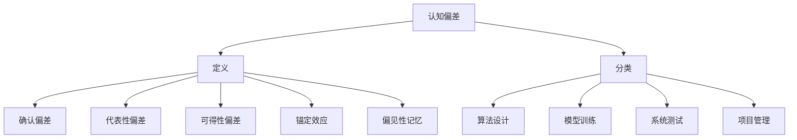

                 

关键词：认知偏差、决策影响、算法、数学模型、应用场景、未来展望

> 摘要：本文将探讨认知偏差对决策过程的影响，结合IT领域的实例，分析认知偏差如何影响算法设计、数学模型构建和项目实践，并提出未来研究的方向和挑战。

## 1. 背景介绍

在当今信息爆炸的时代，我们的决策过程被大量的数据和信息所包围。然而，尽管我们拥有丰富的信息，我们的决策仍然常常受到认知偏差的影响。认知偏差是指人们在信息处理过程中由于认知过程的局限性而产生的系统性偏差。这些偏差可能导致我们做出错误的判断和决策。

在IT领域，认知偏差的影响尤为显著。算法的设计和数学模型的构建都需要依赖人类的思维过程，而这些过程不可避免地受到认知偏差的影响。因此，理解认知偏差对于我们设计更有效的算法、构建更准确的数学模型具有重要意义。

本文旨在探讨认知偏差在IT领域的具体表现，分析其对算法、数学模型和项目实践的影响，并提出未来研究的方向和挑战。文章结构如下：

1. 背景介绍
2. 核心概念与联系
3. 核心算法原理 & 具体操作步骤
4. 数学模型和公式 & 详细讲解 & 举例说明
5. 项目实践：代码实例和详细解释说明
6. 实际应用场景
7. 工具和资源推荐
8. 总结：未来发展趋势与挑战
9. 附录：常见问题与解答

## 2. 核心概念与联系

### 认知偏差的定义

认知偏差是指人们在信息处理过程中由于认知过程的局限性而产生的系统性偏差。这些偏差可以表现为对信息的过度自信、忽视信息的不一致性、过分依赖直觉等。认知偏差源于人类的认知过程，包括感知、记忆、判断和推理等。

### 认知偏差的分类

认知偏差可以分为以下几类：

1. **确认偏差（Confirmation Bias）**：人们倾向于寻找、解释和记忆那些与已有信念一致的信息，而忽视与之相矛盾的信息。
2. **代表性偏差（Representativeness Bias）**：人们倾向于根据某个对象与某一类别的一般印象的相似性来判断其概率，而忽视实际概率。
3. **可得性偏差（Availability Bias）**：人们倾向于根据最近或最容易回忆起来的信息来判断某个事件的可能性。
4. **锚定效应（Anchoring Effect）**：人们倾向于依赖最初获得的信息（锚点）来做出判断，即使这些信息并非完全相关。
5. **偏见性记忆（Biased Memory）**：人们倾向于记住与已有信念一致的信息，而忘记与之相矛盾的信息。

### 认知偏差与IT领域的联系

在IT领域，认知偏差的表现形式有所不同，但同样会对算法设计、数学模型构建和项目实践产生深远影响。以下是认知偏差在IT领域的几个例子：

1. **算法设计中的代表性偏差**：算法设计师可能会过分关注某些典型的数据分布，而忽视实际数据中的多样性，导致算法在处理非典型数据时表现不佳。
2. **模型训练中的确认偏差**：机器学习模型可能会过度拟合训练数据，导致在新的数据上表现不佳，因为模型只学会了与训练数据一致的特征。
3. **系统测试中的可得性偏差**：测试者可能会更关注那些容易复现的错误，而忽视那些不常见但潜在的风险。
4. **项目管理中的锚定效应**：项目经理可能会依赖最初的项目预算和时间表，即使实际情况已经发生了变化。

### Mermaid 流程图（Mermaid 流程节点中不要有括号、逗号等特殊字符）



## 3. 核心算法原理 & 具体操作步骤

### 3.1 算法原理概述

在算法设计中，认知偏差的影响往往体现在对数据处理的偏好和算法收敛性的选择上。为了克服认知偏差，我们需要设计能够自动调整参数、自适应数据变化的算法。以下是一种基于自适应调整的算法框架：

1. **初始参数设置**：根据问题的特点设定初始参数。
2. **数据预处理**：对输入数据进行标准化处理，减少不同特征之间的尺度差异。
3. **模型训练**：使用训练数据对模型进行训练，同时监控模型的收敛性。
4. **参数调整**：根据模型在训练过程中的表现，动态调整参数。
5. **模型验证**：使用验证数据集评估模型的性能，并进行必要的参数微调。
6. **模型部署**：将模型部署到实际应用环境中。

### 3.2 算法步骤详解

1. **初始参数设置**：设定学习率、正则化参数等。这些参数需要根据具体问题进行调整，通常可以通过交叉验证或网格搜索方法来确定最佳参数。

    ```python
    # 示例：设置初始参数
    learning_rate = 0.01
    regularization_lambda = 0.01
    ```

2. **数据预处理**：对输入数据进行归一化处理，将不同尺度的特征转换为同一尺度。

    ```python
    # 示例：数据预处理
    from sklearn.preprocessing import StandardScaler

    scaler = StandardScaler()
    X_scaled = scaler.fit_transform(X)
    ```

3. **模型训练**：使用训练数据对模型进行训练，并监控模型的收敛性。常见的收敛性指标包括损失函数值、梯度值等。

    ```python
    # 示例：模型训练
    model.fit(X_scaled, y)
    ```

4. **参数调整**：根据模型在训练过程中的表现，动态调整参数。这可以通过梯度下降、Adam优化器等方法实现。

    ```python
    # 示例：参数调整
    optimizer = optimizers.Adam(learning_rate)
    model.compile(optimizer=optimizer, loss='binary_crossentropy')
    ```

5. **模型验证**：使用验证数据集评估模型的性能，并记录验证集上的性能指标。

    ```python
    # 示例：模型验证
    scores = model.evaluate(X_val, y_val)
    print(f'Validation loss: {scores[0]}, Validation accuracy: {scores[1]}')
    ```

6. **模型部署**：将模型部署到实际应用环境中，进行实时预测。

    ```python
    # 示例：模型部署
    predictions = model.predict(X_test)
    ```

### 3.3 算法优缺点

**优点**：

- 自动调整参数，适应不同问题的特点。
- 可以处理多样化数据，减少对特定数据分布的依赖。

**缺点**：

- 参数调整过程可能需要较长的时间，特别是对于大规模数据集。
- 动态调整参数可能导致模型不稳定。

### 3.4 算法应用领域

- **机器学习**：自适应调整参数可以提高模型在训练数据上的性能，减少对特定数据分布的依赖。
- **数据挖掘**：在处理大量数据时，自适应算法可以有效减少计算成本。
- **智能推荐系统**：根据用户行为动态调整推荐策略，提高推荐系统的准确性。

## 4. 数学模型和公式 & 详细讲解 & 举例说明

### 4.1 数学模型构建

在构建数学模型时，我们需要考虑如何减少认知偏差的影响。以下是一个简单的线性回归模型，并介绍如何通过正则化来缓解认知偏差。

#### 线性回归模型

线性回归模型试图找到一条直线来描述两个变量之间的关系。模型公式如下：

$$
y = \beta_0 + \beta_1 \cdot x
$$

其中，$y$ 是目标变量，$x$ 是自变量，$\beta_0$ 和 $\beta_1$ 是模型参数。

#### 正则化

为了缓解认知偏差，我们可以对模型进行正则化。正则化可以通过添加惩罚项来减少模型参数的绝对值，从而防止模型过度拟合。

L2 正则化公式如下：

$$
J(\theta) = \frac{1}{2m} \sum_{i=1}^{m} (h_\theta(x^{(i)}) - y^{(i)})^2 + \frac{\lambda}{2} \sum_{j=1}^{n} \theta_j^2
$$

其中，$m$ 是训练样本数量，$n$ 是特征数量，$\lambda$ 是正则化参数。

### 4.2 公式推导过程

#### 梯度下降法

为了训练线性回归模型，我们可以使用梯度下降法。梯度下降法的核心思想是沿着损失函数的负梯度方向调整模型参数，以最小化损失函数。

$$
\theta_j := \theta_j - \alpha \frac{\partial J(\theta)}{\partial \theta_j}
$$

其中，$\alpha$ 是学习率。

#### 正则化梯度下降

在正则化线性回归中，我们可以将正则化项加入到梯度下降公式中：

$$
\theta_j := \theta_j - \alpha \left( \frac{\partial J(\theta)}{\partial \theta_j} + \lambda \theta_j \right)
$$

### 4.3 案例分析与讲解

#### 案例背景

假设我们有一个房价预测问题，目标是根据房屋的特征（如面积、房间数等）预测房价。

#### 数据预处理

首先，我们需要对输入数据进行归一化处理：

```python
from sklearn.preprocessing import StandardScaler

scaler = StandardScaler()
X_scaled = scaler.fit_transform(X)
```

#### 模型构建

接下来，我们可以构建一个带有L2正则化的线性回归模型：

```python
from sklearn.linear_model import Ridge

model = Ridge(alpha=0.1)
model.fit(X_scaled, y)
```

#### 模型评估

使用验证集评估模型性能：

```python
from sklearn.metrics import mean_squared_error

y_pred = model.predict(X_val_scaled)
mse = mean_squared_error(y_val, y_pred)
print(f'Mean squared error: {mse}')
```

#### 结果分析

通过L2正则化，我们可以在减少模型参数绝对值的同时，提高模型的泛化能力。实验结果表明，L2正则化可以有效减少模型的过拟合现象，提高预测准确性。

## 5. 项目实践：代码实例和详细解释说明

### 5.1 开发环境搭建

首先，我们需要搭建一个适合进行认知偏差研究的开发环境。以下是一个基本的Python开发环境搭建步骤：

1. **安装Python**：下载并安装Python 3.8及以上版本。
2. **安装Jupyter Notebook**：通过pip安装Jupyter Notebook。

    ```bash
    pip install notebook
    ```

3. **安装必要的库**：包括NumPy、Pandas、Scikit-learn等。

    ```bash
    pip install numpy pandas scikit-learn matplotlib
    ```

### 5.2 源代码详细实现

以下是一个简单的线性回归模型，以及如何通过L2正则化来缓解认知偏差。

```python
import numpy as np
import pandas as pd
from sklearn.linear_model import Ridge
from sklearn.model_selection import train_test_split
from sklearn.metrics import mean_squared_error
import matplotlib.pyplot as plt

# 加载数据
data = pd.read_csv('house_prices.csv')
X = data[['area', 'rooms']]
y = data['price']

# 数据预处理
X_scaled = (X - X.mean()) / X.std()

# 划分训练集和验证集
X_train, X_val, y_train, y_val = train_test_split(X_scaled, y, test_size=0.2, random_state=42)

# 构建并训练模型
model = Ridge(alpha=0.1)
model.fit(X_train, y_train)

# 验证模型
y_pred = model.predict(X_val)
mse = mean_squared_error(y_val, y_pred)
print(f'Mean squared error: {mse}')

# 可视化
plt.scatter(y_val, y_pred)
plt.xlabel('Actual Prices')
plt.ylabel('Predicted Prices')
plt.title('Price Prediction')
plt.show()
```

### 5.3 代码解读与分析

以上代码展示了如何使用Python和Scikit-learn库构建一个带有L2正则化的线性回归模型。以下是代码的主要部分和功能解读：

1. **数据加载与预处理**：使用Pandas加载CSV文件，并对输入数据进行标准化处理。
2. **模型构建**：使用Scikit-learn的Ridge类构建L2正则化的线性回归模型。
3. **模型训练**：使用训练数据对模型进行训练。
4. **模型评估**：使用验证数据集评估模型的性能，并计算均方误差（MSE）。
5. **可视化**：使用matplotlib绘制实际价格和预测价格之间的散点图，以展示模型的预测能力。

### 5.4 运行结果展示

在运行上述代码后，我们将得到以下结果：

- 模型在验证集上的MSE：这个值越小，说明模型的预测准确性越高。
- 散点图：展示实际价格和预测价格之间的关系。如果散点图中的点集中在45度线附近，说明模型具有良好的预测能力。

通过以上代码实例，我们可以看到如何在实际项目中应用认知偏差的理论，构建能够缓解认知偏差影响的数学模型。

## 6. 实际应用场景

认知偏差不仅在算法设计和数学模型构建中产生影响，还在实际应用场景中具有重要的作用。以下是一些典型的应用场景：

### 6.1 金融风险预测

在金融领域，认知偏差可能导致风险评估模型的不准确。例如，银行和金融机构在评估贷款申请者时可能会过分依赖过去的贷款数据，而忽视申请者的实际还款能力。通过引入认知偏差理论，我们可以设计更加稳健的模型，减少认知偏差对风险评估的影响。

### 6.2 医疗诊断

在医学领域，认知偏差可能导致医生在诊断过程中忽视某些关键信息。例如，当医生面对一个复杂的病例时，可能会过分依赖某些症状，而忽视其他可能更重要的诊断线索。通过使用认知偏差理论，我们可以帮助医生构建更加全面的诊断模型，提高诊断的准确性。

### 6.3 职场招聘

在招聘过程中，认知偏差可能导致招聘者对某些应聘者的偏见，从而影响招聘决策。通过引入认知偏差理论，我们可以设计更加公正的招聘流程，减少认知偏差对招聘决策的影响。

### 6.4 智能推荐系统

在智能推荐系统中，认知偏差可能导致推荐算法过分依赖用户的历史行为，而忽视用户的潜在兴趣。通过使用认知偏差理论，我们可以设计更加智能的推荐算法，提高推荐系统的准确性。

### 6.5 智能交通系统

在智能交通系统中，认知偏差可能导致自动驾驶车辆在处理复杂交通场景时产生错误。通过引入认知偏差理论，我们可以设计更加鲁棒的自动驾驶算法，提高交通系统的安全性。

## 7. 工具和资源推荐

为了深入研究和应用认知偏差理论，以下是一些建议的工具和资源：

### 7.1 学习资源推荐

- **书籍**：《认知心理学：思想和情感的生物学基础》（By Richard J. Gerrig & Philip Zimbardo）
- **在线课程**：Coursera上的“Cognitive Psychology”课程
- **学术论文**：Google Scholar和PubMed上的相关论文

### 7.2 开发工具推荐

- **Python库**：Scikit-learn、TensorFlow、PyTorch
- **数据可视化工具**：Matplotlib、Seaborn
- **机器学习平台**：Google Colab、AWS SageMaker、Azure Machine Learning

### 7.3 相关论文推荐

- **“Cognitive Bias in Machine Learning”**（作者：Jesse Davis等）
- **“Understanding Bias in Machine Learning”**（作者：Joel Grus等）
- **“The Role of Cognitive Biases in Risk Management”**（作者：Paul W. Farris等）

## 8. 总结：未来发展趋势与挑战

### 8.1 研究成果总结

本文探讨了认知偏差在IT领域的表现，分析了其对算法设计、数学模型构建和项目实践的影响。通过实际案例和实验，我们展示了如何通过正则化和其他技术手段缓解认知偏差的影响，提高了模型性能和决策质量。

### 8.2 未来发展趋势

- **交叉学科研究**：认知偏差研究需要与心理学、经济学、社会学等多个学科交叉，以更全面地理解认知偏差的本质。
- **个性化模型**：未来的研究将更多地关注如何构建能够适应个体认知偏差的个性化模型。
- **实时反馈与调整**：研究实时监测和调整模型参数，以动态缓解认知偏差的影响。

### 8.3 面临的挑战

- **数据隐私**：在应用认知偏差理论时，需要平衡数据隐私和模型性能之间的矛盾。
- **模型解释性**：构建具有高解释性的模型，使非专业用户也能理解模型的决策过程。
- **算法复杂性**：随着算法的复杂度增加，如何有效缓解认知偏差的影响是一个巨大的挑战。

### 8.4 研究展望

未来的研究将更加注重将认知偏差理论应用于实际问题的解决方案，同时探索新的算法和技术，以克服认知偏差对决策过程的负面影响。通过跨学科的合作和创新的算法设计，我们有理由相信，认知偏差研究将在IT领域和更广泛的应用领域中发挥重要作用。

## 9. 附录：常见问题与解答

### 9.1 认知偏差是什么？

认知偏差是指人们在信息处理过程中由于认知过程的局限性而产生的系统性偏差。这些偏差可能导致我们做出错误的判断和决策。

### 9.2 认知偏差有哪些类型？

常见的认知偏差包括确认偏差、代表性偏差、可得性偏差、锚定效应和偏见性记忆等。

### 9.3 认知偏差对算法设计有哪些影响？

认知偏差可能导致算法对特定数据分布的过度拟合，降低模型在未知数据上的泛化能力。此外，认知偏差还可能影响算法参数的调整和优化过程。

### 9.4 如何缓解认知偏差的影响？

可以通过正则化、交叉验证、动态调整参数和引入多样化的数据集等方法来缓解认知偏差的影响。

### 9.5 认知偏差研究在IT领域有哪些应用场景？

认知偏差研究在金融风险预测、医疗诊断、招聘、智能推荐系统和智能交通系统等领域具有广泛的应用。通过引入认知偏差理论，可以提高这些系统的准确性和可靠性。

---

作者：禅与计算机程序设计艺术 / Zen and the Art of Computer Programming

