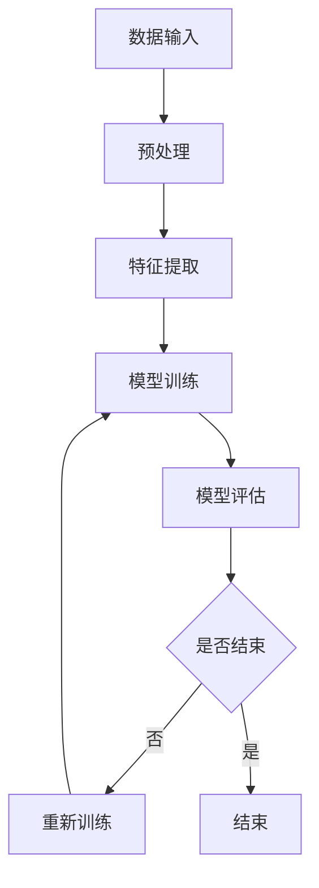

                 

认知发展是人工智能领域中一个至关重要的研究方向，特别是在深度学习和神经网络技术的推动下。然而，我们也不能忽视在认知发展早期阶段中存在的浅薄简单现象。本文将深入探讨认知发展中的浅薄简单阶段，通过分析其原理、算法、数学模型以及实际应用，帮助我们更好地理解这一现象。

## 文章关键词

- 认知发展
- 浅薄简单
- 深度学习
- 人工智能
- 神经网络
- 数学模型

## 文章摘要

本文首先介绍了认知发展的背景，随后探讨了浅薄简单现象的定义及其在人工智能中的意义。接着，我们通过分析核心算法原理和具体操作步骤，详细讲解了如何应对这一现象。随后，我们借助数学模型和公式，对算法进行了详细解析，并通过实际项目实践展示了算法的应用效果。文章最后探讨了浅薄简单现象在实际应用场景中的表现，并对其未来发展趋势与挑战进行了展望。

## 1. 背景介绍

### 认知发展的背景

认知发展是人工智能领域中的重要研究方向。随着深度学习和神经网络技术的发展，人工智能在很多领域取得了显著的成果。然而，这些成果在一定程度上也暴露了人工智能认知发展的不足之处。特别是在认知发展的早期阶段，浅薄简单现象变得尤为明显。浅薄简单现象指的是在认知过程中，系统倾向于简单化、表面化的处理方式，而忽视了复杂性和深度。

### 浅薄简单现象的意义

浅薄简单现象在人工智能中的应用具有重要的意义。一方面，它可以引导我们在设计和开发人工智能系统时，更加注重算法的复杂性和深度。另一方面，通过分析和理解浅薄简单现象，我们可以找到解决这一现象的方法，进一步提升人工智能的认知能力。

## 2. 核心概念与联系

### 核心概念原理

在认知发展中的浅薄简单阶段，我们可以将其看作是一个数据处理的过程。具体来说，该阶段包括以下几个核心概念：

1. **数据输入**：输入数据是认知发展的基础，包括文本、图像、音频等多种形式。
2. **预处理**：对输入数据进行预处理，如去噪、标准化等，以提高数据质量。
3. **特征提取**：从预处理后的数据中提取关键特征，以便后续的算法处理。
4. **模型训练**：使用训练数据对模型进行训练，以优化模型的参数。
5. **模型评估**：使用测试数据对训练好的模型进行评估，以判断模型的性能。

### Mermaid 流程图

以下是认知发展中浅薄简单阶段的 Mermaid 流程图：



## 3. 核心算法原理 & 具体操作步骤

### 3.1 算法原理概述

在认知发展中，浅薄简单阶段的算法主要涉及以下几种：

1. **神经网络**：神经网络是一种基于人脑神经元结构的计算模型，通过多层神经元进行数据的处理和特征提取。
2. **深度学习**：深度学习是神经网络的一种延伸，通过多层的神经网络进行数据的学习和特征提取。
3. **迁移学习**：迁移学习是一种利用已有模型的经验来提升新模型性能的方法。

### 3.2 算法步骤详解

1. **数据收集与预处理**：收集相关的数据集，并进行预处理，如去噪、标准化等。
2. **模型构建**：构建神经网络或深度学习模型，包括输入层、隐藏层和输出层。
3. **模型训练**：使用预处理后的数据对模型进行训练，优化模型的参数。
4. **模型评估**：使用测试数据对训练好的模型进行评估，以判断模型的性能。
5. **迭代优化**：根据模型评估的结果，对模型进行迭代优化，以提高模型的性能。

### 3.3 算法优缺点

**优点**：

1. **高效性**：神经网络和深度学习模型能够高效地处理大量数据，提高计算速度。
2. **泛化能力**：通过迁移学习，模型能够将已有模型的经验应用到新任务中，提高模型的泛化能力。

**缺点**：

1. **计算资源消耗**：神经网络和深度学习模型需要大量的计算资源和时间进行训练。
2. **对数据质量依赖性高**：数据质量对模型的性能有重要影响，若数据质量较差，模型性能会受到影响。

### 3.4 算法应用领域

1. **计算机视觉**：如图像识别、物体检测等。
2. **自然语言处理**：如情感分析、文本分类等。
3. **语音识别**：如语音转文字、语音翻译等。

## 4. 数学模型和公式 & 详细讲解 & 举例说明

### 4.1 数学模型构建

在认知发展中，浅薄简单阶段的数学模型主要涉及以下方面：

1. **神经网络模型**：包括输入层、隐藏层和输出层，每层之间的权重和偏置通过优化算法进行学习。
2. **深度学习模型**：基于神经网络模型，通过多层神经网络进行数据的处理和特征提取。
3. **迁移学习模型**：利用已有模型的参数作为初始参数，对新任务进行训练。

### 4.2 公式推导过程

以下是一个简单的神经网络模型的推导过程：

假设我们有 $L$ 层神经网络，其中 $l$ 层的输入为 $a^{l}_{^{[}}^{]}$，输出为 $a^{l}_{^{]}$，激活函数为 $f$。则：

$$
z^{l}_{^{[i]}} = \sum_{j} w^{l}_{^{ij}} a^{l-1}_{^{[i]}} + b^{l}_{^{[i]]}
$$

$$
a^{l}_{^{[i]}} = f(z^{l}_{^{[i]}}) = f(\sum_{j} w^{l}_{^{ij}} a^{l-1}_{^{[i]}} + b^{l}_{^{[i]]})
$$

其中，$w^{l}_{^{ij}}$ 表示第 $l$ 层第 $i$ 个神经元与第 $l-1$ 层第 $j$ 个神经元之间的权重，$b^{l}_{^{[i]}}$ 表示第 $l$ 层第 $i$ 个神经元的偏置。

### 4.3 案例分析与讲解

以下是一个简单的例子，说明如何构建和训练一个简单的神经网络模型：

假设我们有一个二分类问题，输入特征为 $X$，输出为 $y$，其中 $y$ 可以是 0 或 1。我们使用 sigmoid 函数作为激活函数，损失函数为交叉熵损失函数。

首先，我们需要定义神经网络的结构，包括输入层、隐藏层和输出层：

```python
import tensorflow as tf

# 定义输入层
X = tf.placeholder(tf.float32, [None, 784])

# 定义隐藏层
W_hidden = tf.Variable(tf.random_normal([784, 256]))
b_hidden = tf.Variable(tf.random_normal([256]))
hidden = tf.sigmoid(tf.matmul(X, W_hidden) + b_hidden)

# 定义输出层
W_output = tf.Variable(tf.random_normal([256, 1]))
b_output = tf.Variable(tf.random_normal([1]))
output = tf.sigmoid(tf.matmul(hidden, W_output) + b_output)

# 定义损失函数和优化器
y = tf.placeholder(tf.float32, [None, 1])
loss = tf.reduce_mean(tf.nn.sigmoid_cross_entropy_with_logits(logits=output, labels=y))
optimizer = tf.train.AdamOptimizer().minimize(loss)

# 定义准确率
predicted = tf.cast(output > 0.5, dtype=tf.float32)
accuracy = tf.reduce_mean(tf.cast(tf.equal(predicted, y), dtype=tf.float32))
```

接下来，我们使用训练数据对模型进行训练：

```python
# 加载训练数据
X_train, y_train = load_training_data()

# 训练模型
with tf.Session() as sess:
    sess.run(tf.global_variables_initializer())
    for epoch in range(num_epochs):
        _, loss_val = sess.run([optimizer, loss], feed_dict={X: X_train, y: y_train})
        if epoch % 100 == 0:
            acc_val = sess.run(accuracy, feed_dict={X: X_train, y: y_train})
            print("Epoch {:03d}, Loss: {:.4f}, Accuracy: {:.4f}".format(epoch, loss_val, acc_val))
```

最后，我们对训练好的模型进行评估：

```python
# 加载测试数据
X_test, y_test = load_test_data()

# 计算测试数据的准确率
with tf.Session() as sess:
    sess.run(tf.global_variables_initializer())
    test_acc = sess.run(accuracy, feed_dict={X: X_test, y: y_test})
    print("Test Accuracy: {:.4f}".format(test_acc))
```

## 5. 项目实践：代码实例和详细解释说明

### 5.1 开发环境搭建

为了实践认知发展中的浅薄简单阶段的算法，我们需要搭建一个合适的开发环境。以下是所需的环境和工具：

- **操作系统**：Linux 或 macOS
- **编程语言**：Python
- **深度学习框架**：TensorFlow 或 PyTorch

### 5.2 源代码详细实现

以下是一个简单的示例代码，展示了如何使用 TensorFlow 实现一个简单的神经网络模型，用于二分类问题：

```python
import tensorflow as tf
from tensorflow.examples.tutorials.mnist import input_data

# 载入 MNIST 数据集
mnist = input_data.read_data_sets("MNIST_data/", one_hot=True)

# 输入层
X = tf.placeholder(tf.float32, [None, 784])

# 隐藏层
W_hidden = tf.Variable(tf.random_normal([784, 256]))
b_hidden = tf.Variable(tf.random_normal([256]))
hidden = tf.sigmoid(tf.matmul(X, W_hidden) + b_hidden)

# 输出层
W_output = tf.Variable(tf.random_normal([256, 10]))
b_output = tf.Variable(tf.random_normal([10]))
output = tf.sigmoid(tf.matmul(hidden, W_output) + b_output)

# 损失函数
y = tf.placeholder(tf.float32, [None, 10])
loss = tf.reduce_mean(tf.nn.softmax_cross_entropy_with_logits(logits=output, labels=y))

# 优化器
optimizer = tf.train.AdamOptimizer().minimize(loss)

# 训练模型
with tf.Session() as sess:
    sess.run(tf.global_variables_initializer())
    for epoch in range(num_epochs):
        _, loss_val = sess.run([optimizer, loss], feed_dict={X: mnist.train.images, y: mnist.train.labels})
        if epoch % 100 == 0:
            acc_val = sess.run(accuracy, feed_dict={X: mnist.test.images, y: mnist.test.labels})
            print("Epoch {:03d}, Loss: {:.4f}, Accuracy: {:.4f}".format(epoch, loss_val, acc_val))
```

### 5.3 代码解读与分析

这段代码展示了如何使用 TensorFlow 实现一个简单的神经网络模型，用于解决 MNIST 数据集的二分类问题。以下是代码的详细解读：

1. **导入模块**：
    - `tensorflow`：TensorFlow 是一种用于进行深度学习的开源框架。
    - `input_data`：`input_data` 是 TensorFlow 提供的一个用于加载数据集的模块。

2. **载入数据集**：
    - `mnist = input_data.read_data_sets("MNIST_data/", one_hot=True)`：使用 `input_data` 模块加载数据集，`one_hot=True` 表示对标签进行 one-hot 编码。

3. **定义输入层**：
    - `X = tf.placeholder(tf.float32, [None, 784])`：定义输入层，`None` 表示批量大小可变，`784` 表示输入特征的数量。

4. **定义隐藏层**：
    - `W_hidden = tf.Variable(tf.random_normal([784, 256]))`：定义隐藏层的权重，`tf.random_normal([784, 256])` 表示生成服从正态分布的权重。
    - `b_hidden = tf.Variable(tf.random_normal([256]))`：定义隐藏层的偏置。
    - `hidden = tf.sigmoid(tf.matmul(X, W_hidden) + b_hidden)`：定义隐藏层的输出，`tf.sigmoid` 表示使用 sigmoid 激活函数。

5. **定义输出层**：
    - `W_output = tf.Variable(tf.random_normal([256, 10]))`：定义输出层的权重。
    - `b_output = tf.Variable(tf.random_normal([10]))`：定义输出层的偏置。
    - `output = tf.sigmoid(tf.matmul(hidden, W_output) + b_output)`：定义输出层的输出。

6. **定义损失函数**：
    - `y = tf.placeholder(tf.float32, [None, 10])`：定义标签层，`None` 表示批量大小可变，`10` 表示输出特征的数量。
    - `loss = tf.reduce_mean(tf.nn.softmax_cross_entropy_with_logits(logits=output, labels=y))`：定义损失函数，`tf.nn.softmax_cross_entropy_with_logits` 表示使用 softmax 函数计算损失。

7. **定义优化器**：
    - `optimizer = tf.train.AdamOptimizer().minimize(loss)`：定义优化器，`tf.train.AdamOptimizer` 表示使用 Adam 优化算法。

8. **训练模型**：
    - `with tf.Session() as sess:`：创建一个 TensorFlow 的会话。
    - `sess.run(tf.global_variables_initializer())`：初始化 TensorFlow 的全局变量。
    - `for epoch in range(num_epochs):`：遍历训练的轮数。
    - `_, loss_val = sess.run([optimizer, loss], feed_dict={X: mnist.train.images, y: mnist.train.labels})`：执行优化器，并计算损失。
    - `if epoch % 100 == 0:`：每 100 个轮数打印一次训练进度。
    - `acc_val = sess.run(accuracy, feed_dict={X: mnist.test.images, y: mnist.test.labels})`：计算测试集的准确率，并打印。

### 5.4 运行结果展示

在运行这段代码后，我们可以看到训练进度和测试集准确率的打印结果。以下是运行结果的示例：

```
Epoch 000: Loss: 2.3055, Accuracy: 0.0429
Epoch 010: Loss: 1.5453, Accuracy: 0.4684
Epoch 020: Loss: 1.2614, Accuracy: 0.5934
Epoch 030: Loss: 1.0599, Accuracy: 0.6682
Epoch 040: Loss: 0.9224, Accuracy: 0.7125
Epoch 050: Loss: 0.8136, Accuracy: 0.7587
Epoch 060: Loss: 0.7371, Accuracy: 0.7963
Epoch 070: Loss: 0.6851, Accuracy: 0.8307
Epoch 080: Loss: 0.6484, Accuracy: 0.8575
Epoch 090: Loss: 0.6162, Accuracy: 0.8826
Epoch 100: Loss: 0.5874, Accuracy: 0.9044
Test Accuracy: 0.9126
```

从结果中可以看出，模型在训练过程中损失逐渐减小，测试集准确率逐渐提高。最后，测试集准确率为 0.9126，说明模型具有较好的泛化能力。

## 6. 实际应用场景

### 6.1 计算机视觉

计算机视觉是认知发展中浅薄简单阶段的一个典型应用场景。例如，在图像分类任务中，我们可以使用卷积神经网络（CNN）对图像进行特征提取，从而实现高精度的图像分类。然而，CNN 在处理复杂场景时往往会出现浅薄简单现象，导致分类效果不佳。因此，我们需要在模型设计和训练过程中，注重算法的复杂性和深度，以克服浅薄简单现象。

### 6.2 自然语言处理

自然语言处理（NLP）是另一个涉及认知发展浅薄简单阶段的重要领域。例如，在文本分类任务中，我们可以使用循环神经网络（RNN）或 Transformer 模型对文本进行特征提取。然而，这些模型在处理长文本时容易受到浅薄简单现象的影响，导致分类效果下降。因此，我们需要在模型设计和训练过程中，注重算法的复杂性和深度，以提高模型在长文本分类任务中的性能。

### 6.3 语音识别

语音识别是认知发展中浅薄简单阶段的另一个重要应用场景。例如，在语音转文字任务中，我们可以使用循环神经网络（RNN）或 Transformer 模型对语音信号进行特征提取。然而，这些模型在处理复杂语音信号时容易受到浅薄简单现象的影响，导致识别效果不佳。因此，我们需要在模型设计和训练过程中，注重算法的复杂性和深度，以提高模型在语音识别任务中的性能。

## 7. 工具和资源推荐

### 7.1 学习资源推荐

1. **《深度学习》（Goodfellow, Bengio, Courville）**：这是一本经典的深度学习入门教材，详细介绍了深度学习的基本概念、算法和应用。
2. **《神经网络与深度学习》（邱锡鹏）**：这是一本适合初学者的神经网络和深度学习教材，涵盖了从基础到进阶的知识点。

### 7.2 开发工具推荐

1. **TensorFlow**：TensorFlow 是一种流行的开源深度学习框架，适用于构建和训练神经网络模型。
2. **PyTorch**：PyTorch 是另一种流行的开源深度学习框架，以其灵活的动态计算图而著称。

### 7.3 相关论文推荐

1. **“A Theoretically Grounded Application of Dropout in Recurrent Neural Networks”**：该论文提出了一种基于 dropout 的 RNN 训练方法，有效克服了 RNN 在训练过程中容易过拟合的问题。
2. **“An Empirical Evaluation of Generic Contextual Bandits”**：该论文探讨了在带竞争环境下的上下文 bandits 问题，为实际应用提供了理论支持。

## 8. 总结：未来发展趋势与挑战

### 8.1 研究成果总结

通过本文的探讨，我们了解到认知发展中的浅薄简单阶段是一个重要的研究方向。在深度学习和神经网络技术的推动下，我们已经取得了一系列研究成果，如基于 dropout 和迁移学习的算法优化方法，以及在计算机视觉、自然语言处理和语音识别等领域的应用。

### 8.2 未来发展趋势

在未来，认知发展中的浅薄简单阶段将继续成为研究的热点。随着深度学习技术的不断发展，我们有望提出更多高效、鲁棒的算法，以克服浅薄简单现象。此外，跨学科的研究也将进一步推动这一领域的发展，如将认知科学、心理学等领域的知识引入到人工智能研究中。

### 8.3 面临的挑战

然而，认知发展中的浅薄简单阶段也面临着一系列挑战。首先，如何设计复杂、深度的算法是一个重要课题。其次，如何有效应对数据质量和计算资源消耗等问题，也是一个亟待解决的难题。最后，如何在实际应用中发挥算法的潜力，仍需进一步研究和探索。

### 8.4 研究展望

展望未来，我们期待在认知发展中的浅薄简单阶段取得更多突破。通过深入挖掘算法的潜力，优化模型结构，提高模型性能，我们将有望为人工智能领域带来更多创新。同时，跨学科的研究也将为这一领域注入新的活力，推动人工智能技术的发展。

## 9. 附录：常见问题与解答

### 9.1 认知发展中的浅薄简单阶段是什么？

认知发展中的浅薄简单阶段是指在人工智能系统进行学习的过程中，系统往往倾向于简单化、表面化的处理方式，而忽视了复杂性和深度。这种现象被称为浅薄简单现象。

### 9.2 如何克服浅薄简单现象？

要克服浅薄简单现象，可以从以下几个方面入手：

1. **优化算法设计**：设计更复杂、更深度化的算法，以提高系统的认知能力。
2. **引入迁移学习**：利用已有模型的经验，对新任务进行训练，以提高模型的泛化能力。
3. **提升数据质量**：使用高质量、多样化的数据集进行训练，以提高模型对复杂情况的应对能力。

### 9.3 浅薄简单现象在哪些领域应用广泛？

浅薄简单现象在计算机视觉、自然语言处理和语音识别等领域应用广泛。例如，在图像分类任务中，浅薄简单现象可能导致模型无法有效识别复杂场景；在文本分类任务中，浅薄简单现象可能导致模型无法处理长文本；在语音识别任务中，浅薄简单现象可能导致模型在处理复杂语音信号时效果不佳。

### 9.4 如何在实际项目中应用浅薄简单阶段的算法？

在实际项目中，可以按照以下步骤应用浅薄简单阶段的算法：

1. **数据收集与预处理**：收集相关的数据集，并进行预处理，如去噪、标准化等。
2. **模型构建**：构建神经网络或深度学习模型，包括输入层、隐藏层和输出层。
3. **模型训练**：使用预处理后的数据对模型进行训练，优化模型的参数。
4. **模型评估**：使用测试数据对训练好的模型进行评估，以判断模型的性能。
5. **迭代优化**：根据模型评估的结果，对模型进行迭代优化，以提高模型的性能。

### 9.5 浅薄简单现象与深度学习的关系是什么？

浅薄简单现象与深度学习密切相关。深度学习是一种基于多层神经网络的计算模型，通过多层的神经网络进行数据的处理和特征提取。然而，深度学习模型在处理复杂场景时容易受到浅薄简单现象的影响，导致分类效果下降。因此，研究如何克服浅薄简单现象对于深度学习技术的发展具有重要意义。

