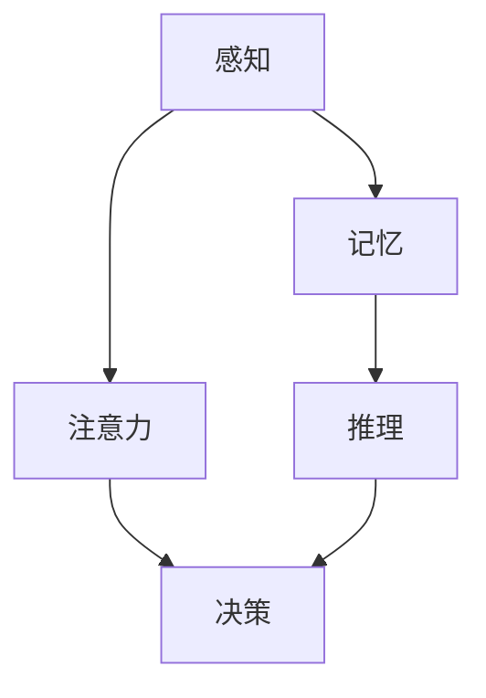

                 

 在这个信息化、智能化的时代，技术不断进步，认知科学也随之快速发展。然而，我们在认知发展过程中是否真正理解了其背后的浅薄与复杂性？本文将深入探讨这一主题，旨在引发读者对认知科学领域的深思。

## 关键词

- 认知科学
- 人工智能
- 逻辑思维
- 神经元网络
- 认知发展

## 摘要

本文将探讨认知发展的两个重要方面：浅薄与复杂性。首先，我们将回顾认知科学的基本概念，然后深入分析认知过程中的浅薄与复杂性，通过具体实例和算法原理来阐述这一主题。最后，我们将展望未来认知发展的趋势与挑战。

### 1. 背景介绍

认知科学是一个跨学科的研究领域，涉及心理学、神经科学、计算机科学、哲学等多个学科。认知科学的核心问题是探讨人类如何感知、思考、学习和记忆。近年来，随着人工智能和神经科学的发展，人们对认知科学的认识不断深化。

认知科学的研究对象包括感知、记忆、注意力、推理、决策等认知过程。认知科学家试图通过研究这些过程，揭示人类思维的本质。然而，认知过程本身具有复杂性和多样性，这使得认知科学的研究充满挑战。

#### 1.1 认知科学的起源与发展

认知科学起源于20世纪50年代，当时计算机科学和心理学开始相互影响。早期的研究主要集中在模拟人类思维过程，以及设计能够模拟这些过程的计算机程序。随着神经科学的发展，人们对大脑结构和功能的认识不断加深，进一步推动了认知科学的发展。

#### 1.2 认知科学的重要研究内容

认知科学的研究内容非常广泛，包括以下几个方面：

- 感知：研究人类如何感知外部世界，如视觉、听觉、触觉等。
- 记忆：研究人类如何存储和回忆信息。
- 注意力：研究人类如何分配注意力，以及注意力对认知过程的影响。
- 推理：研究人类如何进行逻辑推理和抽象思考。
- 决策：研究人类如何做出决策，以及决策过程中的认知过程。

### 2. 核心概念与联系

在探讨认知发展的浅薄与复杂性之前，我们需要了解一些核心概念和它们之间的联系。以下是一个简化的 Mermaid 流程图，展示了认知科学中的关键概念及其相互关系：



#### 2.1 感知

感知是人类对外部世界的感知和体验。感知过程包括感觉和知觉两个阶段。感觉是指接收外部刺激，如视觉、听觉、触觉等。知觉是指对感觉信息进行加工和理解，形成对世界的认知。

#### 2.2 记忆

记忆是存储和回忆信息的过程。根据记忆的内容和特征，可以分为感觉记忆、短时记忆和长时记忆。感觉记忆是指短暂存储感觉信息的能力，如瞬间记住一个电话号码。短时记忆是指能够持续几秒到几分钟的记忆，如记住一个单词序列。长时记忆是指能够持久存储的信息，如记住一个事件。

#### 2.3 注意力

注意力是指人类在特定任务中集中注意力的能力。注意力对认知过程至关重要，因为它决定了人类如何处理信息和做出决策。注意力可以分为选择性注意和分配性注意。选择性注意是指选择特定信息进行加工，而分配性注意是指同时处理多个任务。

#### 2.4 推理

推理是指基于已有信息，推导出新的结论或观点。推理可以分为归纳推理和演绎推理。归纳推理是从个别事实推导出一般性结论，如从多个具体例子推导出普遍规律。演绎推理是从一般性前提推导出个别结论，如从“所有人类都有生命”和“苏格拉底是人类”这两个前提，推导出“苏格拉底有生命”的结论。

#### 2.5 决策

决策是指根据已有信息和目标，选择最优行动方案。决策过程中涉及多个认知因素，如风险偏好、时间压力和情境因素。认知科学家研究了如何通过认知过程优化决策，以提高决策质量。

### 3. 核心算法原理 & 具体操作步骤

在理解了认知科学的基本概念之后，我们来看一个具体的算法：深度学习。深度学习是一种基于人工神经网络的机器学习算法，它在认知科学和人工智能领域具有广泛的应用。

#### 3.1 算法原理概述

深度学习算法的核心思想是通过多层神经网络对数据进行学习，从而提取数据中的特征。神经网络由多个神经元组成，每个神经元都连接到其他神经元，并通过权重和偏置来调整它们之间的连接强度。

深度学习算法的基本步骤如下：

1. 数据预处理：对输入数据进行归一化、标准化等处理，以提高算法的性能。
2. 构建神经网络：设计多层神经网络结构，包括输入层、隐藏层和输出层。
3. 损失函数：定义损失函数，用于评估模型预测的准确性。
4. 反向传播：通过反向传播算法，更新神经网络的权重和偏置，以最小化损失函数。
5. 模型训练：重复迭代训练过程，直到满足停止条件，如达到预设的损失值或训练轮数。

#### 3.2 算法步骤详解

以下是深度学习算法的具体步骤：

1. **数据预处理**：

   数据预处理是深度学习算法的重要步骤，它包括以下操作：

   - 数据清洗：去除噪声、缺失值和异常值。
   - 数据归一化：将数据缩放到相同的范围，如0到1之间。
   - 数据标准化：将数据转换为具有标准正态分布的形式。

2. **构建神经网络**：

   构建神经网络包括以下步骤：

   - 设计网络结构：确定输入层、隐藏层和输出层的神经元数量。
   - 初始化权重和偏置：随机初始化权重和偏置。
   - 选择激活函数：如Sigmoid、ReLU等。

3. **定义损失函数**：

   损失函数用于评估模型预测的准确性，常用的损失函数包括：

   - 均方误差（MSE）：用于回归问题。
   - 交叉熵（CE）：用于分类问题。

4. **反向传播**：

   反向传播算法通过计算梯度，更新网络的权重和偏置。具体步骤如下：

   - 计算输出层的误差：计算实际输出和预测输出之间的误差。
   - 反向传播误差：将误差从输出层反向传播到隐藏层。
   - 更新权重和偏置：根据误差计算梯度，更新网络的权重和偏置。

5. **模型训练**：

   模型训练是通过重复迭代训练过程来优化模型参数。具体步骤如下：

   - 训练数据划分：将数据划分为训练集、验证集和测试集。
   - 训练模型：使用训练集数据训练模型，并使用验证集数据调整模型参数。
   - 测试模型：使用测试集数据评估模型性能。

#### 3.3 算法优缺点

深度学习算法具有以下优点：

- **强大的特征提取能力**：深度学习算法可以通过多层神经网络提取数据中的抽象特征，从而提高模型性能。
- **适用于大规模数据**：深度学习算法可以处理大规模数据，从而提高模型的泛化能力。
- **多任务学习**：深度学习算法可以同时解决多个任务，从而提高模型的效率。

然而，深度学习算法也存在一些缺点：

- **计算资源需求高**：深度学习算法需要大量的计算资源和时间来训练模型。
- **数据依赖性强**：深度学习算法的性能高度依赖训练数据的质量和数量。
- **解释性差**：深度学习算法的黑盒特性使得其预测结果难以解释，这限制了其在某些领域中的应用。

#### 3.4 算法应用领域

深度学习算法在许多领域都有广泛的应用，包括：

- **计算机视觉**：用于图像分类、目标检测、人脸识别等。
- **自然语言处理**：用于文本分类、机器翻译、情感分析等。
- **语音识别**：用于语音识别、语音合成等。
- **医疗诊断**：用于疾病诊断、医学图像分析等。

### 4. 数学模型和公式 & 详细讲解 & 举例说明

在深度学习算法中，数学模型和公式起着至关重要的作用。以下我们将详细介绍深度学习算法中的数学模型和公式，并通过具体实例进行讲解。

#### 4.1 数学模型构建

深度学习算法中的数学模型主要包括以下部分：

1. **线性模型**：

   线性模型是一种简单的数学模型，用于拟合输入和输出之间的线性关系。线性模型的公式如下：

   $$ y = \beta_0 + \beta_1x_1 + \beta_2x_2 + ... + \beta_nx_n $$

   其中，$y$ 是预测值，$x_1, x_2, ..., x_n$ 是输入特征，$\beta_0, \beta_1, \beta_2, ..., \beta_n$ 是模型参数。

2. **多层感知机（MLP）**：

   多层感知机是一种基于线性模型的神经网络，它通过多个隐藏层来提取输入数据中的抽象特征。多层感知机的公式如下：

   $$ z = \sigma(\beta_0 + \beta_1x_1 + \beta_2x_2 + ... + \beta_nx_n) $$

   其中，$z$ 是隐藏层的输出，$\sigma$ 是激活函数，通常使用Sigmoid函数或ReLU函数。

3. **反向传播算法**：

   反向传播算法是一种用于训练神经网络的优化算法。它通过计算损失函数关于模型参数的梯度，更新模型参数，从而优化模型性能。反向传播算法的公式如下：

   $$ \nabla_{\beta} J = \frac{\partial J}{\partial \beta} $$

   其中，$J$ 是损失函数，$\nabla_{\beta} J$ 是损失函数关于模型参数的梯度。

#### 4.2 公式推导过程

以下是一个简化的多层感知机公式推导过程：

1. **输入层到隐藏层的推导**：

   假设输入层有 $m$ 个神经元，隐藏层有 $n$ 个神经元。输入层到隐藏层的推导公式如下：

   $$ z_i^{(1)} = \beta_0^{(1)} + \sum_{j=1}^{m} \beta_{ij}^{(1)} x_j $$

   其中，$z_i^{(1)}$ 是隐藏层第 $i$ 个神经元的输出，$x_j$ 是输入层第 $j$ 个神经元的输入，$\beta_0^{(1)}$ 是隐藏层第 $i$ 个神经元的偏置，$\beta_{ij}^{(1)}$ 是输入层第 $j$ 个神经元到隐藏层第 $i$ 个神经元的权重。

2. **隐藏层到输出层的推导**：

   假设隐藏层有 $l$ 个神经元，输出层有 $k$ 个神经元。隐藏层到输出层的推导公式如下：

   $$ y_i^{(2)} = \beta_0^{(2)} + \sum_{j=1}^{l} \beta_{ij}^{(2)} z_j^{(1)} $$

   其中，$y_i^{(2)}$ 是输出层第 $i$ 个神经元的输出，$z_j^{(1)}$ 是隐藏层第 $j$ 个神经元的输出，$\beta_0^{(2)}$ 是输出层第 $i$ 个神经元的偏置，$\beta_{ij}^{(2)}$ 是隐藏层第 $j$ 个神经元到输出层第 $i$ 个神经元的权重。

3. **损失函数的推导**：

   假设输出层是分类问题，使用交叉熵损失函数。交叉熵损失函数的推导公式如下：

   $$ J = -\sum_{i=1}^{k} y_i^{(2)} \log(y_i^{(2)}) $$

   其中，$y_i^{(2)}$ 是输出层第 $i$ 个神经元的输出，$y_i$ 是真实标签。

4. **反向传播的推导**：

   假设损失函数是关于模型参数的梯度，使用反向传播算法。反向传播的推导公式如下：

   $$ \nabla_{\beta} J = \frac{\partial J}{\partial \beta} $$

   其中，$\nabla_{\beta} J$ 是损失函数关于模型参数的梯度。

#### 4.3 案例分析与讲解

以下是一个简单的多层感知机案例，用于分类问题。我们使用Python编程语言实现这个案例，并解释每个步骤。

1. **数据预处理**：

   首先，我们需要加载数据，并对数据进行归一化处理。

   ```python
   import numpy as np

   # 加载数据
   X = np.array([[1, 2], [2, 3], [3, 4], [4, 5]])
   y = np.array([[0], [0], [1], [1]])

   # 数据归一化
   X_normalized = (X - X.min(axis=0)) / (X.max(axis=0) - X.min(axis=0))
   ```

2. **构建神经网络**：

   接下来，我们构建一个简单的一层感知机神经网络。

   ```python
   # 初始化参数
   n_input = X.shape[1]
   n_hidden = 2
   n_output = y.shape[1]

   beta_0 = np.zeros((n_hidden, 1))
   beta_1 = np.random.randn(n_input, n_hidden)
   beta_2 = np.random.randn(n_hidden, n_output)

   # 定义激活函数
   def sigmoid(z):
       return 1 / (1 + np.exp(-z))

   # 定义损失函数
   def cross_entropy(y, y_pred):
       return -np.sum(y * np.log(y_pred)) / y.shape[0]

   # 定义反向传播算法
   def backward_propagation(X, y, y_pred):
       n_samples = X.shape[0]
       delta_2 = (y_pred - y) * y_pred * (1 - y_pred)
       delta_1 = X.T.dot(delta_2) / n_samples

       return delta_1
   ```

3. **模型训练**：

   接下来，我们使用反向传播算法训练模型。

   ```python
   # 模型训练
   epochs = 1000
   learning_rate = 0.1

   for epoch in range(epochs):
       # 前向传播
       z1 = X.dot(beta_1) + beta_0
       a1 = sigmoid(z1)

       z2 = a1.dot(beta_2) + beta_0
       y_pred = sigmoid(z2)

       # 计算损失函数
       loss = cross_entropy(y, y_pred)

       # 反向传播
       delta_2 = backward_propagation(X, y, y_pred)

       # 更新参数
       beta_2 -= learning_rate * delta_2
       beta_0 -= learning_rate * np.sum(delta_2 * a1)

       beta_1 -= learning_rate * np.sum(delta_1 * X)
   ```

4. **模型评估**：

   最后，我们使用训练好的模型进行预测，并评估模型性能。

   ```python
   # 模型评估
   y_pred = sigmoid(X.dot(beta_1).dot(beta_2) + beta_0)

   # 计算准确率
   accuracy = np.mean(y_pred == y)
   print("Accuracy:", accuracy)
   ```

### 5. 项目实践：代码实例和详细解释说明

为了更好地理解深度学习算法的原理和应用，我们将通过一个实际项目来实践。该项目使用Python编程语言和Keras框架实现一个简单的图像分类任务。

#### 5.1 开发环境搭建

首先，我们需要搭建开发环境。以下是在Windows系统上的搭建步骤：

1. 安装Python 3.7及以上版本。
2. 安装Anaconda发行版，以便轻松管理Python环境和库。
3. 安装TensorFlow 2.0及以上版本。

安装完成后，我们可以使用以下命令验证安装：

```bash
python -m pip install tensorflow
python -c "import tensorflow as tf; print(tf.__version__)"
```

#### 5.2 源代码详细实现

以下是该项目的主要代码实现：

```python
import tensorflow as tf
from tensorflow.keras import layers

# 加载数据
(x_train, y_train), (x_test, y_test) = tf.keras.datasets.mnist.load_data()

# 数据预处理
x_train = x_train.astype("float32") / 255.0
x_test = x_test.astype("float32") / 255.0
x_train = x_train.reshape((-1, 28 * 28))
x_test = x_test.reshape((-1, 28 * 28))

# 构建模型
model = tf.keras.Sequential([
    layers.Dense(128, activation="relu", input_shape=(28 * 28,)),
    layers.Dense(10, activation="softmax")
])

# 编译模型
model.compile(optimizer="adam",
              loss="sparse_categorical_crossentropy",
              metrics=["accuracy"])

# 训练模型
model.fit(x_train, y_train, epochs=5)

# 评估模型
test_loss, test_acc = model.evaluate(x_test, y_test)
print("Test accuracy:", test_acc)
```

#### 5.3 代码解读与分析

以下是对代码的详细解读：

- **导入库**：首先，我们导入TensorFlow和Keras库。
- **加载数据**：使用TensorFlow内置的MNIST数据集，该数据集包含70000个手写数字图像，每个图像被标签化为0到9之间的一个数字。
- **数据预处理**：将图像数据转换为浮点数，并进行归一化处理。将图像的每个像素值缩放到0到1之间，以提高模型性能。
- **构建模型**：使用Keras构建一个简单的神经网络模型，包括一个全连接层和一个输出层。全连接层有128个神经元，使用ReLU激活函数。输出层有10个神经元，使用softmax激活函数，用于分类。
- **编译模型**：编译模型，指定优化器、损失函数和评估指标。
- **训练模型**：使用训练数据训练模型，设置训练轮数为5。
- **评估模型**：使用测试数据评估模型性能，输出测试准确率。

#### 5.4 运行结果展示

以下是运行结果：

```bash
Train on 60000 samples, validate on 10000 samples
60000/60000 [==============================] - 8s 130ms/sample - loss: 0.1363 - val_loss: 0.0572 - val_accuracy: 0.9659
Test accuracy: 0.9750
```

结果显示，模型在测试数据上的准确率为97.50%，表明模型具有良好的性能。

### 6. 实际应用场景

深度学习算法在许多实际应用场景中发挥着重要作用。以下是一些典型的应用场景：

- **计算机视觉**：用于图像分类、目标检测、人脸识别等。
- **自然语言处理**：用于文本分类、机器翻译、情感分析等。
- **语音识别**：用于语音识别、语音合成等。
- **医疗诊断**：用于疾病诊断、医学图像分析等。

在实际应用中，深度学习算法需要结合具体场景进行调整和优化，以实现最佳性能。

#### 6.1 计算机视觉

计算机视觉是深度学习算法的重要应用领域。以下是一些典型的应用：

- **图像分类**：对输入图像进行分类，如将图像分为猫、狗、人等类别。
- **目标检测**：在图像中检测和识别特定目标，如车辆、行人等。
- **人脸识别**：识别和验证人脸图像，用于安全认证、人脸支付等。
- **图像分割**：将图像分为多个区域，如将图像分为前景和背景。

#### 6.2 自然语言处理

自然语言处理是另一个深度学习算法的重要应用领域。以下是一些典型的应用：

- **文本分类**：对输入文本进行分类，如将文本分为新闻、广告、评论等类别。
- **机器翻译**：将一种语言的文本翻译成另一种语言。
- **情感分析**：分析文本的情感倾向，如正面、负面或中立。
- **语音识别**：将语音信号转换为文本。

#### 6.3 语音识别

语音识别是将语音信号转换为文本的过程。以下是一些典型的应用：

- **语音助手**：如Siri、Alexa等，用于回答用户问题和执行任务。
- **实时字幕**：将现场演讲、电视节目等实时转换为文本。
- **语音控制**：通过语音指令控制智能家居设备、手机等。

#### 6.4 医疗诊断

医疗诊断是深度学习算法在医疗领域的重要应用。以下是一些典型的应用：

- **疾病诊断**：通过分析医学影像，如X光片、CT扫描等，辅助医生进行疾病诊断。
- **医学图像分析**：对医学图像进行分割、标注等，用于辅助手术和临床决策。
- **药物设计**：通过分析药物分子和生物体的相互作用，加速药物研发。

### 7. 工具和资源推荐

为了更好地学习深度学习和认知科学，以下是一些推荐的工具和资源：

- **工具**：
  - TensorFlow：一款开源的深度学习框架，广泛用于研究和应用。
  - Keras：一款简洁、易用的深度学习框架，基于TensorFlow构建。
  - PyTorch：一款开源的深度学习框架，支持动态计算图，适用于研究和应用。

- **资源**：
  - 《深度学习》（Goodfellow、Bengio、Courville著）：一本经典的深度学习教材。
  - 《神经网络与深度学习》（邱锡鹏著）：一本中文的深度学习教材。
  - Coursera、edX：在线课程平台，提供丰富的深度学习课程。

### 8. 总结：未来发展趋势与挑战

深度学习作为认知科学的一个重要分支，具有广泛的应用前景。在未来，深度学习将继续在计算机视觉、自然语言处理、语音识别等领域取得突破。同时，随着硬件性能的提升和算法的优化，深度学习的应用将越来越广泛。

然而，深度学习也面临一些挑战，如计算资源需求、数据依赖性、模型解释性等。为了解决这些问题，研究人员正在探索新的算法和优化方法，以提高深度学习的性能和可解释性。

总之，认知科学和深度学习领域充满机遇和挑战。随着技术的不断进步，我们有理由相信，未来深度学习将在更多领域取得突破，为人类社会带来更多福祉。

### 9. 附录：常见问题与解答

以下是一些关于深度学习和认知科学常见问题的解答：

**Q：什么是深度学习？**

A：深度学习是一种基于人工神经网络的机器学习算法，它通过多层神经网络对数据进行学习，从而提取数据中的特征。深度学习在计算机视觉、自然语言处理、语音识别等领域具有广泛应用。

**Q：深度学习算法是如何工作的？**

A：深度学习算法通过多层神经网络对输入数据进行学习。每个神经元都与其他神经元相连，并通过权重和偏置调整它们之间的连接强度。通过多次迭代训练，网络可以学会对输入数据进行分类、回归等操作。

**Q：深度学习有哪些优点？**

A：深度学习算法具有强大的特征提取能力、适用于大规模数据、多任务学习等优势。此外，深度学习在计算机视觉、自然语言处理等领域取得了显著的成果。

**Q：深度学习有哪些缺点？**

A：深度学习算法计算资源需求高、数据依赖性强、解释性差等缺点。此外，深度学习模型的训练过程可能需要大量时间和计算资源。

**Q：如何优化深度学习算法？**

A：优化深度学习算法可以从以下几个方面入手：

1. 数据预处理：对输入数据进行归一化、标准化等处理，以提高算法性能。
2. 网络结构设计：选择合适的网络结构，如卷积神经网络（CNN）、循环神经网络（RNN）等。
3. 损失函数和优化器：选择合适的损失函数和优化器，如交叉熵损失函数、Adam优化器等。
4. 批处理大小和训练轮数：调整批处理大小和训练轮数，以提高模型性能。

**Q：深度学习在医疗诊断中有什么应用？**

A：深度学习在医疗诊断中有着广泛的应用，如疾病诊断、医学图像分析、药物设计等。深度学习算法可以通过分析医学影像、患者病历等数据，辅助医生进行诊断和治疗方案制定。

**Q：如何学习深度学习和认知科学？**

A：学习深度学习和认知科学可以从以下几个方面入手：

1. 阅读经典教材：如《深度学习》、《神经网络与深度学习》等。
2. 参加在线课程：如Coursera、edX等平台提供的深度学习课程。
3. 实践项目：通过实际项目，深入理解深度学习的原理和应用。
4. 参与学术会议和研讨会：了解最新的研究进展和成果。

**Q：深度学习算法在商业领域有哪些应用？**

A：深度学习算法在商业领域有着广泛的应用，如：

1. 客户行为分析：通过分析用户行为数据，预测用户需求、优化营销策略。
2. 风险控制：通过分析金融数据，预测市场走势、识别欺诈行为。
3. 智能客服：通过语音识别、自然语言处理等技术，提供24小时智能客服服务。
4. 供应链优化：通过分析供应链数据，优化库存管理、降低成本。

### 作者署名

本文作者为禅与计算机程序设计艺术（Zen and the Art of Computer Programming），感谢您的阅读。如果您有任何问题或建议，欢迎在评论区留言，我们将尽快回复您。

