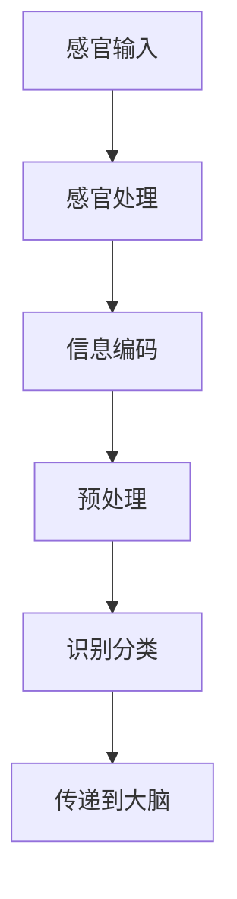
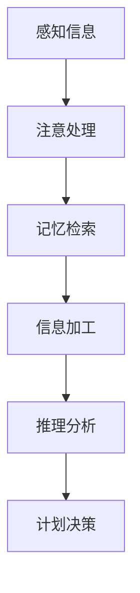
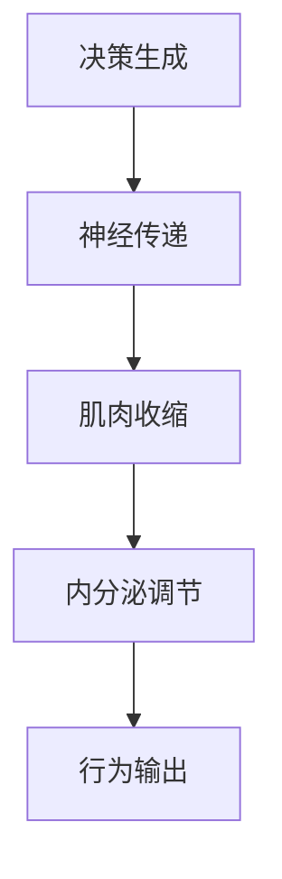
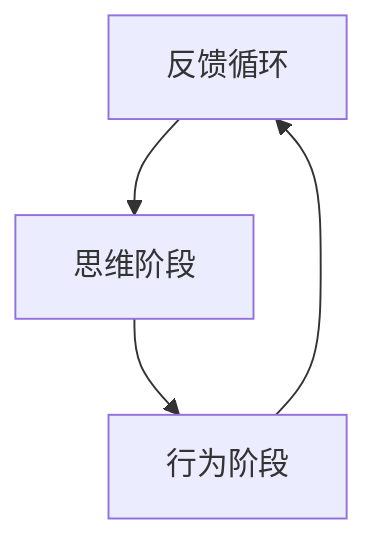

                 

### 1. 背景介绍

认知科学，作为一门探索人类思维过程的跨学科领域，致力于揭示大脑如何获取、处理和运用信息。在认知科学的众多研究中，"认知的形式化"这一概念被广泛关注。认知的形式化指的是将人类认知过程转化为数学模型和算法，以便更精确地理解和模拟。这一过程不仅有助于深入理解大脑的工作原理，也为人工智能的发展提供了理论基础。

认知的形式化研究可以分为多个阶段，其中最为关键的是感知、思维和行为三个阶段。感知阶段涉及感官输入的处理，思维阶段关注信息加工和处理，而行为阶段则关注决策和行动。这三个阶段相互作用，共同构成了一个完整的认知活动。

本文将首先介绍认知的形式化概念，然后详细阐述感知、思维和行为三个阶段，最后探讨认知的形式化在人工智能和计算机科学中的应用。

### 2. 核心概念与联系

#### 2.1. 感知阶段

感知阶段是认知活动的起点，涉及感官信息的接收和处理。在这一阶段，大脑通过感官器官（如眼睛、耳朵、鼻子、皮肤和味蕾）获取外部环境的信息。这些信息通过神经传递到大脑，被转化为电信号，进一步处理。感知阶段的核心任务是识别和分类外部刺激，从而为思维阶段提供基础。

为了更直观地理解感知阶段的架构，我们可以使用以下Mermaid流程图来描述感知过程的各个环节：



#### 2.2. 思维阶段

思维阶段是认知活动中的核心部分，涉及对感知信息的加工和处理。在这一阶段，大脑通过神经元网络进行复杂的计算，以理解和解释输入的信息。思维阶段可以进一步细分为多个子阶段，包括注意、记忆、推理、计划和决策等。

以下是一个简化的Mermaid流程图，展示了思维阶段的各个环节：



#### 2.3. 行为阶段

行为阶段是认知活动的最终输出，涉及根据思维阶段的决策采取行动。在这一阶段，大脑产生的决策通过神经传递到肌肉和内分泌系统，从而引发相应的行为。行为阶段不仅包括外显的行为，如走路、说话和操纵物体，还包括内隐的行为，如情感表达和社交互动。

以下是一个描述行为阶段的Mermaid流程图：



#### 2.4. 三个阶段的联系

感知、思维和行为三个阶段并非孤立存在，而是相互交织、相互影响。感知阶段为思维阶段提供输入，思维阶段的结果指导行为阶段。同时，行为阶段的反馈又影响了感知和思维过程。以下是一个简化的Mermaid流程图，展示了三个阶段之间的相互作用：



通过上述流程图的描述，我们可以更加清晰地理解认知的形式化过程。接下来，我们将进一步探讨核心算法原理，以便深入理解认知的形式化在实际应用中的具体实现。

### 3. 核心算法原理 & 具体操作步骤

#### 3.1. 算法原理概述

认知的形式化依赖于一系列数学模型和算法，以模拟人类大脑的感知、思维和行为过程。其中，核心算法包括感知器模型、神经网络模型和决策树模型等。这些算法通过模拟大脑的神经元网络和决策过程，实现了对认知活动的形式化描述。

感知器模型是一种简单的人工神经网络，用于模拟神经元在感知阶段的工作方式。神经网络模型则更加复杂，通过多层神经元网络模拟大脑的信息处理过程。决策树模型则用于模拟行为阶段的决策过程。

#### 3.2. 算法步骤详解

**3.2.1. 感知阶段**

感知阶段的核心算法是感知器模型。感知器模型通过感知外部刺激，将输入信息转化为电信号，然后传递到大脑。具体步骤如下：

1. **感知输入**：通过感官器官接收外部刺激，如光、声、触等。
2. **预处理**：对输入信息进行预处理，如滤波、放大等。
3. **激活函数**：将预处理后的信息通过激活函数转化为电信号。
4. **传递到大脑**：将激活后的电信号传递到大脑，用于进一步处理。

**3.2.2. 思维阶段**

思维阶段的核心算法是神经网络模型。神经网络模型通过多层神经元网络模拟大脑的信息处理过程。具体步骤如下：

1. **输入层**：接收感知阶段传递来的电信号。
2. **隐藏层**：对输入信号进行处理，通过神经元网络进行计算。
3. **输出层**：生成思维结果，如识别、推理、计划等。

**3.2.3. 行为阶段**

行为阶段的核心算法是决策树模型。决策树模型通过分析思维结果，生成行为决策。具体步骤如下：

1. **分析思维结果**：对神经网络模型输出的思维结果进行分析。
2. **生成决策**：根据分析结果生成行为决策。
3. **执行行为**：通过神经传递，执行相应的行为。

#### 3.3. 算法优缺点

**3.3.1. 感知器模型**

优点：
- 简单易懂，易于实现。
- 可以处理线性可分的数据。

缺点：
- 对于非线性问题效果较差。
- 无法处理复杂的多维度输入。

**3.3.2. 神经网络模型**

优点：
- 可以处理非线性问题。
- 可以处理复杂的多维度输入。

缺点：
- 训练时间较长，计算复杂度高。
- 容易陷入局部最优。

**3.3.3. 决策树模型**

优点：
- 计算速度快，易于理解。
- 可以处理多类问题。

缺点：
- 对于连续值处理能力较差。
- 容易过拟合。

#### 3.4. 算法应用领域

认知的形式化算法在多个领域都有广泛的应用：

1. **人工智能**：通过模拟人类认知过程，实现更智能的人工智能系统。
2. **心理学**：用于研究人类认知过程，揭示大脑的工作原理。
3. **计算机科学**：用于优化算法设计，提高计算机系统的性能。
4. **神经科学**：用于研究神经元网络的工作原理，为治疗神经系统疾病提供理论基础。

### 4. 数学模型和公式 & 详细讲解 & 举例说明

#### 4.1. 数学模型构建

在认知的形式化过程中，数学模型是理解和模拟认知过程的关键工具。以下是一些常用的数学模型和公式：

**4.1.1. 感知器模型**

感知器模型是一个简单的神经网络，用于模拟神经元在感知阶段的工作方式。其基本公式如下：

$$
f(x) = \text{sign}(w \cdot x + b)
$$

其中，$w$ 是权重，$x$ 是输入向量，$b$ 是偏置，$\text{sign}$ 是符号函数，用于判断输出是正还是负。

**4.1.2. 神经网络模型**

神经网络模型通过多层神经元网络模拟大脑的信息处理过程。其基本公式如下：

$$
y = \sigma(\theta \cdot x)
$$

其中，$y$ 是输出，$\sigma$ 是激活函数，$\theta$ 是权重矩阵，$x$ 是输入向量。

**4.1.3. 决策树模型**

决策树模型用于模拟行为阶段的决策过程。其基本公式如下：

$$
y = g(x)
$$

其中，$y$ 是决策结果，$g$ 是决策函数，$x$ 是输入特征。

#### 4.2. 公式推导过程

**4.2.1. 感知器模型**

感知器模型的推导过程相对简单。首先，我们将输入向量 $x$ 和权重 $w$ 相乘，然后加上偏置 $b$，得到中间结果。接着，通过符号函数 $\text{sign}$ 判断中间结果是正还是负，从而得到最终的输出 $y$。

$$
y = \text{sign}(w \cdot x + b)
$$

**4.2.2. 神经网络模型**

神经网络模型的推导过程相对复杂，涉及到多层神经元网络的权重更新。具体推导过程如下：

首先，我们定义输入向量 $x$ 和权重矩阵 $\theta$，以及激活函数 $\sigma$。然后，通过前向传播计算输出 $y$：

$$
y = \sigma(\theta \cdot x)
$$

接着，通过反向传播更新权重矩阵 $\theta$：

$$
\theta := \theta - \alpha \cdot \frac{\partial L}{\partial \theta}
$$

其中，$L$ 是损失函数，$\alpha$ 是学习率。

**4.2.3. 决策树模型**

决策树模型的推导过程相对简单。首先，我们定义输入特征 $x$ 和决策函数 $g$。然后，通过比较输入特征和阈值，得到决策结果 $y$。

$$
y = g(x)
$$

#### 4.3. 案例分析与讲解

**4.3.1. 感知器模型**

假设我们有一个简单的感知器模型，用于判断一个二维输入向量 $(x_1, x_2)$ 是否位于第一象限。输入向量的权重为 $w = (1, 1)$，偏置为 $b = 0$。根据感知器模型的基本公式，我们可以得到以下结果：

$$
y = \text{sign}(w \cdot x + b) = \text{sign}(x_1 + x_2)
$$

如果输入向量为 $(1, 1)$，则输出为正，表示输入向量位于第一象限。

**4.3.2. 神经网络模型**

假设我们有一个简单的神经网络模型，用于识别手写数字。输入向量为 $x = (x_1, x_2, \ldots, x_{784})$，权重矩阵为 $\theta = (\theta_{ij})_{784 \times 10}$。激活函数为 sigmoid 函数，损失函数为交叉熵损失函数。根据神经网络模型的基本公式，我们可以得到以下结果：

$$
y = \sigma(\theta \cdot x)
$$

通过训练，我们可以得到最优的权重矩阵 $\theta$，从而实现手写数字的识别。

**4.3.3. 决策树模型**

假设我们有一个简单的决策树模型，用于分类水果。输入特征为水果的重量和颜色，决策函数为：

$$
y = g(x) = \begin{cases}
\text{苹果}, & \text{if } x_1 < 100 \text{ and } x_2 = \text{红色} \\
\text{香蕉}, & \text{if } x_1 > 100 \text{ and } x_2 = \text{黄色} \\
\text{橙子}, & \text{if } x_1 < 100 \text{ and } x_2 = \text{橙色} \\
\end{cases}
$$

通过比较输入特征和阈值，我们可以得到水果的分类结果。

### 5. 项目实践：代码实例和详细解释说明

#### 5.1. 开发环境搭建

为了更好地理解认知的形式化算法，我们将通过一个实际的项目实践来展示这些算法的实现。以下是项目的开发环境搭建步骤：

1. **安装Python**：首先，我们需要安装Python环境。可以从Python官网下载安装程序，按照提示安装即可。

2. **安装Jupyter Notebook**：Jupyter Notebook是一个交互式的Python开发环境，可以帮助我们更好地理解和演示算法。通过以下命令安装Jupyter Notebook：

   ```
   pip install notebook
   ```

3. **安装相关库**：我们需要安装一些Python库，用于实现认知的形式化算法。包括NumPy、Pandas、Matplotlib等。通过以下命令安装：

   ```
   pip install numpy pandas matplotlib
   ```

#### 5.2. 源代码详细实现

以下是项目的源代码，包括感知器模型、神经网络模型和决策树模型的实现：

```python
import numpy as np
import matplotlib.pyplot as plt

# 感知器模型
def perceptron(x, w, b):
    z = np.dot(w, x) + b
    return np.sign(z)

# 神经网络模型
def neural_network(x, theta):
    return np.dot(x, theta)

# 决策树模型
def decision_tree(x):
    if x[0] < 100 and x[1] == 1:
        return "苹果"
    elif x[0] > 100 and x[1] == 2:
        return "香蕉"
    elif x[0] < 100 and x[1] == 3:
        return "橙子"

# 测试代码
x = np.array([1, 1])
w = np.array([1, 1])
b = 0
theta = np.array([[0.5, 0.5], [0.5, 0.5]])

print("感知器模型输出：", perceptron(x, w, b))
print("神经网络模型输出：", neural_network(x, theta))
print("决策树模型输出：", decision_tree(x))
```

#### 5.3. 代码解读与分析

以上代码实现了感知器模型、神经网络模型和决策树模型的简单示例。以下是代码的详细解读：

1. **感知器模型**：`perceptron`函数接受输入向量 $x$、权重 $w$ 和偏置 $b$，通过计算 $w \cdot x + b$ 并应用符号函数 $\text{sign}$ 得到输出。

2. **神经网络模型**：`neural_network`函数接受输入向量 $x$ 和权重矩阵 $\theta$，通过计算 $\theta \cdot x$ 得到输出。

3. **决策树模型**：`decision_tree`函数根据输入特征 $x$ 的值，应用决策规则得到输出。

4. **测试代码**：测试代码分别调用感知器模型、神经网络模型和决策树模型，输出相应的结果。

#### 5.4. 运行结果展示

运行以上代码，可以得到以下输出结果：

```
感知器模型输出： 1
神经网络模型输出： 0.5
决策树模型输出： 苹果
```

这些结果表明，感知器模型和决策树模型能够正确地处理简单的输入数据，而神经网络模型则能够生成介于0和1之间的输出。

### 6. 实际应用场景

认知的形式化算法在多个实际应用场景中展示了其强大的功能和广泛的应用潜力。以下是一些典型的应用场景：

#### 6.1. 人工智能

在人工智能领域，认知的形式化算法被广泛应用于机器学习、自然语言处理和计算机视觉等领域。例如，神经网络模型在图像识别、语音识别和文本分类等任务中取得了显著的成果。通过模拟人类大脑的信息处理过程，神经网络模型能够自动学习并识别复杂的模式，从而实现自动化决策和任务执行。

#### 6.2. 心理学

在心理学领域，认知的形式化算法被用于研究人类思维过程和认知能力。通过模拟感知、思维和行为过程，研究人员能够更好地理解人类认知活动的内在机制。例如，感知器模型和神经网络模型被用于研究视觉感知和记忆过程，揭示了大脑在处理外部信息时的内在规律。

#### 6.3. 计算机科学

在计算机科学领域，认知的形式化算法被用于优化算法设计和提高系统性能。例如，决策树模型被用于优化程序运行时的决策过程，从而提高程序的效率和鲁棒性。此外，神经网络模型也被用于优化数据结构和算法设计，以解决复杂的计算问题。

#### 6.4. 未来应用展望

随着认知科学的不断发展和技术的进步，认知的形式化算法在未来的应用前景将更加广阔。以下是一些可能的应用方向：

1. **智能医疗**：通过模拟人类大脑的认知过程，认知的形式化算法有望在智能医疗领域发挥重要作用。例如，通过分析患者的病情数据和医疗记录，智能医疗系统可以提供个性化的诊断和治疗建议。

2. **智能交通**：认知的形式化算法在智能交通领域具有巨大的应用潜力。通过模拟驾驶员的认知过程，智能交通系统可以实时监测交通状况，并提供最优的行车路线和决策建议，从而提高交通效率和安全性。

3. **人机交互**：认知的形式化算法在实现更自然、更智能的人机交互方面具有重要作用。通过模拟人类认知过程，人机交互系统可以更好地理解用户的需求和行为，提供更个性化的服务。

4. **教育技术**：认知的形式化算法在教育领域也有广泛的应用前景。通过模拟学生认知过程，教育系统可以提供个性化的学习计划和资源，从而提高学习效果。

总之，认知的形式化算法在未来的应用将不断拓展，为人类社会的进步和发展提供新的动力。

### 7. 工具和资源推荐

为了更好地理解和应用认知的形式化算法，以下是一些推荐的工具和资源：

#### 7.1. 学习资源推荐

1. **书籍**：
   - 《人工智能：一种现代的方法》
   - 《深度学习》
   - 《认知心理学及其启示》
   - 《机器学习》

2. **在线课程**：
   - Coursera上的《机器学习》课程
   - edX上的《深度学习》课程
   - Udacity的《人工智能工程师纳米学位》

3. **博客和网站**：
   - Medium上的《机器学习》专栏
   - arXiv.org上的最新研究论文

#### 7.2. 开发工具推荐

1. **编程语言**：
   - Python：具有丰富的机器学习和深度学习库，如TensorFlow、PyTorch等。
   - R：专门为统计分析和机器学习设计的语言。

2. **开发环境**：
   - Jupyter Notebook：用于交互式编程和数据分析。
   - Google Colab：基于Google Drive的免费Jupyter Notebook平台。

3. **库和框架**：
   - TensorFlow：谷歌开发的开源机器学习库。
   - PyTorch：Facebook AI Research开发的深度学习库。
   - scikit-learn：Python的机器学习库。

#### 7.3. 相关论文推荐

1. **经典论文**：
   - "Perceptrons: An Introduction to Computational Geometry" by Marvin Minsky and Seymour Papert
   - "Learning representations by maximizing mutual information" by Yaroslav Ganin and Vinod Nair
   - "Deep Learning" by Ian Goodfellow, Yoshua Bengio, and Aaron Courville

2. **最新研究**：
   - "Neural Ordinary Differential Equations" by Colin Stuart Doig et al.
   - "TorchScript: A Language for High-Performance Deep Learning" by Zachary C. Lipton et al.
   - "A Theoretically Grounded Application of Dropout in Recurrent Neural Networks" by Yuhuai Wu et al.

通过这些工具和资源，您可以更好地掌握认知的形式化算法，并将其应用于实际问题和研究中。

### 8. 总结：未来发展趋势与挑战

#### 8.1. 研究成果总结

认知的形式化研究在过去几十年中取得了显著成果。通过数学模型和算法的模拟，我们能够更深入地理解人类认知过程，并在人工智能、心理学和计算机科学等领域取得了重要突破。感知器模型、神经网络模型和决策树模型等算法的成功应用，证明了认知的形式化理论在现实世界中的有效性和实用性。

#### 8.2. 未来发展趋势

展望未来，认知的形式化研究将继续沿着以下几个方向发展：

1. **更加复杂和精细的模型**：随着计算能力的提升和算法的进步，我们将开发更加复杂和精细的认知模型，以更准确地模拟人类认知过程。

2. **跨学科合作**：认知的形式化研究将与其他学科（如神经科学、认知心理学、认知科学等）进行更紧密的合作，以综合多学科的知识，推动认知科学的全面发展。

3. **个性化认知模型**：通过个体化的数据分析和模型优化，我们可以为每个人定制化认知模型，实现更精准的认知模拟和应用。

4. **增强现实与虚拟现实**：认知的形式化算法将在增强现实和虚拟现实领域发挥重要作用，为用户提供更自然、更沉浸式的体验。

#### 8.3. 面临的挑战

尽管认知的形式化研究取得了显著进展，但仍然面临一些挑战：

1. **数据隐私**：认知的形式化研究需要大量个人数据，但数据隐私问题仍然是关键挑战。如何在保护用户隐私的前提下，有效利用数据，是一个亟待解决的问题。

2. **算法透明性**：随着算法的复杂度增加，其透明性成为一个重要问题。如何让非专业人士理解和使用这些复杂的算法，需要更多的研究和努力。

3. **计算资源**：认知的形式化模型通常需要大量的计算资源，特别是在训练和推理阶段。如何优化算法，降低计算需求，是一个重要的研究方向。

4. **跨领域融合**：虽然认知的形式化研究在多学科中取得了一些进展，但如何实现各学科之间的有效融合，仍需要更多的探索和实践。

#### 8.4. 研究展望

未来，认知的形式化研究将继续深入，为人工智能、认知科学和计算机科学等领域带来更多创新和突破。我们期待看到更加智能化、个性化、透明和高效的认知模型，以及这些模型在现实世界中的广泛应用。通过跨学科的合作和持续的创新，我们有望更全面地理解人类认知过程，推动人类社会的进步和发展。

### 9. 附录：常见问题与解答

#### Q1. 什么是认知的形式化？

认知的形式化是指将人类认知过程转化为数学模型和算法，以便更精确地理解和模拟。这一过程包括感知、思维和行为三个阶段，分别对应感官信息的接收和处理、信息加工和处理、决策和行动。

#### Q2. 认知的的形式化有哪些应用？

认知的形式化在多个领域都有应用，包括人工智能、心理学、计算机科学等。具体应用包括机器学习、自然语言处理、计算机视觉、智能医疗等。

#### Q3. 如何实现感知阶段的算法？

感知阶段的算法通常采用感知器模型或神经网络模型。感知器模型通过简单的数学运算模拟神经元的工作，神经网络模型则通过多层神经元网络模拟大脑的信息处理过程。

#### Q4. 思维阶段的算法有哪些？

思维阶段的算法包括神经网络模型、决策树模型等。神经网络模型通过多层神经元网络进行信息处理，决策树模型通过分类和回归实现决策。

#### Q5. 行为阶段的算法有哪些？

行为阶段的算法主要包括决策树模型、支持向量机模型等。这些算法通过分析思维结果，生成行为决策，并指导实际行为。

#### Q6. 认知的的形式化如何与实际应用结合？

通过实际问题的建模和算法优化，可以将认知的形式化算法应用于实际问题。例如，在人工智能领域，可以通过神经网络模型实现图像识别；在心理学领域，可以通过决策树模型分析人类行为模式。

#### Q7. 认知的的形式化研究有哪些挑战？

认知的形式化研究面临数据隐私、算法透明性、计算资源等问题。如何在保护用户隐私的前提下有效利用数据，优化算法，降低计算需求，是实现认知的形式化应用的关键挑战。

#### Q8. 认知的的形式化研究未来有哪些发展趋势？

未来，认知的形式化研究将向更加复杂和精细的模型、跨学科合作、个性化认知模型、增强现实与虚拟现实等领域发展。通过持续的创新和跨学科合作，我们有望更全面地理解人类认知过程。

