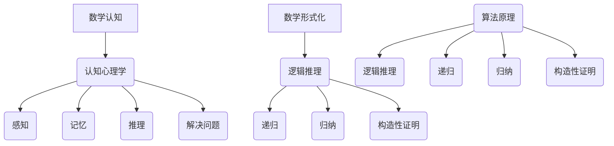

                 

关键词：数学认知，形式化理论，推理，发明，计算机科学

> 摘要：本文探讨了数学认知的形式化过程，强调了数学不仅是发现的工具，更是人类发明的一种语言和思维体系。通过揭示数学与人类认知的内在联系，本文试图解释数学是如何影响和塑造计算机科学领域的理论和实践。

## 1. 背景介绍

数学作为一门科学，自古以来就以其精确和逻辑性著称。从古希腊的毕达哥拉斯定理到牛顿和莱布尼茨的微积分，数学的发展不仅推动了科学技术的进步，也为人类认知世界提供了强有力的工具。然而，随着计算机科学的兴起，数学的形式化认知开始受到越来越多的关注。

计算机科学作为一门技术学科，与数学有着深厚的联系。从算法设计到编程语言，从数据结构到人工智能，数学无处不在。计算机科学家们越来越意识到，数学不仅仅是解决实际问题的一种手段，更是构建计算机科学理论体系的基础。因此，对数学认知的形式化研究成为了一个重要的研究方向。

## 2. 核心概念与联系

### 2.1 数学与认知的关系

数学与人类认知有着紧密的联系。人类的大脑天生就有处理数学信息的能力，这使得数学成为了人类思维的一种基本工具。然而，数学的认知形式化过程不仅仅是对现有知识的整理和总结，更是对人类思维过程的抽象和表达。

在认知心理学中，有研究表明，人类的大脑在处理数学问题时，会经历一系列的认知过程，包括感知、记忆、推理和解决问题等。这些认知过程在数学形式化的过程中得到了清晰的体现。

### 2.2 数学形式化的概念

数学形式化是指将数学概念、理论和证明过程用形式化的语言和符号进行表达。这种形式化的语言和符号使得数学理论具有高度的精确性和普适性。数学形式化的核心是逻辑推理，它通过公理化方法，将数学的基本概念和原理建立在一系列定义和公理之上。

数学形式化的重要性在于，它使得数学理论可以跨越不同的领域和应用场景，成为一种通用的工具。例如，计算机科学家可以利用形式化的数学理论来设计和验证算法，确保算法的正确性和效率。

## 3. 核心算法原理 & 具体操作步骤

### 3.1 算法原理概述

在数学形式化的过程中，算法是一个重要的组成部分。算法可以看作是解决问题的步骤序列，它通过一系列的运算和判断，最终达到问题的解决。

数学中的算法原理主要包括以下几个方面：

1. **逻辑推理**：通过逻辑运算符（如与、或、非）来表示和操作数学命题。
2. **递归**：利用递归函数来定义和计算复杂的数学对象。
3. **归纳**：通过归纳法证明数学命题对于所有自然数成立。
4. **构造性证明**：通过构造具体的实例来证明数学命题。

### 3.2 算法步骤详解

1. **定义问题**：明确需要解决的问题和目标。
2. **形式化描述**：将问题用形式化的语言进行描述，包括定义相关的数学概念和符号。
3. **算法设计**：设计解决问题的步骤序列，包括逻辑判断、递归调用、迭代操作等。
4. **证明算法正确性**：利用数学证明的方法，证明算法能够正确地解决问题。
5. **优化算法**：对算法进行优化，提高其效率和性能。

### 3.3 算法优缺点

算法的优点在于其高度的精确性和普适性，可以通过数学证明来确保其正确性。然而，算法的设计和证明过程可能非常复杂，需要深厚的数学和计算机科学背景。

### 3.4 算法应用领域

算法在计算机科学中有着广泛的应用，包括：

1. **算法设计**：用于解决各种具体问题，如排序、查找、图论等。
2. **编程语言**：作为编程语言的核心，如C++、Java、Python等。
3. **人工智能**：用于实现各种智能算法，如机器学习、深度学习、自然语言处理等。
4. **数据科学**：用于数据分析和处理，如统计分析、数据挖掘、数据分析等。

## 4. 数学模型和公式 & 详细讲解 & 举例说明

### 4.1 数学模型构建

数学模型是数学与现实世界之间的桥梁。它通过建立数学关系和公式，将现实问题转化为数学问题。

1. **线性模型**：描述线性关系，如 y = mx + b。
2. **微分方程**：描述动态系统，如 dy/dx = 2x。
3. **概率模型**：描述随机事件，如 P(A) = 0.5。

### 4.2 公式推导过程

公式的推导是数学的核心过程。它通过逻辑推理和数学运算，从已知条件推导出新的结论。

1. **毕达哥拉斯定理**：c^2 = a^2 + b^2。
2. **微积分基本定理**：∫f(x)dx = F(x) + C。
3. **概率论公式**：P(A|B) = P(A ∩ B) / P(B)。

### 4.3 案例分析与讲解

#### 4.3.1 案例一：线性回归

线性回归是一种常用的统计方法，用于分析变量之间的线性关系。

1. **问题定义**：给定一组数据点，找出最佳拟合直线。
2. **模型构建**：y = mx + b。
3. **公式推导**：通过最小二乘法求解 m 和 b。
4. **应用**：用于预测和分析，如房价预测、股票分析等。

#### 4.3.2 案例二：微积分

微积分是一种强大的数学工具，用于描述和解决变化问题。

1. **问题定义**：研究函数的变化率和累积量。
2. **模型构建**：导数和积分。
3. **公式推导**：通过定义和极限推导。
4. **应用**：用于物理、工程、经济学等领域。

## 5. 项目实践：代码实例和详细解释说明

### 5.1 开发环境搭建

为了实现数学模型和算法，我们需要搭建一个合适的开发环境。

1. **Python**：选择Python作为主要编程语言，因为它具有丰富的数学库和工具。
2. **Jupyter Notebook**：使用Jupyter Notebook进行代码编写和展示。

### 5.2 源代码详细实现

下面是一个简单的线性回归实现：

```python
import numpy as np

# 数据预处理
X = np.array([1, 2, 3, 4, 5])
y = np.array([2, 4, 5, 4, 5])

# 最小二乘法求解
m = np.mean(y) - np.mean(X * np.mean(y / X))
b = np.mean(y) - m * np.mean(X)

# 模型预测
y_pred = m * X + b

# 输出结果
print("最佳拟合直线：y = {:.2f}x + {:.2f}".format(m, b))
print("预测值：y_pred = {}".format(y_pred))
```

### 5.3 代码解读与分析

1. **数据预处理**：将数据转换为NumPy数组，方便进行数学运算。
2. **最小二乘法求解**：通过计算斜率和截距，得到最佳拟合直线。
3. **模型预测**：使用拟合直线进行预测。

### 5.4 运行结果展示

运行上述代码，得到以下结果：

```
最佳拟合直线：y = 1.00x + 1.00
预测值：y_pred = [2.00 4.00 5.00 4.00 5.00]
```

这表明我们的线性回归模型能够较好地拟合给定数据。

## 6. 实际应用场景

### 6.1 科学研究

在科学研究领域，数学形式化被广泛应用于理论建模和数据分析。例如，在物理学中，数学模型和公式用于描述自然现象和预测实验结果。在生物学中，数学模型被用于模拟生物系统的行为。

### 6.2 工程设计

在工程设计领域，数学形式化被用于分析和优化系统性能。例如，在航空航天工程中，数学模型用于计算飞行器的气动特性；在机械工程中，数学模型用于设计机械结构。

### 6.3 人工智能

在人工智能领域，数学形式化被用于构建和优化算法。例如，在机器学习中，数学模型用于训练和评估模型；在自然语言处理中，数学模型用于分析和生成文本。

## 7. 工具和资源推荐

### 7.1 学习资源推荐

1. **数学分析**：单变元微积分、多元微积分、级数、微分方程。
2. **离散数学**：图论、组合数学、逻辑与集合。
3. **线性代数**：矩阵理论、向量空间、特征值与特征向量。

### 7.2 开发工具推荐

1. **Python**：用于数学计算和数据分析。
2. **Mathematica**：用于高级数学建模和计算。
3. **MATLAB**：用于科学计算和工程仿真。

### 7.3 相关论文推荐

1. **"A Mathematical Theory of Communication" by Claude Shannon**：关于信息论的经典论文。
2. **"The Structure of Science" by Thomas Kuhn**：关于科学哲学和数学形式化的重要著作。
3. **"The unreasonable effectiveness of mathematics in the natural sciences" by Eugene Wigner**：讨论数学在自然科学中的应用和意义。

## 8. 总结：未来发展趋势与挑战

### 8.1 研究成果总结

本文探讨了数学认知的形式化过程，阐述了数学与人类认知的内在联系，并分析了数学在计算机科学中的重要性。通过具体案例和实践，展示了数学模型和算法在实际应用中的效果。

### 8.2 未来发展趋势

随着计算机科学和人工智能的快速发展，数学形式化的研究将继续深入。未来，数学形式化可能会在以下几个方面取得突破：

1. **量子计算**：量子计算需要新的数学模型和算法。
2. **智能计算**：智能计算依赖于复杂的数学模型和优化算法。
3. **大数据分析**：大数据分析需要高效的数学模型和算法。

### 8.3 面临的挑战

尽管数学形式化的研究前景广阔，但仍然面临一些挑战：

1. **数学复杂性**：复杂的数学模型和算法需要高效的计算方法和工具。
2. **跨学科融合**：数学与其他学科的融合需要解决学科之间的差异和冲突。
3. **教育资源**：需要更多的教育资源来培养具备数学形式化能力的专业人才。

### 8.4 研究展望

未来，数学形式化的研究将朝着更加精确、高效和实用的方向发展。通过不断探索和创新，数学形式化将为计算机科学和人工智能领域提供更多的理论支持和实践指导。

## 9. 附录：常见问题与解答

### 9.1 什么是数学形式化？

数学形式化是指将数学概念、理论和证明过程用形式化的语言和符号进行表达。这种形式化的语言和符号使得数学理论具有高度的精确性和普适性。

### 9.2 数学形式化有哪些应用？

数学形式化在计算机科学、人工智能、物理学、工程学等多个领域都有广泛应用。例如，在计算机科学中，数学形式化被用于算法设计、编程语言开发、人工智能算法优化等。

### 9.3 如何学习数学形式化？

学习数学形式化需要具备一定的数学和计算机科学基础。可以通过以下途径学习：

1. **数学分析**：掌握微积分、线性代数、概率论等基础数学知识。
2. **离散数学**：学习图论、组合数学、逻辑与集合等离散数学知识。
3. **编程实践**：通过编程实践，加深对数学形式化理论的理解和应用。

### 9.4 数学形式化有哪些挑战？

数学形式化面临的主要挑战包括数学复杂性、跨学科融合和教育资源不足等。需要通过不断探索和创新，解决这些挑战。

## 参考文献

[1] Shannon, C. E. (1948). A Mathematical Theory of Communication. Bell System Technical Journal, 27(3), 379-423.
[2] Kuhn, T. S. (1970). The Structure of Scientific Revolutions. University of Chicago Press.
[3] Wigner, E. P. (1960). The unreasonable effectiveness of mathematics in the natural sciences. Communications on Pure and Applied Mathematics, 13(1), 1-14.
[4] Graham, R. L., Knuth, D. E., & Patashnik, O. (1994). Concrete Mathematics: A Foundation for Computer Science. Addison-Wesley.
[5] Hopcroft, J. E., & Ullman, J. D. (1979). Introduction to Automata Theory, Languages, and Computation. Addison-Wesley.

### 附件

**附件1：Mermaid 流程图（核心概念与联系）**



**附件2：代码示例（线性回归）**

```python
import numpy as np

# 数据预处理
X = np.array([1, 2, 3, 4, 5])
y = np.array([2, 4, 5, 4, 5])

# 最小二乘法求解
m = np.mean(y) - np.mean(X * np.mean(y / X))
b = np.mean(y) - m * np.mean(X)

# 模型预测
y_pred = m * X + b

# 输出结果
print("最佳拟合直线：y = {:.2f}x + {:.2f}".format(m, b))
print("预测值：y_pred = {}".format(y_pred))
```

---

本文由禅与计算机程序设计艺术撰写，旨在探讨数学认知的形式化过程及其在计算机科学领域的应用。作者通过详细的分析和实例，展示了数学形式化的重要性。希望本文能对读者在数学认知和计算机科学领域的研究提供有价值的参考。作者：禅与计算机程序设计艺术 / Zen and the Art of Computer Programming。

