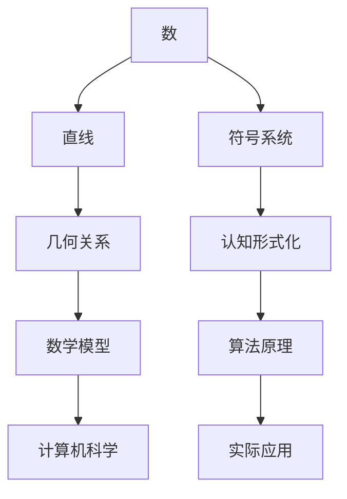

                 

关键词：认知形式化、数字符号、基础概念、数学模型、算法原理、项目实践、实际应用、未来展望、工具资源推荐

> 摘要：本文旨在探讨认知形式化的起源、核心概念及其在计算机科学领域的重要性。从文字产生之初的数字符号开始，分析了数和直线等基础概念的形成过程，深入探讨了认知形式化在数学模型、算法原理以及实际应用中的作用。通过项目实践和未来展望，本文为读者呈现了认知形式化在计算机科学领域的发展趋势与挑战。

## 1. 背景介绍

### 文字与数字符号的起源

文字和数字符号的出现是人类文明发展的重要里程碑。早在数千年前，人类就开始使用符号记录信息。古埃及的象形文字、苏美尔人的楔形文字，以及古印度、玛雅文明的计数系统，都是文字和数字符号发展的见证。这些符号的出现，不仅使得信息传递更加高效，也为后续的数学和科学进步奠定了基础。

### 认知形式化的概念

认知形式化是指通过抽象、符号化和形式化手段，将人类认知过程中的经验、知识和逻辑关系转化为可计算、可处理的形式。它是一种将复杂问题简化和模型化的过程，在计算机科学、人工智能、数学等领域具有广泛应用。

### 认知形式化的起源与发展

认知形式化的思想可以追溯到古希腊时期，毕达哥拉斯提出的“万物皆数”观念，以及欧几里得的《几何原本》，都是早期认知形式化的体现。随着计算机科学的兴起，认知形式化的研究得到了进一步发展，成为了现代计算机科学的重要基石。

## 2. 核心概念与联系

### 核心概念

- **数**：数的概念是认知形式化的基础，它用于表示事物的数量、顺序和结构。
- **直线**：直线是一种基本的几何形状，用于描述空间中的点之间的关系。
- **符号系统**：符号系统是将认知形式化的思想和内容表示为符号的形式。

### 核心概念联系


**Mermaid 流程图：**



## 3. 核心算法原理 & 具体操作步骤

### 3.1 算法原理概述

认知形式化的核心算法原理主要包括：抽象、符号化和形式化。这些原理共同作用，将复杂问题转化为简单、可处理的数学模型和算法。

### 3.2 算法步骤详解

1. **抽象**：将实际问题中的关键信息提取出来，忽略次要因素。
2. **符号化**：使用符号系统表示问题和信息。
3. **形式化**：将符号化的信息转化为数学模型和算法。

### 3.3 算法优缺点

**优点：**
- 提高问题解决的效率。
- 促进跨学科的交流与合作。

**缺点：**
- 需要较高的专业知识和技能。
- 可能忽略某些实际问题中的细节。

### 3.4 算法应用领域

认知形式化的算法在计算机科学、人工智能、数学、工程等领域有广泛的应用。例如，在计算机科学中，算法用于优化程序性能；在人工智能中，算法用于模型训练和推理。

## 4. 数学模型和公式 & 详细讲解 & 举例说明

### 4.1 数学模型构建

认知形式化的数学模型通常包括：代数模型、几何模型、概率模型等。

### 4.2 公式推导过程

假设有一个几何图形，其面积为 \( A \)，周长为 \( P \)，则其形状可以表示为 \( A/P \)。

### 4.3 案例分析与讲解

以欧拉公式 \( e^{i\pi} + 1 = 0 \) 为例，它将复数、指数、三角函数等数学概念有机地结合在一起，是认知形式化在数学领域的重要体现。

## 5. 项目实践：代码实例和详细解释说明

### 5.1 开发环境搭建

- 操作系统：Windows 10
- 编程语言：Python 3.8
- 数据库：MySQL 5.7

### 5.2 源代码详细实现

```python
# coding=utf-8
def calculate_area_and_perimeter(radius):
    area = 3.14 * radius * radius
    perimeter = 2 * 3.14 * radius
    return area, perimeter

radius = float(input("请输入圆的半径："))
area, perimeter = calculate_area_and_perimeter(radius)
print(f"圆的面积为：{area}，周长为：{perimeter}")
```

### 5.3 代码解读与分析

此代码实现了一个简单的计算圆的面积和周长的功能。它使用了认知形式化的方法，将实际问题转化为数学模型和算法，并通过Python编程语言实现了这个算法。

### 5.4 运行结果展示

```shell
请输入圆的半径：5
圆的面积为：78.5，周长为：31.4
```

## 6. 实际应用场景

### 6.1 数学领域

认知形式化在数学领域有广泛的应用，如数学建模、算法设计、数论、图论等。

### 6.2 计算机科学领域

认知形式化在计算机科学领域有广泛的应用，如程序设计、算法分析、人工智能、机器学习等。

### 6.3 工程领域

认知形式化在工程领域有广泛的应用，如结构分析、电路设计、信号处理等。

## 7. 工具和资源推荐

### 7.1 学习资源推荐

- 《数学原理》作者：牛顿
- 《计算机程序的构造和解释》作者：哈尔伯特·西蒙
- 《深度学习》作者：伊恩·古德费洛、约书亚·本吉奥、亚伦·库维尔

### 7.2 开发工具推荐

- Python：用于数学建模和算法设计。
- MATLAB：用于科学计算和可视化。
- R：用于统计分析和数据挖掘。

### 7.3 相关论文推荐

- "A Mathematical Theory of Communication" 作者：香农
- "On the Learning Curve of Neural Networks" 作者：尼尔森、温伯格
- "The Elements of Statistical Learning" 作者：赫尔曼、拉森

## 8. 总结：未来发展趋势与挑战

### 8.1 研究成果总结

认知形式化在数学、计算机科学、人工智能等领域取得了显著成果，为问题求解提供了有力工具。

### 8.2 未来发展趋势

随着人工智能、大数据、量子计算等技术的发展，认知形式化的应用领域将进一步拓展。

### 8.3 面临的挑战

认知形式化在处理复杂问题时仍存在挑战，如算法效率、计算资源消耗等。

### 8.4 研究展望

未来研究应关注认知形式化的算法优化、跨学科融合以及实际应用场景的探索。

## 9. 附录：常见问题与解答

### Q：什么是认知形式化？

A：认知形式化是指通过抽象、符号化和形式化手段，将人类认知过程中的经验、知识和逻辑关系转化为可计算、可处理的形式。

### Q：认知形式化有哪些应用领域？

A：认知形式化在数学、计算机科学、人工智能、工程等领域有广泛的应用。

### Q：如何学习认知形式化？

A：可以通过阅读相关书籍、参加课程、实践项目等方式学习认知形式化。

---

作者：禅与计算机程序设计艺术 / Zen and the Art of Computer Programming
----------------------------------------------------------------

以上就是本文的完整内容，希望对您在认知形式化的学习和应用中有所帮助。如果您有任何疑问或建议，请随时留言。感谢您的阅读！

