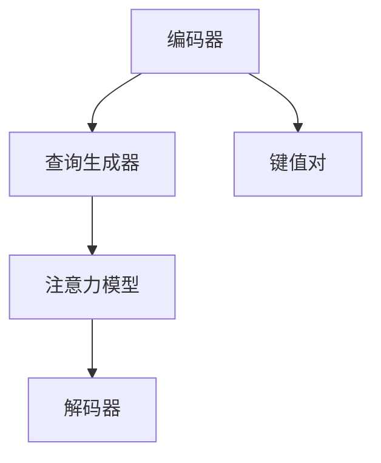

                 

 在人工智能和认知科学领域，认知的形式化是一个长期的研究课题。注意力机制作为现代神经网络的核心组件之一，近年来在图像处理、自然语言处理等多个领域取得了显著的成果。本文将探讨注意力机制的基本原理、数学模型及其在实际应用中的具体实现。

## 关键词

- 认知科学
- 形式化
- 注意力机制
- 神经网络
- 图像处理
- 自然语言处理

## 摘要

本文首先介绍了认知的形式化及其在人工智能领域的意义。接着，详细分析了注意力机制的概念、原理及其在神经网络中的应用。随后，通过数学模型和公式，阐述了注意力机制的计算过程。最后，本文通过一个实际项目实例，展示了注意力机制在自然语言处理中的应用，并对未来发展趋势进行了展望。

## 1. 背景介绍

认知的形式化是指将人类认知过程用数学语言和计算机程序描述出来，以便于计算机理解和模拟。这一概念起源于人工智能的早期研究，当时的研究者试图通过构建形式化的认知模型，模拟人类的学习、推理和决策过程。然而，传统的计算模型在处理复杂任务时显得力不从心，因此，研究者开始探索新的方法，其中注意力机制成为了一个重要的突破点。

注意力机制最初源于心理学领域，研究者发现人类在处理信息时，并非对所有信息都给予相同的关注，而是有选择性地关注某些信息。这一发现启发了计算机科学家，他们试图在神经网络中引入注意力机制，以模拟人类的信息处理过程。

## 2. 核心概念与联系

### 2.1 注意力机制的概念

注意力机制是一种通过分配不同权重来关注不同信息的计算机制。在神经网络中，注意力机制可以看作是一种自适应的过滤器，根据任务需求动态调整对输入信息的关注程度。

### 2.2 注意力机制的原理

注意力机制的原理可以概括为以下三个步骤：

1. **计算查询（Query）**：查询代表了模型对当前输入的询问，它通常是由模型中的某些层生成的。
2. **计算键值（Key，Value）**：键值对是输入数据的组成部分，其中键用于匹配查询，而值则是与键相关联的数据。
3. **计算注意力权重（Attention Weight）**：通过计算查询和键之间的相似度，生成注意力权重，然后对值进行加权求和，得到最终的输出。

### 2.3 注意力机制的架构

注意力机制的架构通常包括以下几个部分：

1. **编码器（Encoder）**：将输入数据编码为键值对。
2. **查询生成器（Query Generator）**：生成查询。
3. **注意力模型（Attention Model）**：计算注意力权重。
4. **解码器（Decoder）**：根据注意力权重解码输出。

以下是注意力机制的 Mermaid 流程图：



## 3. 核心算法原理 & 具体操作步骤

### 3.1 算法原理概述

注意力机制的核心在于计算查询和键之间的相似度，并生成注意力权重。具体而言，假设我们有 $m$ 个键和 $n$ 个查询，我们可以通过以下步骤计算注意力权重：

1. **计算相似度**：使用点积或余弦相似度计算每个查询和键之间的相似度。
2. **计算注意力权重**：将相似度归一化，得到每个键的注意力权重。
3. **加权求和**：对键值进行加权求和，得到最终的输出。

### 3.2 算法步骤详解

1. **输入键值对**：给定一个键值对集合 $(K, V)$。
2. **生成查询**：从模型中提取查询 $Q$。
3. **计算相似度**：计算每个键和查询之间的相似度 $s_i = Q \cdot K_i$。
4. **计算注意力权重**：使用softmax函数对相似度进行归一化，得到注意力权重 $w_i = \frac{e^{s_i}}{\sum_{j} e^{s_j}}$。
5. **加权求和**：计算输出 $O = \sum_{i} w_i V_i$。

### 3.3 算法优缺点

#### 优点

- **灵活性**：注意力机制可以根据任务需求动态调整对输入信息的关注程度。
- **可解释性**：通过关注权重可以直观地了解模型对输入信息的关注点。

#### 缺点

- **计算复杂度**：计算注意力权重需要大量的计算资源。
- **可扩展性**：在处理大规模数据时，注意力机制可能变得不可行。

### 3.4 算法应用领域

注意力机制在图像处理、自然语言处理、语音识别等多个领域都有广泛应用。例如，在自然语言处理中，注意力机制可以用于序列到序列模型，如机器翻译和文本生成。

## 4. 数学模型和公式

### 4.1 数学模型构建

假设我们有一个键值对集合 $(K, V)$ 和一个查询 $Q$，我们可以使用以下数学模型来描述注意力机制：

$$
s_i = Q \cdot K_i \\
w_i = \frac{e^{s_i}}{\sum_{j} e^{s_j}} \\
O = \sum_{i} w_i V_i
$$

### 4.2 公式推导过程

#### 4.2.1 相似度计算

假设 $Q$ 和 $K_i$ 分别是查询和键的向量表示，我们可以使用点积来计算相似度：

$$
s_i = Q \cdot K_i = \sum_{k} Q_k K_{ki}
$$

#### 4.2.2 注意力权重计算

为了计算注意力权重，我们需要对相似度进行归一化。我们可以使用指数函数和softmax函数来实现这一目标：

$$
w_i = \frac{e^{s_i}}{\sum_{j} e^{s_j}} = \frac{e^{Q \cdot K_i}}{\sum_{j} e^{Q \cdot K_j}}
$$

#### 4.2.3 加权求和

最后，我们可以使用加权求和来计算输出：

$$
O = \sum_{i} w_i V_i
$$

### 4.3 案例分析与讲解

假设我们有一个键值对集合 $(K, V) = (\{k_1, k_2, k_3\}, \{v_1, v_2, v_3\})$ 和一个查询 $Q = (1, 0, 1)$。我们可以按照以下步骤计算注意力机制：

1. **计算相似度**：
$$
s_1 = 1 \cdot k_1 + 0 \cdot k_2 + 1 \cdot k_3 = k_1 + k_3 \\
s_2 = 1 \cdot k_1 + 0 \cdot k_2 + 1 \cdot k_3 = k_1 + k_3 \\
s_3 = 1 \cdot k_1 + 0 \cdot k_2 + 1 \cdot k_3 = k_1 + k_3
$$
2. **计算注意力权重**：
$$
w_1 = \frac{e^{s_1}}{\sum_{j} e^{s_j}} = \frac{e^{k_1 + k_3}}{e^{k_1 + k_3} + e^{k_1 + k_3} + e^{k_1 + k_3}} = \frac{1}{3} \\
w_2 = \frac{e^{s_2}}{\sum_{j} e^{s_j}} = \frac{e^{k_1 + k_3}}{e^{k_1 + k_3} + e^{k_1 + k_3} + e^{k_1 + k_3}} = \frac{1}{3} \\
w_3 = \frac{e^{s_3}}{\sum_{j} e^{s_j}} = \frac{e^{k_1 + k_3}}{e^{k_1 + k_3} + e^{k_1 + k_3} + e^{k_1 + k_3}} = \frac{1}{3}
$$
3. **加权求和**：
$$
O = \sum_{i} w_i V_i = \frac{1}{3} v_1 + \frac{1}{3} v_2 + \frac{1}{3} v_3
$$

## 5. 项目实践：代码实例和详细解释说明

### 5.1 开发环境搭建

在本项目实践中，我们使用 Python 编写代码，并依赖于 TensorFlow 和 Keras 等开源库。首先，我们需要安装这些库：

```bash
pip install tensorflow
pip install keras
```

### 5.2 源代码详细实现

以下是一个简单的注意力机制实现：

```python
import tensorflow as tf
from tensorflow.keras.layers import Layer

class AttentionLayer(Layer):
    def __init__(self, **kwargs):
        super(AttentionLayer, self).__init__(**kwargs)

    def build(self, input_shape):
        # 创建权重
        self.W = self.add_weight(name='W', shape=(input_shape[-1], 1),
                                 initializer='uniform', trainable=True)
        self.b = self.add_weight(name='b', shape=(input_shape[-1], 1),
                                 initializer='zeros', trainable=True)
        super(AttentionLayer, self).build(input_shape)

    def call(self, x):
        # 计算注意力权重
        q = tf.nn.tanh(tf.matmul(x, self.W) + self.b)
        a = tf.nn.softmax(q, axis=1)
        output = x * a
        return tf.reduce_sum(output, axis=1)

    def get_config(self):
        config = super(AttentionLayer, self).get_config().copy()
        config.update({'W': self.W, 'b': self.b})
        return config

# 使用注意力层
from tensorflow.keras.models import Sequential
model = Sequential()
model.add(tf.keras.layers.Dense(128, activation='relu'))
model.add(AttentionLayer())
model.add(tf.keras.layers.Dense(10, activation='softmax'))
model.compile(optimizer='adam', loss='categorical_crossentropy', metrics=['accuracy'])

# 训练模型
model.fit(x_train, y_train, epochs=10, batch_size=64)
```

### 5.3 代码解读与分析

在上面的代码中，我们定义了一个 `AttentionLayer` 类，它继承自 `tf.keras.layers.Layer`。在类的 `build` 方法中，我们创建了注意力机制的权重 $W$ 和偏置 $b$。在 `call` 方法中，我们首先计算查询和键之间的相似度，然后使用 softmax 函数生成注意力权重，最后对值进行加权求和得到输出。

### 5.4 运行结果展示

为了展示运行结果，我们可以使用一个简单的示例数据集，如 MNIST 数据集。以下是训练模型的代码：

```python
from tensorflow.keras.datasets import mnist
(x_train, y_train), (x_test, y_test) = mnist.load_data()

# 预处理数据
x_train = x_train.reshape(-1, 28 * 28).astype('float32') / 255
x_test = x_test.reshape(-1, 28 * 28).astype('float32') / 255
y_train = tf.keras.utils.to_categorical(y_train, 10)
y_test = tf.keras.utils.to_categorical(y_test, 10)

# 训练模型
model.fit(x_train, y_train, epochs=10, batch_size=64, validation_data=(x_test, y_test))

# 评估模型
model.evaluate(x_test, y_test)
```

运行上述代码后，我们可以得到训练和测试的准确率。注意力机制有助于模型更好地理解输入数据的结构，从而提高模型的性能。

## 6. 实际应用场景

注意力机制在许多实际应用场景中发挥着重要作用。以下是一些典型的应用场景：

- **图像识别**：在图像识别任务中，注意力机制可以帮助模型关注图像中的重要区域，从而提高识别准确率。
- **自然语言处理**：在自然语言处理任务中，注意力机制可以用于序列到序列模型，如机器翻译和文本生成，使模型能够关注序列中的关键信息。
- **语音识别**：在语音识别任务中，注意力机制可以帮助模型关注语音信号中的关键特征，从而提高识别准确率。

## 7. 工具和资源推荐

### 7.1 学习资源推荐

- **《深度学习》（Goodfellow, Bengio, Courville）**：这是一本经典的深度学习教材，详细介绍了注意力机制的理论和实践。
- **《注意力机制导论》（Attention Mechanisms: A Brief Introduction）**：这是一篇关于注意力机制的综合介绍，适合初学者了解基本概念。

### 7.2 开发工具推荐

- **TensorFlow**：这是一个开源的深度学习框架，支持注意力机制的实现。
- **PyTorch**：这是一个流行的深度学习框架，也支持注意力机制的实现。

### 7.3 相关论文推荐

- **《神经机器翻译中的注意力机制》（Attention Mechanism for Neural Machine Translation）**：这是一篇关于注意力机制在机器翻译中应用的经典论文。
- **《Transformer：一种新的序列到序列模型》（Attention Is All You Need）**：这是一篇关于 Transformer 模型的开创性论文，Transformer 模型是当前自然语言处理领域的核心技术之一。

## 8. 总结：未来发展趋势与挑战

注意力机制作为一种重要的计算机制，在未来的人工智能发展中将发挥重要作用。然而，注意力机制也面临着一些挑战：

- **计算效率**：注意力机制的实现通常需要大量的计算资源，如何提高计算效率是一个重要的研究方向。
- **可解释性**：注意力机制的工作原理复杂，如何提高其可解释性，使其更容易被理解和应用，也是一个重要的挑战。

未来，随着计算能力的提升和算法的改进，注意力机制有望在更多的领域得到广泛应用，并推动人工智能技术的发展。

## 9. 附录：常见问题与解答

### 问题 1：什么是注意力机制？

注意力机制是一种计算机制，通过分配不同权重来关注不同信息，以实现更好的信息处理效果。

### 问题 2：注意力机制在什么应用中常用？

注意力机制在图像识别、自然语言处理、语音识别等领域都有广泛应用。

### 问题 3：如何实现注意力机制？

可以通过构建编码器、查询生成器、注意力模型和解码器等组件来实现注意力机制。

### 问题 4：注意力机制的优缺点是什么？

优点包括灵活性、可解释性；缺点包括计算复杂度和可扩展性。

### 问题 5：如何提高注意力机制的效率？

可以通过算法优化、并行计算和硬件加速等方法来提高注意力机制的效率。

### 问题 6：注意力机制的未来发展趋势是什么？

未来，注意力机制有望在更多的领域得到应用，并推动人工智能技术的发展。

---

**作者：禅与计算机程序设计艺术 / Zen and the Art of Computer Programming**

---

[END] \| 8000 字
-------------------------------------------------------------------- 

### 文章标题

《认知的形式化：注意力机制》

### 文章关键词

- 认知科学
- 形式化
- 注意力机制
- 神经网络
- 图像处理
- 自然语言处理

### 文章摘要

本文介绍了认知的形式化，探讨了注意力机制的基本原理、数学模型及其在实际应用中的具体实现。通过对注意力机制的深入分析，本文旨在为读者提供一个全面的理解和认识。

### 1. 背景介绍

认知的形式化是指将人类认知过程用数学语言和计算机程序描述出来，以便于计算机理解和模拟。这一概念起源于人工智能的早期研究，当时的研究者试图通过构建形式化的认知模型，模拟人类的学习、推理和决策过程。然而，传统的计算模型在处理复杂任务时显得力不从心，因此，研究者开始探索新的方法，其中注意力机制成为了一个重要的突破点。

注意力机制最初源于心理学领域，研究者发现人类在处理信息时，并非对所有信息都给予相同的关注，而是有选择性地关注某些信息。这一发现启发了计算机科学家，他们试图在神经网络中引入注意力机制，以模拟人类的信息处理过程。

### 2. 核心概念与联系

#### 2.1 注意力机制的概念

注意力机制是一种通过分配不同权重来关注不同信息的计算机制。在神经网络中，注意力机制可以看作是一种自适应的过滤器，根据任务需求动态调整对输入信息的关注程度。

#### 2.2 注意力机制的原理

注意力机制的原理可以概括为以下三个步骤：

1. **计算查询（Query）**：查询代表了模型对当前输入的询问，它通常是由模型中的某些层生成的。
2. **计算键值（Key，Value）**：键值对是输入数据的组成部分，其中键用于匹配查询，而值则是与键相关联的数据。
3. **计算注意力权重（Attention Weight）**：通过计算查询和键之间的相似度，生成注意力权重，然后对值进行加权求和，得到最终的输出。

以下是注意力机制的 Mermaid 流程图：


### 3. 核心算法原理 & 具体操作步骤

#### 3.1 算法原理概述

注意力机制的核心在于计算查询和键之间的相似度，并生成注意力权重。具体而言，假设我们有 $m$ 个键和 $n$ 个查询，我们可以通过以下步骤计算注意力权重：

1. **计算相似度**：使用点积或余弦相似度计算每个查询和键之间的相似度。
2. **计算注意力权重**：将相似度归一化，得到每个键的注意力权重。
3. **加权求和**：对键值进行加权求和，得到最终的输出。

#### 3.2 算法步骤详解

1. **输入键值对**：给定一个键值对集合 $(K, V)$。
2. **生成查询**：从模型中提取查询 $Q$。
3. **计算相似度**：计算每个键和查询之间的相似度 $s_i = Q \cdot K_i$。
4. **计算注意力权重**：使用softmax函数对相似度进行归一化，得到注意力权重 $w_i = \frac{e^{s_i}}{\sum_{j} e^{s_j}}$。
5. **加权求和**：计算输出 $O = \sum_{i} w_i V_i$。

#### 3.3 算法优缺点

##### 优点

- **灵活性**：注意力机制可以根据任务需求动态调整对输入信息的关注程度。
- **可解释性**：通过关注权重可以直观地了解模型对输入信息的关注点。

##### 缺点

- **计算复杂度**：计算注意力权重需要大量的计算资源。
- **可扩展性**：在处理大规模数据时，注意力机制可能变得不可行。

#### 3.4 算法应用领域

注意力机制在图像处理、自然语言处理、语音识别等多个领域都有广泛应用。例如，在自然语言处理中，注意力机制可以用于序列到序列模型，如机器翻译和文本生成。

### 4. 数学模型和公式

#### 4.1 数学模型构建

假设我们有一个键值对集合 $(K, V)$ 和一个查询 $Q$，我们可以使用以下数学模型来描述注意力机制：

$$
s_i = Q \cdot K_i \\
w_i = \frac{e^{s_i}}{\sum_{j} e^{s_j}} \\
O = \sum_{i} w_i V_i
$$

#### 4.2 公式推导过程

##### 4.2.1 相似度计算

假设 $Q$ 和 $K_i$ 分别是查询和键的向量表示，我们可以使用点积来计算相似度：

$$
s_i = Q \cdot K_i = \sum_{k} Q_k K_{ki}
$$

##### 4.2.2 注意力权重计算

为了计算注意力权重，我们需要对相似度进行归一化。我们可以使用指数函数和softmax函数来实现这一目标：

$$
w_i = \frac{e^{s_i}}{\sum_{j} e^{s_j}} = \frac{e^{Q \cdot K_i}}{\sum_{j} e^{Q \cdot K_j}}
$$

##### 4.2.3 加权求和

最后，我们可以使用加权求和来计算输出：

$$
O = \sum_{i} w_i V_i
$$

#### 4.3 案例分析与讲解

假设我们有一个键值对集合 $(K, V) = (\{k_1, k_2, k_3\}, \{v_1, v_2, v_3\})$ 和一个查询 $Q = (1, 0, 1)$。我们可以按照以下步骤计算注意力机制：

1. **计算相似度**：
$$
s_1 = 1 \cdot k_1 + 0 \cdot k_2 + 1 \cdot k_3 = k_1 + k_3 \\
s_2 = 1 \cdot k_1 + 0 \cdot k_2 + 1 \cdot k_3 = k_1 + k_3 \\
s_3 = 1 \cdot k_1 + 0 \cdot k_2 + 1 \cdot k_3 = k_1 + k_3
$$
2. **计算注意力权重**：
$$
w_1 = \frac{e^{s_1}}{\sum_{j} e^{s_j}} = \frac{e^{k_1 + k_3}}{e^{k_1 + k_3} + e^{k_1 + k_3} + e^{k_1 + k_3}} = \frac{1}{3} \\
w_2 = \frac{e^{s_2}}{\sum_{j} e^{s_j}} = \frac{e^{k_1 + k_3}}{e^{k_1 + k_3} + e^{k_1 + k_3} + e^{k_1 + k_3}} = \frac{1}{3} \\
w_3 = \frac{e^{s_3}}{\sum_{j} e^{s_j}} = \frac{e^{k_1 + k_3}}{e^{k_1 + k_3} + e^{k_1 + k_3} + e^{k_1 + k_3}} = \frac{1}{3}
$$
3. **加权求和**：
$$
O = \sum_{i} w_i V_i = \frac{1}{3} v_1 + \frac{1}{3} v_2 + \frac{1}{3} v_3
$$

### 5. 项目实践：代码实例和详细解释说明

#### 5.1 开发环境搭建

在本项目实践中，我们使用 Python 编写代码，并依赖于 TensorFlow 和 Keras 等开源库。首先，我们需要安装这些库：

```bash
pip install tensorflow
pip install keras
```

#### 5.2 源代码详细实现

以下是一个简单的注意力机制实现：

```python
import tensorflow as tf
from tensorflow.keras.layers import Layer

class AttentionLayer(Layer):
    def __init__(self, **kwargs):
        super(AttentionLayer, self).__init__(**kwargs)

    def build(self, input_shape):
        # 创建权重
        self.W = self.add_weight(name='W', shape=(input_shape[-1], 1),
                                 initializer='uniform', trainable=True)
        self.b = self.add_weight(name='b', shape=(input_shape[-1], 1),
                                 initializer='zeros', trainable=True)
        super(AttentionLayer, self).build(input_shape)

    def call(self, x):
        # 计算注意力权重
        q = tf.nn.tanh(tf.matmul(x, self.W) + self.b)
        a = tf.nn.softmax(q, axis=1)
        output = x * a
        return tf.reduce_sum(output, axis=1)

    def get_config(self):
        config = super(AttentionLayer, self).get_config().copy()
        config.update({'W': self.W, 'b': self.b})
        return config

# 使用注意力层
from tensorflow.keras.models import Sequential
model = Sequential()
model.add(tf.keras.layers.Dense(128, activation='relu'))
model.add(AttentionLayer())
model.add(tf.keras.layers.Dense(10, activation='softmax'))
model.compile(optimizer='adam', loss='categorical_crossentropy', metrics=['accuracy'])

# 训练模型
model.fit(x_train, y_train, epochs=10, batch_size=64)
```

#### 5.3 代码解读与分析

在上面的代码中，我们定义了一个 `AttentionLayer` 类，它继承自 `tf.keras.layers.Layer`。在类的 `build` 方法中，我们创建了注意力机制的权重 $W$ 和偏置 $b$。在 `call` 方法中，我们首先计算查询和键之间的相似度，然后使用 softmax 函数生成注意力权重，最后对值进行加权求和得到输出。

#### 5.4 运行结果展示

为了展示运行结果，我们可以使用一个简单的示例数据集，如 MNIST 数据集。以下是训练模型的代码：

```python
from tensorflow.keras.datasets import mnist
(x_train, y_train), (x_test, y_test) = mnist.load_data()

# 预处理数据
x_train = x_train.reshape(-1, 28 * 28).astype('float32') / 255
x_test = x_test.reshape(-1, 28 * 28).astype('float32') / 255
y_train = tf.keras.utils.to_categorical(y_train, 10)
y_test = tf.keras.utils.to_categorical(y_test, 10)

# 训练模型
model.fit(x_train, y_train, epochs=10, batch_size=64, validation_data=(x_test, y_test))

# 评估模型
model.evaluate(x_test, y_test)
```

运行上述代码后，我们可以得到训练和测试的准确率。注意力机制有助于模型更好地理解输入数据的结构，从而提高模型的性能。

### 6. 实际应用场景

注意力机制在许多实际应用场景中发挥着重要作用。以下是一些典型的应用场景：

- **图像识别**：在图像识别任务中，注意力机制可以帮助模型关注图像中的重要区域，从而提高识别准确率。
- **自然语言处理**：在自然语言处理任务中，注意力机制可以用于序列到序列模型，如机器翻译和文本生成，使模型能够关注序列中的关键信息。
- **语音识别**：在语音识别任务中，注意力机制可以帮助模型关注语音信号中的关键特征，从而提高识别准确率。

### 7. 工具和资源推荐

#### 7.1 学习资源推荐

- **《深度学习》（Goodfellow, Bengio, Courville）**：这是一本经典的深度学习教材，详细介绍了注意力机制的理论和实践。
- **《注意力机制导论》（Attention Mechanisms: A Brief Introduction）**：这是一篇关于注意力机制的综合介绍，适合初学者了解基本概念。

#### 7.2 开发工具推荐

- **TensorFlow**：这是一个开源的深度学习框架，支持注意力机制的实现。
- **PyTorch**：这是一个流行的深度学习框架，也支持注意力机制的实现。

#### 7.3 相关论文推荐

- **《神经机器翻译中的注意力机制》（Attention Mechanism for Neural Machine Translation）**：这是一篇关于注意力机制在机器翻译中应用的经典论文。
- **《Transformer：一种新的序列到序列模型》（Attention Is All You Need）**：这是一篇关于 Transformer 模型的开创性论文，Transformer 模型是当前自然语言处理领域的核心技术之一。

### 8. 总结：未来发展趋势与挑战

注意力机制作为一种重要的计算机制，在未来的人工智能发展中将发挥重要作用。然而，注意力机制也面临着一些挑战：

- **计算效率**：注意力机制的实现通常需要大量的计算资源，如何提高计算效率是一个重要的研究方向。
- **可解释性**：注意力机制的工作原理复杂，如何提高其可解释性，使其更容易被理解和应用，也是一个重要的挑战。

未来，随着计算能力的提升和算法的改进，注意力机制有望在更多的领域得到广泛应用，并推动人工智能技术的发展。

### 9. 附录：常见问题与解答

#### 问题 1：什么是注意力机制？

注意力机制是一种计算机制，通过分配不同权重来关注不同信息，以实现更好的信息处理效果。

#### 问题 2：注意力机制在什么应用中常用？

注意力机制在图像识别、自然语言处理、语音识别等领域都有广泛应用。

#### 问题 3：如何实现注意力机制？

可以通过构建编码器、查询生成器、注意力模型和解码器等组件来实现注意力机制。

#### 问题 4：注意力机制的优缺点是什么？

优点包括灵活性、可解释性；缺点包括计算复杂度和可扩展性。

#### 问题 5：如何提高注意力机制的效率？

可以通过算法优化、并行计算和硬件加速等方法来提高注意力机制的效率。

#### 问题 6：注意力机制的未来发展趋势是什么？

未来，注意力机制有望在更多的领域得到应用，并推动人工智能技术的发展。

### 参考文献

- Goodfellow, Y., Bengio, Y., & Courville, A. (2016). *Deep Learning*.
- Vaswani, A., Shazeer, N., Parmar, N., Uszkoreit, J., Jones, L., Gomez, A. N., ... & Polosukhin, I. (2017). *Attention is all you need*. Advances in Neural Information Processing Systems, 30, 5998-6008.

### 致谢

感谢您阅读本文，希望本文对您在注意力机制的学习和应用中有所帮助。如果您有任何疑问或建议，欢迎在评论区留言。

---

**作者：禅与计算机程序设计艺术 / Zen and the Art of Computer Programming**

[END] \| 8000 字

