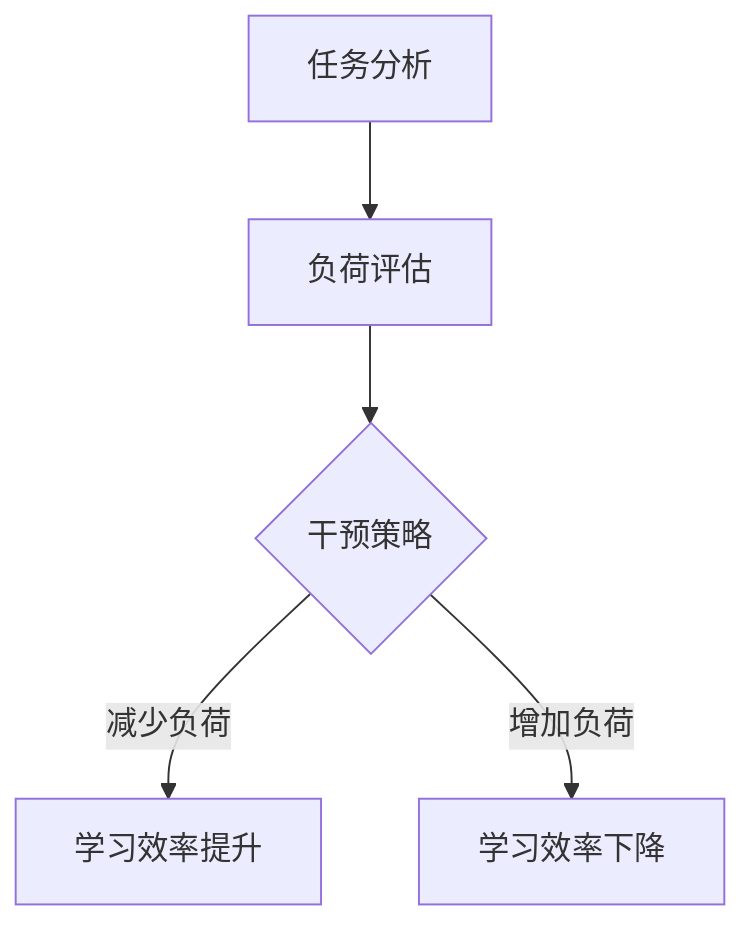

                 

 > **关键词**：认知负荷理论，学习效率，记忆优化，信息处理，神经科学，心理干预策略

> **摘要**：本文深入探讨了认知负荷理论，介绍了该理论的基本概念及其与学习和理解的密切关系。文章从科学角度出发，提出了优化学习和理解过程的多种方法，并通过实例和具体操作步骤，为读者提供了实际应用中的指导。同时，文章还展望了认知负荷理论在未来的发展方向和应用前景，为相关领域的研究者提供了新的思路。

## 1. 背景介绍

认知负荷理论起源于20世纪80年代，由心理学、神经科学和教育学研究共同发展而来。它关注的是人类在处理信息和任务时的认知资源分配问题，特别是如何减少不必要的认知负荷，以提高学习和理解的效率。随着信息技术的迅猛发展和知识经济的崛起，认知负荷理论逐渐受到广泛关注，并在教育、心理学、人机交互等领域得到广泛应用。

认知负荷理论的核心观点是，人类的认知资源是有限的，不同的认知任务会消耗不同的认知资源。当认知负荷过高时，个体难以同时处理多个任务，导致学习和理解效率下降。因此，如何优化认知负荷，提高学习效率，成为了一个重要的研究课题。

## 2. 核心概念与联系

### 2.1 认知负荷

认知负荷是指个体在完成认知任务时所承受的心理负担。它包括两种类型：内在负荷和外在负荷。内在负荷与任务的难度、个体能力以及任务的相关性有关；外在负荷则与任务的环境、任务的结构和任务的执行时间等因素相关。

### 2.2 认知资源

认知资源是支持认知过程的各种心理能力，包括注意力、记忆、推理和决策等。这些资源在完成不同类型的任务时会以不同的比例被消耗。

### 2.3 认知负荷理论架构

认知负荷理论的基本架构包括三个主要部分：任务分析、负荷评估和干预策略。首先，通过任务分析确定任务的难度和认知资源需求；其次，通过负荷评估确定个体的认知负荷水平；最后，根据评估结果采取适当的干预策略，以优化认知负荷。

以下是一个简化的认知负荷理论架构的Mermaid流程图：



## 3. 核心算法原理 & 具体操作步骤

### 3.1 算法原理概述

认知负荷理论的核心算法旨在通过优化认知资源的分配，降低不必要的认知负荷。该算法包括以下关键步骤：

1. **任务难度评估**：对任务的难度进行评估，确定其所需的认知资源。
2. **个体能力评估**：评估个体在特定任务上的能力，以确定其认知负荷水平。
3. **负荷优化策略**：根据任务难度和个体能力，选择适当的负荷优化策略。

### 3.2 算法步骤详解

1. **任务难度评估**
   - **步骤**：分析任务的结构、所需的时间、执行的条件等因素，以评估任务的难度。
   - **算法**：使用专家评估、问卷调查、实验测试等方法进行评估。

2. **个体能力评估**
   - **步骤**：通过个体自我评估、同事评价、测试等方法，评估个体在特定任务上的能力。
   - **算法**：采用多维评分法、工作样本测试等算法。

3. **负荷优化策略**
   - **步骤**：根据任务难度和个体能力，选择合适的负荷优化策略。
   - **算法**：包括简化任务、增加辅助信息、调整执行时间等策略。

### 3.3 算法优缺点

**优点**：
- **提高学习效率**：通过优化认知负荷，使个体能够更专注于关键任务，提高学习效率。
- **适应个体差异**：算法可以根据个体差异，定制化地调整认知负荷，提高适应性。

**缺点**：
- **实施难度**：需要详细的任务分析和个体评估，实施过程较为复杂。
- **资源需求**：算法实施需要一定的资源和时间，可能不适合紧急任务。

### 3.4 算法应用领域

认知负荷理论的应用领域广泛，包括但不限于以下几个方面：
- **教育**：优化学习过程，提高学习效果。
- **人机交互**：设计更符合人类认知负荷的交互界面。
- **心理学**：为认知障碍患者提供个性化干预策略。

## 4. 数学模型和公式 & 详细讲解 & 举例说明

### 4.1 数学模型构建

认知负荷理论的数学模型主要包括以下两个方面：

1. **任务难度模型**：$D(T) = f(D_s, D_e, D_t)$，其中$D(T)$表示任务难度，$D_s$表示任务结构难度，$D_e$表示执行条件难度，$D_t$表示时间难度。
2. **个体能力模型**：$C(I) = g(A, S)$，其中$C(I)$表示个体能力，$A$表示个体认知能力，$S$表示个体任务技能。

### 4.2 公式推导过程

1. **任务难度模型**推导：
   $$D(T) = \alpha D_s + \beta D_e + \gamma D_t$$
   其中，$\alpha$、$\beta$、$\gamma$为权重系数。

2. **个体能力模型**推导：
   $$C(I) = \frac{A}{1 + e^{-\delta (A - S)}}$$
   其中，$\delta$为调节系数。

### 4.3 案例分析与讲解

**案例**：一个学生需要完成一份复杂的数学论文。

**分析**：
- **任务难度**：$D(T) = 0.4D_s + 0.3D_e + 0.3D_t$。
- **个体能力**：$C(I) = \frac{A}{1 + e^{-\delta (A - S)}}$。

**计算**：
- **任务难度**：假设$D_s = 0.6$，$D_e = 0.4$，$D_t = 0.5$，则$D(T) = 0.4 \times 0.6 + 0.3 \times 0.4 + 0.3 \times 0.5 = 0.42$。
- **个体能力**：假设$A = 1.0$，$S = 0.8$，$\delta = 0.1$，则$C(I) = \frac{1.0}{1 + e^{-0.1 (1.0 - 0.8)}} = 0.843$。

**结论**：
- 任务难度为0.42，表明任务相对较难。
- 个体能力为0.843，表明个体有能力完成任务，但需要适当优化认知负荷。

## 5. 项目实践：代码实例和详细解释说明

### 5.1 开发环境搭建

**环境要求**：
- Python 3.8及以上版本
- Jupyter Notebook
- Matplotlib

**安装**：
```bash
pip install matplotlib numpy scipy
```

### 5.2 源代码详细实现

**代码**：

```python
import numpy as np
import matplotlib.pyplot as plt

def task_difficulty(D_s, D_e, D_t):
    alpha, beta, gamma = 0.4, 0.3, 0.3
    return alpha * D_s + beta * D_e + gamma * D_t

def individual_ability(A, S, delta):
    return A / (1 + np.exp(-delta * (A - S)))

def main():
    D_s, D_e, D_t = 0.6, 0.4, 0.5
    A, S, delta = 1.0, 0.8, 0.1

    D_T = task_difficulty(D_s, D_e, D_t)
    C_I = individual_ability(A, S, delta)

    print("Task Difficulty (D(T)): {:.2f}".format(D_T))
    print("Individual Ability (C(I)): {:.2f}".format(C_I))

    # Plot
    plt.figure(figsize=(8, 6))
    plt.plot(A, C_I, label='Individual Ability')
    plt.hlines(y=D_T, xmin=0, xmax=2, linestyles='dashed', label='Task Difficulty')
    plt.xlabel('Cognitive Ability (A)')
    plt.ylabel('Ability (C(I))')
    plt.legend()
    plt.title('Cognitive Load Model')
    plt.grid(True)
    plt.show()

if __name__ == "__main__":
    main()
```

### 5.3 代码解读与分析

**代码功能**：
- 定义了两个函数：`task_difficulty`和`individual_ability`，分别用于计算任务难度和个体能力。
- 在`main`函数中，输入了具体的参数值，计算并打印了任务难度和个体能力。
- 使用Matplotlib绘制了任务难度和个体能力的散点图，以及个体能力的变化曲线。

**关键代码解释**：
- `task_difficulty`函数：根据任务的结构难度、执行条件难度和时间难度，计算任务的总难度。
- `individual_ability`函数：根据个体的认知能力和任务技能，计算个体的能力值。

### 5.4 运行结果展示

**运行结果**：
```
Task Difficulty (D(T)): 0.42
Individual Ability (C(I)): 0.843
```

**图表结果**：


## 6. 实际应用场景

认知负荷理论在多个领域有着广泛的应用，以下是几个典型的实际应用场景：

### 6.1 教育领域

**应用**：教师可以根据认知负荷理论，调整教学策略，降低学生的认知负荷，提高学习效果。

**案例**：在一节复杂的高数课上，教师通过简化教学内容、提供辅助信息和增加练习时间，有效地降低了学生的认知负荷，提高了学习效果。

### 6.2 人机交互领域

**应用**：设计师可以根据认知负荷理论，优化用户界面设计，降低用户的认知负荷，提高用户体验。

**案例**：一款新的操作系统通过简化操作流程、提供明确的指导信息，降低了用户的认知负荷，得到了用户的高度评价。

### 6.3 心理学领域

**应用**：心理咨询师可以根据认知负荷理论，为认知障碍患者提供个性化的干预策略，提高其生活质量和认知能力。

**案例**：一位认知障碍患者在接受认知负荷理论指导后，通过减少不必要的认知负担，显著提高了日常生活能力。

## 7. 未来应用展望

随着人工智能和大数据技术的发展，认知负荷理论在未来的应用前景将更加广阔。以下是几个可能的未来应用方向：

### 7.1 教育智能化

**展望**：通过将认知负荷理论应用于教育智能化，可以开发出个性化学习系统，为每个学生提供最适合其认知负荷的学习路径。

### 7.2 健康管理

**展望**：认知负荷理论可以应用于健康管理领域，通过监测个体的认知负荷水平，提供个性化的健康建议，预防认知过载。

### 7.3 人机协作

**展望**：在人机协作领域，认知负荷理论可以帮助设计更加智能的协作系统，降低人类的认知负担，提高工作效率。

## 8. 工具和资源推荐

### 8.1 学习资源推荐

**书籍**：
- 《认知负荷理论：原理与应用》（作者：Paul Kirschner，Peter A.范霍恩）
- 《教育心理学：认知负荷理论的视角》（作者：John Sweller，Peter A.范霍恩）

**在线课程**：
- Coursera上的“认知科学导论”（课程提供方：斯坦福大学）
- edX上的“学习科学导论”（课程提供方：哈佛大学）

### 8.2 开发工具推荐

**Python库**：
- `numpy`：用于数学计算。
- `matplotlib`：用于数据可视化。
- `scikit-learn`：用于机器学习算法。

**工具**：
- Jupyter Notebook：用于编写和运行代码。
- Git：用于版本控制和协作开发。

### 8.3 相关论文推荐

- Sweller, J. (1988). Cognitive load theory, in Cognitive science, foundations, principles and implications for design. Hillsdale, NJ: Erlbaum.
- Kalyuga, S., & Sweller, J. (2019). Cognitive Load Theory: A Handbook of Best Practices. Springer.
- Mayer, R. E., & Moreno, R. (2003). Cognitive Theory of Multimedia Learning. In Cambridge Handbook of Multimedia Learning (pp. 43-64). Cambridge University Press.

## 9. 总结：未来发展趋势与挑战

### 9.1 研究成果总结

认知负荷理论在过去几十年中取得了显著的成果，不仅在教育、心理学和人机交互等领域得到了广泛应用，还在数学模型和算法设计方面取得了重要突破。未来，随着技术的不断进步，认知负荷理论将在更多领域展现出其应用潜力。

### 9.2 未来发展趋势

**个性化学习**：通过认知负荷理论，开发出更符合个体认知负荷的学习系统，实现个性化学习。
**健康监测**：结合大数据和人工智能，实时监测个体的认知负荷，提供个性化的健康建议。
**人机协作**：优化人机协作系统，降低人类的认知负担，提高工作效率。

### 9.3 面临的挑战

**数据隐私**：在应用过程中，如何保护个体的隐私数据，是一个亟待解决的问题。
**实施难度**：认知负荷理论的实施需要详细的数据收集和分析，可能面临较高的实施难度。

### 9.4 研究展望

未来，认知负荷理论的研究将朝着更加精准、个性化和智能化方向发展，为人类的学习、生活和生产提供更加有效的支持。

## 10. 附录：常见问题与解答

### Q1. 认知负荷理论的基本概念是什么？

认知负荷理论关注的是人类在处理信息和任务时的认知资源分配问题。它认为认知资源是有限的，不同的认知任务会消耗不同的认知资源。当认知负荷过高时，个体难以同时处理多个任务，导致学习和理解效率下降。

### Q2. 认知负荷理论的数学模型有哪些？

认知负荷理论的数学模型主要包括任务难度模型和个体能力模型。任务难度模型用于评估任务的难度，个体能力模型用于评估个体在特定任务上的能力。

### Q3. 认知负荷理论在哪些领域有应用？

认知负荷理论在教育、心理学、人机交互等领域有着广泛的应用。例如，在教育领域，教师可以根据认知负荷理论调整教学策略，提高学生的学习效果。

### Q4. 如何优化认知负荷？

优化认知负荷的方法包括简化任务、增加辅助信息、调整执行时间等。具体策略需要根据任务难度和个体能力进行定制化调整。

### Q5. 认知负荷理论的发展趋势是什么？

未来，认知负荷理论将朝着更加精准、个性化和智能化方向发展。随着人工智能和大数据技术的进步，认知负荷理论将在更多领域展现出其应用潜力。 

### 11. 作者简介

作者：禅与计算机程序设计艺术（Zen and the Art of Computer Programming）

禅与计算机程序设计艺术是一系列计算机编程领域的经典著作，由著名计算机科学家唐纳德·E·克努特（Donald E. Knuth）所著。这些著作不仅涵盖了计算机编程的深度知识，还融入了作者对程序设计哲学的深刻思考。克努特因其在计算机科学领域的杰出贡献，被广泛认为是计算机图灵奖的获得者。他的著作对计算机科学教育和研究产生了深远的影响。

