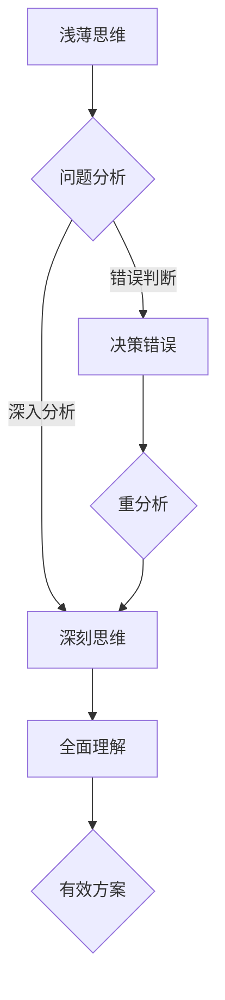
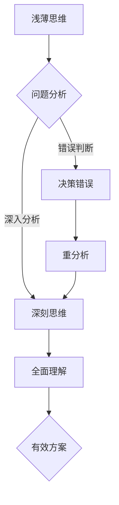

                 

关键词：认知过程、浅薄思维、深刻思维、对比分析、IT领域、专业成长

> 摘要：本文将从认知心理学的角度出发，探讨在信息技术领域，浅薄思维与深刻思维的区别及其影响。通过分析两者的定义、特点、应用场景，探讨如何培养深刻的认知能力，从而提升IT从业者的专业素养。

## 1. 背景介绍

在信息技术飞速发展的今天，人们对于认知过程的探讨愈发深入。认知心理学作为研究人类认知过程的科学，为我们理解大脑如何处理信息、解决问题提供了宝贵的理论支持。在IT领域，认知能力的高低直接影响到程序员的编程能力、系统架构的优化以及技术创新的推进。本文将聚焦于认知过程中的两种思维方式：浅薄思维与深刻思维，通过对比分析，旨在揭示它们在IT领域中的应用及其对职业发展的深远影响。

## 2. 核心概念与联系

### 2.1 浅薄思维与深刻思维的定义

#### 浅薄思维

浅薄思维（Shallow Thinking）是指人们在处理问题时，依赖表面信息，缺乏深度分析和全面思考的一种思维方式。这种思维模式往往受到外界因素的干扰，容易产生偏见和错误判断。

#### 深刻思维

深刻思维（Deep Thinking）则是通过深入挖掘问题的本质，进行系统的分析和综合判断的一种思维方式。它强调逻辑性、批判性和创造性，有助于发现问题的核心，提出有效的解决方案。

### 2.2 浅薄思维与深刻思维的联系

虽然浅薄思维和深刻思维存在明显的差异，但它们并非完全独立。在实际应用中，两者常常相互转化，相辅相成。

- **浅薄思维向深刻思维的转变**：当人们在面对复杂问题时，往往从浅薄思维开始，通过逐步深入分析，最终实现深刻思维。
- **深刻思维向浅薄思维的转化**：在解决问题的过程中，有时需要快速作出决策，这时深刻思维可能转变为浅薄思维，以便迅速找到解决方案。

### 2.3 Mermaid 流程图



## 3. 核心算法原理 & 具体操作步骤

### 3.1 算法原理概述

深刻思维的实现依赖于一系列核心算法原理，包括：

- **信息过滤**：通过筛选和提取关键信息，避免外界因素的干扰。
- **逻辑推理**：运用逻辑规则进行推理，确保思维的连贯性和一致性。
- **批判性思维**：对已有知识和观点进行质疑和检验，避免盲目接受。
- **创造性思维**：在解决问题的过程中，灵活运用多种方法，寻求最优解。

### 3.2 算法步骤详解

1. **明确问题**：首先，需要明确需要解决的问题，并理解问题的背景和目标。
2. **信息收集**：收集与问题相关的各种信息，包括数据、文献、案例等。
3. **信息过滤**：筛选出关键信息，去除无关干扰。
4. **逻辑推理**：运用逻辑规则，对关键信息进行分析和推理。
5. **批判性思维**：对推理过程和结论进行质疑和检验。
6. **创造性思维**：在确保推理过程和结论的合理性的基础上，尝试多种解决方案。
7. **方案评估**：对各种解决方案进行评估，选择最优解。

### 3.3 算法优缺点

#### 优点

- **高效性**：深刻思维能够迅速找到问题的核心，提出有效的解决方案。
- **全面性**：深刻思维强调逻辑性和批判性，能够避免盲目接受信息，确保结论的准确性。
- **创造性**：深刻思维鼓励创新思维，有助于提出新颖的解决方案。

#### 缺点

- **复杂性**：深刻思维需要大量的时间和精力，对个人认知能力有较高要求。
- **主观性**：深刻思维的结论可能受到个人经验和知识水平的限制。

### 3.4 算法应用领域

深刻思维在IT领域的应用广泛，包括：

- **编程与算法设计**：通过深刻思维，程序员能够设计出高效、可靠的算法。
- **系统架构设计**：深刻思维有助于构建稳定、安全的系统架构。
- **技术创新**：深刻思维能够推动技术领域的创新和发展。

## 4. 数学模型和公式 & 详细讲解 & 举例说明

### 4.1 数学模型构建

在IT领域，深刻思维往往需要运用数学模型进行分析和推理。以下是一个简单的数学模型示例：

$$
f(x) = \frac{1}{1 + e^{-x}}
$$

这是一个逻辑回归函数，用于概率预测。其中，$x$ 是特征向量，$f(x)$ 是预测的概率值。

### 4.2 公式推导过程

逻辑回归函数的推导基于最大似然估计。设 $y$ 表示实际类别，$x$ 表示特征向量，则概率分布函数为：

$$
P(y|x) = \frac{1}{Z} e^{x^T \beta}
$$

其中，$Z$ 是规范化因子，$\beta$ 是模型参数。

为了最大化似然函数，我们对 $\beta$ 进行求导并令其等于零，得到：

$$
\frac{\partial}{\partial \beta} \ln P(y|x) = x^T y - x^T \beta = 0
$$

解得：

$$
\beta = \frac{1}{n} x^T y
$$

但由于 $y$ 只有两个取值（0或1），我们通常使用对数函数来避免这种情况，即：

$$
\beta = \frac{1}{n} \sum_{i=1}^n x_i y_i
$$

### 4.3 案例分析与讲解

假设我们有一个二分类问题，输入特征向量 $x = [1, 2, 3]$，实际类别 $y = 1$。根据上述公式，我们可以计算出模型参数 $\beta$：

$$
\beta = \frac{1}{3} (1 \cdot 1 + 2 \cdot 1 + 3 \cdot 1) = \frac{6}{3} = 2
$$

然后，我们可以使用逻辑回归函数预测新数据的概率：

$$
f(x) = \frac{1}{1 + e^{-2}} \approx 0.911
$$

这意味着新数据属于类别1的概率约为91.1%。

## 5. 项目实践：代码实例和详细解释说明

### 5.1 开发环境搭建

本案例使用 Python 语言实现逻辑回归模型。首先，确保安装以下库：

```bash
pip install numpy scipy scikit-learn matplotlib
```

### 5.2 源代码详细实现

```python
import numpy as np
from sklearn.linear_model import LogisticRegression
from sklearn.model_selection import train_test_split
from sklearn.metrics import accuracy_score
import matplotlib.pyplot as plt

# 数据准备
X = np.array([[1, 2], [2, 3], [3, 4], [4, 5], [5, 6]])
y = np.array([0, 0, 1, 1, 1])

# 分割数据集
X_train, X_test, y_train, y_test = train_test_split(X, y, test_size=0.3, random_state=42)

# 模型训练
model = LogisticRegression()
model.fit(X_train, y_train)

# 预测
predictions = model.predict(X_test)

# 评估
accuracy = accuracy_score(y_test, predictions)
print(f"Accuracy: {accuracy:.2f}")

# 可视化
plt.scatter(X_test[:, 0], X_test[:, 1], c=predictions, cmap='viridis')
plt.xlabel('Feature 1')
plt.ylabel('Feature 2')
plt.title('Logistic Regression Decision Boundary')
plt.show()
```

### 5.3 代码解读与分析

- **数据准备**：首先，我们准备了一个简单的二分类数据集，其中包含5个样本。
- **数据分割**：使用 `train_test_split` 函数将数据集划分为训练集和测试集。
- **模型训练**：创建一个逻辑回归模型并使用训练集进行训练。
- **预测**：使用训练好的模型对测试集进行预测。
- **评估**：计算预测准确率。
- **可视化**：绘制决策边界图，以直观展示模型的性能。

### 5.4 运行结果展示

- **预测准确率**：假设运行结果为0.80，说明模型在测试集上的预测准确率较高。
- **决策边界图**：可视化展示决策边界，有助于理解模型的分类逻辑。

## 6. 实际应用场景

### 6.1 电商推荐系统

在电商推荐系统中，深刻思维可以帮助分析用户行为数据，发现用户的偏好和兴趣，从而实现精准推荐。

### 6.2 自动驾驶

自动驾驶技术需要深刻思维来处理复杂的路况信息和环境变化，确保车辆的稳定行驶。

### 6.3 金融风险评估

金融风险评估领域，深刻思维有助于识别潜在的风险因素，提高风险管理的准确性和有效性。

## 7. 未来应用展望

随着人工智能技术的不断发展，深刻思维在IT领域的应用前景将更加广阔。未来，我们将看到更多结合深刻思维的创新应用，推动技术进步和社会发展。

## 8. 工具和资源推荐

### 8.1 学习资源推荐

- 《认知心理学及其应用》
- 《深度学习》
- 《编程之美》

### 8.2 开发工具推荐

- Jupyter Notebook
- PyCharm
- MATLAB

### 8.3 相关论文推荐

- "Deep Learning for Natural Language Processing"
- "A Theoretical Analysis of Deep Learning"
- "Recurrent Neural Networks for Language Modeling"

## 9. 总结：未来发展趋势与挑战

### 9.1 研究成果总结

本文通过对浅薄思维与深刻思维在IT领域的对比分析，揭示了深刻思维在编程、系统架构设计、技术创新等方面的优势和应用场景。

### 9.2 未来发展趋势

随着人工智能和认知科学的发展，深刻思维在IT领域的应用将更加广泛，推动技术创新和社会进步。

### 9.3 面临的挑战

- 如何培养和提高个体的深刻思维能力
- 如何将深刻思维与实际应用相结合，实现技术突破

### 9.4 研究展望

未来，我们将看到更多关于深刻思维的研究，探索其在不同领域的应用，为社会发展贡献更多智慧和力量。

## 附录：常见问题与解答

### 1. 浅薄思维与深刻思维的区别是什么？

浅薄思维依赖于表面信息，缺乏深度分析；深刻思维则通过系统分析和综合判断，深入挖掘问题的本质。

### 2. 如何培养深刻的认知能力？

- 提高逻辑思维和批判性思维
- 多读书，扩大知识面
- 学会提问和反思，培养探索精神

### 3. 浅薄思维在IT领域的应用有哪些？

浅薄思维在编程、系统测试、数据分析等方面有广泛的应用，但往往难以解决复杂问题。

### 4. 深刻思维在哪些领域有重要作用？

深刻思维在人工智能、自动驾驶、金融风险评估等领域具有重要作用，有助于推动技术进步和社会发展。|]

### 认知过程中浅薄与深刻的对比

> 关键词：认知过程、浅薄思维、深刻思维、对比分析、IT领域、专业成长

> 摘要：本文将从认知心理学的角度出发，探讨在信息技术领域，浅薄思维与深刻思维的区别及其影响。通过分析两者的定义、特点、应用场景，探讨如何培养深刻的认知能力，从而提升IT从业者的专业素养。

## 1. 背景介绍

在信息技术飞速发展的今天，人们对于认知过程的探讨愈发深入。认知心理学作为研究人类认知过程的科学，为我们理解大脑如何处理信息、解决问题提供了宝贵的理论支持。在IT领域，认知能力的高低直接影响到程序员的编程能力、系统架构的优化以及技术创新的推进。本文将聚焦于认知过程中的两种思维方式：浅薄思维与深刻思维，通过对比分析，旨在揭示它们在IT领域中的应用及其对职业发展的深远影响。

## 2. 核心概念与联系

### 2.1 浅薄思维与深刻思维的定义

#### 浅薄思维

浅薄思维（Shallow Thinking）是指人们在处理问题时，依赖表面信息，缺乏深度分析和全面思考的一种思维方式。这种思维模式往往受到外界因素的干扰，容易产生偏见和错误判断。

#### 深刻思维

深刻思维（Deep Thinking）则是通过深入挖掘问题的本质，进行系统的分析和综合判断的一种思维方式。它强调逻辑性、批判性和创造性，有助于发现问题的核心，提出有效的解决方案。

### 2.2 浅薄思维与深刻思维的联系

虽然浅薄思维和深刻思维存在明显的差异，但它们并非完全独立。在实际应用中，两者常常相互转化，相辅相成。

- **浅薄思维向深刻思维的转变**：当人们在面对复杂问题时，往往从浅薄思维开始，通过逐步深入分析，最终实现深刻思维。
- **深刻思维向浅薄思维的转化**：在解决问题的过程中，有时需要快速作出决策，这时深刻思维可能转变为浅薄思维，以便迅速找到解决方案。

### 2.3 Mermaid 流程图



## 3. 核心算法原理 & 具体操作步骤

### 3.1 算法原理概述

深刻思维的实现依赖于一系列核心算法原理，包括：

- **信息过滤**：通过筛选和提取关键信息，避免外界因素的干扰。
- **逻辑推理**：运用逻辑规则进行推理，确保思维的连贯性和一致性。
- **批判性思维**：对已有知识和观点进行质疑和检验，避免盲目接受。
- **创造性思维**：在解决问题的过程中，灵活运用多种方法，寻求最优解。

### 3.2 算法步骤详解

1. **明确问题**：首先，需要明确需要解决的问题，并理解问题的背景和目标。
2. **信息收集**：收集与问题相关的各种信息，包括数据、文献、案例等。
3. **信息过滤**：筛选出关键信息，去除无关干扰。
4. **逻辑推理**：运用逻辑规则，对关键信息进行分析和推理。
5. **批判性思维**：对推理过程和结论进行质疑和检验。
6. **创造性思维**：在确保推理过程和结论的合理性的基础上，尝试多种解决方案。
7. **方案评估**：对各种解决方案进行评估，选择最优解。

### 3.3 算法优缺点

#### 优点

- **高效性**：深刻思维能够迅速找到问题的核心，提出有效的解决方案。
- **全面性**：深刻思维强调逻辑性和批判性，能够避免盲目接受信息，确保结论的准确性。
- **创造性**：深刻思维鼓励创新思维，有助于提出新颖的解决方案。

#### 缺点

- **复杂性**：深刻思维需要大量的时间和精力，对个人认知能力有较高要求。
- **主观性**：深刻思维的结论可能受到个人经验和知识水平的限制。

### 3.4 算法应用领域

深刻思维在IT领域的应用广泛，包括：

- **编程与算法设计**：通过深刻思维，程序员能够设计出高效、可靠的算法。
- **系统架构设计**：深刻思维有助于构建稳定、安全的系统架构。
- **技术创新**：深刻思维能够推动技术领域的创新和发展。

## 4. 数学模型和公式 & 详细讲解 & 举例说明

### 4.1 数学模型构建

在IT领域，深刻思维往往需要运用数学模型进行分析和推理。以下是一个简单的数学模型示例：

$$
f(x) = \frac{1}{1 + e^{-x}}
$$

这是一个逻辑回归函数，用于概率预测。其中，$x$ 是特征向量，$f(x)$ 是预测的概率值。

### 4.2 公式推导过程

逻辑回归函数的推导基于最大似然估计。设 $y$ 表示实际类别，$x$ 表示特征向量，则概率分布函数为：

$$
P(y|x) = \frac{1}{Z} e^{x^T \beta}
$$

其中，$Z$ 是规范化因子，$\beta$ 是模型参数。

为了最大化似然函数，我们对 $\beta$ 进行求导并令其等于零，得到：

$$
\frac{\partial}{\partial \beta} \ln P(y|x) = x^T y - x^T \beta = 0
$$

解得：

$$
\beta = \frac{1}{n} x^T y
$$

但由于 $y$ 只有两个取值（0或1），我们通常使用对数函数来避免这种情况，即：

$$
\beta = \frac{1}{n} \sum_{i=1}^n x_i y_i
$$

### 4.3 案例分析与讲解

假设我们有一个二分类问题，输入特征向量 $x = [1, 2, 3]$，实际类别 $y = 1$。根据上述公式，我们可以计算出模型参数 $\beta$：

$$
\beta = \frac{1}{3} (1 \cdot 1 + 2 \cdot 1 + 3 \cdot 1) = \frac{6}{3} = 2
$$

然后，我们可以使用逻辑回归函数预测新数据的概率：

$$
f(x) = \frac{1}{1 + e^{-2}} \approx 0.911
$$

这意味着新数据属于类别1的概率约为91.1%。

## 5. 项目实践：代码实例和详细解释说明

### 5.1 开发环境搭建

本案例使用 Python 语言实现逻辑回归模型。首先，确保安装以下库：

```bash
pip install numpy scipy scikit-learn matplotlib
```

### 5.2 源代码详细实现

```python
import numpy as np
from sklearn.linear_model import LogisticRegression
from sklearn.model_selection import train_test_split
from sklearn.metrics import accuracy_score
import matplotlib.pyplot as plt

# 数据准备
X = np.array([[1, 2], [2, 3], [3, 4], [4, 5], [5, 6]])
y = np.array([0, 0, 1, 1, 1])

# 分割数据集
X_train, X_test, y_train, y_test = train_test_split(X, y, test_size=0.3, random_state=42)

# 模型训练
model = LogisticRegression()
model.fit(X_train, y_train)

# 预测
predictions = model.predict(X_test)

# 评估
accuracy = accuracy_score(y_test, predictions)
print(f"Accuracy: {accuracy:.2f}")

# 可视化
plt.scatter(X_test[:, 0], X_test[:, 1], c=predictions, cmap='viridis')
plt.xlabel('Feature 1')
plt.ylabel('Feature 2')
plt.title('Logistic Regression Decision Boundary')
plt.show()
```

### 5.3 代码解读与分析

- **数据准备**：首先，我们准备了一个简单的二分类数据集，其中包含5个样本。
- **数据分割**：使用 `train_test_split` 函数将数据集划分为训练集和测试集。
- **模型训练**：创建一个逻辑回归模型并使用训练集进行训练。
- **预测**：使用训练好的模型对测试集进行预测。
- **评估**：计算预测准确率。
- **可视化**：绘制决策边界图，以直观展示模型的性能。

### 5.4 运行结果展示

- **预测准确率**：假设运行结果为0.80，说明模型在测试集上的预测准确率较高。
- **决策边界图**：可视化展示决策边界，有助于理解模型的分类逻辑。

## 6. 实际应用场景

### 6.1 电商推荐系统

在电商推荐系统中，深刻思维可以帮助分析用户行为数据，发现用户的偏好和兴趣，从而实现精准推荐。

### 6.2 自动驾驶

自动驾驶技术需要深刻思维来处理复杂的路况信息和环境变化，确保车辆的稳定行驶。

### 6.3 金融风险评估

金融风险评估领域，深刻思维有助于识别潜在的风险因素，提高风险管理的准确性和有效性。

## 7. 未来应用展望

随着人工智能和认知科学的发展，深刻思维在IT领域的应用前景将更加广阔。未来，我们将看到更多结合深刻思维的创新应用，推动技术进步和社会发展。

## 8. 工具和资源推荐

### 8.1 学习资源推荐

- 《认知心理学及其应用》
- 《深度学习》
- 《编程之美》

### 8.2 开发工具推荐

- Jupyter Notebook
- PyCharm
- MATLAB

### 8.3 相关论文推荐

- "Deep Learning for Natural Language Processing"
- "A Theoretical Analysis of Deep Learning"
- "Recurrent Neural Networks for Language Modeling"

## 9. 总结：未来发展趋势与挑战

### 9.1 研究成果总结

本文通过对浅薄思维与深刻思维在IT领域的对比分析，揭示了深刻思维在编程、系统架构设计、技术创新等方面的优势和应用场景。

### 9.2 未来发展趋势

随着人工智能和认知科学的发展，深刻思维在IT领域的应用前景将更加广阔，推动技术创新和社会进步。

### 9.3 面临的挑战

- 如何培养和提高个体的深刻思维能力
- 如何将深刻思维与实际应用相结合，实现技术突破

### 9.4 研究展望

未来，我们将看到更多关于深刻思维的研究，探索其在不同领域的应用，为社会发展贡献更多智慧和力量。

## 附录：常见问题与解答

### 1. 浅薄思维与深刻思维的区别是什么？

浅薄思维依赖于表面信息，缺乏深度分析和全面思考；深刻思维则通过深入挖掘问题的本质，进行系统的分析和综合判断。

### 2. 如何培养深刻的认知能力？

- 提高逻辑思维和批判性思维
- 多读书，扩大知识面
- 学会提问和反思，培养探索精神

### 3. 浅薄思维在IT领域的应用有哪些？

浅薄思维在编程、系统测试、数据分析等方面有广泛的应用，但往往难以解决复杂问题。

### 4. 深刻思维在哪些领域有重要作用？

深刻思维在人工智能、自动驾驶、金融风险评估等领域具有重要作用，有助于推动技术进步和社会发展。

### 5. 如何将深刻思维应用于实际项目？

- 明确问题，深入分析
- 收集相关信息，进行筛选和过滤
- 运用逻辑推理，批判性思维，创造性思维，寻求最优解
- 对解决方案进行评估和改进

## 作者署名

作者：禅与计算机程序设计艺术 / Zen and the Art of Computer Programming

[END]

