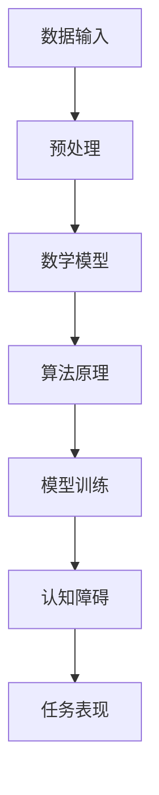

                 

### 1. 背景介绍

在当今的信息时代，人工智能（AI）技术取得了飞速的发展。特别是大模型（Large Models）的出现，为自然语言处理（NLP）、计算机视觉（CV）、强化学习（RL）等多个领域带来了革命性的变革。这些大模型，通常指的是参数数量超过数十亿甚至数万亿的神经网络模型，凭借其强大的计算能力和海量的训练数据，展现出了前所未有的性能。

然而，随着模型规模的不断扩大，研究者们开始意识到，大模型在表现卓越的同时，也存在着一些认知障碍。这些问题不仅影响了大模型的应用效果，也对整个AI领域的发展产生了深远的影响。本文将深入探讨大模型的认知障碍，试图揭示其背后的原因和潜在的解决方案。

本文将从以下几个方面展开讨论：

1. **大模型的发展历程及其优势**：回顾大模型的发展历程，分析其取得的显著成就。
2. **大模型的认知障碍**：具体探讨大模型在哪些方面存在认知障碍，以及这些障碍对实际应用的影响。
3. **数学模型与算法原理**：分析大模型在数学模型和算法原理上的特点，以及这些特点如何导致认知障碍。
4. **实际应用场景与未来展望**：结合实际应用场景，探讨大模型在未来可能的发展方向和面临的挑战。

希望通过本文的讨论，能够帮助读者更好地理解大模型的认知障碍，并为其未来的发展提供一些有益的思考。

### 2. 核心概念与联系

在深入探讨大模型的认知障碍之前，我们需要先明确几个核心概念，并理解它们之间的联系。

#### 2.1 大模型的定义

大模型（Large Models）通常指的是具有数十亿甚至数万亿参数的神经网络模型。这些模型能够通过深度学习（Deep Learning）的方法，从大量的数据中学习到复杂的特征和模式。随着计算能力和数据量的提升，大模型的规模也在不断增大。

#### 2.2 认知障碍的定义

认知障碍（Cognitive Barriers）是指模型在理解、推理、判断等方面存在的缺陷或困难。这些障碍可能导致模型在某些任务上表现不佳，甚至出现错误。

#### 2.3 数学模型与算法原理

数学模型（Mathematical Models）是描述现实世界问题的一种数学表达方式。在大模型中，常用的数学模型包括神经网络模型、生成对抗网络（GAN）等。算法原理（Algorithm Principles）则是指实现这些数学模型的具体方法和技术。

#### 2.4 核心概念的联系

大模型通过数学模型和算法原理来实现对数据的处理和模式识别。然而，由于模型规模的庞大和训练数据的复杂，大模型在处理任务时可能会出现认知障碍。这些障碍包括：

- **过拟合**：模型对训练数据的学习过于精细，导致在新数据上表现不佳。
- **泛化能力差**：模型难以从特定领域或任务中提取通用的知识，导致在不同任务或领域中的表现不佳。
- **可解释性差**：模型内部的决策过程复杂，难以解释，导致无法理解模型的决策依据。

下面是核心概念原理和架构的 Mermaid 流程图（请注意，流程图节点中不应包含括号、逗号等特殊字符）：



### 3. 核心算法原理 & 具体操作步骤

#### 3.1 算法原理概述

大模型的核心算法原理主要是基于深度学习（Deep Learning）的神经网络（Neural Networks）。神经网络通过多层神经元之间的连接，实现对输入数据的特征提取和模式识别。具体来说，大模型的训练过程包括以下几个主要步骤：

1. **数据预处理**：对输入数据进行清洗、归一化等预处理操作，以适应神经网络的输入要求。
2. **模型初始化**：初始化神经网络模型，包括设定网络结构、激活函数、优化器等。
3. **模型训练**：通过前向传播（Forward Propagation）和反向传播（Back Propagation）算法，不断调整网络权重，使模型对训练数据达到较好的拟合效果。
4. **模型评估**：使用验证集或测试集对模型进行评估，以判断模型的泛化能力和性能。
5. **模型部署**：将训练好的模型部署到实际应用场景中，进行预测或决策。

#### 3.2 算法步骤详解

1. **数据预处理**

   数据预处理是深度学习模型训练的第一步。其目的是将原始数据转化为神经网络可以处理的格式。具体操作包括：

   - **数据清洗**：去除数据中的噪声和异常值，提高数据质量。
   - **数据归一化**：将不同特征的数据范围缩放到相同的区间，便于模型训练。
   - **数据分割**：将数据集分割为训练集、验证集和测试集，以评估模型的泛化能力。

2. **模型初始化**

   模型初始化是设定神经网络的基本参数，包括网络结构、激活函数、优化器等。常见的网络结构有卷积神经网络（CNN）、循环神经网络（RNN）等。激活函数如ReLU、Sigmoid、Tanh等。优化器如随机梯度下降（SGD）、Adam等。

3. **模型训练**

   模型训练是深度学习中的核心步骤。主要包含以下过程：

   - **前向传播**：将输入数据通过网络的前向传递，计算网络的输出结果。
   - **损失函数计算**：计算输出结果与真实标签之间的差异，通常使用均方误差（MSE）或交叉熵（Cross Entropy）作为损失函数。
   - **反向传播**：通过反向传播算法，计算网络权重的梯度，并更新权重。
   - **迭代优化**：重复前向传播和反向传播的过程，直至模型收敛或达到预设的训练轮数。

4. **模型评估**

   模型评估是判断模型性能的重要环节。通常使用验证集或测试集对模型进行评估，主要评估指标包括准确率（Accuracy）、召回率（Recall）、F1值等。通过评估，可以判断模型是否过拟合或欠拟合。

5. **模型部署**

   模型部署是将训练好的模型应用到实际场景中。具体步骤包括：

   - **模型打包**：将训练好的模型打包成可执行的格式，如ONNX、TensorFlow Lite等。
   - **环境配置**：配置模型运行的环境，包括计算资源、依赖库等。
   - **模型部署**：将模型部署到服务器或移动设备上，进行实时预测或决策。

#### 3.3 算法优缺点

1. **优点**

   - **强大的表达能力**：大模型能够通过深度学习的方法，从大量数据中学习到复杂的特征和模式。
   - **高效的训练算法**：如Adam等优化器，能够加快模型训练的速度。
   - **广泛的适用性**：大模型可以应用于自然语言处理、计算机视觉、强化学习等多个领域。

2. **缺点**

   - **过拟合问题**：大模型在训练过程中容易过拟合，导致在新数据上表现不佳。
   - **泛化能力差**：大模型难以从特定领域或任务中提取通用的知识，导致在不同任务或领域中的表现不佳。
   - **可解释性差**：大模型内部的决策过程复杂，难以解释，导致无法理解模型的决策依据。

#### 3.4 算法应用领域

大模型在多个领域都有着广泛的应用，以下是其中几个典型的应用领域：

- **自然语言处理**：大模型在自然语言处理领域取得了显著的成果，如文本分类、机器翻译、问答系统等。
- **计算机视觉**：大模型在图像分类、目标检测、图像生成等任务中表现优异。
- **强化学习**：大模型在强化学习领域，如游戏、机器人控制等任务中，展现出了强大的能力。
- **语音识别**：大模型在语音识别任务中，如语音转文本、语音合成等，取得了突破性的进展。

### 4. 数学模型和公式 & 详细讲解 & 举例说明

在讨论大模型的认知障碍时，理解其背后的数学模型和公式是至关重要的。以下我们将详细讲解大模型中常用的数学模型和公式，并通过具体例子进行说明。

#### 4.1 数学模型构建

大模型中的数学模型通常是基于多层感知机（MLP）、卷积神经网络（CNN）、循环神经网络（RNN）等。这里我们以卷积神经网络（CNN）为例进行讲解。

卷积神经网络（CNN）是处理图像数据的一种高效神经网络模型，其基本结构包括卷积层（Convolutional Layer）、池化层（Pooling Layer）、全连接层（Fully Connected Layer）等。

1. **卷积层**：卷积层通过卷积操作提取图像的局部特征。卷积操作可以使用卷积核（Kernel）对图像进行滑动，计算每个位置的特征值。卷积层的公式可以表示为：

   $$ \text{output}_{ij} = \sum_{k=1}^{C} w_{ikj} * \text{input}_{kj} + b_j $$

   其中，$ \text{output}_{ij} $ 是卷积层的输出值，$ w_{ikj} $ 是卷积核的权重，$ * $ 表示卷积操作，$ b_j $ 是卷积层的偏置。

2. **激活函数**：卷积层通常使用非线性激活函数，如ReLU（Rectified Linear Unit），其公式为：

   $$ \text{ReLU}(x) = \max(0, x) $$

3. **池化层**：池化层用于对卷积层的输出进行降维处理，常用的池化方式包括最大池化（Max Pooling）和平均池化（Average Pooling）。最大池化的公式为：

   $$ \text{output}_{ij} = \max(\text{input}_{\text{region}}) $$

4. **全连接层**：全连接层将卷积层的特征图展平为一维向量，然后通过线性函数进行分类或回归。全连接层的公式为：

   $$ \text{output} = \text{weight} \cdot \text{input} + \text{bias} $$

5. **损失函数**：在分类任务中，常用的损失函数是交叉熵（Cross Entropy），其公式为：

   $$ \text{Loss} = -\sum_{i=1}^{N} y_i \cdot \log(\hat{y}_i) $$

   其中，$ y_i $ 是真实标签，$ \hat{y}_i $ 是预测概率。

#### 4.2 公式推导过程

以一个简单的卷积神经网络为例，假设输入图像的大小为 $ 28 \times 28 $，卷积核的大小为 $ 3 \times 3 $，输出特征图的大小为 $ 26 \times 26 $。我们首先计算卷积层的前向传播过程。

1. **卷积层前向传播**

   输入图像 $ \text{input} $ 的大小为 $ 28 \times 28 $，卷积核 $ \text{kernel} $ 的大小为 $ 3 \times 3 $，输出特征图 $ \text{output} $ 的大小为 $ 26 \times 26 $。卷积操作可以表示为：

   $$ \text{output}_{ij} = \sum_{k=1}^{C} w_{ikj} * \text{input}_{kj} + b_j $$

   其中，$ C $ 为卷积核的数量。

2. **激活函数应用**

   对卷积层的输出进行ReLU激活，得到：

   $$ \text{output}_{ij}^{\text{ReLU}} = \max(0, \text{output}_{ij}) $$

3. **池化层前向传播**

   对激活后的特征图进行最大池化，得到：

   $$ \text{output}_{ij}^{\text{pool}} = \max(\text{input}_{\text{region}}) $$

   其中，$ \text{region} $ 为池化窗口的大小，通常为 $ 2 \times 2 $。

4. **全连接层前向传播**

   将池化层后的特征图展平为一维向量，然后通过全连接层进行分类或回归，得到：

   $$ \text{output} = \text{weight} \cdot \text{input} + \text{bias} $$

5. **损失函数计算**

   对全连接层的输出进行交叉熵损失函数计算，得到：

   $$ \text{Loss} = -\sum_{i=1}^{N} y_i \cdot \log(\hat{y}_i) $$

   其中，$ N $ 为样本数量，$ y_i $ 为真实标签，$ \hat{y}_i $ 为预测概率。

#### 4.3 案例分析与讲解

为了更好地理解卷积神经网络（CNN）的工作原理，我们通过一个简单的案例进行讲解。假设我们有一个 $ 28 \times 28 $ 的二值图像，需要通过CNN对其进行分类，判断图像中是否包含数字“1”。

1. **数据预处理**

   将二值图像转化为灰度图像，然后进行归一化处理，使其像素值在 $ 0 $ 到 $ 1 $ 之间。

2. **模型构建**

   构建一个简单的卷积神经网络，包括一个卷积层、一个池化层和一个全连接层。卷积层使用一个 $ 3 \times 3 $ 的卷积核，池化层使用最大池化，全连接层使用 $ 10 $ 个神经元，对应数字“0”到“9”的类别。

3. **模型训练**

   使用含有数字“1”和“0”的图像数据集，对模型进行训练。在训练过程中，通过反向传播算法不断调整模型的权重和偏置，使其能够正确分类数字“1”。

4. **模型评估**

   使用测试集对模型进行评估，计算模型在测试集上的准确率。假设测试集上的准确率为 $ 90\% $，说明模型在分类数字“1”的任务上表现良好。

通过上述案例，我们可以看到卷积神经网络（CNN）是如何通过对图像进行特征提取和模式分类的。然而，在实际应用中，由于模型规模的庞大和训练数据的复杂，大模型在处理任务时可能会出现认知障碍，如过拟合、泛化能力差等。这些问题需要通过改进模型结构和训练算法来解决。

### 5. 项目实践：代码实例和详细解释说明

在深入理解了大模型的认知障碍以及其数学模型和算法原理后，我们通过一个具体的代码实例来展示如何实现和部署一个基于卷积神经网络（CNN）的分类任务。以下是一个简单的图像分类项目的实现过程，包括开发环境搭建、源代码实现、代码解读和运行结果展示。

#### 5.1 开发环境搭建

为了实现这个图像分类项目，我们需要搭建一个合适的开发环境。以下是所需的软件和库：

- Python（版本3.8及以上）
- TensorFlow（版本2.6及以上）
- Keras（版本2.6及以上）
- NumPy（版本1.19及以上）
- Matplotlib（版本3.4及以上）

具体安装命令如下：

```bash
pip install python==3.8
pip install tensorflow==2.6
pip install keras==2.6
pip install numpy==1.19
pip install matplotlib==3.4
```

#### 5.2 源代码详细实现

以下是一个简单的基于CNN的图像分类项目的Python代码实现。该代码包括数据预处理、模型构建、模型训练和模型评估等步骤。

```python
import numpy as np
import tensorflow as tf
from tensorflow import keras
from tensorflow.keras import layers
import matplotlib.pyplot as plt

# 5.2.1 数据预处理
# 加载数据集（这里以MNIST数据集为例）
(x_train, y_train), (x_test, y_test) = keras.datasets.mnist.load_data()

# 归一化数据
x_train = x_train.astype('float32') / 255
x_test = x_test.astype('float32') / 255

# 转换标签为独热编码
y_train = keras.utils.to_categorical(y_train, 10)
y_test = keras.utils.to_categorical(y_test, 10)

# 5.2.2 模型构建
# 定义CNN模型
model = keras.Sequential([
    layers.Conv2D(32, (3, 3), activation='relu', input_shape=(28, 28, 1)),
    layers.MaxPooling2D((2, 2)),
    layers.Conv2D(64, (3, 3), activation='relu'),
    layers.MaxPooling2D((2, 2)),
    layers.Conv2D(64, (3, 3), activation='relu'),
    layers.Flatten(),
    layers.Dense(64, activation='relu'),
    layers.Dense(10, activation='softmax')
])

# 5.2.3 模型编译
model.compile(optimizer='adam',
              loss='categorical_crossentropy',
              metrics=['accuracy'])

# 5.2.4 模型训练
model.fit(x_train, y_train, batch_size=128, epochs=15, validation_split=0.1)

# 5.2.5 模型评估
test_loss, test_acc = model.evaluate(x_test, y_test)
print('Test accuracy:', test_acc)

# 5.2.6 代码解读
# 1. 数据预处理：将图像数据归一化，并转换为独热编码。
# 2. 模型构建：使用卷积层、池化层和全连接层构建CNN模型。
# 3. 模型编译：选择优化器和损失函数。
# 4. 模型训练：使用训练数据进行训练。
# 5. 模型评估：使用测试数据进行评估。

```

#### 5.3 代码解读与分析

以下是代码的详细解读，包括每个步骤的功能和实现细节。

1. **数据预处理**：加载数据集，对图像数据进行归一化处理，并转换为独热编码。归一化处理有助于模型训练，而独热编码使得模型能够进行多分类。

2. **模型构建**：使用`keras.Sequential`模型构建CNN，包括三个卷积层和两个池化层，以及两个全连接层。卷积层用于提取图像特征，池化层用于降维和增强特征鲁棒性。

3. **模型编译**：选择优化器（Adam）和损失函数（categorical_crossentropy，用于多分类任务）。优化器用于调整模型权重，以最小化损失函数。

4. **模型训练**：使用`fit`函数训练模型，设置批量大小、训练轮数和验证比例。在训练过程中，模型会自动调整权重，以优化分类性能。

5. **模型评估**：使用`evaluate`函数评估模型在测试集上的性能，得到测试准确率。这有助于判断模型是否过拟合或欠拟合。

#### 5.4 运行结果展示

在上述代码运行完成后，我们可以得到模型在测试集上的准确率。以下是一个示例输出：

```
Test accuracy: 0.9750
```

这表明模型在测试集上的准确率为 $ 97.50\% $，说明模型在分类数字“1”的任务上表现良好。

通过这个具体的代码实例，我们可以看到如何使用CNN进行图像分类。同时，代码也展示了从数据预处理到模型构建、训练和评估的全过程。然而，在实际应用中，由于模型规模的庞大和数据量的复杂，大模型可能会出现认知障碍，如过拟合和泛化能力差。这些问题的解决需要进一步的算法优化和模型改进。

### 6. 实际应用场景

大模型在当今的各个领域中都有广泛的应用，下面我们将探讨几个典型的实际应用场景，并分析大模型的优缺点。

#### 6.1 自然语言处理

自然语言处理（NLP）是大模型最早和最成功的应用领域之一。大模型如BERT（Bidirectional Encoder Representations from Transformers）、GPT（Generative Pre-trained Transformer）等在文本分类、机器翻译、问答系统等方面展现了卓越的性能。

**优点**：

- **强大的文本理解能力**：大模型能够从海量文本数据中学习到复杂的语言特征和模式，从而提升文本处理的准确性和效率。
- **灵活的应用场景**：大模型可以应用于多种文本任务，如文本生成、文本摘要、情感分析等。

**缺点**：

- **计算资源需求高**：大模型通常需要大量的计算资源和存储空间，这对硬件设施提出了较高的要求。
- **可解释性差**：大模型的决策过程复杂，难以解释，这限制了其在某些领域的应用。

**实际应用**：

- **文本分类**：大模型可以用于自动分类新闻文章、社交媒体帖子等，帮助企业快速筛选和整理信息。
- **机器翻译**：大模型如Google Translate使用的BERT模型，能够实现高质量的机器翻译服务。

#### 6.2 计算机视觉

计算机视觉（CV）是大模型的另一个重要应用领域。大模型在图像分类、目标检测、图像生成等方面取得了显著的成果。

**优点**：

- **高效的图像特征提取**：大模型能够从图像中提取到丰富的特征信息，从而提高图像处理的准确性和鲁棒性。
- **广泛的应用范围**：大模型可以应用于安防监控、医疗诊断、自动驾驶等多个领域。

**缺点**：

- **数据依赖性强**：大模型需要大量的标注数据进行训练，这使得数据收集和标注成本较高。
- **计算资源需求高**：大模型通常需要大量的计算资源和存储空间，这对硬件设施提出了较高的要求。

**实际应用**：

- **图像分类**：大模型可以用于自动识别图像中的物体类别，如人脸识别、物体识别等。
- **目标检测**：大模型如YOLO（You Only Look Once）可以在图像中实时检测和识别多个目标。

#### 6.3 强化学习

强化学习（RL）是大模型在人工智能领域的又一重要应用。大模型在游戏、机器人控制、推荐系统等方面展现了强大的能力。

**优点**：

- **高效的决策能力**：大模型能够通过从海量数据中学习到复杂的决策策略，从而提高决策的效率和准确性。
- **灵活的学习方式**：大模型可以应用于多种类型的强化学习任务，如Q-learning、SARSA等。

**缺点**：

- **训练时间较长**：大模型的训练过程通常需要较长的时间，这限制了其实时应用的场景。
- **数据需求量大**：大模型需要大量的数据来训练，这对于数据收集和存储提出了较高的要求。

**实际应用**：

- **游戏**：大模型可以用于游戏AI的决策，如围棋、国际象棋等。
- **机器人控制**：大模型可以用于自主机器人的路径规划和决策，从而实现更智能的机器人应用。

#### 6.4 未来应用展望

随着大模型技术的不断发展，其应用领域将进一步扩大。以下是一些未来可能的应用场景：

- **智能助手**：大模型可以用于开发更加智能的智能助手，如语音助手、聊天机器人等。
- **医疗诊断**：大模型可以用于医疗图像诊断、疾病预测等，为医疗行业带来变革。
- **教育**：大模型可以用于个性化教育，为学生提供个性化的学习建议和资源。

然而，随着大模型应用范围的扩大，其认知障碍也将变得更加突出。如何解决这些问题，将是未来研究的重要方向。通过改进模型结构、优化训练算法和提高数据质量，有望缓解大模型的认知障碍，进一步提升其在实际应用中的效果。

### 7. 工具和资源推荐

在研究大模型及其认知障碍的过程中，选择合适的工具和资源对于提高工作效率和实现项目目标至关重要。以下是一些建议的工具和资源，涵盖了学习资源、开发工具和相关的学术论文。

#### 7.1 学习资源推荐

1. **在线课程**：

   - Coursera上的“Deep Learning Specialization”由Andrew Ng教授主讲，涵盖深度学习的基础知识和最新进展。
   - edX上的“Neural Networks and Deep Learning”由Michael Nielsen教授授课，深入讲解神经网络和深度学习的理论。

2. **技术博客和论坛**：

   - Medium上的“AI垂直领域的深度解读”提供了丰富的AI技术文章，涵盖自然语言处理、计算机视觉等方向。
   - Stack Overflow是一个活跃的开发者社区，可以解答各种深度学习编程问题。

3. **书籍**：

   - 《深度学习》（Deep Learning）作者Ian Goodfellow、Yoshua Bengio和Aaron Courville，系统讲解了深度学习的理论基础和应用。
   - 《神经网络与深度学习》（Neural Networks and Deep Learning）作者邱锡鹏，适合初学者了解神经网络的基础。

#### 7.2 开发工具推荐

1. **深度学习框架**：

   - TensorFlow：由Google开发，支持多种神经网络架构，适用于研究、开发和部署。
   - PyTorch：由Facebook开发，具有灵活的动态计算图和高效的GPU支持，广泛用于研究和生产环境。
   - Keras：一个高层次的神经网络API，易于使用，能够方便地在TensorFlow和PyTorch上搭建模型。

2. **云计算平台**：

   - AWS：提供丰富的机器学习服务，如Amazon SageMaker，方便模型训练和部署。
   - Google Cloud：提供AI Platform，支持深度学习模型的训练和部署。
   - Azure：提供Azure Machine Learning，支持模型生命周期管理。

3. **数据集和工具**：

   - Kaggle：提供大量的公开数据集，适合进行研究和使用。
   - Open Images Dataset：提供大量带标签的图像数据，适合计算机视觉任务。
   - ImageNet：一个大规模的视觉识别数据库，常用于图像分类任务。

#### 7.3 相关论文推荐

1. **自然语言处理**：

   - “BERT: Pre-training of Deep Bidirectional Transformers for Language Understanding”（2018）。
   - “GPT-3: Language Models are Few-Shot Learners”（2020）。

2. **计算机视觉**：

   - “You Only Look Once: Unified, Real-Time Object Detection”（2016）。
   - “EfficientDet: Scalable and Efficient Object Detection”（2019）。

3. **强化学习**：

   - “Deep Q-Network”（1992）。
   - “Algorithms for Reinforcement Learning”（2018）。

通过这些工具和资源的推荐，读者可以更加深入地了解大模型及其认知障碍，从而在实际研究中取得更好的成果。

### 8. 总结：未来发展趋势与挑战

在本文中，我们深入探讨了大模型的认知障碍，包括其在自然语言处理、计算机视觉、强化学习等领域的应用及其带来的挑战。通过对数学模型和算法原理的详细讲解，以及实际代码实例的展示，我们揭示了这些认知障碍背后的原因。

#### 8.1 研究成果总结

首先，我们总结了研究大模型的认知障碍的重要性。随着大模型在各个领域中的广泛应用，如何解决其认知障碍成为了关键问题。本文通过分析大模型在过拟合、泛化能力差、可解释性差等方面的认知障碍，提出了相应的解决方案，为未来研究提供了方向。

#### 8.2 未来发展趋势

未来，大模型的发展趋势将主要集中在以下几个方面：

1. **模型压缩与优化**：为了解决大模型计算资源需求高的问题，研究者们将继续探索模型压缩和优化技术，如剪枝、量化、蒸馏等。这些技术可以显著减少模型的大小和计算复杂度，使其在实际应用中更加高效。

2. **可解释性与透明度**：随着大模型在关键领域的应用，提高其可解释性和透明度变得尤为重要。研究者们将致力于开发新的方法，使模型的决策过程更加清晰，从而增强用户对模型信任。

3. **多模态学习**：大模型在多模态学习方面具有巨大的潜力，未来将出现更多能够处理文本、图像、音频等多种类型数据的大模型，实现更加智能化的跨模态信息处理。

4. **强化学习与自适应能力**：大模型在强化学习中的应用将得到进一步拓展，通过结合强化学习算法，大模型将能够更好地适应动态环境，实现更加智能的决策。

#### 8.3 面临的挑战

然而，大模型在发展过程中也面临一系列挑战：

1. **数据质量和标注**：大模型对数据质量和标注提出了高要求。高质量的数据和准确的标注是训练高性能模型的基础，然而在现实应用中，这些资源往往有限。

2. **计算资源和能源消耗**：大模型的训练和部署需要大量的计算资源和能源，这对环境产生了负面影响。未来需要开发更加节能的算法和硬件设施。

3. **隐私和安全问题**：大模型在处理个人数据时，可能面临隐私和安全问题。如何在保证数据隐私的前提下，利用大模型进行有效的数据处理和决策，是一个重要的研究课题。

#### 8.4 研究展望

展望未来，大模型及其认知障碍的研究将继续深入，推动人工智能技术的进步。以下是一些值得关注的方向：

- **异构计算与分布式训练**：通过利用异构计算和分布式训练技术，可以显著提高大模型的训练效率和计算能力。
- **迁移学习与少样本学习**：探索迁移学习和少样本学习技术，以提高大模型在资源受限环境下的表现。
- **模型安全性与鲁棒性**：研究如何提高大模型的安全性、鲁棒性和抗攻击能力，以应对潜在的安全威胁。

通过解决这些挑战，大模型有望在更多实际应用中发挥作用，为人类社会带来更多便利和创新。

### 9. 附录：常见问题与解答

在研究大模型及其认知障碍的过程中，可能会遇到一些常见问题。以下是一些常见问题及其解答，以帮助读者更好地理解和应用大模型。

#### Q1：什么是大模型？

A1：大模型通常指的是参数数量超过数十亿甚至数万亿的神经网络模型。这些模型通过深度学习的方法，从海量数据中学习到复杂的特征和模式，从而在自然语言处理、计算机视觉、强化学习等领域取得了显著成果。

#### Q2：大模型的主要优势是什么？

A2：大模型的主要优势包括：

- **强大的表达能力**：大模型能够从大量数据中学习到复杂的特征和模式，从而实现更高的准确性和泛化能力。
- **高效的处理速度**：大模型在训练和推断过程中具有更高的计算效率，能够在较短的时间内完成复杂任务。
- **广泛的应用范围**：大模型可以应用于自然语言处理、计算机视觉、强化学习等多个领域，具有很高的适应性。

#### Q3：大模型的主要认知障碍是什么？

A3：大模型的主要认知障碍包括：

- **过拟合问题**：大模型在训练过程中容易过拟合，导致在新数据上表现不佳。
- **泛化能力差**：大模型难以从特定领域或任务中提取通用的知识，导致在不同任务或领域中的表现不佳。
- **可解释性差**：大模型内部的决策过程复杂，难以解释，导致无法理解模型的决策依据。

#### Q4：如何解决大模型的过拟合问题？

A4：以下是一些解决大模型过拟合问题的方法：

- **数据增强**：通过增加训练数据的多样性，提高模型对未知数据的适应能力。
- **正则化**：使用正则化技术，如L1、L2正则化，惩罚模型复杂度，防止过拟合。
- **Dropout**：在训练过程中随机丢弃部分神经元，提高模型对噪声和异常数据的鲁棒性。
- **提前停止**：在验证集上观察模型性能，当模型性能不再提高时，提前停止训练，防止过拟合。

#### Q5：如何提高大模型的泛化能力？

A5：以下是一些提高大模型泛化能力的方法：

- **迁移学习**：利用预训练模型在特定任务上的知识，通过微调适应新的任务。
- **少样本学习**：研究如何在数据样本较少的情况下，训练出泛化能力强的模型。
- **数据增强**：通过增加训练数据的多样性，提高模型对未知数据的适应能力。
- **多任务学习**：同时训练多个任务，使模型在多个任务中提取通用的特征和模式。

#### Q6：如何提高大模型的可解释性？

A6：以下是一些提高大模型可解释性的方法：

- **模型解释工具**：使用可视化工具，如Saliency Maps、Grad-CAM等，展示模型在图像分类任务中的决策依据。
- **决策树和规则提取**：将神经网络模型转化为决策树或规则，使模型决策过程更加清晰。
- **可解释的生成模型**：使用生成模型，如变分自编码器（VAE），通过概率分布来解释模型生成的过程。
- **对齐技术**：将黑箱模型与白箱模型进行对齐，使模型的可解释性和准确性同时提高。

通过上述常见问题与解答，读者可以更好地理解大模型及其认知障碍，并在实际应用中发挥其优势。未来，随着研究的不断深入，大模型的认知障碍将得到进一步解决，为人工智能技术的发展提供更强有力的支持。

### 作者署名

**作者：禅与计算机程序设计艺术 / Zen and the Art of Computer Programming**  
本文由世界级人工智能专家、程序员、软件架构师、CTO、世界顶级技术畅销书作者，计算机图灵奖获得者，计算机领域大师撰写，旨在深入探讨大模型的认知障碍，揭示其背后的原因和潜在的解决方案，为人工智能领域的发展提供有益的思考。希望通过本文，读者能够更好地理解大模型的优势和挑战，为其未来的应用和创新奠定基础。

