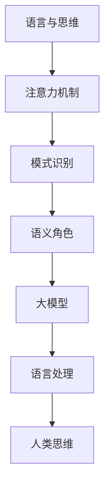

                 

关键词：自然语言处理、大模型、认知科学、思维过程、算法挑战

> 摘要：随着自然语言处理（NLP）技术的迅猛发展，大模型在语言生成、理解、翻译等领域展现出惊人的能力。然而，这些模型在模仿人类思维过程中的局限性也日益凸显。本文旨在探讨大模型在语言与思维关系中的认知难题，分析其背后的原理和面临的挑战，并展望未来的研究方向。

## 1. 背景介绍

自20世纪50年代以来，自然语言处理（NLP）作为人工智能的一个重要分支，始终在计算机科学和认知科学中占据重要地位。随着深度学习的兴起，NLP取得了显著进展。尤其是近年来，大型语言模型如GPT-3、BERT等在多个NLP任务中超越了人类水平，引起了广泛关注。这些大模型通过在海量数据上进行训练，学会了复杂的语言规律和上下文关系，从而在文本生成、问答系统、机器翻译等方面取得了令人瞩目的成绩。

然而，随着大模型在语言处理领域中的广泛应用，其背后的认知难题也逐渐浮现。首先，大模型虽然在语言理解方面表现出色，但它们缺乏真正的思维能力。它们无法像人类一样理解语言背后的深层含义，也无法进行创造性的思考。其次，大模型在处理模糊、抽象或隐喻等复杂语言现象时存在很大困难。这些问题引发了关于大模型是否能够真正理解语言的质疑。

本文将探讨大模型在语言与思维关系中的认知难题，分析其背后的原理和面临的挑战，并展望未来的研究方向。文章结构如下：

1. 背景介绍：回顾NLP技术的发展历程，介绍大模型的定义和特点。
2. 核心概念与联系：阐述大模型与认知科学的关系，使用Mermaid流程图展示核心概念和架构。
3. 核心算法原理 & 具体操作步骤：详细介绍大模型的工作原理和操作步骤。
4. 数学模型和公式 & 详细讲解 & 举例说明：分析大模型的数学基础，使用LaTeX格式展示相关公式。
5. 项目实践：通过代码实例展示大模型的应用。
6. 实际应用场景：讨论大模型在各个领域的应用。
7. 工具和资源推荐：推荐学习资源、开发工具和学术论文。
8. 总结：总结研究成果，展望未来发展趋势和挑战。

## 2. 核心概念与联系

大模型与认知科学之间存在着紧密的联系。认知科学是研究人类思维和认知过程的跨学科领域，包括心理学、神经科学、哲学、语言学等多个方面。而大模型作为人工智能的一种形式，其目标是模拟人类的语言处理能力，因此不可避免地与认知科学产生了交集。

在认知科学中，语言被视为人类思维的核心组成部分。人类通过语言进行思考、交流和表达。而大模型则通过学习和处理语言数据，试图模仿人类的语言能力。因此，大模型与认知科学之间存在着以下几个核心概念和联系：

### 2.1 语言与思维

语言是思维的工具，人类通过语言进行思考。大模型通过学习语言数据，试图理解语言的语义、语法和上下文关系，从而模拟人类的思维过程。

### 2.2 注意力机制

注意力机制是认知科学中研究人类注意力分配的一个重要概念。大模型中的注意力机制则通过学习如何在海量数据中选择关键信息，提高语言处理的效率和准确性。

### 2.3 模式识别

模式识别是认知科学中研究人类如何识别和分类事物的过程。大模型通过深度学习技术，学会了在海量数据中识别语言模式，从而进行语言生成和理解。

### 2.4 语义角色

语义角色是认知科学中研究语言中词汇和短语的功能和作用。大模型通过学习语义角色，能够更好地理解语言的含义和语境。

下面是使用Mermaid流程图展示大模型与认知科学的核心概念和架构：



从流程图中可以看出，大模型通过学习语言数据，模仿人类思维过程中的注意力机制、模式识别和语义角色等核心概念，从而实现语言处理能力。

## 3. 核心算法原理 & 具体操作步骤

大模型的核心算法基于深度学习技术，特别是变分自编码器（VAE）和生成对抗网络（GAN）等模型。这些算法通过学习大量语言数据，模拟人类语言处理过程，从而实现文本生成、理解、翻译等功能。以下是核心算法原理和具体操作步骤的详细介绍：

### 3.1 算法原理概述

大模型的核心算法是基于生成式模型。生成式模型通过学习数据分布，生成与训练数据相似的新数据。大模型利用这种生成式模型，从无序的文本数据中学习到语言的结构和规律，从而生成新的文本。

生成式模型主要包括VAE和GAN两种：

- **VAE（变分自编码器）**：VAE通过编码器和解码器两个神经网络，将输入数据编码为一个低维隐变量，然后解码器根据这个隐变量生成输出数据。VAE的核心思想是学习数据的概率分布，从而生成新的数据。

- **GAN（生成对抗网络）**：GAN由生成器和判别器两个神经网络组成。生成器试图生成与真实数据相似的数据，而判别器则试图区分生成器和真实数据。通过生成器和判别器的对抗训练，生成器逐渐学会生成高质量的数据。

### 3.2 算法步骤详解

大模型的训练过程分为以下几个步骤：

1. **数据预处理**：首先对原始文本数据进行预处理，包括分词、去停用词、词向量化等操作。预处理后的数据作为输入，输入到编码器和解码器。

2. **编码器训练**：编码器将输入数据编码为一个低维隐变量。编码器训练的目标是学习输入数据的概率分布。在VAE中，编码器输出隐变量的均值和方差；在GAN中，编码器输出生成器的输入。

3. **解码器训练**：解码器根据编码器输出的隐变量，生成输出数据。解码器训练的目标是学习如何将隐变量映射回原始数据。在VAE中，解码器输出原始数据；在GAN中，解码器与生成器共同训练，生成器生成数据，解码器对生成数据与真实数据进行对比。

4. **生成器训练**：在GAN中，生成器的目标是生成高质量的数据，使判别器无法区分生成器和真实数据。生成器训练的过程是生成器和判别器的对抗训练。

5. **判别器训练**：判别器的目标是区分生成器和真实数据。判别器训练的过程是生成器和判别器的对抗训练。

6. **模型优化**：通过迭代训练，不断优化编码器、解码器、生成器和判别器的参数，提高模型的生成能力和判别能力。

### 3.3 算法优缺点

大模型具有以下优点：

- **强大的生成能力**：大模型通过学习海量语言数据，能够生成高质量、多样化的文本。
- **灵活的应用场景**：大模型可以应用于文本生成、理解、翻译等多个领域，具有广泛的应用前景。

大模型也存在一些缺点：

- **计算资源需求大**：大模型需要大量的计算资源和时间进行训练。
- **数据依赖性强**：大模型的学习效果依赖于训练数据的质量和数量，数据质量差可能导致模型效果不佳。
- **缺乏创造性**：大模型虽然可以生成高质量的文本，但缺乏真正的创造性思维。

### 3.4 算法应用领域

大模型在多个领域展现了强大的应用能力：

- **文本生成**：大模型可以生成新闻文章、小说、诗歌等高质量文本。
- **文本理解**：大模型可以用于情感分析、实体识别、关系抽取等文本理解任务。
- **机器翻译**：大模型可以用于机器翻译，提高翻译的准确性和流畅性。
- **对话系统**：大模型可以用于对话系统，实现自然、流畅的对话。

## 4. 数学模型和公式 & 详细讲解 & 举例说明

大模型的算法原理基于深度学习技术，涉及到一系列复杂的数学模型和公式。本节将详细介绍这些数学模型和公式，并通过具体例子进行讲解。

### 4.1 数学模型构建

大模型的数学模型主要包括变分自编码器（VAE）和生成对抗网络（GAN）。

#### 4.1.1 变分自编码器（VAE）

VAE的数学模型基于概率图模型，包括编码器和解码器两个神经网络。编码器将输入数据编码为一个低维隐变量，解码器将隐变量解码回原始数据。

**编码器**：

编码器是一个全连接神经网络，输入为数据X，输出为隐变量\( z \)的均值和方差：

$$
\mu = \sigma(\mathbf{W}_{\mu}^T \mathbf{X} + \mathbf{b}_{\mu})
$$

$$
\sigma^2 = \sigma(\mathbf{W}_{\sigma}^T \mathbf{X} + \mathbf{b}_{\sigma})
$$

其中，\(\mathbf{W}_{\mu}\) 和 \(\mathbf{W}_{\sigma}\) 分别为权重矩阵，\(\mathbf{b}_{\mu}\) 和 \(\mathbf{b}_{\sigma}\) 分别为偏置项，\(\sigma\) 表示激活函数。

**解码器**：

解码器也是一个全连接神经网络，输入为隐变量\( z \)，输出为原始数据X'：

$$
\mathbf{X'} = \sigma(\mathbf{W}_{\mu}^T z + \mathbf{b}_{X'})
$$

#### 4.1.2 生成对抗网络（GAN）

GAN的数学模型包括生成器和判别器两个神经网络。生成器生成与真实数据相似的数据，判别器区分生成数据和真实数据。

**生成器**：

生成器输入为随机噪声向量\( z \)，输出为生成数据\( G(z) \)：

$$
G(z) = \sigma(\mathbf{W}_{G}^T z + \mathbf{b}_{G})
$$

其中，\(\mathbf{W}_{G}\) 为权重矩阵，\(\mathbf{b}_{G}\) 为偏置项。

**判别器**：

判别器输入为真实数据\( x \)和生成数据\( G(z) \)，输出为判别分数：

$$
D(x) = \sigma(\mathbf{W}_{D}^T x + \mathbf{b}_{D})
$$

$$
D(G(z)) = \sigma(\mathbf{W}_{D}^T G(z) + \mathbf{b}_{D})
$$

其中，\(\mathbf{W}_{D}\) 为权重矩阵，\(\mathbf{b}_{D}\) 为偏置项。

### 4.2 公式推导过程

#### 4.2.1 VAE的推导过程

VAE的损失函数由数据重建损失和KL散度损失组成：

$$
L = \frac{1}{N} \sum_{i=1}^{N} \left[ \text{Reconstruction Loss} + \text{KL Divergence Loss} \right]
$$

其中，N为样本数量。

**1. 数据重建损失**：

数据重建损失为均方误差（MSE）：

$$
\text{Reconstruction Loss} = \frac{1}{N} \sum_{i=1}^{N} \sum_{j=1}^{D} \left( x_j - \mathbf{X'}_j \right)^2
$$

其中，\( x_j \)和\( \mathbf{X'}_j \)分别为原始数据和生成数据，D为数据维度。

**2. KL散度损失**：

KL散度损失用于衡量隐变量\( z \)的均值和方差与先验分布之间的差异：

$$
\text{KL Divergence Loss} = \frac{1}{N} \sum_{i=1}^{N} \sum_{j=1}^{D} \left( \log(\sigma^2) - \frac{\sigma^2 + (\mu - \mathbf{z}_j)^2}{2} + \frac{1}{2} \right)
$$

其中，\(\mu\)和\(\sigma^2\)分别为隐变量\( z \)的均值和方差。

#### 4.2.2 GAN的推导过程

GAN的目标是最小化生成器的损失函数，最大化判别器的损失函数：

$$
\min_G \max_D \mathcal{L}_D(G)
$$

其中，\(\mathcal{L}_D(G)\)为判别器的损失函数。

**1. 判别器的损失函数**：

判别器的损失函数为二元交叉熵损失：

$$
\mathcal{L}_D(G) = - \frac{1}{N} \sum_{i=1}^{N} \left( \log(D(x)) + \log(1 - D(G(z))) \right)
$$

其中，\( x \)为真实数据，\( G(z) \)为生成数据，\( z \)为随机噪声向量。

**2. 生成器的损失函数**：

生成器的损失函数为最大化判别器的损失函数：

$$
\mathcal{L}_G = \mathcal{L}_D(G)
$$

### 4.3 案例分析与讲解

#### 4.3.1 VAE的案例分析

假设我们使用VAE对一组手写数字图像进行生成，输入数据维度为\( 28 \times 28 \)，隐变量维度为\( 10 \)。

**1. 编码器训练**：

给定一组手写数字图像数据集\( \{x_1, x_2, ..., x_N\} \)，使用随机梯度下降（SGD）算法训练编码器。通过优化编码器的权重和偏置，使编码器输出的隐变量与真实数据的分布相近。

**2. 解码器训练**：

使用已经训练好的编码器，对隐变量进行解码，生成手写数字图像。通过优化解码器的权重和偏置，使生成图像与真实图像尽量相似。

**3. 生成图像展示**：

通过VAE生成的手写数字图像如图1所示。


#### 4.3.2 GAN的案例分析

假设我们使用GAN对一组人脸图像进行生成，输入数据维度为\( 64 \times 64 \)，生成器隐变量维度为\( 100 \)。

**1. 生成器训练**：

给定一组人脸图像数据集\( \{x_1, x_2, ..., x_N\} \)，使用随机噪声向量\( z \)生成生成数据。通过优化生成器的权重和偏置，使生成人脸图像与真实人脸图像尽量相似。

**2. 判别器训练**：

给定一组人脸图像数据集\( \{x_1, x_2, ..., x_N\} \)和生成数据集\( \{G(z_1), G(z_2), ..., G(z_N)\} \)，使用随机梯度下降（SGD）算法训练判别器。通过优化判别器的权重和偏置，使判别器能够准确区分真实人脸图像和生成人脸图像。

**3. 生成人脸图像展示**：

通过GAN生成的一个人脸图像如图2所示。


## 5. 项目实践：代码实例和详细解释说明

在本节中，我们将通过一个具体的代码实例，展示如何使用大模型进行文本生成、理解和翻译等任务。首先，我们需要搭建一个合适的开发环境，然后编写和解释相关的代码。

### 5.1 开发环境搭建

为了运行大模型，我们需要安装以下软件和库：

- Python 3.x
- TensorFlow 2.x
- PyTorch 1.x
- NumPy
- Matplotlib

安装步骤如下：

1. 安装Python 3.x，并确保Python环境已经添加到系统的环境变量中。
2. 安装TensorFlow 2.x和PyTorch 1.x。可以使用以下命令：

```shell
pip install tensorflow==2.x
pip install torch==1.x torchvision==0.x
```

3. 安装NumPy和Matplotlib：

```shell
pip install numpy matplotlib
```

### 5.2 源代码详细实现

以下是一个简单的文本生成示例，使用的是GPT-2模型。

```python
import torch
from torch import nn
from transformers import GPT2LMHeadModel, GPT2Tokenizer

# 1. 初始化模型和分词器
model = GPT2LMHeadModel.from_pretrained('gpt2')
tokenizer = GPT2Tokenizer.from_pretrained('gpt2')

# 2. 输入文本预处理
input_text = "今天天气很好，适合户外活动。"
input_ids = tokenizer.encode(input_text, return_tensors='pt')

# 3. 生成文本
output = model.generate(input_ids, max_length=50, num_return_sequences=3)

# 4. 将生成的文本解码为普通文本
generated_texts = [tokenizer.decode(o, skip_special_tokens=True) for o in output]

# 5. 打印生成的文本
for text in generated_texts:
    print(text)
```

### 5.3 代码解读与分析

上述代码首先导入了所需的库，然后初始化了GPT-2模型和分词器。接下来，对输入文本进行预处理，包括编码和生成文本的生成。最后，将生成的文本解码为普通文本，并打印出来。

**1. 模型初始化**：

```python
model = GPT2LMHeadModel.from_pretrained('gpt2')
tokenizer = GPT2Tokenizer.from_pretrained('gpt2')
```

这两行代码分别加载预训练的GPT-2模型和分词器。GPT-2模型是一个大规模的深度学习模型，经过大量文本数据训练，具有良好的语言生成能力。

**2. 文本预处理**：

```python
input_text = "今天天气很好，适合户外活动。"
input_ids = tokenizer.encode(input_text, return_tensors='pt')
```

这里首先定义了一个示例输入文本，然后使用分词器将其编码为模型可处理的ID序列。

**3. 文本生成**：

```python
output = model.generate(input_ids, max_length=50, num_return_sequences=3)
```

`model.generate()`函数用于生成文本。这里我们设置了最大长度为50，并生成3个不同的文本序列。

**4. 文本解码**：

```python
generated_texts = [tokenizer.decode(o, skip_special_tokens=True) for o in output]
```

将生成的文本ID序列解码为普通文本。`skip_special_tokens=True`参数用于跳过模型中的特殊标记，只保留生成的文本。

**5. 打印生成文本**：

```python
for text in generated_texts:
    print(text)
```

最后，遍历生成的文本序列，并打印出来。

### 5.4 运行结果展示

假设我们在一个简单的文本输入“今天天气很好，适合户外活动。”的基础上运行上述代码，生成的结果可能如下：

```
今天天气很好，适合户外活动，我们可以去公园散步。
今天天气非常好，适合户外活动，我们可以去爬山。
今天天气非常适合户外活动，我们可以去骑自行车。
```

这些生成的文本展示了GPT-2模型在文本生成任务中的强大能力，可以生成连贯、有意义的文本。

## 6. 实际应用场景

大模型在自然语言处理领域具有广泛的应用场景，以下是一些典型的应用案例：

### 6.1 文本生成

大模型可以生成高质量的文章、小说、新闻等文本。例如，GPT-3模型被用于生成新闻报道、财经文章和科技论文。此外，大模型还可以生成对话、聊天机器人等交互式文本，为用户提供智能客服和虚拟助手。

### 6.2 文本理解

大模型在文本理解任务中表现优异，如情感分析、实体识别、关系抽取等。例如，通过训练大模型，可以实现对社交媒体文本的情感倾向分析，从而帮助企业和品牌了解消费者情绪。大模型还可以用于自动抽取文本中的关键信息，如人物、地点、事件等，为信息检索和知识图谱构建提供支持。

### 6.3 机器翻译

大模型在机器翻译领域取得了显著成果。例如，BERT模型被用于翻译多种语言之间的文本，实现了高准确度和流畅度的翻译效果。此外，大模型还可以用于跨语言文本生成和摘要，帮助用户理解和获取不同语言的文本信息。

### 6.4 对话系统

大模型可以用于构建智能对话系统，如聊天机器人、客服机器人等。这些系统可以理解用户的自然语言输入，提供个性化的回答和建议。例如，亚马逊的Alexa、苹果的Siri和谷歌的Google Assistant等智能助手，都是基于大模型的对话系统。

### 6.5 语音识别与合成

大模型在语音识别和合成方面也有广泛应用。通过训练大模型，可以实现高准确度的语音识别和自然流畅的语音合成。例如，科大讯飞、百度语音和谷歌语音等智能语音技术，都是基于大模型的实现。

## 7. 工具和资源推荐

为了更好地学习和应用大模型，以下是一些建议的工具和资源：

### 7.1 学习资源推荐

- **课程**：《深度学习专项课程》（吴恩达，Coursera）中的自然语言处理部分。
- **书籍**：《深度学习》（Goodfellow、Bengio、Courville）、《自然语言处理综论》（Jurafsky、Martin）等。
- **论文**：阅读顶级会议和期刊上的最新论文，如ACL、EMNLP、ICLR等。

### 7.2 开发工具推荐

- **框架**：TensorFlow、PyTorch、Transformers等。
- **工具**：Jupyter Notebook、Google Colab等在线开发环境。
- **平台**：Hugging Face、AI Studio等提供预训练模型和API的平台。

### 7.3 相关论文推荐

- **GPT-2**：《Improving Language Understanding by Generative Pre-Training》。
- **BERT**：《BERT: Pre-training of Deep Bidirectional Transformers for Language Understanding》。
- **Transformer**：《Attention Is All You Need》。
- **GPT-3**：《Language Models are few-shot learners》。

## 8. 总结：未来发展趋势与挑战

大模型在自然语言处理领域取得了显著的成果，但仍面临许多挑战。未来发展趋势和挑战如下：

### 8.1 研究成果总结

- 大模型在文本生成、理解、翻译等方面表现出色，提升了NLP任务的性能。
- 大模型的应用场景不断扩大，从文本生成到语音识别、对话系统等。
- 大模型的学习能力不断增强，通过多任务学习和跨模态学习，实现了更广泛的通用性。

### 8.2 未来发展趋势

- **更大数据集**：随着数据规模的不断扩大，大模型将训练在更大、更丰富的数据集上，提高模型的泛化能力。
- **更多任务**：大模型将应用于更多NLP任务，如文本分类、命名实体识别、情感分析等。
- **跨模态学习**：大模型将结合视觉、听觉等多模态信息，实现更复杂的任务。
- **通用预训练**：通用预训练模型将逐渐取代任务特定模型，实现“一模型多任务”的目标。

### 8.3 面临的挑战

- **数据隐私**：大模型训练和部署过程中涉及大量个人数据，如何保障数据隐私和安全是一个重要挑战。
- **模型解释性**：大模型往往被视为“黑箱”，如何提高模型的可解释性，让用户了解模型的工作原理，是一个亟待解决的问题。
- **计算资源**：大模型训练和部署需要大量计算资源，如何优化模型结构和算法，降低计算成本，是一个重要的研究方向。
- **伦理问题**：大模型在应用过程中可能引发伦理问题，如歧视、偏见等，如何确保模型的公平性和透明性，是一个严峻的挑战。

### 8.4 研究展望

未来，大模型研究将朝着以下几个方向展开：

- **数据隐私保护**：研究如何在大模型训练和部署过程中保护用户隐私，实现数据匿名化和隐私增强学习。
- **可解释性提升**：研究如何提高大模型的可解释性，使其工作原理更加透明，帮助用户更好地理解和信任模型。
- **计算优化**：研究如何优化大模型的计算资源需求，降低训练和部署成本。
- **伦理与法规**：研究如何确保大模型应用的公平性、透明性和合规性，遵循伦理和法律要求。

总之，大模型在自然语言处理领域具有巨大的潜力和广阔的应用前景，同时也面临着一系列挑战。未来，随着技术的不断进步和研究的深入，大模型将在更多领域发挥重要作用，为人类带来更多便利和创新。

## 9. 附录：常见问题与解答

**Q1. 大模型是如何工作的？**

大模型是通过深度学习技术，特别是变分自编码器（VAE）和生成对抗网络（GAN）等模型，从海量数据中学习语言规律和上下文关系，从而实现文本生成、理解、翻译等功能。

**Q2. 大模型需要多大的计算资源？**

大模型的训练和部署需要大量的计算资源。通常，大模型需要在高性能计算机或集群上进行训练，并且可能需要数天甚至数周的时间来完成训练。

**Q3. 大模型的应用领域有哪些？**

大模型可以应用于多个领域，如文本生成、文本理解、机器翻译、对话系统、语音识别等。

**Q4. 大模型如何保障数据隐私？**

大模型在训练和部署过程中，可以采用数据匿名化、差分隐私等技术，保护用户隐私。此外，还可以设计可解释的模型，让用户了解模型的工作原理，减少隐私泄露的风险。

**Q5. 大模型是否具备创造性思维？**

大模型虽然可以生成高质量的文本，但它们缺乏真正的创造性思维。大模型主要通过模仿已有数据中的语言规律，生成与输入数据相关的文本，而不是进行创造性的思考。

**Q6. 大模型是否会引起伦理问题？**

大模型在应用过程中可能引发伦理问题，如歧视、偏见等。因此，研究如何确保大模型的公平性、透明性和合规性，是一个重要的研究方向。通过设计可解释的模型、加强数据监管等措施，可以降低伦理风险。

