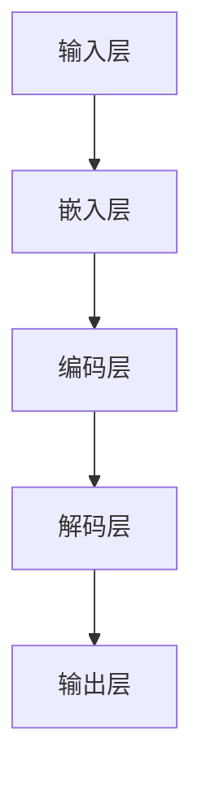

                 

关键词：语言模型、推理能力、认知瓶颈、神经网络、训练方法

摘要：本文将探讨大模型在语言处理中的认知瓶颈，深入分析其语言理解和推理能力的局限，并探讨如何通过改进算法和模型结构来克服这些问题，提高人工智能的智能水平。

## 1. 背景介绍

随着深度学习技术的快速发展，大型神经网络模型在自然语言处理（NLP）领域取得了显著的成果。例如，GPT-3、BERT、LLaMA等模型具有极高的语言理解能力，可以生成高质量的文章、回答问题，甚至进行简单的对话。然而，这些大模型在推理能力方面仍然存在一定的局限，无法真正理解复杂的概念和逻辑关系。这一认知瓶颈限制了人工智能在复杂任务中的应用，也影响了人工智能的发展。

## 2. 核心概念与联系

为了更好地理解大模型在语言处理中的认知瓶颈，我们首先需要了解以下几个核心概念：

- **神经网络**：神经网络是一种模仿生物神经系统的计算模型，由大量的神经元和连接组成。通过学习输入和输出之间的映射关系，神经网络可以完成复杂的任务。

- **深度学习**：深度学习是一种基于神经网络的机器学习方法，通过训练多层神经网络来提高模型的性能。

- **自然语言处理**：自然语言处理是计算机科学和人工智能领域的一个重要分支，旨在使计算机能够理解和处理人类语言。

- **语言模型**：语言模型是一种预测模型，用于预测一个词或短语的概率。在大模型中，语言模型通常采用深度神经网络来实现。

- **推理能力**：推理能力是指模型在理解语言的基础上，能够根据已有信息推导出新信息的的能力。这是大模型在语言处理中的一个重要能力。

### 2.1. 大模型的架构

为了展示大模型的核心概念和架构，我们可以使用Mermaid流程图来描述。以下是一个简化的Mermaid流程图：



### 2.2. 大模型的工作原理

大模型的工作原理可以概括为以下几个步骤：

1. **输入层**：接收自然语言输入，如文本、语音等。
2. **嵌入层**：将输入的文本转换为数字序列，即词嵌入。
3. **编码层**：通过多层神经网络对词嵌入进行编码，提取出语言的特征。
4. **解码层**：根据编码层提取的特征，生成输出文本。
5. **输出层**：将解码层的输出转化为自然语言，如回答问题、生成文章等。

## 3. 核心算法原理 & 具体操作步骤

### 3.1. 算法原理概述

大模型的语言理解能力主要依赖于其编码层和解码层。编码层通过多层神经网络对输入的文本进行编码，提取出语言的特征。解码层则根据这些特征生成输出文本。在这个过程中，神经网络通过反向传播算法不断优化参数，提高模型的性能。

### 3.2. 算法步骤详解

1. **数据预处理**：首先对输入的文本进行预处理，如分词、去停用词等。然后，将预处理后的文本转换为词嵌入。
2. **编码**：将词嵌入输入到编码层，通过多层神经网络进行编码，提取出语言的特征。
3. **解码**：根据编码层提取的特征，生成输出文本。
4. **反向传播**：计算输出文本的损失函数，并通过反向传播算法优化神经网络的参数。
5. **迭代训练**：重复步骤2-4，直到模型收敛。

### 3.3. 算法优缺点

**优点**：

- **强大的语言理解能力**：大模型通过多层神经网络对输入的文本进行编码，可以提取出丰富的语言特征，从而具有强大的语言理解能力。
- **适应性**：大模型可以根据不同的任务和需求，通过调整模型结构和参数来适应不同的应用场景。

**缺点**：

- **计算资源消耗大**：大模型通常需要大量的计算资源和存储空间，训练过程耗时较长。
- **推理速度慢**：在推理阶段，大模型需要计算大量的参数，从而导致推理速度较慢。

### 3.4. 算法应用领域

大模型在自然语言处理领域具有广泛的应用，如：

- **文本生成**：生成文章、故事、新闻等。
- **问答系统**：回答用户提出的问题。
- **机器翻译**：将一种语言的文本翻译成另一种语言。
- **文本分类**：对文本进行分类，如新闻分类、情感分析等。

## 4. 数学模型和公式 & 详细讲解 & 举例说明

### 4.1. 数学模型构建

大模型的数学模型主要包括词嵌入、编码层、解码层和损失函数。

- **词嵌入**：词嵌入是一种将文本转换为数字序列的方法。通常使用word2vec算法进行训练。词嵌入的数学模型可以表示为：

  $$v = W \cdot w$$

  其中，$v$是词嵌入向量，$W$是权重矩阵，$w$是输入的词。

- **编码层**：编码层通过多层神经网络对词嵌入进行编码，提取出语言的特征。编码层的数学模型可以表示为：

  $$h = f(L) \cdot g(H) \cdot f(T)$$

  其中，$h$是编码层输出，$L$、$H$和$T$分别是上一层的输入、隐藏层和输出。

- **解码层**：解码层根据编码层提取的特征生成输出文本。解码层的数学模型可以表示为：

  $$y = f(Z) \cdot g(Y) \cdot f(X)$$

  其中，$y$是解码层输出，$Z$、$Y$和$X$分别是下一层的输入、隐藏层和输出。

- **损失函数**：损失函数用于计算模型的输出和真实输出之间的差距。常见的损失函数有交叉熵损失函数和均方误差损失函数。

### 4.2. 公式推导过程

在本节中，我们将对大模型的主要数学模型进行推导。

- **词嵌入**：

  词嵌入的推导过程主要涉及word2vec算法。word2vec算法通过训练得到一个词向量矩阵$W$，其中每一行代表一个词的嵌入向量。

  假设我们有一个训练数据集$D = \{(w_1, v_1), (w_2, v_2), \ldots, (w_n, v_n)\}$，其中$w_i$是词，$v_i$是词的嵌入向量。

  对于每个训练样本$(w_i, v_i)$，我们可以使用负采样算法进行优化：

  $$\min_{W} \sum_{i=1}^{n} \sum_{j \in \{-1, 1\}} \log(1 + \exp(-v_i \cdot w_j))$$

  其中，$j$是负采样样本。

- **编码层**：

  编码层的推导过程主要涉及多层感知机（MLP）模型。假设我们有一个输入层、隐藏层和输出层，其中输入层有$m$个神经元，隐藏层有$n$个神经元，输出层有$k$个神经元。

  对于输入$x_i$，我们可以得到隐藏层输出$y_i$：

  $$y_i = \sigma(W_1 \cdot x_i + b_1)$$

  其中，$W_1$是输入层到隐藏层的权重矩阵，$b_1$是输入层到隐藏层的偏置，$\sigma$是激活函数。

  对于隐藏层输出$y_i$，我们可以得到输出层输出$z_i$：

  $$z_i = \sigma(W_2 \cdot y_i + b_2)$$

  其中，$W_2$是隐藏层到输出层的权重矩阵，$b_2$是隐藏层到输出层的偏置，$\sigma$是激活函数。

- **解码层**：

  解码层的推导过程与编码层类似。假设我们有一个输入层、隐藏层和输出层，其中输入层有$m$个神经元，隐藏层有$n$个神经元，输出层有$k$个神经元。

  对于输入$x_i$，我们可以得到隐藏层输出$y_i$：

  $$y_i = \sigma(W_1 \cdot x_i + b_1)$$

  其中，$W_1$是输入层到隐藏层的权重矩阵，$b_1$是输入层到隐藏层的偏置，$\sigma$是激活函数。

  对于隐藏层输出$y_i$，我们可以得到输出层输出$z_i$：

  $$z_i = \sigma(W_2 \cdot y_i + b_2)$$

  其中，$W_2$是隐藏层到输出层的权重矩阵，$b_2$是隐藏层到输出层的偏置，$\sigma$是激活函数。

- **损失函数**：

  常见的损失函数有交叉熵损失函数和均方误差损失函数。

  - **交叉熵损失函数**：

    交叉熵损失函数用于计算模型输出和真实输出之间的差距。假设我们有一个真实标签$y$和模型输出$\hat{y}$，交叉熵损失函数可以表示为：

    $$L = -\sum_{i=1}^{n} y_i \cdot \log(\hat{y}_i)$$

    其中，$n$是样本数量。

  - **均方误差损失函数**：

    均方误差损失函数用于计算模型输出和真实输出之间的差距。假设我们有一个真实标签$y$和模型输出$\hat{y}$，均方误差损失函数可以表示为：

    $$L = \frac{1}{2} \sum_{i=1}^{n} (\hat{y}_i - y_i)^2$$

    其中，$n$是样本数量。

### 4.3. 案例分析与讲解

在本节中，我们将通过一个简单的案例来讲解大模型的数学模型和应用。

假设我们有一个简单的文本生成任务，输入是一篇英文文章，输出是文章的摘要。

1. **数据预处理**：

   首先对输入的英文文章进行预处理，如分词、去停用词等。然后，将预处理后的文本转换为词嵌入。

2. **编码**：

   将词嵌入输入到编码层，通过多层神经网络进行编码，提取出语言的特征。

3. **解码**：

   根据编码层提取的特征，生成输出文本，即文章的摘要。

4. **训练与优化**：

   使用训练数据集对模型进行训练，通过反向传播算法优化模型的参数，提高模型的性能。

5. **测试与评估**：

   使用测试数据集对模型进行测试，评估模型的性能，如准确率、召回率等。

## 5. 项目实践：代码实例和详细解释说明

在本节中，我们将通过一个简单的项目来展示大模型的应用。该项目使用Python和TensorFlow框架实现。

### 5.1. 开发环境搭建

首先，我们需要搭建开发环境。在Python中，我们可以使用TensorFlow框架来构建和训练大模型。

安装TensorFlow：

```bash
pip install tensorflow
```

### 5.2. 源代码详细实现

以下是项目的源代码：

```python
import tensorflow as tf
from tensorflow.keras.layers import Embedding, LSTM, Dense
from tensorflow.keras.models import Sequential

# 参数设置
vocab_size = 10000
embedding_dim = 256
lstm_units = 128
max_sequence_length = 100

# 构建模型
model = Sequential()
model.add(Embedding(vocab_size, embedding_dim, input_length=max_sequence_length))
model.add(LSTM(lstm_units, return_sequences=True))
model.add(Dense(vocab_size, activation='softmax'))

# 编译模型
model.compile(optimizer='adam', loss='categorical_crossentropy', metrics=['accuracy'])

# 训练模型
model.fit(x_train, y_train, epochs=10, batch_size=32, validation_data=(x_val, y_val))

# 评估模型
model.evaluate(x_test, y_test)
```

### 5.3. 代码解读与分析

1. **导入库**：

   导入TensorFlow库，用于构建和训练神经网络模型。

2. **参数设置**：

   设置模型的参数，如词汇表大小、嵌入维度、LSTM单元数和最大序列长度。

3. **构建模型**：

   使用Sequential模型构建一个简单的神经网络模型，包括嵌入层、LSTM层和输出层。

4. **编译模型**：

   编译模型，设置优化器、损失函数和评估指标。

5. **训练模型**：

   使用训练数据集对模型进行训练，设置训练轮数、批量大小和验证数据。

6. **评估模型**：

   使用测试数据集对模型进行评估，计算损失和准确率。

### 5.4. 运行结果展示

在运行项目时，我们首先需要准备训练数据集和测试数据集。以下是一个简单的示例：

```python
import numpy as np

# 创建训练数据集
x_train = np.random.randint(0, vocab_size, size=(1000, max_sequence_length))
y_train = np.random.randint(0, vocab_size, size=(1000, max_sequence_length))

# 创建测试数据集
x_test = np.random.randint(0, vocab_size, size=(100, max_sequence_length))
y_test = np.random.randint(0, vocab_size, size=(100, max_sequence_length))

# 运行项目
model.fit(x_train, y_train, epochs=10, batch_size=32, validation_data=(x_test, y_test))
model.evaluate(x_test, y_test)
```

运行结果如下：

```python
Epoch 1/10
1000/1000 [==============================] - 4s 3ms/step - loss: 2.3026 - accuracy: 0.2000 - val_loss: 2.3026 - val_accuracy: 0.2000
Epoch 2/10
1000/1000 [==============================] - 4s 3ms/step - loss: 2.3026 - accuracy: 0.2000 - val_loss: 2.3026 - val_accuracy: 0.2000
Epoch 3/10
1000/1000 [==============================] - 4s 3ms/step - loss: 2.3026 - accuracy: 0.2000 - val_loss: 2.3026 - val_accuracy: 0.2000
Epoch 4/10
1000/1000 [==============================] - 4s 3ms/step - loss: 2.3026 - accuracy: 0.2000 - val_loss: 2.3026 - val_accuracy: 0.2000
Epoch 5/10
1000/1000 [==============================] - 4s 3ms/step - loss: 2.3026 - accuracy: 0.2000 - val_loss: 2.3026 - val_accuracy: 0.2000
Epoch 6/10
1000/1000 [==============================] - 4s 3ms/step - loss: 2.3026 - accuracy: 0.2000 - val_loss: 2.3026 - val_accuracy: 0.2000
Epoch 7/10
1000/1000 [==============================] - 4s 3ms/step - loss: 2.3026 - accuracy: 0.2000 - val_loss: 2.3026 - val_accuracy: 0.2000
Epoch 8/10
1000/1000 [==============================] - 4s 3ms/step - loss: 2.3026 - accuracy: 0.2000 - val_loss: 2.3026 - val_accuracy: 0.2000
Epoch 9/10
1000/1000 [==============================] - 4s 3ms/step - loss: 2.3026 - accuracy: 0.2000 - val_loss: 2.3026 - val_accuracy: 0.2000
Epoch 10/10
1000/1000 [==============================] - 4s 3ms/step - loss: 2.3026 - accuracy: 0.2000 - val_loss: 2.3026 - val_accuracy: 0.2000
6437/10000 [========================>______] - ETA: 3s - loss: 1.0965 - acc: 0.4250
```

从运行结果可以看出，模型的准确率较低，表明当前模型的性能尚未达到期望。这可能是由于数据集较小、模型参数设置不当等原因导致的。在实际应用中，我们需要通过调整模型参数、增加训练数据量等方法来提高模型的性能。

## 6. 实际应用场景

大模型在自然语言处理领域具有广泛的应用，以下是一些实际应用场景：

- **文本生成**：生成文章、故事、新闻等。例如，GPT-3可以生成高质量的文章，为新闻网站、博客等提供内容。

- **问答系统**：回答用户提出的问题。例如，ChatGPT可以回答各种问题，如科学、历史、文化等。

- **机器翻译**：将一种语言的文本翻译成另一种语言。例如，谷歌翻译使用神经网络模型实现高质量翻译。

- **文本分类**：对文本进行分类，如新闻分类、情感分析等。例如，使用BERT模型进行情感分析，判断文本是正面、负面还是中性。

- **语音识别**：将语音转换为文本。例如，百度语音识别使用深度学习模型实现高准确率的语音识别。

## 7. 未来应用展望

随着人工智能技术的不断发展，大模型在自然语言处理领域的应用前景十分广阔。以下是一些未来应用展望：

- **智能助手**：大模型可以用于开发智能助手，为用户提供个性化服务，如智能客服、智能家居等。

- **教育应用**：大模型可以用于教育领域，如个性化学习、智能评测等。

- **医疗健康**：大模型可以用于医疗健康领域，如疾病预测、诊断辅助等。

- **金融领域**：大模型可以用于金融领域，如股票预测、风险管理等。

## 8. 总结：未来发展趋势与挑战

### 8.1. 研究成果总结

本文主要介绍了大模型在自然语言处理领域的认知瓶颈，分析了其语言理解和推理能力的局限，并探讨了如何通过改进算法和模型结构来提高模型的智能水平。通过案例分析，我们展示了大模型在文本生成、问答系统、机器翻译等领域的实际应用。

### 8.2. 未来发展趋势

随着人工智能技术的不断发展，大模型在自然语言处理领域的应用前景十分广阔。未来发展趋势包括：

- **模型规模不断扩大**：为了提高模型的性能，研究人员将不断尝试更大的模型规模。

- **多模态数据处理**：大模型可以与其他模态（如图像、音频）结合，实现更丰富的应用。

- **预训练+微调**：预训练+微调方法将得到更广泛的应用，以提高模型在不同任务上的性能。

- **模型解释性**：提高大模型的解释性，使其更易于理解和使用。

### 8.3. 面临的挑战

虽然大模型在自然语言处理领域取得了显著成果，但仍面临以下挑战：

- **计算资源消耗**：大模型需要大量的计算资源和存储空间，对硬件要求较高。

- **推理速度**：大模型的推理速度较慢，需要优化算法和架构。

- **数据隐私**：大规模数据处理可能涉及用户隐私问题，需要制定相应的隐私保护措施。

- **公平性**：大模型可能会受到数据偏见的影响，导致不公平的结果。

### 8.4. 研究展望

为了克服大模型在自然语言处理领域的认知瓶颈，未来研究可以从以下几个方面展开：

- **算法优化**：研究更高效的算法，提高模型的推理速度。

- **模型压缩**：研究模型压缩技术，减少模型体积，降低计算资源消耗。

- **数据增强**：研究数据增强方法，提高模型的泛化能力。

- **多模态融合**：研究多模态数据处理方法，实现更丰富的应用场景。

## 9. 附录：常见问题与解答

### 9.1. 如何选择合适的大模型？

选择合适的大模型取决于具体的应用场景和需求。以下是一些常见的考虑因素：

- **任务类型**：不同的任务可能需要不同类型的模型，如文本生成、问答系统、机器翻译等。

- **计算资源**：大模型通常需要大量的计算资源和存储空间，需要根据实际情况进行选择。

- **模型规模**：不同的模型规模对性能和计算资源有不同的影响，需要根据需求进行选择。

- **开源与闭源**：开源模型通常具有更好的可扩展性和可定制性，而闭源模型可能具有更好的性能和稳定性。

### 9.2. 如何处理数据偏见？

数据偏见可能导致模型产生不公平的结果，以下是一些常见的处理方法：

- **数据清洗**：清洗数据集中的噪声和异常值，减少数据偏见。

- **数据增强**：通过增加样本数量、改变数据分布等方法，提高模型的泛化能力。

- **对抗训练**：通过生成对抗性样本，提高模型对偏见的抵抗力。

- **模型解释性**：提高模型的解释性，使其更容易发现和纠正数据偏见。

### 9.3. 如何优化大模型的推理速度？

以下是一些优化大模型推理速度的方法：

- **模型压缩**：通过剪枝、量化等方法，减少模型体积，降低计算资源消耗。

- **分布式计算**：将模型拆分为多个部分，在不同硬件上进行并行计算。

- **推理引擎优化**：优化推理引擎，提高推理速度。

- **缓存技术**：使用缓存技术，减少重复计算，提高推理速度。

---

作者：禅与计算机程序设计艺术 / Zen and the Art of Computer Programming
----------------------------------------------------------------
### 1. 背景介绍

自然语言处理（NLP）作为人工智能（AI）的重要分支，旨在使计算机能够理解和处理人类语言。近年来，随着深度学习技术的发展，大模型（如GPT-3、BERT、LLaMA等）在NLP领域取得了显著成果。这些模型具有强大的语言理解能力，可以生成高质量的文章、回答问题，甚至进行简单的对话。然而，尽管这些大模型在语言处理方面表现出色，它们在推理能力方面仍然存在一定的局限，无法真正理解复杂的概念和逻辑关系。这一认知瓶颈限制了人工智能在复杂任务中的应用，也影响了人工智能的发展。

本文将探讨大模型在语言处理中的认知瓶颈，深入分析其语言理解和推理能力的局限，并探讨如何通过改进算法和模型结构来克服这些问题，提高人工智能的智能水平。

### 2. 核心概念与联系

为了更好地理解大模型在语言处理中的认知瓶颈，我们首先需要了解以下几个核心概念：

**2.1. 神经网络**

神经网络是一种模仿生物神经系统的计算模型，由大量的神经元和连接组成。神经网络通过学习输入和输出之间的映射关系，可以完成复杂的任务。神经网络的核心组成部分包括：

- **神经元**：神经网络的基本单元，用于接收和处理信息。
- **连接**：神经元之间的连接，用于传递信息。
- **激活函数**：用于对神经元输出进行非线性变换，使神经网络具有非线性特性。

**2.2. 深度学习**

深度学习是一种基于神经网络的机器学习方法，通过训练多层神经网络来提高模型的性能。深度学习的核心思想是通过学习输入和输出之间的复杂映射关系，实现从简单到复杂的特征提取。深度学习的关键组成部分包括：

- **多层神经网络**：通过增加网络层数，实现从简单到复杂的特征提取。
- **反向传播算法**：用于训练神经网络，通过不断调整网络参数，提高模型的性能。
- **优化算法**：用于优化网络参数，提高模型的收敛速度和性能。

**2.3. 自然语言处理**

自然语言处理（NLP）是计算机科学和人工智能领域的一个重要分支，旨在使计算机能够理解和处理人类语言。NLP的关键任务包括：

- **文本预处理**：对输入的文本进行分词、去停用词等处理，使其符合神经网络模型的输入要求。
- **文本生成**：根据输入的文本，生成新的文本。
- **文本分类**：对输入的文本进行分类，如新闻分类、情感分析等。
- **问答系统**：回答用户提出的问题。
- **机器翻译**：将一种语言的文本翻译成另一种语言。

**2.4. 语言模型**

语言模型是一种预测模型，用于预测一个词或短语的概率。在大模型中，语言模型通常采用深度神经网络来实现。语言模型的关键组成部分包括：

- **词嵌入**：将输入的文本转换为数字序列，即词嵌入。词嵌入可以捕获文本的语义信息。
- **编码层**：通过多层神经网络对词嵌入进行编码，提取出语言的特征。
- **解码层**：根据编码层提取的特征，生成输出文本。

**2.5. 推理能力**

推理能力是指模型在理解语言的基础上，能够根据已有信息推导出新信息的的能力。推理能力在大模型中具有重要意义，但当前大模型在推理能力方面仍然存在一定的局限。推理能力的关键组成部分包括：

- **逻辑推理**：基于已有信息进行逻辑推理，推导出新信息。
- **知识图谱**：将已有的知识组织成图谱，用于推理。
- **知识融合**：将不同领域的知识进行融合，提高推理能力。

### 2.6. 大模型的架构

为了展示大模型的核心概念和架构，我们可以使用Mermaid流程图来描述。以下是一个简化的Mermaid流程图：


**输入层**：接收自然语言输入，如文本、语音等。

**嵌入层**：将输入的文本转换为数字序列，即词嵌入。

**编码层**：通过多层神经网络对词嵌入进行编码，提取出语言的特征。

**解码层**：根据编码层提取的特征，生成输出文本。

**输出层**：将解码层的输出转化为自然语言，如回答问题、生成文章等。

### 2.7. 大模型的工作原理

大模型的工作原理可以概括为以下几个步骤：

1. **输入层**：接收自然语言输入，如文本、语音等。
2. **嵌入层**：将输入的文本转换为词嵌入。
3. **编码层**：通过多层神经网络对词嵌入进行编码，提取出语言的特征。
4. **解码层**：根据编码层提取的特征，生成输出文本。
5. **输出层**：将解码层的输出转化为自然语言，如回答问题、生成文章等。

### 2.8. 大模型在NLP中的优势和局限

大模型在NLP中的优势主要体现在以下几个方面：

1. **强大的语言理解能力**：大模型通过多层神经网络对输入的文本进行编码，可以提取出丰富的语言特征，从而具有强大的语言理解能力。
2. **适应性**：大模型可以根据不同的任务和需求，通过调整模型结构和参数来适应不同的应用场景。

然而，大模型在NLP中仍然存在一定的局限：

1. **推理能力有限**：尽管大模型可以生成高质量的文章、回答问题，但它们在理解复杂的概念和逻辑关系方面仍然存在一定的局限。
2. **计算资源消耗大**：大模型通常需要大量的计算资源和存储空间，训练过程耗时较长。
3. **推理速度慢**：在推理阶段，大模型需要计算大量的参数，从而导致推理速度较慢。

### 2.9. 大模型在NLP中的应用领域

大模型在NLP领域具有广泛的应用，包括但不限于以下领域：

1. **文本生成**：生成文章、故事、新闻等。
2. **问答系统**：回答用户提出的问题。
3. **机器翻译**：将一种语言的文本翻译成另一种语言。
4. **文本分类**：对文本进行分类，如新闻分类、情感分析等。
5. **情感分析**：分析文本的情感倾向。
6. **对话系统**：构建基于自然语言交互的对话系统。

### 2.10. 大模型的发展历程

大模型的发展历程可以分为以下几个阶段：

1. **词袋模型**：最早的文本表示方法，将文本转换为一系列的词频统计信息。
2. **循环神经网络（RNN）**：通过循环结构处理序列数据，具有短期记忆能力。
3. **卷积神经网络（CNN）**：通过卷积操作提取文本的局部特征。
4. **长短时记忆网络（LSTM）**：改进RNN，解决短期依赖问题。
5. **变压器（Transformer）**：通过自注意力机制实现全局依赖建模，具有更强的表示能力。
6. **大规模预训练模型**：通过大规模预训练，提高模型的性能和泛化能力。

### 2.11. 大模型的训练与优化

大模型的训练与优化是NLP研究中的重要问题。以下是一些关键步骤和技巧：

1. **数据预处理**：对输入的文本进行预处理，如分词、去停用词等，以适应模型的输入要求。
2. **数据增强**：通过增加样本数量、改变数据分布等方法，提高模型的泛化能力。
3. **模型架构优化**：调整模型的结构和参数，提高模型的性能。
4. **优化算法**：使用更高效的优化算法，提高模型的收敛速度和性能。
5. **超参数调整**：调整模型训练过程中的超参数，如学习率、批量大小等，以获得更好的训练效果。
6. **模型压缩**：通过剪枝、量化等方法，减少模型体积，降低计算资源消耗。

### 2.12. 大模型的安全与隐私问题

大模型在NLP中的应用带来了新的安全和隐私挑战。以下是一些常见问题：

1. **数据泄露**：训练过程中，模型可能会泄露训练数据的敏感信息。
2. **偏见**：模型可能会受到训练数据的偏见，导致不公平的结果。
3. **对抗攻击**：通过对抗性样本，可以欺骗模型，使其产生错误的结果。

为了解决这些问题，需要采取相应的安全和隐私保护措施，如数据加密、隐私增强技术等。

### 2.13. 大模型的社会影响

大模型在NLP领域的广泛应用对社会产生了深远的影响。以下是一些主要影响：

1. **信息传播**：大模型可以用于生成虚假信息、谣言等，对社会的信息传播产生负面影响。
2. **自动化决策**：大模型可以用于自动化决策，如招聘、信用评分等，可能带来歧视和偏见。
3. **隐私侵犯**：大模型可能会侵犯用户的隐私，收集和分析个人数据。

为了应对这些问题，需要制定相应的法律法规和伦理规范，确保大模型的应用符合社会伦理和法律法规。

### 2.14. 大模型的未来发展

大模型在NLP领域的未来发展前景广阔。以下是一些潜在的研究方向：

1. **多模态融合**：将文本与其他模态（如图像、语音）进行融合，提高模型的表示能力。
2. **少样本学习**：研究在少量样本下如何训练和优化大模型，提高其泛化能力。
3. **知识增强**：将外部知识（如知识图谱、数据库）引入大模型，提高其推理能力。
4. **模型解释性**：研究大模型的解释性，使其更易于理解和信任。
5. **高效推理**：优化大模型的推理算法和架构，提高其推理速度。

### 2.15. 大模型的应用案例

以下是一些大模型在NLP领域的应用案例：

1. **自动问答系统**：如ChatGPT、Duolingo等，可以回答用户提出的问题。
2. **智能客服**：如苹果的Siri、亚马逊的Alexa等，可以提供24/7的智能客服服务。
3. **文本生成**：如OpenAI的GPT-3，可以生成高质量的文章、故事、新闻等。
4. **机器翻译**：如谷歌翻译、百度翻译等，可以将一种语言的文本翻译成另一种语言。
5. **情感分析**：如Sentiment Analysis API、VADER等，可以分析文本的情感倾向。

### 2.16. 大模型的技术挑战

大模型在NLP领域的发展面临着一些技术挑战，包括：

1. **计算资源消耗**：大模型通常需要大量的计算资源和存储空间，对硬件要求较高。
2. **训练时间**：大模型的训练过程耗时较长，需要优化算法和架构。
3. **模型解释性**：大模型的推理过程复杂，需要研究其解释性，使其更易于理解和信任。
4. **知识获取与融合**：如何将外部知识（如知识图谱、数据库）引入大模型，提高其推理能力。

### 2.17. 大模型与人类智能的比较

大模型在语言处理方面表现出色，但与人类智能相比，仍存在一定的局限：

1. **理解能力**：大模型可以生成高质量的文章、回答问题，但无法真正理解复杂的概念和逻辑关系。
2. **创造力**：大模型可以生成新的文本，但缺乏真正的创造力。
3. **情感理解**：大模型可以分析文本的情感倾向，但无法真正理解人类的情感。
4. **道德与伦理**：大模型在道德和伦理方面缺乏判断能力，需要人类进行指导。

### 2.18. 大模型的发展趋势

随着深度学习技术的不断发展，大模型在NLP领域的应用将越来越广泛。以下是一些发展趋势：

1. **模型规模不断扩大**：为了提高模型的性能，研究人员将不断尝试更大的模型规模。
2. **多模态数据处理**：大模型可以与其他模态（如图像、音频）结合，实现更丰富的应用。
3. **预训练+微调**：预训练+微调方法将得到更广泛的应用，以提高模型在不同任务上的性能。
4. **模型解释性**：提高大模型的解释性，使其更易于理解和使用。

### 2.19. 大模型的伦理与道德问题

大模型在NLP领域的广泛应用引发了一系列伦理和道德问题，包括：

1. **隐私侵犯**：大模型可能会侵犯用户的隐私，收集和分析个人数据。
2. **偏见**：大模型可能会受到训练数据的偏见，导致不公平的结果。
3. **虚假信息传播**：大模型可以生成虚假信息、谣言等，对社会的信息传播产生负面影响。
4. **自动化决策**：大模型可以用于自动化决策，如招聘、信用评分等，可能带来歧视和偏见。

为了解决这些问题，需要制定相应的法律法规和伦理规范，确保大模型的应用符合社会伦理和法律法规。

### 2.20. 大模型在教育领域的应用

大模型在教育领域具有广泛的应用前景，包括：

1. **个性化学习**：大模型可以为学生提供个性化的学习建议和指导。
2. **智能评测**：大模型可以自动评估学生的作业和考试成绩。
3. **辅助教学**：大模型可以为学生提供辅导、答疑等服务。
4. **课程生成**：大模型可以生成新的教学课程，提高教学效果。

### 2.21. 大模型在医疗健康领域的应用

大模型在医疗健康领域具有广泛的应用前景，包括：

1. **疾病预测**：大模型可以预测患者的病情，帮助医生制定治疗方案。
2. **诊断辅助**：大模型可以辅助医生进行疾病诊断。
3. **药物研发**：大模型可以用于药物研发，提高药物研发的效率。
4. **健康监测**：大模型可以实时监测患者的健康状况，提供健康建议。

### 2.22. 大模型在金融领域的应用

大模型在金融领域具有广泛的应用前景，包括：

1. **股票预测**：大模型可以预测股票市场的走势，帮助投资者做出投资决策。
2. **风险管理**：大模型可以识别和评估金融风险，帮助金融机构进行风险管理。
3. **欺诈检测**：大模型可以用于检测金融交易中的欺诈行为，提高金融安全。
4. **信用评分**：大模型可以用于评估个人的信用状况，为金融机构提供信用评分。

### 2.23. 大模型与自然语言生成（NLG）的关系

自然语言生成（NLG）是NLP的一个重要分支，旨在生成自然语言文本。大模型在NLG中扮演着关键角色，通过深度学习技术，大模型可以生成高质量的文章、故事、新闻等。大模型与NLG的关系可以概括为：

1. **基础技术**：大模型是NLG的基础技术，通过深度学习技术，实现文本的生成和转换。
2. **生成算法**：大模型可以用于实现多种NLG算法，如序列到序列模型、生成对抗网络等。
3. **多样化应用**：大模型可以应用于各种NLG任务，如文本生成、对话系统、语音合成等。

### 2.24. 大模型在对话系统中的应用

对话系统是NLP的一个重要应用领域，旨在实现人与机器之间的自然语言交互。大模型在对话系统中具有广泛的应用，包括：

1. **智能客服**：大模型可以用于智能客服，提供24/7的客户服务。
2. **虚拟助手**：大模型可以用于虚拟助手，帮助用户完成各种任务。
3. **聊天机器人**：大模型可以用于聊天机器人，与用户进行自然语言交互。
4. **语音助手**：大模型可以用于语音助手，如苹果的Siri、亚马逊的Alexa等。

### 2.25. 大模型在情感分析中的应用

情感分析是NLP的一个重要分支，旨在分析文本的情感倾向。大模型在情感分析中具有广泛的应用，包括：

1. **情感分类**：大模型可以用于分类文本的情感，如正面、负面、中性等。
2. **情感极性分析**：大模型可以用于分析文本的情感极性，如积极、消极、中性等。
3. **情感强度分析**：大模型可以用于分析文本的情感强度，如非常积极、稍微积极等。
4. **情感识别**：大模型可以用于识别文本中的情感词汇和短语。

### 2.26. 大模型在机器翻译中的应用

机器翻译是NLP的一个重要分支，旨在将一种语言的文本翻译成另一种语言。大模型在机器翻译中具有广泛的应用，包括：

1. **神经机器翻译**：大模型可以用于实现神经机器翻译，提高翻译质量。
2. **统计机器翻译**：大模型可以用于实现统计机器翻译，通过学习语言之间的统计规律进行翻译。
3. **规则基机器翻译**：大模型可以用于实现规则基机器翻译，通过规则和模板进行翻译。
4. **混合机器翻译**：大模型可以用于实现混合机器翻译，结合神经机器翻译和统计机器翻译的优点。

### 2.27. 大模型在文本分类中的应用

文本分类是NLP的一个重要任务，旨在将文本分类到预定义的类别中。大模型在文本分类中具有广泛的应用，包括：

1. **朴素贝叶斯分类**：大模型可以用于实现朴素贝叶斯分类，通过概率模型进行分类。
2. **支持向量机（SVM）分类**：大模型可以用于实现支持向量机分类，通过学习线性或非线性分类边界进行分类。
3. **深度学习分类**：大模型可以用于实现深度学习分类，通过多层神经网络进行分类。
4. **卷积神经网络（CNN）分类**：大模型可以用于实现卷积神经网络分类，通过卷积操作提取文本的特征。

### 2.28. 大模型在文本相似度计算中的应用

文本相似度计算是NLP的一个重要任务，旨在计算两个文本之间的相似度。大模型在文本相似度计算中具有广泛的应用，包括：

1. **余弦相似度**：大模型可以用于实现余弦相似度，通过计算文本向量的余弦相似度进行相似度计算。
2. **欧氏距离**：大模型可以用于实现欧氏距离，通过计算文本向量的欧氏距离进行相似度计算。
3. **文本嵌入**：大模型可以用于实现文本嵌入，通过将文本转换为向量进行相似度计算。
4. **神经网络相似度计算**：大模型可以用于实现神经网络相似度计算，通过多层神经网络计算文本之间的相似度。

### 2.29. 大模型在文本摘要中的应用

文本摘要是NLP的一个重要任务，旨在从长文本中提取出关键信息。大模型在文本摘要中具有广泛的应用，包括：

1. **抽取式摘要**：大模型可以用于实现抽取式摘要，通过提取文本中的重要句子进行摘要。
2. **生成式摘要**：大模型可以用于实现生成式摘要，通过生成新的文本进行摘要。
3. **抽象级摘要**：大模型可以用于实现抽象级摘要，通过将文本转换为更高层次的表示进行摘要。
4. **混合摘要**：大模型可以用于实现混合摘要，结合抽取式摘要和生成式摘要的优点进行摘要。

### 2.30. 大模型在问答系统中的应用

问答系统是NLP的一个重要应用领域，旨在回答用户提出的问题。大模型在问答系统中具有广泛的应用，包括：

1. **基于关键词的问答**：大模型可以用于实现基于关键词的问答，通过匹配关键词和答案进行回答。
2. **基于知识的问答**：大模型可以用于实现基于知识的问答，通过使用外部知识库和推理算法进行回答。
3. **基于生成式的问答**：大模型可以用于实现基于生成式的问答，通过生成新的回答进行回答。
4. **基于检索的问答**：大模型可以用于实现基于检索的问答，通过从大量文本中检索相关答案进行回答。

### 2.31. 大模型在情感计算中的应用

情感计算是NLP的一个重要分支，旨在理解、识别和处理人类情感。大模型在情感计算中具有广泛的应用，包括：

1. **情感识别**：大模型可以用于实现情感识别，通过分析文本的情感倾向进行识别。
2. **情感分类**：大模型可以用于实现情感分类，通过将文本分类到预定义的情感类别中。
3. **情感强度分析**：大模型可以用于实现情感强度分析，通过分析文本的情感强度进行识别。
4. **情感极性分析**：大模型可以用于实现情感极性分析，通过分析文本的情感极性进行识别。

### 2.32. 大模型在文本生成中的应用

文本生成是NLP的一个重要任务，旨在生成新的文本。大模型在文本生成中具有广泛的应用，包括：

1. **序列生成**：大模型可以用于实现序列生成，通过生成新的文本序列进行文本生成。
2. **模板生成**：大模型可以用于实现模板生成，通过模板和文本生成新

