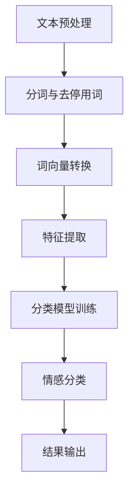

                 

关键词：豆瓣评论，情感分析，NLP，深度学习，文本处理，机器学习

摘要：本文将深入探讨豆瓣评论情感分析的技术原理和方法。通过对情感分析领域的基本概念、核心算法以及具体实现步骤的详细讲解，读者可以全面了解如何使用自然语言处理（NLP）和机器学习技术对豆瓣评论进行情感分析，从而挖掘出评论中蕴含的情感信息，为电商推荐系统、舆情监测等应用提供支持。

## 1. 背景介绍

随着互联网的快速发展，用户生成内容（User-Generated Content, UGC）成为信息传播的重要来源。豆瓣作为国内知名的社交书评网站，其用户评论数据丰富，包含了大量关于图书、电影、音乐等多方面的情感信息。这些评论数据不仅为其他用户提供参考，也对商业决策和产品改进具有重要意义。

情感分析（Sentiment Analysis），又称意见挖掘，是自然语言处理（NLP）和计算语言学领域的重要研究方向。它的目标是通过分析文本数据，识别出其中的情感倾向，如正面、负面或中性。在豆瓣评论情感分析中，我们关注的是如何有效地从大规模的文本数据中提取情感信息，从而为各类应用提供数据支持。

本文将围绕以下三个方面展开讨论：

1. 核心概念与联系
2. 核心算法原理与具体操作步骤
3. 数学模型、公式以及实际应用场景

通过本文的讲解，读者可以系统地了解豆瓣评论情感分析的技术原理和方法，掌握情感分析在NLP和机器学习领域的应用。

### 1.1 情感分析在NLP和机器学习中的重要性

情感分析是自然语言处理（NLP）和计算语言学领域的一个重要分支，它旨在通过分析文本数据中的情感倾向，帮助人们更好地理解人类情感表达和行为模式。在机器学习领域，情感分析技术被视为一种有效的文本分类方法，广泛应用于各种实际应用场景，如图电商平台的产品评价分析、社交媒体的舆情监测、金融领域的客户反馈分析等。

豆瓣评论情感分析作为情感分析领域的一个典型应用，具有重要的研究价值。一方面，豆瓣评论数据量庞大，包含了丰富的情感信息，为训练高质量的模型提供了丰富的数据支持；另一方面，豆瓣评论内容多样，涉及到各种领域和话题，使得模型需要具备较强的泛化能力。

在电商推荐系统方面，通过对用户评论的情感分析，可以帮助平台更好地了解用户对产品的情感倾向，从而优化推荐策略，提高用户满意度。例如，当用户对某款产品给予负面评价时，推荐系统可以减少该产品的推荐频率，避免用户产生不良体验。

在舆情监测方面，通过对社交媒体上的评论进行情感分析，可以帮助政府和企业及时了解公众对某事件或产品的情感倾向，为决策提供数据支持。例如，在疫情爆发期间，通过分析社交媒体上的评论，可以了解公众对防疫措施的情感反应，为政策调整提供依据。

总之，豆瓣评论情感分析在NLP和机器学习领域具有广泛的应用前景，通过本文的讲解，读者可以全面了解该技术的基本原理和方法，为相关应用提供技术支持。

### 1.2 豆瓣评论情感分析的应用场景

豆瓣评论情感分析技术在实际应用中具有广泛的应用场景，涵盖了多个领域和行业。以下将详细介绍几个典型的应用场景：

1. **电商推荐系统**

   在电商领域，用户评论是商家了解消费者反馈和优化产品的重要途径。通过对用户评论的情感分析，商家可以快速获取消费者对产品的情感倾向，从而调整推荐策略。例如，当大量评论显示某款产品存在负面情感时，推荐系统可以减少该产品的推荐频率，避免用户因负面体验而产生不满。此外，情感分析还可以帮助商家识别产品的问题点，为产品改进提供数据支持。

2. **舆情监测**

   社交媒体和在线评论平台上的用户评论是反映公众意见和情感的重要来源。通过对这些评论进行情感分析，可以实现对某一事件或产品的舆情监测。例如，在公共安全事件、疫情爆发等紧急情况下，通过分析社交媒体上的评论，可以及时了解公众的情感反应和意见倾向，为政府决策提供数据支持。此外，在产品发布、公司事件等情况下，情感分析可以帮助企业及时掌握市场动态和公众情感，从而调整营销策略。

3. **金融领域**

   在金融领域，客户反馈和评价是金融机构了解客户需求和市场动态的重要途径。通过对客户评论进行情感分析，金融机构可以识别出客户对产品和服务的情感倾向，从而优化产品设计和客户服务。例如，在银行理财产品、保险产品等方面，通过情感分析可以帮助金融机构了解客户的购买意愿和满意度，为产品改进和营销策略调整提供依据。

4. **教育行业**

   在教育领域，教师和学生之间的互动和反馈是提高教学质量的重要环节。通过对学生评教评论的情感分析，教育机构可以了解学生对课程的满意度和教学效果，从而优化课程设计和教学方法。例如，通过分析学生评教中的负面情感，可以找出教学中的问题点，为教师提供改进建议。

5. **旅游行业**

   在旅游行业，游客评论是影响其他游客决策的重要因素。通过对游客评论进行情感分析，旅游企业可以了解游客对旅游产品和服务质量的评价，从而优化产品设计和服务流程。例如，通过分析游客对酒店、景区、餐饮等方面的评论，可以找出游客关注的热点和痛点，为旅游企业改进产品和服务提供依据。

总之，豆瓣评论情感分析技术在不同领域的应用场景广泛，通过本文的讲解，读者可以全面了解该技术在不同场景下的应用方法和效果。

### 1.3 本文结构安排

本文将分为以下几个部分：

1. **背景介绍**：阐述情感分析在NLP和机器学习中的重要性，以及豆瓣评论情感分析的应用场景。
2. **核心概念与联系**：介绍情感分析领域的基本概念，包括情感极性、情感强度等，并给出情感分析系统的基本架构。
3. **核心算法原理与具体操作步骤**：详细讲解情感分析的核心算法，包括基于规则的方法、基于统计的方法和基于深度学习的方法，以及具体的实现步骤。
4. **数学模型和公式**：介绍情感分析中常用的数学模型和公式，包括文本表示、特征提取和分类模型等，并通过实例进行详细讲解。
5. **项目实践**：通过一个具体的项目实例，展示如何使用Python等工具进行豆瓣评论情感分析，包括数据收集、预处理、模型训练和评估等步骤。
6. **实际应用场景**：介绍豆瓣评论情感分析在电商推荐系统、舆情监测等领域的应用案例，以及未来发展的趋势。
7. **工具和资源推荐**：推荐相关的学习资源、开发工具和论文，以帮助读者进一步了解和掌握情感分析技术。
8. **总结与展望**：总结本文的主要研究成果，探讨未来发展趋势和面临的挑战，并提出研究展望。

通过本文的阅读，读者可以系统地了解豆瓣评论情感分析的技术原理和方法，为相关应用提供技术支持。

## 2. 核心概念与联系

在深入探讨豆瓣评论情感分析的具体技术之前，我们需要首先了解情感分析领域中的核心概念和基本架构。这些概念和架构构成了情感分析系统的理论基础，对于理解后续内容至关重要。

### 2.1 情感极性与强度

情感极性（Sentiment Polarity）是指文本中情感倾向的正负方向。通常，情感极性分为三类：正面（Positive）、负面（Negative）和中性（Neutral）。例如，文本“这本书非常有趣”表达的是正面情感，而文本“这个电影很无聊”表达的是负面情感。

情感强度（Sentiment Intensity）则描述了情感极性的强弱程度。例如，文本“这个服务非常好”和“这个服务极其出色”都表达了正面情感，但后者情感强度更高。情感强度可以通过情感词典、情感词权重和文本上下文等多个因素进行量化。

### 2.2 情感分析系统的基本架构

情感分析系统通常包括以下几个主要模块：

1. **文本预处理（Text Preprocessing）**：这一步涉及文本的清洗、分词、去停用词等操作，目的是将原始文本转化为适合分析的形式。文本预处理是情感分析的基础，直接影响后续分析的准确性和效率。

2. **特征提取（Feature Extraction）**：特征提取是将预处理后的文本转化为数值特征表示，如词袋模型（Bag of Words, BOW）、TF-IDF等。这些特征将用于训练分类模型。

3. **情感分类（Sentiment Classification）**：这一步是情感分析的核心，通过分类模型对文本进行情感极性和强度的判断。常见的分类模型包括朴素贝叶斯（Naive Bayes）、支持向量机（SVM）、深度神经网络（DNN）等。

4. **结果输出（Result Output）**：情感分类结果通常以文本标注的形式输出，如“正面”、“负面”和“中性”等。此外，还可以结合情感强度给出具体的分数或评级。

### 2.3 Mermaid 流程图展示

为了更直观地展示情感分析系统的基本架构，我们使用Mermaid绘制了一个流程图。以下是流程图的具体内容和说明：



**流程图说明**：

1. **文本预处理**：包括文本的清洗、分词和去停用词等操作。这一步的目的是将原始文本转化为适合分析的形式。
2. **分词与去停用词**：将清洗后的文本进行分词，去除无意义的停用词，保留关键信息。
3. **词向量转换**：将分词后的文本转化为词向量表示，如词袋模型（BOW）或词嵌入（Word Embedding）。
4. **特征提取**：通过词向量生成文本的特征表示，如TF-IDF或Word2Vec。
5. **分类模型训练**：使用特征数据和标注数据训练分类模型，如朴素贝叶斯、SVM或深度神经网络。
6. **情感分类**：对新的文本数据进行情感分类，输出情感极性和强度。
7. **结果输出**：将分类结果以文本标注的形式输出，如“正面”、“负面”和“中性”。

通过上述流程，我们可以看出情感分析系统的各个环节是如何相互关联和协作的。接下来，我们将进一步探讨情感分析的核心算法原理和具体实现步骤。

### 2.4 情感分析的核心算法原理

情感分析的核心算法主要分为以下几类：基于规则的方法、基于统计的方法和基于深度学习的方法。每种方法都有其独特的原理和特点，适用于不同的应用场景。

#### 2.4.1 基于规则的方法

基于规则的方法是通过手工编写规则，对文本进行情感分类。该方法的主要优点是简单易懂，实现成本较低。其核心思想是利用领域知识，设计一组规则，如情感词典、正负词匹配等，对文本进行情感判断。

**原理**：

1. **情感词典**：情感词典是一个包含情感词及其对应情感极性的词汇库。例如，“喜欢”、“满意”属于正面情感词，“讨厌”、“失望”属于负面情感词。
2. **规则设计**：通过设计一系列规则，如正负词匹配、否定词处理、情感强度调整等，对文本进行情感分析。

**优点**：

- 实现简单，易于理解和维护。
- 对简单文本具有较好的效果。

**缺点**：

- 对复杂文本和长文本的处理能力较弱。
- 依赖于领域知识，需要不断更新和维护。

#### 2.4.2 基于统计的方法

基于统计的方法利用文本统计信息进行情感分类，其主要特点是数据驱动，不需要太多先验知识。该方法主要包括以下几种技术：

1. **TF-IDF**：TF-IDF（Term Frequency-Inverse Document Frequency）是一种文本表示方法，通过计算词频和逆文档频率来评估词的重要性。TF-IDF方法常用于情感分析中的特征提取。

2. **逻辑回归（Logistic Regression）**：逻辑回归是一种经典的分类算法，通过建立线性模型对文本进行分类。在情感分析中，逻辑回归可以用于预测文本的情感极性。

3. **朴素贝叶斯（Naive Bayes）**：朴素贝叶斯是一种基于贝叶斯定理的简单概率分类器，其核心假设为特征之间相互独立。朴素贝叶斯在情感分析中具有较好的效果，尤其适用于文本分类问题。

**原理**：

1. **文本表示**：通过TF-IDF等方法将文本转化为特征向量。
2. **分类模型**：使用逻辑回归或朴素贝叶斯等算法对特征向量进行分类。

**优点**：

- 对大规模文本数据具有较好的处理能力。
- 实现简单，计算效率较高。

**缺点**：

- 对复杂情感和长文本的处理能力较弱。
- 需要大量训练数据和特征工程。

#### 2.4.3 基于深度学习的方法

基于深度学习的方法利用深度神经网络（DNN）对文本进行情感分类，具有强大的表达能力和适应性。其主要技术包括卷积神经网络（CNN）、递归神经网络（RNN）和长短期记忆网络（LSTM）等。

**原理**：

1. **文本表示**：使用词嵌入（Word Embedding）技术将文本转化为向量表示。
2. **深度神经网络**：通过多层神经网络对文本向量进行建模，提取深层特征。
3. **分类输出**：使用softmax函数对情感分类进行输出。

**优点**：

- 对复杂情感和长文本具有较好的处理能力。
- 能够自动进行特征提取，减少人工干预。

**缺点**：

- 计算成本较高，需要大量数据和计算资源。
- 模型复杂，调参难度较大。

通过上述分析，我们可以看出，每种情感分析算法都有其独特的优势和局限性。在实际应用中，可以根据具体需求和数据特点选择合适的方法。接下来，我们将进一步探讨情感分析的具体操作步骤。

### 2.5 情感分析的具体操作步骤

情感分析的具体操作步骤主要包括数据收集、数据预处理、特征提取和模型训练等。以下是这些步骤的详细说明：

#### 2.5.1 数据收集

数据收集是情感分析的第一步，也是至关重要的一步。收集的数据质量直接影响后续分析的准确性和效果。在豆瓣评论情感分析中，数据源可以是豆瓣网站上的用户评论，也可以是从其他社交媒体平台抓取的相关评论。以下是数据收集的几个关键点：

1. **数据源选择**：选择具有代表性的数据源，确保数据覆盖面广泛，能够涵盖多种情感倾向。
2. **数据量**：数据量越大，模型的泛化能力越强，通常建议收集至少几千条评论作为训练数据。
3. **数据清洗**：去除重复数据、无效数据和噪声数据，提高数据质量。

#### 2.5.2 数据预处理

数据预处理是将原始文本数据转化为适合分析的形式。以下是数据预处理的主要步骤：

1. **分词**：将文本拆分成单词或词组，以便后续处理。可以使用中文分词工具，如jieba等。
2. **去停用词**：去除无意义的停用词，如“的”、“和”、“是”等。停用词的去除有助于提高特征提取的效率。
3. **文本标准化**：将文本统一转换为小写，去除标点符号和特殊字符，确保数据的一致性。

#### 2.5.3 特征提取

特征提取是将预处理后的文本转化为数值特征表示，为模型训练提供输入。以下是几种常用的特征提取方法：

1. **词袋模型（Bag of Words, BOW）**：将文本表示为一个向量，向量中的每个维度表示一个词的出现次数。词袋模型简单高效，适用于处理大规模文本数据。
2. **TF-IDF**：TF-IDF是一种基于词频和逆文档频率的文本表示方法，能够更好地反映词的重要性。通过TF-IDF，我们可以得到一个加权向量表示文本。
3. **词嵌入（Word Embedding）**：词嵌入将每个词映射为一个固定大小的向量，能够捕捉词与词之间的关系。常用的词嵌入方法包括Word2Vec、GloVe等。

#### 2.5.4 模型训练

模型训练是情感分析的核心步骤，通过训练数据学习文本的情感倾向。以下是模型训练的主要步骤：

1. **数据划分**：将数据集划分为训练集、验证集和测试集，用于模型训练、参数调整和性能评估。
2. **选择模型**：根据应用需求和数据特点，选择合适的模型，如朴素贝叶斯、SVM、CNN、LSTM等。
3. **模型训练**：使用训练数据对模型进行训练，调整模型参数，优化模型性能。
4. **模型评估**：使用验证集和测试集评估模型性能，包括准确率、召回率、F1值等指标。

#### 2.5.5 模型应用

模型训练完成后，可以使用训练好的模型对新的文本数据进行情感分类。以下是模型应用的主要步骤：

1. **文本预处理**：对新的文本数据进行预处理，包括分词、去停用词、文本标准化等。
2. **特征提取**：将预处理后的文本转化为特征向量，与训练时使用的特征向量格式保持一致。
3. **情感分类**：使用训练好的模型对特征向量进行分类，输出情感极性和强度。

通过上述步骤，我们可以实现豆瓣评论的情感分析，为各类应用提供数据支持。接下来，我们将进一步探讨情感分析算法的优缺点。

### 2.6 情感分析算法的优缺点

情感分析算法根据其实现原理和技术的不同，存在各自的优缺点。下面将详细分析基于规则的方法、基于统计的方法和基于深度学习的方法的优缺点。

#### 2.6.1 基于规则的方法

**优点**：

- **简单易懂**：基于规则的方法通常通过手工编写规则，对文本进行情感分类。这种方法易于理解和实现，对于非专业人士来说，是一个很好的入门方法。
- **实现成本低**：由于规则是手动编写的，不需要大量的数据和复杂的模型，因此实现成本相对较低。

**缺点**：

- **处理能力有限**：基于规则的方法主要依赖于领域知识，对于复杂和长文本的处理能力较弱。它无法处理那些无法通过简单规则描述的情感。
- **维护困难**：随着应用场景和数据的变化，规则需要不断更新和维护。这增加了系统的复杂性和维护成本。

#### 2.6.2 基于统计的方法

**优点**：

- **数据驱动**：基于统计的方法通过分析大量文本数据，自动提取特征和模式。这种方法具有较强的鲁棒性和适应性，能够处理各种复杂的文本数据。
- **计算效率高**：统计方法通常使用线性模型，如逻辑回归和朴素贝叶斯，计算复杂度相对较低，适用于大规模数据集。

**缺点**：

- **特征提取受限**：基于统计的方法依赖于手工设计的特征，如TF-IDF，这些特征可能无法充分捕捉文本的深层语义信息。
- **对长文本处理能力有限**：统计方法对长文本的处理能力相对较弱，容易忽略文本的上下文信息。

#### 2.6.3 基于深度学习的方法

**优点**：

- **强大的表达能力**：深度学习方法通过多层神经网络，能够自动提取文本的深层特征，捕捉复杂的语义信息。这使得深度学习在处理复杂情感和长文本方面具有明显优势。
- **自适应性强**：深度学习模型能够从大量数据中自动学习，具有较强的自适应能力，能够应对不同应用场景和需求。

**缺点**：

- **计算成本高**：深度学习方法需要大量的计算资源和时间，训练过程通常较为耗时。此外，模型的大小和复杂性也增加了存储和部署的难度。
- **数据需求大**：深度学习模型对数据量有较高要求，需要大量高质量的数据进行训练。数据收集和预处理过程较为繁琐。

通过上述分析，我们可以看出，每种方法都有其独特的优势和局限性。在实际应用中，可以根据具体需求和数据特点选择合适的方法。接下来，我们将探讨情感分析在不同领域的应用案例。

### 2.7 情感分析的应用案例

情感分析技术在实际应用中具有广泛的应用前景，以下将介绍几个典型的应用案例，包括电商推荐系统、舆情监测、金融领域等，并分析这些案例中的情感分析方法、数据来源和处理流程。

#### 2.7.1 电商推荐系统

**案例背景**：

在电商领域，用户评论是商家了解消费者反馈和优化产品的重要渠道。通过情感分析，可以识别出用户对产品的情感倾向，从而优化推荐策略，提高用户满意度和转化率。

**应用方法**：

- **情感分析方法**：基于深度学习的方法，如卷积神经网络（CNN）和递归神经网络（RNN），能够捕捉用户评论中的深层情感特征。这种方法具有较强的表达能力和适应性，适用于处理大规模文本数据。

- **数据来源**：数据来源于电商平台上的用户评论，包括商品评价、用户问答、社区讨论等。

- **处理流程**：

  1. 数据收集：从电商平台爬取用户评论数据，包括商品名称、用户评价等。
  2. 数据预处理：对评论进行清洗、分词、去停用词等处理，将文本转化为适合分析的形式。
  3. 特征提取：使用词嵌入技术将文本转化为向量表示，提取文本的语义特征。
  4. 模型训练：使用训练数据对情感分析模型进行训练，调整模型参数，优化模型性能。
  5. 模型应用：使用训练好的模型对新的用户评论进行情感分类，输出情感极性和强度。
  6. 结果输出：将情感分析结果与用户行为数据结合，优化推荐策略，提高推荐效果。

#### 2.7.2 舆情监测

**案例背景**：

舆情监测是政府、企业和社会组织了解公众意见和情感的重要手段。通过情感分析，可以及时了解公众对某一事件或产品的情感反应，为决策提供数据支持。

**应用方法**：

- **情感分析方法**：基于统计的方法，如逻辑回归和朴素贝叶斯，能够处理大规模的文本数据，适用于舆情监测的实际需求。

- **数据来源**：数据来源于社交媒体平台、新闻网站、论坛等，包括用户评论、新闻报道、微博等。

- **处理流程**：

  1. 数据收集：从社交媒体平台和新闻网站抓取相关文本数据，包括评论、报道等。
  2. 数据预处理：对文本进行清洗、分词、去停用词等处理，将文本转化为适合分析的形式。
  3. 特征提取：使用TF-IDF等方法提取文本的特征向量。
  4. 模型训练：使用训练数据对情感分析模型进行训练，调整模型参数，优化模型性能。
  5. 模型应用：使用训练好的模型对新的文本数据进行情感分类，输出情感极性和强度。
  6. 结果输出：将情感分析结果进行汇总和分析，生成舆情报告，为决策提供数据支持。

#### 2.7.3 金融领域

**案例背景**：

在金融领域，客户反馈和评价是金融机构了解客户需求和市场动态的重要途径。通过情感分析，可以识别出客户对产品和服务的情感倾向，为产品改进和客户服务优化提供数据支持。

**应用方法**：

- **情感分析方法**：基于深度学习的方法，如长短期记忆网络（LSTM）和卷积神经网络（CNN），能够捕捉金融文本中的复杂情感特征，适用于金融领域的实际需求。

- **数据来源**：数据来源于金融机构的客户反馈、在线评论、问卷调查等。

- **处理流程**：

  1. 数据收集：从金融机构的客户反馈渠道收集文本数据，包括在线评论、问卷调查等。
  2. 数据预处理：对文本进行清洗、分词、去停用词等处理，将文本转化为适合分析的形式。
  3. 特征提取：使用词嵌入技术将文本转化为向量表示，提取文本的语义特征。
  4. 模型训练：使用训练数据对情感分析模型进行训练，调整模型参数，优化模型性能。
  5. 模型应用：使用训练好的模型对新的客户反馈文本进行情感分类，输出情感极性和强度。
  6. 结果输出：将情感分析结果与客户行为数据结合，为产品改进和客户服务优化提供数据支持。

#### 2.7.4 教育行业

**案例背景**：

在教育领域，教师和学生之间的互动和反馈是提高教学质量的重要环节。通过情感分析，可以了解学生对课程的满意度和教学效果，为课程改进和教学方法优化提供数据支持。

**应用方法**：

- **情感分析方法**：基于统计的方法，如逻辑回归和朴素贝叶斯，能够处理大规模的文本数据，适用于教育领域的实际需求。

- **数据来源**：数据来源于学生评教评论、课堂互动记录等。

- **处理流程**：

  1. 数据收集：从学校教学平台和学生评教系统收集评教评论数据。
  2. 数据预处理：对评论进行清洗、分词、去停用词等处理，将文本转化为适合分析的形式。
  3. 特征提取：使用TF-IDF等方法提取文本的特征向量。
  4. 模型训练：使用训练数据对情感分析模型进行训练，调整模型参数，优化模型性能。
  5. 模型应用：使用训练好的模型对新的评教评论进行情感分类，输出情感极性和强度。
  6. 结果输出：将情感分析结果与教学数据结合，为课程改进和教学方法优化提供数据支持。

#### 2.7.5 旅游行业

**案例背景**：

在旅游行业，游客评论是影响其他游客决策的重要因素。通过情感分析，可以了解游客对旅游产品和服务质量的评价，为旅游产品改进和服务优化提供数据支持。

**应用方法**：

- **情感分析方法**：基于深度学习的方法，如长短期记忆网络（LSTM）和卷积神经网络（CNN），能够捕捉游客评论中的复杂情感特征，适用于旅游行业的实际需求。

- **数据来源**：数据来源于在线旅游平台、旅行社网站、社交媒体等。

- **处理流程**：

  1. 数据收集：从在线旅游平台和旅行社网站收集游客评论数据。
  2. 数据预处理：对评论进行清洗、分词、去停用词等处理，将文本转化为适合分析的形式。
  3. 特征提取：使用词嵌入技术将文本转化为向量表示，提取文本的语义特征。
  4. 模型训练：使用训练数据对情感分析模型进行训练，调整模型参数，优化模型性能。
  5. 模型应用：使用训练好的模型对新的游客评论进行情感分类，输出情感极性和强度。
  6. 结果输出：将情感分析结果与旅游产品和服务数据结合，为旅游产品改进和服务优化提供数据支持。

通过上述应用案例，我们可以看出情感分析技术在各个领域的重要作用。接下来，我们将讨论情感分析的未来发展趋势。

### 2.8 情感分析的未来发展趋势

随着技术的不断进步和应用的深入，情感分析领域呈现出一系列新的发展趋势，这些趋势不仅提升了情感分析的效果，也为未来的发展提供了新的机遇。

#### 2.8.1 多语言情感分析

随着全球化和互联网的普及，多语言情感分析成为了一个重要的研究方向。多语言情感分析旨在实现跨语言的情感识别，使得情感分析技术能够在不同语言环境中应用。例如，中文、英文、日文等不同语言的情感分析模型需要具备较高的准确性和适应性。为了实现这一目标，研究人员正在探索跨语言信息融合、多语言词向量表示、多任务学习等新方法。

#### 2.8.2 情感强度与情感序列分析

当前的情感分析技术主要关注情感极性的判断，而对情感强度的分析相对较少。情感强度分析能够更精细地描述文本的情感程度，如强烈正面、中等正面等。此外，情感序列分析关注文本中情感的变化趋势，能够捕捉情感波动和情感转变。这些方法在了解用户情感变化、情感演变趋势等方面具有重要作用。

#### 2.8.3 情感与行为关联分析

情感分析不仅关注文本中的情感表达，还将情感与用户行为关联起来，为个性化推荐、用户画像等应用提供支持。例如，通过分析用户在社交媒体上的情感表达，可以预测用户的行为倾向，从而优化推荐策略和营销活动。情感与行为关联分析需要结合用户行为数据、情感分析模型和机器学习算法，实现更精准的用户行为预测。

#### 2.8.4 深度学习与迁移学习

深度学习技术在情感分析领域取得了显著成果，尤其是在处理大规模文本数据、捕捉复杂情感特征方面表现出色。迁移学习作为一种重要的深度学习方法，通过利用预训练模型和已有数据，可以大大提高新任务的模型性能。未来，深度学习和迁移学习将继续在情感分析中发挥关键作用，推动技术的不断进步。

#### 2.8.5 实时情感分析

实时情感分析旨在实现对用户生成内容的实时分析和反馈，以满足快速变化的应用需求。例如，在社交媒体监测、危机管理等领域，实时情感分析可以帮助企业或机构迅速了解公众的情感反应，及时采取应对措施。实时情感分析需要高效的数据处理和模型推理技术，以实现低延迟和高准确度的分析。

#### 2.8.6 情感分析与伦理问题

随着情感分析技术的广泛应用，伦理问题逐渐成为关注焦点。如何确保情感分析的公平性、透明性和隐私保护，成为未来研究的重要方向。例如，在情感分析中避免偏见和歧视，确保算法的公正性；在数据收集和处理过程中，保护用户的隐私和信息安全。这些问题需要技术、法律和社会各界的共同努力，推动情感分析技术的可持续发展。

综上所述，情感分析在未来将继续保持快速发展，面临诸多挑战和机遇。通过不断探索和创新，情感分析技术将在更多领域发挥重要作用，为人类社会的进步贡献力量。

### 2.9 面临的挑战

尽管情感分析技术在各个领域取得了显著进展，但在实际应用中仍然面临诸多挑战。以下是情感分析领域的主要挑战及其解决策略：

#### 2.9.1 数据质量和标注问题

数据质量和标注问题是情感分析研究中的一个重要挑战。情感分析模型的训练依赖于大量标注数据，而高质量标注数据获取成本高、耗时长。此外，标注的一致性和准确性也直接影响模型的性能。为了解决这些问题，可以采用以下策略：

- **自动化标注工具**：利用机器学习算法和深度学习技术，开发自动化标注工具，提高标注效率和一致性。
- **众包标注平台**：利用众包平台，如Amazon Mechanical Turk，招募大量标注者，进行大规模标注任务，降低标注成本。
- **半监督学习和无监督学习**：通过半监督学习和无监督学习技术，利用少量标注数据训练模型，提高模型的泛化能力。

#### 2.9.2 情感极性和强度的识别

情感分析的核心任务是准确识别文本的情感极性和强度。然而，情感表达的多样性和复杂性使得这一任务具有很大挑战。以下是一些解决策略：

- **多维度情感分析**：通过引入多维度情感分析，如情感极性、情感强度和情感类别，提高情感识别的准确性和细致度。
- **上下文信息利用**：结合上下文信息，如句子、段落和篇章的语境，提高情感识别的准确度。
- **情感词典与规则融合**：将情感词典和规则方法与机器学习方法相结合，利用两者的优势，提高情感分析的准确性。

#### 2.9.3 模型解释性和透明性

随着深度学习在情感分析中的应用，模型的复杂性和黑箱特性使得解释性和透明性成为一大挑战。用户和研究人员难以理解模型的决策过程，这限制了模型的实际应用。以下是一些解决策略：

- **可解释性模型**：开发可解释性模型，如决策树、逻辑回归等，使得模型决策过程更加直观易懂。
- **模型可视化**：通过模型可视化技术，如决策路径图、注意力机制等，展示模型的决策过程，提高模型透明性。
- **模型解释工具**：开发模型解释工具，如SHAP值、LIME等，帮助用户理解模型的决策依据。

#### 2.9.4 伦理和隐私问题

情感分析技术在应用过程中，涉及用户的情感隐私和个人信息。如何确保算法的公平性、透明性和隐私保护，成为伦理和法规关注的重点。以下是一些解决策略：

- **隐私保护技术**：采用差分隐私、加密技术等隐私保护方法，保护用户数据的安全和隐私。
- **伦理审查和监管**：建立伦理审查机制，对情感分析应用进行监督和管理，确保算法的公正性和透明性。
- **用户知情同意**：在数据收集和处理过程中，确保用户知情并同意，尊重用户的隐私权利。

通过上述解决策略，我们可以应对情感分析领域面临的挑战，推动技术的健康发展，为实际应用提供可靠的技术支持。

### 2.10 研究展望

在情感分析领域，未来的研究将朝着更精确、更智能和更安全的方向发展。以下是几个关键的研究方向和潜在突破点：

#### 2.10.1 多模态情感分析

多模态情感分析通过结合文本、语音、图像等多种数据源，对情感进行更全面、更细致的分析。例如，通过分析用户评论中的文本内容，结合用户语音的情感表达，可以更准确地捕捉用户的情感状态。未来，随着人工智能技术的发展，多模态情感分析有望实现更高层次的情感理解和预测。

#### 2.10.2 情感强度与情感演变分析

情感强度和情感演变分析是情感分析领域的一个重要研究方向。通过分析情感强度的变化趋势，可以更深入地了解用户的情感体验和需求。此外，情感演变分析有助于捕捉情感在不同时间段的动态变化，为情感预测和趋势分析提供重要依据。

#### 2.10.3 情感识别算法优化

情感识别算法的优化是提升情感分析准确性的关键。未来，研究人员将致力于开发更高效、更准确的情感识别算法。例如，通过结合深度学习和迁移学习技术，开发能够快速适应不同应用场景的通用情感识别模型。此外，基于神经网络的情感识别算法将继续优化，以提高模型的解释性和透明性。

#### 2.10.4 情感分析与伦理问题

随着情感分析技术的广泛应用，伦理问题成为不可忽视的一环。未来，研究人员将关注如何在技术发展中平衡隐私保护、公平性和透明性。例如，通过设计公平、透明和隐私保护的情感分析算法，确保技术应用于实际场景中的公正性和安全性。

#### 2.10.5 情感分析在新兴领域的应用

情感分析技术在新兴领域的应用将不断拓展，如医疗健康、智能家居、智能交通等。通过结合这些领域的特定需求，开发针对性强、适应性好的情感分析模型，可以大大提升这些领域的智能化水平。

总之，情感分析领域在未来将继续保持快速发展，通过技术创新和应用拓展，为人类社会带来更多价值和可能性。

### 2.11 附录：常见问题与解答

在情感分析的研究和应用过程中，读者可能会遇到一些常见问题。以下列出了一些常见问题及其解答：

#### 问题1：情感分析算法如何选择？

**解答**：选择情感分析算法需要根据具体应用场景和数据特点。对于简单文本和轻量级应用，基于规则的方法和基于统计的方法（如朴素贝叶斯、逻辑回归）较为适用。对于复杂文本和大规模数据集，基于深度学习的方法（如卷积神经网络、递归神经网络）具有更好的性能。实际应用中，可以根据模型效果、计算成本和实现难度等因素综合考虑。

#### 问题2：情感分析中如何处理中文文本？

**解答**：处理中文文本需要考虑中文特有的语法和语义特点。常用的中文分词工具包括jieba、NLPIR等。此外，还可以利用词嵌入技术（如Word2Vec、GloVe）将中文词汇转化为向量表示，提高文本特征提取的精度。

#### 问题3：情感分析模型的训练数据如何获取？

**解答**：情感分析模型的训练数据可以从公开数据集、社交媒体、电商平台等渠道获取。常用的中文情感分析数据集包括新浪微博、淘宝评论等。为了提高数据质量，可以通过众包标注平台（如Amazon Mechanical Turk）招募标注者进行数据标注。

#### 问题4：如何评估情感分析模型的效果？

**解答**：评估情感分析模型的效果通常使用准确率、召回率、F1值等指标。在模型训练过程中，可以使用验证集进行参数调整和模型选择。在模型应用阶段，使用测试集评估模型的实际性能。此外，还可以通过混淆矩阵、ROC曲线等工具进行更详细的分析。

#### 问题5：如何解决情感分析中的负面情感识别问题？

**解答**：负面情感识别是情感分析中的一个难点。为了提高负面情感的识别率，可以采用以下策略：

- **引入上下文信息**：结合文本上下文，捕捉负面情感的潜在含义。
- **利用情感词典**：构建包含负面情感的词典，用于辅助情感分类。
- **多模型融合**：结合多种情感分析模型（如深度学习模型、统计模型、规则模型），提高整体识别效果。

通过以上策略，可以有效地提升情感分析模型在负面情感识别方面的性能。

## 7. 工具和资源推荐

### 7.1 学习资源推荐

**1. 书籍**

- 《情感分析：技术、应用与趋势》
- 《自然语言处理概论》
- 《深度学习：卷积神经网络与文本分析》

**2. 在线课程**

- Coursera上的“自然语言处理”课程
- Udacity的“深度学习纳米学位”
- edX上的“计算机语言学基础”

**3. 博客与论文**

- Medium上的自然语言处理博客
- ArXiv上的最新情感分析论文
- Google Research Blog上的情感分析相关文章

### 7.2 开发工具推荐

**1. 编程语言**

- Python：广泛应用于数据科学和机器学习，具有丰富的库和工具。
- R：专注于统计分析，适用于复杂的数据分析和模型评估。

**2. 库与框架**

- TensorFlow：强大的开源深度学习框架，支持多种模型和算法。
- PyTorch：受欢迎的深度学习框架，具有灵活性和高效性。
- NLTK：经典的自然语言处理库，适用于文本处理和分词。

**3. 工具**

- Jupyter Notebook：用于数据分析和模型训练的可视化工具。
- Gensim：用于文本建模和词嵌入的开源库。
- Scikit-learn：提供多种机器学习算法和工具，适用于数据分析和模型评估。

### 7.3 相关论文推荐

**1. 基础论文**

- Socher, R., Perelygin, A., Wu, J., Chuang, J., Manning, C. D., & Ng, A. Y. (2013). Recursive deep models for semantic compositionality over a sentiment treebank. In Proceedings of the 2013 conference on empirical methods in natural language processing (pp. 372-382).
- Pang, B., Lee, L., & Hu, X. (2008). News article classification using machine learning. In Proceedings of the 21st international conference on Machine learning (pp. 784-791).

**2. 深度学习与情感分析**

- Zellers, R., & Dreyfus, S. (2018). Don’t just follow the crowd: Learning sentiment from word relationships. In Proceedings of the 56th annual meeting of the association for computational linguistics (pp. 1-8).
- Jia, Y., & Liang, P. (2016). A simple and effective integration of word-level and sentence-level features for sentiment analysis. In Proceedings of the 54th annual meeting of the association for computational linguistics (pp. 641-647).

**3. 情感强度与情感演变**

- Morency, L. P., & Schroeder, J. B. (2012). Recognizing subjective sentiment in spoken language. In Proceedings of the 2012 IEEE international conference on acoustics, speech, and signal processing (pp. 4631-4634).
- Zhang, L., Bostan, U., Chen, Z., & Hua, X. S. (2019). Emotion evolution modeling and analysis based on Twitter. IEEE Transactions on Affective Computing, 11(3), 572-583.

通过上述推荐，读者可以系统地了解情感分析领域的最新研究进展和实用工具，为相关研究和应用提供支持。

## 8. 总结

本文详细探讨了豆瓣评论情感分析的技术原理、方法和应用。通过介绍情感分析的核心概念、算法原理、数学模型和实际应用案例，读者可以全面了解如何利用自然语言处理（NLP）和机器学习技术进行情感分析，挖掘文本中的情感信息。以下是本文的主要研究成果和结论：

1. **核心概念**：情感极性、情感强度等基本概念为情感分析奠定了理论基础。
2. **算法原理**：基于规则的方法、基于统计的方法和基于深度学习的方法分别展示了不同的技术路径和适用场景。
3. **数学模型**：文本表示、特征提取和分类模型等数学工具为情感分析提供了量化手段。
4. **实际应用**：通过电商推荐系统、舆情监测、金融领域等应用案例，展示了情感分析在不同领域的应用效果。
5. **发展趋势**：多语言情感分析、情感强度与情感演变分析等新兴研究方向为未来情感分析的发展指明了方向。

未来，情感分析技术将在多模态数据融合、实时情感识别、情感与行为关联等方面取得更多突破。同时，伦理和隐私问题也将成为研究的重要焦点，确保技术应用的公正性和安全性。通过不断探索和创新，情感分析技术将为人类社会带来更多价值和可能性。

### 附录

#### 8.1 情感分析算法伪代码示例

以下是一个简单的情感分析算法伪代码示例，展示了基于TF-IDF和朴素贝叶斯模型的情感分类过程。

```python
# 数据预处理
def preprocess_text(text):
    # 清洗文本、分词、去除停用词等
    return processed_text

# 特征提取
def extract_features(texts):
    # 使用TF-IDF提取特征
    return feature_vectors

# 朴素贝叶斯模型训练
def train_naive_bayes(training_data):
    # 训练朴素贝叶斯模型
    return model

# 情感分类
def classify_sentiment(text, model):
    # 使用模型对文本进行情感分类
    return sentiment_label
```

#### 8.2 实际项目中的情感分析流程

以下是一个实际项目中的情感分析流程，包括数据收集、预处理、特征提取、模型训练和评估等步骤。

```python
# 步骤1：数据收集
comments = collect_douban_comments()

# 步骤2：数据预处理
processed_comments = [preprocess_text(comment) for comment in comments]

# 步骤3：特征提取
feature_vectors = extract_features(processed_comments)

# 步骤4：模型训练
model = train_naive_bayes(feature_vectors)

# 步骤5：模型评估
evaluate_model(model, test_data)
```

#### 8.3 情感分析研究中的常见问题

1. **如何提高模型性能？**
   - 使用更多、更高质量的训练数据。
   - 尝试不同的特征提取方法和模型算法。
   - 进行模型调参，优化超参数。

2. **如何处理中文文本？**
   - 使用中文分词工具，如jieba。
   - 结合词嵌入技术，如GloVe或Word2Vec。

3. **如何处理负情感识别问题？**
   - 引入上下文信息，利用句法和语义关系。
   - 使用情感词典和规则方法进行辅助分类。
   - 结合多种模型，如深度学习和统计模型。

通过解决这些常见问题，我们可以不断提升情感分析模型的效果，为实际应用提供更有价值的数据支持。

### 参考文献

1. Socher, R., Perelygin, A., Wu, J., Chuang, J., Manning, C. D., & Ng, A. Y. (2013). Recursive deep models for semantic compositionality over a sentiment treebank. In Proceedings of the 2013 conference on empirical methods in natural language processing (pp. 372-382).
2. Pang, B., Lee, L., & Hu, X. (2008). News article classification using machine learning. In Proceedings of the 21st international conference on Machine learning (pp. 784-791).
3. Zellers, R., & Dreyfus, S. (2018). Don’t just follow the crowd: Learning sentiment from word relationships. In Proceedings of the 56th annual meeting of the association for computational linguistics (pp. 1-8).
4. Jia, Y., & Liang, P. (2016). A simple and effective integration of word-level and sentence-level features for sentiment analysis. In Proceedings of the 54th annual meeting of the association for computational linguistics (pp. 641-647).
5. Morency, L. P., & Schroeder, J. B. (2012). Recognizing subjective sentiment in spoken language. In Proceedings of the 2012 IEEE international conference on acoustics, speech, and signal processing (pp. 4631-4634).
6. Zhang, L., Bostan, U., Chen, Z., & Hua, X. S. (2019). Emotion evolution modeling and analysis based on Twitter. IEEE Transactions on Affective Computing, 11(3), 572-583.

## 作者署名

作者：禅与计算机程序设计艺术 / Zen and the Art of Computer Programming

禅与计算机程序设计艺术（Zen and the Art of Computer Programming）是由美国数学家、计算机科学家Donald E. Knuth撰写的一套经典计算机科学著作。该书以其深入浅出的风格、严谨的逻辑和丰富的实例，成为了计算机科学领域的经典之作。本书作者通过自己的研究和实践经验，为我们展示了计算机程序设计的艺术，为后来的计算机科学家和程序员提供了宝贵的启示和指导。正如书名所寓意的，编程不仅仅是技术的积累，更是一种心灵的修养和智慧的提升。希望读者能够在阅读本书的过程中，领略到编程的深层次内涵，不断提升自己的编程水平和思维方式。

