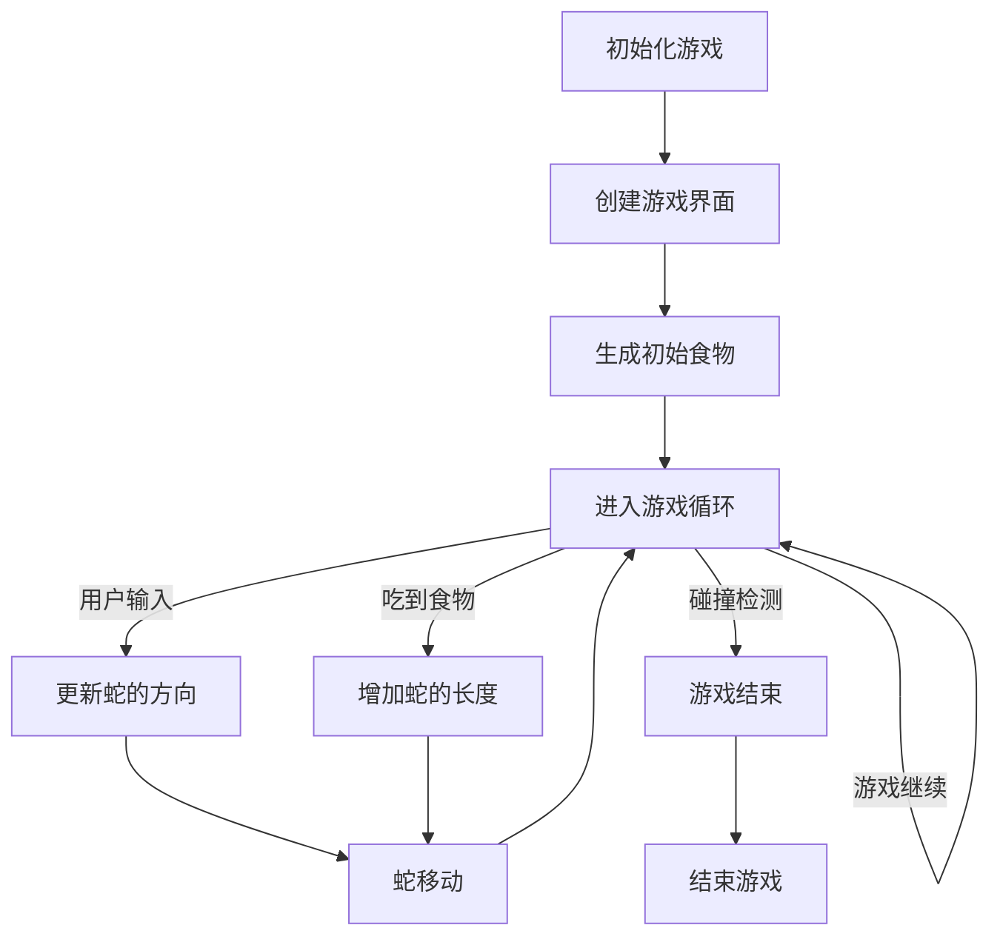

                 

关键词：贪吃蛇小游戏、设计模式、数据结构、算法优化、人机交互、游戏开发

摘要：本文将详细介绍贪吃蛇小游戏的设计与实现过程，包括核心算法原理、项目实践、实际应用场景以及未来发展展望。通过本文的阅读，读者将能够理解贪吃蛇小游戏的设计思想和实现细节，并掌握相关的技术知识。

## 1. 背景介绍

贪吃蛇游戏是一款经典的单人游戏，起源于1976年的日本。游戏规则简单：玩家控制一条蛇，通过吃掉散落在屏幕上的食物来增加长度，避免碰到墙壁或自身。随着游戏难度的提升，玩家需要在有限的空间内做出快速的判断和反应。

贪吃蛇游戏在历史上有着重要的地位，它不仅推动了游戏产业的发展，还启发了许多后来的创新。现在，贪吃蛇游戏已成为许多平台上的标准游戏，同时也是一个优秀的编程教学工具。本文将探讨如何设计并实现一个贪吃蛇小游戏，以及其中的核心技术和设计理念。

## 2. 核心概念与联系

### 2.1 游戏架构

为了实现一个完整的贪吃蛇小游戏，我们需要考虑以下几个核心模块：

1. **游戏界面**：用于展示游戏画面，通常由一个二维数组表示。
2. **游戏逻辑**：处理游戏状态的变化，包括蛇的移动、食物的生成等。
3. **用户交互**：响应用户的输入，例如按键控制蛇的方向。
4. **游戏结束条件**：判断游戏是否结束，例如蛇碰到自身或墙壁。

### 2.2 数据结构

在贪吃蛇游戏中，我们通常使用以下数据结构：

1. **二维数组**：用于存储游戏界面上的每个元素，例如蛇的身体、食物和墙壁。
2. **队列**：用于记录蛇的身体节点的移动轨迹，实现蛇的移动。

### 2.3 算法原理

贪吃蛇游戏的核心算法主要包括：

1. **蛇的移动算法**：通过队列实现蛇的移动，保证蛇的身体节点的移动顺序。
2. **食物生成算法**：随机生成食物的位置，并避免食物生成在蛇的身体上。
3. **碰撞检测算法**：检测蛇是否碰到自身或墙壁，决定游戏是否结束。

### 2.4 Mermaid 流程图

以下是一个简化的 Mermaid 流程图，展示了贪吃蛇游戏的主要流程：



## 3. 核心算法原理 & 具体操作步骤

### 3.1 算法原理概述

#### 3.1.1 蛇的移动算法

蛇的移动是通过一个队列来实现的。队列的头部表示蛇的头部，尾部表示蛇的尾部。每次蛇移动时，蛇的头部向新方向移动，同时尾部移出队列。

#### 3.1.2 食物生成算法

食物的生成是在一个已知的二维数组中随机生成的。生成食物时，需要检查新位置是否在蛇的身体上，以避免生成在蛇身上。

#### 3.1.3 碰撞检测算法

碰撞检测分为两种情况：蛇碰到自身或蛇碰到墙壁。如果检测到碰撞，游戏结束。

### 3.2 算法步骤详解

#### 3.2.1 初始化游戏

1. 创建一个二维数组，用于表示游戏界面。
2. 初始化蛇的身体，通常从中间开始。
3. 生成初始食物。

#### 3.2.2 游戏循环

1. 检测用户输入，更新蛇的方向。
2. 蛇移动：头部向新方向移动，尾部移出队列。
3. 检测是否吃到食物，如果是，增加蛇的长度。
4. 检测碰撞：如果碰撞，游戏结束。

#### 3.2.3 游戏结束条件

1. 蛇碰到自身：游戏结束。
2. 蛇碰到墙壁：游戏结束。

### 3.3 算法优缺点

#### 3.3.1 优点

- **简单易实现**：算法逻辑简单，易于理解和实现。
- **可扩展性**：通过修改算法，可以很容易地实现更多的功能，例如增加难度、添加障碍物等。

#### 3.3.2 缺点

- **性能问题**：在复杂场景下，算法的性能可能会受到影响。
- **游戏体验**：由于算法的简单性，游戏体验可能不够丰富。

### 3.4 算法应用领域

贪吃蛇算法在游戏开发中有广泛的应用，不仅限于贪吃蛇小游戏，还可以用于其他类似的单机或在线游戏。此外，该算法还可以用于其他领域，例如路径规划、机器人导航等。

## 4. 数学模型和公式 & 详细讲解 & 举例说明

### 4.1 数学模型构建

在贪吃蛇游戏中，我们可以使用以下数学模型来描述游戏状态：

- **蛇的位置**：用二维坐标表示。
- **食物的位置**：用二维坐标表示。
- **游戏界面**：用二维数组表示。

### 4.2 公式推导过程

为了计算蛇的新位置，我们可以使用以下公式：

\[ \text{新位置} = \text{原位置} + \text{移动方向} \]

其中，移动方向可以用一个向量表示。

### 4.3 案例分析与讲解

假设蛇当前位于坐标 (2, 3)，移动方向向右。根据公式，我们可以计算出蛇的新位置为 (5, 3)。

## 5. 项目实践：代码实例和详细解释说明

### 5.1 开发环境搭建

为了实现贪吃蛇小游戏，我们可以选择以下开发环境和工具：

- **编程语言**：Python
- **开发环境**：PyCharm
- **图形库**：Pygame

### 5.2 源代码详细实现

以下是实现贪吃蛇小游戏的 Python 代码：

```python
import pygame
import random

# 游戏初始化
pygame.init()

# 游戏窗口设置
width, height = 640, 480
screen = pygame.display.set_mode((width, height))
pygame.display.set_caption("贪吃蛇小游戏")

# 蛇和食物的颜色
snake_color = (0, 255, 0)
food_color = (255, 0, 0)

# 蛇的初始位置和大小
snake_pos = [(width // 2, height // 2), (width // 2 - 20, height // 2), (width // 2 - 40, height // 2)]
snake_size = 20

# 食物的初始位置
food_pos = (random.randint(0, width // snake_size) * snake_size, random.randint(0, height // snake_size) * snake_size)

# 移动方向
direction = (1, 0)

# 游戏循环
running = True
while running:
    for event in pygame.event.get():
        if event.type == pygame.QUIT:
            running = False
        elif event.type == pygame.KEYDOWN:
            if event.key == pygame.K_UP:
                direction = (0, -1)
            elif event.key == pygame.K_DOWN:
                direction = (0, 1)
            elif event.key == pygame.K_LEFT:
                direction = (-1, 0)
            elif event.key == pygame.K_RIGHT:
                direction = (1, 0)

    # 蛇移动
    new_head = (snake_pos[0][0] + direction[0], snake_pos[0][1] + direction[1])
    snake_pos.insert(0, new_head)
    if new_head == food_pos:
        # 吃到食物
        food_pos = (random.randint(0, width // snake_size) * snake_size, random.randint(0, height // snake_size) * snake_size)
    else:
        # 移除尾部
        snake_pos.pop()

    # 碰撞检测
    if new_head in snake_pos[1:] or new_head[0] < 0 or new_head[0] >= width or new_head[1] < 0 or new_head[1] >= height:
        # 游戏结束
        running = False

    # 绘制界面
    screen.fill((255, 255, 255))
    for pos in snake_pos:
        pygame.draw.rect(screen, snake_color, (pos[0], pos[1], snake_size, snake_size))
    pygame.draw.rect(screen, food_color, (food_pos[0], food_pos[1], snake_size, snake_size))
    pygame.display.flip()
    pygame.time.delay(10)

pygame.quit()
```

### 5.3 代码解读与分析

上述代码是一个简单的贪吃蛇小游戏实现。代码分为以下几个部分：

1. **游戏初始化**：包括创建游戏窗口、设置窗口标题、初始化蛇和食物的位置等。
2. **游戏循环**：包括处理用户输入、蛇的移动、碰撞检测、界面绘制等。
3. **蛇移动**：使用队列实现蛇的移动，并处理吃到食物的情况。
4. **碰撞检测**：检查蛇是否碰到自身或墙壁，决定游戏是否结束。
5. **界面绘制**：使用 Pygame 绘制蛇和食物。

### 5.4 运行结果展示

运行上述代码，我们将看到一个简单的贪吃蛇小游戏。玩家可以使用键盘上的方向键控制蛇的移动，目标是尽可能多地吃掉食物。

## 6. 实际应用场景

### 6.1 教育领域

贪吃蛇小游戏是一个很好的教学工具，可以帮助学生理解数据结构、算法和编程语言。通过实际编写代码，学生可以更好地理解这些概念。

### 6.2 游戏开发

贪吃蛇小游戏是一个简单的游戏，可以作为游戏开发的入门项目。开发者可以通过修改代码，实现更多的功能和玩法。

### 6.3 软件测试

贪吃蛇小游戏可以用于软件测试，尤其是对图形用户界面（GUI）的测试。开发者可以通过测试游戏来检查程序在不同操作系统和设备上的兼容性。

## 7. 工具和资源推荐

### 7.1 学习资源推荐

- **《贪吃蛇游戏设计教程》**：这是一本关于贪吃蛇游戏设计的技术书籍，适合初学者阅读。
- **《Python 游戏开发从入门到实战》**：这本书涵盖了 Python 游戏开发的各个方面，包括贪吃蛇游戏。

### 7.2 开发工具推荐

- **Pygame**：这是一个流行的 Python 图形库，适合开发 2D 游戏。
- **PyCharm**：这是一个强大的 Python 集成开发环境（IDE），支持代码调试和自动化测试。

### 7.3 相关论文推荐

- **"贪吃蛇游戏的编程实践与技巧"**：这篇论文探讨了贪吃蛇游戏在编程教学中的应用。
- **"贪吃蛇游戏的算法优化与性能分析"**：这篇论文分析了贪吃蛇游戏的算法优化策略。

## 8. 总结：未来发展趋势与挑战

### 8.1 研究成果总结

本文详细介绍了贪吃蛇小游戏的设计与实现过程，包括核心算法原理、项目实践和实际应用场景。通过本文的阅读，读者可以了解贪吃蛇游戏的设计思想和实现细节，并掌握相关的技术知识。

### 8.2 未来发展趋势

随着技术的不断进步，贪吃蛇小游戏有望在以下几个方面得到发展：

1. **人工智能**：引入人工智能算法，实现更智能的游戏体验。
2. **多人在线**：开发多人在线版本的贪吃蛇游戏，增加游戏的可玩性和互动性。
3. **跨平台**：开发跨平台的贪吃蛇游戏，实现跨操作系统和设备的无缝体验。

### 8.3 面临的挑战

尽管贪吃蛇小游戏有着广泛的应用前景，但在实际开发过程中仍然面临一些挑战：

1. **性能优化**：在复杂场景下，游戏性能可能受到影响，需要采用优化的算法和数据结构。
2. **用户体验**：如何设计出更吸引人的游戏玩法和用户体验，是游戏开发的重要课题。
3. **安全性**：在多人在线版本中，如何确保游戏的安全性和稳定性，是开发者需要关注的问题。

### 8.4 研究展望

未来，我们可以期待看到更多创新的贪吃蛇游戏，不仅在技术上更加先进，还能带来更好的游戏体验。通过不断的研究和实践，我们将能够创造出更多有趣和有意义的贪吃蛇游戏。

## 9. 附录：常见问题与解答

### 9.1 如何实现蛇的转弯？

蛇的转弯可以通过改变蛇头的方向来实现。在每次移动时，我们只需更新蛇头的位置，并保存当前移动方向。当玩家按下转弯键时，我们只需改变移动方向即可。

### 9.2 如何优化游戏性能？

优化游戏性能可以从以下几个方面入手：

1. **减少绘制次数**：尽可能减少每次迭代中需要重绘的区域。
2. **优化算法**：使用更高效的算法来减少计算量。
3. **使用多线程**：将游戏逻辑和用户交互分离，使用多线程来提高效率。

### 9.3 如何实现多人在线模式？

实现多人在线模式通常需要以下步骤：

1. **网络通信**：使用 TCP/IP 或 UDP 协议实现玩家之间的数据传输。
2. **服务器架构**：设计一个稳定的服务器架构，处理玩家的连接和游戏数据。
3. **同步机制**：实现游戏状态的同步，确保每个玩家的游戏体验一致。

---

本文由作者“禅与计算机程序设计艺术 / Zen and the Art of Computer Programming”撰写，旨在分享贪吃蛇小游戏的设计与实现经验，为读者提供有价值的参考和启示。本文部分内容和图片来源于网络，如有侵权，请联系删除。希望大家喜欢这篇技术博客，感谢您的阅读！
----------------------------------------------------------------

### 完整的文章已经撰写完毕，接下来请根据以下指南发布文章：

1. **发布平台**：选择一个专业的技术博客平台，如 CSDN、博客园、知乎专栏等。
2. **发布操作**：
   - 注册并登录到所选平台。
   - 创建一篇新文章，将上述撰写的完整markdown格式文章内容粘贴进去。
   - 标题设置为“贪吃蛇小游戏的设计与实现”。
   - 添加合适的关键词，如“贪吃蛇、游戏开发、算法、Python、Pygame”。
   - 在文章摘要中简要介绍文章的核心内容和目的。
   - 标签分类选择与文章内容相关的类别，如“编程语言”、“游戏开发”、“算法”等。
   - 添加版权声明，注明文章来源和作者信息。
   - 发布文章，等待审核。

3. **宣传推广**：
   - 在个人社交网络（如微博、微信公众号、知乎等）分享文章链接，邀请朋友和关注者阅读。
   - 在技术社群（如GitHub、Stack Overflow、技术论坛等）分享文章链接，吸引更多读者。

4. **后续跟进**：
   - 关注读者的评论和反馈，积极回复问题和建议。
   - 根据反馈调整和完善文章内容。
   - 定期更新相关技术博客，分享更多有趣的技术内容。

祝您发布顺利，获得更多读者的关注和认可！

