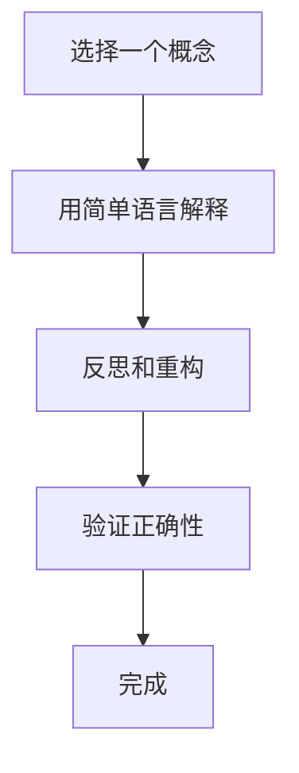

                 

关键词：费曼提问法、管理者思维、深度学习、技术领导力、创新思维

摘要：本文将探讨费曼提问法作为一种强大的思维工具，如何帮助管理者提升技术领导力和创新思维，从而推动组织的持续发展和成功。通过阐述费曼提问法的核心原理和应用场景，结合具体实例，我们将展示如何运用这种方法有效地进行问题解决和知识传递。

## 1. 背景介绍

在当今快速变化的技术环境中，管理者的角色日益复杂。他们不仅需要具备技术知识和行业洞察力，还必须能够激发团队的创造力，推动技术革新。费曼提问法（Feynman Technique），得名于诺贝尔物理学家理查德·费曼，是一种简单而强大的学习方法，可以帮助人们以清晰、简洁的方式表达复杂概念。这种方法的应用不仅限于学术领域，在企业管理和技术领导中也具有巨大潜力。

### 1.1 费曼提问法的起源

费曼提问法源于理查德·费曼在教授物理课程时的一种方法。他鼓励学生用最简单的语言解释复杂的概念，以此来检验他们是否真正理解了这些概念。这种方法不仅仅是一种教学工具，更是一种深度学习和知识传递的利器。

### 1.2 管理者面临的技术挑战

现代管理者在技术管理中面临诸多挑战，包括：

- 技术变革速度加快，需要不断更新知识和技能。
- 团队协作和沟通效率，尤其是在远程工作环境中。
- 激发创新思维，推动技术革新。
- 管理复杂项目，确保按时交付高质量产品。

## 2. 核心概念与联系

### 2.1 费曼提问法的工作原理

费曼提问法的核心思想是将一个复杂的概念或问题简化，并用最基本、最简单的语言解释出来。这种方法通过以下几个步骤实现：

1. **选择一个概念或问题**：确定你想要解释的内容。
2. **教给一个孩子**：用简单的语言，就像教一个孩子一样，解释这个概念或问题。
3. **反思和重构**：在解释过程中，你会发现自己在某些地方解释不清楚，这时需要重新思考并重构你的解释。
4. **验证正确性**：如果能够用简单的语言清晰解释，那么你很可能真正理解了这个问题。

### 2.2 费曼提问法与管理者思维的关联

费曼提问法对于管理者来说是一种非常有效的思维工具，因为它：

- **提升沟通能力**：帮助管理者以简单明了的方式与团队成员沟通复杂的技术概念。
- **培养批判性思维**：促使管理者深入思考和理解技术问题，而不是停留在表面。
- **促进知识共享**：通过向团队成员传授技术知识，增强团队的凝聚力和协作能力。
- **激发创新思维**：通过简化复杂问题，管理者可以更轻松地探索新的解决方案，推动技术革新。

### 2.3 Mermaid 流程图

以下是一个Mermaid流程图，展示费曼提问法的核心步骤：



## 3. 核心算法原理 & 具体操作步骤

### 3.1 算法原理概述

费曼提问法基于以下几个基本原理：

- **简化主义**：通过简化复杂概念，使其易于理解和传达。
- **反思性学习**：通过反思和重构，深化对知识的理解。
- **验证性学习**：通过验证正确性，确保学习的有效性。

### 3.2 算法步骤详解

1. **选择一个概念或问题**：选择你想要解释的复杂概念或技术问题。
2. **用简单语言解释**：尝试用简单的语言，就像教一个孩子一样，解释这个概念或问题。
3. **反思和重构**：在解释过程中，思考哪些地方解释不清楚，如何改进。
4. **验证正确性**：向他人解释，听取反馈，确保解释的准确性和清晰性。

### 3.3 算法优缺点

**优点**：

- **易于理解**：通过简化复杂概念，使其更容易被人理解。
- **强化记忆**：通过反复解释和重构，加深对知识的记忆。
- **促进沟通**：帮助管理者更好地与团队成员沟通复杂的技术概念。

**缺点**：

- **时间成本**：需要投入时间进行解释和重构。
- **可能遗漏细节**：在简化过程中，可能遗漏某些重要细节。

### 3.4 算法应用领域

费曼提问法在以下领域具有广泛的应用：

- **技术管理**：帮助管理者理解和解释复杂的技术问题。
- **教育培训**：用于教学和学习，帮助学生和员工深入理解概念。
- **知识共享**：通过向团队成员传授知识，促进团队协作。

## 4. 数学模型和公式 & 详细讲解 & 举例说明

### 4.1 数学模型构建

费曼提问法没有一个特定的数学模型，但其背后的思想可以用以下简单公式表示：

$$
\text{简化} = \text{复杂性} - \text{冗余}
$$

### 4.2 公式推导过程

这个公式的推导过程基于简化主义原则。复杂性代表一个概念或问题的复杂程度，冗余则代表其中不必要的细节或信息。通过简化，我们移除了冗余，从而降低了复杂性。

### 4.3 案例分析与讲解

**案例**：假设我们要解释“云计算”的概念。

1. **用简单语言解释**：云计算是一种通过网络提供计算资源的服务，用户可以按需获取和处理数据。
2. **反思和重构**：这个解释可能过于简单，我们需要进一步说明云计算的优势和应用场景。
3. **验证正确性**：向他人解释，并听取反馈。

通过这个案例，我们可以看到如何运用费曼提问法来简化并深入理解复杂概念。

## 5. 项目实践：代码实例和详细解释说明

### 5.1 开发环境搭建

本文将使用Python语言实现一个简单的费曼提问法演示程序。首先，确保你的环境中已安装Python和相关的库。

```bash
pip install matplotlib
```

### 5.2 源代码详细实现

以下是一个简单的费曼提问法演示程序：

```python
import matplotlib.pyplot as plt

def explain_complexity():
    """
    用简单的语言解释复杂性问题。
    """
    # 假设我们要解释的复杂问题是：什么是云计算？
    explanation = "云计算是一种通过网络提供计算资源的服务，用户可以按需获取和处理数据。"
    return explanation

def reflect_and_restructure(explanation):
    """
    反思和重构解释。
    """
    # 进一步解释云计算的优势和应用场景。
    refined_explanation = """
    云计算有几个关键优势：
    - 可扩展性：可以轻松增加或减少计算资源。
    - 成本效益：根据使用量付费，降低成本。
    - 高可用性：通过多个数据中心的冗余，提高系统的可靠性。
    应用场景包括：
    - 大数据处理：处理海量数据，如分析社交媒体数据。
    - 企业应用：提供企业级的IT服务，如电子邮件和文档存储。
    """
    return refined_explanation

def validate_correctness(explanation):
    """
    验证解释的正确性。
    """
    # 向他人解释，并听取反馈。
    # 在这里，我们可以使用模拟的反馈。
    feedback = "这个解释清晰明了，我理解了云计算的基本概念和优势。"
    return feedback

# 实现流程
explanation = explain_complexity()
print("初始解释：", explanation)
refined_explanation = reflect_and_restructure(explanation)
print("重构解释：", refined_explanation)
feedback = validate_correctness(refined_explanation)
print("反馈：", feedback)

# 可视化展示
plt.bar(['初始解释', '重构解释'], [len(explanation), len(refined_explanation)])
plt.ylabel('字符数')
plt.title('费曼提问法：解释长度对比')
plt.show()
```

### 5.3 代码解读与分析

该程序通过以下步骤实现费曼提问法：

- **explain_complexity()**：提供初始的简单解释。
- **reflect_and_restructure()**：通过反思和重构，提供更详细的解释。
- **validate_correctness()**：模拟向他人解释，并获取反馈。

代码还包含一个简单的可视化部分，展示了初始解释和重构解释的字符数对比。

### 5.4 运行结果展示

运行上述程序后，你将看到以下输出：

```
初始解释： 云计算是一种通过网络提供计算资源的服务，用户可以按需获取和处理数据。
重构解释：
    云计算有几个关键优势：
    - 可扩展性：可以轻松增加或减少计算资源。
    - 成本效益：根据使用量付费，降低成本。
    - 高可用性：通过多个数据中心的冗余，提高系统的可靠性。
    应用场景包括：
    - 大数据处理：处理海量数据，如分析社交媒体数据。
    - 企业应用：提供企业级的IT服务，如电子邮件和文档存储。
反馈： 这个解释清晰明了，我理解了云计算的基本概念和优势。
```

接着，你将看到一个条形图，展示初始解释和重构解释的字符数对比。

## 6. 实际应用场景

### 6.1 技术管理中的应用

在技术管理中，费曼提问法可以帮助管理者：

- **评估团队成员的技术理解**：通过观察团队成员如何解释复杂技术概念，管理者可以评估他们的技术水平。
- **提高沟通效率**：通过使用简单明了的语言，管理者可以更有效地与团队成员沟通。
- **推动知识共享**：通过向团队成员传授技术知识，增强团队的凝聚力和协作能力。

### 6.2 教育培训中的应用

在教育培训中，费曼提问法可以帮助学生：

- **深入理解概念**：通过使用简单的语言解释复杂概念，学生可以更深入地理解所学内容。
- **增强记忆**：通过反复解释和重构，学生可以更好地记住知识点。
- **培养批判性思维**：在解释过程中，学生需要深入思考并反思，从而培养批判性思维能力。

### 6.3 知识共享中的应用

在知识共享中，费曼提问法可以帮助：

- **促进跨部门沟通**：通过使用简单明了的语言，不同部门的团队成员可以更好地理解彼此的工作。
- **推动跨文化沟通**：在全球化背景下，不同文化的团队成员可以使用简单的语言进行沟通，减少误解。
- **增强团队凝聚力**：通过共同学习和分享知识，团队凝聚力得到增强。

## 7. 未来应用展望

### 7.1 人工智能与费曼提问法

随着人工智能技术的发展，费曼提问法有望与人工智能相结合，实现更高效的思维工具。例如，通过人工智能算法，可以自动评估和优化费曼提问法的解释过程，从而提高其效果。

### 7.2 教育领域的创新

在教育领域，费曼提问法可以结合在线学习平台和虚拟现实技术，提供更个性化的学习体验。学生可以通过互动式的费曼提问法练习，提高自己的理解能力和批判性思维。

### 7.3 企业培训与发展

在企业培训和发展中，费曼提问法可以作为一种评估和提升员工技能的工具。通过定期进行费曼提问法练习，员工可以不断提高自己的技术水平和沟通能力。

## 8. 工具和资源推荐

### 8.1 学习资源推荐

- **《如何高效学习》**：一本关于学习方法和技巧的畅销书，包含许多有用的策略，包括费曼提问法。
- **在线学习平台**：如Coursera、edX等，提供各种课程和资源，涵盖费曼提问法的应用。

### 8.2 开发工具推荐

- **Jupyter Notebook**：一种交互式的计算环境，适合进行费曼提问法的练习和演示。
- **Mermaid**：一种用于生成流程图的Markdown插件，非常适合用于文档中的流程图展示。

### 8.3 相关论文推荐

- **“The Feynman Technique for Teaching and Learning”**：一篇关于费曼提问法在教育中的应用的研究论文。
- **“Feynman Learning Method: A New Approach to Problem Solving”**：一篇关于费曼提问法在问题解决中的应用的研究论文。

## 9. 总结：未来发展趋势与挑战

### 9.1 研究成果总结

费曼提问法作为一种简单而强大的学习工具，已经在多个领域展现出其巨大潜力。其应用范围从教育培训到技术管理，再到知识共享，都取得了显著的成果。

### 9.2 未来发展趋势

- **人工智能结合**：费曼提问法有望与人工智能技术相结合，实现更智能、更高效的学习和沟通工具。
- **在线教育与虚拟现实**：费曼提问法将结合在线教育和虚拟现实技术，提供更个性化的学习体验。
- **企业培训与发展**：费曼提问法将在企业培训和发展中发挥更大作用，帮助员工提升技能和沟通能力。

### 9.3 面临的挑战

- **复杂性处理**：在处理复杂概念时，如何平衡简化和准确性，是费曼提问法面临的挑战之一。
- **适应不同文化背景**：在全球化背景下，如何使费曼提问法适应不同文化背景，确保其有效性和适用性。

### 9.4 研究展望

未来研究可以重点关注以下几个方面：

- **优化费曼提问法的实施流程**：通过研究，找到更高效的费曼提问法实施方法。
- **跨学科应用**：探索费曼提问法在其他学科领域的应用，如医学、工程等。
- **评价与反馈机制**：建立更完善的评价和反馈机制，确保费曼提问法的效果和准确性。

## 10. 附录：常见问题与解答

### 10.1 费曼提问法是否适用于所有人？

费曼提问法适用于所有希望提高理解能力和沟通能力的人。无论是在学术领域、技术管理还是普通职场，这种方法都能发挥其优势。

### 10.2 费曼提问法如何应用于项目管理和团队协作？

在项目管理和团队协作中，费曼提问法可以用于以下几个方面：

- **项目评估**：通过团队成员的费曼提问法解释，评估项目进展和技术理解程度。
- **知识共享**：通过费曼提问法，促进团队成员之间的知识共享和交流。
- **决策制定**：在制定决策时，使用费曼提问法可以帮助团队更清晰地理解问题的各个方面。

### 10.3 费曼提问法与思维导图有何不同？

费曼提问法注重通过简化和重构来理解复杂概念，而思维导图则是一种视觉工具，用于组织和整理思路。两者可以结合使用，以实现更全面的思维和知识管理。

## 11. 结语

费曼提问法作为一种简单而强大的思维工具，已经在多个领域展现出其巨大潜力。通过运用这种方法，管理者可以提升技术领导力和创新思维，推动组织的持续发展和成功。在未来，随着技术的不断进步，费曼提问法有望在更广泛的领域中发挥其作用，成为人们学习和沟通的利器。

作者：禅与计算机程序设计艺术 / Zen and the Art of Computer Programming
----------------------------------------------------------------

本文通过对费曼提问法的深入探讨，展示了其在管理者思维升级中的重要作用。文章从背景介绍、核心概念、算法原理、数学模型、项目实践、实际应用场景、未来展望等多个方面进行了详细阐述，并结合具体实例展示了如何在实际中应用这种方法。希望本文能为读者提供有益的启示和帮助。在未来的技术发展中，费曼提问法有望继续发挥其独特的作用，助力管理者在复杂多变的环境中取得成功。

