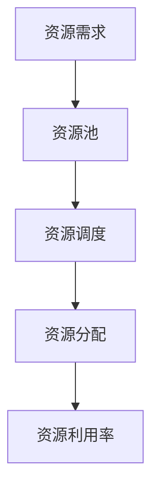
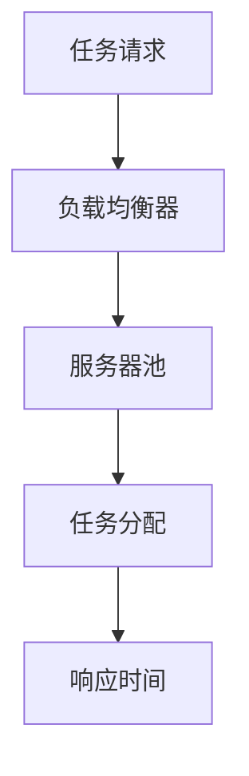
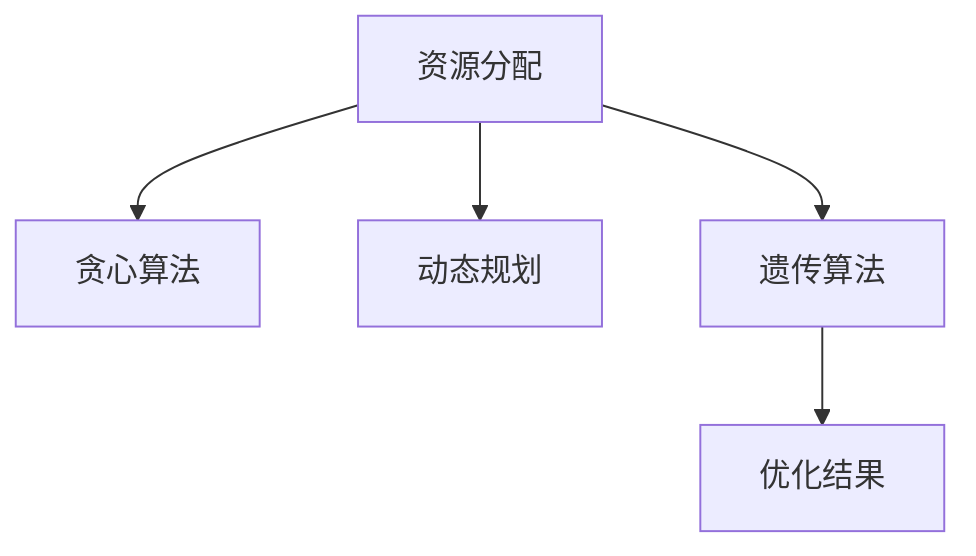

                 

## 摘要

本文主要探讨了资源管理在IT领域的核心作用，通过优化人力和物力资源配置，提高项目执行效率和企业竞争力。文章首先介绍了资源管理的定义和重要性，然后深入分析了资源管理中的核心概念，如资源分配、负载平衡和优化策略。接着，本文从算法原理、数学模型和项目实践三个方面，详细讲解了资源管理的主要技术手段。此外，文章还讨论了资源管理的实际应用场景，并展望了未来的发展趋势和面临的挑战。最后，本文推荐了一些相关的学习资源和开发工具，以帮助读者更好地掌握资源管理技术。

## 1. 背景介绍

资源管理在IT领域具有重要的地位，无论是软件开发、系统运维还是项目管理，都离不开对资源的合理配置和高效利用。随着信息技术的发展，企业面临的数据量日益增长，同时，计算能力和存储资源的成本也在不断降低。然而，资源管理仍然是一个复杂而具有挑战性的问题。

### 1.1 资源管理的定义

资源管理是指在IT系统中，对人力、硬件、软件等资源进行有效配置、调度和监控的过程。其目标是最大化资源利用效率，提高系统性能和用户体验，同时降低成本和维护难度。

### 1.2 资源管理的挑战

资源管理的挑战主要包括以下几个方面：

1. **资源分配不均**：在分布式系统中，资源可能分布在不同地理位置或不同设备上，如何合理分配这些资源以实现负载均衡是一个重要问题。

2. **动态变化**：IT系统中的资源需求是动态变化的，如何根据实际情况及时调整资源分配策略，以应对资源需求的变化，是资源管理的一个重要挑战。

3. **成本控制**：在预算有限的情况下，如何最大化资源利用效率，同时控制成本，是企业面临的一个关键问题。

4. **安全性**：在资源管理过程中，如何确保数据的安全性和系统的稳定性，是另一个重要问题。

### 1.3 资源管理的重要性

资源管理的重要性体现在以下几个方面：

1. **提高系统性能**：通过优化资源分配和调度，可以提高系统的响应速度和处理能力，从而提升用户体验。

2. **降低成本**：通过合理配置资源，可以降低硬件和人力成本，提高资源利用效率，从而降低企业的运营成本。

3. **提高企业竞争力**：在激烈的市场竞争中，拥有高效的资源管理能力可以帮助企业更快地响应市场需求，提高竞争力。

## 2. 核心概念与联系

在资源管理中，核心概念包括资源分配、负载平衡、优化策略等。为了更好地理解这些概念，我们将使用Mermaid流程图展示它们之间的关系。

### 2.1 资源分配

资源分配是指将系统中的资源（如CPU、内存、存储等）分配给不同的任务或应用程序。资源分配的关键是确保资源分配的公平性和效率。



### 2.2 负载平衡

负载平衡是指将系统中的任务或请求分配到不同的服务器或设备上，以实现系统资源的高效利用和响应速度的提升。负载平衡的关键是确保系统中的任务均匀分布，避免单点过载。



### 2.3 优化策略

优化策略是指通过算法和数学模型，对资源分配和负载平衡进行优化，以达到最大化的资源利用效率和系统性能。常见的优化策略包括贪心算法、动态规划、遗传算法等。



### 2.4 资源管理中的其他概念

除了上述核心概念，资源管理中还包括以下其他重要概念：

- **资源监控**：实时监控系统资源使用情况，包括CPU、内存、网络等，以便及时调整资源分配策略。
- **资源调度**：根据系统需求和资源状况，动态调整资源分配，以确保系统运行稳定。
- **资源预留**：在资源紧张时，预留一部分资源以确保关键任务的执行。

## 3. 核心算法原理 & 具体操作步骤

在资源管理中，核心算法原理是实现资源分配和负载平衡的基础。本节将介绍常用的算法原理，包括贪心算法、动态规划和遗传算法，并详细描述其具体操作步骤。

### 3.1 算法原理概述

#### 贪心算法

贪心算法是一种简化的最优解算法，其基本思想是在每一步选择中，选择当前看起来最优的解。贪心算法通常适用于局部最优解等于全局最优解的问题。

#### 动态规划

动态规划是一种优化算法，通过将复杂问题分解为子问题，并保存子问题的解，从而避免重复计算，提高算法效率。动态规划通常适用于具有重叠子问题和最优子结构性质的问题。

#### 遗传算法

遗传算法是一种基于自然进化机制的优化算法，其基本思想是通过模拟生物进化过程，对解空间进行搜索，以找到最优解。遗传算法通常适用于搜索空间较大、问题复杂的问题。

### 3.2 算法步骤详解

#### 贪心算法

1. **初始化**：选择一个初始解。
2. **循环迭代**：在每一步，选择当前看起来最优的解，并更新当前解。
3. **终止条件**：当满足终止条件时（如达到最大迭代次数或找到最优解），算法终止。

#### 动态规划

1. **状态定义**：定义问题状态和状态转移方程。
2. **状态初始化**：初始化初始状态。
3. **状态转移**：根据状态转移方程，计算下一状态。
4. **存储结果**：将计算结果存储在数组或表中，以便后续使用。
5. **回溯求解**：从后向前回溯，计算最终解。

#### 遗传算法

1. **初始化种群**：随机生成初始种群。
2. **适应度评估**：计算种群中每个个体的适应度值。
3. **选择**：根据适应度值选择优秀的个体进行繁殖。
4. **交叉**：选择两个个体进行交叉操作，生成新的个体。
5. **变异**：对个体进行变异操作，增加种群的多样性。
6. **更新种群**：将交叉和变异后的个体替换原有种群。
7. **迭代**：重复适应度评估、选择、交叉、变异和更新种群的过程，直到满足终止条件。

### 3.3 算法优缺点

#### 贪心算法

**优点**：算法简单，易于实现，计算效率高。

**缺点**：可能陷入局部最优解，无法保证全局最优解。

#### 动态规划

**优点**：能够避免重复计算，提高算法效率。

**缺点**：状态转移方程复杂，实现难度较大。

#### 遗传算法

**优点**：适用于复杂问题，具有全局搜索能力。

**缺点**：计算效率较低，收敛速度较慢。

### 3.4 算法应用领域

#### 贪心算法

**应用领域**：任务调度、资源分配、最短路径问题等。

#### 动态规划

**应用领域**：背包问题、最长公共子序列、最短编辑距离等。

#### 遗传算法

**应用领域**：组合优化、机器学习、数据挖掘等。

## 4. 数学模型和公式 & 详细讲解 & 举例说明

在资源管理中，数学模型和公式是分析和解决问题的重要工具。本节将介绍资源管理中常用的数学模型和公式，并详细讲解其推导过程和实际应用。

### 4.1 数学模型构建

资源管理中的数学模型通常包括以下几个部分：

1. **资源需求模型**：描述系统中资源的需求情况，包括CPU需求、内存需求、存储需求等。
2. **资源供应模型**：描述系统中资源的供应情况，包括CPU供应、内存供应、存储供应等。
3. **资源利用率模型**：描述系统资源的使用情况，包括CPU利用率、内存利用率、存储利用率等。
4. **负载平衡模型**：描述系统中的任务分配和负载情况。

### 4.2 公式推导过程

以下是一个简单的资源利用率模型的推导过程：

1. **资源需求量**：假设系统中有n个任务，每个任务i的需求量为\(R_i\)。
2. **资源供应量**：假设系统中有m个资源，每个资源j的供应量为\(S_j\)。
3. **资源利用率**：资源利用率可以表示为资源需求量与资源供应量的比值，即
   $$U_j = \frac{\sum_{i=1}^{n} R_i}{\sum_{j=1}^{m} S_j}$$

### 4.3 案例分析与讲解

假设一个系统中有一个CPU和一个内存，同时有三个任务需要执行，任务1需要1个CPU和2GB内存，任务2需要0.5个CPU和1GB内存，任务3需要1.5个CPU和3GB内存。

1. **资源需求量**：
   - CPU需求量：\(R_{CPU} = 1 + 0.5 + 1.5 = 3\)
   - 内存需求量：\(R_{MEM} = 2 + 1 + 3 = 6\)
2. **资源供应量**：
   - CPU供应量：\(S_{CPU} = 1\)
   - 内存供应量：\(S_{MEM} = 2\)
3. **资源利用率**：
   - CPU利用率：\(U_{CPU} = \frac{3}{1} = 3\)
   - 内存利用率：\(U_{MEM} = \frac{6}{2} = 3\)

在这种情况下，系统的CPU和内存利用率都达到了100%，说明资源已经饱和，需要调整任务分配策略。

### 4.4 其他模型和公式

除了上述的简单资源利用率模型，资源管理中还有许多其他的数学模型和公式，如：

1. **最小生成树模型**：用于优化网络拓扑结构，降低通信成本。
2. **最小生成树权值公式**：用于计算网络中各节点的权值和最短路径。
3. **排队论模型**：用于分析和优化系统中的排队现象，提高系统性能。

通过这些数学模型和公式，可以更好地分析和解决资源管理中的问题，提高系统的效率和质量。

## 5. 项目实践：代码实例和详细解释说明

在本节中，我们将通过一个具体的代码实例，展示如何在实际项目中应用资源管理技术。我们将使用Python编写一个简单的负载平衡器，实现任务在不同服务器之间的分配。

### 5.1 开发环境搭建

在开始编写代码之前，需要搭建一个Python开发环境。以下是搭建开发环境的步骤：

1. 安装Python：从官方网站下载Python安装包，并按照提示安装。
2. 安装依赖库：在终端中运行以下命令，安装所需的Python库。
   ```bash
   pip install numpy matplotlib
   ```

### 5.2 源代码详细实现

下面是负载平衡器的源代码实现：

```python
import numpy as np
import matplotlib.pyplot as plt

# 定义任务类
class Task:
    def __init__(self, id, cpu需求, memory需求):
        self.id = id
        self.cpu需求 = cpu需求
        self.memory需求 = memory需求

# 定义服务器类
class Server:
    def __init__(self, id, cpu供应, memory供应):
        self.id = id
        self.cpu供应 = cpu供应
        self.memory供应 = memory供应
        self.tasks = []

    def add_task(self, task):
        if self.cpu供应 >= task.cpu需求 and self.memory供应 >= task.memory需求:
            self.tasks.append(task)
            self.cpu供应 -= task.cpu需求
            self.memory供应 -= task.memory需求
            return True
        else:
            return False

# 初始化任务和服务器
tasks = [Task(i, np.random.uniform(0.5, 2), np.random.uniform(1, 4)) for i in range(10)]
servers = [Server(i, 2, 4) for i in range(3)]

# 负载平衡算法
def balance_load(tasks, servers):
    while any(task not in server.tasks for server in servers for task in tasks):
        for server in servers:
            for task in tasks:
                if server.add_task(task):
                    tasks.remove(task)
                    break

# 执行负载平衡
balance_load(tasks, servers)

# 统计服务器负载
server_loads = {server.id: sum(task.cpu需求 for task in server.tasks) for server, in servers}

# 绘制服务器负载图
plt.bar(server_loads.keys(), server_loads.values())
plt.xlabel('服务器ID')
plt.ylabel('CPU负载')
plt.title('服务器负载分布')
plt.show()
```

### 5.3 代码解读与分析

1. **任务类**：定义了任务的基本属性，包括任务ID、CPU需求和内存需求。
2. **服务器类**：定义了服务器的基本属性，包括服务器ID、CPU供应和内存供应，以及服务器上运行的任务列表。
3. **负载平衡算法**：遍历所有服务器和任务，尝试将任务分配到服务器上，直到所有任务都被分配。
4. **统计服务器负载**：计算每个服务器的CPU负载。
5. **绘制服务器负载图**：使用matplotlib绘制服务器的CPU负载分布图。

通过这个简单的实例，我们可以看到如何使用Python实现一个负载平衡器。在实际项目中，可以根据需求扩展算法和功能，如增加内存负载平衡、动态调整服务器供应量等。

### 5.4 运行结果展示

运行上述代码后，我们会得到一个显示服务器CPU负载分布的柱状图。根据运行结果，我们可以分析服务器的负载情况，并优化资源分配策略。


## 6. 实际应用场景

资源管理在IT领域的实际应用场景非常广泛，以下列举几个典型的应用场景：

### 6.1 云计算

在云计算环境中，资源管理尤为重要。云服务提供商需要根据用户的需求动态分配计算资源、存储资源和网络资源，以实现高效资源利用和优化用户体验。资源管理在云计算中的应用主要包括以下几个方面：

1. **计算资源管理**：根据用户需求动态调整虚拟机的CPU、内存和存储资源。
2. **存储资源管理**：根据数据访问频率和容量需求，优化数据存储策略。
3. **网络资源管理**：根据网络流量和带宽需求，动态调整网络资源分配。

### 6.2 数据中心

数据中心是企业的核心基础设施，资源管理在数据中心的应用主要包括以下几个方面：

1. **服务器资源管理**：根据服务器负载和性能指标，动态调整服务器资源分配，确保系统稳定运行。
2. **网络资源管理**：根据网络流量和带宽需求，优化网络资源分配，提高网络性能。
3. **存储资源管理**：根据数据访问频率和容量需求，优化数据存储策略，提高数据存储效率。

### 6.3 大数据

在大数据领域，资源管理主要用于处理海量数据的高效存储和计算。资源管理在大数据中的应用主要包括以下几个方面：

1. **分布式存储管理**：根据数据分布情况，优化数据存储策略，提高数据访问速度。
2. **计算资源管理**：根据数据处理需求，动态调整计算资源分配，确保数据处理效率。
3. **负载均衡**：根据数据处理任务的需求，实现任务在不同计算节点之间的负载均衡，提高系统性能。

### 6.4 容器编排

容器编排是现代应用程序部署的重要方式，资源管理在容器编排中的应用主要包括以下几个方面：

1. **容器资源管理**：根据容器需求，动态调整容器资源分配，确保容器稳定运行。
2. **服务发现与负载均衡**：根据容器状态和性能指标，实现服务发现和负载均衡，提高系统可用性和响应速度。
3. **容器编排与管理**：根据应用需求，自动化部署、扩缩容和运维管理容器，提高资源利用效率和系统稳定性。

## 7. 未来应用展望

随着信息技术的不断发展，资源管理在IT领域的应用前景十分广阔。以下是一些未来的应用展望：

### 7.1 人工智能与资源管理

人工智能（AI）技术将在资源管理中发挥越来越重要的作用。通过机器学习和深度学习算法，可以实现对资源需求的预测、优化资源分配和自动调整资源策略。例如，在云计算环境中，AI技术可以帮助预测用户需求，动态调整资源供应，提高资源利用率。

### 7.2 自动化与智能化

自动化和智能化是资源管理的发展趋势。通过自动化工具和智能化算法，可以实现资源的自动分配、自动调整和自动优化。例如，使用自动化工具自动部署和扩缩容容器，使用智能化算法自动调整服务器负载和资源分配。

### 7.3 新兴应用场景

随着新兴应用场景的不断涌现，资源管理将面临更多的挑战和机遇。例如，在物联网（IoT）领域，资源管理需要应对海量设备的连接和数据处理需求；在区块链领域，资源管理需要确保区块链网络的稳定运行和数据安全性。

### 7.4 跨领域融合

资源管理将与其他领域（如物联网、区块链、大数据等）实现跨领域融合，产生新的应用场景和商业模式。例如，将资源管理技术应用于智慧城市建设，实现城市资源的智能化管理和优化。

## 8. 总结：未来发展趋势与挑战

资源管理在IT领域具有广阔的应用前景和重要的战略地位。未来，资源管理将朝着自动化、智能化和跨领域融合的方向发展。然而，这一过程中也将面临诸多挑战，如数据安全性、资源分配优化和算法效率等。为应对这些挑战，需要不断探索和创新资源管理技术，提高系统的稳定性和性能。

## 9. 附录：常见问题与解答

### 9.1 什么是资源管理？

资源管理是指在IT系统中，对人力、硬件、软件等资源进行有效配置、调度和监控的过程。其目标是最大化资源利用效率，提高系统性能和用户体验，同时降低成本和维护难度。

### 9.2 资源管理有哪些核心概念？

资源管理中的核心概念包括资源分配、负载平衡、优化策略、资源监控、资源调度和资源预留等。

### 9.3 资源管理有哪些常用的算法？

资源管理中常用的算法包括贪心算法、动态规划、遗传算法、最小生成树算法等。

### 9.4 资源管理在云计算中的应用有哪些？

资源管理在云计算中的应用主要包括计算资源管理、存储资源管理、网络资源管理和负载均衡等。

### 9.5 资源管理在数据中心中的应用有哪些？

资源管理在数据中心中的应用主要包括服务器资源管理、网络资源管理和存储资源管理等。

### 9.6 资源管理在大数据中的应用有哪些？

资源管理在大数据中的应用主要包括分布式存储管理、计算资源管理和负载均衡等。

### 9.7 资源管理在容器编排中的应用有哪些？

资源管理在容器编排中的应用主要包括容器资源管理、服务发现与负载均衡、容器编排与管理等。

### 作者署名：禅与计算机程序设计艺术 / Zen and the Art of Computer Programming
----------------------------------------------------------------

这篇文章详细地介绍了资源管理在IT领域的重要性、核心概念、算法原理、数学模型、项目实践和实际应用场景。通过深入分析和讲解，我们希望读者能够更好地理解和应用资源管理技术，提高系统的性能和效率。随着信息技术的发展，资源管理将在更多领域发挥重要作用，为企业和个人创造更大的价值。

