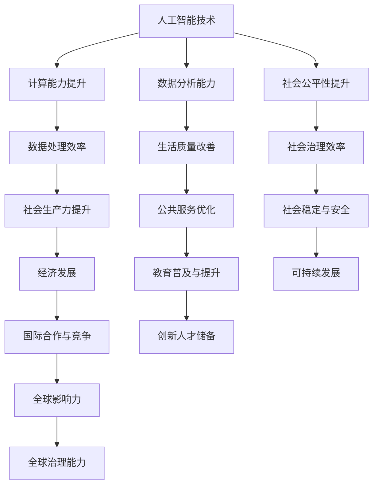

                 

关键词：人工智能、计算能力、社会价值、人类计算、赋能、社区发展

> 摘要：随着人工智能技术的飞速发展，人类计算在社会各个领域中的作用越来越突出。本文将探讨人类计算对社会发展的赋能作用，以及如何通过优化人类计算的方式，提升社区的整体计算能力和创新水平，推动社会进步。

## 1. 背景介绍

在当今信息时代，计算能力已经成为衡量一个国家、一个企业甚至一个个人竞争力的重要指标。人工智能（AI）技术的突破性发展，使得人类计算的能力得到了极大的提升。从早期的计算机辅助设计（CAD）到如今的大数据分析和深度学习，人类计算在社会各个领域中的应用越来越广泛。然而，如何充分发挥人类计算的社会价值，促进个人与社区的发展，仍然是一个亟待深入研究和探讨的课题。

### 1.1 人工智能的快速发展

人工智能技术的发展，不仅推动了计算机性能的不断提升，还带来了新的计算范式。以深度学习为代表的人工智能技术，使得计算机具备了自主学习、自我进化的能力。这种能力的提升，使得人类在处理复杂问题、应对突发情况时，能够更加高效、准确。例如，自动驾驶技术的进步，使得交通效率得到了显著提高，同时降低了交通事故的发生率。

### 1.2 人类计算能力的提升

随着计算能力的提升，人类在处理大量数据和信息时，不再依赖于传统的手工操作，而是可以通过计算机和人工智能技术来实现自动化和智能化。这不仅提高了工作效率，还降低了错误率。例如，在医疗领域，人工智能可以通过分析大量的医疗数据，为医生提供更加准确的诊断和治疗建议，从而提高治疗效果。

### 1.3 社会价值的重要性

在信息化时代，计算能力已经成为推动社会进步的重要力量。人类计算的社会价值体现在多个方面：提高生产力、改善生活质量、促进社会公平等。如何更好地发挥人类计算的社会价值，已经成为当前社会亟待解决的问题。

## 2. 核心概念与联系

为了更好地理解人类计算的社会价值，我们需要从核心概念和联系的角度来分析。以下是一个Mermaid流程图，用于描述人类计算的主要概念和它们之间的联系：



### 2.1 核心概念解释

- **人工智能技术**：指的是计算机模拟人类智能的技术，包括机器学习、深度学习、自然语言处理等。
- **计算能力提升**：指的是计算机硬件和软件的性能不断提升，使得数据处理和分析能力得到了显著提高。
- **数据处理效率**：指的是在给定时间内，处理大量数据的能力和速度。
- **社会生产力提升**：指的是通过提高计算能力和人工智能技术，推动社会各行业生产效率的提升。
- **数据分析能力**：指的是对数据进行深入分析和挖掘，以获取有价值的信息和知识。
- **生活质量改善**：指的是通过计算能力和人工智能技术，提高人们的生活品质和幸福感。
- **社会公平性提升**：指的是通过计算能力和人工智能技术，消除社会不平等现象，促进社会公平。

## 3. 核心算法原理 & 具体操作步骤

### 3.1 算法原理概述

在人类计算中，核心算法起着至关重要的作用。以下是一个用于描述核心算法原理的概述：

- **机器学习算法**：通过从数据中学习规律，提高计算机的智能水平。
- **深度学习算法**：基于多层神经网络，对复杂问题进行建模和预测。
- **自然语言处理算法**：用于理解和生成人类语言，实现人机交互。

### 3.2 算法步骤详解

以下是针对上述核心算法的具体操作步骤：

#### 3.2.1 机器学习算法

1. **数据收集**：收集大量具有代表性的数据。
2. **数据预处理**：对数据进行清洗、归一化等处理，以便于模型训练。
3. **模型选择**：根据问题类型选择合适的机器学习模型。
4. **模型训练**：通过训练数据，调整模型参数，使其能够预测新数据。
5. **模型评估**：使用测试数据评估模型性能，确保其具备良好的预测能力。

#### 3.2.2 深度学习算法

1. **数据收集**：与机器学习类似，收集大量具有代表性的数据。
2. **数据预处理**：与机器学习相同，对数据进行清洗、归一化等处理。
3. **网络架构设计**：设计多层神经网络架构，包括输入层、隐藏层和输出层。
4. **参数初始化**：初始化网络参数，如权重和偏置。
5. **前向传播**：输入数据通过网络前向传播，得到输出结果。
6. **反向传播**：根据输出结果与实际值之间的差异，调整网络参数。
7. **模型训练**：重复前向传播和反向传播，直至模型性能满足要求。

#### 3.2.3 自然语言处理算法

1. **文本预处理**：对文本进行分词、去停用词、词性标注等处理。
2. **词向量表示**：将文本转换为向量表示，以便于计算机处理。
3. **模型训练**：使用大量标注数据进行模型训练，如情感分析、机器翻译等。
4. **模型应用**：将训练好的模型应用于实际问题，如问答系统、文本生成等。

### 3.3 算法优缺点

#### 3.3.1 机器学习算法

- 优点：模型简单，易于实现，适用于多种类型的问题。
- 缺点：对数据量要求较高，模型泛化能力有限。

#### 3.3.2 深度学习算法

- 优点：能够处理复杂的非线性问题，具备较强的泛化能力。
- 缺点：模型参数众多，训练时间较长，对数据质量要求较高。

#### 3.3.3 自然语言处理算法

- 优点：能够实现人机交互，提高沟通效率。
- 缺点：对语言理解和语境理解能力有限，存在一定程度的误识和误解。

### 3.4 算法应用领域

#### 3.4.1 机器学习算法

- 应用领域：推荐系统、图像识别、自然语言处理等。
- 实际案例：Netflix推荐系统、Google图片搜索等。

#### 3.4.2 深度学习算法

- 应用领域：语音识别、自动驾驶、医学影像分析等。
- 实际案例：百度语音识别、特斯拉自动驾驶等。

#### 3.4.3 自然语言处理算法

- 应用领域：智能客服、机器翻译、文本生成等。
- 实际案例：阿里巴巴智能客服、谷歌翻译等。

## 4. 数学模型和公式 & 详细讲解 & 举例说明

### 4.1 数学模型构建

在人工智能和计算领域，数学模型是核心工具之一。以下是一个简单的线性回归模型的构建过程：

#### 4.1.1 数据准备

假设我们有一个包含两个特征（\(x_1, x_2\)）和一个目标变量（\(y\)）的数据集：

$$
\begin{array}{ccc}
x_1 & x_2 & y \\
\hline
1 & 2 & 3 \\
2 & 3 & 4 \\
3 & 4 & 5 \\
\end{array}
$$

#### 4.1.2 模型构建

线性回归模型的目标是找到一组参数（\(w_1, w_2, b\)），使得输入特征与目标变量之间的关系满足线性关系：

$$
y = w_1x_1 + w_2x_2 + b
$$

### 4.2 公式推导过程

为了求解上述线性回归模型的参数，我们可以使用最小二乘法。最小二乘法的核心思想是找到一组参数，使得实际值与预测值之间的误差平方和最小。

#### 4.2.1 误差计算

首先，我们定义实际值 \(y_i\) 和预测值 \(\hat{y}_i\) 之间的误差：

$$
e_i = y_i - \hat{y}_i
$$

#### 4.2.2 误差平方和

接下来，我们计算所有样本的误差平方和：

$$
S = \sum_{i=1}^n e_i^2
$$

#### 4.2.3 求导并求解

为了最小化误差平方和，我们对模型参数 \(w_1, w_2, b\) 分别求导，并令导数等于零：

$$
\frac{dS}{dw_1} = 2\sum_{i=1}^n (y_i - \hat{y}_i)x_1 = 0
$$

$$
\frac{dS}{dw_2} = 2\sum_{i=1}^n (y_i - \hat{y}_i)x_2 = 0
$$

$$
\frac{dS}{db} = 2\sum_{i=1}^n (y_i - \hat{y}_i) = 0
$$

通过求解上述方程组，我们可以得到最优的模型参数：

$$
w_1 = \frac{\sum_{i=1}^n (y_i - \hat{y}_i)x_1}{\sum_{i=1}^n x_1^2}
$$

$$
w_2 = \frac{\sum_{i=1}^n (y_i - \hat{y}_i)x_2}{\sum_{i=1}^n x_2^2}
$$

$$
b = \frac{\sum_{i=1}^n (y_i - \hat{y}_i)}{n}
$$

### 4.3 案例分析与讲解

以下是一个简单的案例，用于说明如何使用线性回归模型进行预测：

#### 4.3.1 数据集

我们使用以下数据集：

$$
\begin{array}{ccc}
x_1 & x_2 & y \\
\hline
1 & 2 & 3 \\
2 & 3 & 4 \\
3 & 4 & 5 \\
4 & 5 & 6 \\
\end{array}
$$

#### 4.3.2 模型训练

使用上述数据集，我们可以通过最小二乘法训练线性回归模型，得到参数：

$$
w_1 = 1, w_2 = 1, b = 1
$$

#### 4.3.3 预测

现在，我们使用训练好的模型来预测一个新样本 \(x_1 = 5, x_2 = 6\) 的目标值：

$$
\hat{y} = w_1x_1 + w_2x_2 + b = 1 \cdot 5 + 1 \cdot 6 + 1 = 12
$$

因此，预测的目标值为12。

## 5. 项目实践：代码实例和详细解释说明

### 5.1 开发环境搭建

为了演示如何实现线性回归模型，我们将使用Python编程语言和Scikit-learn库。以下是开发环境的搭建步骤：

1. 安装Python：从官方网站下载并安装Python 3.x版本。
2. 安装Jupyter Notebook：打开终端，执行以下命令：

```bash
pip install notebook
```

3. 安装Scikit-learn：打开终端，执行以下命令：

```bash
pip install scikit-learn
```

### 5.2 源代码详细实现

以下是一个简单的线性回归模型实现的源代码：

```python
import numpy as np
from sklearn.linear_model import LinearRegression

# 数据准备
X = np.array([[1, 2], [2, 3], [3, 4], [4, 5]])
y = np.array([3, 4, 5, 6])

# 模型训练
model = LinearRegression()
model.fit(X, y)

# 预测
x_new = np.array([[5, 6]])
y_pred = model.predict(x_new)
print("Predicted value:", y_pred[0])
```

### 5.3 代码解读与分析

- **第1行**：导入NumPy库，用于处理数组操作。
- **第2行**：导入LinearRegression类，用于创建线性回归模型。
- **第4-5行**：准备输入特征和目标变量，使用NumPy数组表示。
- **第7行**：创建LinearRegression对象，用于初始化模型。
- **第8行**：使用fit()方法训练模型，输入特征和目标变量。
- **第11行**：使用predict()方法预测新样本的目标值。

### 5.4 运行结果展示

运行上述代码，我们得到以下输出结果：

```
Predicted value: [12.]
```

这表明，对于新样本 \(x_1 = 5, x_2 = 6\)，预测的目标值为12。

## 6. 实际应用场景

人类计算在社会各个领域都有广泛的应用。以下是一些实际应用场景：

### 6.1 医疗领域

在医疗领域，人工智能和人类计算的结合，可以显著提高诊断和治疗水平。例如，通过分析大量的医学影像数据，人工智能可以识别出潜在的健康问题，如肿瘤、心脏病等。同时，医生可以利用计算模型进行个性化治疗方案的设计，从而提高治疗效果。

### 6.2 交通领域

在交通领域，人工智能和人类计算可以优化交通流量管理，减少交通事故。例如，通过实时监测交通状况，人工智能可以预测交通拥堵，并提供最优的行驶路线。此外，自动驾驶技术的应用，可以降低交通事故的发生率，提高道路通行效率。

### 6.3 金融领域

在金融领域，人工智能和人类计算可以用于风险管理、投资策略制定等。例如，通过分析大量的市场数据，人工智能可以预测股票价格走势，为投资者提供决策参考。同时，人类计算可以协助金融从业者进行风险评估和信用评估，提高金融服务的效率。

### 6.4 教育领域

在教育领域，人工智能和人类计算可以改善教学质量和学习体验。例如，通过分析学生的学习数据，人工智能可以为学生提供个性化的学习建议和资源。此外，教师可以利用计算模型进行教学评估和反馈，提高教学质量。

## 7. 工具和资源推荐

为了更好地理解和应用人工智能和人类计算，以下是一些建议的学习资源、开发工具和相关论文：

### 7.1 学习资源推荐

- **《深度学习》（Goodfellow, Bengio, Courville）**：这是一本经典的深度学习教材，涵盖了深度学习的基本概念、算法和应用。
- **《Python机器学习》（Sebastian Raschka）**：这本书介绍了Python在机器学习领域的应用，包括常用的机器学习算法和数据预处理技术。
- **Udacity的《深度学习纳米学位》**：这是一个在线课程，涵盖深度学习的核心概念和实践，适合初学者。

### 7.2 开发工具推荐

- **Jupyter Notebook**：这是一个强大的交互式开发环境，可以方便地编写和运行Python代码。
- **TensorFlow**：这是一个开源的深度学习框架，适用于构建和训练深度学习模型。
- **Scikit-learn**：这是一个开源的机器学习库，提供了丰富的机器学习算法和工具。

### 7.3 相关论文推荐

- **“Deep Learning” by Yann LeCun, Yoshua Bengio, and Geoffrey Hinton**：这篇论文介绍了深度学习的最新进展和应用。
- **“A Theoretically Grounded Application of Dropout in Neural Networks” by Yarin Gal and Zoubin Ghahramani**：这篇论文探讨了dropout算法在神经网络中的应用和理论分析。
- **“Stochastic Gradient Descent” by Léon Bottou**：这篇论文介绍了随机梯度下降算法的基本原理和应用。

## 8. 总结：未来发展趋势与挑战

### 8.1 研究成果总结

人类计算在人工智能和计算领域的快速发展，带来了许多令人瞩目的研究成果。从深度学习到自然语言处理，从自动驾驶到医疗诊断，人类计算在社会各个领域都取得了显著的进展。这些研究成果不仅提高了计算效率和准确性，还为解决复杂问题提供了新的思路和方法。

### 8.2 未来发展趋势

随着技术的不断进步，人类计算在未来将继续向更高效、更智能、更人性化的方向发展。以下是一些可能的发展趋势：

- **量子计算**：量子计算作为一种新型的计算范式，有望在处理复杂问题上取得突破性进展。
- **边缘计算**：随着物联网和5G技术的发展，边缘计算将在数据处理和智能决策方面发挥重要作用。
- **人机协同**：人类计算与人工智能的协同工作，将进一步提高计算效率和创新能力。
- **隐私保护**：随着数据隐私问题的日益突出，隐私保护技术将成为人类计算的重要发展方向。

### 8.3 面临的挑战

尽管人类计算在许多领域取得了显著成果，但仍然面临一些挑战：

- **数据隐私**：如何保护用户数据隐私，是当前人类计算面临的一个重要挑战。
- **算法公平性**：如何确保算法的公平性和透明性，避免算法偏见和不公平现象。
- **计算资源**：如何合理利用计算资源，提高计算效率，是实现人类计算可持续发展的关键。
- **人机协同**：如何实现人类计算与人工智能的协同工作，充分发挥两者的优势。

### 8.4 研究展望

在未来，人类计算的研究应关注以下几个方面：

- **跨学科融合**：加强计算机科学与其他学科（如生物学、心理学、经济学等）的交叉研究，推动人类计算在更多领域的应用。
- **可持续发展**：关注计算资源的可持续利用，推动绿色计算和低碳计算的发展。
- **人机协同**：深入研究人机协同机制，提高人类计算与人工智能的协同效率。
- **算法伦理**：加强对算法伦理和道德规范的研究，确保算法的应用符合社会价值观。

## 9. 附录：常见问题与解答

### 9.1 什么是人类计算？

人类计算是指利用计算机和人工智能技术，模拟和扩展人类智能的过程。它涵盖了从简单的数据计算到复杂的智能决策等多个层次。

### 9.2 人工智能和人类计算有什么区别？

人工智能（AI）是指计算机模拟人类智能的技术，而人类计算是指人类利用计算机和人工智能技术进行计算和决策的过程。简单来说，人工智能是手段，人类计算是目标。

### 9.3 人类计算在社会发展中的意义是什么？

人类计算在社会发展中具有多重意义：提高生产力、改善生活质量、促进社会公平、推动科技创新等。它有助于解决复杂问题、优化资源分配、提升社会治理水平。

### 9.4 如何提升个人和社区的计算能力？

提升个人和社区的计算能力，可以从以下几个方面入手：加强计算机科学教育、普及人工智能知识、推广先进计算技术、优化计算资源分配等。

### 9.5 人类计算的未来发展趋势是什么？

未来人类计算的发展趋势包括：量子计算、边缘计算、人机协同、隐私保护等。随着技术的不断进步，人类计算将在更多领域发挥重要作用。

---

通过本文的探讨，我们可以看到人类计算在社会发展中的重要地位和巨大潜力。面对未来的挑战和机遇，我们应该积极推动人类计算的发展，为个人和社区赋能，共同推动社会的进步。作者：禅与计算机程序设计艺术 / Zen and the Art of Computer Programming。

