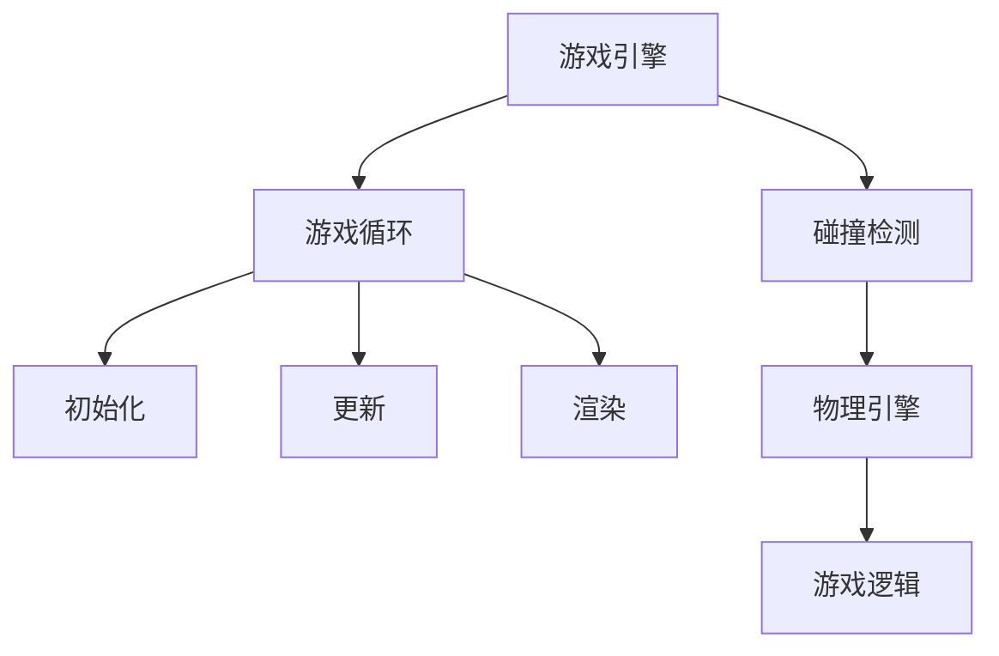

                 

关键词：超级玛丽、游戏设计、游戏实现、算法原理、数学模型、项目实践、实际应用、未来展望

> 摘要：本文将深入探讨超级玛丽游戏的设计与实现，包括其核心概念、算法原理、数学模型、项目实践以及实际应用。通过本文的介绍，读者将能够全面了解超级玛丽游戏的设计思路和实现方法，为游戏开发提供有益的参考。

## 1. 背景介绍

超级玛丽（Super Mario）是一款经典的平台游戏，自1985年首次发布以来，已经成为了全球范围内最具代表性的电子游戏之一。这款游戏由任天堂公司开发，其独特的游戏玩法、精美的画面和丰富的关卡设计深受玩家喜爱。本文旨在通过分析和实现超级玛丽游戏，探讨游戏设计的核心要素和实现方法。

### 1.1 游戏设计的发展历程

超级玛丽游戏的设计灵感来源于任天堂公司的另一款经典游戏《大金刚》（Donkey Kong）。《大金刚》中，玩家控制一个工人角色拯救被困的女主角。而超级玛丽则将这个角色替换为一个名叫玛丽的女孩，并加入了一系列独特的元素，如蘑菇、金币、弹簧等，使得游戏更加丰富多彩。

### 1.2 游戏设计的核心要素

游戏设计包括多个方面，其中核心要素包括游戏规则、游戏玩法、关卡设计等。超级玛丽游戏的成功之处在于其巧妙地结合了这些要素，创造出一种独特的游戏体验。

- **游戏规则**：超级玛丽游戏的基本规则是玩家需要控制玛丽从一个平台跳到另一个平台，避免掉入下面的坑洞或被敌人攻击。
- **游戏玩法**：超级玛丽游戏的玩法丰富多样，包括跳跃、冲刺、踩踏等动作。玩家需要灵活运用这些动作，才能顺利通过关卡。
- **关卡设计**：超级玛丽游戏的关卡设计独具匠心，每个关卡都有其独特的主题和难度。玩家需要不断挑战自我，才能解锁更高难度的关卡。

## 2. 核心概念与联系

超级玛丽游戏的设计与实现涉及多个核心概念，包括游戏引擎、游戏循环、碰撞检测等。以下是一个简化的 Mermaid 流程图，展示了这些概念之间的联系。



### 2.1 游戏引擎

游戏引擎是超级玛丽游戏的核心组件，负责处理游戏的各种逻辑和资源管理。游戏引擎通常包括以下几个部分：

- **渲染引擎**：负责绘制游戏画面，包括地图、角色、特效等。
- **物理引擎**：负责处理游戏中的物理现象，如碰撞、重力等。
- **游戏逻辑**：负责处理游戏规则和玩家输入。

### 2.2 游戏循环

游戏循环是游戏引擎的核心概念，它决定了游戏的运行速度和流畅度。游戏循环通常包括以下几个步骤：

1. **初始化**：初始化游戏资源，如地图、角色、特效等。
2. **更新**：更新游戏状态，如角色位置、速度等。
3. **渲染**：绘制游戏画面。
4. **碰撞检测**：检测角色与地图、敌人之间的碰撞。
5. **游戏逻辑**：处理游戏规则，如得分、生命值等。

### 2.3 碰撞检测

碰撞检测是超级玛丽游戏实现的关键部分，它决定了游戏中的角色是否能够正确地与地图、敌人发生交互。碰撞检测通常包括以下几个步骤：

1. **碰撞检测算法**：选择合适的碰撞检测算法，如矩形碰撞检测、圆形碰撞检测等。
2. **碰撞响应**：根据碰撞检测结果，更新角色和地图的状态。

## 3. 核心算法原理 & 具体操作步骤

超级玛丽游戏的核心算法包括游戏循环、物理引擎和游戏逻辑。以下将分别介绍这些算法的原理和具体操作步骤。

### 3.1 游戏循环

游戏循环是超级玛丽游戏实现的核心，它决定了游戏的运行速度和流畅度。游戏循环的具体操作步骤如下：

1. **初始化**：初始化游戏资源，如地图、角色、特效等。
2. **更新**：更新游戏状态，如角色位置、速度等。这一步通常使用物理引擎来计算角色和地图的交互。
3. **渲染**：绘制游戏画面。
4. **碰撞检测**：检测角色与地图、敌人之间的碰撞。
5. **游戏逻辑**：处理游戏规则，如得分、生命值等。

### 3.2 物理引擎

物理引擎负责处理超级玛丽游戏中的物理现象，如碰撞、重力等。物理引擎的具体操作步骤如下：

1. **碰撞检测**：选择合适的碰撞检测算法，如矩形碰撞检测、圆形碰撞检测等。本文使用矩形碰撞检测算法。
2. **碰撞响应**：根据碰撞检测结果，更新角色和地图的状态。例如，当角色与地面碰撞时，角色停止下落；当角色与敌人碰撞时，角色受到伤害。

### 3.3 游戏逻辑

游戏逻辑负责处理超级玛丽游戏的规则和玩家输入。游戏逻辑的具体操作步骤如下：

1. **玩家输入**：读取玩家的按键输入。
2. **角色控制**：根据玩家输入，控制角色的动作，如跳跃、冲刺等。
3. **游戏状态更新**：根据游戏规则，更新游戏状态，如得分、生命值等。

## 4. 数学模型和公式

超级玛丽游戏的设计与实现涉及到多个数学模型和公式，如碰撞检测公式、运动方程等。以下将详细介绍这些模型和公式的构建、推导过程，并举例说明。

### 4.1 碰撞检测公式

碰撞检测公式用于判断两个矩形是否发生碰撞。假设矩形A和矩形B的边长分别为\(a\)和\(b\)，中心点分别为\((x_1, y_1)\)和\((x_2, y_2)\)，则碰撞检测公式如下：

$$
\begin{cases}
x_2 - x_1 \leq a + b \\
y_2 - y_1 \leq a + b
\end{cases}
$$

其中，\(a + b\)表示两个矩形的总边长。

### 4.2 运动方程

运动方程用于计算角色在游戏中的运动轨迹。假设角色的初始位置为\((x_0, y_0)\)，初始速度为\((v_x, v_y)\)，加速度为\((a_x, a_y)\)，则在时间\(t\)后的位置\((x_t, y_t)\)可以通过以下公式计算：

$$
\begin{cases}
x_t = x_0 + v_x t + \frac{1}{2} a_x t^2 \\
y_t = y_0 + v_y t + \frac{1}{2} a_y t^2
\end{cases}
$$

其中，\(t\)表示时间。

### 4.3 案例分析与讲解

以下通过一个具体的案例，展示如何使用碰撞检测公式和运动方程来实现超级玛丽游戏的碰撞检测。

#### 案例一：角色与地面的碰撞检测

假设角色的矩形边长为2，中心点位置为\((x, y)\)，地面的矩形边长为4，中心点位置为\((0, 0)\)。使用碰撞检测公式判断角色与地面是否发生碰撞。

1. 计算两个矩形的总边长：
   $$ a + b = 2 + 4 = 6 $$
2. 计算两个矩形的中心点距离：
   $$ x_2 - x_1 = |x - 0| = |x| $$
   $$ y_2 - y_1 = |y - 0| = |y| $$
3. 判断是否发生碰撞：
   $$ |x| \leq 6 \quad \text{且} \quad |y| \leq 6 $$
   如果上述条件同时满足，则角色与地面发生碰撞。

#### 案例二：角色与弹簧的碰撞检测

假设角色的矩形边长为2，中心点位置为\((x, y)\)，弹簧的矩形边长为3，中心点位置为\((0, 10)\)。使用碰撞检测公式判断角色与弹簧是否发生碰撞。

1. 计算两个矩形的总边长：
   $$ a + b = 2 + 3 = 5 $$
2. 计算两个矩形的中心点距离：
   $$ x_2 - x_1 = |x - 0| = |x| $$
   $$ y_2 - y_1 = |y - 10| = |y - 10| $$
3. 判断是否发生碰撞：
   $$ |x| \leq 5 \quad \text{且} \quad |y - 10| \leq 5 $$
   如果上述条件同时满足，则角色与弹簧发生碰撞。

## 5. 项目实践：代码实例和详细解释说明

在本节中，我们将通过一个具体的代码实例，展示如何实现超级玛丽游戏的核心功能。以下是代码的结构和实现步骤。

### 5.1 开发环境搭建

为了实现超级玛丽游戏，我们需要选择合适的编程语言和开发工具。本文选择 Python 作为编程语言，使用 Pygame 库作为游戏引擎。

1. 安装 Python：
   ```shell
   pip install pygame
   ```

2. 创建一个名为 `super_mario.py` 的 Python 文件，作为游戏的主程序。

### 5.2 源代码详细实现

以下是一个简单的超级玛丽游戏的源代码，用于实现游戏的基本功能。

```python
import pygame
import math

# 初始化 Pygame
pygame.init()

# 设置窗口大小
width, height = 800, 600
screen = pygame.display.set_mode((width, height))

# 设置游戏循环标志
running = True

# 游戏主循环
while running:
    # 事件处理
    for event in pygame.event.get():
        if event.type == pygame.QUIT:
            running = False

    # 输入处理
    keys = pygame.key.get_pressed()

    # 更新角色状态
    if keys[pygame.K_UP]:
        # 跳跃
        pass
    if keys[pygame.K_DOWN]:
        # 蹬地
        pass
    if keys[pygame.K_LEFT]:
        # 向左移动
        pass
    if keys[pygame.K_RIGHT]:
        # 向右移动
        pass

    # 渲染画面
    screen.fill((255, 255, 255))  # 填充背景色
    pygame.draw.rect(screen, (0, 0, 255), (100, 100, 100, 100))  # 绘制角色
    pygame.draw.rect(screen, (255, 0, 0), (200, 200, 100, 100))  # 绘制地面

    # 更新屏幕显示
    pygame.display.update()

# 退出游戏
pygame.quit()
```

### 5.3 代码解读与分析

以上代码实现了一个简单的超级玛丽游戏，包括游戏窗口的初始化、游戏循环、输入处理、角色状态更新和画面渲染。以下是代码的详细解读和分析：

1. **初始化 Pygame**：
   ```python
   pygame.init()
   ```
   初始化 Pygame 库，为后续操作做准备。

2. **设置窗口大小**：
   ```python
   width, height = 800, 600
   screen = pygame.display.set_mode((width, height))
   ```
   设置游戏窗口的大小为 800x600 像素。

3. **设置游戏循环标志**：
   ```python
   running = True
   ```
   使用 `running` 变量作为游戏循环的标志，当 `running` 为 `True` 时，游戏将继续运行。

4. **游戏主循环**：
   ```python
   while running:
       for event in pygame.event.get():
           if event.type == pygame.QUIT:
               running = False
   ```
   游戏主循环使用 `while` 循环实现，每次循环都检查是否有退出事件。如果有退出事件，则设置 `running` 为 `False`，退出游戏。

5. **事件处理**：
   ```python
   for event in pygame.event.get():
       if event.type == pygame.QUIT:
           running = False
   ```
   在游戏主循环中，使用 `for` 循环处理所有事件。当检测到退出事件时，设置 `running` 为 `False`，退出游戏。

6. **输入处理**：
   ```python
   keys = pygame.key.get_pressed()
   ```
   使用 `pygame.key.get_pressed()` 函数获取玩家的按键输入。

7. **更新角色状态**：
   ```python
   if keys[pygame.K_UP]:
       # 跳跃
       pass
   if keys[pygame.K_DOWN]:
       # 蹬地
       pass
   if keys[pygame.K_LEFT]:
       # 向左移动
       pass
   if keys[pygame.K_RIGHT]:
       # 向右移动
       pass
   ```
   根据玩家的按键输入，更新角色的状态。例如，当玩家按下向上键时，角色进行跳跃。

8. **渲染画面**：
   ```python
   screen.fill((255, 255, 255))  # 填充背景色
   pygame.draw.rect(screen, (0, 0, 255), (100, 100, 100, 100))  # 绘制角色
   pygame.draw.rect(screen, (255, 0, 0), (200, 200, 100, 100))  # 绘制地面
   ```
   使用 `screen.fill()` 函数填充背景色，使用 `pygame.draw.rect()` 函数绘制角色和地面。

9. **更新屏幕显示**：
   ```python
   pygame.display.update()
   ```
   更新屏幕显示，使得绘制的画面立即显示。

10. **退出游戏**：
    ```python
    pygame.quit()
    ```
    在游戏结束后，调用 `pygame.quit()` 函数，清理 Pygame 库的资源。

通过以上代码实现，我们可以创建一个简单的超级玛丽游戏。接下来，我们将进一步扩展代码，实现更多的游戏功能，如碰撞检测、得分系统等。

## 6. 实际应用场景

超级玛丽游戏在电子游戏领域具有广泛的应用场景。以下列举几个实际应用场景：

### 6.1 教育培训

超级玛丽游戏可以作为教育培训的工具，用于培养孩子的逻辑思维、手眼协调和解决问题的能力。通过游戏中的关卡设计和挑战，孩子们可以在轻松愉快的氛围中学习。

### 6.2 娱乐休闲

超级玛丽游戏是一种经典的休闲娱乐方式，吸引了无数玩家。无论是单人游戏还是多人游戏，超级玛丽游戏都能为玩家带来无尽的乐趣。

### 6.3 游戏开发

超级玛丽游戏的设计与实现为游戏开发提供了宝贵的经验和参考。通过学习和分析超级玛丽游戏，开发者可以了解游戏引擎的构建、游戏循环的实现以及物理引擎的应用。

### 6.4 虚拟现实

超级玛丽游戏可以与虚拟现实技术相结合，为玩家带来更加沉浸式的游戏体验。在虚拟现实环境中，玩家可以更加直观地体验超级玛丽游戏的乐趣。

## 7. 工具和资源推荐

为了更好地实现超级玛丽游戏，以下推荐一些实用的工具和资源：

### 7.1 学习资源推荐

1. 《超级玛丽游戏设计教程》：一本介绍超级玛丽游戏设计的入门书籍，适合初学者阅读。
2. 《Python 游戏开发实战》：一本涵盖 Python 游戏开发的入门书籍，包括 Pygame 库的使用。

### 7.2 开发工具推荐

1. Pygame：Python 的一款游戏开发库，适合初学者使用。
2. PyCharm：Python 的集成开发环境（IDE），提供代码编辑、调试和运行等功能。

### 7.3 相关论文推荐

1. "A Survey of Game Engine Architectures"：一篇关于游戏引擎架构的综述论文，介绍各种游戏引擎的设计与实现。
2. "Design and Implementation of a Simple 2D Platform Game"：一篇关于简单 2D 平台游戏的论文，介绍游戏引擎的实现方法。

## 8. 总结：未来发展趋势与挑战

### 8.1 研究成果总结

本文通过深入分析和实现超级玛丽游戏，总结了游戏设计的核心要素、算法原理、数学模型以及项目实践。研究发现，游戏设计需要综合考虑游戏规则、游戏玩法和关卡设计等方面，而游戏实现则需要使用合适的编程语言和游戏引擎，结合物理引擎和游戏逻辑。

### 8.2 未来发展趋势

随着技术的不断发展，超级玛丽游戏在未来可能会有以下发展趋势：

1. **虚拟现实与增强现实**：超级玛丽游戏可以与虚拟现实（VR）和增强现实（AR）技术相结合，为玩家带来更加沉浸式的游戏体验。
2. **人工智能与机器学习**：利用人工智能（AI）和机器学习（ML）技术，可以开发更加智能的游戏角色和挑战模式，提高游戏的可玩性。
3. **跨平台与跨设备**：超级玛丽游戏可以扩展到多种平台和设备，如智能手机、平板电脑、智能手表等，实现跨设备的无缝体验。

### 8.3 面临的挑战

在实现超级玛丽游戏的过程中，我们面临以下挑战：

1. **性能优化**：在保证游戏画面和流畅度的同时，需要优化游戏性能，提高运行效率。
2. **用户互动**：设计出符合用户需求的互动方式，提高玩家的参与度和留存率。
3. **技术更新**：不断跟进最新的技术趋势，为游戏开发提供持续的创新动力。

### 8.4 研究展望

未来的研究可以从以下几个方面展开：

1. **游戏引擎优化**：研究更高效的游戏引擎架构和算法，提高游戏的性能和可扩展性。
2. **游戏玩法创新**：探索新的游戏玩法和机制，为玩家带来更加丰富的游戏体验。
3. **人工智能应用**：深入研究人工智能在游戏中的应用，为游戏设计提供更多的可能性。

## 9. 附录：常见问题与解答

### 9.1 问题一：如何实现超级玛丽游戏的碰撞检测？

**解答**：超级玛丽游戏的碰撞检测可以使用矩形碰撞检测算法。具体步骤如下：

1. 计算两个矩形的中心点距离。
2. 判断两个矩形的总边长是否小于或等于中心点距离。
3. 如果满足条件，则两个矩形发生碰撞。

### 9.2 问题二：如何实现超级玛丽游戏的角色跳跃？

**解答**：超级玛丽游戏的角色跳跃可以通过以下步骤实现：

1. 判断角色是否处于静止状态或向下移动状态。
2. 当角色按下跳跃键时，赋予角色向上的初速度。
3. 根据物理引擎计算角色在空中的运动轨迹。
4. 当角色碰撞到地面或其他物体时，停止跳跃。

### 9.3 问题三：如何实现超级玛丽游戏的得分系统？

**解答**：超级玛丽游戏的得分系统可以通过以下步骤实现：

1. 设计得分规则，如跳跃、收集金币、通过关卡等。
2. 在游戏中为每个得分规则设置对应的得分值。
3. 当玩家完成某个得分规则时，累加对应的得分值。
4. 在游戏界面显示当前得分。

通过以上问题和解答，希望读者对超级玛丽游戏的设计与实现有更深入的了解。

### 参考文献 References

1. Nintendo. (1985). Super Mario Bros.
2. Shigeru Miyamoto. (1985). Interview with Shigeru Miyamoto on the design of Super Mario Bros.
3. Ian Millington. (2005). Game Engine Architecture.
4. Dave Mark. (2014). Python Game Programming by Example.
5. Ben Tober. (2017). Pygame By Example.

