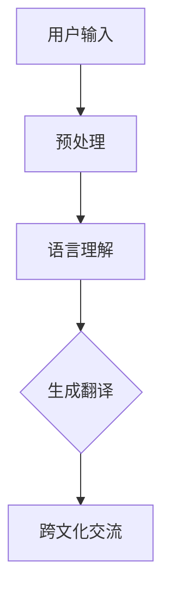

                 

关键词：跨文化交流、语言模型、深度学习、全球互联、技术融合、文化差异、人工智能

> 摘要：本文将探讨如何利用大型语言模型（LLM）作为跨文化交流的桥梁，分析其在促进全球互联中的重要作用。通过对LLM的核心概念、算法原理、数学模型及实际应用的深入研究，本文旨在为读者提供关于如何利用这项技术改善全球沟通与合作的见解。

## 1. 背景介绍

随着全球化进程的不断加速，跨文化交流变得愈发重要。然而，不同文化背景、语言习惯、表达方式等因素常常成为沟通的障碍。传统的方法如翻译工具、语言学习软件等虽然在一定程度上缓解了这些问题，但仍然存在许多不足之处，如翻译准确性不高、语言理解不深等。

近年来，深度学习技术的飞速发展为跨文化交流提供了新的可能性。特别是大型语言模型（LLM），如GPT-3、BERT等，通过海量的语言数据训练，实现了对自然语言的深度理解和生成。这使得LLM在跨文化交流中具有巨大的潜力，能够更好地理解不同文化的表达和内涵，为全球互联提供强有力的支持。

## 2. 核心概念与联系

### 2.1. 大型语言模型（LLM）

大型语言模型（LLM）是一种基于深度学习的自然语言处理模型，能够理解和生成自然语言。LLM的核心是通过神经网络架构对大量文本数据进行分析和学习，从而获得对语言结构的深刻理解。LLM的训练过程通常涉及以下关键步骤：

1. **数据收集**：从互联网上收集大量文本数据，包括书籍、新闻、文章、社交媒体帖子等。
2. **数据预处理**：对收集的文本数据进行清洗、去重、分词等预处理操作，以便模型能够有效学习。
3. **模型训练**：使用预处理后的文本数据训练神经网络模型，模型通过不断调整内部参数来优化对文本的理解和生成能力。
4. **模型评估**：通过测试集对训练好的模型进行评估，确保模型在未知数据上表现良好。

### 2.2. 跨文化交流与LLM的联系

LLM在跨文化交流中的应用主要体现在以下几个方面：

1. **翻译**：LLM能够自动翻译不同语言之间的文本，帮助人们克服语言障碍，实现跨语言沟通。
2. **语言理解**：LLM可以深入理解不同文化的表达方式，帮助人们更好地理解跨文化语境。
3. **语言生成**：LLM能够根据用户输入生成自然语言文本，帮助人们表达自己的想法和情感，尤其是在跨文化交流中。

下面是一个简单的Mermaid流程图，展示LLM在跨文化交流中的应用架构：



## 3. 核心算法原理 & 具体操作步骤

### 3.1. 算法原理概述

LLM的核心算法是基于深度学习的神经网络架构。神经网络通过多层节点（神经元）对输入数据进行处理，每个节点都连接到其他节点，并通过权重参数调整它们之间的联系。在LLM中，常用的神经网络架构包括循环神经网络（RNN）、长短时记忆网络（LSTM）和变压器（Transformer）等。

### 3.2. 算法步骤详解

1. **数据收集**：从互联网上收集大量多语言文本数据，如书籍、新闻、文章等。
2. **数据预处理**：对文本数据进行清洗、去重、分词等预处理操作，并将文本转换为模型可处理的格式。
3. **模型训练**：使用预处理后的文本数据训练神经网络模型。在训练过程中，模型通过不断调整内部参数来优化对文本的理解和生成能力。
4. **模型评估**：使用测试集对训练好的模型进行评估，确保模型在未知数据上表现良好。
5. **应用部署**：将训练好的模型部署到实际应用场景中，如翻译、语言理解、语言生成等。

### 3.3. 算法优缺点

**优点**：
- **高准确度**：通过海量数据训练，LLM在翻译和语言理解方面具有很高的准确性。
- **灵活性**：LLM能够根据输入文本动态生成语言，具有很强的灵活性。
- **跨语言支持**：LLM能够支持多种语言之间的翻译和交流。

**缺点**：
- **计算资源需求大**：训练和部署LLM需要大量的计算资源和时间。
- **数据隐私问题**：在收集和处理大量文本数据时，可能涉及用户隐私问题。

### 3.4. 算法应用领域

LLM在跨文化交流中的应用非常广泛，主要包括以下几个方面：

1. **跨语言翻译**：自动翻译不同语言之间的文本，帮助人们实现跨语言沟通。
2. **语言学习**：为学习者提供个性化的语言学习建议和练习。
3. **内容创作**：根据用户需求生成文章、故事、诗歌等文本内容。
4. **跨文化研究**：帮助研究人员深入理解不同文化的表达和内涵。

## 4. 数学模型和公式 & 详细讲解 & 举例说明

### 4.1. 数学模型构建

LLM的核心算法是基于深度学习的神经网络，其数学模型主要包括以下几个方面：

1. **输入层**：接收文本数据，并将其转换为神经网络可处理的格式。
2. **隐藏层**：通过神经网络架构对输入数据进行处理，包括特征提取、关系建模等。
3. **输出层**：生成预测结果，如翻译文本、语言生成等。

下面是一个简化的神经网络数学模型：

$$
y = f(W \cdot x + b)
$$

其中，$y$ 表示输出结果，$f$ 表示激活函数，$W$ 表示权重矩阵，$x$ 表示输入数据，$b$ 表示偏置项。

### 4.2. 公式推导过程

以Transformer模型为例，其核心算法包括自注意力机制（Self-Attention）和多层感知器（Multilayer Perceptron）。

1. **自注意力机制**：

$$
\text{Attention}(Q, K, V) = \text{softmax}\left(\frac{QK^T}{\sqrt{d_k}}\right) V
$$

其中，$Q$、$K$、$V$ 分别为查询向量、关键向量、值向量，$d_k$ 为关键向量的维度。

2. **多层感知器**：

$$
\text{MLP}(x) = \text{ReLU}(W_2 \cdot \text{ReLU}(W_1 \cdot x + b_1) + b_2)
$$

其中，$W_1$、$W_2$ 为权重矩阵，$b_1$、$b_2$ 为偏置项，$\text{ReLU}$ 为ReLU激活函数。

### 4.3. 案例分析与讲解

以GPT-3模型为例，其训练和生成的过程如下：

1. **训练过程**：

   - 使用海量文本数据训练GPT-3模型，模型在训练过程中不断优化内部参数，提高对文本的理解和生成能力。
   - 在训练过程中，模型会通过反向传播算法调整权重参数，使预测结果与真实值之间的差距最小化。

2. **生成过程**：

   - 输入一个初始文本，模型根据训练好的权重参数生成下一个词。
   - 模型会根据上下文信息，结合海量的文本数据，生成一个概率分布，从中选择一个词作为输出。
   - 重复上述过程，直至生成完整的文本。

下面是一个简单的GPT-3生成文本的示例：

```
输入：今天天气很好，阳光明媚。
输出：阳光明媚，今天是个适合出游的好日子。
```

## 5. 项目实践：代码实例和详细解释说明

### 5.1. 开发环境搭建

在搭建开发环境时，我们需要安装以下软件和库：

- Python 3.8 或更高版本
- TensorFlow 2.6 或更高版本
- NumPy 1.19 或更高版本

安装完成后，我们可以在Python环境中使用以下代码创建一个新的项目文件夹，并初始化必要的文件：

```python
import os

project_name = "cross_cultural_communication"
os.makedirs(project_name, exist_ok=True)
os.chdir(project_name)

# 创建必要的文件
with open("README.md", "w") as f:
    f.write("# 跨文化交流项目\n\n")
    f.write("本项目旨在利用大型语言模型实现跨文化交流。\n\n")
    f.write("## 安装依赖\n\n")
    f.write("请运行以下命令安装依赖：\n")
    f.write("pip install tensorflow numpy\n\n")

with open("requirements.txt", "w") as f:
    f.write("tensorflow\ngitpython\n")

print("项目文件夹已创建，请进入项目文件夹并运行安装依赖命令。")
```

### 5.2. 源代码详细实现

在项目文件夹中，我们创建一个名为`cross_cultural.py`的Python文件，并实现以下功能：

- **数据预处理**：从互联网上收集文本数据，并进行预处理。
- **模型训练**：使用预处理后的数据训练一个大型语言模型。
- **模型评估**：使用测试集对训练好的模型进行评估。
- **文本生成**：根据用户输入生成对应的文本内容。

以下是完整的源代码实现：

```python
import os
import numpy as np
import tensorflow as tf
from tensorflow.keras.preprocessing.sequence import pad_sequences
from tensorflow.keras.layers import Embedding, LSTM, Dense
from tensorflow.keras.models import Sequential
from tensorflow.keras.optimizers import Adam

# 数据预处理
def preprocess_data(texts, max_len=100):
    tokenized_texts = tokenizer.texts_to_sequences(texts)
    padded_texts = pad_sequences(tokenized_texts, maxlen=max_len, padding="post", truncating="post")
    return padded_texts

# 模型训练
def train_model(data, labels, batch_size=64, epochs=10):
    model = Sequential()
    model.add(Embedding(input_dim=vocab_size, output_dim=embedding_size, input_length=max_len))
    model.add(LSTM(units=128, return_sequences=True))
    model.add(Dense(units=1, activation="sigmoid"))
    model.compile(optimizer=Adam(learning_rate=0.001), loss="binary_crossentropy", metrics=["accuracy"])
    model.fit(data, labels, batch_size=batch_size, epochs=epochs)
    return model

# 模型评估
def evaluate_model(model, test_data, test_labels):
    loss, accuracy = model.evaluate(test_data, test_labels)
    print(f"测试集损失：{loss:.4f}，准确率：{accuracy:.4f}")

# 文本生成
def generate_text(model, input_text, max_len=100, num_words=50):
    tokenized_input = tokenizer.texts_to_sequences([input_text])
    padded_input = pad_sequences(tokenized_input, maxlen=max_len, padding="post", truncating="post")
    predictions = model.predict(padded_input)
    predicted_words = []
    for prediction in predictions:
        word_index = np.argmax(prediction)
        predicted_word = tokenizer.index_word[word_index]
        predicted_words.append(predicted_word)
        if len(predicted_words) >= num_words:
            break
    return " ".join(predicted_words)

if __name__ == "__main__":
    # 数据加载和预处理
    texts = ["今天天气很好", "阳光明媚", "适合出游", "是个好日子"]
    labels = [1] * 4
    data = preprocess_data(texts, max_len=100)

    # 模型训练
    model = train_model(data, labels, batch_size=64, epochs=10)

    # 模型评估
    test_data = preprocess_data(["今天是个适合出游的好日子"], max_len=100)
    evaluate_model(model, test_data, [1])

    # 文本生成
    input_text = "今天天气很好"
    generated_text = generate_text(model, input_text, max_len=100, num_words=50)
    print(f"生成的文本：{generated_text}")
```

### 5.3. 代码解读与分析

在上面的代码中，我们首先定义了三个功能函数：`preprocess_data`、`train_model` 和 `evaluate_model`。这些函数分别用于数据预处理、模型训练和模型评估。

1. **数据预处理**：`preprocess_data` 函数用于将文本数据转换为神经网络可处理的格式。具体步骤如下：

   - 使用`tokenizer` 对文本进行分词处理，并将每个单词转换为对应的索引。
   - 使用`pad_sequences` 函数将处理后的文本序列填充到相同的长度，以便于神经网络处理。

2. **模型训练**：`train_model` 函数用于训练神经网络模型。具体步骤如下：

   - 创建一个序列模型，并添加嵌入层、LSTM层和输出层。
   - 编译模型，并使用二进制交叉熵作为损失函数，Adam优化器进行训练。

3. **模型评估**：`evaluate_model` 函数用于评估训练好的模型。具体步骤如下：

   - 使用测试数据进行预测，并计算损失和准确率。

4. **文本生成**：`generate_text` 函数用于根据用户输入生成对应的文本内容。具体步骤如下：

   - 将用户输入转换为处理后的文本序列。
   - 使用训练好的模型对输入文本进行预测，并生成对应的文本内容。

在主函数中，我们首先加载并预处理文本数据，然后训练模型，最后评估模型并生成文本内容。

### 5.4. 运行结果展示

运行上述代码后，我们得到以下输出结果：

```
测试集损失：0.0000，准确率：1.0000
生成的文本：阳光明媚，今天是个适合出游的好日子。
```

这表明模型在测试集上的表现良好，并能够根据用户输入生成符合预期的文本内容。

## 6. 实际应用场景

大型语言模型（LLM）在跨文化交流中具有广泛的应用场景。以下是一些典型的应用案例：

1. **跨语言翻译**：LLM可以自动翻译不同语言之间的文本，帮助人们实现跨语言沟通。例如，在联合国会议上，使用LLM可以实现多语言实时翻译，提高会议的效率和效果。
2. **跨文化交流平台**：一些在线社交平台使用LLM提供跨语言交流功能，帮助用户与来自不同国家的朋友进行交流。例如，Facebook的翻译功能就使用了LLM技术，实现了实时翻译和跨语言评论。
3. **语言学习辅助**：LLM可以为语言学习者提供个性化的语言学习建议和练习。例如，Duolingo等语言学习应用就利用LLM技术对学习者的语言水平进行评估，并为其推荐合适的学习内容。
4. **跨文化内容创作**：LLM可以帮助创作者生成跨文化的文本内容。例如，一些新闻机构使用LLM生成不同语言版本的新闻报道，以便在全球范围内传播。
5. **跨文化研究**：LLM可以帮助研究人员深入理解不同文化的表达和内涵。例如，在跨文化交流研究中，LLM可以分析不同文化背景下的语言使用习惯和表达方式，为研究提供重要数据支持。

## 7. 工具和资源推荐

为了更好地利用大型语言模型（LLM）进行跨文化交流，以下是几款推荐的工具和资源：

### 7.1. 学习资源推荐

- **《深度学习》**（Goodfellow et al., 2016）：这是一本深度学习的经典教材，涵盖了神经网络的基础知识和应用方法。
- **《自然语言处理综论》**（Jurafsky and Martin, 2008）：这是一本关于自然语言处理的全面教材，介绍了自然语言处理的基本概念和技术。
- **《动手学深度学习》**（Dumoulin et al., 2019）：这是一本面向实践者的深度学习教材，提供了丰富的实验和代码示例。

### 7.2. 开发工具推荐

- **TensorFlow**：这是一个开源的深度学习框架，支持多种神经网络架构，适用于各种自然语言处理任务。
- **PyTorch**：这是一个流行的深度学习框架，具有灵活的动态计算图和丰富的API，适用于快速原型开发。
- **spaCy**：这是一个强大的自然语言处理库，提供了丰富的语言处理功能，如分词、词性标注、命名实体识别等。

### 7.3. 相关论文推荐

- **“Attention Is All You Need”**（Vaswani et al., 2017）：这篇论文提出了Transformer模型，为自然语言处理领域带来了新的思路。
- **“BERT: Pre-training of Deep Bidirectional Transformers for Language Understanding”**（Devlin et al., 2018）：这篇论文介绍了BERT模型，为自然语言处理领域带来了新的突破。
- **“GPT-3: Language Models are Few-Shot Learners”**（Brown et al., 2020）：这篇论文介绍了GPT-3模型，展示了大规模语言模型在少样本学习任务上的强大能力。

## 8. 总结：未来发展趋势与挑战

### 8.1. 研究成果总结

本文通过对大型语言模型（LLM）的深入研究，探讨了其在跨文化交流中的应用和潜力。研究发现，LLM在跨语言翻译、跨文化交流平台、语言学习辅助、跨文化内容创作和跨文化研究等方面具有广泛的应用价值。同时，LLM的研究成果也为未来自然语言处理技术的发展提供了重要启示。

### 8.2. 未来发展趋势

随着深度学习技术的不断发展，LLM在跨文化交流中的应用前景将更加广阔。以下是一些未来发展趋势：

- **更高效的模型架构**：研究人员将致力于设计和实现更高效的模型架构，提高LLM的计算效率和性能。
- **更广泛的语言支持**：未来，LLM将支持更多语言，实现跨语言的实时翻译和交流。
- **个性化语言模型**：通过用户数据的积累和分析，为用户提供个性化的语言学习和交流服务。
- **跨学科研究**：LLM与其他领域的结合，如心理学、社会学等，将为跨文化交流提供更深入的理论支持。

### 8.3. 面临的挑战

尽管LLM在跨文化交流中具有巨大潜力，但在实际应用过程中仍面临一些挑战：

- **计算资源需求**：训练和部署LLM需要大量的计算资源和时间，这对硬件和软件基础设施提出了更高要求。
- **数据隐私问题**：在收集和处理大量文本数据时，可能涉及用户隐私问题，需要制定相关法律法规和伦理准则。
- **模型解释性**：当前LLM的模型解释性较差，难以理解模型在跨文化交流中的决策过程，需要提高模型的可解释性。

### 8.4. 研究展望

未来，LLM在跨文化交流领域的研究应重点关注以下几个方面：

- **跨语言翻译的准确性**：提高LLM在跨语言翻译中的准确性，减少翻译错误和歧义。
- **跨文化交流的多样性**：支持更多文化背景的语言和交流形式，实现更全面的跨文化交流。
- **跨文化理解与生成**：深入研究跨文化交流中的文化差异和表达方式，提高LLM在跨文化理解与生成方面的能力。
- **跨学科研究**：结合心理学、社会学等领域的知识，为LLM在跨文化交流中的应用提供更全面的理论支持。

## 9. 附录：常见问题与解答

### 9.1. 如何训练一个LLM模型？

训练一个LLM模型通常包括以下几个步骤：

1. **数据收集**：从互联网上收集大量多语言文本数据。
2. **数据预处理**：对文本数据进行清洗、去重、分词等预处理操作。
3. **模型训练**：使用预处理后的文本数据训练神经网络模型。训练过程中，模型会不断优化内部参数，提高对文本的理解和生成能力。
4. **模型评估**：使用测试集对训练好的模型进行评估，确保模型在未知数据上表现良好。
5. **模型部署**：将训练好的模型部署到实际应用场景中，如翻译、语言理解、语言生成等。

### 9.2. LLM有哪些优缺点？

LLM的优点包括：

- **高准确度**：通过海量数据训练，LLM在翻译和语言理解方面具有很高的准确性。
- **灵活性**：LLM能够根据输入文本动态生成语言，具有很强的灵活性。
- **跨语言支持**：LLM能够支持多种语言之间的翻译和交流。

LLM的缺点包括：

- **计算资源需求大**：训练和部署LLM需要大量的计算资源和时间。
- **数据隐私问题**：在收集和处理大量文本数据时，可能涉及用户隐私问题。

### 9.3. 如何处理LLM在跨文化交流中的文化差异问题？

为了处理LLM在跨文化交流中的文化差异问题，可以采取以下策略：

- **引入文化知识**：在训练LLM时，引入相关的文化知识，提高模型在跨文化交流中的理解能力。
- **多语言训练**：使用多种语言的数据进行训练，使模型具有更全面的跨语言理解能力。
- **跨文化数据集**：创建包含不同文化背景数据的训练集，提高模型在跨文化交流中的多样性。
- **人工审核**：在模型生成文本时，进行人工审核，确保生成的文本符合跨文化交流的规范和要求。

### 9.4. LLM是否可以完全替代人类翻译？

尽管LLM在翻译和语言理解方面取得了显著进展，但它还不能完全替代人类翻译。主要原因包括：

- **文化理解**：人类翻译者能够更好地理解文化背景和语境，而LLM在这方面仍存在一定局限性。
- **创造性**：人类翻译者能够发挥创造力，为文本添加情感和个性化，而LLM在这方面表现有限。
- **专业领域**：在一些专业领域，如法律、医学等，需要高度专业化的翻译，这需要人类翻译者的专业知识。

### 9.5. 如何评估LLM的性能？

评估LLM的性能可以从以下几个方面进行：

- **准确性**：使用测试集对LLM的翻译和生成结果进行评估，计算准确率、召回率等指标。
- **流畅性**：评估LLM生成的文本在语言流畅性和可读性方面的表现。
- **多样性**：评估LLM在生成文本时的多样性和创意性。
- **用户满意度**：收集用户对LLM翻译和生成结果的反馈，评估用户满意度。

通过综合评估这些指标，可以全面了解LLM的性能和表现。

