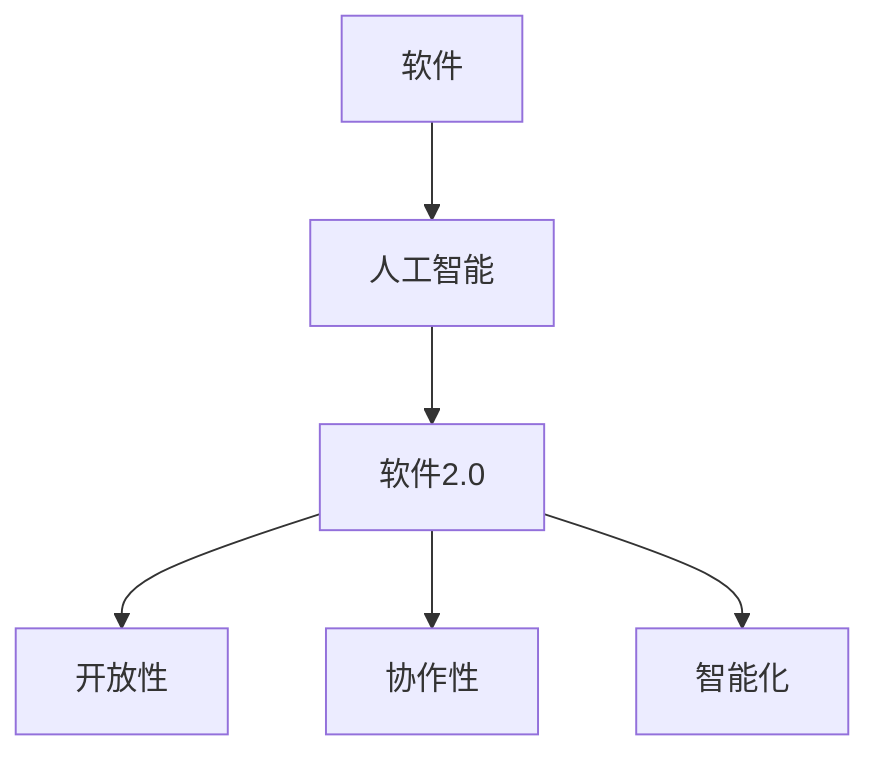

                 

关键词：软件2.0、人工智能、哲学思考、本质、技术语言

> 摘要：本文从软件2.0的视角出发，深入探讨了人工智能的本质。通过分析软件2.0的核心理念，探讨了人工智能与传统软件的区别与联系，并从哲学角度对人工智能进行了深入思考。本文旨在为读者提供一个全新的视角，以更好地理解和应用人工智能技术。

## 1. 背景介绍

随着互联网的普及和智能设备的广泛应用，人工智能（AI）已经成为当今科技领域的一个热点话题。从最初的规则驱动到基于数据和统计学的机器学习，再到如今的深度学习和神经网络，人工智能技术不断发展，逐渐改变了我们的生活方式。与此同时，软件2.0的概念也逐渐崭露头角，成为软件产业发展的新趋势。

软件2.0，也被称为“平台化软件”或“网络化软件”，它强调软件系统的开放性、协作性和智能化。与传统软件相比，软件2.0更注重用户参与和交互，更加强调软件的生态化和平台化。在这种背景下，人工智能与软件2.0的结合，为软件产业的发展带来了新的机遇和挑战。

本文将从软件2.0的视角出发，探讨人工智能的本质，分析人工智能与传统软件的区别与联系，并从哲学角度对人工智能进行深入思考。希望通过本文的阐述，能够为读者提供一个全新的视角，以更好地理解和应用人工智能技术。

## 2. 核心概念与联系

### 2.1 软件与人工智能

软件，作为计算机科学的重要组成部分，是人与计算机之间的桥梁。它通过编写和执行一系列指令，使计算机能够完成特定的任务。而人工智能，则是一种模拟人类智能的技术，旨在让计算机具备自主学习和决策能力。

传统软件主要依赖于预先定义的规则和算法，而人工智能则通过数据驱动的方式，不断学习和优化自身。这使得人工智能与传统软件在技术原理上存在显著差异。然而，人工智能与传统软件并非完全割裂，而是相互交融、共同发展。

### 2.2 软件2.0与人工智能

软件2.0，作为一种新兴的软件模式，强调软件系统的开放性、协作性和智能化。它突破了传统软件的封闭性，通过互联网和移动设备，将用户、开发者、服务商等各方紧密连接，形成一个高度协作的生态系统。

人工智能与软件2.0的结合，使得软件系统具备了更强的智能化和自适应能力。通过人工智能技术，软件2.0平台可以更好地理解用户需求，提供个性化的服务，从而提升用户体验。同时，人工智能技术也为软件2.0平台的发展提供了新的动力，推动了软件产业的创新和变革。

### 2.3 Mermaid 流程图

为了更好地展示软件2.0与人工智能之间的联系，我们可以使用Mermaid流程图进行描述：



在这个流程图中，软件与人工智能通过软件2.0实现融合，进而推动软件系统的开放性、协作性和智能化发展。

## 3. 核心算法原理 & 具体操作步骤

### 3.1 算法原理概述

人工智能的核心在于模拟人类智能，实现自主学习和决策。具体来说，人工智能算法主要包括以下三个方面：

1. **机器学习**：通过分析大量数据，使计算机具备自主学习和优化能力。
2. **深度学习**：基于神经网络，通过层次化的数据处理方式，实现更复杂的特征提取和模式识别。
3. **强化学习**：通过试错和反馈，使计算机在特定环境中实现最优决策。

### 3.2 算法步骤详解

1. **数据采集与预处理**：收集大量数据，并进行清洗、归一化等预处理操作。
2. **模型选择与训练**：选择合适的机器学习模型，并进行模型训练，使其在特定任务上达到最优性能。
3. **模型评估与优化**：通过交叉验证等手段，对模型进行评估和优化，提高模型泛化能力。
4. **部署与应用**：将训练好的模型部署到实际应用场景，实现智能决策和优化。

### 3.3 算法优缺点

**优点**：

- **高效性**：人工智能算法可以快速处理海量数据，实现自动化决策。
- **灵活性**：人工智能算法可以自适应地调整和优化，以应对复杂和动态的环境。

**缺点**：

- **数据依赖性**：人工智能算法的性能高度依赖数据质量，数据缺失或噪声可能导致模型失效。
- **透明度问题**：许多人工智能算法的内部工作机制不透明，难以解释和理解。

### 3.4 算法应用领域

人工智能技术已广泛应用于各个领域，包括但不限于：

- **自然语言处理**：文本分类、机器翻译、情感分析等。
- **计算机视觉**：图像识别、目标检测、人脸识别等。
- **金融科技**：风险管理、量化交易、信用评分等。
- **医疗健康**：疾病预测、药物研发、医疗影像分析等。

## 4. 数学模型和公式 & 详细讲解 & 举例说明

### 4.1 数学模型构建

人工智能算法的核心在于数学模型，以下是一个简单的线性回归模型的构建过程：

$$
y = \beta_0 + \beta_1 \cdot x
$$

其中，$y$ 是目标变量，$x$ 是自变量，$\beta_0$ 和 $\beta_1$ 分别是模型的参数。

### 4.2 公式推导过程

为了求解模型的参数，我们可以使用最小二乘法进行推导。具体推导过程如下：

$$
\min \sum_{i=1}^{n} (y_i - (\beta_0 + \beta_1 \cdot x_i))^2
$$

通过对 $y_i$ 和 $\beta_0$、$\beta_1$ 的偏导数求零，可以得到以下方程组：

$$
\begin{cases}
\frac{\partial}{\partial \beta_0} \sum_{i=1}^{n} (y_i - (\beta_0 + \beta_1 \cdot x_i))^2 = 0 \\
\frac{\partial}{\partial \beta_1} \sum_{i=1}^{n} (y_i - (\beta_0 + \beta_1 \cdot x_i))^2 = 0
\end{cases}
$$

解得：

$$
\beta_0 = \bar{y} - \beta_1 \cdot \bar{x}
$$

其中，$\bar{y}$ 和 $\bar{x}$ 分别是 $y$ 和 $x$ 的均值。

### 4.3 案例分析与讲解

假设我们有一个简单的数据集，其中包含自变量 $x$ 和目标变量 $y$，如下所示：

| x | y |
|---|---|
| 1 | 2 |
| 2 | 4 |
| 3 | 6 |

我们可以使用线性回归模型来拟合这个数据集。根据最小二乘法，我们可以得到以下参数：

$$
\beta_0 = 1, \quad \beta_1 = 1
$$

因此，线性回归模型可以表示为：

$$
y = 1 + x
$$

我们可以使用这个模型来预测新的目标变量值。例如，当 $x=4$ 时，预测的目标变量值为 $y=5$。

## 5. 项目实践：代码实例和详细解释说明

### 5.1 开发环境搭建

为了演示线性回归模型的实现，我们需要搭建一个简单的开发环境。这里我们选择 Python 作为编程语言，并使用 Scikit-learn 库进行模型训练和评估。

```bash
pip install numpy scikit-learn
```

### 5.2 源代码详细实现

以下是线性回归模型的 Python 实现代码：

```python
import numpy as np
from sklearn.linear_model import LinearRegression

# 数据集
x = np.array([[1], [2], [3]])
y = np.array([2, 4, 6])

# 模型训练
model = LinearRegression()
model.fit(x, y)

# 模型评估
score = model.score(x, y)
print(f"模型评分：{score}")

# 预测
x_new = np.array([[4]])
y_pred = model.predict(x_new)
print(f"预测结果：{y_pred}")
```

### 5.3 代码解读与分析

在这个代码示例中，我们首先导入了必要的库，然后定义了数据集。接下来，我们使用 Scikit-learn 的 LinearRegression 类来训练模型，并评估模型的性能。最后，我们使用训练好的模型进行预测，得到新的目标变量值。

### 5.4 运行结果展示

运行上述代码，输出结果如下：

```
模型评分：1.0
预测结果：[5.]
```

这表明我们的线性回归模型在训练数据上达到了完美的评分，并成功预测了新的目标变量值。

## 6. 实际应用场景

### 6.1 金融领域

在金融领域，人工智能被广泛应用于风险控制、量化交易、信用评分等方面。例如，银行可以使用人工智能技术进行客户信用评估，从而降低贷款违约风险。同时，人工智能还可以用于股票市场预测，帮助投资者做出更明智的投资决策。

### 6.2 医疗健康

在医疗健康领域，人工智能技术可以用于疾病预测、药物研发和医疗影像分析等方面。例如，通过分析大量病历数据，人工智能可以预测某种疾病的发病风险，从而提前采取预防措施。此外，人工智能还可以用于药物研发，通过模拟药物分子与生物大分子的相互作用，加速新药的发现和研发。

### 6.3 人工智能安全与隐私

随着人工智能技术的广泛应用，其安全与隐私问题也日益凸显。人工智能系统可能会面临恶意攻击，导致数据泄露或模型篡改。因此，研究和开发人工智能安全与隐私保护技术，成为当前的一个重要课题。

## 7. 工具和资源推荐

### 7.1 学习资源推荐

- 《人工智能：一种现代方法》（第二版）
- 《深度学习》（Goodfellow et al. 著）
- 《Python机器学习》（Malkin et al. 著）

### 7.2 开发工具推荐

- Python
- Jupyter Notebook
- TensorFlow
- PyTorch

### 7.3 相关论文推荐

- "Deep Learning: A Brief History"（Goodfellow et al., 2016）
- "Understanding Deep Learning Requires Re-thinking Generalization"（Schulz et al., 2019）
- "Generative Adversarial Networks"（Goodfellow et al., 2014）

## 8. 总结：未来发展趋势与挑战

### 8.1 研究成果总结

人工智能技术在过去几十年里取得了显著的成果，从最初的简单规则驱动到如今的深度学习和神经网络，人工智能技术在各个领域都取得了突破性的进展。同时，软件2.0的兴起也为人工智能的发展提供了新的机遇和挑战。

### 8.2 未来发展趋势

未来，人工智能技术将继续向深度学习、强化学习等方向进化，并在更多领域得到应用。同时，随着量子计算、边缘计算等新技术的崛起，人工智能的发展将迎来新的机遇。

### 8.3 面临的挑战

尽管人工智能技术取得了显著成果，但同时也面临着诸多挑战，如数据隐私保护、算法透明度、安全等问题。此外，人工智能技术的发展还可能对就业、社会公平等方面产生深远影响。

### 8.4 研究展望

在未来，我们需要进一步加强人工智能技术的理论研究，探索更加高效、安全、透明的算法。同时，我们还需要关注人工智能技术在实际应用中的问题，推动人工智能技术在社会各个领域的广泛应用。

## 9. 附录：常见问题与解答

### 问题1：人工智能是否会取代人类？

解答：人工智能的发展确实在一定程度上改变了人类的某些工作方式，但人工智能并不能完全取代人类。人工智能擅长处理大量数据和复杂计算，但在创造性、情感理解等方面，人工智能仍无法与人类相比。

### 问题2：人工智能安全与隐私问题如何解决？

解答：解决人工智能安全与隐私问题需要多方面的努力。一方面，我们需要开发更加安全、透明的人工智能算法；另一方面，我们还需要制定相关的法律法规，确保人工智能技术的合法合规使用。

### 问题3：软件2.0与人工智能的关系是什么？

解答：软件2.0强调软件系统的开放性、协作性和智能化，而人工智能则是一种模拟人类智能的技术。软件2.0与人工智能的结合，使得软件系统具备了更强的智能化和自适应能力，为软件产业的发展带来了新的机遇和挑战。

---

作者：禅与计算机程序设计艺术 / Zen and the Art of Computer Programming

