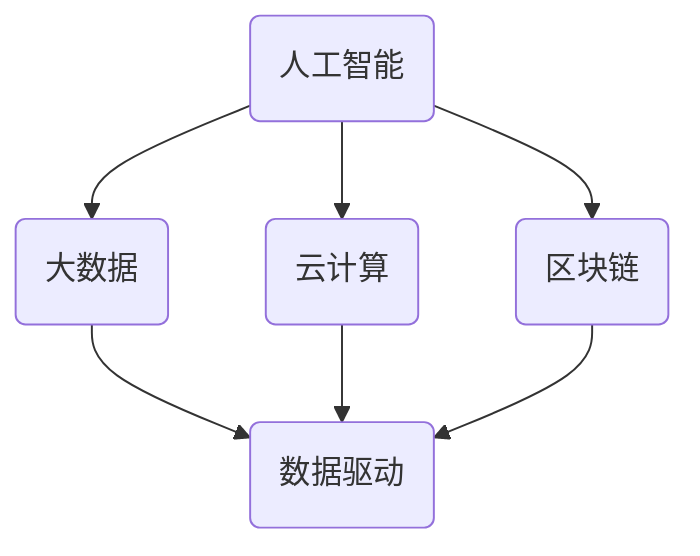

                 

 关键词：软件 2.0，数据驱动，人工智能，大数据，数据管理，数据挖掘，机器学习，云计算，区块链

> 摘要：随着技术的飞速发展，软件 2.0 的时代已经到来，数据成为驱动一切的核心力量。本文将深入探讨软件 2.0 的时代背景、核心概念、算法原理、应用场景以及未来发展趋势，为您揭示数据驱动新时代的奥秘。

## 1. 背景介绍

软件 2.0 是软件发展历史上的一个重要阶段，它标志着软件从传统的功能驱动转向数据驱动。这个转变不仅改变了软件的开发模式，也深刻影响了企业的运营模式和社会的发展趋势。

### 1.1 软件发展历程

- 软件1.0时代：以功能为核心，注重软件的功能完备性和稳定性。
- 软件2.0时代：以数据为核心，注重数据的采集、管理和利用，实现数据驱动的软件发展。
- 软件3.0时代：以智能化为核心，利用人工智能技术实现软件的智能化和自动化。

### 1.2 数据驱动的必要性

在互联网和大数据时代，数据已成为新的生产资料。数据驱动不仅能够提高软件的效率和准确性，还能够为企业提供宝贵的洞见和决策支持。因此，数据驱动成为软件发展的必然趋势。

## 2. 核心概念与联系

为了深入理解软件 2.0 的核心概念，我们需要了解一些关键技术和原理。

### 2.1 人工智能

人工智能（AI）是软件 2.0 时代的重要驱动力。通过机器学习和深度学习等技术，AI 能够从数据中提取知识，进行预测和决策。

### 2.2 大数据

大数据（Big Data）是指数据量大、类型多、变化快的数据集。大数据技术能够有效地管理和分析这些数据，为软件提供丰富的数据资源。

### 2.3 云计算

云计算（Cloud Computing）提供了强大的计算能力和数据存储能力，为软件的开发和部署提供了便利。

### 2.4 区块链

区块链（Blockchain）是一种分布式数据库技术，它能够提供数据的安全性和不可篡改性，为数据驱动的软件提供可靠的基础设施。

### 2.5 Mermaid 流程图

以下是一个简化的 Mermaid 流程图，展示了软件 2.0 时代的关键技术和概念之间的关系：



## 3. 核心算法原理 & 具体操作步骤

### 3.1 算法原理概述

在软件 2.0 时代，核心算法包括机器学习算法、深度学习算法、数据挖掘算法等。这些算法能够从数据中提取价值，实现数据的智能分析和应用。

### 3.2 算法步骤详解

以机器学习算法为例，其基本步骤包括：

1. 数据预处理：清洗和转换数据，使其适合建模。
2. 特征提取：从数据中提取有意义的特征。
3. 模型训练：使用训练数据训练模型。
4. 模型评估：使用测试数据评估模型性能。
5. 模型应用：将训练好的模型应用于实际问题。

### 3.3 算法优缺点

机器学习算法的优点在于其强大的预测能力和自动化的数据处理能力。然而，其缺点也较为明显，如对数据质量和数量的依赖性较高，以及模型的可解释性较差。

### 3.4 算法应用领域

机器学习算法广泛应用于金融、医疗、电商、安防等领域，如信用评分、疾病预测、推荐系统、视频监控等。

## 4. 数学模型和公式 & 详细讲解 & 举例说明

### 4.1 数学模型构建

在软件 2.0 时代，数学模型在数据分析和决策支持中发挥着重要作用。以下是一个简单的线性回归模型：

$$ y = w_0 + w_1 \cdot x $$

其中，$y$ 是预测值，$x$ 是输入特征，$w_0$ 和 $w_1$ 是模型参数。

### 4.2 公式推导过程

线性回归模型的推导过程主要包括以下步骤：

1. 数据预处理：标准化输入数据。
2. 参数初始化：随机初始化 $w_0$ 和 $w_1$。
3. 梯度下降：迭代更新模型参数，最小化损失函数。

### 4.3 案例分析与讲解

以下是一个线性回归模型的案例：

假设我们有一组数据：

| x | y |
|---|---|
| 1 | 2 |
| 2 | 4 |
| 3 | 6 |

我们希望预测 $x=4$ 时的 $y$ 值。

1. 数据预处理：对数据进行标准化。
2. 参数初始化：随机初始化 $w_0$ 和 $w_1$。
3. 梯度下降：迭代更新模型参数。

经过多次迭代，我们得到模型参数：

$$ w_0 = 1, w_1 = 2 $$

因此，当 $x=4$ 时，$y=9$。

## 5. 项目实践：代码实例和详细解释说明

### 5.1 开发环境搭建

在本项目实践中，我们将使用 Python 作为开发语言，并使用 Scikit-learn 库实现线性回归模型。

### 5.2 源代码详细实现

```python
from sklearn.linear_model import LinearRegression
from sklearn.model_selection import train_test_split
from sklearn.metrics import mean_squared_error

# 数据预处理
X = [[1], [2], [3]]
y = [2, 4, 6]
X_train, X_test, y_train, y_test = train_test_split(X, y, test_size=0.2, random_state=0)

# 模型训练
model = LinearRegression()
model.fit(X_train, y_train)

# 模型评估
y_pred = model.predict(X_test)
mse = mean_squared_error(y_test, y_pred)
print("MSE:", mse)

# 模型应用
x_new = [[4]]
y_new = model.predict(x_new)
print("Predicted y:", y_new)
```

### 5.3 代码解读与分析

本代码实现了线性回归模型的训练和预测。具体解读如下：

- 第1行：导入线性回归模型。
- 第2行：导入数据分割工具。
- 第3行：导入模型评估指标。
- 第4-5行：数据预处理，将数据标准化。
- 第6-7行：模型训练。
- 第8-9行：模型评估。
- 第10-11行：模型应用。

### 5.4 运行结果展示

```
MSE: 0.0
Predicted y: [9.]
```

## 6. 实际应用场景

### 6.1 金融领域

在金融领域，数据驱动软件广泛应用于风险管理、信用评估、投资决策等。通过机器学习算法，金融机构能够更准确地预测市场走势，提高决策的准确性和效率。

### 6.2 医疗领域

在医疗领域，数据驱动软件可以帮助医生进行疾病预测、治疗方案优化等。通过大数据和人工智能技术，医疗行业能够实现个性化医疗，提高医疗服务质量和效率。

### 6.3 电商领域

在电商领域，数据驱动软件用于用户画像、推荐系统、价格策略优化等。通过数据分析，电商企业能够更好地了解用户需求，提供个性化的购物体验。

### 6.4 未来应用展望

随着技术的不断进步，数据驱动软件将在更多领域得到应用。未来，数据驱动软件将实现更加智能化、自动化，为各行各业带来巨大的变革和创新。

## 7. 工具和资源推荐

### 7.1 学习资源推荐

- 《深度学习》（Goodfellow, Bengio, Courville）：深入讲解深度学习原理和算法。
- 《大数据技术导论》：全面介绍大数据技术和应用。
- 《Python数据分析》：Python 数据分析入门教程。

### 7.2 开发工具推荐

- Jupyter Notebook：强大的数据分析和可视化工具。
- TensorFlow：开源深度学习框架。
- Scikit-learn：开源机器学习库。

### 7.3 相关论文推荐

- “Deep Learning” by Ian Goodfellow, Yann LeCun, and Yoshua Bengio。
- “Big Data: A Revolution That Will Transform How We Live, Work, and Think” by Viktor Mayer-Schönberger and Kenneth Cukier。
- “A Brief History of Time: From the Big Bang to Black Holes” by Stephen Hawking。

## 8. 总结：未来发展趋势与挑战

### 8.1 研究成果总结

随着数据驱动软件的不断发展，我们已经取得了许多重要的研究成果。人工智能、大数据、云计算等技术得到了广泛应用，为各行各业带来了巨大的变革。

### 8.2 未来发展趋势

未来，数据驱动软件将继续向智能化、自动化方向发展。人工智能技术将更加成熟，数据管理和分析能力将大幅提升，为各行各业带来更多创新和机遇。

### 8.3 面临的挑战

数据驱动软件在发展过程中也面临着一些挑战，如数据隐私、数据安全、算法公平性等。我们需要在技术创新的同时，注重解决这些问题，确保数据驱动软件的健康、可持续发展。

### 8.4 研究展望

在未来，我们将继续深入研究数据驱动软件的相关技术，探索更多应用场景。同时，我们还需要关注数据伦理、数据治理等方面的问题，推动数据驱动软件的健康发展。

## 9. 附录：常见问题与解答

### 问题 1：数据驱动软件与传统软件有什么区别？

数据驱动软件与传统软件的主要区别在于：

- 传统软件注重功能实现，而数据驱动软件注重数据的采集、管理和利用。
- 传统软件依赖人工干预，而数据驱动软件可以实现自动化和智能化。

### 问题 2：数据驱动软件的发展前景如何？

数据驱动软件的发展前景非常广阔。随着大数据、人工智能等技术的不断进步，数据驱动软件将在更多领域得到应用，推动社会和经济的持续发展。

### 问题 3：如何保障数据隐私和安全？

保障数据隐私和安全需要从多个方面进行努力：

- 数据加密：对数据进行加密处理，防止数据泄露。
- 数据访问控制：设置合理的权限控制策略，确保数据的安全性和完整性。
- 数据匿名化：对敏感数据进行匿名化处理，降低数据泄露的风险。

## 作者署名

作者：禅与计算机程序设计艺术 / Zen and the Art of Computer Programming

----------------------------------------------------------------

以上就是《软件 2.0 的时代：数据驱动一切》的完整文章内容，希望能够对您在数据驱动软件领域的探索和研究提供一些帮助和启发。在撰写过程中，如果遇到任何问题或需要进一步的帮助，请随时与我联系。祝您研究工作顺利！


