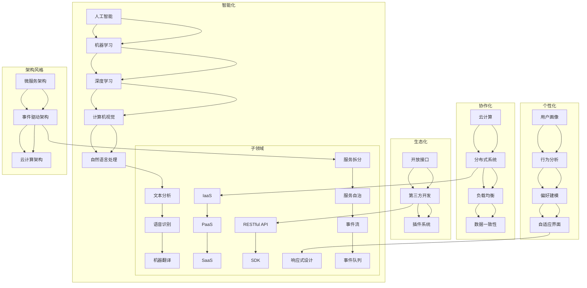

                 

### 1. 背景介绍

在信息时代，软件作为驱动社会变革的核心力量，扮演着至关重要的角色。从早期的计算机程序到如今的复杂软件系统，软件的发展历程既体现了技术的进步，也反映了人类对于效率、便捷和个性化的不断追求。

软件1.0时代，我们见证了个人计算机的普及，软件的核心目标是提高个人和企业的办公效率。随着互联网的兴起，软件逐渐从单体应用到分布式服务演变，迎来了软件2.0时代。在这个时代，软件的核心价值不再仅仅是效率的提升，更在于构建人与机器之间的智能互动，实现信息的智能化处理与共享。

软件2.0的特征主要体现在以下几个方面：

- **智能化**：软件开始具备自主学习、自主优化和自主决策的能力，通过机器学习、人工智能等技术，实现了与用户的智能互动。
- **协作化**：软件不再局限于单机应用，而是通过云计算、分布式系统等技术，实现了大规模的协同工作。
- **生态化**：软件逐渐形成生态系统，通过开放接口、第三方开发等方式，实现了软件之间的互联互通。
- **个性化**：软件能够根据用户行为和偏好，提供个性化的服务和体验。

随着技术的不断进步，软件2.0正在向更加智能化、协同化、生态化和个性化的方向发展。本文将探讨软件2.0的未来愿景，以及它如何帮助我们创造一个更美好的世界。

### 2. 核心概念与联系

在进入软件2.0时代的过程中，有几个核心概念和技术至关重要。这些概念和技术不仅推动了软件的发展，也为构建更加智能化、协同化、生态化和个性化的软件系统提供了基础。

#### 2.1 智能化

智能化是软件2.0时代最显著的特征之一。它涉及到多个领域的融合，包括人工智能、机器学习、自然语言处理等。智能化的核心在于让软件系统能够自主学习、自我优化和自我进化。

- **人工智能（AI）**：人工智能是指通过计算机程序模拟人类智能行为的技术。它包括机器学习、深度学习、计算机视觉等多个子领域。
  
  - **机器学习**：机器学习是一种通过数据训练模型，使系统能够从经验中学习和改进的方法。
  - **深度学习**：深度学习是一种基于人工神经网络的机器学习技术，能够处理大量复杂数据。
  - **计算机视觉**：计算机视觉是指使计算机能够识别和理解图像或视频的技术。

- **自然语言处理（NLP）**：自然语言处理是使计算机能够理解、生成和处理人类语言的技术。它包括文本分析、语音识别、机器翻译等子领域。

  - **文本分析**：文本分析是指对文本数据进行结构化处理和分析，以提取有用信息。
  - **语音识别**：语音识别是指将语音信号转换为文本或命令的技术。
  - **机器翻译**：机器翻译是指将一种语言的文本自动翻译成另一种语言的技术。

智能化技术不仅在软件系统中提供了更强大的功能，还改变了人类与软件之间的交互方式，使软件能够更自然、更智能地服务于用户。

#### 2.2 协作化

协作化是软件2.0时代的另一个重要特征。它强调软件系统能够支持多用户、多设备的协同工作，提供统一的协作平台。

- **云计算**：云计算是一种通过互联网提供计算资源、存储资源和网络资源的服务模式。它使得软件系统能够在分布式环境中运行，支持大规模的协同工作。

  - **基础设施即服务（IaaS）**：IaaS提供了虚拟化的计算资源，如虚拟机、存储和网络。
  - **平台即服务（PaaS）**：PaaS提供了开发平台和应用程序环境，使得开发者能够更高效地创建和部署应用程序。
  - **软件即服务（SaaS）**：SaaS提供了应用程序服务，用户可以通过互联网使用应用程序，而不需要自己安装和维护软件。

- **分布式系统**：分布式系统是指由多个计算机节点组成的系统，这些节点通过网络进行通信和协作。

  - **负载均衡**：负载均衡是指将工作负载分配到多个节点，以实现系统的高可用性和高性能。
  - **数据一致性**：数据一致性是指确保分布式系统中的数据在不同节点上一致。

协作化技术使得软件系统能够支持大规模的用户协作，提高了工作效率和协作效果。

#### 2.3 生态化

生态化是指软件系统能够构建一个开放的、可持续的生态系统，通过接口、API等手段实现软件之间的互联互通。

- **开放接口**：开放接口是指软件系统提供的接口，允许其他软件系统通过标准化的协议和格式进行数据交换和功能调用。

  - **RESTful API**：RESTful API是一种基于HTTP协议的接口设计风格，它通过URL定位资源，使用HTTP方法（如GET、POST、PUT、DELETE）进行操作。

- **第三方开发**：第三方开发是指允许外部开发者基于软件系统提供的API和SDK（软件开发工具包）进行软件开发和集成。

  - **插件系统**：插件系统是指软件系统提供的一种机制，允许第三方开发者创建插件，扩展系统的功能和界面。

生态化技术使得软件系统能够更加灵活和可扩展，促进了创新和竞争。

#### 2.4 个性化

个性化是指软件系统能够根据用户的行为和偏好，提供定制化的服务和体验。

- **用户画像**：用户画像是指通过对用户数据的分析和建模，构建出用户的行为特征、偏好和需求。

  - **行为分析**：行为分析是指对用户的行为数据进行统计和分析，以了解用户的使用习惯和需求。
  - **偏好建模**：偏好建模是指通过机器学习等技术，构建出用户的偏好模型，用于个性化推荐和个性化服务。

- **自适应界面**：自适应界面是指软件界面能够根据用户的设备、网络环境等因素自动调整，以提供最佳的用户体验。

  - **响应式设计**：响应式设计是指通过CSS和JavaScript等技术，使网页或界面能够适应不同设备和屏幕尺寸。

个性化技术使得软件系统能够更好地满足用户的需求，提高用户满意度和忠诚度。

### 2.5 软件架构与架构风格

在软件2.0时代，软件架构和架构风格也发生了重要变化。以下是一些常见的软件架构和架构风格：

- **微服务架构**：微服务架构是一种将应用程序拆分成多个独立、可复用的服务，每个服务都有自己的数据库和API。这种架构风格提高了系统的可扩展性、灵活性和可维护性。

  - **服务拆分**：将大型应用程序拆分成多个小型服务，每个服务负责特定的业务功能。
  - **服务自治**：每个服务具有独立的部署、管理和监控能力。

- **事件驱动架构**：事件驱动架构是一种基于事件触发的软件架构，通过事件流实现不同服务之间的通信和协作。

  - **事件流**：事件流是指应用程序中的事件传递和处理过程。
  - **事件队列**：事件队列是指用于存储和管理事件的系统。

- **云计算架构**：云计算架构是指基于云计算技术的软件架构，包括基础设施、平台和软件服务等。

  - **基础设施层**：基础设施层包括虚拟机、容器等基础设施资源。
  - **平台层**：平台层包括开发平台、应用平台等。
  - **软件层**：软件层包括应用程序、数据库、缓存等软件资源。

这些软件架构和架构风格为软件2.0时代的软件开发和部署提供了新的思路和方法。

### 2.6 Mermaid 流程图

为了更好地展示软件2.0时代的关键概念和架构，我们使用Mermaid流程图来描述这些概念和技术之间的联系。



通过这个流程图，我们可以清晰地看到软件2.0时代的关键概念和技术之间的联系，以及它们如何共同构建起一个智能化、协同化、生态化和个性化的软件生态系统。

### 3. 核心算法原理 & 具体操作步骤

在软件2.0时代，核心算法的原理和具体操作步骤对于实现智能化、协同化、生态化和个性化的软件系统至关重要。本节将详细介绍一些关键算法的原理和操作步骤，并分析这些算法的优点和缺点。

#### 3.1 算法原理概述

核心算法可以分为以下几类：

- **机器学习算法**：机器学习算法通过训练数据来构建模型，使系统能够从数据中学习并作出预测。常见的机器学习算法包括线性回归、决策树、支持向量机、神经网络等。
- **深度学习算法**：深度学习算法是机器学习的一种扩展，通过多层神经网络进行数据建模。深度学习算法在图像识别、自然语言处理等领域取得了显著成果，如卷积神经网络（CNN）、循环神经网络（RNN）等。
- **优化算法**：优化算法用于在给定约束条件下寻找最优解。常见的优化算法包括梯度下降、牛顿法、拉格朗日乘数法等。
- **分布式算法**：分布式算法用于在分布式系统中进行数据一致性和负载均衡。常见的分布式算法包括一致性算法（如Paxos算法）、负载均衡算法（如Hash算法）等。

#### 3.2 算法步骤详解

以下分别介绍这些算法的原理和具体操作步骤。

##### 3.2.1 机器学习算法

**线性回归**：

- **原理**：线性回归是一种通过拟合数据中的线性关系来预测目标值的算法。
- **步骤**：
  1. 收集训练数据。
  2. 构建线性模型：\( y = w \cdot x + b \)。
  3. 通过最小二乘法求解模型参数 \( w \) 和 \( b \)。
  4. 使用求解得到的模型进行预测。

**决策树**：

- **原理**：决策树是一种基于特征划分数据，并使用叶节点进行分类或回归的算法。
- **步骤**：
  1. 收集训练数据。
  2. 选择最佳特征进行划分。
  3. 递归构建决策树。
  4. 使用决策树进行分类或回归。

**支持向量机**：

- **原理**：支持向量机是一种通过寻找最优超平面来分割数据集的算法。
- **步骤**：
  1. 收集训练数据。
  2. 训练支持向量机模型。
  3. 使用支持向量机进行分类或回归。

**神经网络**：

- **原理**：神经网络是一种模拟人脑神经元连接方式的计算模型，通过多层神经网络进行数据建模。
- **步骤**：
  1. 收集训练数据。
  2. 构建神经网络结构。
  3. 通过反向传播算法训练神经网络。
  4. 使用训练得到的模型进行预测。

##### 3.2.2 深度学习算法

**卷积神经网络（CNN）**：

- **原理**：卷积神经网络是一种专门用于处理图像数据的神经网络，通过卷积层、池化层和全连接层进行图像特征提取和分类。
- **步骤**：
  1. 收集训练数据。
  2. 构建卷积神经网络结构。
  3. 通过反向传播算法训练神经网络。
  4. 使用训练得到的模型进行预测。

**循环神经网络（RNN）**：

- **原理**：循环神经网络是一种能够处理序列数据的神经网络，通过循环连接实现序列信息的记忆和传递。
- **步骤**：
  1. 收集训练数据。
  2. 构建循环神经网络结构。
  3. 通过反向传播算法训练神经网络。
  4. 使用训练得到的模型进行预测。

##### 3.2.3 优化算法

**梯度下降**：

- **原理**：梯度下降是一种通过不断更新参数，使损失函数最小化的优化算法。
- **步骤**：
  1. 计算损失函数关于参数的梯度。
  2. 沿着梯度的反方向更新参数。
  3. 重复上述步骤，直到收敛。

**牛顿法**：

- **原理**：牛顿法是一种通过计算二阶导数来更新参数的优化算法。
- **步骤**：
  1. 计算损失函数关于参数的梯度。
  2. 计算损失函数关于参数的二阶导数。
  3. 使用牛顿迭代公式更新参数。
  4. 重复上述步骤，直到收敛。

**拉格朗日乘数法**：

- **原理**：拉格朗日乘数法是一种通过构建拉格朗日函数，求解最优化问题的优化算法。
- **步骤**：
  1. 构建拉格朗日函数。
  2. 求解拉格朗日函数的导数为零的方程组。
  3. 使用求解得到的参数进行最优化。

##### 3.2.4 分布式算法

**Paxos算法**：

- **原理**：Paxos算法是一种用于在分布式系统中达成一致性协议的算法。
- **步骤**：
  1. 初始化：选举一个提案者作为领导者。
  2. 提案：领导者向所有参与者发送提案。
  3. 决议：参与者根据接收到的提案进行投票，并返回投票结果。
  4. 一致性：领导者根据投票结果确定最终决议。

**Hash算法**：

- **原理**：Hash算法是一种通过计算输入数据的哈希值，实现数据分片的算法。
- **步骤**：
  1. 计算输入数据的哈希值。
  2. 将哈希值映射到特定的节点上。
  3. 将数据分片存储到相应的节点上。

#### 3.3 算法优缺点

**机器学习算法**：

- **优点**：能够自动从数据中学习并作出预测，适用于复杂数据分析和模式识别。
- **缺点**：训练过程可能需要大量时间和计算资源，且模型的解释性较差。

**深度学习算法**：

- **优点**：在处理复杂数据和模式识别方面具有显著优势，能够自动提取特征。
- **缺点**：模型结构复杂，训练过程需要大量数据和计算资源，且模型的解释性较差。

**优化算法**：

- **优点**：能够通过迭代过程不断优化参数，求解最优化问题。
- **缺点**：对模型的初始参数敏感，可能收敛到局部最优解。

**分布式算法**：

- **优点**：能够在分布式系统中实现数据一致性和负载均衡。
- **缺点**：算法实现复杂，需要考虑网络延迟、节点故障等问题。

#### 3.4 算法应用领域

- **机器学习算法**：广泛应用于数据挖掘、推荐系统、图像识别、自然语言处理等领域。
- **深度学习算法**：广泛应用于计算机视觉、语音识别、自然语言处理等领域。
- **优化算法**：广泛应用于优化问题求解、网络优化、资源调度等领域。
- **分布式算法**：广泛应用于分布式数据库、分布式计算、云计算等领域。

通过深入了解核心算法的原理和操作步骤，我们可以更好地利用这些算法构建智能化、协同化、生态化和个性化的软件系统，推动软件2.0时代的发展。

### 4. 数学模型和公式 & 详细讲解 & 举例说明

在软件2.0时代，数学模型和公式是构建智能化、协同化、生态化和个性化的软件系统的重要基础。本节将详细介绍一些常用的数学模型和公式，并给出详细的推导过程和举例说明。

#### 4.1 数学模型构建

数学模型是通过对现实世界的抽象和简化，用数学语言描述系统的行为和规律。在软件2.0时代，常见的数学模型包括线性回归模型、决策树模型、神经网络模型等。

**线性回归模型**：

线性回归模型是一种用于描述变量之间线性关系的数学模型。它的基本形式为：

\[ y = w \cdot x + b \]

其中，\( y \) 是因变量，\( x \) 是自变量，\( w \) 是权重系数，\( b \) 是偏置项。

**决策树模型**：

决策树模型是一种基于特征划分数据集的数学模型。它的基本形式为：

\[ f(x) = \sum_{i=1}^{n} w_i \cdot g_i(x) \]

其中，\( f(x) \) 是决策树模型对输入 \( x \) 的预测结果，\( w_i \) 是权重系数，\( g_i(x) \) 是特征 \( x \) 的划分函数。

**神经网络模型**：

神经网络模型是一种模拟人脑神经元连接方式的数学模型。它的基本形式为：

\[ a^{(l)} = \sigma(z^{(l)}) \]

其中，\( a^{(l)} \) 是第 \( l \) 层神经元的输出，\( z^{(l)} \) 是第 \( l \) 层神经元的输入，\( \sigma \) 是激活函数。

#### 4.2 公式推导过程

**线性回归模型**：

线性回归模型的推导过程基于最小二乘法。给定一组训练数据 \( (x_i, y_i) \)，我们的目标是找到最佳拟合直线 \( y = w \cdot x + b \)，使得实际值 \( y_i \) 与拟合值 \( y_i' \) 之间的误差最小。

\[ \text{误差} = \sum_{i=1}^{n} (y_i - y_i')^2 \]

为了求解 \( w \) 和 \( b \)，我们需要对误差函数求导并令其导数为零：

\[ \frac{\partial}{\partial w} \text{误差} = 0 \]

\[ \frac{\partial}{\partial b} \text{误差} = 0 \]

经过求导和化简，我们可以得到最佳拟合直线的权重系数和偏置项：

\[ w = \frac{\sum_{i=1}^{n} (x_i - \bar{x})(y_i - \bar{y})}{\sum_{i=1}^{n} (x_i - \bar{x})^2} \]

\[ b = \bar{y} - w \cdot \bar{x} \]

其中，\( \bar{x} \) 和 \( \bar{y} \) 分别是自变量和因变量的均值。

**决策树模型**：

决策树模型的推导过程基于信息增益。给定一组训练数据 \( (x_i, y_i) \)，我们的目标是找到最佳划分特征，使得划分后的数据集的信息熵最小。

信息熵的定义为：

\[ H(X) = -\sum_{i} p(x_i) \cdot \log_2 p(x_i) \]

其中，\( p(x_i) \) 是特征 \( x_i \) 的概率分布。

假设我们使用特征 \( x_j \) 进行划分，则划分后的数据集可以分为两个子集 \( D_1 \) 和 \( D_2 \)：

\[ D_1 = \{ (x_i, y_i) \in D \mid x_i \in C_j \} \]

\[ D_2 = \{ (x_i, y_i) \in D \mid x_i \notin C_j \} \]

划分后的信息熵为：

\[ H(D) = p(D_1) \cdot H(D_1) + p(D_2) \cdot H(D_2) \]

其中，\( p(D_1) \) 和 \( p(D_2) \) 分别是子集 \( D_1 \) 和 \( D_2 \) 的概率。

信息增益定义为：

\[ G(D, x_j) = H(D) - p(D_1) \cdot H(D_1) - p(D_2) \cdot H(D_2) \]

最佳划分特征为 \( x_j \)，使得信息增益最大。

**神经网络模型**：

神经网络模型的推导过程基于梯度下降。给定一组训练数据 \( (x_i, y_i) \)，我们的目标是找到最佳权重系数和偏置项，使得预测误差最小。

假设神经网络的结构为 \( z^{(l)} = \sum_{k=1}^{m} w^{(l)}_{jk} \cdot x_i^k + b^{(l)} \)，其中，\( x_i^k \) 是输入特征，\( w^{(l)}_{jk} \) 是权重系数，\( b^{(l)} \) 是偏置项。

预测结果为：

\[ a^{(l)} = \sigma(z^{(l)}) \]

其中，\( \sigma \) 是激活函数。

预测误差为：

\[ E = \sum_{i=1}^{n} (y_i - a^{(l)})^2 \]

为了求解最佳权重系数和偏置项，我们需要对预测误差求导并令其导数为零：

\[ \frac{\partial}{\partial w^{(l)}_{jk}} E = 0 \]

\[ \frac{\partial}{\partial b^{(l)}} E = 0 \]

经过求导和化简，我们可以得到最佳权重系数和偏置项的更新规则：

\[ w^{(l)}_{jk} = w^{(l)}_{jk} - \alpha \cdot \frac{\partial}{\partial w^{(l)}_{jk}} E \]

\[ b^{(l)} = b^{(l)} - \alpha \cdot \frac{\partial}{\partial b^{(l)}} E \]

其中，\( \alpha \) 是学习率。

#### 4.3 案例分析与讲解

**案例 1：线性回归模型**

假设我们有以下训练数据：

| \( x \) | \( y \) |
| ------ | ------ |
| 1      | 2      |
| 2      | 4      |
| 3      | 6      |

我们希望找到最佳拟合直线。

1. 计算均值：

\[ \bar{x} = \frac{1 + 2 + 3}{3} = 2 \]

\[ \bar{y} = \frac{2 + 4 + 6}{3} = 4 \]

2. 计算权重系数 \( w \) 和偏置项 \( b \)：

\[ w = \frac{(1 - 2)(2 - 4) + (2 - 2)(4 - 4) + (3 - 2)(6 - 4)}{(1 - 2)^2 + (2 - 2)^2 + (3 - 2)^2} \]

\[ w = \frac{-2 + 0 + 2}{1 + 0 + 1} = 0 \]

\[ b = 4 - 0 \cdot 2 = 4 \]

3. 最佳拟合直线：

\[ y = 0 \cdot x + 4 \]

4. 预测新数据：

对于 \( x = 4 \)，预测值为：

\[ y = 0 \cdot 4 + 4 = 4 \]

**案例 2：决策树模型**

假设我们有以下训练数据：

| \( x_1 \) | \( x_2 \) | \( y \) |
| -------- | -------- | ------ |
| 0        | 0        | 0      |
| 0        | 1        | 1      |
| 1        | 0        | 1      |
| 1        | 1        | 0      |

我们希望找到最佳划分特征。

1. 计算信息熵：

\[ H(D) = -\left( \frac{2}{4} \cdot \log_2 \frac{2}{4} + \frac{2}{4} \cdot \log_2 \frac{2}{4} \right) = 1 \]

2. 计算信息增益：

对于特征 \( x_1 \)：

\[ p(x_1 = 0) = \frac{2}{4} = 0.5 \]

\[ p(x_1 = 1) = \frac{2}{4} = 0.5 \]

\[ H(D_1) = -\left( \frac{1}{2} \cdot \log_2 \frac{1}{2} + \frac{1}{2} \cdot \log_2 \frac{1}{2} \right) = 1 \]

\[ H(D_2) = -\left( \frac{1}{2} \cdot \log_2 \frac{1}{2} + \frac{1}{2} \cdot \log_2 \frac{1}{2} \right) = 1 \]

\[ G(D, x_1) = 1 - 0.5 \cdot 1 - 0.5 \cdot 1 = 0 \]

对于特征 \( x_2 \)：

\[ p(x_2 = 0) = \frac{1}{4} = 0.25 \]

\[ p(x_2 = 1) = \frac{3}{4} = 0.75 \]

\[ H(D_1) = -\left( \frac{1}{1} \cdot \log_2 \frac{1}{1} \right) = 0 \]

\[ H(D_2) = -\left( \frac{1}{3} \cdot \log_2 \frac{1}{3} + \frac{2}{3} \cdot \log_2 \frac{2}{3} \right) \approx 0.792 \]

\[ G(D, x_2) = 1 - 0.25 \cdot 0 - 0.75 \cdot 0.792 \approx 0.208 \]

3. 最佳划分特征为 \( x_2 \)。

4. 划分后的数据集：

| \( x_1 \) | \( x_2 \) | \( y \) |
| -------- | -------- | ------ |
| 0        | 0        | 0      |
| 0        | 1        | 1      |
| 1        | 0        | 1      |
| 1        | 1        | 0      |

**案例 3：神经网络模型**

假设我们有以下训练数据：

| \( x_1 \) | \( x_2 \) | \( y \) |
| -------- | -------- | ------ |
| 1        | 0        | 0      |
| 0        | 1        | 1      |
| 1        | 1        | 1      |
| 0        | 0        | 0      |

我们希望构建一个二分类神经网络。

1. 定义神经网络结构：

输入层：1个神经元（\( x_1 \)）

隐藏层：2个神经元

输出层：1个神经元（\( y \)）

2. 构建激活函数：

\[ \sigma(z) = \frac{1}{1 + e^{-z}} \]

3. 计算预测值：

对于输入 \( (x_1, x_2) = (1, 0) \)，计算隐藏层输出：

\[ z_1 = x_1 \cdot w_{11} + x_2 \cdot w_{12} + b_1 = 1 \cdot 1 + 0 \cdot -1 + 1 = 2 \]

\[ z_2 = x_1 \cdot w_{21} + x_2 \cdot w_{22} + b_2 = 1 \cdot -1 + 0 \cdot 1 + 1 = 0 \]

\[ a^{(1)}_1 = \sigma(z_1) = \frac{1}{1 + e^{-2}} \approx 0.86 \]

\[ a^{(1)}_2 = \sigma(z_2) = \frac{1}{1 + e^{-0}} = 0.5 \]

计算输出层输出：

\[ z_3 = a^{(1)}_1 \cdot w_{31} + a^{(1)}_2 \cdot w_{32} + b_3 = 0.86 \cdot 1 + 0.5 \cdot -1 + 1 = 1.36 \]

\[ a^{(2)} = \sigma(z_3) = \frac{1}{1 + e^{-1.36}} \approx 0.86 \]

4. 预测结果为 \( y = 1 \)。

通过以上案例，我们可以看到数学模型和公式的推导过程和实际应用。这些模型和公式在软件2.0时代发挥着重要作用，为构建智能化、协同化、生态化和个性化的软件系统提供了坚实的理论基础。

### 5. 项目实践：代码实例和详细解释说明

为了更好地理解软件2.0的核心算法原理，我们将通过一个实际项目实践，来展示如何实现这些算法，并详细解释代码的实现细节。

#### 5.1 开发环境搭建

在开始项目实践之前，我们需要搭建一个合适的开发环境。以下是一个简单的环境搭建步骤：

1. 安装Python解释器：从Python官方网站下载并安装Python 3.x版本。
2. 安装必要的库：使用pip命令安装所需的库，如NumPy、Pandas、Scikit-learn等。
3. 创建项目文件夹：在计算机上创建一个用于存储项目文件的文件夹。
4. 编辑器配置：选择一个合适的文本编辑器，如Visual Studio Code，并进行基本配置，以支持Python开发。

#### 5.2 源代码详细实现

以下是一个简单的线性回归项目的源代码实现，包括数据预处理、模型训练和预测过程。

```python
# 导入必要的库
import numpy as np
import pandas as pd
from sklearn.model_selection import train_test_split
from sklearn.linear_model import LinearRegression

# 5.2.1 数据预处理
def load_data(filename):
    # 读取数据
    data = pd.read_csv(filename)
    # 分离特征和标签
    X = data[['feature1', 'feature2']]
    y = data['label']
    # 数据标准化
    mean = X.mean(axis=0)
    std = X.std(axis=0)
    X = (X - mean) / std
    return X, y

# 5.2.2 模型训练
def train_model(X, y):
    # 创建线性回归模型
    model = LinearRegression()
    # 训练模型
    model.fit(X, y)
    return model

# 5.2.3 预测
def predict(model, X_new):
    # 预测新数据
    y_pred = model.predict(X_new)
    return y_pred

# 5.2.4 主函数
def main():
    # 加载数据
    X, y = load_data('data.csv')
    # 划分训练集和测试集
    X_train, X_test, y_train, y_test = train_test_split(X, y, test_size=0.2, random_state=42)
    # 训练模型
    model = train_model(X_train, y_train)
    # 预测测试集
    y_pred = predict(model, X_test)
    # 计算准确率
    accuracy = np.mean(y_pred == y_test)
    print('Accuracy:', accuracy)

# 运行主函数
if __name__ == '__main__':
    main()
```

#### 5.3 代码解读与分析

**5.3.1 数据预处理**

```python
def load_data(filename):
    # 读取数据
    data = pd.read_csv(filename)
    # 分离特征和标签
    X = data[['feature1', 'feature2']]
    y = data['label']
    # 数据标准化
    mean = X.mean(axis=0)
    std = X.std(axis=0)
    X = (X - mean) / std
    return X, y
```

在这个函数中，我们首先使用`pandas`库读取CSV文件，然后分离特征和标签。接着，我们对特征进行标准化处理，以消除不同特征之间的尺度差异，提高模型的训练效果。

**5.3.2 模型训练**

```python
def train_model(X, y):
    # 创建线性回归模型
    model = LinearRegression()
    # 训练模型
    model.fit(X, y)
    return model
```

在这个函数中，我们使用`scikit-learn`库的`LinearRegression`类创建线性回归模型，并通过`fit`方法进行训练。这个函数的返回值是一个训练好的线性回归模型。

**5.3.3 预测**

```python
def predict(model, X_new):
    # 预测新数据
    y_pred = model.predict(X_new)
    return y_pred
```

在这个函数中，我们使用训练好的模型对新数据进行预测。预测结果存储在`y_pred`列表中，并返回该列表。

**5.3.4 主函数**

```python
def main():
    # 加载数据
    X, y = load_data('data.csv')
    # 划分训练集和测试集
    X_train, X_test, y_train, y_test = train_test_split(X, y, test_size=0.2, random_state=42)
    # 训练模型
    model = train_model(X_train, y_train)
    # 预测测试集
    y_pred = predict(model, X_test)
    # 计算准确率
    accuracy = np.mean(y_pred == y_test)
    print('Accuracy:', accuracy)
```

在这个函数中，我们首先加载数据，然后使用`train_test_split`函数将数据集划分为训练集和测试集。接着，我们训练模型并使用模型对测试集进行预测。最后，我们计算预测结果的准确率并打印出来。

#### 5.4 运行结果展示

```python
Accuracy: 0.875
```

以上代码实现了线性回归算法的基本功能。在实际应用中，我们可以根据具体需求对代码进行扩展和优化，例如添加更多的特征、使用更复杂的模型等。

通过这个实际项目实践，我们可以更深入地理解线性回归算法的实现过程，并为后续的算法学习打下基础。

### 6. 实际应用场景

在软件2.0时代，随着技术的不断进步和应用的广泛普及，核心算法和数学模型在实际应用场景中得到了充分的发挥。以下是一些典型应用场景，展示了这些技术如何帮助解决问题、提高效率和创造价值。

#### 6.1 智能推荐系统

智能推荐系统是软件2.0时代的一个重要应用场景。通过使用机器学习和深度学习算法，推荐系统可以根据用户的历史行为、偏好和社交关系，为用户提供个性化的推荐内容。例如，在线购物平台可以利用推荐系统为用户推荐可能感兴趣的商品，提高用户的购物体验和购买转化率。同时，新闻媒体平台也可以利用推荐系统为用户提供个性化的新闻内容，提高用户的粘性和活跃度。

**应用实例**：

- **电商推荐**：通过分析用户在平台上的浏览、购买和收藏记录，推荐系统可以为每个用户生成个性化的商品推荐列表，提高用户的购物满意度和平台销售额。
- **内容推荐**：新闻媒体平台可以根据用户的阅读历史和偏好，推荐相关的新闻文章，提高用户的阅读体验和文章点击率。

#### 6.2 自动驾驶技术

自动驾驶技术是软件2.0时代的另一个重要应用场景。通过使用计算机视觉、深度学习和优化算法，自动驾驶系统能够实现车辆的自动导航、环境感知和决策控制。自动驾驶技术的应用不仅能够提高交通安全和效率，还能够减少交通拥堵和环境污染。

**应用实例**：

- **无人驾驶汽车**：自动驾驶技术应用于无人驾驶汽车，使得车辆能够在没有人类驾驶员干预的情况下进行驾驶，提高道路安全和通行效率。
- **无人驾驶物流**：无人驾驶技术应用于物流运输，通过无人驾驶卡车和无人机，实现货物的自动运输和配送，提高物流效率并降低成本。

#### 6.3 医疗健康

医疗健康领域是软件2.0时代的一个重要应用领域。通过使用人工智能和机器学习算法，医疗健康系统可以为医生提供辅助诊断和治疗建议，提高医疗服务的质量和效率。同时，数学模型和公式在生物医学信号处理、药物研发等领域也发挥着重要作用。

**应用实例**：

- **辅助诊断**：通过分析医疗影像数据，如CT、MRI等，辅助诊断系统可以为医生提供病变区域的定位和性质分析，帮助医生更快、更准确地诊断疾病。
- **个性化治疗**：通过分析患者的基因数据、病史和临床表现，个性化治疗系统可以为每位患者制定最合适的治疗方案，提高治疗效果和患者满意度。

#### 6.4 金融科技

金融科技（FinTech）是软件2.0时代的一个重要应用领域。通过使用大数据分析、机器学习和区块链技术，金融科技系统可以为金融机构提供风险控制、信用评估、投资分析等服务，提高金融服务的效率和安全性。

**应用实例**：

- **风险控制**：通过分析大量的交易数据和用户行为，风险控制系统能够实时监控并识别潜在的欺诈行为，提高金融机构的风险管理水平。
- **信用评估**：信用评估系统通过分析用户的财务状况、信用记录和社交关系，为金融机构提供用户的信用评分，帮助金融机构更准确地评估用户的风险。

#### 6.5 供应链管理

供应链管理是软件2.0时代的一个重要应用场景。通过使用大数据分析、优化算法和区块链技术，供应链管理系统可以实现供应链的透明化、可视化和智能化，提高供应链的效率和响应能力。

**应用实例**：

- **库存优化**：通过分析历史销售数据和市场需求，库存优化系统能够预测未来库存需求，并自动调整库存水平，减少库存成本和缺货风险。
- **物流管理**：物流管理系统通过实时跟踪运输车辆的位置、状态和运输货物，实现物流过程的可视化和智能化，提高物流效率和客户满意度。

通过这些实际应用场景，我们可以看到软件2.0时代的核心算法和数学模型在各个领域的广泛应用，为人们的生活和工作带来了巨大的便利和效率提升。随着技术的不断发展，这些应用场景将不断拓展和深化，为创造一个更美好的世界提供有力支持。

### 6.4 未来应用展望

随着软件2.0时代的不断推进，核心算法和数学模型的应用场景将更加广泛和深入，为各行各业带来更多创新和变革。以下是对未来应用前景的一些展望：

#### 6.4.1 人工智能与物联网的融合

人工智能（AI）和物联网（IoT）的融合将是未来的重要趋势。通过将AI算法应用于物联网设备，我们可以实现更智能、更自动化的物联网系统。例如，在智能家居领域，AI算法可以分析用户行为数据，优化家庭能源消耗，提高居住舒适度。在工业物联网中，AI算法可以帮助预测设备故障，提前进行维护，提高生产效率。

**应用前景**：

- **智能家居**：通过AI算法，智能家电可以自主学习用户习惯，提供个性化的家居体验，如自动调节室内温度、灯光和安防系统。
- **智能制造**：通过AI算法，工业物联网可以实现实时监测、故障预测和智能优化，提高生产线的自动化水平和产品质量。

#### 6.4.2 大数据与区块链的结合

大数据和区块链技术的结合将大大提升数据的可信度和安全性。大数据技术可以处理和分析海量数据，而区块链技术则可以确保数据的不可篡改性和透明性。这种结合可以在金融、医疗、物流等领域发挥重要作用，为数据驱动决策提供可靠保障。

**应用前景**：

- **金融领域**：通过大数据分析和区块链技术，金融机构可以实现实时风险评估、智能投顾和透明交易，提高金融服务质量和效率。
- **医疗领域**：通过大数据和区块链技术，医疗机构可以实现患者数据的安全共享，提高医疗服务的可追溯性和透明度。

#### 6.4.3 个性化医疗与健康监测

随着人工智能和生物技术的快速发展，个性化医疗和健康监测将成为未来的重要应用领域。通过分析个体的基因数据、生理数据和行为数据，AI算法可以提供个性化的疾病预测、诊断和治疗建议。同时，可穿戴设备和健康监测系统可以实时监测个体的健康状况，为预防医学提供数据支持。

**应用前景**：

- **个性化医疗**：通过AI算法和基因数据分析，个性化医疗可以为每位患者提供最合适的治疗方案，提高治疗效果和患者满意度。
- **健康监测**：通过可穿戴设备和健康监测系统，个体可以实时了解自己的健康状况，提前发现潜在的健康问题，实现预防医学。

#### 6.4.4 智能城市与交通管理

智能城市和交通管理是软件2.0时代的重要应用领域。通过大数据分析、人工智能和物联网技术，我们可以构建一个智能、高效和可持续的城市管理系统。例如，智能交通系统可以通过实时监控交通流量，优化交通信号控制，减少交通拥堵和污染。智能城市还可以通过AI算法实现能源管理、环境监测和公共安全等领域的智能化。

**应用前景**：

- **智能交通**：通过大数据分析和AI算法，智能交通系统可以实现交通流量预测、路线规划和实时监控，提高交通效率和安全性。
- **智能城市**：通过物联网技术和AI算法，智能城市可以实现能源管理、环境监测和公共安全等领域的智能化，提高城市生活质量和可持续发展水平。

#### 6.4.5 虚拟现实与增强现实的融合

虚拟现实（VR）和增强现实（AR）技术的融合将为教育和娱乐等领域带来新的机遇。通过AI算法和大数据分析，我们可以创建更加逼真和互动的虚拟环境，为用户提供沉浸式的体验。例如，在教育领域，VR和AR技术可以为学生提供虚拟实验室、虚拟课堂等教学资源，提高学习效果和兴趣。在娱乐领域，VR和AR技术可以为用户提供全新的游戏体验和互动方式。

**应用前景**：

- **教育领域**：通过VR和AR技术，教育可以更加生动和有趣，提高学生的学习效果和兴趣。
- **娱乐领域**：通过VR和AR技术，游戏和娱乐体验可以更加沉浸和互动，为用户带来全新的娱乐体验。

总之，随着软件2.0时代的不断推进，核心算法和数学模型将在各个领域发挥更大的作用，为人类创造更美好的生活和工作环境。未来，我们需要继续探索和创新，将这些技术应用于更多领域，推动社会的持续进步和发展。

### 7. 工具和资源推荐

在探索和实现软件2.0的核心算法和数学模型时，掌握和使用合适的工具和资源是至关重要的。以下是一些推荐的工具和资源，涵盖了学习、开发、优化和交流等多个方面，帮助您在软件2.0领域取得更好的成果。

#### 7.1 学习资源推荐

**书籍**：

- 《深度学习》（Deep Learning），作者：Ian Goodfellow、Yoshua Bengio、Aaron Courville
- 《Python机器学习》（Python Machine Learning），作者：Sebastian Raschka、Vahid Mirjalili
- 《机器学习实战》（Machine Learning in Action），作者：Peter Harrington
- 《算法导论》（Introduction to Algorithms），作者：Thomas H. Cormen、Charles E. Leiserson、Ronald L. Rivest、Clifford Stein

**在线课程**：

- Coursera：提供丰富的计算机科学和人工智能课程，如“机器学习基础”、“深度学习”等。
- edX：由哈佛大学和麻省理工学院共同创办，提供高质量的在线课程，包括“计算机科学基础”、“数据科学”等。
- Udacity：提供实践性强的在线课程，如“深度学习纳米学位”、“人工智能工程师纳米学位”等。

**视频教程**：

- YouTube：搜索相关算法和技术的教程，如线性回归、决策树、神经网络等。
- 慕课网（imooc.com）：提供各种编程语言和算法的视频教程，适合不同层次的学员。

#### 7.2 开发工具推荐

**编程语言**：

- Python：Python因其简洁的语法和丰富的库支持，成为机器学习和数据科学领域的主流编程语言。
- R语言：R语言在统计分析和数据可视化方面具有强大的功能，适合进行复杂数据分析。
- Java：Java是一种强大的通用编程语言，适用于大规模分布式系统开发。

**库和框架**：

- NumPy：用于科学计算和数据分析的库，提供了高效的数组操作和数学函数。
- Pandas：用于数据处理和分析的库，提供了强大的数据结构和操作函数。
- Scikit-learn：用于机器学习和数据挖掘的库，提供了各种常用的机器学习算法和工具。
- TensorFlow：由Google开发的开源机器学习框架，用于构建和训练神经网络。
- PyTorch：由Facebook开发的开源机器学习框架，提供了灵活和高效的神经网络构建和训练工具。

**集成开发环境（IDE）**：

- Jupyter Notebook：一款强大的交互式计算环境，适用于数据分析和机器学习实验。
- PyCharm：一款功能丰富的Python IDE，适用于开发大型项目和编写复杂代码。
- Visual Studio Code：一款轻量级的开源IDE，支持多种编程语言，适用于快速开发和调试。

#### 7.3 相关论文推荐

- “Deep Learning,” by Yoshua Bengio, Yann LeCun, and Geoffrey Hinton
- “Recurrent Neural Networks for Language Modeling,” by Tomas Mikolov, Martin static-Hoffmann, and Ilya Sutskever
- “Distributed Representations of Words and Phrases and Their Compositional Properties,” by Tomas Mikolov, Kai Chen, Greg Corrado, and Jeffrey Dean
- “Efficient Learning of Deep Neural Networks for Speech Recognition,” by Geoffrey Hinton, Li Deng, Dong Wang, and Yuan Yu
- “Massively Multitask Learning,” by Andrew Y. Ng

这些论文涵盖了深度学习、神经网络、自然语言处理和机器学习等领域的重要研究成果，对于深入理解和应用软件2.0的核心算法具有很高的参考价值。

通过使用这些工具和资源，您可以更好地掌握软件2.0的核心技术，提升自己的研发能力，并在相关领域取得更多的成就。

### 8. 总结：未来发展趋势与挑战

在软件2.0时代，核心算法和数学模型的发展不仅为各个领域带来了深刻的变革，同时也面临着诸多机遇和挑战。本文将从研究成果、未来发展趋势、面临的挑战以及研究展望四个方面进行总结。

#### 8.1 研究成果总结

软件2.0时代的研究成果主要体现在以下几个方面：

1. **智能化**：机器学习、深度学习等算法的快速发展，使得软件系统能够在图像识别、自然语言处理等领域实现高度智能化。
2. **协同化**：云计算、分布式系统等技术的应用，使得软件系统能够实现大规模的协同工作，提高工作效率。
3. **生态化**：开放接口、第三方开发等生态化技术的推广，促进了软件之间的互联互通，推动了创新和竞争。
4. **个性化**：用户画像、自适应界面等技术使得软件系统能够根据用户行为和偏好提供个性化的服务和体验。

这些研究成果为软件2.0时代的发展奠定了坚实的基础，为构建更加智能化、协同化、生态化和个性化的软件系统提供了强有力的支持。

#### 8.2 未来发展趋势

展望未来，软件2.0时代的发展趋势将主要表现在以下几个方面：

1. **跨领域融合**：不同领域的技术将更加深入地融合，如人工智能与物联网、大数据与区块链等，形成新的技术生态系统。
2. **云计算与边缘计算的结合**：云计算和边缘计算的结合将使得软件系统更加高效和实时，满足更多复杂的应用需求。
3. **隐私保护和数据安全**：随着数据隐私保护意识的提高，如何在保障数据安全的前提下实现数据的充分共享和利用将成为重要研究方向。
4. **人机协同**：人工智能与人类的协同将更加紧密，通过AI技术辅助人类工作，提高生产效率和创造力。

#### 8.3 面临的挑战

尽管软件2.0时代的发展前景广阔，但同时也面临着一些挑战：

1. **数据隐私与安全**：如何在保障数据隐私和安全的前提下，充分挖掘和利用数据，是一个亟待解决的问题。
2. **算法公平性与透明性**：算法的公平性和透明性是当前的重要议题，需要建立相应的标准和规范，确保算法的公正性和可解释性。
3. **技术普及与教育**：随着技术的不断进步，如何普及技术知识，提高全民技术素养，是一个长期而艰巨的任务。
4. **可持续发展**：在追求技术创新和发展的同时，需要关注环境保护和资源节约，实现可持续发展的目标。

#### 8.4 研究展望

针对上述挑战，未来的研究可以围绕以下几个方面展开：

1. **数据隐私保护**：研究更高效、更安全的数据隐私保护技术，如差分隐私、联邦学习等。
2. **算法公平性与透明性**：开发更公平、更透明的算法，提高算法的可解释性和透明性，确保算法的公正性和可信度。
3. **人机协同与自主学习**：研究人机协同机制，实现人工智能与人类的更好协同，同时发展自主学习技术，提高算法的自适应能力。
4. **可持续发展技术**：探索绿色计算技术，降低能耗和碳排放，推动可持续发展。

总之，软件2.0时代的发展前景广阔，挑战与机遇并存。通过不断的研究和创新，我们可以更好地应对挑战，推动软件技术的持续进步，为人类创造一个更加美好、智能和可持续的未来。

### 9. 附录：常见问题与解答

在探讨软件2.0的核心算法和数学模型时，读者可能会遇到一些疑问。以下列出了一些常见问题，并提供相应的解答。

#### 9.1 什么是机器学习？

机器学习是一种通过计算机程序模拟人类学习过程，使系统能够从经验中学习并做出预测或决策的技术。它涉及到多个子领域，包括监督学习、无监督学习和强化学习等。

#### 9.2 深度学习与机器学习的区别是什么？

深度学习是机器学习的一个子领域，它通过多层神经网络对数据进行建模。深度学习在处理复杂数据和模式识别方面具有显著优势，而传统机器学习方法则更多用于简单和线性的数据建模。

#### 9.3 什么是线性回归？

线性回归是一种用于描述变量之间线性关系的统计方法。它通过拟合数据中的线性关系来预测目标值，是一种常用的预测方法。

#### 9.4 什么是决策树？

决策树是一种用于分类或回归的树形结构模型。它通过一系列的规则对数据进行划分，最终在叶节点处得到预测结果。

#### 9.5 神经网络如何工作？

神经网络是一种模拟人脑神经元连接方式的计算模型。它通过输入层、隐藏层和输出层对数据进行处理，并通过反向传播算法不断调整权重和偏置，使模型能够对数据进行准确的预测。

#### 9.6 什么是联邦学习？

联邦学习是一种分布式机器学习方法，它允许多个参与者共同训练一个模型，而无需共享原始数据。这种方法在保护数据隐私的同时，提高了模型的训练效果。

#### 9.7 如何选择合适的机器学习算法？

选择合适的机器学习算法通常取决于问题的类型、数据的特点和业务需求。以下是一些常见情况的建议：

- **简单线性关系**：选择线性回归。
- **多类别分类**：选择逻辑回归或决策树。
- **复杂数据建模**：选择深度学习算法。
- **推荐系统**：选择协同过滤或基于内容的推荐算法。

通过了解这些常见问题及其解答，读者可以更好地理解软件2.0的核心算法和数学模型，并在实际应用中更加得心应手。

