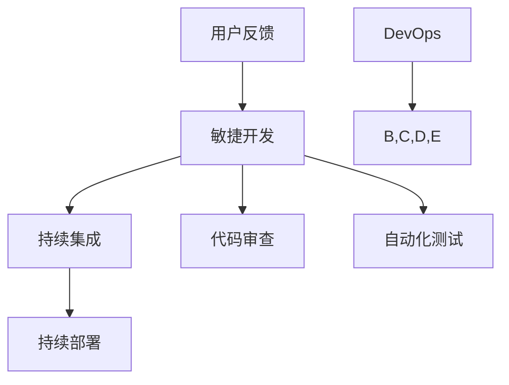

                 

关键词：软件2.0，发布管理，敏捷开发，持续集成，持续部署，代码审查，自动化测试，DevOps

> 摘要：本文将深入探讨软件2.0时代的发布管理流程，从核心概念、算法原理、数学模型、项目实践等多个角度全面解析发布管理的各个方面。通过本文，读者将了解如何构建高效、可靠的发布流程，提升软件交付的质量和速度。

## 1. 背景介绍

随着互联网和云计算的迅猛发展，软件行业的形态发生了深刻的变化。软件2.0时代，软件不再是单机版的程序，而是以服务形式存在的云服务，它们更加注重用户需求、快速迭代和持续优化。在这种背景下，传统的发布管理流程已经无法满足快速变化的市场需求，因此，软件2.0时代的发布管理流程应运而生。

软件2.0的发布管理流程强调敏捷开发、持续集成、持续部署等现代软件开发理念，旨在通过自动化、优化和协同合作，提高软件交付的效率和质量。

### 1.1 敏捷开发

敏捷开发是一种以人为核心、迭代、增量和协作的软件开发方法。在敏捷开发中，团队通过短周期的迭代来快速交付功能，并根据用户反馈不断调整和优化产品。

### 1.2 持续集成

持续集成是一种软件开发实践，通过持续地将代码集成到主干分支，快速发现和解决冲突，确保代码库的一致性和稳定性。

### 1.3 持续部署

持续部署是将代码从开发环境无缝地部署到生产环境的过程，通过自动化工具实现快速、可靠的应用部署。

## 2. 核心概念与联系

### 2.1 核心概念

#### 2.1.1 敏捷开发

敏捷开发的核心是用户需求，通过短周期的迭代实现快速交付。它强调团队合作、灵活应对变化和持续交付价值。

#### 2.1.2 持续集成

持续集成通过自动化构建和测试，确保代码库的一致性和稳定性，减少集成风险。

#### 2.1.3 持续部署

持续部署通过自动化工具实现快速、可靠的应用部署，提高交付效率。

### 2.2 联系

敏捷开发、持续集成和持续部署相互关联，共同构成了软件2.0的发布管理流程。敏捷开发确保了快速迭代和用户需求响应，持续集成保证了代码库的稳定性和一致性，持续部署实现了快速、可靠的应用部署。

### 2.3 Mermaid 流程图



## 3. 核心算法原理 & 具体操作步骤

### 3.1 算法原理概述

软件2.0的发布管理流程依赖于一系列核心算法，包括敏捷开发中的迭代算法、持续集成中的构建算法和持续部署中的部署算法。

#### 3.1.1 迭代算法

迭代算法的核心是短周期迭代，通过快速交付功能来满足用户需求。迭代过程中，团队根据用户反馈不断调整和优化产品。

#### 3.1.2 构建算法

构建算法用于自动化构建和测试代码库，确保代码库的一致性和稳定性。构建过程中，自动化工具会执行一系列测试，如单元测试、集成测试和性能测试。

#### 3.1.3 部署算法

部署算法用于自动化部署代码到生产环境。部署过程中，自动化工具会执行一系列操作，如环境准备、代码部署和测试。

### 3.2 算法步骤详解

#### 3.2.1 敏捷开发

1. 确定迭代周期（如2周）。
2. 收集用户需求。
3. 进行需求分析、设计和开发。
4. 进行代码审查和自动化测试。
5. 迭代交付功能。

#### 3.2.2 持续集成

1. 拉取最新代码。
2. 执行自动化构建。
3. 执行单元测试、集成测试和性能测试。
4. 记录测试结果。

#### 3.2.3 持续部署

1. 确定部署环境。
2. 执行环境准备。
3. 部署代码。
4. 执行测试。
5. 部署成功后通知相关人员。

### 3.3 算法优缺点

#### 3.3.1 敏捷开发

优点：快速响应用户需求，提高交付质量。

缺点：需要较强的团队协作和沟通能力。

#### 3.3.2 持续集成

优点：确保代码库的一致性和稳定性，减少集成风险。

缺点：构建和测试过程可能较慢。

#### 3.3.3 持续部署

优点：提高交付效率，降低人工干预。

缺点：部署过程中可能遇到意外问题。

### 3.4 算法应用领域

软件2.0的发布管理流程适用于各类互联网应用，如电商平台、社交媒体、云计算平台等。它能够有效提升软件交付的效率和质量。

## 4. 数学模型和公式 & 详细讲解 & 举例说明

### 4.1 数学模型构建

在软件2.0的发布管理流程中，我们可以构建以下数学模型：

$$
\text{发布效率} = f(\text{敏捷开发周期}, \text{持续集成构建时间}, \text{持续部署部署时间})
$$

### 4.2 公式推导过程

发布效率取决于敏捷开发周期、持续集成构建时间和持续部署部署时间。通过优化这三个因素，可以提升发布效率。

### 4.3 案例分析与讲解

假设一个项目采用2周迭代周期，持续集成构建时间为1天，持续部署部署时间为1小时。根据上述数学模型，发布效率为：

$$
\text{发布效率} = f(2 \text{周}, 1 \text{天}, 1 \text{小时}) = \text{一定值}
$$

通过缩短敏捷开发周期、持续集成构建时间和持续部署部署时间，可以提升发布效率。

## 5. 项目实践：代码实例和详细解释说明

### 5.1 开发环境搭建

在开始项目实践之前，需要搭建一个合适的开发环境。这里以Docker为例，介绍如何在Linux上搭建开发环境。

```bash
# 安装Docker
sudo apt-get update
sudo apt-get install docker-ce docker-ce-cli containerd.io

# 启动Docker服务
sudo systemctl start docker

# 验证Docker安装
docker --version
```

### 5.2 源代码详细实现

项目源代码包括前端、后端和数据库。以下是一个简单的示例：

```javascript
// 前端：index.html
<!DOCTYPE html>
<html lang="en">
<head>
    <meta charset="UTF-8">
    <title>Example Project</title>
</head>
<body>
    <h1>Hello, World!</h1>
    <script src="app.js"></script>
</body>
</html>

// 前端：app.js
console.log("Hello, World!");

// 后端：server.js
const express = require('express');
const app = express();

app.get('/', (req, res) => {
    res.send('<h1>Hello, World!</h1>');
});

app.listen(3000, () => {
    console.log('Server running on port 3000');
});
```

### 5.3 代码解读与分析

上述代码包括一个简单的HTML页面和一个Node.js后端服务器。通过这个示例，我们可以看到如何利用现代技术构建一个基本的Web应用。

### 5.4 运行结果展示

在Docker容器中运行上述代码，可以看到以下运行结果：

```bash
# 构建Docker镜像
docker build -t example-project .

# 运行Docker容器
docker run -d -p 8080:80 example-project

# 访问Web应用
open http://localhost:8080
```

在浏览器中访问`http://localhost:8080`，可以看到一个显示“Hello, World!”的HTML页面。

## 6. 实际应用场景

### 6.1 电商平台

在电商平台中，发布管理流程至关重要。通过敏捷开发、持续集成和持续部署，电商平台可以快速响应市场需求，不断提升用户体验。

### 6.2 社交媒体

社交媒体平台需要处理海量用户数据和复杂的功能需求。通过高效的发布管理流程，社交媒体平台可以实现快速迭代和持续优化。

### 6.3 云计算平台

云计算平台提供各种云服务，如计算、存储、网络等。通过发布管理流程，云计算平台可以确保服务的稳定性和可靠性。

## 7. 工具和资源推荐

### 7.1 学习资源推荐

- 《敏捷软件开发：实践者之路》
- 《持续集成：概念与应用》
- 《DevOps实践指南》

### 7.2 开发工具推荐

- Docker
- Jenkins
- GitLab

### 7.3 相关论文推荐

- 《敏捷开发：一个实践者的视角》
- 《持续集成：从理论到实践》
- 《DevOps：融合开发与运维》

## 8. 总结：未来发展趋势与挑战

### 8.1 研究成果总结

本文深入探讨了软件2.0时代的发布管理流程，从核心概念、算法原理、数学模型、项目实践等多个角度全面解析了发布管理的各个方面。通过本文，读者可以了解如何构建高效、可靠的发布流程，提升软件交付的质量和速度。

### 8.2 未来发展趋势

随着互联网和云计算的不断发展，软件2.0时代的发布管理流程将继续优化和演变。未来，自动化、智能化和协同化将成为发布管理的重要趋势。

### 8.3 面临的挑战

在软件2.0时代，发布管理面临诸多挑战，如快速响应市场需求、确保代码库的一致性和稳定性、应对复杂的应用场景等。

### 8.4 研究展望

未来的研究可以关注以下几个方面：优化发布管理流程、提升自动化程度、引入人工智能技术、构建自适应的发布管理平台等。

## 9. 附录：常见问题与解答

### 9.1 什么是敏捷开发？

敏捷开发是一种以人为核心、迭代、增量和协作的软件开发方法，通过短周期的迭代实现快速交付和持续优化。

### 9.2 什么是持续集成？

持续集成是一种软件开发实践，通过持续地将代码集成到主干分支，快速发现和解决冲突，确保代码库的一致性和稳定性。

### 9.3 什么是持续部署？

持续部署是将代码从开发环境无缝地部署到生产环境的过程，通过自动化工具实现快速、可靠的应用部署。

---

作者：禅与计算机程序设计艺术 / Zen and the Art of Computer Programming

以上就是关于《软件2.0的发布管理流程》的完整文章。希望本文能帮助读者深入理解软件2.0时代的发布管理流程，并在实际项目中发挥重要作用。在今后的工作中，不断优化和改进发布管理流程，将使团队更加高效、敏捷，更好地满足市场需求。|

