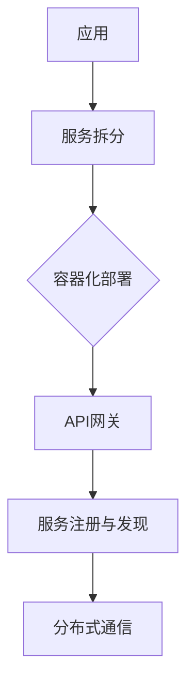
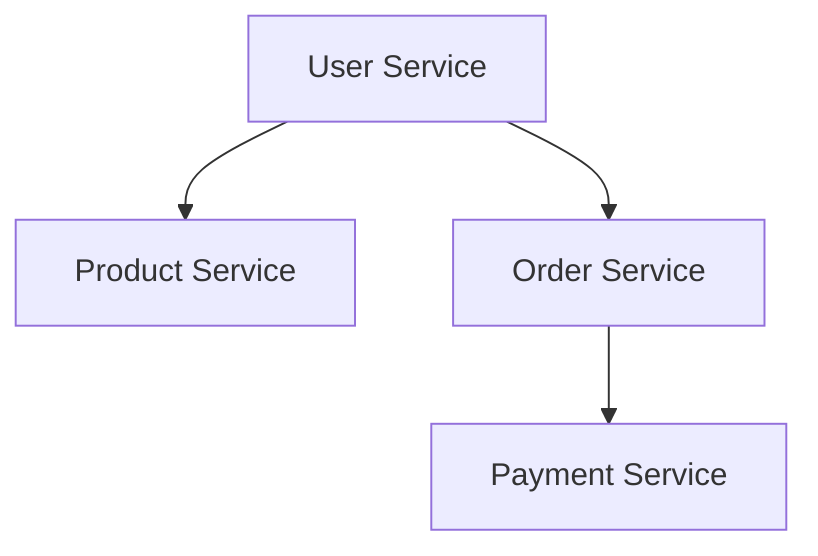

                 

关键词：软件2.0，微服务架构，设计原则，分布式系统，容器化，API网关，持续集成与持续部署（CI/CD）

> 摘要：本文深入探讨了软件2.0时代的微服务架构设计原则、实现方法及其在分布式系统中的应用。通过分析微服务架构的优势与挑战，我们提出了高效的架构设计策略，包括服务拆分、容器化部署、API网关设计等。文章还提供了详细的代码实例和实际应用场景，帮助读者理解微服务架构的实践。

## 1. 背景介绍

在互联网的快速发展中，企业对软件系统的需求发生了巨大变化。传统的单体架构已经无法满足现代应用的复杂性和可扩展性要求。软件2.0时代的到来，催生了微服务架构这一新的设计理念。

微服务架构通过将大型单体应用拆分为一组小型、独立的服务，使得每个服务都可以独立开发、测试和部署。这种架构风格具有高可伸缩性、高容错性、高开发效率等优点，因此被广泛应用于大型分布式系统的构建。

## 2. 核心概念与联系

### 2.1 微服务定义

微服务是一种设计风格，它将应用程序作为一套小的、独立的服务组成，每个服务代表应用程序的一部分功能，并通过轻量级的通信机制（通常是HTTP RESTful API）进行交互。

### 2.2 微服务与分布式系统

微服务架构是分布式系统的一种实现方式。分布式系统由多个节点组成，每个节点运行一个或多个服务实例。微服务架构强调服务的自治性和独立性，这使得分布式系统的管理更加灵活和高效。

### 2.3 微服务架构的联系

- **服务拆分**：将单体应用拆分为多个独立服务。
- **容器化**：使用容器（如Docker）来封装和部署服务，实现环境的一致性。
- **API网关**：提供统一的接口管理和路由，简化服务间的通信。
- **服务注册与发现**：服务实例启动时注册到服务注册中心，其他服务通过服务注册中心来发现和调用服务。

### 2.4 Mermaid 流程图



## 3. 核心算法原理 & 具体操作步骤

### 3.1 算法原理概述

微服务架构的核心在于服务拆分和分布式系统的管理。服务拆分的关键在于如何合理划分服务的边界，确保每个服务具有独立的功能和业务逻辑。分布式系统的管理则涉及到服务注册、服务发现、负载均衡、容错机制等方面。

### 3.2 算法步骤详解

1. **需求分析**：根据业务需求，对单体应用进行功能拆分，确定每个服务的基本功能。
2. **服务定义**：为每个服务编写清晰的接口文档，定义服务之间的通信协议和调用方式。
3. **服务开发**：根据服务定义，独立开发每个服务的业务逻辑。
4. **容器化**：使用容器工具（如Docker）将服务打包成镜像，并定义部署脚本。
5. **服务注册与发现**：服务启动时注册到服务注册中心，其他服务通过服务注册中心发现可用服务。
6. **API网关设计**：设计统一的API接口，提供路由、认证、监控等功能。
7. **持续集成与部署**：使用CI/CD工具（如Jenkins、GitLab CI）实现自动化构建、测试和部署。

### 3.3 算法优缺点

**优点**：
- **高可伸缩性**：服务可以独立扩展，提高系统的整体性能。
- **高容错性**：服务故障不会导致整个系统崩溃。
- **高开发效率**：服务拆分使得开发、测试和部署更加灵活。
- **高可复用性**：服务可以独立开发、部署和扩展，提高开发效率。

**缺点**：
- **复杂度增加**：分布式系统的管理比单体应用更加复杂。
- **通信开销**：服务间通信需要通过网络进行，可能会增加通信开销。
- **一致性保证**：分布式系统的一致性保证比单体应用更难实现。

### 3.4 算法应用领域

微服务架构广泛应用于电子商务、社交媒体、物联网、金融科技等领域，其中典型的应用场景包括：
- **电子商务平台**：将用户服务、商品服务、订单服务、支付服务等拆分为独立的微服务。
- **社交媒体平台**：将用户服务、内容服务、评论服务、推荐服务等拆分为独立的微服务。
- **物联网平台**：将设备管理服务、数据处理服务、消息推送服务等拆分为独立的微服务。

## 4. 数学模型和公式 & 详细讲解 & 举例说明

### 4.1 数学模型构建

在微服务架构中，服务的依赖关系可以用图来表示，其中节点表示服务，边表示服务之间的依赖关系。我们可以使用图论中的最大公约数算法来计算服务的依赖关系。

### 4.2 公式推导过程

设G=(V,E)为服务依赖图，其中V为服务集合，E为服务依赖关系集合。对于每个服务v∈V，我们可以定义一个依赖矩阵D∈R^m×n，其中m和n分别为服务数量和服务的依赖关系数量。依赖矩阵D的第i行j列元素表示服务v_i对服务v_j的依赖程度。

### 4.3 案例分析与讲解

假设一个电子商务系统包含以下服务：
- 用户服务（User Service）
- 商品服务（Product Service）
- 订单服务（Order Service）
- 支付服务（Payment Service）

根据业务需求，我们可以构建服务依赖图如下：



使用最大公约数算法，我们可以计算出每个服务的依赖关系：

```latex
D = \begin{bmatrix}
0 & 1 & 0 & 0 \\
0 & 0 & 1 & 0 \\
1 & 0 & 0 & 1 \\
0 & 0 & 0 & 0
\end{bmatrix}
```

根据依赖矩阵，我们可以得出以下结论：
- 用户服务依赖商品服务。
- 用户服务依赖订单服务。
- 订单服务依赖支付服务。

这些依赖关系对于服务拆分和部署策略的设计具有重要意义。

## 5. 项目实践：代码实例和详细解释说明

### 5.1 开发环境搭建

在本项目实践中，我们使用以下开发工具和软件：
- 语言：Java
- 框架：Spring Boot
- 容器：Docker
- 服务注册与发现：Eureka
- API网关：Zuul

### 5.2 源代码详细实现

以下是一个简单的用户服务（User Service）的代码示例：

```java
@SpringBootApplication
@EnableEurekaClient
public class UserApplication {
    public static void main(String[] args) {
        SpringApplication.run(UserApplication.class, args);
    }
}

@RestController
@RequestMapping("/users")
public class UserController {
    @Autowired
    private UserService userService;

    @GetMapping("/{id}")
    public User getUser(@PathVariable Long id) {
        return userService.getUserById(id);
    }
}
```

### 5.3 代码解读与分析

在上面的代码中，我们使用Spring Boot框架创建了一个简单的用户服务。服务启动时注册到Eureka服务注册中心，提供统一的API接口供其他服务调用。

### 5.4 运行结果展示

运行用户服务后，我们可以在浏览器中访问以下URL来获取用户信息：

```
http://localhost:8080/users/1
```

服务器将返回一个包含用户信息的JSON对象。

## 6. 实际应用场景

### 6.1 电子商务平台

在电子商务平台中，用户服务、商品服务、订单服务和支付服务都可以独立开发、部署和扩展。通过API网关进行统一管理和路由，实现系统的灵活性和可扩展性。

### 6.2 社交媒体平台

在社交媒体平台中，用户服务、内容服务、评论服务、推荐服务等都可以拆分为独立的微服务。通过分布式服务架构，实现高效的数据处理和实时更新。

### 6.3 物联网平台

在物联网平台中，设备管理服务、数据处理服务、消息推送服务等都可以拆分为独立的微服务。通过分布式架构，实现高效的数据收集、分析和处理。

## 7. 工具和资源推荐

### 7.1 学习资源推荐

- 《微服务设计》：通过案例详细讲解了微服务架构的设计原则和实践。
- 《Docker实战》：介绍如何使用Docker容器化部署微服务。
- 《Spring Cloud微服务实战》：深入讲解了Spring Cloud在微服务架构中的应用。

### 7.2 开发工具推荐

- Docker：用于容器化部署微服务。
- Spring Boot：用于快速开发微服务应用程序。
- Eureka：用于服务注册与发现。
- Jenkins：用于持续集成与持续部署。

### 7.3 相关论文推荐

- "Microservices: A definition of a microservices architecture"，Martin Fowler。
- "Building Microservices"，Sam Newman。
- "Container-Based Microservices Architecture"，Philipp Krenn。

## 8. 总结：未来发展趋势与挑战

### 8.1 研究成果总结

微服务架构在分布式系统领域取得了显著的成果，许多企业已经成功应用微服务架构，提升了系统的可扩展性和可维护性。

### 8.2 未来发展趋势

- **服务网格（Service Mesh）**：服务网格作为一种新型架构模式，可以更好地管理服务间通信和分布式系统的监控。
- **云原生（Cloud Native）**：云原生技术将继续推动微服务架构的发展，实现更高效、更灵活的分布式系统部署。
- **智能化管理**：利用人工智能和机器学习技术，实现分布式系统的智能化管理和自动化运维。

### 8.3 面临的挑战

- **服务治理**：服务治理仍然是微服务架构中的一个挑战，如何保证服务的自治性和一致性仍需深入研究。
- **性能优化**：分布式系统的性能优化是一个复杂的问题，如何提高服务间的通信效率和系统整体性能是一个重要的研究方向。
- **安全性**：随着分布式系统的普及，安全性问题变得尤为重要，如何保障系统的安全性和数据隐私是一个关键挑战。

### 8.4 研究展望

未来，微服务架构将继续发展和完善，结合服务网格、云原生、人工智能等新兴技术，实现更高效、更灵活、更安全的分布式系统。同时，研究如何优化服务治理、性能和安全问题，将是我们面临的重大挑战。

## 9. 附录：常见问题与解答

### Q1: 微服务架构与单体架构有什么区别？

**A1：** 微服务架构与单体架构的主要区别在于：
- **系统结构**：微服务架构将应用程序拆分为一组小型、独立的服务，每个服务具有独立的部署和扩展能力；而单体架构则将所有功能集成在一个大型应用程序中。
- **开发模式**：微服务架构采用分布式开发模式，各个服务可以独立开发、测试和部署；而单体架构则采用集中式开发模式，所有功能需要在同一应用程序中实现。
- **部署与维护**：微服务架构可以灵活地部署在不同环境中，方便扩展和故障恢复；而单体架构在部署和维护方面较为复杂。

### Q2: 微服务架构是否一定比单体架构好？

**A2：** 微服务架构并非在所有情况下都优于单体架构。以下情况可能更适合单体架构：
- **项目规模较小**：当项目规模较小时，单体架构可以简化开发、测试和部署流程。
- **业务需求稳定**：当业务需求相对稳定，不需要频繁的扩展和修改时，单体架构可以降低系统的复杂度和维护成本。
- **资源限制**：当资源（如硬件、网络带宽）有限时，单体架构可以减少服务间通信的开销。

### Q3: 微服务架构中的服务拆分应该遵循什么原则？

**A3：** 服务拆分应该遵循以下原则：
- **最小功能单元**：将功能拆分成最小的、独立的单元，确保每个服务具有单一职责。
- **业务边界清晰**：根据业务需求，将相关的功能模块划分为独立的服务，确保服务间的依赖关系合理。
- **独立部署**：服务应具备独立部署的能力，以便在需要时可以独立扩展或维护。
- **可复用性**：服务应具备高可复用性，减少重复代码和功能冗余。

## 结语

软件2.0时代的微服务架构设计是一个复杂而充满挑战的领域。通过本文的介绍，我们了解了微服务架构的设计原则、实现方法及其在分布式系统中的应用。未来，随着新兴技术的不断涌现，微服务架构将继续发展和完善，为分布式系统的构建提供更高效、更灵活、更安全的解决方案。希望本文能为您在微服务架构领域的研究和实践提供有益的参考。

### 作者署名

作者：禅与计算机程序设计艺术 / Zen and the Art of Computer Programming
```

