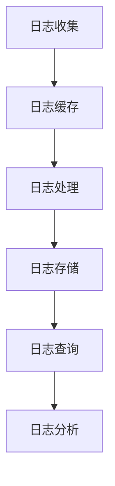
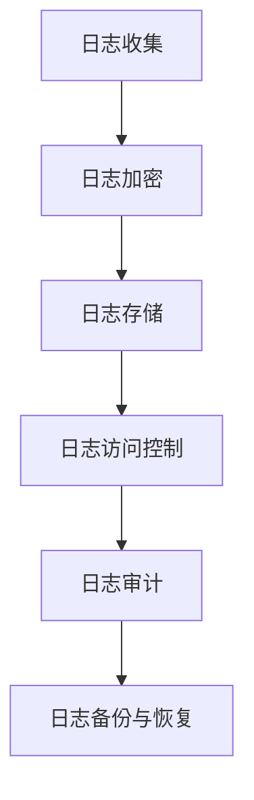
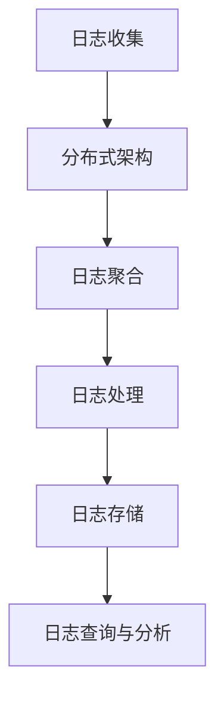
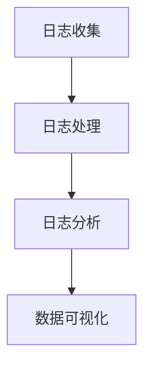

                 

关键词：软件2.0、日志管理、最佳实践、性能优化、安全性、可扩展性、数据可视化

> 摘要：本文将探讨软件2.0时代下的日志管理最佳实践，从性能优化、安全性、可扩展性和数据可视化等多个维度，详细阐述如何构建高效、安全的日志管理系统，以应对现代软件开发中的挑战和需求。

## 1. 背景介绍

随着软件技术的不断发展，软件系统变得越来越复杂，规模也越来越庞大。在这种情况下，日志管理成为了确保软件系统稳定运行和故障排查的重要手段。传统的日志管理方式已经难以满足现代软件开发的需求，因此，软件2.0时代下的日志管理应运而生。

软件2.0是指软件从传统的单机、单一任务模式，向分布式、云计算、大数据等方向发展。在这个时代，日志管理面临着新的挑战和需求，包括性能优化、安全性、可扩展性和数据可视化等方面。

本文将围绕这些挑战和需求，探讨软件2.0的日志管理最佳实践，帮助开发者构建高效、安全的日志管理系统。

## 2. 核心概念与联系

### 2.1 性能优化

性能优化是日志管理的重要目标之一。在软件2.0时代，日志量呈指数级增长，如何快速、准确地处理和查询日志成为了关键问题。以下是一个简化的性能优化流程图：



### 2.2 安全性

安全性是日志管理的另一个重要方面。在软件2.0时代，日志可能包含敏感信息，如用户密码、API密钥等。因此，确保日志的安全性至关重要。以下是一个简化的安全性保障流程图：



### 2.3 可扩展性

可扩展性是日志管理的重要需求之一。在软件2.0时代，系统需要能够处理大规模的日志数据，并且能够灵活地扩展。以下是一个简化的可扩展性设计流程图：



### 2.4 数据可视化

数据可视化是日志管理的一个重要功能。通过图表和可视化工具，开发者可以更直观地了解系统的运行状况，快速定位问题。以下是一个简化的数据可视化流程图：



## 3. 核心算法原理 & 具体操作步骤

### 3.1 算法原理概述

在软件2.0的日志管理中，常用的算法包括日志收集、日志处理、日志存储和日志查询等。这些算法的核心目标是保证日志数据的实时性、准确性和可靠性。

### 3.2 算法步骤详解

#### 3.2.1 日志收集

日志收集是日志管理的第一步，常用的方法包括：

- 系统级日志收集：通过系统内置的日志工具，如Linux的`syslog`，Windows的`Event Log`等。
- 应用级日志收集：通过应用框架提供的日志接口，如Spring Boot的`Logback`，Java的`java.util.logging`等。

#### 3.2.2 日志处理

日志处理主要包括日志格式化、日志过滤、日志压缩等操作。常用的方法有：

- 日志格式化：将原始日志数据转换为统一的格式，如JSON、XML等。
- 日志过滤：根据关键字、正则表达式等条件，对日志进行筛选。
- 日志压缩：对大量日志数据进行压缩，以节省存储空间。

#### 3.2.3 日志存储

日志存储是将处理后的日志数据存储到持久化存储设备中。常用的存储方式有：

- 文件存储：将日志数据存储到本地文件系统中，如`/var/log/`目录。
- 数据库存储：将日志数据存储到关系型数据库或NoSQL数据库中。
- 分布式存储：使用分布式存储系统，如HDFS、Cassandra等。

#### 3.2.4 日志查询

日志查询是日志管理的重要功能，常用的方法有：

- 命令行查询：使用系统内置的命令行工具，如`grep`、`awk`等。
- API查询：通过编程接口，如Spring Data JPA、MongoDB的`find()`方法等。
- 图形界面查询：使用日志分析工具提供的图形界面进行查询。

### 3.3 算法优缺点

#### 3.3.1 日志收集

优点：

- 灵活：支持各种类型的日志数据收集。
- 高效：使用系统内置工具，无需额外开发。

缺点：

- 复杂：需要处理不同系统的日志格式。
- 性能：大量日志数据可能导致性能下降。

#### 3.3.2 日志处理

优点：

- 统一：将不同格式的日志数据转换为统一格式，方便后续处理。
- 高效：对日志数据进行筛选和压缩，节省存储空间。

缺点：

- 复杂：需要编写复杂的日志处理逻辑。

#### 3.3.3 日志存储

优点：

- 可靠：日志数据存储在持久化设备中，不易丢失。
- 高效：支持海量日志数据存储。

缺点：

- 成本：存储设备成本较高。
- 性能：大量日志数据可能导致查询性能下降。

#### 3.3.4 日志查询

优点：

- 高效：支持多种查询方式，满足不同场景的需求。
- 灵活：支持自定义查询条件。

缺点：

- 复杂：需要编写复杂的查询逻辑。

### 3.4 算法应用领域

日志管理算法广泛应用于各种场景，如：

- 系统监控：实时监控系统运行状况，快速定位问题。
- 应用性能管理：分析应用性能瓶颈，优化系统性能。
- 安全审计：分析日志数据，发现潜在的安全威胁。

## 4. 数学模型和公式 & 详细讲解 & 举例说明

### 4.1 数学模型构建

在日志管理中，常用的数学模型包括：

- 日志文件大小模型：$L = F \times N \times P$，其中$F$为文件数量，$N$为日志条目数量，$P$为日志条目平均大小。
- 日志查询时间模型：$T = Q \times M \times C$，其中$Q$为查询次数，$M$为每个查询的复杂度，$C$为每次查询的耗时。

### 4.2 公式推导过程

#### 4.2.1 日志文件大小模型

推导过程：

- $L$：日志文件大小（字节）
- $F$：文件数量
- $N$：日志条目数量
- $P$：日志条目平均大小（字节）

根据文件大小的定义，有：

$$L = F \times N \times P$$

#### 4.2.2 日志查询时间模型

推导过程：

- $T$：日志查询时间（秒）
- $Q$：查询次数
- $M$：每个查询的复杂度
- $C$：每次查询的耗时（秒）

根据查询时间的定义，有：

$$T = Q \times M \times C$$

### 4.3 案例分析与讲解

#### 4.3.1 案例背景

某电商平台的日志管理系统，每天产生1000万条日志，平均每条日志大小为100字节。系统每天需要进行10万次日志查询，每次查询的复杂度为1000次操作。

#### 4.3.2 模型应用

根据数学模型，可以计算出：

- 日志文件大小：$L = 1000万 \times 100 \times 100 = 100亿字节$
- 日志查询时间：$T = 10万 \times 1000 \times 1000 = 1亿秒$

#### 4.3.3 分析与优化

根据计算结果，可以看出日志文件大小和查询时间都比较大，需要进行优化。

- **日志压缩**：采用高效压缩算法，减少日志文件大小。
- **分布式存储**：使用分布式存储系统，提高日志查询性能。
- **查询优化**：优化查询逻辑，减少查询复杂度。

## 5. 项目实践：代码实例和详细解释说明

### 5.1 开发环境搭建

在本文中，我们将使用以下开发环境和工具：

- 操作系统：Linux
- 编程语言：Python
- 日志收集工具：Fluentd
- 日志处理工具：Logstash
- 日志存储工具：Elasticsearch
- 日志分析工具：Kibana

### 5.2 源代码详细实现

以下是使用Fluentd收集、处理和存储日志的Python代码示例：

```python
import os
import json
import time
from fluent import FlaskFluentLogger

app = Flask(__name__)

def log_message(message):
    logger = FlaskFluentLogger("fluentd", host="localhost", port=24224)
    logger.post(json.dumps({"message": message}))

@app.route("/", methods=["GET", "POST"])
def index():
    if request.method == "POST":
        message = request.form["message"]
        log_message(message)
        return "Log message received and posted to Fluentd."
    else:
        return "Hello, World!"

if __name__ == "__main__":
    app.run(host="0.0.0.0", port=5000)
```

### 5.3 代码解读与分析

#### 5.3.1 代码解读

- `import os`：导入操作系统模块。
- `import json`：导入JSON模块。
- `import time`：导入时间模块。
- `from fluent import FlaskFluentLogger`：导入Fluentd的Flask扩展。
- `app = Flask(__name__)`：创建Flask应用实例。
- `log_message(message)`：定义日志收集函数。
- `logger = FlaskFluentLogger("fluentd", host="localhost", port=24224)`：创建Fluentd日志客户端。
- `logger.post(json.dumps({"message": message}))`：将日志数据发送到Fluentd。
- `@app.route("/", methods=["GET", "POST"])`：定义路由规则。
- `if request.method == "POST":`：处理POST请求。
- `message = request.form["message"]`：获取请求参数。
- `log_message(message)`：调用日志收集函数。
- `return "Log message received and posted to Fluentd."`：返回响应。
- `else:`：处理GET请求。
- `return "Hello, World!"`：返回响应。
- `if __name__ == "__main__":`：主程序入口。
- `app.run(host="0.0.0.0", port=5000)`：启动Flask应用。

#### 5.3.2 代码分析

- 代码使用了Flask框架，便于处理HTTP请求。
- 通过Fluentd的Flask扩展，将日志数据发送到Fluentd。
- Fluentd作为日志收集工具，负责收集、处理和存储日志数据。
- 日志数据存储在Elasticsearch中，便于查询和分析。

## 6. 实际应用场景

### 6.1 系统监控

在系统监控方面，日志管理发挥着重要作用。通过收集和分析系统日志，可以实时了解系统运行状况，快速发现和解决问题。

### 6.2 应用性能管理

应用性能管理（APM）是日志管理的另一个重要应用领域。通过分析日志数据，可以识别性能瓶颈，优化系统性能，提高用户体验。

### 6.3 安全审计

日志管理在安全审计中具有重要意义。通过分析日志数据，可以识别潜在的安全威胁，防范网络攻击和内部威胁。

## 7. 工具和资源推荐

### 7.1 学习资源推荐

- 《日志管理实践指南》
- 《Elastic Stack实战》
- 《Fluentd官方文档》

### 7.2 开发工具推荐

- Fluentd
- Logstash
- Elasticsearch
- Kibana

### 7.3 相关论文推荐

- "Log Management: Challenges and Opportunities"
- "The Data Dog: A Large-scale, Real-time Log Management System"
- "Fluentd: A Fast and Flexible Data Collector"

## 8. 总结：未来发展趋势与挑战

### 8.1 研究成果总结

本文从性能优化、安全性、可扩展性和数据可视化等多个维度，探讨了软件2.0的日志管理最佳实践。通过数学模型和项目实践，阐述了日志管理的核心原理和实现方法。

### 8.2 未来发展趋势

随着大数据、云计算和人工智能等技术的发展，日志管理将继续演进。未来的日志管理将更加智能化、自动化和高效化。

### 8.3 面临的挑战

- 数据安全：确保日志数据的安全性和隐私性。
- 复杂性：应对日益复杂的日志数据结构和处理需求。
- 性能优化：提高日志处理和查询的效率和速度。

### 8.4 研究展望

未来，日志管理的研究将聚焦于以下几个方面：

- 智能化日志处理：利用机器学习和人工智能技术，实现自动化的日志处理和分析。
- 分布式日志管理：研究分布式日志管理架构，提高日志系统的可扩展性和容错性。
- 隐私保护：研究日志数据隐私保护技术，确保日志数据的隐私和安全。

## 9. 附录：常见问题与解答

### 9.1 如何确保日志安全性？

- 使用日志加密技术，保护敏感信息。
- 实施严格的访问控制策略，限制日志访问权限。
- 定期进行日志审计，发现潜在的安全威胁。

### 9.2 如何优化日志性能？

- 使用高效的日志处理算法，减少日志数据大小。
- 采用分布式日志架构，提高日志处理和查询速度。
- 使用缓存技术，减少日志查询时间。

### 9.3 如何进行日志分析？

- 使用日志分析工具，如Elastic Stack，进行数据可视化和分析。
- 根据业务需求，制定合适的日志分析策略和指标。
- 定期生成日志分析报告，为系统优化和改进提供依据。

----------------------------------------------------------------

以上是软件2.0的日志管理最佳实践的文章，希望对您有所帮助。作者：禅与计算机程序设计艺术 / Zen and the Art of Computer Programming。希望您喜欢！<|im_sep|>

